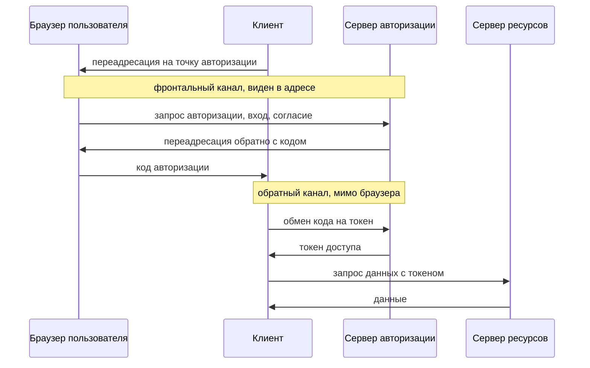

# OAuth 2.0: grant types и роли участников

Вы наверняка нажимали кнопку «Войти через» с логотипом чужого сервиса, а
может, и ставили такую на свой сайт. Вот адрес, на который сервер
авторизации — служба, проверившая вашу личность и выдавшая токен, — вернул
браузер после такого входа в лабе этой темы:

```text
https://client.shop.example/callback#access_token=AT-wiener-7a1c&state=…
```

Посмотрите на часть после решётки. Это токен доступа, ключ к данным
пользователя. Едет он через самое наблюдаемое место в системе: адресную
строку браузера. Адрес попадает в историю браузера, в журналы прокси и в
заголовок Referer при следующем переходе. Протокол, который устраивает такой
вход, называется OAuth 2.0, и эта тема — про него. Главный вопрос звучит так:
как отдать приложению доступ к чужим данным, не отдавая пароль, и почему
способ доставки токена решает здесь почти всё.

## Подумай, прежде чем читать

1. Приложению нужен доступ к вашему списку контактов на другом сайте. Почему
   для этого не приходится отдавать приложению пароль от того сайта?
2. Токен доступа может вернуться приложению двумя путями: прямо в адресе
   браузера или отдельным запросом между серверами. Какой путь безопаснее и
   почему?
3. Вход «через социальную сеть» просит согласие, а не пароль. Что здесь
   передаётся — доступ к данным или подтверждение личности?

## Зачем нужен доступ без пароля

**Откуда это взялось.** До OAuth приложение, которому нужны были ваши данные
на другом сайте, просило пароль от того сайта. Сервис печати фотографий
просил пароль от почты, чтобы найти адреса друзей и разослать приглашения.
Сделка была плохой со всех сторон. Приложение получало всё и навсегда: полный
доступ без ограничений и без отзыва, кроме смены пароля. Пароль вводился на
чужой странице, и ничто не мешало этой странице его сохранить.

OAuth 2.0, оформленный стандартом в 2012 году, разорвал эту сделку. Он ввёл
посредника — сервер авторизации, который выдаёт приложению узкий токен вместо
пароля. Пароль остаётся между пользователем и его сервером. Приложение
получает ровно ту область, на которую пользователь согласился, и токен можно
отозвать, не трогая пароль.

Теперь определение. OAuth 2.0 — протокол делегирования доступа: одно
приложение получает ограниченный доступ к данным пользователя на другом
сайте, не видя его пароля. «Делегирование» здесь значит «передать часть
своих полномочий, оставаясь хозяином». Вместо пароля приложение получает
токен доступа с суженной областью и со сроком. Пароль открыл бы всё и
навсегда, а токен открывает только согласованное и до истечения срока.

Бытовое соответствие — ключ парковщика. У многих машин есть второй ключ: он
открывает дверь и заводит мотор, но не открывает багажник и бардачок. Вы
оставляете машину парковщику и отдаёте ему этот ключ, а не основной.
Соответствие такое:

| в гараже | в OAuth |
|---|---|
| основной ключ | пароль: открывает всё и работает всегда |
| ключ парковщика | токен доступа: часть действий, срок, отзыв |
| «багажник и бардачок закрыты» | область доступа |
| хозяин машины | владелец ресурса, то есть пользователь |
| парковщик | клиент, то есть приложение, которому нужен доступ |

**Где аналогия ломается.** Физический ключ нельзя отозвать на расстоянии, и
срока у него нет; у токена есть и то и другое. И ключ парковщику отдаёте вы
лично, из рук в руки. Токен выдаёт сервер авторизации, а вы лишь подтверждаете
ему своё согласие. Аналогия объясняет сужение прав, но не устройство выдачи.

## Как это работает

### Четыре роли и что между ними ходит

Разговор об OAuth держится на четырёх ролях, которые задаёт стандарт
RFC 6749. Без них описание потока рассыпается, поэтому назовём их сразу.

| роль | кто это | что делает |
|---|---|---|
| владелец ресурса | пользователь | владеет данными, даёт согласие |
| клиент | приложение | хочет доступ к данным от имени владельца |
| сервер авторизации | выдаёт токены | аутентифицирует владельца, выдаёт токен |
| сервер ресурсов | хранит данные | принимает токен, отдаёт данные |

В примере со входом «через социальную сеть» роли расставлены так. Владелец
ресурса — вы. Клиент — сайт, на который вы входите. Сервер авторизации —
служба социальной сети, которая знает ваш пароль и выдаёт токены. Сервер
ресурсов — её же служба, которая хранит ваш профиль и список друзей.

Сервер авторизации и сервер ресурсов бывают одним сервером или разными. Один
сервер авторизации может выдавать токены, которые принимает несколько
серверов ресурсов. Клиент — это приложение, и где оно исполняется, роли не
определяет: клиентом бывает и серверное приложение, и страница в браузере, и
программа на телефоне.

Между ролями ходит не пароль, а промежуточные ценности. Согласие пользователя
превращается в грант авторизации (authorization grant) — удостоверение, что
владелец разрешил доступ. Грант клиент меняет на токен доступа и им
обращается к серверу ресурсов. Способ, которым клиент получает токен,
называется типом потока (grant type). Стандарт определяет несколько типов, и
выбор типа решает, безопасен ли поток.

### Область и согласие

Ключевое отличие OAuth от «отдай пароль» — суженная область (scope). Это
перечень того, что разрешено: «читать контакты», «смотреть профиль», но не
«писать от моего имени». Клиент в запросе называет, к чему ему нужен доступ.
Сервер авторизации показывает этот перечень пользователю и спрашивает
согласие: тот самый экран «приложение просит доступ к…», который вы видели у
социальных сетей.

Пользователь видит, что именно разрешает, и вправе отказать. Токен несёт
ровно согласованную область, а сервер ресурсов сверяет её на каждый запрос.
Отсюда правило ревью: область просят по минимуму, а не с запасом. Утёкший
токен открывает ровно свою область, и чем она шире, тем дороже утечка.

### Поток кода авторизации: два канала

Действующий поток называется потоком кода авторизации (authorization code
flow). Он проходит в два канала, и это ключ ко всей теме. Фронтальный
канал — всё, что идёт через браузер пользователя и видимо в адресе. Обратный
канал — прямой запрос от клиента к серверу авторизации, мимо браузера.

Разница между каналами — в наблюдателях. Фронтальный канал похож на открытку,
которую передают через руки посредника: посредник её видит и запоминает.
Обратный канал — звонок между двумя организациями напрямую, посредника в нём
нет. Аналогия ломается на шифровании: и открытку, и звонок защищает TLS,
поэтому подслушать сеть не выйдет. Но адрес помнят не только сети: его помнит
сам браузер, расширения, прокси и следующий сайт, куда ведёт ссылка со
страницы.

Шаги потока такие:

1. Клиент отправляет пользователя на сервер авторизации с запросом: свой
   `client_id`, `redirect_uri`, `response_type=code`, `scope` и `state`. Это
   фронтальный канал.
2. Сервер авторизации аутентифицирует пользователя и спрашивает согласие на
   запрошенную область.
3. Сервер авторизации переадресует браузер обратно на адрес клиента, добавив
   в адрес код авторизации — короткоживущее одноразовое значение. Тоже
   фронтальный канал, но в адресе едет код, а не токен.
4. Клиент по обратному каналу предъявляет код серверу авторизации и получает
   в ответ токен доступа. Этот запрос идёт от сервера к серверу, и браузер
   его не видит. Если клиент — страница в браузере, запрос обмена делает её
   скрипт, но и тогда токен приходит в теле ответа, а не в адресной строке.
5. Клиент предъявляет токен доступа серверу ресурсов и получает данные.

Четыре параметра первого шага стоит назвать по имени, они встретятся дальше.
`client_id` — имя, под которым клиент известен серверу авторизации.
`redirect_uri` — адрес клиента, куда вернуть браузер. `response_type` — тип
потока: что клиент ждёт в ответе, код или токен. `state` — случайное
значение, которое клиент вкладывает в запрос и сверяет в ответе; оно
привязывает ответ к этому конкретному запросу.



**Описание схемы.** Схема читается сверху вниз. Первые четыре сообщения идут
фронтальным каналом через браузер: запрос авторизации и возврат с кодом.
Следующие два идут обратным каналом напрямую от клиента к серверу
авторизации: туда уезжает код, обратно приходит токен. Последние два —
обращение клиента к серверу ресурсов уже с токеном.

Смысл разделения каналов — в обмене. Токен доступа не проходит через браузер:
он приходит по обратному каналу, невидимому истории, журналам и заголовку
Referer. Через браузер идёт лишь код — короткоживущий, одноразовый и
бесполезный без обмена.

Почему это так важно, видно из угроз. Всё, что проходит фронтальным каналом,
проходит через машину пользователя и через всё, что стоит на пути адреса. Это
расширения браузера, прокси, журналы и следующий сторонний сайт в заголовке
Referer. Академия PortSwigger прямо отмечает: при некоторых потоках
чувствительные данные идут через браузер, и это открывает атакующему
возможности их перехватить. Поток кода уводит с этого канала самое ценное —
токен. Оттого разбор атак на OAuth сводится к двум вопросам: что идёт по
фронтальному каналу и чем это привязано к своему инициатору.

### Неявный поток: токен сразу в адресе

Раньше был короткий путь — неявный поток (implicit grant,
`response_type=token`). Сервер авторизации возвращал токен доступа сразу в
адресе переадресации, без шага обмена. Именно его вы видели в первом адресе
этой темы: `access_token` после решётки — это токен, выданный фронтальным
каналом.

RFC 9700, действующий свод практик безопасности OAuth (Best Current
Practice), предписывает клиентам неявный поток не использовать. Причина не в
моде. Токен в адресе уходит по фронтальному каналу и оседает в истории и
журналах. Стандартного способа привязать его к клиенту нет, поэтому
украденный токен работает у атакующего. Действующий выбор — поток кода.

### Парольный грант: пароль через клиента

Второй устаревший путь — парольный грант (resource owner password
credentials). Пользователь отдаёт клиенту логин и пароль от сервера
авторизации, а клиент меняет их на токен. Свод практик запрещает его прямо,
формулировкой «MUST NOT be used».

Причины те же, что и у исходной сделки «отдай пароль». Грант проводит пароль
владельца через клиента, расширяет места утечки и приучает пользователя
вводить пароль не на сервере авторизации. Кроме того, он не рассчитан на
второй фактор и многошаговый вход: там, где нужно ещё одно действие
пользователя, этот грант не работает по устройству.

Оба устаревших пути объединяет одно. Они срезают шаг обмена или шаг
посредника ради кажущегося удобства. Платят за это тем, что секрет — токен
или пароль — проходит там, где его перехватят. Поток кода этот срез
разворачивает обратно, возвращая обмен по обратному каналу.

### Как узнать OAuth в трафике

Опознать OAuth на ревью несложно. Академия PortSwigger называет верный
признак: первый запрос потока всегда идёт на конечную точку авторизации и
несёт характерные параметры. Конечная точка авторизации (authorization
endpoint) — адрес сервера авторизации, куда браузер отправляется начинать
поток. Увидев в трафике запрос вида
`GET /authorize?client_id=…&redirect_uri=…&response_type=…`, вы смотрите на
начало потока OAuth.

Внешнего провайдера выдаёт имя хоста, на который уходит этот запрос. Его
метаданные часто лежат по стандартным адресам `/.well-known/openid-configuration`
и `/.well-known/oauth-authorization-server`. Метаданные — это документ, где
провайдер перечисляет свои конечные точки и поддерживаемые потоки. С него
начинается разбор конкретной интеграции.

Порядок разбора отсюда прямой. Сначала находят запрос авторизации и читают в
нём `response_type`: `code` или устаревший `token`. Потом смотрят, идёт ли
рядом `state` и обмен кода по обратному каналу или токен приходит сразу в
адресе. Затем проверяют область `scope`: сужена она или взята с запасом. Три
наблюдения снимают большую часть вопросов к интеграции ещё до разбора
отдельных атак.

**Зачем это в работе AppSec-инженера.** Первый вопрос к любой интеграции
OAuth: какой тип потока выбран и по какому каналу — фронтальному или
обратному — ходит токен доступа. Ответ читается в параметрах запроса
авторизации, без запуска и без исходников провайдера. Всё дальнейшее в теме —
развёртка этого вопроса.

### Делегирование и вход — не одно и то же

OAuth задуман для делегирования доступа: «дай приложению доступ к моим
контактам». Но тот же поток приспособили для входа — «войти через социальную
сеть». Академия PortSwigger подчёркивает разницу: механика та же, отличается
то, как клиент использует полученные данные.

При делегировании клиент спрашивает «что мне разрешено взять» и получает
токен доступа к данным. При входе клиент спрашивает «кто этот пользователь».
Он идёт с токеном на конечную точку вроде `/userinfo`, получает идентификатор
пользователя и подставляет его вместо логина. Токен доступа при этом нередко
используют как замену пароля, хотя он для этого не предназначен. Он говорит
«предъявителю разрешён доступ», а не «это тот самый пользователь».

Эта натяжка — источник отдельного класса дефектов, разобранного в теме
`oauth-attacks`. Голый OAuth не был рассчитан на подтверждение личности. Для
этого поверх него построен OpenID Connect — надстройка, которая добавляет
отдельное поле `id_token`, подписанное утверждение о том, кто вошёл. Ей
посвящена тема `oidc`. Пока подтверждение личности держится на одном токене
доступа, вход через OAuth стоит на песке.

Границы темы здесь уместно назвать ещё раз. Формат токена разобран в
`jwt-basics`, сроки и отзыв — в `token-lifetime-revocation`. Дефекты самого
потока — в `oauth-attacks`. Здесь они не дублируются.

## Как это атакуют

Стенд — лаба этой темы, `pilot/lab/oauth-basics`. Приложение входит через
внешний сервер авторизации. Сеть не поднимается: сервер авторизации
смоделирован функцией, которая по запросу возвращает переадресацию обратно
клиенту. Клиент собран на неявном потоке. Прогон эксплойта (вывод сокращён:
опущены строка цели и итог):

```text
$ python hack.py
  опыт 1 — токен доступа в адресе переадресации: ВИДЕН во фрагменте
  опыт 2 — запрос авторизации просит response_type: 'token' (неявный поток)
  опыт 3 — контроль, вход wiener даёт токен: да
```

Опыт 1 разбирает адрес, на который сервер авторизации переадресовал браузер,
— тот самый адрес из начала темы. Токен доступа лежит во фрагменте, в части
адреса после решётки. Всё, что попадает в адрес, остаётся на машине
пользователя: в истории браузера, в журналах прокси и в заголовке Referer при
следующем переходе.

Опыт 2 показывает корень: запрос авторизации просит `response_type=token`.
Тип потока выбирает клиент, и выбран неявный. Дефект не в сервере авторизации
и не в украденном значении, а в решении клиента, принятом одной строкой
запроса. Чинится он там же.

Опыт 3 — контроль на живучесть. Вход обязан работать и после перевода на
поток кода, иначе починка сломала само приложение.

Цена утечки здесь — не один сеанс. Токен доступа открывает всю область, на
которую пользователь согласился, и работает у любого, кто его предъявит:
стандартной привязки к клиенту у неявного потока нет. Адрес с токеном
переживает вкладку. Он остаётся в истории браузера и в журналах прокси между
клиентом и сервером. Он уходит в заголовке Referer на следующий сторонний
ресурс. Один невидимый пользователю переход — и токен утёк туда, куда
пользователь не смотрел.

Опыт 2 сводит правило темы к одной строке запроса: тип потока выбирает канал,
а канал решает, кто увидит токен. Остаётся вопрос. В потоке кода через
браузер едет код авторизации, и его тоже видно в адресе. Почему его утечка
обходится дешевле утечки токена? Ответ — в разделе «Как защититься».

## Как это выглядит в коде

Ревьюер смотрит на запрос авторизации: какой тип потока просит клиент. До
чтения перечня признаков попробуйте отметить их в листинге сами.

```python
# ФРАГМЕНТ — срез, самостоятельно не компилируется
# УЯЗВИМО — демонстрация, не для продакшена
params = {
    "client_id": CLIENT_ID,
    "redirect_uri": REDIRECT_URI,
    "response_type": "token",          # неявный поток: токен в адресе
    "scope": "openid profile",
    "state": "s-8842",
}
```

Признаков два, и оба на виду. `response_type=token` в запросе авторизации —
неявный поток. `grant_type=password` в запросе токена — парольный грант, где
через клиент идёт пароль пользователя. Оба — устаревшие типы, прямо названные
в своде практик. Ревьюеру достаточно найти их в запросе: это не тонкая
логическая ошибка, а прямой выбор устаревшего пути, видимый одним значением
параметра.

**Тот же дефект на другом стеке.** В конфигурации клиентской библиотеки он
выглядит настройкой:

```javascript
// ФРАГМЕНТ — срез, самостоятельно не компилируется
// УЯЗВИМО — демонстрация, не для продакшена
const oauth = { responseType: "token", scope: "profile" };
```

Инвариант — «клиент просит токен во фронтальном канале»; декорация — язык и
то, собран ли запрос строкой параметров или полем настройки. Один и тот же
дефект прячется и в явном словаре параметров, и в объекте конфигурации
библиотеки, и в шаблоне адреса. Искать надо значение `response_type`, а не
конкретную его запись.

**Где ревьюер ошибается.** Фрагмент с токеном в адресе — не всегда неявный
поток клиента: так же выглядит перехваченный чужой ответ. Смотреть надо на
то, что клиент просит в запросе авторизации, а не только на то, что пришло.

## Как защититься

Правило одно: клиент просит поток кода, а токен доступа получает обменом по
обратному каналу.

```python
# ФРАГМЕНТ — срез, самостоятельно не компилируется
# Исправлено: поток кода авторизации.
params = {
    "client_id": CLIENT_ID,
    "redirect_uri": REDIRECT_URI,
    "response_type": "code",           # через браузер идёт код, не токен
    "scope": "openid profile",
    "state": "s-8842",
}
# токен доступа — отдельным запросом сервер-сервер по обратному каналу:
token = exchange_code(code)
```

Теперь через браузер идёт код авторизации, а токен приходит обменом кода,
мимо браузера. Свод практик предписывает именно это: клиент использует
`response_type=code` и получает токены в ответе конечной точки токена, а не в
ответе авторизации. Стандарт проверки ASVS требует того же в пункте
v5.0-10.4.4.

Термины здесь стоит развести. Конфиденциальный клиент — тот, кто может
хранить секрет: серверное приложение. Публичный — тот, кто не может: страница
в браузере, программа на телефоне; всё, что в них зашито, извлекается. Секрет
клиента — пароль самого приложения на сервере авторизации, и им
конфиденциальный клиент подтверждает обмен кода.

Здесь и ответ на вопрос из разбора атаки: почему утечка кода дешевле утечки
токена. Код короткоживущий и одноразовый. Сам по себе он ничего не открывает:
чтобы получить токен, его надо предъявить на обмен. Обмен идёт по обратному
каналу и у конфиденциального клиента подтверждается секретом. Перехвативший
код без возможности пройти обмен получает строку, срок которой истечёт
раньше, чем он ей воспользуется. Токен же работает у любого предъявителя
сразу.

**Границы применимости.** Один поток кода полной защиты не даёт. Публичный
клиент обязан добавить к нему PKCE (Proof Key for Code Exchange) — привязку
обмена к инициатору. Устроена она так: клиент в начале потока показывает хэш
придуманного секрета, а при обмене предъявляет сам секрет. Перехваченный код
без секрета обменять нельзя. Параметр `state` и точную сверку `redirect_uri`
тоже держат отдельно; это предмет темы `oauth-attacks`.

**Что добавляется поверх.** Токен доступа держат коротким, область —
суженной, а для входа поверх OAuth ставят OpenID Connect с полем `id_token`.
Обмен кода конфиденциальный клиент подтверждает своим секретом, публичный —
параметром PKCE. Без этой привязки код, перехваченный на фронтальном канале,
обменяет кто угодно. Всё это — предписания свода практик, читаемые вместе с
потоком, а не вместо него.

## Как убедиться, что защита работает

Ретест повторяет опыты эксплойта против исправленного модуля и добавляет
контроль на живучесть. Вывод сокращён так же: опущены строка цели и итог.

```text
$ LAB_TARGET=solution.py python hack.py
  опыт 1 — токен доступа в адресе переадресации: нет в адресе
  опыт 2 — запрос авторизации просит response_type: 'code' (поток кода)
  опыт 3 — контроль, вход wiener даёт токен: да
```

Токен ушёл из адреса, поток стал кодом, вход работает. Функциональность
держат четыре теста лабы: запрос несёт `client_id` и `state`, а вход `wiener`
и `administrator` выдаёт клиенту его токен доступа. Все четыре зелёные и на
уязвимом коде, и на решении: тема меняет канал доставки токена, а не сам факт
входа.

На ревью пройдите по списку.

1. Проверьте, что клиент запрашивает `response_type=code`, а не `token`
   (ASVS v5.0-10.4.4).
2. Проверьте, что парольный грант (`grant_type=password`) не используется
   нигде.
3. Проверьте, что токен доступа приходит клиенту обменом кода по обратному
   каналу, а не в адресе переадресации.
4. Проверьте, что публичный клиент применяет PKCE поверх потока кода.
5. Проверьте, что запрошенная область (`scope`) сужена до необходимого, а не
   берётся с запасом.
6. Проверьте, что при входе через OAuth личность подтверждается полем
   `id_token` надстройки OpenID Connect, а не одним токеном доступа.

## Как это находят инструменты

Статический анализ (Static Application Security Testing, SAST) читает код,
не запуская его, и ищет характерные записи. Правило этой темы написано на
запрос устаревшего типа потока: параметры `"response_type": "token"` и
`"grant_type": "password"`, записанные литералом.

Правило целиком лежит в `pilot/semgrep/oauth-implicit-grant.yaml`, и оно
сверено прогоном: на уязвимом файле лабы одна находка, на решении ноль, на
пяти размеченных тест-кейсах расхождений нет.

**Чего это правило не ищет.** Оно ловит тип потока, объявленный литералом.
Если `response_type` собран из переменной или пришёл из настройки в файле,
правило его не увидит: значения нет в самом вызове. И оно не судит о защите
потока кода — есть ли рядом `state` и PKCE. Это предмет соседней темы и
другого правила.

**Какой шум даст.** Строку `"response_type": "token"` в тесте или в разборе
чужого ответа правило тоже пометит: отличить запрос клиента от разбора
входящего по одному словарю нельзя.

**Что здесь сильнее автоматики.** Тип потока виден в одном запросе
авторизации, и человек читает его за секунду вместе с тем, есть ли рядом
`state` и обмен кода. Правило годится как сеть на устаревший литерал, а не
как оценка всей интеграции.

## Частая ошибка

Часто слышно: неявный поток — нормальный вариант OAuth, он же в спецификации,
и для одностраничных приложений так проще. Скажите себе сразу, не сверяясь с
разбором: «есть в спецификации» и «можно выбирать сегодня» — одно и то же?

**Неявный поток объявлен устаревшим, и «проще» здесь значит «токен через
браузер».** Свод практик предписывает клиентам его не использовать. Причина
не в моде. Токен доступа, вернувшийся в адресе, оседает в истории и журналах.
Привязать его к клиенту стандартным способом нельзя, и украденный токен
работает у чужого. Для одностраничных приложений действующий ответ — поток
кода с PKCE, а не неявный поток.

Контрпример из прогона — опыт 1. Токен виден прямо в адресе переадресации ещё
до того, как приложение что-либо с ним сделало. Он уже там, где адреса
сохраняются. «Работает» и «безопасно» здесь расходятся. Неявный поток
исполняется браузером без ошибок, но работоспособность приёма не делает его
защищённым: она лишь откладывает цену утечки до первого сохранённого адреса.

## Попробуй сам

Лаба `lab-oauth-basics`, каталог `pilot/lab/oauth-basics`. Формат «почини»:
правится `code.py`, пока `hack.py` и `tests.py` не станут зелёными
одновременно. Всё локально: сервер авторизации смоделирован функцией, сети
нет.

```bash
cd pilot/lab/oauth-basics
../../../.venv-tools/bin/python hack.py    # против code.py: сработает
../../../.venv-tools/bin/python tests.py   # функциональность: упало 0
```

**Цель одной фразой:** добиться, чтобы `hack.py` вышел с кодом 0, а
`tests.py` продолжил выходить с кодом 0.

Подсказка одна: дефект в типе потока. Неявный поток кладёт токен в адрес;
поток кода отправляет через браузер только код, а токен клиент берёт обменом
кода по обратному каналу. Задача — перевести запрос авторизации на
`response_type=code`, не сломав вход. Образец починки лежит в `solution.py` и
открывается после своей попытки.

Сверка решения идёт тем же эксплойтом против образца:
`LAB_TARGET=solution.py ../../../.venv-tools/bin/python hack.py` — опыт 1
отвечает «нет в адресе», а контроль входа остаётся на месте.

**Критерий выполнения.** Против вашего `code.py` эксплойт `hack.py` выходит
с кодом 0, а все четыре теста `tests.py` остаются зелёными. Зелёный тест
значит: запрос несёт `client_id` и `state`, а вход `wiener` и `administrator`
выдаёт токен.

## Проверь себя

1. В трафике интеграции нашёлся запрос токена:

   ```http
   POST /token HTTP/1.1
   Host: auth.provider.example
   Content-Type: application/x-www-form-urlencoded

   grant_type=password&username=anna&password=•••&client_id=shop-web
   ```

   Какой грант здесь работает и что он проводит там, где проводить не должен?

2. Запрос авторизации из раздела «Как это выглядит в коде» просит неявный
   поток:

   ```python
   # ФРАГМЕНТ — срез, самостоятельно не компилируется
   params = {
       "client_id": CLIENT_ID,
       "redirect_uri": REDIRECT_URI,
       "response_type": "token",
       "scope": "openid profile",
       "state": "s-8842",
   }
   ```

   Какую починку вы выберете?

   A. Оставить `response_type="token"`, но стирать токен из адреса сразу
      после чтения и хранить его в `sessionStorage`.

   B. Перевести клиента на `response_type="code"`: через браузер идёт
      одноразовый код, а токен приходит обменом по обратному каналу.

   C. Перейти на парольный грант: токен вообще не появится в браузере.

3. Вход «через социальную сеть» построен на OAuth. Что здесь делегируется —
   доступ к данным или подтверждение личности, и почему одного токена доступа
   для этого мало?
4. Лаба собрана на неявном потоке. Предскажите, что напечатает `hack.py`
   против уязвимого кода и что изменится на решении.
5. Возврат к теме `sessions-vs-tokens`: чем токен доступа OAuth похож на
   самодостаточный токен и чем от него отличается по назначению?
6. Возврат к теме `app-architecture`: почему всё, что уехало на клиент,
   считается доступным атакующему, и что это значит для токена в адресе
   браузера?

<details markdown="1">
<summary>Ответ 1</summary>

1. Парольный грант: пользователь отдал клиенту логин и пароль от сервера
   авторизации, и тот меняет их на токен. Пароль проходит через клиента —
   лишнее место утечки — и приучает вводить его не на сервере авторизации.
   Со вторым фактором и многошаговым входом грант не работает по устройству.
   Свод практик запрещает его формулировкой MUST NOT. Ответ OAuth на ту же
   задачу — токен суженной области вместо пароля: приложение получает
   согласованное и отзываемое, а пароль остаётся между пользователем и его
   сервером.

</details>

<details markdown="1">
<summary>Ответ 2: разбор вариантов</summary>

2. Верный ответ — B.

   A. Стирание адреса не отменяет доставку: токен уже проехал фронтальным
      каналом — историю браузера, журналы прокси, заголовок Referer при
      следующем переходе. Привязать такой токен к клиенту стандартным
      способом нельзя, и украденный работает у чужого.

   B. Через браузер идёт короткоживущий одноразовый код, бесполезный без
      обратного обмена, а токен доступа приходит от сервера к серверу, мимо
      браузера. Ретест лабы: `LAB_TARGET=solution.py python hack.py`
      отвечает «нет в адресе», и вход при этом работает.

   C. Токен в браузере действительно не появится — ценой пароля владельца,
      проведённого через клиент. Это замена утечки токена на утечку пароля,
      и грант запрещён тем же сводом практик.

</details>

<details markdown="1">
<summary>Ответ 3</summary>

3. Делегируется подтверждение личности: клиент по токену запрашивает у
   сервера ресурсов идентификатор пользователя и подставляет его вместо
   логина. Токен доступа для этого не предназначен: он говорит «предъявителю
   разрешён доступ», а не «это тот самый пользователь». Поэтому поверх OAuth
   для входа ставят OpenID Connect с отдельным `id_token`.

</details>

<details markdown="1">
<summary>Ответ 4</summary>

4. Против `code.py`: «токен доступа в адресе переадресации: ВИДЕН во
   фрагменте» и «response_type: 'token'». Против решения: «нет в адресе» и
   «response_type: 'code'», контроль входа зелёный в обоих случаях.
   Проверяется прогоном: `cd pilot/lab/oauth-basics && python hack.py`,
   затем `LAB_TARGET=solution.py python hack.py`.

</details>

<details markdown="1">
<summary>Ответ 5</summary>

5. Токен доступа тоже носит проверяемое утверждение о правах и часто оформлен
   как JWT. Но назначение у него — доступ к ресурсу от имени владельца, а не
   сессия пользователя в приложении.

</details>

<details markdown="1">
<summary>Ответ 6</summary>

6. Часть системы работает на машине пользователя, и контроля над ней у
   приложения нет: что уехало на клиент, то доступно атакующему целиком.
   Токен в адресе браузера уехал на клиент — значит, он считается увиденным.

</details>

## Источники

1. RFC 6749, «The OAuth 2.0 Authorization Framework»; реестр
   `rfc6749-oauth2`. Разделы: 1.1 Roles, 1.2 Protocol Flow, 1.3 Authorization
   Grant, 4.1 Authorization Code Grant.
   <https://www.rfc-editor.org/rfc/rfc6749.html>
2. PortSwigger Web Security Academy, «OAuth 2.0 authentication
   vulnerabilities»; реестр `ps-oauth`. Разделы: What is OAuth, How does
   OAuth 2.0 work, OAuth authentication, Identifying OAuth authentication.
   <https://portswigger.net/web-security/oauth>
3. RFC 9700, «Best Current Practice for OAuth 2.0 Security»; реестр
   `rfc9700-oauth-bcp`. Разделы: 2.1.1 Authorization Code Grant, 2.1.2
   Implicit Grant, 2.4 Resource Owner Password Credentials Grant.
   <https://www.rfc-editor.org/rfc/rfc9700.html>

Каркас этапа: `owasp-asvs-5-document` (ASVS v5.0.0), `owasp-wstg-42`,
`owasp-top10-2025`. Наследуются всеми темами и отдельной строкой не
повторяются.

**Скоропортящийся слой.** Статус грантов задаёт действующий BCP: неявный и
парольный уже объявлены устаревшими, и черновики OAuth 2.1 закрепляют это.
Названия конечных точек и точный набор параметров зависят от провайдера и его
метаданных.

**Маркеры уверенности.** Появление токена во фрагменте адреса при неявном
потоке и его отсутствие при потоке кода — **проверено лично** 2026-08-24 на
Python 3.14.7 (стенд `hack.py` лабы): неявный поток возвращает токен во
фрагменте переадресации, поток кода отдаёт код в строке запроса, а токен
приходит обменом по обратному каналу; правило SAST даёт одну находку на
уязвимом файле и ноль на решении; четыре теста функциональности зелёные в
обоих случаях. Четыре роли, шаги потока кода и разбор входа через OAuth —
**по документации** (RFC 6749 и Web Security Academy, открыты лично
2026-08-24). Запрет неявного и парольного грантов — **по документации**
(RFC 9700, § 2.1.2 и § 2.4, открыт лично 2026-08-24). Полный обмен кода с
сервером провайдера и PKCE в лабе **не воспроизводились**: сервер авторизации
смоделирован функцией, а не поднят. При переписывании темы 2026-10-03 прогоны
повторены без сети: `hack.py` и `tests.py` против `code.py` и `solution.py`
дали те же исходы, а сверка правила `oauth-implicit-grant` — одна находка на
уязвимом файле, ноль на решении и пять из пяти размеченных тест-кейсов.
