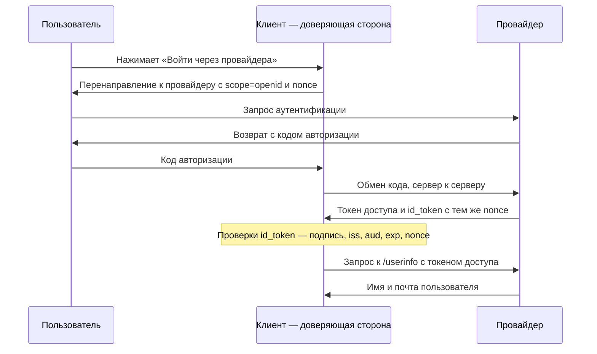

# OpenID Connect

Приложение подключает вход «через провайдера». Поток OAuth из темы
`oauth-basics` отработал: пользователь согласился, браузер вернулся с кодом
авторизации, клиент обменял его на токены. Но ответ сервера авторизации
выглядит не так, как в той теме: токенов в нём два.

**Ответ сервера авторизации на обмен кода (значения токенов сокращены)**

```json
{
  "access_token": "eyJhbGciOiJSUzI1NiIs…",
  "token_type": "Bearer",
  "expires_in": 3600,
  "id_token": "eyJraWQiOiJ6aHNvUTdV…"
}
```

Первый — знакомый токен доступа, ключ к данным пользователя. Второй,
`id_token`, — то, чего у голого OAuth нет: подтверждение личности того, кто
вошёл. OpenID Connect (OIDC) — тонкая надстройка над OAuth, которая
достраивает этот второй ответ, не меняя сам поток.

## На какой вопрос OAuth не отвечает

Два токена нужны потому, что это ответы на разные вопросы. Токен доступа
отвечает на вопрос «что предъявителю разрешено»: сервер ресурсов смотрит на
него и решает, отдавать ли данные. О личности предъявителя он не говорит
ничего. Для входа приложению нужен другой ответ: кто перед нами, и правда
ли он только что вошёл у провайдера.

Разницу видно на гостевом браслете отеля. Браслет отвечает на вопрос «что
носителю разрешено»: бар, пляж, тренажёрный зал. Кто именно его носит, по
браслету не узнать, и его спокойно передают другому человеку. Паспорт
отвечает на другой вопрос: кто этот человек. Здесь браслет соответствует
токену доступа, а паспорт — тому, что добавляет надстройка. Аналогия
ломается на предъявлении: `id_token` клиент читает один раз сам и никому не
показывает, а носит и предъявляет везде браслет — токен доступа.

Токен доступа не подходит на роль паспорта по устройству. Он не адресован
клиенту как удостоверение личности: обязательного утверждения `aud` на
клиента у него нет, и с запросом входа он не связан. Поэтому фраза, которую
из него читают, звучит так: «предъявителю разрешён доступ». А не так: «это
тот самый пользователь, который только что вошёл».

**Откуда это взялось.** OAuth 2.0 задуман для делегирования доступа, и сама
спецификация OpenID Connect пишет прямо: без надстройки OAuth не способен
сообщить, что пользователь аутентифицирован. Вход был нужен всё равно, и его
строили на токене доступа, подставляя его вместо подтверждения личности.
OpenID Connect закрыл эту натяжку стандартом: тот же поток кода авторизации,
но с областью `openid` и отдельным `id_token`.

## Как это работает

Надстройка добавляет к потоку из темы `oauth-basics` два новых имени и одно
поле. Сервер авторизации, который умеет OpenID Connect, называется
провайдером (OpenID Provider). Клиент называется доверяющей стороной
(Relying Party), потому что полагается на утверждение провайдера о личности.
Поле — это область `openid` в запросе авторизации: ею клиент просит не только
доступ, но и подтверждение личности.

Ответом на такую просьбу служит второй токен. `id_token` — подписанный JWT,
его устройство и проверку подписи разбирает тема `jwt-basics`. Внутри —
утверждения о входе: `iss` (кто выдал), `sub` (какой пользователь вошёл),
`aud` (кому адресован токен), `exp` (до когда он действует). Поле `aud`
здесь обязано содержать идентификатор самого клиента, и в этом разница с
токеном доступа.

Доверять утверждениям клиент начинает только после проверки. Спецификация
назначает доверяющей стороне ряд проверок `id_token`, и главных из них пять:

1. Подпись токена проверена по ключам провайдера.
2. Поле `iss` совпало с ожидаемым провайдером.
3. Поле `aud` содержит идентификатор самого клиента.
4. Срок `exp` не вышел.
5. Одноразовая метка `nonce` совпала с посланной в запросе.

### Зачем токену nonce

Пятая проверка закрывает отдельную атаку. Повторным проигрыванием называют
предъявление перехваченного сообщения ещё раз: сообщение настоящее, и
принимающая сторона не отличает его от свежего. Бытовой пример — пароль у
охраны на входе: его подслушали один раз и пользуются каждый день, ведь он
настоящий. Защита — одноразовый вопрос: охрана каждый раз называет новое
число, и входящий обязан его повторить. Здесь число соответствует `nonce`,
а повторение числа — сверке. Ломается аналогия на хранении: число охраны
живёт только в разговоре, а `nonce` возвращается внутри подписанного токена,
и подменить его по дороге нельзя.

Устроен параметр так. Клиент придумывает случайное значение и кладёт его в
запрос аутентификации. Провайдер обязан вернуть его неизменным внутри
`id_token`, а клиент — сверить присланное с посланным. Чужой `id_token`,
выписанный на другой вход, такую сверку не пройдёт: его `nonce` не совпадёт
с тем, что клиент послал в этом запросе.

Тем же приёмом параметр `state` из темы `oauth-attacks` связывает ответ
провайдера с сессией того, кто начал вход. Разница в уровне: `state` живёт в
запросе и ответе, а `nonce` зашит в сам токен. Поэтому `state` закрывает
подделку ответа, а `nonce` — проигрывание самого `id_token`.

### Как выглядит поток целиком



**Описание схемы.** Схема читается сверху вниз и повторяет поток кода
авторизации из темы `oauth-basics` с двумя добавками надстройки. В запросе к
провайдеру едут область `openid` и значение `nonce`. В ответе на обмен кода
приходят два токена: доступа и `id_token` с тем же `nonce` внутри. Заметка
на схеме перечисляет главные проверки `id_token`: только после них клиент
доверяет личности. За именем и почтой пользователя клиент ходит отдельно, на
конечную точку `/userinfo`, и предъявляет там токен доступа.

Нагрузка `id_token` — утверждения о входе; дополнительные атрибуты вроде
имени и адреса почты клиент при необходимости берёт с `/userinfo`. Так два
токена делят обязанности: `id_token` отвечает, кто вошёл, а токен доступа
открывает данные на сервере ресурсов, и `/userinfo` — как раз такой ресурс.

Скажите, не возвращаясь к тексту: почему настоящий, непросроченный
токен доступа всё равно не доказывает, кто перед нами?

### Чем токен доступа отличается от id_token

**Сравнение двух токенов**

| | Токен доступа | `id_token` |
|---|---|---|
| На какой вопрос отвечает | что предъявителю разрешено | кто вошёл и как |
| Кто его читает | сервер ресурсов | сам клиент |
| Кому адресован | серверу ресурсов, обязательного `aud` на клиента нет | клиенту, и `aud` на него обязателен |
| Связь с запросом входа | нет | есть, через `nonce` |

## Как опознать OpenID Connect в чужой системе

Признаков два: область `openid` в запросе авторизации и поле `id_token` в
ответе сервера. Есть и дефектный вариант, который встречается на ревью. Вход
построен на провайдере, область `openid` не запрошена, а решение о личности
принято по одному токену доступа. Или `id_token` приходит, но проверки его
никто не делает. В обоих случаях пропущена ровно та проверка, ради которой
надстройка и существует.

Случай для самостоятельного разбора: вход построен на внешнем провайдере,
область `openid` не запрашивается, и `id_token` в ответе нет. Чем
подтверждается личность в такой системе?

**Зачем это в работе AppSec-инженера.** Вход «через провайдера» без
`id_token`, на одном токене доступа, — распространённый дефект: токен
доступа говорит «предъявителю разрешён доступ», а не «это тот самый
пользователь». Эта тема не про настройку своими руками: её задача — научить
опознавать надстройку в чужой системе и видеть пропущенную проверку.

## Источники

1. OpenID Connect Core 1.0 (errata set 2); реестр `oidc-core`. Разделы:
   Introduction (расширение OAuth 2.0, область openid, ID Token), 2 ID Token
   (iss, sub, aud, exp, nonce), 3.1.3.7 ID Token Validation (проверки
   `id_token` на стороне клиента), определение claim nonce.
   <https://openid.net/specs/openid-connect-core-1_0.html>
2. PortSwigger Web Security Academy, «OAuth 2.0 authentication
   vulnerabilities»; реестр `ps-oauth`. Раздел: Extending OAuth with OpenID
   Connect.
   <https://portswigger.net/web-security/oauth>

Каркас этапа: `owasp-asvs-5-document` (ASVS v5.0.0), `owasp-wstg-42`,
`owasp-top10-2025`. Наследуются всеми темами и отдельной строкой не
повторяются.

**Скоропортящийся слой.** Набор конечных точек и способ обнаружения
провайдера (Discovery, `/.well-known/openid-configuration`) задаются смежными
спецификациями OpenID Connect и меняются вместе с ними.

**Маркеры уверенности.** Все утверждения темы — **по документации**, лично
открытой 2026-08-24 и перечитанной 2026-10-03: расширение OAuth областью
`openid`, `id_token` в форме JWT, его обязательные claims, имена ролей
(OpenID Provider, Relying Party), роль `nonce` со сверкой на стороне клиента
и набор проверок `id_token` — по OpenID Connect Core 1.0 (Introduction,
§ 1.2 Terminology, § 2, определение claim `nonce`, § 3.1.3.7 ID Token
Validation); связь с входом через OAuth — по Web Security
Academy. Локальные стенды в этой теме **не ставились**: уровень темы —
обзорный, задача — узнать OpenID Connect в чужой системе, а не воспроизвести
его поток.
