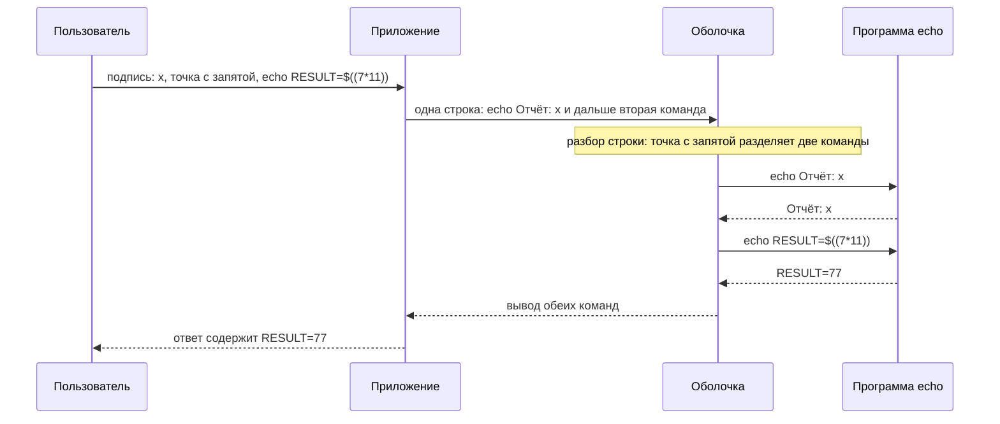
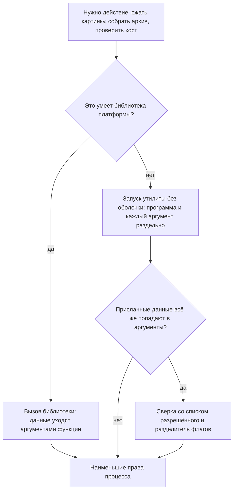

# Инъекции команд ОС, включая слепые

Учебная админ-панель строит подпись к отчёту с помощью внешней утилиты:
пользователь присылает слово, а панель возвращает его с приставкой
«Отчёт:». При подписи `Q3` выходит `Отчёт: Q3`, и всё честно. Однажды в
поле подписи вписывают `x; echo RESULT=$((7*11))`, и стенд печатает такое:

```text
опыт 1 — цепочка через ; : ВТОРАЯ КОМАНДА ИСПОЛНЕНА (RESULT=77)
```

Числа 77 в присланной строке не было. Его посчитала командная оболочка
сервера — программа, которая разбирает текстовые команды и запускает их, —
и она увидела в подписи две команды и исполнила обе. На месте безобидного
`echo` могла стоять любая утилита, а на месте второй команды — любая
другая, например чтение файла с настройками. Так выглядит инъекция команд
ОС: присланные данные попадают в команду оболочки и исполняются в ней как
код. Исход у этой инъекции самый тяжёлый из всех — выполнение произвольного
кода на сервере приложения.

## Подумай, прежде чем читать

1. Приложение проверяет доступность хоста командой `ping`. Что произойдёт,
   если в поле хоста вписать `example.com; whoami`?
2. Команда запускается через оболочку, но её вывод в ответ не попадает.
   Значит ли это, что инъекцию нельзя подтвердить?
3. Разработчик заменил `;` и `|` в присланном хосте пустой строкой. Закрыл
   ли он инъекцию?

## Что такое командная оболочка

**Откуда это взялось.** Приложению иногда нужно то, что уже умеет системная
утилита: сжать картинку, собрать архив, проверить доступность хоста. Писать
это заново дорого, поэтому программа вызывает готовую утилиту. Самый
привычный способ вызова — отдать команду оболочке строкой, как её набрал бы
человек в терминале.

Командная оболочка, по-английски shell, «обёртка», — программа-посредник
между пользователем и операционной системой. Когда вы открываете терминал и
печатаете `ls` или `ping example.com`, текст читает оболочка: она разбирает
строку, находит названную программу и запускает её. В Unix-системах это
обычно `sh` или `bash`, в Windows — `cmd.exe` или PowerShell.

Оболочка при этом полноценный интерпретатор, а не окно запуска. Прежде чем
запустить программу, она разбирает строку целиком: ищет разделители команд,
подставляет переменные, раскрывает шаблоны имён файлов. Пока команда
постоянна, этот разбор ничему не мешает. Как только в строку склеивают
присланные данные, оболочка разбирает и их, и данные получают всю её силу.

### Метасимволы: чем сцепляют команды

Особый смысл в строке имеют метасимволы — знаки, которые оболочка читает
как служебные, а не как текст. Зачем они нужны, видно из терминала:
`sudo apt update && sudo apt upgrade` — одна строка, два действия, и второе
запускается, только если первое удалось. Разделителей несколько, и
различаются они тем, когда исполняется вторая команда. Web Security Academy
приводит такой набор.

- `;` — вторая команда исполняется всегда; перевод строки (`0x0a`)
  работает так же.
- `&&` — вторая исполняется только при успехе первой, `||` — только при
  провале.
- `|` — передаёт вывод первой команды на вход второй.
- Обратные кавычки `` ` `` и `$()` — подстановка: вывод вложенной команды
  вставляется в строку.

Подстановке стоит уделить два слова, потому что она работает внутри другой
команды. Запись `$(id)` говорит оболочке: выполни `id` и вставь её вывод в
это место строки. Похожая запись `$((7*11))` считает арифметику, и именно
она стоит в подписи из вступления: число 77 появилось в выводе, потому что
оболочка вычислила его при разборе.

Windows и Unix различаются набором. Символы `&`, `&&`, `|`, `||` работают в
обоих мирах, а `;`, перевод строки, обратные кавычки и `$()` — приметы
классических Unix-оболочек в отличие от cmd.exe. Оговорка: PowerShell
подстановку `$()` тоже понимает, поэтому считать надо с конкретной
оболочкой, а не с системой. Ревьюеру это важно, потому что «на нашем
сервере точки с запятой нет» не довод: разделитель найдётся под любую
оболочку.

## Как это работает

### Разбор по общей рамке

Рамку инъекции — источник, путь, сток, отсутствующий контроль — задаёт тема
`sqli-basics`; здесь меняется интерпретатор: вместо базы данных — оболочка
операционной системы.

**Источник** — присланное значение: имя хоста, имя файла, параметр.
**Путь** — код, склеивающий из него команду. **Сток** — вызов оболочки:
`os.system`, `subprocess.run(..., shell=True)`, `child_process.exec`.
**Отсутствующий контроль** — разделение данных и команды: программу надо
звать напрямую, а данные передавать отдельными аргументами. Когда контроля
нет, метасимвол в данных сцепляет чужую команду. Как и в SQL-инъекции,
дефект не в самих данных, а в том, что им дали дотянуться до синтаксиса
интерпретатора.

### Что происходит на стенде

Стенд — лаба темы. Панель строит подпись, вызывая внешний инструмент через
оболочку строкой `echo Отчёт: <подпись>`. При подписи `Q3` выходит
`Отчёт: Q3`. При подписи `x; echo RESULT=$((7*11))` оболочка видит две
команды, разделённые `;`: сначала `echo Отчёт: x`, потом
`echo RESULT=$((7*11))`. В выводе появляется строка `RESULT=77`: арифметику
посчитала оболочка, значит, вторую команду она исполнила. Признак выбран
так, что его нельзя спутать с текстом: числа 77 в самой подписи не
написано.



**Описание схемы.** Схема читается сверху вниз и показывает путь подписи.
Приложение склеивает присланную строку с командой и отдаёт её оболочке
одной строкой. Оболочка при разборе находит разделитель `;` и запускает
два вызова `echo` подряд: второй из них пользователь приписал сам. Вывод
обоих возвращается в ответ, и строка `RESULT=77` выдаёт исполнение второй
команды.

Здесь инструмент безобиден, но на его месте — любая утилита, а вторая
команда — любая: `whoami`, `uname -a`, чтение файла, соединение наружу.
Исход не утечка одной таблицы, как в SQL, а выполнение кода на сервере.

Стоит проговорить, почему опасна именно оболочка, а не сам запуск
программы. Запуск программы делает одно: берёт исполняемый файл и список
аргументов. Оболочка перед этим разбирает строку целиком и только потом
решает, какие программы и в каком порядке запустить. Присланные данные,
попав в эту строку, участвуют в разборе наравне с командой. Поэтому дефект
не в конкретной утилите и не в конкретном символе, а в том, что между
данными и запуском встал интерпретатор с собственным синтаксисом.

### Один класс, разные интерпретаторы

Инъекция команд — та же категория, что SQL-инъекция, с другим
интерпретатором. Механизм один: данные и код едут в интерпретатор одной
строкой, и он исполняет часть данных как команды. У SQL интерпретатор —
база, у команд ОС — оболочка, у шаблонизатора — движок шаблонов (`ssti`), у
XSS, инъекции в разметку страницы, — браузер. Вывод переносится целиком:
чинит инъекцию не чистка данных, а разделение кода и данных на входе в
интерпретатор. Для оболочки это вызов без неё, для базы — параметры
(`parameterized-queries`), для шаблонизатора — данные как значение, а не
как шаблон.

Разница команд ОС от прочих — в тяжести исхода. SQL-инъекция читает и
меняет данные, XSS работает в браузере жертвы, а команда ОС исполняется на
сервере приложения с его правами. Отсюда прямой путь к соседним службам, к
учётным данным окружения и к закреплению в системе. В оценке находки это
почти всегда критический уровень.

**Не путать с другими путями к выполнению кода.** Тот же исход дают ещё два
дефекта, но через другую дверь. Инъекция в шаблонизатор (`ssti`) исполняет
выражение движка шаблонов, а не команду оболочки. Небезопасная
десериализация, то есть исполнение кода при разборе присланного объекта,
обходится вовсе без команды (тема `insecure-deserialization`). Признак
именно инъекции команд ОС — присланное доходит до вызова оболочки или
запуска процесса. Различать их важно, потому что чинятся они в разных
местах, хотя оценка у всех трёх предельная.

### Слепая инъекция

Вывод команды в ответ часто не попадает: приложение вызвало утилиту ради
действия, а не ради текста. Такую инъекцию называют слепой: атакующий не
видит результата и подтверждает исполнение обходными путями. Пример из
жизни — стук по стене: вы не видите, что за стеной, но по ответному стуку
знаете, что кто-то есть. Граница аналогии: молчание за стеной не доказывает,
что там пусто, — так и отсутствие задержки не доказывает отсутствие
инъекции. Дефект от потери вывода не исчезает — сужается только канал
подтверждения. Web Security Academy называет три приёма.

**Задержка.** В команду вставляют паузу и смотрят на время ответа:
`& ping -c 10 127.0.0.1 &` задерживает ответ на время десяти пакетов.
Между пакетами проходит около секунды, поэтому ответ придёт секунд на
десять позже — на фоне миллисекунд обычной работы это видно сразу. Ответ
пришёл с задержкой — команда исполнилась.

**Перенаправление вывода.** Вывод команды пишут в файл, доступный по сети,
например в каталог статики самого приложения, который раздаётся по HTTP, и
читают его отдельным запросом.

**Внеполосный канал.** Команда обращается к серверу атакующего, например
DNS-запросом. DNS — служба, которая переводит имена хостов в сетевые
адреса: обращение к ней уходит с сервера наружу, и атакующий видит факт
запроса в своём журнале. Тот же приём разбирают темы `sqli-oob` и
`blind-ssrf`.

Слепой случай в работе скорее правило, чем исключение: утилиту зовут ради
действия, и её вывод пользователю не нужен. Поэтому ревьюер не считает
отсутствие вывода в ответе доказательством безопасности. Он смотрит на сам
вызов, а подтверждение при необходимости берёт задержкой или внеполосным
каналом.

**Зачем это в работе AppSec-инженера.** Исход у дефекта предельный —
выполнение кода, поэтому его спрашивают на собеседованиях и ищут в каждом
ревью. Ищут по вызовам оболочки: конвертация файлов, генерация архивов,
пинг хоста, вызов внешней утилиты. Вопрос к каждому такому месту один:
собрана ли команда из данных и запущена ли через оболочку. Тема несёт на
себе `ssti` и разбор небезопасной десериализации: путь к выполнению кода у
них общий.

## Как это атакуют

Стенд — лаба этой темы (`pilot/lab/os-command-injection`). Разбор идёт в
три шага.

Шаг первый — найти вызов оболочки. Признак: функция строит команду из
данных и запускает её через оболочку. В лабе это `make_label`. В живом коде
такие места ищут по именам вызовов: `os.system`, `subprocess` с
`shell=True`, обёртки вокруг них, а в других стеках — свои аналоги. Особое
внимание — функциям, которые по названию работают с внешними
инструментами: конвертация, экспорт, проверка доступности, генерация
архива.

Шаг второй — сцепить команду. В поле подписи вписываем разделитель и вторую
команду: `x; echo RESULT=$((7*11))`. Прогон на лабе:

```bash
python3 hack.py
```

```text
Цель: code.py
  опыт 1 — цепочка через ; : ВТОРАЯ КОМАНДА ИСПОЛНЕНА (RESULT=77)
  опыт 2 — контроль, обычная подпись: работает
  опыт 3 — контроль, ; в подписи как текст: подпись потеряла символы
```

Вывод завершается строкой «ЭКСПЛОЙТ СРАБОТАЛ: подпись разобрана оболочкой
как команда», и код выхода равен 1. Разберём три опыта.

Опыт 1 — разделитель `;` и арифметика. Строка `RESULT=77` в выводе
означает, что оболочка посчитала `$((7*11))`, то есть исполнила вторую
команду. Признак подобран так, что подделать его текстом нельзя: числа 77
в подписи нет, оно появляется только как результат вычисления.

Опыт 2 — контроль: обычная подпись обязана строиться и после починки,
иначе починка свелась бы к запрету всего ввода и приёмку бы не прошла.

Опыт 3 — на уязвимом коде подпись `Q3; финал` теряет символы: оболочка
разобрала `;` и попыталась выполнить `финал` как команду, а такой в системе
нет. После починки та же подпись целиком станет текстом — это видно на
решении.

Шаг третий — оценить добычу. Исполнение произвольной команды на сервере —
предельный исход инъекции, и с него начинается цепочка. Это чтение файлов
приложения и его секретов, обращение к внутренним службам от имени сервера
(как в `ssrf-basics`), запись своего кода и закрепление в системе. Права, с
которыми запущен процесс, задают потолок ущерба, поэтому в отчёте вместе с
находкой проверяют, от кого работает служба. Оценка такой находки почти
всегда критическая.

## Как это выглядит в коде

Ревьюер ищет вызов оболочки с командой, собранной из данных. Читаем листинг
тремя планами: найти точку входа недоверенных данных, проследить, где
данные встречаются с командой, назвать, кто разбирает итоговую строку.

```python
# УЯЗВИМО — демонстрация, не для продакшена
def make_label(name):
    command = "echo Отчёт: " + name           # (1)
    return subprocess.run(
        command, shell=True,                  # (2)
        capture_output=True, text=True).stdout
```

1. Строка с командой собрана склейкой с присланным `name`: это встреча
   данных с командой.
2. `shell=True` отдаёт строку оболочке, и та разбирает в ней метасимволы:
   это разбор строки интерпретатором.

Здесь правило темы видно прямо: в присланной подписи нет ни одной кавычки,
а дефект есть. Его делает встреча данных с интерпретатором; конкретный
символ тут ни при чём.

Признаки в Python: `os.system(...)` и `subprocess.run/call/Popen(...,
shell=True)` с командой не из постоянной строки. В Node.js —
`child_process.exec`, который запускает строку через оболочку, против
`execFile` и `spawn` без оболочки.

**Ложное срабатывание.** Постоянная команда с `shell=True` без данных:
оболочка её разбирает, но подставлять в неё нечего. Дефекта нет, пока в
строку не попадают присланные данные.

Второй признак, который ищет ревьюер, — вызов оболочки, спрятанный в
обёртке: собственная функция «выполнить команду», очередь фоновых задач,
вызов из шаблона сборки. Сам вызов там тот же, но правило статического
анализа его не увидит, пока имя обёртки не попадёт в список стоков. Про
такое правило — раздел «Как это находят инструменты». Отыщите в своём
проекте вызов внешней утилиты: собрана ли команда строкой и кто её
разбирает, оболочка или сама программа?

## Как защититься

Порядок приёмов задан их надёжностью: сначала убрать сам вызов, потом
убрать оболочку, и только потом проверять данные.

**Первое — не звать оболочку вообще.** Web Security Academy ставит это
главным: надёжнее всего вовсе обойтись без вызова команд ОС и сделать
нужное средствами платформы. Список файлов читают библиотекой файловой
системы, а не `ls`; архив собирают библиотекой архивов, а не `tar`. Нет
вызова — нет инъекции.

Замена почти всегда есть, и она короче вызова утилиты. Проверка
доступности хоста делается библиотекой сети, а не `ping`. Изменение размера
картинки — библиотекой обработки изображений, а не вызовом `convert`
строкой. Разбор PDF, работа с архивом, перемещение файла — всё это в
стандартной библиотеке или в пакете. Там данные передаются как аргументы
функции, а не как текст команды. Выгода двойная: инъекции команд нет по
построению, и код не зависит от того, какие утилиты стоят на сервере.

**Второе — если утилита нужна, звать её без оболочки.** Иногда без внешней
программы не обойтись: нет библиотеки или нужна конкретная утилита. Тогда
её запускают напрямую, а аргументы передают списком:

```python
# Исправлено.
def make_label(name):
    return subprocess.run(
        ["echo", "Отчёт:", name],             # (1)
        shell=False,                          # (2)
        capture_output=True, text=True).stdout
```

1. Аргументы — отдельные элементы списка, и `name` целиком идёт одним
   аргументом.
2. Оболочки нет, поэтому разбирать метасимволы некому: `;` в `name` —
   обычный символ подписи, а не разделитель команд.

Тот же приём на Node.js: `execFile("echo", ["Отчёт:", name])` вместо
`exec("echo Отчёт: " + name)`. Первый запускает программу напрямую, второй
— через оболочку. Инвариант один: программа и её аргументы раздельно,
оболочки нет.



**Описание схемы.** Схема читается сверху вниз и задаёт порядок выбора
защиты. Сначала проверяется, умеет ли платформа нужное действие без внешней
утилиты: если да, данные уходят аргументами функции, и вопрос закрыт. Если
утилита неизбежна, её запускают без оболочки, а данные, которые всё же
попадают в аргументы, сверяют со списком разрешённого. Узел «разделитель
флагов» на схеме опережает текст: это защита от подмены флага утилиты, и
она разобрана в следующем абзаце про инъекцию аргумента. Последний узел
общий: процесс с наименьшими правами ограничивает ущерб, если всё остальное
не сработало.

**Отдельный случай — инъекция аргумента.** Вызов без оболочки закрывает
метасимволы, но не закрывает подмену флага. Если присланное значение идёт
аргументом и начинается с дефиса, программа примет его за свой флаг: имя
файла `--output=/etc/passwd` для многих утилит не имя, а параметр. Поэтому
значение, которое обязано быть данными, отделяют от флагов явным
разделителем `--` там, где утилита его понимает, и проверяют, что оно не
начинается с дефиса. Вызов без оболочки — условие необходимое, но не всё:
аргумент тоже проверяют.

**Третье — если данные в команде неизбежны, проверять по списку
разрешённого.** Это позитивная модель из `filter-and-waf-bypass`: не
«убрать плохое», а «пропустить только известное хорошее». Для имени хоста
проверяют, что присланное — допустимое доменное имя или адрес. Для числа —
что это число, для выбора из вариантов — что присланное есть в конечном
наборе.

Список разрешённого — второй рубеж, а не замена вызову без оболочки:
данные, прошедшие проверку, всё равно не склеивают в команду. Web Security
Academy запрещает ручное экранирование метасимволов прямо: оно ненадёжно и
обходится. Cheat sheet оставляет его запасным приёмом и тут же показывает
предел — инъекцию аргумента.

**Границы применимости.** Вызов без оболочки закрывает инъекцию, но убирает
и возможности оболочки: подстановку переменных, каналы, шаблоны имён. Если
они нужны, их воспроизводят в коде, а не возвращают оболочку. Поверх всего
— наименьшие права процесса: команда, которой не нужен доступ к сети или к
чужим файлам, не должна его иметь.

## Как убедиться, что защита работает

Ретест повторяет цепочку и проверяет сохранность работы. Прогон на решении:

```bash
LAB_TARGET=solution.py python3 hack.py
```

```text
Цель: solution.py
  опыт 1 — цепочка через ; : не исполнена
  опыт 2 — контроль, обычная подпись: работает
  опыт 3 — контроль, ; в подписи как текст: работает
```

Вывод завершается строкой «эксплойт не сработал: метасимволы попали в
подпись как текст, подпись строится», и код выхода равен 0. Цепочка не
исполнилась, подпись строится, а `;` теперь попадает в подпись текстом:
третий опыт на решении зелёный.

Регресс закрывает `tests.py` — два теста функциональности: обычная подпись
строится и подпись с кириллицей работает. Отдельно стоит проверить
негативные случаи: пустое значение и значение с метасимволами не роняют
вызов с трассировкой в ответе, а дают предсказуемый результат. И отдельно —
что в коде не осталось второго вызова через оболочку; это ищет правило из
следующего раздела.

На ревью пройдите по списку.

1. Проверьте, что приложение не вызывает команды ОС там, где хватает
   средств платформы (ASVS v5.0-1.2.5).
2. Проверьте, что неизбежный вызов утилиты идёт без оболочки, а аргументы
   передаются списком, а не одной строкой.
3. Проверьте, что данные в команде, если они неизбежны, сверяются со
   списком разрешённого, а не экранируются.
4. Проверьте, что метасимволы оболочки не «чистятся» чёрным списком как
   способ защиты.
5. Проверьте, что слепой случай учтён: отсутствие вывода в ответе не
   считается отсутствием дефекта.
6. Проверьте, что процесс запускается с наименьшими правами, а не от
   административной учётной записи.
7. Проверьте, что сообщение об ошибке выполнения не уходит в ответ
   пользователю.

## Как это находят инструменты

Дефект ложится на статический анализ кода, сокращённо SAST: анализатор
читает исходники и ищет опасные конструкции, не запуская программу. Точнее,
на его разновидность — анализ помеченных данных: присланное значение
помечается как недоверенное, и анализатор следит, не доходит ли оно до
опасного вызова. У нашего дефекта есть и источник, и сток, и разделяющий
приём, поэтому вопрос формулируется точно. Правило `os-command-shell-built`
отвечает на один вопрос: доходит ли команда, собранная из строк, до вызова
оболочки — `os.system` или `subprocess.run` с `shell=True`.

Правило целиком лежит в `pilot/semgrep/os-command-shell-built.yaml`. Оно
сверено прогоном на Semgrep 1.174.0: на уязвимом файле лабы одна находка,
на решении ноль, на восьми размеченных тест-кейсах расхождений нет.

**Что правило пропустит.** Вызов оболочки через обёртку с другим именем.
Команду, собранную в одной функции и запущенную в другой. Стек кроме
Python: для Node.js нужно своё правило на `child_process.exec`.

**Какой шум даст.** Постоянную команду с `shell=True`, если она собрана из
строк без данных: правило видит сборку строки, а не происхождение частей.
Поэтому находку смотрят глазами — данные в команде или нет.

Отдельно правило не отвечает, опасны ли данные на самом деле: оно ловит
форму «строка из частей ушла в оболочку». Надёжнее сама конструкция — у
вызова без оболочки нечему сцеплять.

## Частая ошибка

А если не убирать оболочку, а вырезать из подписи опасные символы — `;`,
`|`, `&`? Рецепт знакомый, и он не работает.

**Экранирование и чистка метасимволов ненадёжны, и первоисточник запрещает
их прямо.** Метасимволов много, у оболочек они разные, а способов записать
одно и то же ещё больше: подстановка `$()`, обратные кавычки, перевод
строки, кодирование. Список запрещённого проигрывает здесь так же, как в
`filter-and-waf-bypass`.

Контрпример. Фильтр вырезал `;`, `|` и `&`. Подпись `$(id)` не содержит ни
одного из них и проходит фильтр целиком. Оболочка выполняет `id` внутри
подстановки и вставляет результат в команду. Символы, на которые
рассчитывал фильтр, не понадобились: у оболочки нашёлся другой способ
записать то же самое.

Вторая частая ошибка — заменить `shell=True` на `shell=False`, но оставить
сборку команды одной строкой. Список из одного элемента `["echo Отчёт: " +
name]` без оболочки запускает программу с именем «echo Отчёт: …» целиком, и
она либо не найдётся, либо сработает не так. Разделение кода и данных — это
не флаг `shell` сам по себе, а передача программы и каждого аргумента
отдельными элементами списка. Флаг без раздельных аргументов защиты не
даёт.

## Попробуй сам

`lab-os-command-injection`, каталог `pilot/lab/os-command-injection`.
Формат «почини»: правится `code.py`, пока `hack.py` и `tests.py` не станут
зелёными одновременно.

**Цель одной фразой:** добиться, чтобы `hack.py` вышел с кодом 0, а
`tests.py` продолжил выходить с кодом 0.

Всё локально, без сети и без Docker. Внешний инструмент изображает `echo`,
файлов вне каталога лабы команда не трогает. Запуск:

```bash
cd pilot/lab/os-command-injection
python3 hack.py
python3 tests.py
```

Одна подсказка: проблема не в символе `;` и не в наборе метасимволов,
которые можно запретить. Проблема в том, что подпись и команда едут в
оболочку одной строкой. Уберите оболочку.

**Отдельная задача «почини».** Недостаточно вырезать `;` из подписи:
останутся `$()`, обратные кавычки и перевод строки. Уберите оболочку
целиком: программа запускается напрямую, подпись — отдельным аргументом.
Проверяется тем, что опыт 1 перестаёт печатать `RESULT=77`, а обычная
подпись строится.

Решение лежит в `solution.py` и открывается после своей попытки.

## Проверь себя

1. Сервис картинок на Node.js вызывает две внешние утилиты:

   ```javascript
   const { exec, execFile } = require("child_process");

   function thumbnail(filename) {
       execFile("convert", [filename, "-resize", "100x100", "thumb.png"]);
   }

   function archive(dirname) {
       exec("tar czf backup.tar.gz " + dirname);
   }
   ```

   Какой из двух вызовов уязвим и почему второй нет?

2. Функция из раздела «Как это выглядит в коде» собирает команду склейкой
   и отдаёт её оболочке:

   ```python
   def make_label(name):
       command = "echo Отчёт: " + name
       return subprocess.run(
           command, shell=True,
           capture_output=True, text=True).stdout
   ```

   Какую починку вы выберете?

   A. Вырезать из подписи метасимволы `;`, `|`, `&`, оставив вызов как
      есть.

   B. Заменить `shell=True` на `shell=False`, оставив команду одной
      строкой.

   C. Запустить программу без оболочки и передать подпись отдельным
      элементом списка аргументов.

3. Вывод команды в ответ не попадает. Почему это не означает, что инъекцию
   нельзя подтвердить?
4. Приложение проверяет доступность хоста командой `ping <хост>`,
   запущенной через оболочку. Что произойдёт, если в поле хоста вписать
   `example.com; whoami`, и как проверить ответ прогоном на лабе темы?
5. Возврат к теме `sqli-basics`: что общего у инъекции команд с
   SQL-инъекцией по рамке источник — путь — сток и чем различаются их
   исходы?
6. Возврат к теме `app-architecture`: почему выполнение команды на сервере
   приложения опаснее, чем чтение одной таблицы базы?

<details markdown="1">
<summary>Ответ 1</summary>

1. Уязвим `archive`: `exec` запускает строку через оболочку, и присланный
   `dirname` участвует в её разборе наравне с командой — `;` или `$()` в
   нём сцепят чужую команду. `thumbnail` запускает программу напрямую через
   `execFile`, аргументы идут списком, оболочки нет, и разбирать
   метасимволы некому. Признак смотрится в коде так: имя вызова (`exec`
   против `execFile`) плюс форма команды (одна строка против списка).

</details>

<details markdown="1">
<summary>Ответ 2: разбор вариантов</summary>

2. Верный ответ — C.

   A. Чистка метасимволов ненадёжна, и первоисточник запрещает её прямо:
      способов записать одно и то же много — подстановка `$()`, обратные
      кавычки, перевод строки. Подпись `$(id)` не содержит ни одного
      символа из списка и проходит фильтр целиком.

   B. Список из одного элемента `["echo Отчёт: " + name]` без оболочки
      запускает программу с именем «echo Отчёт: …» целиком — она не
      найдётся. Разделение кода и данных — не флаг сам по себе, а передача
      программы и каждого аргумента отдельными элементами.

   C. Оболочки нет, разбирать метасимволы некому, и `;` в подписи
      становится обычным текстом. Остаётся инъекция аргумента: значение,
      начинающееся с дефиса, программа примет за свой флаг, поэтому
      аргумент отделяют разделителем `--` и проверяют, что он не начинается
      с дефиса.

</details>

<details markdown="1">
<summary>Ответ 3</summary>

3. Сужается канал подтверждения, а не сам дефект. Слепую инъекцию
   подтверждают задержкой: `ping -c` или пауза видны по времени ответа.
   Дальше — перенаправление вывода в доступный по сети файл или внеполосный
   запрос к своему серверу, обычно DNS. Слепой случай в работе скорее
   правило: утилиту зовут ради действия, а не ради текста.

</details>

<details markdown="1">
<summary>Ответ 4</summary>

4. Оболочка разберёт `;` как разделитель и исполнит обе команды: сначала
   `ping example.com`, затем `whoami` — с правами сервера приложения.
   Прогон на лабе показывает то же на безобидной команде:

   ```bash
   cd pilot/lab/os-command-injection && python3 hack.py
   ```

   ```text
   Цель: code.py
     опыт 1 — цепочка через ; : ВТОРАЯ КОМАНДА ИСПОЛНЕНА (RESULT=77)
   ```

   Строка `RESULT=77` — доказательство исполнения, а не текст подписи:
   числа 77 в присланном не было, его посчитала оболочка, выполнив
   `$((7*11))`.

</details>

<details markdown="1">
<summary>Ответ 5</summary>

5. Механизм один: данные и код едут в интерпретатор одной строкой, и он
   исполняет часть данных как команды. Чинится разделением кода и данных на
   входе в интерпретатор. Различаются интерпретатор и исход. SQL-инъекция
   читает и меняет данные в базе. Команда ОС исполняется на сервере с
   правами приложения — отсюда путь к соседним службам и к закреплению.

</details>

<details markdown="1">
<summary>Ответ 6</summary>

6. Команда исполняется на сервере приложения с его правами и доступом к
   внутренней сети. Это выполнение произвольного кода, а не чтение одних
   данных: отсюда путь к соседним службам и к закреплению.

</details>

## Источники

1. PortSwigger Web Security Academy, «OS command injection»; реестр
   `ps-oscmd`. Разделы: Useful commands, Ways of injecting OS commands
   (command separators), Blind OS command injection (time delays, output
   redirection, out-of-band), How to prevent OS command injection attacks.
   <https://portswigger.net/web-security/os-command-injection>
2. OWASP OS Command Injection Defense Cheat Sheet; реестр
   `owasp-cs-oscmd-defense`. Разделы: Primary Defenses — avoid calling OS
   commands, parameterization, input validation; экранирование как запасной
   приём и инъекция аргумента.
   <https://cheatsheetseries.owasp.org/cheatsheets/OS_Command_Injection_Defense_Cheat_Sheet.html>

Каркас этапа: `owasp-asvs-5-document` (ASVS v5.0.0), `owasp-wstg-42`,
`owasp-top10-2025`. Наследуются всеми темами и отдельной строкой не
повторяются.

**Скоропортящийся слой.** Имена вызовов оболочки привязаны к языку и
версии: `os.system` и `subprocess` в Python, `child_process.exec` и
`execFile` в Node.js. Набор метасимволов зависит от оболочки. Страницы Web
Security Academy и cheat sheet — живые площадки без даты публикации.

**Маркеры уверенности.** Исполнение цепочки — **проверено лично**
2026-10-03 на Python 3.14.7: подпись `x; echo RESULT=$((7*11))` через
`shell=True` даёт в выводе строку `RESULT=77`, а на вызове без оболочки те
же символы попадают в подпись текстом. Прогоны правила SAST — **проверено
лично** там же на Semgrep 1.174.0: одна находка на `code.py`, ноль на
`solution.py`, восемь тест-кейсов без расхождений. Набор метасимволов,
приёмы слепой инъекции и порядок мер защиты — **по документации** (Web
Security Academy и OS Command Injection Defense Cheat Sheet, открыты лично
2026-08-24). Задержка через `ping` и внеполосный канал лично **не
воспроизводились**: стенд офлайновый. Требование 1.2.5 сверено с текстом
ASVS v5.0.0 (открыт лично 2026-08-24). Листинг на Node.js **не
запускался**: стенда под Node.js не собиралось.
