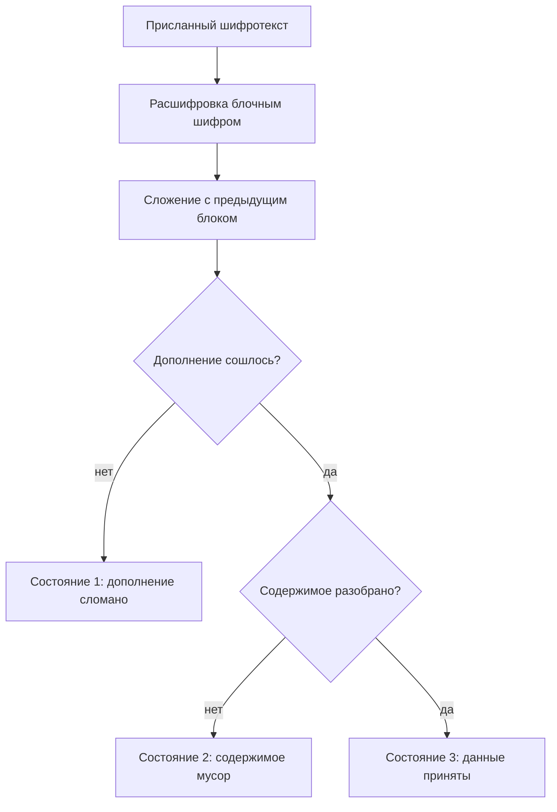
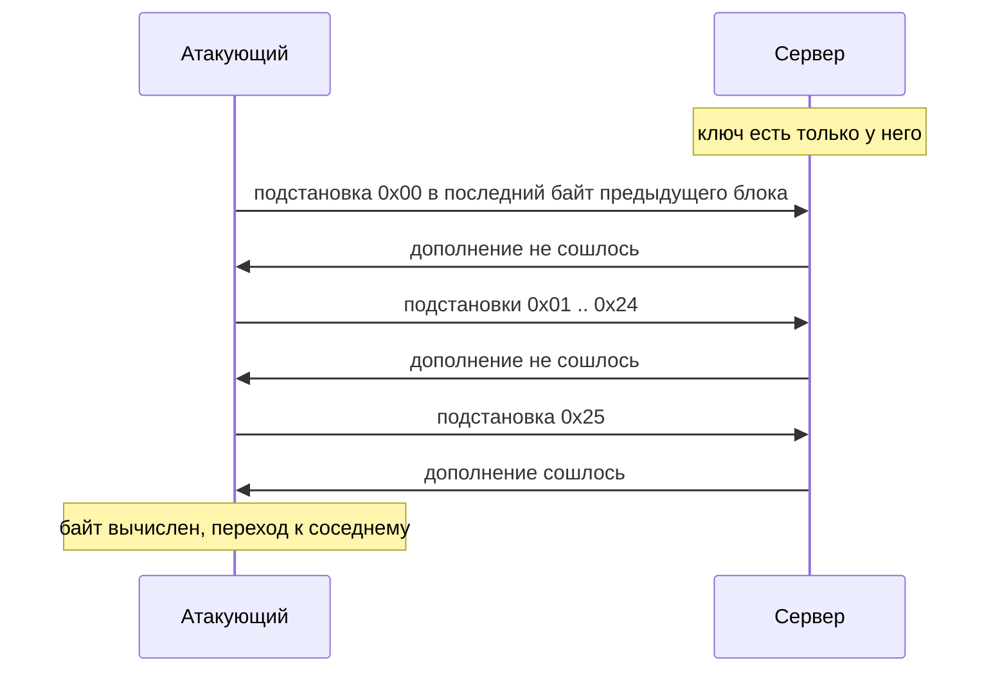

# Padding oracle

Представьте сервис, который хранит состояние сессии прямо в cookie: строку
`user=alice;role=user;id=7`, зашифрованную ключом, который знает только
сервер. Атакующий берёт свою cookie, правит в ней байты и отправляет обратно.
Сервер отвечает отказом, но отказы бывают разные. Одна реакция значит
«дополнение сломано», другая — «дополнение сошлось, а содержимое мусор».
Атакующий научился их различать и повторяет опыт, меняя по одному байту за
раз. На учебном стенде этой темы сообщение восстановлено целиком за 4151
обращение — без ключа и без взлома шифра. Такая атака называется padding
oracle, «оракул дополнения»: шифр остаётся цел, а сообщение читает реакция
приложения на правленые копии шифротекста.

## Как это работает

**Откуда это взялось.** Схема дополнения появилась как техническая мелочь:
данные надо чем-то добить до границы блока, и договорились писать в хвост
байты со значением, равным длине дополнения. Мелочь оказалась входом:
проверка дополнения — первое, что делает расшифровывающая сторона, и её
результат раньше всех прочих состояний становится видимым снаружи. Ответом
стало требование проверять целостность до расшифровки. Стандарт ASVS называет
этот приём поимённо и требует от криптографических модулей падать безопасно
(`v5.0-11.2.5`). Падать безопасно — значит при любой поломке отвечать
одинаковым отказом, не выдавая причину. Класс атак закрывается одной
проверкой, и её устройству посвящён раздел «Как закрыть оракула».

### Чем добивают последний блок

Блочный шифр вроде AES работает кусками фиксированной длины: у AES это
16 байт, у старших DES и 3DES — 8. Устройство шифра и режимы разобраны в теме
`crypto-misuse`. Сообщение редко укладывается в целое число блоков, и хвост
добивают до границы по известной схеме. Такая добивка
называется дополнением (padding), а ходовая схема — PKCS#7: в хвост пишут
байты, каждый из которых равен длине дополнения. Не хватает семи байт —
дописывают семь байтов со значением 7. Сообщение стенда занимает 25 байт,
и дополнение из семи байтов `0x07` доводит его до 32 — двух полных блоков.

Бытовой пример — стандартная транспортная коробка. Вещь кладут внутрь,
свободное место добивают наполнителем, а к наполнителю клеят записку
«наполнителя здесь семь комков». Распаковывающий читает записку, выкидывает
ровно семь комков и достаёт вещь. Коробка здесь — блок, вещь — сообщение,
наполнитель с запиской — дополнение. Аналогия ломается на устройстве записки.
В коробке она отдельный предмет, а в дополнении сами байты и есть записка:
их значение равно их длине.

При расшифровке дополнение снимают: читают последний байт, проверяют, что
хвост такой длины состоит из таких же байтов, и отрезают его. Если проверка
не сошлась, сообщения нет вовсе: результат нельзя отдать вызывающему коду
даже как мусор. Это отдельное состояние, отличное от «расшифровали, но
внутри чужая роль». Различимость этих состояний снаружи и превращает
приложение в оракула.

### Что такое оракул

Оракулом в безопасности называют систему, которая секрет не выдаёт, но
отвечает на один косвенный вопрос о нём. Бытовой пример — игра
«горячо-холодно»: ведущий прячет предмет и на каждую попытку отвечает
«теплее» или «холоднее». Предмет он не показывает, но находится предмет
именно по ответам. Аналогия ломается на намерении: ведущий отвечает нарочно,
а приложение не отвечает, а работает. Ответ читается из его обычных реакций:
кода возврата, текста ошибки, времени отклика.

Приложение, расшифровывающее присланное, проходит три состояния: дополнение
сломано; дополнение сошлось, но содержимое мусор; всё сошлось и разобрано.
Если снаружи видно, в каком состоянии оно оказалось, у атакующего есть один
бит о расшифровке. Мало? Из следующего раздела видно, что на этом бите
читается всё сообщение.



**Описание схемы.** Схема читается сверху вниз и показывает путь присланного
шифротекста внутри приложения. После расшифровки блок складывается с
предыдущим блоком шифротекста, и первой проверяется добивка. Путей из
проверки три, и если наружу выходит, каким из них прошёл запрос, приложение
становится оракулом. Правленый шифротекст атакующего почти всегда идёт одним
из двух первых путей, и разница между ними — тот самый один бит.

### Как один бит читает сообщение

Напомним расшифровку в режиме CBC поверх шифра AES — связке AES-CBC, на
которой собран стенд этой темы; сам режим разобран в теме `crypto-misuse`.
Шифр расшифровывает блок, и результат складывается с предыдущим блоком
шифротекста по модулю два. Предыдущий блок присылает клиент, и его байты
атакующий выбирает сам. Выход шифра до сложения назовём промежуточным
значением: оно зависит только от ключа и целевого блока и от запроса к
запросу не меняется. А вот итоговый байт равен промежуточному, сложенному
с байтом, который подставил атакующий.

Подстановка работает так. Атакующий собирает короткий запрос из двух блоков:
правленого предыдущего и целевого. Целевой обязан стоять последним, потому
что дополнение существует только в конце сообщения: блок из середины
расшифруется молча, и оракул про него ничего не скажет. Поэтому сообщение
обрезается сразу после целевого блока. Дальше перебирается последний байт
предыдущего блока. Когда итоговый последний байт окажется равен единице, дополнение из
одного байта `0x01` сойдётся — и оракул ответит «сошлось». Тогда
промежуточный байт равен выигравшей подстановке, сложенной с единицей,
а байт открытого текста — промежуточному, сложенному с исходным байтом
предыдущего блока, который виден в настоящей cookie.

Из 256 подстановок «сошлось» отвечает, как правило, одна. Редкий второй
ответ — случай, когда хвост случайно сложился в более длинное дополнение
вроде `0x02 0x02`. Он отсекается контрольной правкой соседнего байта: при
настоящем `0x01` такая правка ответа не меняет, а при длинном дополнении
ломает его.

В прогоне, который готовил эту страницу, выиграла подстановка `0x25` —
после 37 неудач, на 38-м обращении. Промежуточный байт: `0x25` XOR `0x01`
равно `0x24`. Исходный байт предыдущего блока в cookie: `0x19`. Байт
открытого текста: `0x24` XOR `0x19` равно `0x3D`, знак «равно» —
шестнадцатый байт строки `user=alice;role=`. При повторном прогоне значения
выйдут другие: они зависят от ключа и IV. Закономерность одна: единственный
ответ «сошлось» из 256 вариантов выдаёт один байт.

Дальше подбор шагает влево. Следующий байт находится через дополнение из
двух байтов `0x02 0x02`: уже найденный последний байт выставляется известной
подстановкой, и перебирается предпоследний. Так восстанавливается
промежуточное значение всего блока, а из него — открытый текст. На байт
уходит в среднем 128 обращений, в худшем случае 256, и блок из 16 байт стоит
не больше 4096 обращений.



**Описание схемы.** Схема читается сверху вниз и показывает диалог атакующего
с оракулом из прогона этой страницы. Первые 37 подстановок в последний байт
предыдущего блока сервер отвечает отказом, тридцать восьмая даёт «сошлось» —
и один байт вычислен. Дальше цикл повторяется для соседнего байта, затем для
всего блока и для следующего блока сообщения.

Полный прогон стенда показывает масштаб атаки целиком:

```text
$ python e07-padding-oracle.py
сообщение 25 байт -> шифротекст с IV 48 байт = 3 блоков
  блок 1: 2175 обращений к оракулу -> 'user=alice;role='
  блок 2: 1976 обращений к оракулу -> 'user;id=7…'
всего обращений: 4151
восстановлено: 'user=alice;role=user;id=7'
теоретический максимум перебора: 8192 обращений
```

Читается вывод так. Сообщение из 25 байт с дополнением занимает два блока,
и вместе с IV шифротекст — три блока по 16 байт. Оба блока восстановлены за
4151 обращение при теоретическом максимуме 8192: перебор идёт быстрее худшего
случая, потому что выигрышная подстановка в среднем встречается на середине
диапазона. Ключ не понадобился ни разу: атака обращается только к реакции
сервера. Стоит проверить своё приложение: где в нём расшифровывается
присланное клиентом значение и сколько различимых исходов у этой операции?

Скажите, не возвращаясь к разбору: почему атакующий перебирает байты
предыдущего блока, а не целевого? Целевой блок — вход шифра, и его правка
меняет промежуточное значение непредсказуемо. Управляемое место одно —
сложение с предыдущим блоком, а предыдущий блок у атакующего в руках.

### Три обличья оракула

Оракул не обязан говорить про дополнение прямо; он выдаёт себя тремя
способами, и заметен сразу только первый.

1. Сообщение об ошибке с именем исключения. Приложение ловит сбой
   расшифровки и показывает его наружу: `PaddingException`, стек вызовов.
   Как сообщения об ошибках протекают наружу вообще, разбирает тема
   `information-disclosure`.
2. Разная реакция без слов о дополнении. На сломанное дополнение — один код
   ответа, на разобранный, но бессмысленный текст — другой: например, 500
   против 200 или «неверный токен» против «неверный логин». Слово
   «дополнение» не названо, а состояния различимы.
3. Разное время ответа. Коды и тела совпадают, но ветка «дополнение не
   сошлось» завершается раньше, чем разбор мусора, и разница читается
   замерами. Это побочный канал по времени: ответ приходит не словами,
   а секундомером. По сети канал шумный, и своей темы у него в гайдбуке нет.
   Здесь важно одно: третья форма существует, и совпадение тел ответа
   оракула ещё не хоронит.

Руководство по тестированию WSTG-CRYP-02 требует от исправной реализации
ровно двух исходов: принято или отвергнуто. Между ними не должно быть
различимых промежуточных состояний — ни текстом, ни кодом, ни временем.

### Где оракул живёт в приложении

Место-кандидат узнаётся по одному признаку: приложение приняло от клиента
длинное значение, похожее на случайное, и что-то из него достало. Длина
значения при этом кратна 8 или 16 байтам. «Достало» значит «расшифровало»:
случайный вид — это и есть вид шифротекста, а кратность размеру блока
выдаёт блочный шифр.
Носителей три обычных. Состояние сессии, вынесенное на клиента, —
зашифрованная cookie, как в теме `crypto-misuse`. Параметр ссылки, по
которому сервер отдаёт документ или файл. Токен собственного формата:
«запомнить меня», ссылка сброса пароля.

**Зачем это в работе AppSec-инженера.** Тема нужна, чтобы узнавать место,
а не писать эксплойт: приложение расшифровывает присланное клиентом значение
и как-то реагирует на неудачу. На ревью вопрос ставится коротко: где
расшифровывается присланное и сколько различимых исходов у этой операции.
Вывод тоже короткий: расшифровки присланного без проверки целостности до неё
быть не должно, а само требование разбирает тема `hmac-vs-signature`.

## Как закрыть оракула

Защита решает одну задачу: не дать правленому шифротексту дойти до проверки
дополнения. Оракул питается различием реакций расшифровки; нет расшифровки
подделки — нет и различия. Дальше три слоя: метка до расшифровки, одинаковая
реакция на все поломки и проверка, что оба слоя стоят.

### Целостность до расшифровки

Главный ход — метка целостности поверх шифротекста. К сообщению прикладывают
короткую приставку, которую вычисляет только держатель ключа, — HMAC
(Hash-based Message Authentication Code, код аутентичности сообщения) от IV
и шифротекста. Приёмник сначала проверяет метку и расшифровывает только при
сошедшейся. Атакующий правит байты вслепую, а метку под подделку вычислить
не может — ключа у него нет, — и запрос отбрасывается до всякой расшифровки.
Порядок операций существенен и имеет имя: encrypt-then-MAC, «сначала
зашифровать, потом подписать шифротекст». Почему метка считается по
шифротексту, а не по открытому тексту, и как устроена сама метка, разбирает
тема `hmac-vs-signature`.

Почему проверка обязана стоять до расшифровки, а не после. Оракул живёт
внутри самой расшифровки: дополнение проверяется в ней первым, и реакция на
него протекает наружу раньше любого следующего шага. Метка, проверенная
после расшифровки, опаздывает: к этому моменту приложение уже ответило на
вопрос «сошлось ли дополнение». В коде разница между верным и неверным
порядком — две переставленные строки, и на ревью они различаются только по
месту вызова, а не по названиям функций.

Второй путь — аутентифицированный режим вроде AES-GCM из темы
`crypto-misuse`: библиотека сама проверяет встроенную метку до выдачи текста
и на подделке бросает `InvalidTag`. Оба пути покрыты одним требованием ASVS
(`v5.0-11.3.3`): применяется аутентифицированное шифрование или связка
«шифрование плюс MAC» с проверкой до расшифровки.

Так выглядит исправленный приёмник состояния сессии — фрагмент, упрощён для
примера; функции `cbc_decrypt` и `unpad` библиотечные. При чтении три
подцели: найти, что проверяется раньше, — метка или дополнение; проверить,
чем сравнивается метка; сосчитать, сколько разных отказов уходит наружу.

```python
# Исправленный вариант: метка проверяется до расшифровки
def open_state(token: bytes) -> bytes:
    iv, ct, tag = token[:16], token[16:-32], token[-32:]
    want = hmac.new(MAC_KEY, iv + ct, hashlib.sha256).digest()
    if not hmac.compare_digest(tag, want):        # (1)
        raise ValueError("bad token")             # (2)
    return unpad(cbc_decrypt(iv, ct))             # (3)
```

1. Метка считается по IV и шифротексту — по тому, что реально пришло по сети.
   `compare_digest` сравнивает за постоянное время: обычное `==` встаёт на
   первом различии. Тогда по времени ответа угадывалась бы длина совпавшего
   префикса — тот же побочный канал, только уже на метке.
2. Один отказ на любую подделку: наружу уходит общее «bad token», и слова
   про дополнение в нём нет, потому что до расшифровки дело не дошло.
3. Расшифровка и снятие дополнения выполняются только для сообщений с
   сошедшейся меткой, а такую атакующий изготовить не может.

### Одинаковая реакция на все поломки

Второй слой нужен там, где расшифровка без метки остаётся: например, формат
токена задан внешней системой и менять его нельзя. Тогда все пути неудачи
сводят к одному ответу: тот же код, то же тело, та же работа по времени.
Исключения расшифровки ловятся внутри и превращаются в общий отказ, а имя
исключения и стек уходят в журнал — это общее правило темы
`information-disclosure`. Два исхода из WSTG-CRYP-02 выполняются, только если
«отвергнуто» выглядит одинаково при любой причине отказа.

Полумера, которая не работает, — переименовать ошибку дополнения в общую,
оставив разный код или разное время. Оракулу хватает любого различия: формы
два и три из раздела про обличья живут ровно на таких полумерах.

### Как проверить, что оракул закрыт

Защита доказывается отказом на тот же приём, а не видом кода. Ручная
проверка — один опыт. Возьмите валидную cookie или токен и дважды отправьте
его с правкой: один раз переверните байт в середине значения, другой раз —
в конце. У исправного приложения оба ответа совпадают до неразличимости:
код, тело, видимые заголовки. Приложение с меткой даёт два одинаковых отказа,
потому что обе подделки остановлены на проверке метки, до расшифровки.
Различающиеся ответы значат, что оракул жив.

У опыта есть контрольная половина, и без неё вывод не делается. Та же
валидная cookie без правок должна по-прежнему приниматься. Иначе вы
проверили не отсутствие оракула, а то, что значение сломано целиком, —
например, сменой формата или кодирования. Записывайте из опыта три вещи:
что отправлено, какой код пришёл и какой длины было тело ответа. Две правки
и одна контрольная отправка дают три строки, по которым видно и отказ на
подделку, и целость законной работы.

В коде проверяется порядок строк: сначала сравнение метки, потом вызов
расшифровки. Если расшифровка стоит раньше проверки, порядок неверен
независимо от названий функций. И проверяется само сравнение:
`compare_digest` или его аналог, а не `==`.

### Что смотреть на ревью

Соберём раздел в четыре вопроса; на каждый у ревьюера должен быть ответ
с местом в коде.

1. Где приложение расшифровывает присланное клиентом значение: cookie с
   состоянием, параметры ссылок, токены собственного формата?
2. Стоит ли перед расшифровкой проверка метки, и считается ли она по
   шифротексту?
3. Сколько различимых исходов у неудачи: код, тело, текст ошибки, время?
4. Уходит ли наружу имя исключения или стек расшифровки?

Оракул закрыт, если на второй вопрос ответ «да», на третий — «ровно два»,
на четвёртый — «нет». Первый вопрос задаёт площадь: без списка мест проверять
нечего.

## Источники

1. OWASP Web Security Testing Guide v4.2, WSTG-CRYP-02 «Testing for Padding
   Oracle»; реестр `wstg-v42-cryp-02-padding-oracle`. Разделы: Summary
   (устройство оракула, схема дополнения PKCS#7, переворот бита в предыдущем
   блоке), How to Test (три различимых состояния, признаки кандидата на вход),
   Gray-Box Testing (требование проверять целостность и обрабатывать все
   состояния ошибки одинаково).
   <https://owasp.org/www-project-web-security-testing-guide/v42/4-Web_Application_Security_Testing/09-Testing_for_Weak_Cryptography/02-Testing_for_Padding_Oracle>
2. NIST, SP 800-38A «Recommendation for Block Cipher Modes of Operation»,
   Final, декабрь 2001; реестр `nist-sp-800-38a`. Разделы: § 6.2 (расшифровка
   в режиме сцепления блоков — сложение выхода шифра с предыдущим блоком
   шифротекста), Appendix A «Padding».
   <https://csrc.nist.gov/pubs/sp/800/38/a/final>

Каркас этапа: `owasp-asvs-5-document` (ASVS v5.0.0), `owasp-wstg-42`,
`owasp-top10-2025`. Наследуются всеми темами и отдельной строкой не
повторяются.

**Скоропортящийся слой.** Имена исключений, по которым оракул опознаётся в
чужом коде, принадлежат конкретным платформам и меняются с ними; механизм и
требование проверять целостность до расшифровки стабильны.

**Маркеры уверенности.** Восстановление 25-байтового сообщения по одному биту
ответа за 4151 обращение к оракулу при теоретическом максимуме перебора в 8192
— **проверено лично** 2026-08-24 на Python 3.14.7, библиотека `cryptography`
50.0.0 (стенд `e07-padding-oracle.py`, AES-CBC, дополнение PKCS#7, ключ стенду
известен, атакующей стороне нет). Побайтовый разбор со значениями `0x25`,
`0x24`, `0x19` и восстановлением знака «равно» — **проверено прогоном**
2026-10-03 на том же окружении: выигрышная подстановка найдена на 38-м
обращении, полное восстановление обоих блоков заняло 3652 обращения.
Устройство оракула, три различимых состояния и требование двух исходов —
**по документации** (WSTG-CRYP-02, открыт лично 2026-08-24). Расшифровка в
режиме сцепления блоков — **по документации** (SP 800-38A § 6.2). Различие по
времени ответа как форма оракула **не воспроизводилось**: сетевого узла в
стенде нет, а локальный замер о живой системе не говорит.
