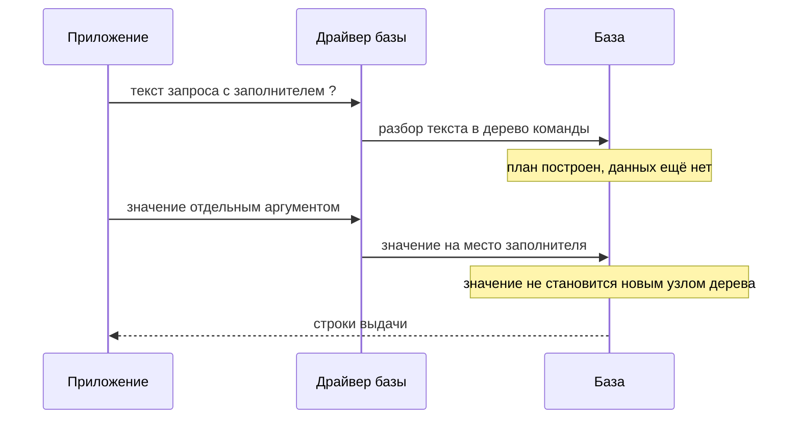
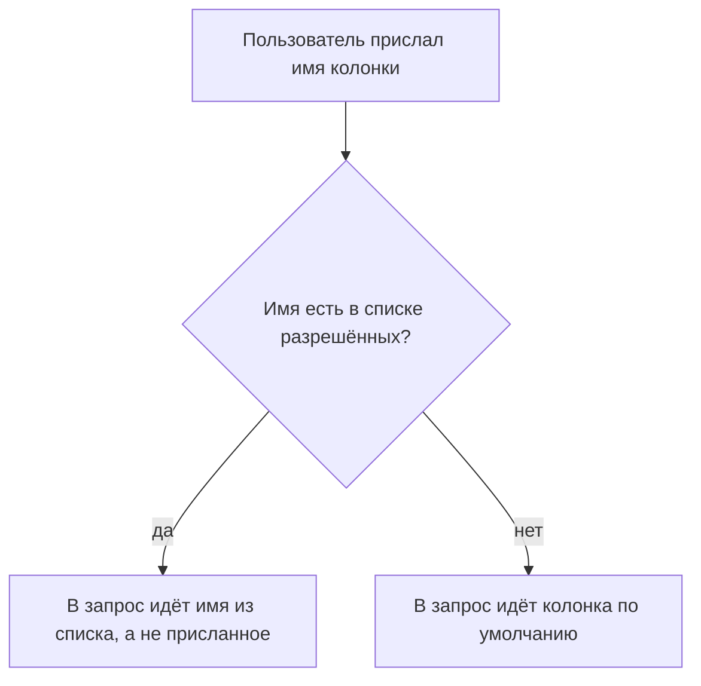

# Параметризованные запросы и безопасный ORM

Из темы `sqli-basics` вы вынесли главную починку инъекции: значение передают
связанным параметром, отдельным аргументом, а не склейкой с текстом запроса.
Первое время этот приём работает безотказно. Потом приходит задача
«сортировка по колонке, которую выберет пользователь». Имя колонки
заполнителем не передаётся, и рука тянется обратно к конкатенации. Прежде чем
тянуться, посмотрите, что база делает с заполнителем на месте имени (прогон
на стенде темы, SQLite 3.53.4):

```text
SELECT ? FROM products   аргумент "name"  → в выдаче строка 'name'
SELECT ... ORDER BY ?    аргумент "price" → порядок не изменился
```

Ошибки не случилось: заполнитель превратился в строку-значение, и запрос
отработал молча и бессмысленно. Граница у параметра одна, и проходит она по
роли в запросе, а не по типу данных: значение параметр переносит, а часть
команды — нет. Сама механика инъекции здесь не повторяется: она разобрана в
`sqli-basics`, а эта тема — про починку целиком.

## Подумай, прежде чем читать

1. Запрос сортируется по колонке, имя которой пришло от пользователя. Можно
   ли передать это имя связанным параметром?
2. В корзине переменное число товаров, и их нужно достать одним запросом со
   списком `IN (...)`, где значений сразу несколько. Как передать такой
   список параметрами, если один заполнитель связывает одно значение?
3. Приложение написано на ORM, библиотеке, которая строит SQL за
   программиста. Значит ли это, что SQL-инъекции в нём быть не может?

## Как это работает

**Связанный параметр** — это способ отдать базе команду и данные раздельно.
Текст запроса едет постоянной строкой, а на месте каждого значения стоит
заполнитель, знак `?` или именованное место вроде `:category`, смотря по
драйверу. Сами значения уходят отдельным аргументом вызова. Запрос с
заполнителями называют параметризованным, а механизм целиком —
подготовленным запросом, потому что база готовит команду до того, как увидит
данные.

Бытовой пример — бумажный бланк с печатным текстом и пустыми полями. Печатный
текст одинаков у всех бланков, а вписанное в поля — данные конкретного
человека. Соответствие такое: печатный текст — постоянная строка запроса,
поле — заполнитель, вписанное — значение. Граница у аналогии тоже есть.
Бланк читает человек и способен понять вписанную фразу «уволить начальника»
как поручение. База так не умеет: структуру команды она разбирает до того,
как видит данные, и вписанное в поле новой строкой бланка стать не может.

**Откуда это взялось.** Инъекция появилась там, где данные и код запроса
поехали в базу одной строкой, и эта механика разобрана в `sqli-basics`.
Драйверы баз ответили отдельным механизмом: запрос отправляется с
заполнителями, значения — отдельно. Так появились подготовленные запросы.
Механизм старый и есть во всех драйверах, но склейка живёт рядом, потому что
короче и работает, пока в данных нет кавычки. Поверх драйверов встали
библиотеки ORM, которые строят SQL за программиста. Инъекция при этом не
исчезла, а переехала туда, где программист обошёл механизм: в сырой фрагмент
и в подстановку имён таблиц и колонок.

### Что делает параметр

Возьмём поиск из `sqli-basics`, переписанный на параметр:

```python
cur.execute(
    "SELECT name, price FROM products WHERE category = ? AND released = 1",
    (category,))
```

База получает текст и значение раздельно и работает с ними в два приёма.
Сначала она разбирает текст в дерево команды: что читать, по какому условию
отбирать строки, что вернуть. На этом шаге данных ещё нет, и дерево строится
только из постоянного текста. Затем база подставляет значение на место
заполнителя уже готового дерева. Значение не может стать новым узлом дерева,
потому что решение о структуре принято раньше, чем значение прочитано.
Поэтому кавычка, `--` или `UNION` внутри `category` остаются данными.

У механизма есть побочная выгода, ради которой он и задуман основным способом
работы с базой. Текст с заполнителями разбирается и планируется один раз, а
исполняется много раз с разными значениями. План выполнения — это выбранный
базой порядок обхода таблиц и индексов, и его повторное использование
снимает разбор с каждого следующего запроса. Склейка эту схему ломает: текст
каждый раз новый, и план строится заново. То есть параметр не обходной приём
ради безопасности, а штатный способ передать данные в запрос.



**Описание схемы.** Схема читается сверху вниз и показывает два раздельных
пути. Сначала в базу уходит только текст запроса с заполнителем, и база
строит по нему дерево команды и план. Данные приходят после, отдельным
аргументом, и попадают на место заполнителя уже готового дерева. Пунктирная
стрелка внизу — ответ базы, строки выдачи.

### Параметр не подставляет имя

Проверено на SQLite: `SELECT ? FROM products` с аргументом `"name"` возвращает
не колонку `name`, а строку `name` в каждой строке выдачи. А `ORDER BY ?` с
аргументом `"price"` не сортирует по цене, потому что сортировка идёт по
постоянному значению, одинаковому у всех строк. Заполнитель на месте имени
стал данными, а данные именем быть не могут. Здесь и проходит граница: не по
типу данных, а по роли в запросе. Одна и та же строка может быть значением в
одном запросе и именем колонки в другом.

Параметром передаётся значение: категория, имя для входа, число. Не
передаётся часть команды:

- имя таблицы;
- имя колонки;
- направление сортировки `ASC` или `DESC`;
- сам оператор.

Cheat sheet, памятка OWASP по предотвращению SQL-инъекций, формулирует
правило прямо: где связать переменную нельзя, там нужна проверка ввода по
списку разрешённого или переделка запроса.

**Список разрешённого** — конечный набор известных имён, записанный в коде, с
которым сверяется присланное. Бытовой пример — список гостей на входе:
охранник не рассуждает, похож ли пришедший на нежелательного, а ищет фамилию
в списке. Нет фамилии в списке — не пройдёт. Противоположный приём, список
запрещённого, проигрывает всегда, потому что перечислить все опасные
варианты нельзя; обходы таких списков разбирает тема `filter-and-waf-bypass`.
Для имени колонки это значит вот что: присланное решает, какой элемент
известного набора взять, а само в текст запроса не попадает.

### Список переменной длины

Отдельный случай — предложение `IN`. Оно проверяет значение на вхождение в
перечень: `id IN (1, 4, 9)` читается как «id равен одному из перечисленных».
Когда число элементов перечня меняется от запроса к запросу, кажется, что
параметр бессилен, потому что один заполнитель связывает одно значение.
Отсюда типовая ошибка: собрать перечень склейкой и вернуть инъекцию.
Правильный приём — сгенерировать заполнитель на каждый элемент:

```python
placeholders = ",".join("?" for _ in ids)   # "?,?,?" под три элемента
cur.execute(
    "SELECT id, name FROM products WHERE id IN (" + placeholders + ")",
    tuple(ids))
```

Текст такого запроса по-прежнему постоянен по смыслу, потому что состоит из
заполнителей и запятых, без единого присланного символа, а значения едут
отдельным аргументом. Это и есть предмет лабы: граница применимости параметра
— не повод вернуться к склейке, а повод сгенерировать заполнители. Вопрос на
проверку понимания: сработает ли тот же приём, когда переменным окажется не
список значений, а имя колонки в `ORDER BY`, и почему?

Часть драйверов и ORM закрывают этот случай встроенно: передаёшь перечень как
одно значение, а библиотека сама разворачивает его в нужное число
заполнителей. Проверять надо, что это делает библиотека, а не склейка в вашем
коде. Результат одинаковый, но у первого варианта заполнители ставит
проверенный код библиотеки, а у второго — автор, который может ошибиться в
следующий раз.

### LIKE: данные остаются данными

Поиск по подстроке строится оператором `LIKE`, где знак `%` означает любые
символы любой длины, а `_` — ровно один символ. Эти подстановочные знаки
иногда пугают, но их опасность преувеличена. Проверено на SQLite: `LIKE ?` с
аргументом `%к%` находит строки с буквой `к`, а с аргументом `%` — все
строки. Знаки внутри связанного значения работают как подстановочные, и это
семантика `LIKE`, а не инъекция, потому что структуру запроса они не меняют.
Присланный `%` — самое большее широкий поиск и лишняя нагрузка, а не чужая
команда. Экранируют знаки при необходимости, но к разделению кода и данных
это отношения не имеет.

### ORM: защита по умолчанию и дыра в ней

**ORM** — библиотека, которая отображает записи базы на объекты кода: запрос
строится вызовами методов вроде `filter`, а не сборкой строки SQL. Бытовой
пример — переводчик, которому вы говорите по-русски «дай товары этой
категории», а он произносит запрос на языке базы. Зачем это нужно: меньше
ручного SQL и меньше мест, где можно ошибиться в синтаксисе. Для этой темы
важно другое: значения ORM подставляет параметрами сам, без участия
программиста. WSTG, руководство OWASP по тестированию, формулирует условие
уязвимости так: приложение на ORM уязвимо к инъекции, если его методы
принимают неочищенный ввод в сыром виде.

Дыра — **сырой фрагмент**: почти каждый ORM даёт способ вставить кусок SQL
руками, методами `raw`, `extra`, `text` или «нативным запросом». Внутри
такого фрагмента действуют те же правила, что без ORM: склейка данных даёт
инъекцию. ORM здесь не спасает, потому что эту часть запроса написал
программист, а не библиотека. WSTG называет и вторую причину, уязвимости в
самом ORM, но она редка и лечится обновлением, тогда как сырой фрагмент
встречается постоянно.

Отдельная ловушка ORM — сортировка. Метод вроде `order_by(field)` часто
принимает имя поля строкой. Если это имя пришло от пользователя без сверки со
списком разрешённого, получается та же подстановка идентификатора, что и в
сыром SQL. ORM параметризует значения, но имя колонки для сортировки — не
значение, и список разрешённого нужен даже здесь.

### Три разных средства, которые путают

На месте защиты от инъекции стоят три вещи, и их постоянно смешивают. Cheat
sheet разводит их по надёжности.

- **Связанный параметр** — починка. Отделяет код от данных на уровне разбора.
- **Проверка ввода по списку разрешённого** — второй рубеж и единственное
  средство там, где параметр невозможен, то есть у идентификаторов. Сама по
  себе инъекцию не закрывает: данные, прошедшие проверку, всё равно нельзя
  склеивать в запрос.
- **Экранирование** — подмена опасных символов безопасным написанием,
  например кавычки двумя подряд. Это крайняя мера, и cheat sheet прямо не
  рекомендует её: она зависит от СУБД и ломается на мелочах. Разбор обходов
  есть в `sqli-basics` и `filter-and-waf-bypass`. Применяется,
  только когда параметр недоступен по объективной причине, и никогда как
  основная защита.

Ещё одно средство — **хранимая процедура**, программа на языке базы, которая
сохранена в самой базе и вызывается по имени. Бытовой пример — кнопка «как
обычно» в кофейне: сложный заказ сведён к одному слову, а рецепт живёт у
бариста. Она безопасна ровно постольку, поскольку внутри не строит
динамический SQL склейкой. Процедура, склеивающая запрос из своих аргументов,
уязвима так же, как приложение. То есть процедура не отдельная защита, а то
же разделение кода и данных, перенесённое в базу.

### Починка нужна на обоих концах

Инъекция второго порядка из `sqli-basics` меняет то, где искать починку.
Напомним: это случай, когда присланное сохраняется без вреда, а срабатывает
позже, когда другой код достаёт его из базы и вставляет в запрос склейкой.
Значит, параметризовать надо не только запрос, принявший ввод, но и все
запросы, которые потом читают сохранённое и строят из него команду. Ревью
проверяет оба конца: место входа данных и каждое место, где сохранённое
значение уходит в новый запрос. Параметр на входе не спасает, если на выходе
стоит склейка.

Отсюда практическое следствие для правки старого кода. Перевод проекта со
склейки на параметры делается не выборочно «где нашли инъекцию», а сплошь.
Один непереведённый запрос, читающий сохранённые данные, оставляет дефект
второго порядка. Порядок правки — от запросов, принимающих ввод
напрямую, к тем, что читают сохранённое. И до тех пор, пока в проекте не
останется склейки данных в текст запроса вовсе.

**Зачем это в работе AppSec-инженера.** На эту тему ссылается блок «как
чинится» каждой инъекционной темы, поэтому ревьюеру важно знать её границы.
Совет «параметризуйте запросы» верен, но неполон: половина реальных инъекций
сидит ровно там, где параметр не работает, в сортировке, в динамическом
списке, в сыром фрагменте ORM. Разобравшись один раз, вы отличаете настоящую
починку от той, что закрыла один запрос и оставила соседний.

## Как это атакуют

Стенд — лаба этой темы, `pilot/lab/parameterized-queries`. Витрина «сравнить
выбранное» тянет карточки по списку id из корзины. Одно значение, категория,
уже передано параметром правильно. Список id собран в предложение `IN`
склейкой.

Атакующий идёт по границе применимости. Шаг первый — найти её:
параметризованная категория неуязвима, а список id собирается из строк,
поэтому именно граница стала местом дефекта. Шаг второй — разорвать список.
Запуск из каталога лабы (вывод обрезан: опущены строка «Цель: code.py» и
итоговая строка эксплойта):

```bash
python3 hack.py
```

```text
опыт 1 — разрыв списка IN: НЕВЫПУЩЕННОЕ В ВЫДАЧЕ, 5 строк
опыт 2 — контроль, выборка id 1 и 4: работает
опыт 3 — контроль, категория Gifts: работает
```

Опыт 1 — строка `2) OR released = 0 OR (1=1` в списке id. Она закрывает
скобку `IN`, дописывает всегда истинное условие и возвращает все товары,
включая снятые с витрины. Открывающая скобка перед `1=1` закрывается
финальной скобкой самого шаблона запроса, поэтому текст остаётся
синтаксически верным. Условие `released = 1` перестало ограничивать выдачу.
Опыты 2 и 3 — контроль: обычная выборка по id и выборка по уже
параметризованной категории обязаны работать и после починки.

Шаг третий — оценить находку. Утечка невыпущенного товара здесь невелика, но
механизм тот же, что открыл бы чужую таблицу: строка из данных стала частью
команды. Дефект сидел ровно там, где параметр «неудобен», и это типичное
место. Первый запрос темы разработчик пишет по образцу и параметризует.
Спотыкается он там, где образец не помогает: список переменной длины,
сортировка по выбору пользователя, условие, которое «проще собрать строкой».
В этих местах он возвращается к склейке, считая её вынужденной. Ревьюер,
который знает границу, идёт сразу к `IN`, к `ORDER BY` и к сырым фрагментам
ORM. Параметризованные запросы он не перечитывает: дефекта там нет по
построению.

## Как это выглядит в коде

Ревьюер ищет три места: склейку данных в текст запроса, разобранную в
`sqli-basics`, подстановку идентификатора и сырой фрагмент ORM. Разбор
первого листинга идёт двумя планами: найти, где собирается текст запроса, и
найти, что ушло в базу без заполнителей. Найдите в обоих фрагментах точку,
где присланное становится частью команды, и объясните, чем эти точки
различаются. Выноски идут следом.

```python
# УЯЗВИМО — демонстрация, не для продакшена
def by_ids(ids):
    in_list = ",".join(ids)                                   # (1)
    query = ("SELECT id, name FROM products "
             "WHERE released = 1 AND id IN (" + in_list + ")")  # (2)
    cur.execute(query)
    return cur.fetchall()
```

1. Список значений собран склейкой: сами значения станут частью команды.
2. Готовая строка уходит в базу без заполнителей, поэтому разделить код и
   данные уже нельзя.

Второй признак — идентификатор из данных. Сортировка по присланному имени
колонки без сверки со списком:

```python
# УЯЗВИМО — демонстрация, не для продакшена
cur.execute("SELECT name FROM products ORDER BY " + sort_col)   # (3)
```

3. Имя колонки склеено в запрос. Параметром его не закрыть, только списком
   разрешённых имён.

Третий признак — сырой фрагмент ORM. Ищите вызовы вроде
`Model.objects.raw(f"...")`, `session.execute(text("... " + value))`,
«нативный запрос» с конкатенацией. Внутри них действуют те же правила, что
без ORM, поэтому такой фрагмент читается как обычный уязвимый листинг из
`sqli-basics`. Присутствие библиотеки рядом не значит, что запрос
параметризован.

## Как защититься

Три места из разбора кода закрываются тремя приёмами.

**Значения — параметрами, в том числе списком.** Для `IN` генерируется
заполнитель на каждый элемент:

```python
# Исправлено.
def by_ids(ids):
    if not ids:
        return []
    placeholders = ",".join("?" for _ in ids)
    query = ("SELECT id, name FROM products "
             "WHERE released = 1 AND id IN (" + placeholders + ")")
    cur.execute(query, tuple(ids))
    return cur.fetchall()
```

Текст запроса здесь тоже собирается склейкой, но склеиваются только
заполнители и запятые, то есть символы, которые написал программист, а не
прислал пользователь. Значения идут отдельным аргументом `execute`, и строка
из списка id больше не может стать частью команды.

**Идентификаторы — списком разрешённого.** Присланное имя сверяется с
конечным набором известных колонок, а в запрос идёт значение из набора, не из
данных:

```python
# Исправлено.
SORTABLE = {"name", "price"}
column = sort_col if sort_col in SORTABLE else "name"   # (1)
cur.execute("SELECT name, price FROM products ORDER BY " + column)
```

1. В запрос попадает элемент известного множества. Присланное решает только,
   какой из них, но само в текст не входит.



**Описание схемы.** Схема читается сверху вниз. Присланное имя колонки
сверяется со списком разрешённых. Если имя в списке есть, в запрос идёт имя
из списка, то есть строка, написанная программистом. Если имени нет, в запрос
идёт колонка по умолчанию. Присланная строка в текст запроса не попадает ни в
одной ветке.

**ORM — методами ORM, без сырого фрагмента.** Для сортировки по выбору
пользователя имя поля тоже берётся из списка разрешённого, а не из строки
напрямую. Даже внутри ORM это подстановка идентификатора.
Сравнение поля со значением вместо `text()` со склейкой:

```python
# Исправлено (SQLAlchemy-подобный идиом).
session.query(Product).filter(Product.category == category)
```

Тот же приём разделения кода и данных работает и на другом стеке. Java с
`PreparedStatement` для значения и списком разрешённого для колонки:

```java
// Исправлено.
if (!SORTABLE.contains(sortCol)) sortCol = "name";   // из списка
PreparedStatement ps = conn.prepareStatement(
    "SELECT name, price FROM products "
    + "WHERE category = ? ORDER BY " + sortCol);     // имя из набора
ps.setString(1, category);                     // значение
```

**Границы применимости.** Параметр закрывает значения и только их.
Идентификатор и порядок сортировки закрывает список разрешённого, и его набор
надо держать в коде, а не принимать снаружи. Сырой фрагмент ORM закрывается
отказом от него в пользу методов, а там, где без сырого SQL нельзя, внутри
него действуют правила `sqli-basics`.

Поверх всего работает принцип наименьших прав: учётная запись, от имени
которой приложение ходит в базу, получает только те права, что нужны её
запросам. Бытовой пример — ключ от своей подсобки вместо мастер-ключа от всех
дверей: потерян один ключ, открыта одна дверь. Даже сработавшая инъекция
достанет меньше, если у записи нет прав на чужие таблицы.

Отдельно — места, где параметр объективно недоступен. Некоторые драйверы не
связывают параметр в части запроса, которая не значение: в имени базы для
`USE`, в некоторых конструкциях `LIMIT` у старых версий. Там остаётся список
разрешённого или приведение к числу: `LIMIT` принимает целое, и `int(value)`
закрывает вопрос надёжнее любой сверки строки. Правило одно: если в запрос
идёт не значение, параметр не поможет, и присланное надо свести к элементу
известного конечного множества.

## Как убедиться, что защита работает

Ретест повторяет разрыв списка против исправленного файла и проверяет
сохранность выборки. Запуск из каталога лабы (вывод обрезан так же: опущены
строка «Цель: solution.py» и итоговая строка):

```bash
LAB_TARGET=solution.py python3 hack.py
```

```text
опыт 1 — разрыв списка IN: нет
опыт 2 — контроль, выборка id 1 и 4: работает
опыт 3 — контроль, категория Gifts: работает
```

Отказ эксплойта и два рабочих контроля. Регресс закрывают пять тестов
функциональности из `tests.py`: выборка по списку, выборка одного id,
невыпущенный товар, выборка по категории и скрытие невыпущенного в ней. Все
пять проходят и на уязвимом файле, и на решении, потому что атака ломала не
функциональность, а границу доступа.

Отдельно проверяется список разрешённого для сортировки: присланное имя вне
набора не роняет запрос и не попадает в него, а подменяется значением по
умолчанию. И отдельно — что в коде не осталось сырого фрагмента ORM со
склейкой. Это ищется не тестом, а чтением кода и правилом из следующего
раздела.

Ревью по теме целиком сводится к шести проверкам:

1. Проверьте, что значения передаются связанными параметрами, включая списки
   переменной длины через сгенерированные заполнители (ASVS v5.0-1.2.4).
2. Проверьте, что имена таблиц, колонок и направление сортировки сверяются со
   списком разрешённого, а не берутся из данных.
3. Проверьте, что список разрешённого для идентификаторов задан в коде, а не
   принимается снаружи.
4. Проверьте, что вызовы ORM не содержат сырого фрагмента SQL, собранного из
   данных (`raw`, `extra`, `text`, нативный запрос).
5. Проверьте, что находка SAST на сборке текста запроса проверена глазами:
   собирается ли строка из данных или из заполнителей и списка разрешённого.
6. Проверьте, что учётная запись базы имеет только нужные права, а не
   административные.

## Как это находят инструменты

Правило то же, что в `sqli-basics`: `sql-query-string-built` ловит текст
запроса, собранный склейкой, f-строкой, `%` или `.format()` и ушедший в
`execute`. Файл правила лежит в `pilot/semgrep/sql-query-string-built.yaml`.

**Здесь у правила честное слепое пятно.** На границе применимости оно не
отличает опасную сборку от безопасной. Прогон на лабе показывает это прямо:

```text
code.py     — находки: [(53, 'sql-query-string-built')]
solution.py — находки: [(42, 'sql-query-string-built')]
```

Уязвимый файл собирает `IN` из данных, и находка верна. Решение собирает `IN`
из заполнителей `?`, и правило находит то же, потому что видит сборку строки
из частей, а не смысл частей. Отличить `",".join(ids)` от `",".join("?" ...)`
сигнатура не может.

**Что из этого следует для ревью.** Находку правила на сборке `IN` или на
подстановке идентификатора надо смотреть глазами: собирается текст из данных
или из заполнителей и списка разрешённого. Первое — дефект, второе — ложное
срабатывание, снимаемое пометкой. Именно поэтому граница применимости —
работа человека, а не сканера: статический анализ отвечает на форму, а форма
у безопасной и опасной сборки одна. Отдельно правило пропустит сырой фрагмент
ORM, если тот идёт не в `execute`, а в метод ORM с другим именем. Список
стоков дополняется именами этих методов, но общий вывод тот же: где текст
запроса собирается из частей, последнее слово за ревьюером.

## Частая ошибка

Весь проект написан на ORM, сырого SQL в коде не видно. Есть ли смысл искать
здесь инъекцию? На ревью проект защищают одной фразой: приложение написано на
ORM, значит, SQL-инъекции в нём быть не может.

**ORM параметризует то, что построил сам, и не трогает то, что вписал
программист руками.** Защита по умолчанию действует, пока запрос собран
методами ORM. Сырой фрагмент, `raw`, `extra`, `text`, нативный запрос,
выпадает из-под неё целиком.

Контрпример. Отчёт на SQLAlchemy фильтрует данные методами ORM и содержит
одну строку `session.execute(text("... WHERE name = '" + name + "'"))`,
потому что «так было проще для сложного условия». Эта строка — обычная
инъекция, и ORM её не видит. Наличие ORM в проекте не отвечает на вопрос,
параметризован ли конкретный запрос.

Вторая частая ошибка — считать список разрешённого для сортировки лишним, раз
«пользователь всё равно выбирает из выпадающего списка». Выпадающий список
живёт в браузере, а запрос приходит по сети, и в нём может стоять любое имя
колонки. Проверка выбора на клиенте не защита, это разобрано в
`client-side-access-checks`. Список разрешённых имён колонок нужен на
сервере, где строится запрос, а не там, где рисуется меню.

## Попробуй сам

Лаба `lab-parameterized-queries`, каталог `pilot/lab/parameterized-queries`.
Формат «почини»: правится `code.py`, пока `hack.py` и `tests.py` не станут
зелёными одновременно.

**Цель одной фразой:** добиться, чтобы `hack.py` вышел с кодом 0, а
`tests.py` продолжил выходить с кодом 0.

Всё локально, только модулем `sqlite3` из стандартной библиотеки, без сети и
без Docker. Запуск:

```bash
cd pilot/lab/parameterized-queries
python3 tests.py
python3 hack.py
```

На старте ожидается такая картина: тесты зелёные, а `hack.py` сообщает
«ЭКСПЛОЙТ СРАБОТАЛ» и выходит с кодом 1. После починки картина обратная:
эксплойт отказывает, а тесты остаются зелёными.

Одна подсказка: «список переменной длины параметром не передать» —
полуправда. Передать нельзя один параметр-список, но можно сгенерировать
заполнитель на каждый элемент и связать значения отдельным аргументом.

**Отдельная задача «почини».** Категория уже параметризована, не трогайте её.
Почините только список id: заполнитель на каждый элемент, значения отдельным
аргументом. Проверяется тем, что опыт 1 перестаёт возвращать невыпущенное, а
опыты 2 и 3 продолжают работать.

Решение лежит в `solution.py` и открывается после своей попытки.

## Проверь себя

1. Список товаров собран методами ORM, сортировка — тоже методом:

   ```python
   SORTABLE = {"name", "price", "date"}

   def product_list(request):
       sort = request.GET.get("sort", "name")
       qs = Product.objects.filter(released=True)
       return qs.order_by(sort)
   ```

   Где здесь дефект и почему его не закрывает то, что запрос строит ORM?

2. Функция из раздела «Как это выглядит в коде» собирает список `IN`
   склейкой:

   ```python
   def by_ids(ids):
       in_list = ",".join(ids)
       query = ("SELECT id, name FROM products "
                "WHERE released = 1 AND id IN (" + in_list + ")")
       cur.execute(query)
       return cur.fetchall()
   ```

   Какую починку вы выберете?

   A. Вынести запрос в хранимую процедуру: код запроса переедет в базу, и
      данные отделятся от команды.

   B. Сгенерировать по заполнителю `?` на каждый элемент и связать значения
      отдельным аргументом `execute`.

   C. Экранировать кавычки в элементах списка и оставить склейку.

3. Почему связанный параметр отделяет данные от кода, а экранирование — нет?
4. Имя колонки для сортировки пришло от пользователя. Предскажите вывод этого
   фрагмента и ответьте по нему: можно ли передать имя связанным параметром?

   ```python
   import sqlite3
   db = sqlite3.connect(":memory:")
   db.execute("CREATE TABLE products (name TEXT, price INT)")
   db.execute("INSERT INTO products VALUES ('чашка', 100), ('ложка', 50)")
   print(db.execute("SELECT ? FROM products", ("name",)).fetchall())
   q = "SELECT name FROM products ORDER BY ?"
   print(db.execute(q, ("price",)).fetchall())
   print(db.execute("SELECT name FROM products ORDER BY price").fetchall())
   ```

5. Возврат к теме `sqli-basics`: чем сборка `IN` из заполнителей отличается
   от сборки `IN` из значений, если обе используют склейку строки?

<details markdown="1">
<summary>Ответ 1</summary>

1. В `order_by(sort)`: имя поля пришло из запроса и не сверено со списком
   `SORTABLE`, который в коде объявлен и не используется. ORM параметризует
   значения, а имя колонки — не значение, и метод `order_by` принимает его
   строкой. Получается та же подстановка идентификатора, что в сыром SQL.
   Починка — сверить `sort` со списком разрешённого и взять имя из него.

</details>

<details markdown="1">
<summary>Ответ 2: разбор вариантов</summary>

2. Верный ответ — B.

   A. Процедура сама по себе не отделяет данные: процедура, склеивающая
      динамический SQL из своих аргументов, уязвима так же, как приложение.
      Хранимая процедура — то же разделение кода и данных, перенесённое в
      базу, и работает она, только когда внутри нет склейки.

   B. В текст запроса входят только заполнители и запятые — ни одного
      присланного символа, а значения едут отдельным аргументом. Это и есть
      предмет лабы: прогон `LAB_TARGET=solution.py python3 hack.py` в
      `pilot/lab/parameterized-queries` даёт отказ на разрыве списка при
      работающей выборке.

   C. Экранирование — крайняя мера, которую Cheat Sheet прямо не рекомендует:
      оно зависит от СУБД и ломается на мелочах — числовом контексте,
      кодировках, пропущенном символе. Склейка остаётся склейкой.

</details>

<details markdown="1">
<summary>Ответ 3</summary>

3. Параметр отделяет их на уровне разбора: структура команды определена
   постоянным текстом до подстановки значения, и данные не могут стать новым
   узлом дерева. Экранирование правит символы в уже смешанной строке и потому
   хрупко: числовой параметр, кодировки и пропущенный символ его обходят.

</details>

<details markdown="1">
<summary>Ответ 4</summary>

4. Нельзя: заполнитель — место значения, не идентификатора. Фрагмент печатает
   `[('name',), ('name',)]` — вместо колонки выбрана строка-значение `name`.
   Затем `[('чашка',), ('ложка',)]` — сортировка по постоянному значению
   ничего не сортирует. И настоящая сортировка для контраста: `[('ложка',),
   ('чашка',)]`. Ответ получен прогоном этого фрагмента; прогон повторён
   2026-10-03 на SQLite 3.53.4, и вывод совпал дословно. Ошибки не происходит
   — запрос отрабатывает молча и бессмысленно, поэтому вместо параметра здесь
   ставят список разрешённых имён.

</details>

<details markdown="1">
<summary>Ответ 5</summary>

5. В сборке из заполнителей в текст входят только `?` и запятые — ни одного
   присланного символа, а значения едут отдельным аргументом. В сборке из
   значений присланное попадает в текст команды. Сигнатура SAST видит
   одинаковую форму — сборку строки из частей — и не различает смысл частей,
   поэтому такую находку читают глазами.

</details>

## Источники

1. PortSwigger Web Security Academy, «SQL injection»; реестр `ps-sqli`.
   Разделы: How to prevent SQL injection, Parameterized queries.
   <https://portswigger.net/web-security/sql-injection>
2. OWASP SQL Injection Prevention Cheat Sheet; реестр `owasp-cs-sqli-prevention`.
   Разделы: Defense Option 1 Prepared Statements, Option 3 Allow-list Input
   Validation, Safe use of an ORM, Additional Defenses — Least Privilege.
   <https://cheatsheetseries.owasp.org/cheatsheets/SQL_Injection_Prevention_Cheat_Sheet.html>
3. OWASP WSTG «Testing for ORM Injection», WSTG v4.2; реестр
   `wstg-v42-inpv-0507-orm-injection`. Разделы: Summary, How to Test, weak ORM
   implementation, vulnerable ORM libraries.
   <https://owasp.org/www-project-web-security-testing-guide/v42/4-Web_Application_Security_Testing/07-Input_Validation_Testing/05.7-Testing_for_ORM_Injection>

Каркас этапа: `owasp-asvs-5-document` (ASVS v5.0.0), `owasp-wstg-42`,
`owasp-top10-2025`. Наследуются всеми темами и отдельной строкой не
повторяются. Вторая и третья сноски — якоря починки для всего подраздела 1.3.

**Скоропортящийся слой.** Имена методов сырого фрагмента привязаны к ORM:
`raw`, `extra` в Django, `text` в SQLAlchemy, «нативный запрос» в JPA. Их
набор меняется вместе с версиями библиотек. Страницы Web Security Academy и
cheat sheet — живые площадки без даты публикации.

**Маркеры уверенности.** Поведение параметра — **проверено лично** 2026-08-24
на SQLite 3.53.4: `SELECT ?` с аргументом `name` возвращает строку `name`, а
не колонку; `ORDER BY ?` с аргументом `price` не сортирует; `LIKE ?` со
значением `%` возвращает все строки, то есть знак `%` внутри значения
остаётся данными. Прогоны лабы и правила SAST — **проверено лично** там же на
Semgrep 1.174.0: разрыв списка `IN` даёт пять строк на `code.py` и отказ на
`solution.py`, пять тестов функциональности проходят в обоих случаях, правило
`sql-query-string-built` находит сборку `IN` и на уязвимом файле, и на
решении — слепое пятно из раздела «Как это находят инструменты». Приёмы
починки, границы применимости и безопасный ORM — **по документации** (cheat
sheet и WSTG-INPV-05.7, открыты лично 2026-08-24). Требование 1.2.4 сверено с
текстом ASVS v5.0.0 (открыт лично 2026-08-24). Листинг на Java **не
запускался**: стенда под JVM не собиралось. При переписывании 2026-10-03
прогоны лабы на `code.py` и `solution.py` и фрагмент из вопроса 4 повторены
на том же стенде: выводы совпали дословно.
