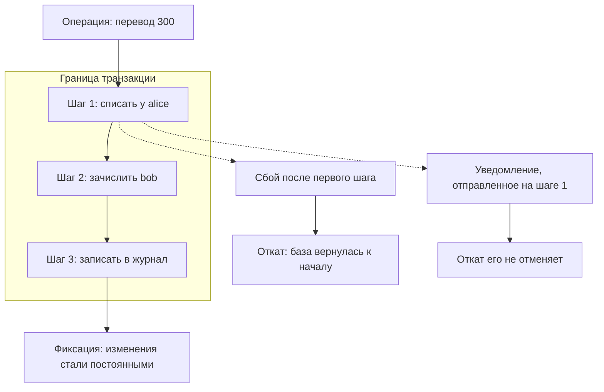

# Восстановление после сбоя и частичные изменения

Приложение переводит 300 единиц со счёта alice на счёт bob. Код перевода
состоит из трёх шагов: списать у alice, зачислить bob, записать перевод в
журнал. На втором шаге процесс падает, например из-за обрыва соединения с
базой. Систему поднимают, и выясняется, что с alice уже списано 300, а bob
их не получил: на двух счетах вместе 1700 вместо 2000. Стоит переставить
шаги местами — и после такого же сбоя на счетах окажется 2300: ещё 300
появились из ниоткуда. Журнал в обоих случаях пуст, потому что запись в
него — третий шаг, до которого управление не дошло.

Состояние, оставшееся после прерванной посередине операции, называется
частичным изменением. Его не предусматривал никто: его определяет то, докуда
успело дойти управление. Ниже разберём, почему от порядка шагов зависят
чужие деньги, почему база данных откатывает не всё и как писать операции,
которые переживают сбой.

## Что такое частичное изменение

Начнём с бытового примера. Вы собираете шкаф по инструкции: прикрутили
боковины, навесили дверцы — и тут отключили свет. Шкаф остался
недособранным, и инструкция такого состояния не описывает: она знает
«разобранный шкаф» и «собранный шкаф», а середину не знает. С операцией в
программе то же самое. Код описывает начало и конец, а сбой оставляет
систему между шагами, в состоянии, которого никто не писал.

Соответствие частям такое: шаги сборки — шаги операции, инструкция — код,
недособранный шкаф — частичное изменение. Аналогия ломается на продолжении
работы. Шкаф можно дособрать с любого места, потому что видно, что уже
сделано. Программа после сбоя обычно не знает, докуда дошло управление, и
это станет предметом отдельного раздела ниже.

Теперь определение. **Частичное изменение** — состояние системы, в котором
выполнена часть шагов операции, а остальные не выполнены. Понятие нужно,
чтобы назвать дефект точно. Перевод, который списал деньги и не зачислил
их, — не «ошибка сети» и не «невезение», а конкретное состояние с конкретной
ценой.

Граница темы. Повтор запроса как таковой — например, клиент не получил
ответ и послал платёж ещё раз — разбирает тема `idempotency`. Здесь предмет
уже: что осталось в системе после того, как операция не доехала до конца, и
что из этого можно повторять.

**Зачем это в работе AppSec-инженера.** Дефект не находится сканером и почти
не находится тестами: тесты идут по рабочему пути, а этот путь — по
сбойному. Зато он воспроизводится вручную и стоит денег, поэтому его любят
на аудитах. Вопрос ревью один и короткий: если операция упадёт после
третьего шага, что останется применённым и в чью пользу.

## Как это работает

**Откуда это взялось.** Транзакция придумана как ответ ровно на этот вопрос:
что делать с половиной сделанной работы. Транзакция — набор изменений базы
данных, который база выполняет по принципу «всё или ничего». Бытовой пример
— банкомат: он либо выдал деньги и списал их со счёта, либо не сделал ни
того ни другого. Вариант «выдал, но не списал» исключён устройством
операции. Два слова из этого принципа понадобятся дальше. Фиксация —
момент, когда изменения становятся постоянными. Откат — возврат базы к
состоянию до начала транзакции.

Появилась транзакция в базах данных, потому что там убыток считается прямо.
Приложения выросли шире базы: часть операции уходит в кэш, быстрое
хранилище рядом с приложением, часть — в соседнюю службу, часть остаётся в
памяти процесса. Граница транзакции при
этом не выросла: она осталась у базы, и всё, что за ней, откатывать некому.
Каталог слабостей CWE держит для этого номер CWE-460: код не убирает за
собой при брошенном исключении, и программа остаётся в неверном состоянии.

Стенд темы — три варианта одного перевода. Каждый переводит 300 единиц
между счетами alice и bob и ломается на втором шаге. Первый вариант списывает
с alice первым шагом, второй первым шагом зачисляет bob, третий выполняет
оба изменения в одной транзакции.

```text
$ python e08-partial-transfer.py
до перевода: alice 1000, bob 1000, всего 2000; перевод 300

способ           сбой  alice   bob  всего  журнал
списание первым  нет    700  1300   2000       1
списание первым  да     700  1000   1700       0
зачисление 1-м   нет    700  1300   2000       1
зачисление 1-м   да    1000  1300   2300       0
в транзакции     нет    700  1300   2000       1
в транзакции     да    1000  1000   2000       0
```

Все три пары одинаковы на рабочем пути: 700, 1300, 2000 и запись в
журнале. На сбойном пути первые две расходятся. Порядок шагов, когда-то
выбранный по удобству чтения кода, решает, кто платит. При
списании первым из системы исчезают 300 единиц. При зачислении первым 300
единиц появляются из ниоткуда, и такой сбой воспроизводится по желанию: это
уже не потеря, а способ печатать деньги. Журнал пуст в обоих случаях,
потому что запись о переводе — третий шаг, до него управление не дошло, и в
отчётности расхождения не видно.

Вариант «в транзакции» ломается на том же втором шаге, а сумма сошлась.
Почему, если порядок шагов не менялся? Потому что оба изменения оказались
внутри одной границы: откат вернул оба сразу, и порядок шагов внутри
границы уже ничего не решает. Границу задаёт код: всё между началом
транзакции и фиксацией живёт и умирает вместе.



**Описание схемы.** Схема читается сверху вниз. Операция входит в границу
транзакции и выполняет три шага. Если сбоя нет, третий шаг ведёт к фиксации,
и изменения становятся постоянными. Если сбой случился после первого шага,
откат возвращает базу к началу. Уведомление, которое первый шаг отправил
наружу, живёт за границей транзакции, и откат его не отменяет.

### Что переживает откат

Второй стенд оформляет заказ, начисляя бонусные баллы во внешнее хранилище
и выставляя поле объекта, и получает отказ платежа. Внешнее хранилище
здесь — кэш со счётчиком баллов.

```text
$ python e09-side-effect-outside-tx.py
10 попыток оформления, платёж отклонён в каждой, по 50 баллов за заказ

схема       заказов в базе  баллов в кэше  order.paid
наивная                  0            500        True
отложенная               0              0       False
```

Десять отменённых оформлений, ноль заказов в базе, 500 баллов в кэше. Это
в точности сценарий из руководства по тестированию WSTG. Покупатель начинает
покупку, доводит её до начисления баллов и отменяет; повторяя это, он
набирает баллы, ничего не купив. Транзакция при этом отработала верно:
заказов нет, потому что платёж не прошёл. Но власти над кэшем у транзакции
нет.

Видов состояния, которое переживает откат, три, и все три названы в
документации веб-фреймворка Django. Первый вид — значения полей объекта в
памяти процесса: откат не вернёт им прежних значений. Поле `order.paid`
из прогона так и осталось истинным при отменённом заказе. Второй вид —
внешние хранилища и глобальные переменные: кэш, счётчики, флаги. Третий
вид — порождённые действия: письмо, сообщение в очередь, вызов соседней
службы. Очередь здесь — посредник, который принимает сообщение сразу, а
передаёт обработчику позже. Такие действия за пределами базы называют
побочными эффектами.

Порождённое действие нельзя отменить вовсе: отправленное письмо не
вернуть. Поэтому его не выполняют до фиксации. Средство названо в той же
документации: `transaction.on_commit` регистрирует действие, которое
случится только после успешной фиксации. Схема «отложенная» во второй
строке прогона — это оно и есть: баллы начисляются после фиксации,
фиксации не было, и баллов нет.

### Возобновление против повтора

Остался третий вопрос: что делать после сбоя. Третий стенд повторяет
платёж, ответ на который потерялся по дороге.

```text
$ python e10-retry-double-credit.py
счёт alice 1000, платёж 200, попыток 4
ответ теряется на всех попытках, кроме последней

схема          alice  shop  списаний  записей о ключе
без ключа        200   800         4                0
с ключом         800   200         1                1
```

Клиент повторил один платёж четыре раза, потому что не получил ответа, и
списан он тоже четырежды. Механизм ключа идемпотентности разобран в теме
`idempotency`: сервер запоминает ключ операции и повтор с тем же ключом не
исполняет заново. Здесь важно следствие для восстановления. Возобновлять
прерванную операцию с середины опаснее, чем повторять её целиком с ключом.
Категория A10:2025 списка OWASP Top 10 говорит об этом прямо: попытка
восстановить транзакцию с середины — то самое место, где создаются
непоправимые ошибки.

Почему возобновление с середины опаснее? Чтобы продолжить с середины, надо
знать, докуда дошло управление. После сбоя это знание обычно и потеряно:
именно его уничтожило исключение. Повтор целиком этому знанию не нужен, а
ключ идемпотентности делает его безопасным.

## Как это атакуют

Сбоя атакующий ждать не обязан: во многих случаях остановку посередине он
устраивает сам.

Первый случай — операция, которая идёт несколькими запросами: корзина,
оплата, подтверждение заказа. Атакующий сам решает, на каком запросе
остановиться, и для приложения такая остановка неотличима от сбоя.
Устройство многошаговых операций и их проверки разбирает тема
`multistep-flow-checks`. Здесь важно следствие: каждая точка между
запросами — готовая точка сбоя, и атакующий проходит операцию до выгодного
ему места и отменяет.

Второй случай — стенд с баллами из раздела «Что переживает откат».
Руководство по тестированию WSTG требует здесь одного: если процесс
прерван, не дойдя до конца, все действия и порождённые ими действия обязаны
быть откачены или отменены. Пример из того же раздела — баллы, начисленные
до завершения покупки. Порядок ретеста короткий. Доведите операцию за
точку начисления, отмените её, сверьте счётчик и повторите. Десять циклов
на стенде дали 500 баллов при нуле заказов.

Третий случай — порядок шагов «зачисление первым». Сбой между шагами
добавляет получателю деньги из ниоткуда, поэтому задача атакующего —
получить сбой между шагами воспроизводимо. Надёжнее всего это работает
там, где шаги разнесены по запросам: второй запрос можно не отправить.

Четвёртый приём — не остановка, а повтор. Если операция не проверяет ключ
идемпотентности, повтор исполняется заново: стенд с платежом списал одни и
те же деньги четырежды. У жертвы повтор возникает сам, из-за потери ответа.
Атакующему достаточно отправить запрос ещё раз.

## Как это выглядит в коде

Первый признак — несколько изменений подряд без общей границы. Найдите в
фрагменте границу сбоя: где операция прервётся и что уже успеет примениться.

```python
# УЯЗВИМО — демонстрация, не для продакшена
def transfer(src, dst, amount):
    db.execute("update acc set bal = bal - ? where id = ?", (amount, src))
    notify(dst, amount)      # (1) вызов наружу между двумя изменениями
    db.execute("update acc set bal = bal + ? where id = ?", (amount, dst))
```

1. Сбой здесь оставляет списание без зачисления, а вызов наружу — уже
   сделанным.

Второй признак — побочный эффект внутри транзакции. Блок
`transaction.atomic()` — способ Django открыть транзакцию явно: всё внутри
него живёт в одной границе. Побочных эффектов в фрагменте три — попробуйте
перечислить все, не заглядывая в выноски.

```python
# УЯЗВИМО — демонстрация, не для продакшена
with transaction.atomic():
    order.save()
    cache.incr(f"points:{user.id}", 50)   # (2) откат этого не отменит
    order.paid = True                     # (3) полю значение не вернётся
    charge(card, order.total)             # (4) отменять уже нечем
```

2. Внешнее хранилище живёт своей жизнью и об откате не узнает.
3. Документация прямо предупреждает: поля объекта откатом не восстанавливаются.
4. Правится переносом в `transaction.on_commit` или в отдельный шаг после
   фиксации. Третий вариант — вызов до транзакции с компенсацией на случай
   сбоя — разобран в разделе «Как защититься».

Третий признак — перехват исключения внутри блока транзакции. Документация
Django выносит это отдельной врезкой: пойманное внутри `atomic` исключение
скрывает от фреймворка сам факт сбоя, и вместо отката получается
неопределённое поведение. Ловить полагается снаружи блока.

Ложное срабатывание бывает у первого признака: два изменения подряд не
всегда части одной операции. Признак законности — независимость. Если после
сбоя между ними система остаётся верной с точки зрения предметной области,
общая граница не нужна. Например, запись в журнал посещений и обновление
счётчика просмотров не обязаны жить и умирать вместе.

## Как защититься

Защита собирается из шести решений. Первое — главное, остальные закрывают
то, что осталось за границей.

Решение первое: **одна граница на операцию**. Стандарт верификации ASVS
требует этого в пункте `v5.0-2.3.3`: операция, меняющая несколько
сущностей, выполняется целиком или возвращается к прежнему верному
состоянию. Границу задаёт смысл операции, а не число запросов к базе. В
перевод входят списание, зачисление и запись в журнал, и все три стоят в
одной транзакции.

Решение второе: **побочные эффекты — после фиксации**. Письмо, сообщение в
очередь, начисление в кэше, вызов соседней службы регистрируются как
отложенные и выполняются, когда транзакция удалась. В Django для этого
служит `transaction.on_commit`, в других фреймворках — его аналоги. Так
выглядит исправленный вариант второго листинга из раздела «Как это выглядит
в коде»:

```python
# Исправленный вариант
def checkout(order, user, card):
    charge(card, order.total, key=order.id)  # (1) оплата до транзакции
    try:
        with transaction.atomic():           # (2) одна граница на базу
            order.paid = True
            order.save()
            transaction.on_commit(           # (3) баллы после фиксации
                lambda: cache.incr(f"points:{user.id}", 50))
    except Exception:                        # (4) перехват снаружи
        refund(card, order.total)            # (5) компенсация оплаты
        raise
```

1. Вызов платёжного шлюза стоит до транзакции, потому что откат базы его
   не отменит. Ключ `order.id` делает повтор оплаты безопасным: это механизм
   из темы `idempotency`.
2. Изменения базы собраны в одну границу: поле и запись появятся вместе или
   не появятся вовсе.
3. Начисление баллов отложено до фиксации: отменённый заказ баллов не
   принесёт.
4. Перехват стоит снаружи блока: исключение не прячется от механизма
   отката.
5. Оплата уже ушла наружу, и вернуть её может только обратное действие —
   возврат.

Решение третье: **перехват исключений — снаружи блока транзакции**. Внутри
блока перехват скрывает сбой от механизма отката. Снаружи он ещё и
очерчивает явно, какой набор операций откатывается: у листинга с `checkout`
это всё, что внутри `atomic`.

Решение четвёртое: **состояние в памяти возвращается вручную**. Поля
объектов, флаги и кэши процесса откат базы не касается. Их восстановление
пишется в ветке обработки ошибки: если до сбоя поле выставлено, ветка
ошибки возвращает ему прежнее значение.

Решение пятое: **повтор целиком с ключом вместо возобновления с середины**.
Ключ идемпотентности делает повторяемым весь шаг целиком. Частичное
возобновление требует знать, докуда дошли, а это знание после сбоя обычно и
потеряно.

Решение шестое: **прерванная операция записывается в журнал как событие**
(`v5.0-16.3.4`). Расхождение состояний, найденное через месяц по отчёту,
стоит дороже, чем строка о сбое в день сбоя.

**Границы применимости.** Общая транзакция невозможна, когда шаги живут в
разных системах: база, платёжный шлюз, склад. Тогда границу заменяют схемой
компенсаций: каждый шаг получает обратное действие, а операция считается
завершённой только после последнего. В листинге с `checkout` компенсация —
вызов `refund`: он отменяет оплату, если заказ не зафиксировался. Цена решения —
компенсации надо писать, проверять и хранить, и это отдельная работа, а не
настройка.

## Как убедиться, что защита работает

Защита от сбоя проверяется сбоем: иначе вы знаете только то, что работает
рабочий путь. Метод тот же, что у стендов темы. Для каждой границы между
шагами вставьте исключение и прогоните операцию. После прогона сверьте
четыре вещи: суммы по счетам сошлись, неподтверждённых заказов в базе нет,
побочных эффектов не случилось, запись о сбое в журнале есть. Если всё это
выполняется на каждой границе, граница транзакции стоит правильно.

На ревью пройдите по списку.

1. Проверьте, что операция, меняющая несколько сущностей, выполняется целиком или
   возвращается к прежнему верному состоянию (`v5.0-2.3.3`).
2. Проверьте, что начисления, скидки и бонусы применяются после подтверждения
   оплаты, а не до него, и отменяются при отмене операции.
3. Проверьте, что вызовы наружу и отправка сообщений не выполняются внутри
   транзакции, а откладываются до её фиксации.
4. Проверьте, что перехват исключений расположен снаружи блока транзакции, а не
   внутри него.
5. Проверьте, что состояние вне базы — поля объектов, кэш, счётчики — приводится в
   исходный вид в ветке обработки ошибки.
6. Проверьте, что прерванная операция записывается в журнал как событие
   безопасности (`v5.0-16.3.4`).
7. Проверьте, что повтор прерванной операции выполняется целиком под ключом, а не
   возобновлением с середины (`v5.0-16.5.3`).

## Частая ошибка

Ответ сформулируйте раньше опровержения: отвечает ли база за целостность
всей операции, и что тогда остаётся за приложением?

Расхожее представление отдаёт последнее слово хранилищу: за целостность
отвечает база, и раз запросы идут через ORM (Object-Relational Mapping),
частичных изменений не бывает. ORM — слой, который превращает обращения к
объектам в коде в запросы к базе; его защита от внедрения разобрана в теме
`parameterized-queries`.

Представление неверно, потому что транзакция гарантирует ровно то, что
внутри её границы, и граница уже той, чем кажется. Стенд с баллами показал
500 баллов при нуле заказов, и база там отработала верно. Документация
Django добавляет к этому две вещи, которые в «всё в транзакции» не
помещаются. Режим по умолчанию — автофиксация: каждый запрос фиксируется
сам по себе, пока транзакция не открыта явно. А включённая настройка
`ATOMIC_REQUESTS` оборачивает только исполнение обработчика: прослойки
обработки запроса (мидлварь) и отрисовка шаблона остаются снаружи.

Второе заблуждение того же вида: «мы всё равно повторим операцию, и она
доделается». Повтор без ключа не доделывает, а делает заново: стенд с
платежом списал деньги четыре раза за один платёж.

## Попробуй сам

Возьмите одну операцию своего или учебного проекта, меняющую больше одной
сущности. Выпишите её шаги по порядку и отметьте у каждого, где он живёт:
база, кэш, память процесса, соседняя служба. Затем для каждой границы между
шагами ответьте, что останется применённым, если сбой случится именно здесь.
Два самых интересных места проверьте прогоном, вставив исключение.

**Критерий:** составлена таблица шагов с указанием места хранения и не меньше
трёх разобранных точек сбоя. По двум из них приведён вывод прогона с
состоянием системы после сбоя. Отдельно названо, в чью пользу расходится
состояние в каждой точке.

## Проверь себя

1. После сбоя операцию решили «доделывать с середины»:

   ```python
   def resume(order_id):
       order = Order.get(order_id)
       if not order.paid:
           charge(order.card, order.total)
           order.paid = True
           order.save()
   ```

   Сбой случился после `charge` и до `save`. Что сделает такое возобновление?

2. Перевод из раздела «Как это выглядит в коде» делает вызов наружу между
   двумя изменениями:

   ```python
   def transfer(src, dst, amount):
       db.execute("update acc set bal = bal - ? where id = ?", (amount, src))
       notify(dst, amount)
       db.execute("update acc set bal = bal + ? where id = ?", (amount, dst))
   ```

   Какую починку вы выберете?

   A. Обернуть всё в транзакцию вместе с `notify`: тогда вызов откатится
      вместе с базой.

   B. Обе записи — в одну транзакцию, а `notify` — в отложенное действие,
      выполняемое после фиксации.

   C. Поменять шаги местами — сначала зачисление, потом списание, — чтобы
      сбой оставлял деньги у клиентов, а не у банка.

3. Почему перехват исключения внутри блока транзакции хуже перехвата снаружи?
4. Предскажите, что напечатает этот фрагмент, — в чью пользу расходится
   состояние?

   ```python
   def transfer(accounts, amount, crash):
       accounts["alice"] -= amount
       if crash:
           raise RuntimeError("сбой второго шага")
       accounts["bob"] += amount

   acc = {"alice": 1000, "bob": 1000}
   try:
       transfer(acc, 300, crash=True)
   except RuntimeError:
       pass
   print(acc, "всего:", sum(acc.values()))
   ```

5. Возврат к теме `idempotency`: чем повтор, вызванный потерей ответа,
   отличается от повтора, вызванного действием пользователя, и почему для
   первого нужен ключ?
6. Возврат к теме `fail-open-vs-fail-closed`: в какую сторону обязана упасть
   система при сбое платежа и почему вариант «зачисление первым» падает в
   другую?

<details markdown="1">
<summary>Ответ 1</summary>

1. Списание выполнится второй раз: `order.paid` остался ложным, потому что
   сбой уничтожил ровно то знание, на которое возобновление опирается, — докуда
   дошло управление. Правило темы: прерванную операцию повторяют целиком под
   ключом идемпотентности, а не возобновляют с середины.

</details>

<details markdown="1">
<summary>Ответ 2: разбор вариантов</summary>

2. Верный ответ — B.

   A. Откат транзакции властен над базой и только над ней: вызов наружу уже
      совершён, и отменить его откатом нельзя. Письмо или уведомление,
      отправленное внутри транзакции, переживает её откат — об этом прямо
      предупреждает документация Django.

   B. Записи живут и умирают вместе, а побочный эффект запускается после
      успеха — `transaction.on_commit` и его аналоги. Сбой второго шага
      оставляет оба счёта прежними, и уведомление не отправляется.

   C. Порядок решает лишь, в чью пользу расхождение: на стенде темы это 1700
      против 2300 при исходных 2000. «Зачисление первым» не чинит дефект, а
      превращает его в способ печатать деньги — такой сбой воспроизводится по
      желанию.

</details>

<details markdown="1">
<summary>Ответ 3</summary>

3. Тем, что перехват внутри скрывает от механизма отката сам факт сбоя:
   транзакция уже сломана, а блок выходит нормально, и вместо отката
   получается неопределённое поведение. Снаружи перехват ещё и очерчивает
   явно, какой набор операций откатывается.

</details>

<details markdown="1">
<summary>Ответ 4</summary>

4. `{'alice': 700, 'bob': 1000} всего: 1700`: списание применилось, зачисление
   — нет, и 300 единиц исчезли из системы. Сохраните код вопроса в файл
   `crash.py` и запустите:

   ```bash
   python3 crash.py
   ```

   ```text
   {'alice': 700, 'bob': 1000} всего: 1700
   ```

   В пользу получателя расходится зеркальный порядок шагов, «зачисление
   первым»: там 300 единиц появляются из ниоткуда. Записи в журнал нет в обоих
   случаях, и в отчётности расхождения не видно.

</details>

<details markdown="1">
<summary>Ответ 5</summary>

5. Повтор от пользователя — это его намерение, и второй заказ может быть
   законным. Повтор из-за потери ответа — та же операция, посланная ещё раз
   клиентом или прокси без ведома пользователя. Отличить их по содержимому
   запроса нельзя, поэтому намерение объявляется явно: ключом, одинаковым у
   повторов и разным у разных операций.

</details>

<details markdown="1">
<summary>Ответ 6</summary>

6. Закрытая сторона для состояния — «ничего не изменилось»: деньги остались у
   отправителя, заказа нет, и повтор законен. Вариант «зачисление первым»
   падает открыто: деньги появляются у получателя из ниоткуда, и такой сбой
   атакующий воспроизводит по желанию.

</details>

## Источники

1. OWASP Web Security Testing Guide v4.2, WSTG-BUSL-06 «Testing for the
   Circumvention of Work Flows»; реестр
   `wstg-v42-busl-06-workflow-circumvention`. Разделы: Summary (требование
   отката всех действий и порождённых ими действий при незавершённом
   процессе), Example 1 (бонусные баллы, начисленные до завершения покупки, и
   набор баллов через отмену), How to Test → Testing Method 1 (порядок
   ретеста: довести операцию за точку начисления, отменить, сверить счётчик).
   <https://owasp.org/www-project-web-security-testing-guide/v42/4-Web_Application_Security_Testing/10-Business_Logic_Testing/06-Testing_for_the_Circumvention_of_Work_Flows>
2. Django Software Foundation, «Database transactions», документация stable
   (открылась как Django 6.1); реестр `django-transactions`. Разделы: Django's
   default transaction behavior (автофиксация по умолчанию), Tying
   transactions to HTTP requests (`ATOMIC_REQUESTS` оборачивает исполнение
   обработчика; мидлварь и отрисовка шаблона остаются снаружи), врезка «Avoid
   catching exceptions inside atomic!», врезка «You may need to manually revert
   app state when rolling back a transaction» (поля модели, кэш и глобальные
   переменные), Performing actions after commit (`transaction.on_commit`).
   <https://docs.djangoproject.com/en/stable/topics/db/transactions/>

Каркас этапа: `owasp-asvs-5-document` (ASVS v5.0.0), `owasp-wstg-42`,
`owasp-top10-2025`. Наследуются всеми темами и отдельной строкой не
повторяются.

**Скоропортящийся слой.** Имена средств отсрочки побочного эффекта и умолчания
конкретных фреймворков меняются вместе с ними; требование «целиком или ничего»
и перечень того, что остаётся за границей транзакции, стабильны.

**Маркеры уверенности.** Расхождение суммы по счетам после сбоя на втором шаге
— 1700 при списании первым и 2300 при зачислении первым против исходных 2000, и
2000 в варианте с транзакцией; 500 бонусных баллов в кэше при нуле заказов
после десяти отменённых оформлений; четыре списания одного платежа при повторах
без ключа против одного с ключом — **проверено лично** 2026-08-24 на
Python 3.14.7, база SQLite 3.53.4 (стенды `e08-partial-transfer.py`,
`e09-side-effect-outside-tx.py`, `e10-retry-double-credit.py`). Требование
отката всех действий и сценарий с бонусными баллами — **по документации**
(WSTG-BUSL-06, открыт лично 2026-08-24). Умолчания транзакций, границы
`ATOMIC_REQUESTS`, поведение при перехвате внутри блока и перечень состояния,
не возвращаемого откатом, — **по документации** (Django, «Database
transactions», открыта лично 2026-08-24); на самом Django стенды **не
ставились** — они воспроизводят механизм на SQLite и на объектах в памяти.
Листинг из вопроса 4 прогнан локально 2026-10-03, Python 3.14.7; вывод совпал
дословно. Схема компенсаций для шагов в разных системах названа по существу и
**не воспроизводилась**.
