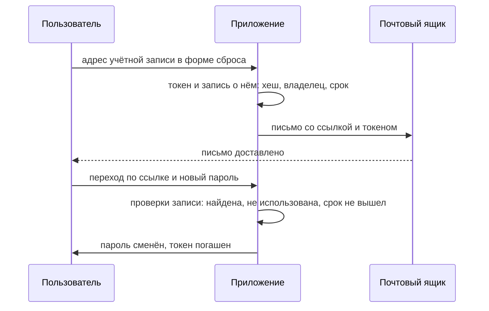

# Восстановление и смена пароля

На любом сайте рядом с формой входа есть ссылка «забыли пароль?». Вы
вводите почту, получаете письмо, переходите по ссылке из письма и задаёте
новый пароль. Старый пароль при этом никто не спрашивает: приложение
впускает того, кто открыл ссылку. Внутри ссылки лежит секрет — **токен
восстановления**. Это временный пропуск, который заменяет пароль на один
вход, и приложение посылает его по стороннему каналу — в почтовый ящик
владельца учётной записи.

Бытовой аналог — одноразовый код из СМС, которым банк подтверждает
перевод: кто ввёл код, того и считают вами. Ломается аналогия на
устройстве секрета: код короткий и вводится руками, а токен длинный и
живёт в ссылке, по которой переходят кликом.

Стенд темы сравнивает два способа сделать такой токен:

```text
слабый токен: перебор 3600 значений за окно 3600 с — найден: ДА
сильный токен: первое применение → anna@example.test
   повторное применение того же токена → отказ
   применение через 901 с при сроке 900 с → отказ
```

Первая строка — плохая новость: токен, собранный из адреса жертвы и
секунды выдачи, подбирается перебором за час. Оба исходных значения
атакующему известны: сброс для чужого адреса он запросил сам, а все
секунды часа перебираются за тот же час. Следующие три строки — токен,
собранный правильно: он впускает один раз, а на повтор и на просрочку
отвечает отказом. Восстановление пароля — это вход в обход пароля, и
стойкость такого входа равна стойкости токена. Предмет темы — две
соседние функции: как устроен токен восстановления и что обязана делать
смена пароля.

## Как это работает

**Откуда это взялось.** Пользователь забывает пароль, а приложению нужно
вернуть ему доступ, не зная старого пароля. Спросить пароль нельзя:
его-то и нет. Поэтому поверх основного входа строят резервный: приложение
выписывает новый секрет и посылает его туда, где сидит владелец, — в
ящик, чей адрес он оставил при регистрации. Дальше всё сводится к свойствам этого
секрета. Угаданный токен впускает не хуже угаданного пароля, а токен без
срока и без гашения живёт дольше, чем нужно.

Поток восстановления устроен так. Форма принимает адрес учётной записи.
Приложение порождает токен и запоминает у себя запись о нём — хеш токена,
владельца и срок, — а в ссылку в письме вставляет сам токен. Хеш здесь —
отпечаток значения: по отпечатку само значение не восстановить.
Пользователь переходит по ссылке и задаёт новый пароль. Приложение
сверяет предъявленный токен со своей записью и гасит его, чтобы той же
ссылкой не воспользовались дважды.



**Описание схемы.** Схема читается сверху вниз и показывает поток
восстановления по двум каналам. С приложением пользователь говорит
напрямую дважды: когда просит сброс и когда предъявляет токен. Между
этими касаниями токен едет вторым каналом, через почтовый ящик, и там его
может прочитать тот, кто владеет ящиком. Сам токен приложение не хранит:
хранится запись о нём — хеш, владелец и срок, — и по ней решается,
впускать или отказать.

**Зачем это в работе AppSec-инженера.** Восстановление пишут в спешке и
редко ревьюят как вход, хотя это вход. На ревью тема даёт две проверки:
токен сверяется с тремя свойствами из раздела «Три свойства токена», а
смена пароля — с судьбой старых сессий. Обе проверки дают находки чаще,
чем ревью самой формы входа.

### Три свойства токена

Свод советов OWASP по восстановлению пароля (Forgot Password Cheat Sheet)
перечисляет свойства идентификатора восстановления. Три из них
проверяются прогоном, и на них держится защита этой функции.

- **Непредсказуемость.** Токен порождает CSPRNG — криптографически
  стойкий генератор, чей следующий выход не предсказать по предыдущим; он
  встречался в теме `sessions-vs-tokens`. Значение, выведенное из
  времени, имени или счётчика, перебирается: атакующий знает адрес жертвы
  и примерное время запроса.
- **Привязка к одному пользователю.** Токен в базе связан с конкретной
  учётной записью. Без привязки токен, выданный на учётную запись
  атакующего, подойдёт к чужой: приложение знает токен, но не знает, чей
  он.
- **Одноразовость и срок.** После применения токен гасится, как билет,
  который рвут на входе. Живёт он ограниченное время, и просроченный не
  принимается. Аналогия с билетом ломается в одном месте: билет гасят
  сразу на входе, а ссылка может ждать применения часами.

### Чем берётся предсказуемый токен

Слабый токен из прогона собран хеш-функцией. Хеш-функция — превращение
строки в строку фиксированной длины. Один и тот же вход всегда даёт один
и тот же выход, а по выходу вход не восстановить. Бытовой аналог —
контрольная сумма скачанного файла: по сумме файл не собрать, но
совпадение проверить можно. Аналогия ломается в одном месте: контрольная
сумма не прячет вход, а у хеш-функции подбор входа по выходу стоит
дорого. MD5 — старая и очень быстрая хеш-функция: миллионы значений в
секунду на обычном ноутбуке.

Перебор токена идёт не через сервер. Тема `brute-force-defense`
разбирала перебор, где каждая догадка — запрос, и сервер такие попытки
считает. Здесь атакующий считает хеши у себя на машине. Сброс для чужого
адреса он запросил сам, поэтому момент выдачи известен ему с точностью до
окна, а адрес известен полностью. К приложению он при этом не обращается,
и счётчику попыток нечего считать.

Прогон (`.smgr/appsec-stage1-auth/exp/e07-reset.py`, Python 3.14.7)
сравнивает оба устройства. Слабый токен — MD5 от склейки адреса жертвы и
секунды выдачи. Сильный — 32 байта из CSPRNG, одноразовый, со сроком
900 с:

```text
слабый токен: перебор   10 значений за окно   10 с — найден: ДА
слабый токен: перебор   60 значений за окно   60 с — найден: ДА
слабый токен: перебор 3600 значений за окно 3600 с — найден: ДА
сильный токен: первое применение → anna@example.test
   повторное применение того же токена → отказ
   применение через 901 с при сроке 900 с → отказ
```

Читается вывод так. Слабый токен выводится из времени, а время атакующий
оценивает, поэтому перебирается всё окно: за час это 3600 значений.
Сильный токен перебору не поддаётся: 256 бит из CSPRNG не перебрать ни за
какое окно. После первого применения он гасится, а после срока не
принимается. В записи лежит не сам токен, а его хеш: утечка таблицы не
выдаёт действующие ссылки. Так же необратимо хранятся и пароли — этому
учит тема `password-storage`.

> **Предупреждение.** Токен восстановления сильнее пароля не бывает: он и
> есть временный пароль. Поэтому меры соседних тем относятся к нему в
> полной мере: необратимое хранение из `password-storage` и ограничение
> перебора предъявлений из `brute-force-defense`.

## Как это выглядит в коде

Ревьюер читает обработчик запроса сброса с двумя вопросами: из чего
собран токен и что мешает предъявить его дважды. Прочитайте фрагмент с
этими вопросами до выносок.

```python
# УЯЗВИМО — демонстрация, не для продакшена
def request_reset(email):
    token = md5(f"{email}{int(time.time())}".encode()).hexdigest()  # (1)
    RESET[email] = token                                            # (2)
    send_mail(email, f"/reset?token={token}")
```

1. Токен выведен из адреса и времени: оба значения известны атакующему, а
   пространство перебора — секунды одного часа.
2. Записи о сроке и о применении нет: токен живёт, пока его не
   перезапишет следующий запрос на тот же адрес.

Этот пример показывает: дефект сидит не в длине значения — MD5 даёт 32
шестнадцатеричных знака — и не в скрытости адреса, а в предсказуемости
входа. Токен длинный, но вычислимый.

Тот же класс дефекта при ревью выдают такие признаки:

- токен считается от времени, счётчика или адреса через `md5` или `sha1`;
- у записи токена нет ни срока жизни, ни флага «использован»;
- токен не привязан к учётной записи: в записи нет владельца;
- ссылка сброса собирается из заголовка `Host` запроса;
- страница сброса подключает сторонние ресурсы;
- форма смены пароля не спрашивает текущий пароль.

Три последних признака стоит разобрать. Значение `Host` пишет клиент.
Приложение, которое строит абсолютную ссылку из запроса, отдаёт в письмо
чужой домен: токен настоящий, а ведёт ссылка к атакующему. Этот приём
отдельно разбирает тема `host-header-attacks`. Заголовок `Referer`
браузер добавляет сам: так сайт узнаёт, с какой страницы пришёл запрос.
Сторонняя картинка или скрипт на странице сброса получают в `Referer`
полный адрес страницы вместе с токеном. Форма смены без текущего пароля
превращает перехваченную сессию в захват учётной записи — об этом раздел
«Как защититься».

## Как защититься

Правило собирается из трёх свойств токена и одного требования к смене
пароля. Токен порождается CSPRNG, привязывается к одной учётной записи,
гасится после применения и живёт ограниченное время. Смена пароля требует
текущий пароль и гасит прочие сессии. Исправленный вариант читайте с
четырьмя вопросами: чем порождается значение, что лежит в записи, какие
отказы встречают предъявление и что происходит с сессиями после смены.

```python
# Исправлено.
def request_reset(email):
    token = secrets.token_urlsafe(32)                     # (1)
    RESET[sha256(token)] = {"user": email,                # (2)
                            "exp": now() + 900, "used": False}
    send_mail(email, f"https://app.example/reset?token={token}")  # (3)

def submit_reset(token, new_password):
    rec = RESET.get(sha256(token))
    if not rec or rec["used"] or now() > rec["exp"]:      # (4)
        return error("Ссылка недействительна")
    rec["used"] = True
    set_password(rec["user"], new_password)
    invalidate_sessions(rec["user"])                      # (5)
```

1. Значение порождает CSPRNG: 32 байта, то есть 256 бит
   непредсказуемости. Такое пространство не перебрать ни за какое окно.
2. В записи лежат хеш токена, владелец, срок и флаг применения. Сам токен
   в базе не лежит: утечка таблицы не выдаёт действующие ссылки.
3. Адрес в письме собран из домена, зашитого в конфигурацию, а не из
   заголовка `Host` запроса. Подмена заголовка на такую ссылку не влияет.
4. Предъявление встречают три отказа: токена нет в записи, токен уже
   использован, срок вышел.
5. После смены пароля прочие сессии пользователя гасятся
   (ASVS v5.0-7.4.3). Украденная сессия перестаёт действовать, и контроль
   возвращается владельцу.

Листинг держит все три свойства разом: значение из CSPRNG, запись с
владельцем и сроком, флаг применения. Проверка понимания: какое свойство
отвалится, если убрать из записи поле владельца, и как это показать одним
запросом?

### Смена пароля — отдельная функция

Смена пароля — соседняя функция со своими дырами, и путать эти дыры с
дырами токена не стоит. Восстановление проверяет того, кто пароля не
знает, а смена — того, кто уже вошёл. Худший случай, который называет
WSTG-v42-ATHN-09, — смена без запроса текущего пароля. Перехват сессии
даёт атакующему вход, но не пароль: пароль остаётся у владельца. Форма
без текущего пароля снимает эту разницу: атакующий ставит свой пароль и
запирает владельца. Поэтому ASVS v5.0-6.2.3 требует при смене и текущий,
и новый пароль: текущего у перехватчика нет.

Cheat Sheet добавляет два требования. После сброса не входить
автоматически, а проводить пользователя через обычный вход.
Автоматический вход создаёт второй путь выпуска сессии, минующий обычные
проверки, и каждый такой путь — лишнее место для ошибки. О смене пароля
приложение уведомляет письмом: владелец, который смены не делал, узнает о
захвате сразу. Но сам пароль в письмо не кладут никогда: письма живут в
ящике годами и читаются при каждом взломе почты.

### Единообразие ответа

Форма запроса сброса — ещё один канал перечисления пользователей из темы
`user-enumeration`. Ответ «письмо отправлено» на существующий адрес и
ответ «такого адреса нет» на чужой выдают, какие адреса заведены. Поэтому
ответ одинаков в обоих случаях: «если адрес в базе, письмо отправлено».
Времени это тоже касается: разница в миллисекундах выдаёт то же самое без
единого слова, и время обработки выравнивают.

### Границы применимости

Срок в 900 с — компромисс, а не константа. Короче — письмо не успевает
дойти, длиннее — дольше живёт перехваченная ссылка. Гашение прочих сессий
выкидывает пользователя с других устройств: это цена, которую платят за
то, что вместе с ним выкидывается и перехватчик. Хранение хеша вместо
токена стоит лишнего вычисления при каждом предъявлении, и это дёшево
против цены утечки таблицы живых токенов.

## Частая ошибка

Токен длинный и случайный — достаточно ли этого для восстановления?
Судите до опровержения.

Ответ «да» опирается на значение: токен длинный и случайный, значит
восстановление в порядке.

**Непредсказуемости мало — нужны привязка и гашение.** Токен из CSPRNG,
не привязанный к учётной записи, впускает в чужую: атакующий берёт токен,
выданный на свою учётную запись, и предъявляет его к чужой. Токен без
флага «использован» срабатывает повторно: перехваченная один раз ссылка
работает и потом. Ошибка сидит в подмене свойства: непредсказуемость
отвечает на вопрос «нельзя ли угадать» и молчит про то, чей это токен и
сколько раз он сработает.

Контрпример — прогон из раздела «Как это работает». Сильный токен
отличается от слабого не только длиной: на повторном применении он даёт
отказ и на просроченном даёт отказ. Уберите из проверки строку
`rec["used"]`, и токен из CSPRNG станет многоразовым пропуском, оставаясь
непредсказуемым.

## Чеклист для ревью

1. Проверьте, что токен восстановления порождается CSPRNG, а не выводится
   из времени, имени или счётчика.
2. Проверьте, что токен привязан к одной учётной записи и не подходит к
   другой.
3. Проверьте, что токен гасится после первого применения и имеет
   ограниченный срок (ASVS v5.0-6.4.1).
4. Проверьте, что ссылка сброса собрана из доверенного домена, а не из
   заголовка `Host` запроса.
5. Проверьте, что смена пароля требует ввода текущего пароля
   (ASVS v5.0-6.2.3).
6. Проверьте, что после сброса или смены пароля прочие сессии
   пользователя гасятся, а вход не выполняется автоматически.
7. Проверьте, что вопросы-подсказки не используются как единственный
   способ восстановления (ASVS v5.0-6.4.2).

Отдельно про последний пункт. Вопрос-подсказка — секретный вопрос вроде
«девичья фамилия матери», где ответ как будто знает только владелец. На
деле ответы угадываются или разведываются по открытым источникам, поэтому
единственным способом восстановления вопрос быть не может.

## Попробуй сам

Возьмите поток восстановления пароля приложения, с которым работаете.
Пройдите его для своей учётной записи и зафиксируйте четыре факта. Из
чего состоит токен в ссылке. Срабатывает ли он второй раз. Есть ли у него
срок. Что происходит со старой сессией после смены пароля.

Одна подсказка: повторное применение той же ссылки проверяйте в приватном
окне — так активная сессия не замешивается в результат.

**Критерий выполнения** наблюдаемый: четыре ответа с приложенным запросом
или ссылкой, где это видно. Плюс вывод, какое из трёх свойств токена
нарушено, если нарушено, и гасит ли смена пароля прочие сессии.

## Проверь себя

1. Обработчик предъявления токена проверяет всё, что положено:

   ```python
   def submit_reset(token, email, new_password):
       rec = RESET.get(sha256(token))
       if not rec or rec["used"] or now() > rec["exp"]:
           return error("Ссылка недействительна")
       rec["used"] = True
       set_password(email, new_password)
   ```

   Токен из CSPRNG, одноразовый, со сроком. Что здесь подменяет
   атакующий и какое из трёх свойств при этом нарушено?

2. Генерация токена из раздела «Как это выглядит в коде» собрана из
   адреса и времени:

   ```python
   def request_reset(email):
       token = md5(f"{email}{int(time.time())}".encode()).hexdigest()
       RESET[email] = token
       send_mail(email, f"/reset?token={token}")
   ```

   Какую починку вы выберете?

   А. Добавить к входу хеша секретную соль сервера — значение, которое
      знает только сервер: токен перестанет быть вычислимым снаружи.

   Б. Порождать токен из CSPRNG, а в записи хранить его хеш вместе с
      владельцем, сроком и флагом применения, отказывая на использованный
      и просроченный.

   В. Ограничить число попыток предъявления токена, как при защите от
      перебора пароля.

3. Почему после сброса пароля Cheat Sheet требует не входить
   автоматически, а проводить пользователя через обычный вход?

4. Атакующий сам запросил сброс для чужого адреса и знает секунду выдачи
   токена с точностью до часа. Предскажите, что напечатает этот
   фрагмент.

   ```python
   from hashlib import md5
   import time
   email = "anna@example.test"
   issued = int(time.time())
   token = md5(f"{email}{issued}".encode()).hexdigest()
   found = None
   for t in range(issued - 3600, issued + 1):
       if md5(f"{email}{t}".encode()).hexdigest() == token:
           found = t
   print("найден:", found is not None, "| сдвиг:", issued - found)
   ```

5. Возврат к теме `user-enumeration`: как форма запроса сброса
   перечисляет пользователей и чем это чинится?
6. Возврат к теме `sessions-vs-tokens`: почему смену пароля сопровождают
   гашением прочих сессий?

<details markdown="1">
<summary>Ответ 1</summary>

1. Подменяется `email` из запроса: токен валиден, но пароль меняется той
   учётной записи, чей адрес прислан. Нарушена привязка: в записи нет
   владельца, и токен, выданный на свою учётку, предъявляется к чужой.
   Исправленный вариант берёт учётную запись из записи токена —
   `set_password(rec["user"], new_password)`, — и адрес из запроса не
   читает.

</details>

<details markdown="1">
<summary>Ответ 2: разбор вариантов</summary>

2. Верный ответ — Б.

   А. Соль делает значение невычислимым снаружи, но запись по-прежнему
      без срока и без флага применения: токен остаётся многоразовым и
      бессрочным. Непредсказуемость отвечает на вопрос «нельзя ли
      угадать» и молчит про то, сколько раз токен сработает.

   Б. Все три свойства закрыты разом. Значение из CSPRNG перебору не
      поддаётся, хеш в записи не даёт прочитать токены из дампа.
      Владелец привязывает токен к учётной записи, а флаг и срок дают
      отказ на повторное и просроченное предъявление.

   В. Ограничение попыток защищает от перебора на входе, а здесь перебор
      офлайновый: атакующий считает MD5 у себя и сравнивает со ссылкой,
      не трогая приложение. Счётчик попыток на это не влияет,
      многоразовость тоже остаётся.

</details>

<details markdown="1">
<summary>Ответ 3</summary>

3. Автоматический вход усложняет обработку аутентификации и сессий и
   повышает шанс внести уязвимость: появляется второй путь создания
   сессии, минующий обычные проверки. Cheat Sheet советует провести
   пользователя через обычный вход, а о смене уведомить письмом.

</details>

<details markdown="1">
<summary>Ответ 4</summary>

4. `найден: True | сдвиг: 0`: все 3600 секунд часа перебираются
   мгновенно, и точная секунда выдачи восстанавливается по самому токену.
   Сохраните фрагмент из вопроса в файл `recover.py` и запустите:

   ```bash
   python3 recover.py
   ```

   ```text
   найден: True | сдвиг: 0
   ```

   Прогнан 2026-10-03 на Python 3.14.7, выполняется быстрее секунды.
   Именно поэтому токен порождают из CSPRNG: 256 бит перебору не
   поддаются, тогда как окно в час — это 3600 значений.

</details>

<details markdown="1">
<summary>Ответ 5</summary>

5. Разным ответом или разным временем на известный и неизвестный адрес.
   Чинится единым сообщением («если адрес в базе, письмо отправлено») и
   одинаковым временем обработки обоих случаев.

</details>

<details markdown="1">
<summary>Ответ 6</summary>

6. Пароль меняют в том числе потому, что его или сессию могли
   скомпрометировать. Если прочие сессии не погасить, украденная сессия
   продолжает действовать, и смена пароля не возвращает контроль.

</details>

## Источники

1. OWASP Forgot Password Cheat Sheet; реестр `owasp-cs-forgot-password`.
   Разделы: Forgot Password Request, User Resets Password, General Security
   Practices, URL Tokens, Security Questions.
   <https://cheatsheetseries.owasp.org/cheatsheets/Forgot_Password_Cheat_Sheet.html>
2. OWASP WSTG-ATHN-09 «Testing for Weak Password Change or Reset
   Functionalities», WSTG v4.2; реестр `wstg-v42-athn-09-weak-password-change`.
   Разделы: Test Password Reset, Test Password Change, Remediation.
   <https://owasp.org/www-project-web-security-testing-guide/v42/4-Web_Application_Security_Testing/04-Authentication_Testing/09-Testing_for_Weak_Password_Change_or_Reset_Functionalities>
3. PortSwigger Web Security Academy, «Vulnerabilities in other authentication
   mechanisms»; реестр `ps-auth-other-mechanisms`. Раздел Resetting user
   passwords.
   <https://portswigger.net/web-security/authentication/other-mechanisms>

Каркас этапа: `owasp-asvs-5-document` (ASVS v5.0.0), `owasp-wstg-42`,
`owasp-top10-2025`; якоря подраздела: `ps-authentication`,
`owasp-cs-authentication`. Наследуются всеми темами и отдельной строкой не
повторяются.

**Скоропортящийся слой.** Срок жизни токена (здесь 900 с) — рекомендация
Cheat Sheet, живого документа без даты; число годится как ориентир. Приём
инъекции в заголовок `Host` привязан к тому, как приложение строит
абсолютные адреса.

**Маркеры уверенности.** Перебор слабого токена в окне и поведение
сильного токена (одноразовость, срок, хранение хеша вместо значения) —
**проверено лично** 2026-08-24 на Python 3.14.7 стендом `e07-reset.py`.
Листинг из вопроса 4 прогнан локально 2026-10-03, Python 3.14.7; вывод
совпал дословно. Три свойства токена, требования к смене пароля, гашение
сессий, единообразие ответа формы сброса — **по документации**: Forgot
Password Cheat Sheet, WSTG v4.2, ASVS v5.0.0, PortSwigger Academy,
открыты лично 2026-08-24. Инъекция в заголовок `Host` и утечка через
`Referer` **не воспроизводились**: названы по Cheat Sheet.
