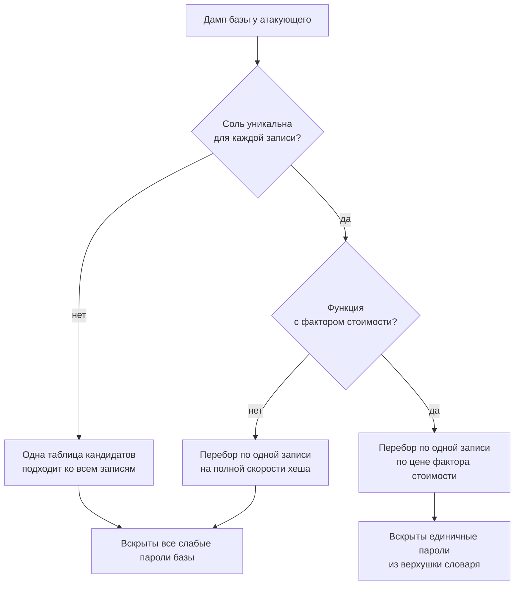

# Хранение паролей: bcrypt, argon2, почему не SHA

Уровень **L1** · время 90 мин (теория 40 / лаба 35 / самопроверка 15,
оценка)

Что прочитать сначала: `app-architecture`, `sessions-vs-tokens`.

Вот строка из слитой базы:

```text
anna:3fc0a7acf087f549ac2b266baf94b8b1
```

Пароль здесь — `qwerty123`. Узнать это можно без всякого взлома: хеш
вбивается в поисковик, и ответ приходит первой ссылкой. А где поисковик
молчит, работает перебор: на Ryzen 7 9800X3D обычный SHA-256 считается
5,3 миллиона раз в секунду в одном потоке, MD5 ещё быстрее. Словарь
частых паролей прикладывается к такому дампу за секунды, и `qwerty123`
падает среди первых.

Много это или мало, пять миллионов в секунду? Для контрольных сумм и
подписей — мало: там хеш гоняют на каждый пакет. Для пароля —
катастрофа.

Сколько стоит одна догадка — вот предмет темы. Пароль в базе лежит не
для чтения: при входе его сравнивают с присланным, поэтому в таблице
хранят необратимое значение. Годится не любое. Скорость, за которую хеш
ценят в остальных задачах, после утечки работает на атакующего. Ответ
сложился в два приёма. Соль — уникальная случайная строка рядом с
каждой записью: одна таблица кандидатов перестаёт подходить ко всей
базе сразу. И функция с настраиваемой ценой — Argon2id, scrypt, bcrypt,
PBKDF2: одна догадка занимает заметную долю секунды. Перебор проседает
с миллионов до единиц в секунду.

У вас в коде, скорее всего, стоит не MD5. Это не спасает: SHA-256 без
соли и без фактора стоимости — та же находка, и на ревью она видна в
одной строке.

Дальше вы соберёте такой дамп на локальном стенде и вскроете его
словарём одним проходом. Потом найдёте дефект в коде на Python и Node,
почините его — и докажете починку тем же числом, с которого начали.

## 0. Коротко

Пароль в базе хранится не для того, чтобы его прочитать, а для того, чтобы
сравнить с присланным. Поэтому его превращают в необратимое значение. Годится
не любое: у быстрой функции вроде SHA-256 одна догадка стоит доли микросекунды.
После утечки дампа перебор идёт со скоростью миллионов проверок в секунду на
одном ядре. Чинится это функцией с настраиваемой ценой и с уникальной солью на
каждую запись: Argon2id, scrypt, bcrypt или PBKDF2.

**Зачем это в работе AppSec-инженера.** Дефект виден в одной строке кода, и
именно поэтому его пропускают: строка выглядит грамотно, в ней есть и хеш, и
часто даже соль. Отличать «хеширует» от «хеширует так, что перебор дорог» —
навык ревьюера, а не разработчика, и спор с командой упирается в числа, которые
надо уметь назвать.

## 1. Цели

После этого раздела вы сможете:

1. Объяснить на числах, почему быстрая хеш-функция не годится для пароля.
2. Отличить в коде хранение пароля от хеширования высокоэнтропийного секрета.
3. Назвать, что даёт соль и чего она не даёт.
4. Подобрать параметры scrypt или Argon2id по действующей рекомендации.
5. Проверить фикс ретестом и регрессом, не сломав вход старым пользователям.

## 2. Предвопросы

Ответьте до чтения, даже если не уверены.

1. База с паролями утекла целиком. Что меняет добавление соли для атакующего,
   у которого на руках весь дамп?
2. Функция проверки пароля работает 200 мс вместо микросекунды. Кто платит эти
   200 мс и сколько раз в секунду?
3. Пароль хешируют в SHA-256 дважды подряд. Во сколько раз это удорожает
   перебор?

## 3. Механика

**Откуда это взялось.** Задача звучит как «проверять пароль», а не «знать
пароль», и разница между этими двумя формулировками — вся тема. Хранить
пароль читаемым нельзя: утечки дампа достаточно. Ответом стал
криптографический хеш — сравнить можно, прочитать нельзя. Ломается этот ответ
на том, за что хеш ценят в остальных задачах, — на скорости. Одна догадка
стоит атакующему примерно столько же, сколько защите одна проверка входа.
Отсюда обе достройки, которые разбираются ниже: цену догадки стали задавать
параметром, а затем к ней добавили память.

### Где проходит граница доверия

Пароль пересекает две границы, и вторая интереснее первой. Первая — от
браузера к приложению; её закрывает TLS, разобранный в теме `tls-and-proxy`.
Вторая — от приложения к хранилищу: строка попадает в таблицу, оттуда в
резервную копию, в реплику, в снимок для тестового стенда, в выгрузку для
аналитики. Модель угроз этой темы начинается там, где дамп **уже** у
атакующего, и вопрос стоит один: во что ему обойдётся восстановление паролей.

Источник — пароль пользователя. Сток — строка в таблице учётных записей.
Отсутствующий контроль — цена одной догадки.

### Почему быстрая функция не годится

SHA-256 разрабатывалась быстрой: её считают для каждого пакета и каждого
файла. Для пароля скорость становится недостатком. Password Storage Cheat Sheet
формулирует это прямо: быстрые функции не подходят, потому что позволяют
атакующему делать много догадок за короткое время.

Порядок величин видно замером. В замере — SHA-256, PBKDF2 на HMAC
(Hash-based Message Authentication Code) и scrypt. На AMD Ryzen 7 9800X3D,
Python 3.14.7, один
поток:

| Что считаем | Догадок в секунду |
|---|---:|
| SHA-256 от строки | 5 300 000 |
| PBKDF2-HMAC-SHA-256, 600 000 итераций | 18 |
| scrypt, N=2¹⁷, r=8, p=1 | 5,7 |

Разница между первой и третьей строкой — примерно в 900 000 раз. Это и есть
предмет темы: не «хешируется или нет», а сколько стоит одна догадка.

> **Примечание.** Числа сняты на одной машине одним потоком и годятся как
> порядок величины, не как норматив. Атакующий считает на GPU и на многих
> ядрах; своя цифра снимается на своём железе.

### Что даёт соль

Соль — уникальное случайное значение, которое добавляется к паролю перед
хешированием и хранится рядом с результатом. Секретом она не считается.

Cheat Sheet называет три следствия. Атакующему приходится вскрывать хеши по
одному, со своей солью для каждого. Заранее посчитанные таблицы (радужные
таблицы, готовые словари хешей) перестают подходить. И по дампу больше не
видно, что два пользователя выбрали один пароль.

Чего соль не даёт: она **не** удорожает одну догадку. Одна запись с солью
вскрывается ровно с той же скоростью, что и без соли. Соль убирает выигрыш от
работы над всей базой сразу, цену перебора задаёт другой параметр.

NIST SP 800-63B-4 § 3.1.1.2 требует не менее 32 бит соли; Python и Node в
своей документации рекомендуют 16 байт и больше. Верхняя из планок не
противоречит ни одному из трёх документов.

### Что задаёт цену

Цена задаётся фактором стоимости — числом повторений внутри функции. Cheat
Sheet оговаривает, что обычно это `2^work` повторений, а не `work`. Правило
подбора там же: поднимать, пока проверка укладывается примерно в секунду, и
поднимать со временем, потому что железо дешевеет. NIST в § 3.1.1.2 говорит то
же модальностью SHOULD.

У Argon2id и scrypt к этому добавляется память. Cheat Sheet советует выбирать
функции, устойчивые и к атакам на видеокартах, и к атакам на память.
RFC 9106 называет Argon2 memory-hard функцией прямо в заголовке и объясняет
одно из решений в конструкции. Умножения увеличивают глубину схемы и тем
самым время работы реализаций на специализированных микросхемах.



**Описание схемы.** Вход — дамп у атакующего. Первая развилка спрашивает про
уникальную соль: без неё одна таблица кандидатов подходит ко всей базе. Вторая
развилка спрашивает про фактор стоимости: без него перебор идёт на полной
скорости хеша. Оба левых пути ведут к вскрытию всех слабых паролей базы,
правый — к единичным. Развилки подписаны вопросами, исходы — результатом для
атакующего.

## 4. Эксплуатация

Стенд — лаба `pilot/lab/password-storage`, каталог из семи файлов. Работает
локально на стандартной библиотеке Python, сети не требует. Приёмы, показанные
дальше, работают именно с этим стендом.

Сервис заводит четыре учётные записи и отдаёт `export_dump()` — то же, что
уйдёт с резервной копией. Три пароля взяты из общеизвестных подборок частых,
один — случайный.

Шаг 1. Соберите дамп и посмотрите на него глазами атакующего:

```text
Вывод команды: python3 hack.py, опыт 1
опыт 1 — одинаковые пароли дают одинаковую запись: ДА
```

Две записи из четырёх совпали дословно. Соли нет, и по дампу видно, что два
пользователя выбрали один пароль. Это уже находка: перебирать надо не четыре
значения, а три.

Шаг 2. Посчитайте словарь один раз и приложите ко всей базе:

```text
Вывод команды: python3 hack.py, опыт 2
опыт 2 — одна таблица на всю базу вскрыла записей: 3 из 4
         anna -> qwerty
         boris -> letmein
         carol -> qwerty
```

Двенадцать кандидатов, один проход, три пароля из четырёх. Стоимость атаки не
зависит от числа учётных записей: таблица считается один раз.

Шаг 3. Замерьте скорость перебора по одной записи:

```text
Вывод команды: python3 hack.py, опыт 3
опыт 3 — перебор по одной записи: 2 441 100 догадок/с
```

Два с половиной миллиона в секунду — на интерпретируемом языке, в одном
потоке, без видеокарты. Четвёртый пароль эта атака не вскрыла, и причина в
самом пароле, а не в хранилище: шестнадцать случайных символов словарём не
берутся.

> **Предупреждение.** Скорость перебора — свойство хранилища, стойкость
> четвёртого пароля — свойство пользователя. Опираться на второе при оценке
> первого нельзя: выбор пароля приложение не контролирует.

## 5. Как выглядит в коде

Ревьюер ищет четыре вещи, и все четыре видны по вызову, без чтения логики.

**Первое: имя функции рядом с именем переменной.** Быстрая функция, которой
передали что-то с именем `password`, `passwd`, `pwd`, — почти всегда дефект.
WSTG-v42-CRYP-04 в разделе Source Code Review даёт половину приёма: список
имён слабых алгоритмов для поиска грепом — `MD4`, `MD5`, `RC4`, `RC2`, `DES`,
`Blowfish`, `SHA-1`, `ECB`. Вторая половина, список слов вроде `passwd` и
`pwd`, стоит там же, но под другую задачу — поиск зашитых секретов.
Пересечение двух списков и даёт находку этой темы. Оба дефекта этого файла
назовите до разбора.

```python
# app/accounts.py
# УЯЗВИМО — демонстрация, не для продакшена
import hashlib

def register(login: str, password: str) -> None:
    STORE[login] = hashlib.sha256(password.encode()).hexdigest()  # (1)

def verify(login: str, password: str) -> bool:
    stored = STORE.get(login)
    candidate = hashlib.sha256(password.encode()).hexdigest()
    return candidate == stored                                    # (2)
```

1. Быстрая функция, соли нет. Две записи с одним паролем совпадут дословно.
2. Сравнение обычным оператором. Время сравнения зависит от числа совпавших
   символов.

**Второе: тот же дефект на другом стеке.** Инвариант — быстрая функция без
соли и без фактора стоимости. Декорация — имя вызова и способ получить строку.
Найдите здесь те же два дефекта, что в варианте на Python, — синтаксис другой,
ошибки те же.

```javascript
// app/accounts.js
// УЯЗВИМО — демонстрация, не для продакшена
import { createHash } from 'node:crypto';

export function register(login, password) {
  const digest = createHash('sha256').update(password).digest('hex');
  store.set(login, digest);                                       // (1)
}

export function verify(login, password) {
  const digest = createHash('sha256').update(password).digest('hex');
  return store.get(login) === digest;                             // (2)
}
```

1. `createHash('sha256')` вместо `scrypt` — та же ошибка, другой синтаксис.
2. `===` вместо сравнения за постоянное время. Документация Node прямо
   называет `crypto.timingSafeEqual` пригодным для сравнения секретных
   значений.

**Третье: параметры ниже планки.** Функция может быть правильной, а настройки
— нет. Node подставляет свои умолчания молча:

```javascript
// Фрагмент, упрощено для примера
const key = scryptSync(password, salt, 32);   // N=16384, r=8, p=1
```

Умолчание `cost` в Node — 16384, то есть 2¹⁴. ASVS v5.0 для `p=1` требует не
меньше 2¹⁷. Вызов работает, ошибки не даёт, планку не выполняет. Ревью такого
вызова сводится к вопросу «а какие здесь параметры», и ответ «умолчательные»
означает «ниже требования».

**Четвёртое: что не спасает.** Двойной SHA-256 удорожает перебор вдвое —
против нужных сотен тысяч раз это ничего не меняет. Собственная «соль»,
собранная из логина или из идентификатора записи, предсказуема и от заранее
посчитанных таблиц не защищает (CWE-760). Шифрование вместо хеширования
обратимо: Cheat Sheet допускает его лишь в краевом случае, когда исходный
пароль нужен приложению для входа в чужую систему. Общее у трёх приёмов —
задача остаётся нерешённой.

> **Примечание: ложные срабатывания.** Быстрый хеш от секрета — не всегда
> дефект. ASVS v5.0-6.5.2 разрешает обычную хеш-функцию для значений с
> энтропией от 112 бит: у случайного токена перебор невозможен независимо от
> скорости функции. Идентификатору сессии тех же 112–127 бит мало: для него
> действует планка в 128 бит (ASVS v5.0-7.2.3, тема `secure-random`).
> Контрольная сумма загруженного файла к теме тоже не
> относится. Смотрите на происхождение значения, а не на имя функции.

## 6. Как чинится

Канон: функция с фактором стоимости, уникальная случайная соль на запись,
параметры и алгоритм записаны рядом с хешем, сравнение за постоянное время.
Листинг читается по четырём следам: где задаются параметры стоимости, откуда
берётся соль, что хранится вместе с хешем, чем сравниваются значения.

```python
# app/accounts.py — Исправлено
import base64, hashlib, hmac, os

_N, _R, _P = 2 ** 17, 8, 1
_MAXMEM = 192 * 1024 * 1024                                    # (1)

def register(login: str, password: str) -> None:
    salt = os.urandom(16)                                      # (2)
    dk = hashlib.scrypt(password.encode("utf-8"), salt=salt,
                        n=_N, r=_R, p=_P, maxmem=_MAXMEM, dklen=32)
    STORE[login] = (f"scrypt$n={_N},r={_R},p={_P}$"            # (3)
                    f"{base64.b64encode(salt).decode()}$"
                    f"{base64.b64encode(dk).decode()}")

def verify(login: str, password: str) -> bool:
    stored = STORE.get(login)
    if stored is None:
        return False
    _, params, salt_b64, hash_b64 = stored.split("$")
    values = dict(pair.split("=") for pair in params.split(","))
    dk = hashlib.scrypt(
        password.encode("utf-8"), salt=base64.b64decode(salt_b64),
        n=int(values["n"]), r=int(values["r"]), p=int(values["p"]),
        maxmem=_MAXMEM, dklen=len(base64.b64decode(hash_b64)))
    return hmac.compare_digest(dk, base64.b64decode(hash_b64))  # (4)
```

1. Без явного `maxmem` этот вызов падает с `ValueError`. Разбор — ниже.
2. Соль своя на каждую запись, из криптографического источника.
3. Алгоритм и параметры лежат в самой строке. Без них поднять фактор
   стоимости через год не выйдет: старые записи станет нечем отличить.
4. Сравнение за постоянное время вместо `==`.

Этот листинг — канон, проведённый в код: функция с ценой, соль на запись,
параметры рядом с хешем, сравнение за постоянное время. Вопрос
на перспективу: что поменяется через год, когда планку поднимут, — и почему
без записи параметров в строке та же замена была бы миграцией?

Тот же фикс на втором стеке. Разбор закрыт: назовите сами, что здесь
изменилось против уязвимого варианта и зачем нужна каждая из трёх строк.

```javascript
// app/accounts.js — Исправлено
import { scryptSync, randomBytes, timingSafeEqual } from 'node:crypto';

const OPTS = { N: 2 ** 17, r: 8, p: 1, maxmem: 192 * 1024 * 1024 };

export function register(login, password) {
  const salt = randomBytes(16);
  const dk = scryptSync(password, salt, 32, OPTS);
  store.set(login, `scrypt$N=${OPTS.N},r=${OPTS.r},p=${OPTS.p}$` +
                   `${salt.toString('base64')}$${dk.toString('base64')}`);
}

export function verify(login, password) {
  const stored = store.get(login);
  if (!stored) return false;
  const [, , saltB64, hashB64] = stored.split('$');
  const expected = Buffer.from(hashB64, 'base64');
  const dk = scryptSync(password, Buffer.from(saltB64, 'base64'),
                        expected.length, OPTS);
  return timingSafeEqual(dk, expected);
}
```

<details markdown="1">
<summary>Разбор второго листинга</summary>

Изменилось три вещи, и они те же, что в Python. `createHash('sha256')`
заменён на `scryptSync` с явными параметрами — появился фактор стоимости.
Добавился `randomBytes(16)` — появилась уникальная соль, и она уехала в
строку хранения вместе с параметрами. Сравнение `===` заменено на
`timingSafeEqual`, который требует буферов одинаковой длины и бросает
исключение при несовпадении длин.

Инвариант класса дефекта — отсутствие цены за догадку. Декорация — имена
`scryptSync` против `hashlib.scrypt`, `Buffer` против `bytes`, опции объектом
против именованных аргументов.

</details>

### Где канон упирается в среду

**Argon2id есть в `node:crypto` начиная с Node v24.7.0, в `hashlib` его
нет.** Cheat Sheet ставит Argon2id первым выбором. В Node он доступен как
`crypto.argon2()` без внешних зависимостей. В Python взять его — значит
завести внешнюю зависимость в контур аутентификации, и это решение уровня
архитектуры, а не строки кода. Поэтому в примерах выше стоит scrypt: он
второй по списку Cheat Sheet и работает в обеих стандартных библиотеках.

**Рекомендованные параметры scrypt не работают без правки лимита памяти.**
OpenSSL отказывается считать, если запрошенная память превышает `maxmem`, а
умолчание там 32 МиБ. Параметрам `N=2¹⁷, r=8, p=1` нужно 128 МиБ. Замер порога
на пяти наборах параметров дал точную формулу: требуется `128·N·r` плюс
`128·r·p + 256·r` байт. Проверено лично на Python 3.14.7 и Node v26.7.0 —
сообщение об ошибке в обоих случаях приходит из OpenSSL и звучит одинаково:
`memory limit exceeded`.

**Память умножается на число одновременных входов.** 128 МиБ на проверку и сто
одновременных входов — это 12,8 ГиБ. Cheat Sheet предупреждает об обратной
стороне того же: слишком высокий фактор стоимости превращает форму входа в
рычаг отказа в обслуживании. Наборы параметров в Cheat Sheet и в ASVS даны
парами именно поэтому: меньше памяти — больше итераций.

**Требование FIPS-140 закрывает выбор.** Cheat Sheet в этом случае предписывает
PBKDF2 с HMAC-SHA-256 и не менее 600 000 итераций: у PBKDF2 есть
валидированные реализации, у Argon2id и scrypt — нет.

**bcrypt обрезает пароль на 72 байтах.** Cheat Sheet называет его выбором для
legacy-систем, требует фактор от 10 и ограничения длины в 72 байта. Приём
«предварительно посчитать быстрый хеш, чтобы обойти лимит» там же разобран как
опасный. Нулевой байт внутри хеша обрывает строку, а password shucking сводит
стойкость к стойкости внутренней функции.

**Старые записи никуда не денутся.** Исходных паролей для них нет ни у кого,
поэтому пересчитать хеши разом невозможно. Cheat Sheet предлагает два пути:
пересчитывать при следующем входе пользователя либо погасить пароли неактивных
и потребовать сброса. Первый путь означает, что код проверки некоторое время
принимает оба формата — и это ровно то место, где ломается наивный фикс.

## 7. Как проверить фикс

Проверка состоит из трёх частей, и две последние важнее первой.

**Ретест.** Прогоните тот же эксплойт: `python3 hack.py`. Признак починки —
две строки вместо трёх: одинаковые пароли перестали давать одинаковую запись,
общая таблица не подошла ни к одной записи. Код возврата 0.

```text
Вывод команды: LAB_TARGET=solution.py python3 hack.py
опыт 1 — одинаковые пароли дают одинаковую запись: нет
опыт 2 — одна таблица на всю базу вскрыла записей: 0 из 4
опыт 3 — перебор по одной записи: 6 догадок/с
ЭКСПЛОЙТ НЕ СРАБОТАЛ
```

Третья строка — тот же замер, что до фикса показывал 2 441 100. Отношение
двух чисел и есть результат работы.

**Регресс.** Юнит-тест, который останется в репозитории и упадёт, если фикс
откатят. Проверять надо не «хеш поменялся», а свойство: две регистрации одного
пароля дают разные записи, а проверка обеих проходит.

**Негативные кейсы — что должно продолжать работать.** Здесь ломается
большинство наивных починок, поэтому список стоит держать перед глазами.

1. Пользователь из старой базы входит своим паролем (миграция не забыта).
2. Пароль с пробелами по краям принимается как есть (ASVS v5.0-6.2.8: без
   усечения и без смены регистра).
3. Пароль в 64 символа принимается (ASVS v5.0-6.2.9).
4. Не-ASCII и эмодзи работают: Cheat Sheet требует принимать весь диапазон
   Unicode, включая нулевой байт.
5. Проверка укладывается в секунду.

Снизу длину держит политика. ASVS v5.0-6.2.1 требует принимать пароли не
короче восьми символов и настоятельно рекомендует пятнадцать; тот же минимум
ставит и NIST SP 800-63b.

Все пять входят в `tests.py` лабы и должны оставаться зелёными до фикса и
после. Тест, который зеленеет только после починки, — это ретест, а не
регресс; путать их не стоит.

## 8. Как ловится автоматикой

Дефект статикой ловится хорошо: он локален и виден по вызову. Правило для
Semgrep — в `pilot/semgrep/password-fast-digest.yaml`:

```yaml
# pilot/semgrep/password-fast-digest.yaml
rules:
  - id: password-fast-digest
    languages: [python]
    severity: ERROR
    message: >-
      Пароль хешируется быстрой функцией. Быстрый хеш даёт атакующему
      миллионы догадок в секунду на одном ядре. Для хранения пароля
      нужна функция с настраиваемой ценой и солью: hashlib.scrypt или
      hashlib.pbkdf2_hmac, а лучше argon2id из внешней библиотеки.
      Требование: ASVS v5.0-11.4.2.
    metadata:
      cwe:
        - "CWE-916: Use of Password Hash With
          Insufficient Computational Effort"
      asvs: v5.0-11.4.2
      references:
        - "https://cheatsheetseries.owasp.org/cheatsheets/\
          Password_Storage_Cheat_Sheet.html"
      confidence: MEDIUM
    patterns:
      - pattern-either:
          - pattern: hashlib.$ALGO($ARG, ...)
          - pattern: hashlib.new("$ALGO", $ARG, ...)
          - pattern: hashlib.new('$ALGO', $ARG, ...)
      - metavariable-regex:
          metavariable: $ALGO
          regex: "^(md5|sha1|sha224|sha256|sha384|sha512|blake2b|\
            blake2s|sha3_256|sha3_512)$"
      - metavariable-regex:
          metavariable: $ARG
          regex: (?i).*(password|passwd|pwd|passphrase).*
```

Листинг повторяет файл целиком; переносы строк в длинных значениях
(`cwe`, ссылка, первый regex) — листинговые, в файле каждое из них
записано одной строкой.

Правило прогнано лично на Semgrep 1.174.0 по восьми размеченным случаям:
четыре находки там, где они ожидались, ноль на четырёх чистых. На уязвимом
`code.py` лабы — две находки, на решении — ни одной.

**Что оно пропустит.** Всё, где имя переменной не содержит корня «пароль»:
`hashlib.sha256(p.encode())` невидим для второго условия. Промежуточную
переменную (`raw = password.encode()`, строкой ниже `sha256(raw)`) правило без
анализа потока данных тоже не увидит. И оно ничего не говорит о параметрах:
`scryptSync(password, salt, 32)` с умолчаниями Node оно считает чистым, хотя
планку ASVS такой вызов не выполняет.

**Какой шум оно даст.** Один вид ложных срабатываний нашёлся на собственном
решении лабы. Функция сверки записи старого формата вызывает `sha256` от
пароля — и делает это законно: она не сохраняет пароль, а проверяет
доставшийся от предыдущей версии хеш. Правило этих двух случаев не различает,
потому что вызов в них дословно одинаковый. Лечится подавлением в одну строку
с объяснением, а не ослаблением правила:

```python
# Фрагмент, упрощено для примера
# nosemgrep: password-fast-digest
candidate = hashlib.sha256(password.encode("utf-8")).hexdigest()
```

Второй ожидаемый вид шума — хеширование высокоэнтропийных токенов, если имя
переменной содержит `password`: например, `password_reset_token`. По
ASVS v5.0-6.5.2 это допустимо, и правило здесь ошибётся.

> **Примечание.** Штатный `semgrep --test` версии 1.174.0 на этой раскладке
> каталогов падает с `IndexError`. Сверка правила с разметкой сделана
> отдельным скриптом `pilot/semgrep/check.py`, который разбирает JSON обычного
> прогона.

## 9. Ловушка

Посоленные пароли — хранение в порядке? Ответ «согласен» или «не согласен»
дайте до того, как читать механизм.

Распространённое мнение: пароли посолены, значит хранение в порядке, а замена
функции — придирка ревьюера.

**Соль не удорожает перебор.** Она меняет экономику атаки на всю базу и не
меняет цену одной догадки.

Механизм. Соль работает до вычисления: она делает вход функции уникальным,
поэтому одна таблица кандидатов перестаёт подходить ко всем записям сразу.
Скорость самой функции остаётся прежней. Атакующий, которому нужна одна
конкретная учётная запись — администратора, например, — берёт её соль из того
же дампа и перебирает на полной скорости SHA-256.

Контрпример из лабы. После добавления соли к SHA-256 опыт 2 показал бы ноль
вскрытых записей, а опыт 3 остался бы на двух с половиной миллионах догадок в
секунду. Пароль `qwerty` вскрывается на такой скорости за доли миллисекунды —
для него разницы нет никакой.

## 10. Чеклист ревью

1. Verify that пароли хранятся функцией с настраиваемым фактором стоимости, а
   не функцией общего назначения (ASVS v5.0-11.4.2).
2. Verify that параметры функции не ниже действующей планки: Argon2id
   `t=2, m≥19456, p=1`, scrypt `p=1, N≥2¹⁷, r=8`, bcrypt `cost≥10`,
   PBKDF2-HMAC-SHA-256 от 600 000 итераций.
3. Verify that умолчания библиотеки проверены явно, а не приняты на веру.
4. Verify that соль уникальна для каждой записи, порождается CSPRNG и не
   короче 32 бит (NIST SP 800-63B-4 § 3.1.1.2).
5. Verify that алгоритм и его параметры хранятся вместе с хешем, чтобы фактор
   стоимости можно было поднять.
6. Verify that результат сравнивается за постоянное время.
7. Verify that пароль проверяется ровно в том виде, в каком пришёл, без
   усечения и смены регистра (ASVS v5.0-6.2.8).
8. Verify that для записей старого формата заведён путь миграции, а не
   молчаливый отказ во входе.

## 11. Лаба

**Цель одной фразой:** добиться, чтобы `pilot/lab/password-storage/hack.py`
вышел с кодом 0, а `tests.py` продолжил выходить с кодом 0.

Формат — Secure Code Game: чинится `code.py`, эксплойт и функциональные тесты
лежат рядом. Нужен Python 3.6 или новее, сеть не нужна. Секции «Запуск»,
«Сброс» и «Удаление» — в `README.md` каталога.

Подсказка даётся одна: атакующему нужно, чтобы работа над одной записью не
помогала со всеми остальными и чтобы каждая догадка стоила заметного времени.
Первое даёт значение из `os.urandom`, второе — функция из раздела «Key
derivation» документации `hashlib`.

**Отдельная задача «почини».** Тест «пользователь из старой базы входит»
проходит до вашей правки и обязан проходить после. Исходных паролей для таких
записей нет ни у кого. Наблюдаемый критерий: `tests.py` печатает «Упало
проверок: 0», а `hack.py` — «ЭКСПЛОЙТ НЕ СРАБОТАЛ»; в коде проверки видно, по
какому признаку различаются два формата записи.

Решение — `solution.py` в том же каталоге, открыто без условий.

## 12. Проверь себя

1. Дамп утёк. Что даёт атакующему уникальная соль на каждую запись и чего она
   не даёт?
2. Почему двойной SHA-256 не решает задачу, а PBKDF2 с 600 000 итераций
   решает?
3. Вызов `scryptSync(password, salt, 32)` в Node. Чего в нём не хватает?
4. Приложение обязано пройти сертификацию FIPS-140. Какую функцию выберете и
   почему не Argon2id?
5. Какой тест отличает ретест от регресса и почему регресс важнее?
6. Возврат к теме `sessions-vs-tokens`: чем требования к значению
   идентификатора сессии отличаются от требований к хранению пароля и почему?
7. Возврат к теме `app-architecture`: перечислите места, куда попадает копия
   таблицы учётных записей, кроме самой базы.

<details markdown="1">
<summary>Ответы</summary>

1. Даёт три вещи: одна таблица кандидатов перестаёт подходить ко всей базе,
   заранее посчитанные таблицы бесполезны, одинаковые пароли неразличимы. Не
   даёт удорожания одной догадки: конкретная запись перебирается с прежней
   скоростью.
2. Двойной SHA-256 умножает цену на два. PBKDF2 с 600 000 итераций — примерно
   на шестьсот тысяч, и это число задаётся параметром, который поднимают со
   временем.
3. Явных параметров. Node подставит `cost=16384` (2¹⁴), а ASVS v5.0 для `p=1`
   требует не меньше 2¹⁷. Ещё не хватит `maxmem`: с 2¹⁷ вызов упрётся в
   умолчание OpenSSL в 32 МиБ.
4. PBKDF2 с HMAC-SHA-256 и не менее 600 000 итераций. Cheat Sheet называет
   причину: у PBKDF2 есть FIPS-валидированные реализации, у Argon2id и scrypt
   их нет.
5. Ретест — `hack.py`: он красный до фикса и зелёный после. Регресс —
   `tests.py`: он зелёный до и после, и его задача — поймать откат фикса и
   сломанную миграцию. Регресс важнее, потому что переживает эту правку и
   остаётся в репозитории.
6. Идентификатор сессии порождает сервер, поэтому от него требуют энтропии — и
   тогда обычная хеш-функция для его хранения допустима (ASVS v5.0-6.5.2).
   Пароль выбирает человек, энтропия у него низкая и внешне непроверяемая,
   поэтому требуется цена за догадку.
7. Резервные копии, реплики для чтения, снимки для тестовых стендов, выгрузки
   для аналитики, экспортированные дампы у разработчиков. Каждое из этих мест
   — отдельный путь к тому же дампу.

</details>

## 13. Источники

1. OWASP Password Storage Cheat Sheet; реестр `owasp-cs-password-storage`.
   Разделы: Introduction, Salting, Peppering, Using Work Factors, Argon2id,
   scrypt, bcrypt, PBKDF2, Upgrading Legacy Hashes, International Characters.
   <https://cheatsheetseries.owasp.org/cheatsheets/Password_Storage_Cheat_Sheet.html>
2. NIST SP 800-63B-4 «Digital Identity Guidelines», Final, июль 2025; реестр
   `nist-sp-800-63b`. Разделы: § 3.1.1.2 (хранение, соль, фактор стоимости,
   keyed hash), Приложение A.2 (офлайн-атаки), A.3 (композиционные правила).
   <https://nvlpubs.nist.gov/nistpubs/SpecialPublications/NIST.SP.800-63b-4.pdf>
3. OWASP WSTG-CRYP-04 «Testing for Weak Encryption», WSTG v4.2; реестр
   `wstg-v42-cryp-04-weak-encryption`. Разделы: Basic Security Checklist,
   Source Code Review.
   <https://owasp.org/www-project-web-security-testing-guide/v42/4-Web_Application_Security_Testing/09-Testing_for_Weak_Cryptography/04-Testing_for_Weak_Encryption>
4. RFC 9106 «Argon2 Memory-Hard Function for Password Hashing and
   Proof-of-Work Applications», IRTF, Category Informational, сентябрь 2021;
   реестр `rfc9106-argon2`. Разделы: § 4 Parameter Choice, § 7.4
   Recommendations.
   <https://www.rfc-editor.org/rfc/rfc9106.html>
5. Документация Python, модуль `hashlib`, версия 3.14.7; реестр
   `python-hashlib`. Раздел Key derivation.
   <https://docs.python.org/3/library/hashlib.html>
6. Документация Node.js, модуль `crypto`, версия v26.7.0; реестр
   `node-crypto`. Разделы: `crypto.scrypt`, `crypto.scryptSync`,
   `crypto.timingSafeEqual`.
   <https://nodejs.org/api/crypto.html>

Каркас этапа: `owasp-asvs-5-document` (ASVS v5.0.0), `owasp-wstg-42`,
`owasp-top10-2025`; якоря подраздела: `ps-authentication`,
`owasp-cs-authentication`. Наследуются всеми темами и отдельной строкой не
повторяются.

**Число источников.** Шесть собственных, каждый под свой вопрос. Четвёртый
(RFC 9106) взят под вопрос, который три первых оставили открытым: какие
параметры Argon2id считает достаточными автор функции. Пятый и шестой — под
парные листинги: они показаны на двух стеках, и документация каждого нужна
отдельной записью.

**Расхождения между источниками.** Три штуки, все проверены по текстам.
PBKDF2-HMAC-SHA-1: Cheat Sheet требует 1 400 000 итераций, ASVS v5.0.0 —
1 300 000. WSTG-v42-CRYP-04 требует «более 10 000» итераций PBKDF2 — на два
порядка ниже обоих и, судя по всему, унаследовано от старой редакции.
RFC 9106 § 7.4 первым выбором называет Argon2id с `t=1` и `m=2 ГиБ`,
тогда как Cheat Sheet и ASVS для `t=1` требуют 46 МиБ при `p=1`. Практический вывод:
ссылаться на конкретный документ с его номером версии, а не «по OWASP».

**Скоропортящийся слой.** Параметры функций и число итераций — самое
быстроживущее в теме: Cheat Sheet живой документ без даты публикации, а числа
в нём привязаны к железу. Версии Python, Node и Semgrep, на которых снимались
замеры, названы в шапке. Умолчание `cost` в Node и `maxmem` в OpenSSL —
свойство конкретных версий, а не спецификации.

**Маркеры уверенности.** Замеры скорости, порог `maxmem` и его формула,
поведение `semgrep --test`, результаты правила и лабы — **проверено лично**
2026-08-22 на Python 3.14.7, Node v26.7.0, Semgrep 1.174.0, AMD Ryzen 7
9800X3D. Требования и параметры — **по документации**: Cheat Sheet,
ASVS v5.0.0, NIST SP 800-63B-4, WSTG v4.2, RFC 9106, открыты лично
2026-08-22. Наличие Argon2id в стандартных библиотеках — **проверено лично**
2026-09-03: в `hashlib` Python 3.14.7 его нет, в Node v26.8.1
`crypto.argon2()` на месте и считает. Поведение внешних реализаций Argon2id
**не проверялось**: зависимость в пилот не заводили.
