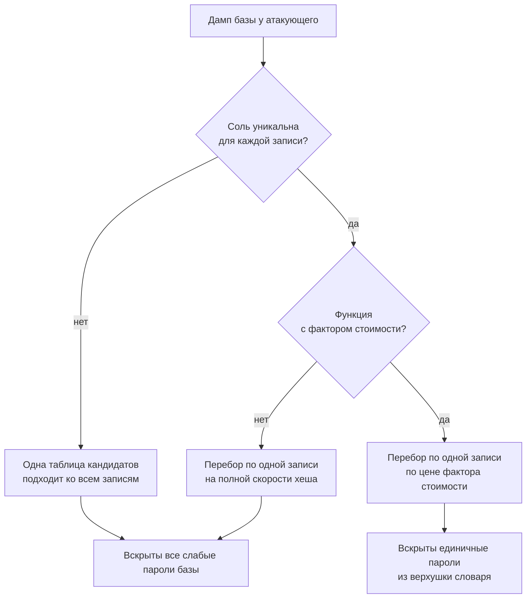

# Хранение паролей: bcrypt, argon2, почему не SHA

Вот строка из слитой базы одного сервиса — из дампа, то есть копии таблицы,
которая ушла к атакующему:

```text
anna:3fc0a7acf087f549ac2b266baf94b8b1
```

Пароль здесь — `qwerty123`, и узнаётся он без всякого взлома. Вторая
половина строки — хеш пароля, необратимый отпечаток. Такая функция одна и та
же у всех: отпечаток от `qwerty123` давно посчитан, вбейте его в поисковик —
и пароль придёт первой ссылкой. Где поисковик молчит, работает перебор по
словарю частых паролей, и решает скорость. На Ryzen 7 9800X3D хеш SHA-256
считается 5,3 миллиона раз в секунду в одном потоке, а MD5 ещё быстрее.
Много это или мало? Для контрольных сумм и подписей этой скорости мало — там
хеш гоняют на каждый пакет. Для пароля — катастрофа, и цена одной догадки —
предмет этой темы.

## Как устроена проверка пароля

Хранить пароль читаемым нельзя, и причина в том, сколько копий бывает у одной
таблицы. Строка учётной записи живёт не только в самой базе. Она попадает в
резервную копию, в реплику для чтения, в снимок для тестового стенда, в
выгрузку для аналитики; тема `app-architecture` разбирает эту цепочку.
Достаточно утечки любой из копий, и вся колонка паролей у атакующего.

Поэтому приложение хранит не сам пароль, а средство его проверить. При входе
пользователь присылает пароль заново, и приложение сравнивает его отпечаток с
тем, что лежит в таблице. Хеш здесь годится потому, что он необратим:
прочитать пароль из дампа нельзя, а сравнить присланное с хранимым можно.
Считается отпечаток в одну сторону и быстро: по паролю — за доли
микросекунды, а обратного вычисления, от отпечатка к паролю, у функции нет.

Бытовой образ — отпечаток пальца: по пальцу отпечаток снимается всегда, а
вот палец по отпечатку не восстановить. Пароль здесь соответствует пальцу,
хеш — отпечатку, проверка входа — сличению двух отпечатков. Где аналогия
ломается: отпечаток пальца уникален сам по себе, а два одинаковых пароля
дают дословно одинаковый хеш, и это ещё сыграет ниже.

Пароль пересекает две границы доверия, и вторая интереснее первой. Первая —
от браузера к приложению, её закрывает TLS из темы `tls-and-proxy`. Вторая —
от приложения к хранилищу и ко всем копиям таблицы. Модель угроз этой темы
начинается там, где дамп уже у атакующего. Вопрос стоит один: во что ему
обойдётся восстановление паролей. В терминах потоков данных: источник —
пароль пользователя, сток — строка в таблице учётных записей, отсутствующий
контроль — цена одной догадки.

**Зачем это в работе AppSec-инженера.** Дефект виден в одной строке кода, и
именно поэтому его пропускают: строка выглядит грамотно, в ней есть и хеш, и
часто даже соль. Отличать «хеширует» от «хеширует так, что перебор дорог» —
навык ревьюера. Спор с командой упирается в числа, которые надо уметь
назвать, и эти числа дальше по тексту.

## Подумай, прежде чем читать

1. База с паролями утекла целиком. Что меняет добавление соли, случайной
   приписки к паролю, для атакующего, у которого на руках весь дамп?
2. Функция проверки пароля работает 200 мс вместо микросекунды. Кто платит эти
   200 мс и сколько раз в секунду?
3. Пароль хешируют в SHA-256 дважды подряд. Во сколько раз это удорожает
   перебор?

## Как это работает

**Откуда это взялось.** Задача звучит как «проверять пароль», а не «знать
пароль», и разница между этими двумя формулировками — вся тема. Хранить
пароль читаемым нельзя, потому что копий у таблицы много и утечки одной
достаточно. Ответом стал криптографический хеш: сравнить можно, прочитать
нельзя. Ломается этот ответ на том, за что хеш ценят в остальных задачах, —
на скорости. Одна догадка стоит атакующему примерно столько же, сколько
защите одна проверка входа.

Ответ сложился в два приёма. Первый — соль: уникальная случайная строка рядом
с каждой записью, и одна таблица кандидатов перестаёт подходить ко всей базе
сразу. Второй — функция с настраиваемой ценой, где число повторений задаётся
параметром: Argon2id, scrypt, bcrypt, PBKDF2. Одна догадка занимает заметную
долю секунды, и перебор проседает с миллионов до единиц в секунду. Позже к
цене добавили и память.

### Почему быстрый хеш проигрывает

SHA-256 — хеш-функция из семейства SHA-2, и разрабатывалась она быстрой: её
считают для каждого пакета и каждого файла. Для пароля та же скорость
становится недостатком. OWASP Password Storage Cheat Sheet, памятка OWASP о
хранении паролей, формулирует это прямо. Быстрые функции не подходят, потому
что позволяют атакующему делать много догадок за короткое время.

Порядок величин виден замером. В замере три функции: SHA-256; PBKDF2, которая
гоняет внутри себя другую функцию много раз подряд; и scrypt. PBKDF2 в этом
замере работает в варианте с HMAC (Hash-based Message Authentication Code) —
конструкцией «хеш с ключом» на SHA-256. Как она устроена, разбирает тема
`hmac-vs-signature`. На AMD Ryzen 7 9800X3D, Python 3.14.7, один поток:

| Что считаем | Догадок в секунду |
|---|---:|
| SHA-256 от строки | 5 300 000 |
| PBKDF2-HMAC-SHA-256, 600 000 итераций | 18 |
| scrypt, N=2¹⁷, r=8, p=1 | 5,7 |

Разница между первой и третьей строкой — примерно в 900 000 раз. Это и есть
предмет темы: не «хешируется или нет», а сколько стоит одна догадка.

> **Примечание.** Числа сняты на одной машине одним потоком и годятся как
> порядок величины, не как норматив. Атакующий считает на видеокарте и на
> многих ядрах сразу: у видеокарты тысячи ядер, и однотипные вычисления вроде
> хеша она гоняет параллельно. Своя цифра снимается на своём железе.

### Что меняет соль

Соль — уникальное случайное значение, которое добавляется к паролю перед
хешированием и хранится рядом с результатом. Секретом она не считается.
Работает это так. Без соли пароль `qwerty` у Анны и у Бориса даёт один и тот
же хеш, и в дампе эти две записи совпадают дословно. С солью Анна хранит
отпечаток от `qwerty·8f3a…`, а Борис — от `qwerty·c71b…`, и по дампу уже не
видно, что пароль у них один.

Cheat Sheet называет три следствия. Атакующему приходится вскрывать хеши по
одному, со своей солью для каждого. Перестают подходить и заранее
посчитанные таблицы — радужные таблицы, готовые справочники «хеш → пароль»:
таблица считается один раз и прикладывается ко всем записям сразу. И по дампу больше
не видно, что два пользователя выбрали один пароль.

Чего соль не даёт: она не удорожает одну догадку. Одна запись с солью
вскрывается ровно с той же скоростью, что и без соли. Соль лежит в том же
дампе, и атакующий добавляет её к каждому кандидату. Соль убирает выигрыш от
работы над всей базой сразу, а цену перебора задаёт другой параметр.

NIST SP 800-63B-4, американский стандарт цифровой идентификации, в
§ 3.1.1.2 требует не менее 32 бит соли. Документация Python и Node рекомендует
16 байт и больше. Верхняя из планок не противоречит ни одному из трёх
документов.

### Что задаёт цену догадки

Цена задаётся фактором стоимости — параметром, который говорит, сколько раз
повторить работу внутри функции. Бытовой образ — замок, который открывается
не одним оборотом ключа, а тысячей: владельцу это стоит секунду, а тому, кто
подбирает ключ, — тысячу секунд на каждую попытку. Обороты ключа здесь
соответствуют повторениям внутри функции, подбор ключа — перебору паролей.
Аналогия ломается на том, что число оборотов у замка не поменять, а фактор
стоимости — настройка, которую поднимают со временем.

Cheat Sheet оговаривает, что обычно это `2^work` повторений, а не `work`.
Правило подбора там же: поднимать, пока проверка укладывается примерно в
секунду, и поднимать со временем, потому что железо дешевеет. NIST в
§ 3.1.1.2 говорит то же модальностью SHOULD, то есть «следует», а не
«требуется». Ходовых функций с таким параметром четыре: PBKDF2, bcrypt,
scrypt и Argon2id. Все четыре берут пароль, соль и настройку цены, и все
четыре специально медленные.

У Argon2id и scrypt к этому добавляется память. Cheat Sheet советует выбирать
функции, устойчивые и к атакам на видеокартах, и к атакам на память.
RFC 9106, документ, описывающий Argon2, называет его memory-hard функцией,
то есть «трудной по памяти», прямо в заголовке. Смысл в том, что для работы
такой функции нужен большой кусок памяти на каждую догадку. У видеокарты
ядер много, а быстрой памяти на каждое ядро мало, поэтому массовый
параллельный перебор упирается в память, а не в вычисления. RFC 9106
объясняет и одно из решений в конструкции: умножения увеличивают глубину
схемы и тем самым время работы реализаций на специализированных микросхемах.


```mermaid
flowchart TD
    D[Дамп базы у атакующего] --> Q{Соль уникальна<br/>для каждой записи?}
    Q -- нет --> T[Одна таблица кандидатов<br/>подходит ко всем записям]
    Q -- да --> S{Функция<br/>с фактором стоимости?}
    S -- нет --> F[Перебор по одной записи<br/>на полной скорости хеша]
    S -- да --> C[Перебор по одной записи<br/>по цене фактора стоимости]
    T --> W[Вскрыты все слабые пароли базы]
    F --> W
    C --> R[Вскрыты единичные пароли<br/>из верхушки словаря]
```

**Описание схемы.** Вход — дамп у атакующего. Первая развилка спрашивает про
уникальную соль: без неё одна таблица кандидатов подходит ко всей базе. Вторая
развилка спрашивает про фактор стоимости: без него перебор идёт на полной
скорости хеша. Оба левых пути ведут к вскрытию всех слабых паролей базы,
правый — к единичным. Развилки подписаны вопросами, исходы — результатом для
атакующего.

## Как это атакуют

Стенд — лаба `pilot/lab/password-storage`, каталог из семи файлов. Работает
локально на стандартной библиотеке Python, сети не требует. Приёмы, показанные
дальше, работают именно с этим стендом.

Сервис заводит четыре учётные записи и отдаёт `export_dump()` — то же, что
уйдёт с резервной копией. Три пароля взяты из общеизвестных подборок частых,
один — случайный.

Шаг 1. Соберите дамп и посмотрите на него глазами атакующего:

```text
Вывод команды: python3 hack.py, опыт 1
опыт 1 — одинаковые пароли дают одинаковую запись: ДА
```

Две записи из четырёх совпали дословно. Соли нет, и по дампу видно, что два
пользователя выбрали один пароль. Это уже находка: перебирать надо не четыре
значения, а три.

Шаг 2. Посчитайте словарь один раз и приложите ко всей базе:

```text
Вывод команды: python3 hack.py, опыт 2
опыт 2 — одна таблица на всю базу вскрыла записей: 3 из 4
         anna -> qwerty
         boris -> letmein
         carol -> qwerty
```

Двенадцать кандидатов, один проход, три пароля из четырёх. Стоимость атаки не
зависит от числа учётных записей, потому что таблица считается один раз.

Шаг 3. Замерьте скорость перебора по одной записи:

```text
Вывод команды: python3 hack.py, опыт 3
опыт 3 — перебор по одной записи: 2 441 100 догадок/с
```

Два с половиной миллиона в секунду — на интерпретируемом языке, в одном
потоке, без видеокарты. Четвёртый пароль эта атака не вскрыла, и причина в
самом пароле, а не в хранилище. Шестнадцать случайных символов словарём не
берутся: у такого пароля высокая энтропия, то есть мера непредсказуемости.
Вариантов слишком много, чтобы их перебрать.

> **Предупреждение.** Скорость перебора — свойство хранилища, стойкость
> четвёртого пароля — свойство пользователя. Опираться на второе при оценке
> первого нельзя: выбор пароля приложение не контролирует.

## Как это выглядит в коде

У вас в коде, скорее всего, стоит не MD5. Это не спасает: SHA-256 без соли и
без настройки цены — та же находка, и на ревью она видна в одной строке.
Ревьюер ищет четыре вещи, и все четыре видны по вызову, без чтения логики.

**Первое: имя функции рядом с именем переменной.** Быстрая функция, которой
передали что-то с именем `password`, `passwd`, `pwd`, — почти всегда дефект.
WSTG-v42-CRYP-04, раздел руководства OWASP по тестированию, даёт половину
приёма: список имён слабых алгоритмов для поиска грепом. Список такой:
`MD4`, `MD5`, `RC4`, `RC2`, `DES`, `Blowfish`, `SHA-1`, `ECB`. Вторая
половина, список слов вроде `passwd` и `pwd`, стоит там же, но под другую
задачу — поиск зашитых секретов. Пересечение двух списков и даёт находку
этой темы. Оба дефекта этого файла назовите до разбора.

```python
# app/accounts.py
# УЯЗВИМО — демонстрация, не для продакшена
import hashlib

def register(login: str, password: str) -> None:
    STORE[login] = hashlib.sha256(password.encode()).hexdigest()  # (1)

def verify(login: str, password: str) -> bool:
    stored = STORE.get(login)
    candidate = hashlib.sha256(password.encode()).hexdigest()
    return candidate == stored                                    # (2)
```

1. Быстрая функция, соли нет. Две записи с одним паролем совпадут дословно.
2. Сравнение обычным оператором. Оператор `==` сравнивает строки посимвольно
   и останавливается на первом различии, поэтому время сравнения зависит от
   числа совпавших символов. По этой разнице атакующий из сети может
   угадывать хеш по символу за раз — такой приём называют атакой по времени.

**Второе: тот же дефект на другом стеке.** Инвариант — быстрая функция без
соли и без фактора стоимости. Декорация — имя вызова и способ получить строку.
Найдите здесь те же два дефекта, что в варианте на Python, — синтаксис другой,
ошибки те же.

```javascript
// app/accounts.js
// УЯЗВИМО — демонстрация, не для продакшена
import { createHash } from 'node:crypto';

export function register(login, password) {
  const digest = createHash('sha256').update(password).digest('hex');
  store.set(login, digest);                                       // (1)
}

export function verify(login, password) {
  const digest = createHash('sha256').update(password).digest('hex');
  return store.get(login) === digest;                             // (2)
}
```

1. `createHash('sha256')` вместо `scrypt` — та же ошибка, другой синтаксис.
2. `===` вместо сравнения за постоянное время — такого, которое тратит
   одинаковое время при любом раскладе и не выдаёт совпавший префикс.
   Документация Node прямо называет `crypto.timingSafeEqual` пригодным для
   сравнения секретных значений.

**Третье: параметры ниже планки.** Функция может быть правильной, а настройки
— нет. Node подставляет свои умолчания молча:

```javascript
// Фрагмент, упрощено для примера
const key = scryptSync(password, salt, 32);   // N=16384, r=8, p=1
```

Умолчание `cost` в Node — 16384, то есть 2¹⁴. ASVS v5.0 для `p=1` требует не
меньше 2¹⁷. Вызов работает, ошибки не даёт, планку не выполняет. Ревью такого
вызова сводится к вопросу «а какие здесь параметры», и ответ «умолчательные»
означает «ниже требования».

**Четвёртое: что не спасает.** Двойной SHA-256 удорожает перебор вдвое, а
против нужных сотен тысяч раз это ничего не меняет. Собственная «соль»,
собранная из логина или из идентификатора записи, предсказуема и от заранее
посчитанных таблиц не защищает. Каталог типовых слабостей CWE выделяет её под
номером 760. Шифрование вместо хеширования обратимо: Cheat Sheet допускает
его лишь в краевом случае, когда исходный пароль нужен приложению для входа в
чужую систему. Общее у трёх приёмов — задача остаётся нерешённой.

> **Примечание: ложные срабатывания.** Быстрый хеш от секрета — не всегда
> дефект. ASVS v5.0-6.5.2 разрешает обычную хеш-функцию для значений с
> энтропией от 112 бит: у случайного токена перебор невозможен независимо от
> скорости функции. Идентификатору сессии тех же 112–127 бит мало: для него
> действует планка в 128 бит (ASVS v5.0-7.2.3, тема `secure-random`).
> Контрольная сумма загруженного файла к теме тоже не
> относится. Смотрите на происхождение значения, а не на имя функции.

## Как защититься

Канон: функция с фактором стоимости, уникальная случайная соль на запись,
параметры и алгоритм записаны рядом с хешем, сравнение за постоянное время.
Соль порождает криптографический генератор случайных чисел, CSPRNG: такой,
чьи значения нельзя предсказать, даже зная предыдущие. Обычный `random` не
годится, потому что его последовательность восстанавливается по наблюдениям —
это как тасовать колоду на виду у всех.

Листинг читается по четырём следам: где задаются параметры стоимости, откуда
берётся соль, что хранится вместе с хешем, чем сравниваются значения.

```python
# app/accounts.py — Исправлено
import base64, hashlib, hmac, os

_N, _R, _P = 2 ** 17, 8, 1
_MAXMEM = 192 * 1024 * 1024                                    # (1)

def register(login: str, password: str) -> None:
    salt = os.urandom(16)                                      # (2)
    dk = hashlib.scrypt(password.encode("utf-8"), salt=salt,
                        n=_N, r=_R, p=_P, maxmem=_MAXMEM, dklen=32)
    STORE[login] = (f"scrypt$n={_N},r={_R},p={_P}$"            # (3)
                    f"{base64.b64encode(salt).decode()}$"
                    f"{base64.b64encode(dk).decode()}")

def verify(login: str, password: str) -> bool:
    stored = STORE.get(login)
    if stored is None:
        return False
    _, params, salt_b64, hash_b64 = stored.split("$")
    values = dict(pair.split("=") for pair in params.split(","))
    dk = hashlib.scrypt(
        password.encode("utf-8"), salt=base64.b64decode(salt_b64),
        n=int(values["n"]), r=int(values["r"]), p=int(values["p"]),
        maxmem=_MAXMEM, dklen=len(base64.b64decode(hash_b64)))
    return hmac.compare_digest(dk, base64.b64decode(hash_b64))  # (4)
```

1. Без явного `maxmem` этот вызов падает с `ValueError`. Разбор — ниже.
2. Соль своя на каждую запись, из криптографического источника `os.urandom`.
3. Алгоритм и параметры лежат в самой строке. Без них поднять фактор
   стоимости через год не выйдет: старые записи станет нечем отличить.
4. Сравнение за постоянное время вместо `==`.

Этот листинг — канон, проведённый в код: функция с ценой, соль на запись,
параметры рядом с хешем, сравнение за постоянное время. Вопрос
на перспективу: что поменяется через год, когда планку поднимут, — и почему
без записи параметров в строке та же замена была бы миграцией?

Тот же фикс на втором стеке. Разбор закрыт: назовите сами, что здесь
изменилось против уязвимого варианта и зачем нужна каждая из трёх строк.

```javascript
// app/accounts.js — Исправлено
import { scryptSync, randomBytes, timingSafeEqual } from 'node:crypto';

const OPTS = { N: 2 ** 17, r: 8, p: 1, maxmem: 192 * 1024 * 1024 };

export function register(login, password) {
  const salt = randomBytes(16);
  const dk = scryptSync(password, salt, 32, OPTS);
  store.set(login, `scrypt$N=${OPTS.N},r=${OPTS.r},p=${OPTS.p}$` +
                   `${salt.toString('base64')}$${dk.toString('base64')}`);
}

export function verify(login, password) {
  const stored = store.get(login);
  if (!stored) return false;
  const [, , saltB64, hashB64] = stored.split('$');
  const expected = Buffer.from(hashB64, 'base64');
  const dk = scryptSync(password, Buffer.from(saltB64, 'base64'),
                        expected.length, OPTS);
  return timingSafeEqual(dk, expected);
}
```

<details markdown="1">
<summary>Разбор второго листинга</summary>

Изменилось три вещи, и они те же, что в Python. `createHash('sha256')`
заменён на `scryptSync` с явными параметрами — появился фактор стоимости.
Добавился `randomBytes(16)` — появилась уникальная соль, и она уехала в
строку хранения вместе с параметрами. Сравнение `===` заменено на
`timingSafeEqual`, который требует буферов одинаковой длины и бросает
исключение при несовпадении длин.

Инвариант класса дефекта — отсутствие цены за догадку. Декорация — имена
`scryptSync` против `hashlib.scrypt`, `Buffer` против `bytes`, опции объектом
против именованных аргументов.

</details>

### Где канон упирается в среду

**Argon2id есть в `node:crypto` начиная с Node v24.7.0, в `hashlib` его
нет.** Cheat Sheet ставит Argon2id первым выбором. В Node он доступен как
`crypto.argon2()` без внешних зависимостей. В Python взять его — значит
завести внешнюю зависимость в контур аутентификации, и это решение уровня
архитектуры, а не строки кода. Поэтому в примерах выше стоит scrypt: он
второй по списку Cheat Sheet и работает в обеих стандартных библиотеках.

**Рекомендованные параметры scrypt не работают без правки лимита памяти.**
OpenSSL, криптографическая библиотека, через которую обе платформы считают
scrypt, отказывается считать, если запрошенная память превышает `maxmem`, а
умолчание там 32 МиБ. Параметрам `N=2¹⁷, r=8, p=1` нужно 128 МиБ. Замер
порога на пяти наборах параметров дал точную формулу: требуется `128·N·r`
плюс `128·r·p + 256·r` байт. Проверено лично на Python 3.14.7 и Node v26.7.0 —
сообщение об ошибке в обоих случаях приходит из OpenSSL и звучит одинаково:
`memory limit exceeded`.

**Память умножается на число одновременных входов.** 128 МиБ на проверку и сто
одновременных входов — это 12 800 МиБ, или 12,5 ГиБ. Cheat Sheet предупреждает об обратной
стороне того же: слишком высокий фактор стоимости превращает форму входа в
рычаг отказа в обслуживании. Атакующему достаточно слать запросы на вход, и
каждый будет стоить серверу дорогой проверки. Наборы параметров в Cheat Sheet
и в ASVS даны парами именно поэтому: меньше памяти — больше итераций.

**Требование FIPS-140 закрывает выбор.** FIPS-140 — американский стандарт,
которому обязаны соответствовать криптографические модули в госсекторе и у
его подрядчиков; соответствие подтверждается валидацией конкретной
реализации. Cheat Sheet в этом случае предписывает PBKDF2 с HMAC-SHA-256 и
не менее 600 000 итераций: у PBKDF2 есть валидированные реализации, у
Argon2id и scrypt — нет.

**bcrypt обрезает пароль на 72 байтах.** Cheat Sheet называет его выбором для
legacy-систем, требует фактор от 10 и ограничения длины в 72 байта. Приём
«предварительно посчитать быстрый хеш, чтобы обойти лимит» там же разобран как
опасный. Нулевой байт внутри хеша обрывает строку, а password shucking сводит
стойкость к стойкости внутренней функции. Shucking — «снятие шелухи»: у
атакующего с прошлой утечки уже есть быстрый хеш того же пароля, и он снимает
дорогой внешний слой, перебирая дешёвый внутренний.

**Старые записи никуда не денутся.** Исходных паролей для них нет ни у кого,
поэтому пересчитать хеши разом невозможно. Cheat Sheet предлагает два пути:
пересчитывать при следующем входе пользователя либо погасить пароли неактивных
и потребовать сброса. Первый путь означает, что код проверки некоторое время
принимает оба формата — и это ровно то место, где ломается наивный фикс.

## Как убедиться, что защита работает

Проверка состоит из трёх частей, и две последние важнее первой.

**Ретест** — это повторный запуск того же эксплойта после починки. Прогоните
`python3 hack.py`. Признак починки — две строки вместо трёх: одинаковые пароли
перестали давать одинаковую запись, общая таблица не подошла ни к одной
записи. Код возврата 0.

```text
Вывод команды: LAB_TARGET=solution.py python3 hack.py
опыт 1 — одинаковые пароли дают одинаковую запись: нет
опыт 2 — одна таблица на всю базу вскрыла записей: 0 из 4
опыт 3 — перебор по одной записи: 6 догадок/с
ЭКСПЛОЙТ НЕ СРАБОТАЛ
```

Третья строка — тот же замер, что до фикса показывал 2 441 100. Отношение
двух чисел и есть результат работы.

**Регресс** — юнит-тест, который останется в репозитории и упадёт, если фикс
откатят. Проверять надо не «хеш поменялся», а свойство: две регистрации
одного пароля дают разные записи, а проверка обеих проходит.

**Негативные кейсы — что должно продолжать работать.** Здесь ломается
большинство наивных починок, поэтому список стоит держать перед глазами.

1. Пользователь из старой базы входит своим паролем (миграция не забыта).
2. Пароль с пробелами по краям принимается как есть (ASVS v5.0-6.2.8: без
   усечения и без смены регистра).
3. Пароль в 64 символа принимается (ASVS v5.0-6.2.9).
4. Не-ASCII и эмодзи работают: Cheat Sheet требует принимать весь диапазон
   Unicode, включая нулевой байт.
5. Проверка укладывается в секунду.

Снизу длину держит политика. ASVS v5.0-6.2.1 требует принимать пароли не
короче восьми символов и настоятельно рекомендует пятнадцать; тот же минимум
ставит и NIST SP 800-63b.

Все пять входят в `tests.py` лабы и должны оставаться зелёными до фикса и
после. Тест, который зеленеет только после починки, — это ретест, а не
регресс; путать их не стоит.

**Чеклист для ревью.** Восемь пунктов, по которым принимается работа.

1. Проверьте, что пароли хранятся функцией с настраиваемым фактором стоимости, а
   не функцией общего назначения (ASVS v5.0-11.4.2).
2. Проверьте, что параметры функции не ниже действующей планки: Argon2id
   `t=2, m≥19456, p=1`, scrypt `p=1, N≥2¹⁷, r=8`, bcrypt `cost≥10`,
   PBKDF2-HMAC-SHA-256 от 600 000 итераций.
3. Проверьте, что умолчания библиотеки проверены явно, а не приняты на веру.
4. Проверьте, что соль уникальна для каждой записи, порождается CSPRNG и не
   короче 32 бит (NIST SP 800-63B-4 § 3.1.1.2).
5. Проверьте, что алгоритм и его параметры хранятся вместе с хешем, чтобы фактор
   стоимости можно было поднять.
6. Проверьте, что результат сравнивается за постоянное время.
7. Проверьте, что пароль проверяется ровно в том виде, в каком пришёл, без
   усечения и смены регистра (ASVS v5.0-6.2.8).
8. Проверьте, что для записей старого формата заведён путь миграции, а не
   молчаливый отказ во входе.

## Как это находят инструменты

Дефект ловится статическим анализом хорошо, потому что он локален и виден по
вызову. Статический анализ читает код, не запуская его, и находит совпадения
с записанными образцами дефектов; такой образец называется правилом. Правило
`password-fast-digest` для анализатора Semgrep помечает вызов быстрой
хеш-функции из `hashlib` — MD5, SHA-1, семейств SHA-2 и SHA-3 — над
значением, чьё имя указывает на пароль. Сообщение находки объясняет, чем
быстрый хеш удешевляет перебор, и называет замену: функцию с настраиваемой
ценой и солью.

Правило целиком — в `pilot/semgrep/password-fast-digest.yaml`. Оно прогнано
лично на Semgrep 1.174.0 по восьми размеченным случаям: четыре находки там,
где они ожидались, ноль на четырёх чистых. На уязвимом `code.py` лабы — две
находки, на решении — ни одной.

**Что оно пропустит.** Всё, где имя переменной не содержит корня «пароль»:
`hashlib.sha256(p.encode())` невидим для второго условия. Промежуточную
переменную (`raw = password.encode()`, строкой ниже `sha256(raw)`) правило без
анализа потока данных тоже не увидит. И оно ничего не говорит о параметрах:
`scryptSync(password, salt, 32)` с умолчаниями Node оно считает чистым, хотя
планку ASVS такой вызов не выполняет.

**Какой шум оно даст.** Один вид ложных срабатываний нашёлся на собственном
решении лабы. Функция сверки записи старого формата вызывает `sha256` от
пароля — и делает это законно: она не сохраняет пароль, а проверяет
доставшийся от предыдущей версии хеш. Правило этих двух случаев не различает,
потому что вызов в них дословно одинаковый. Лечится подавлением в одну строку
с объяснением, а не ослаблением правила:

```python
# Фрагмент, упрощено для примера
# nosemgrep: password-fast-digest
candidate = hashlib.sha256(password.encode("utf-8")).hexdigest()
```

Второй ожидаемый вид шума — хеширование высокоэнтропийных токенов, если имя
переменной содержит `password`: например, `password_reset_token`. По
ASVS v5.0-6.5.2 это допустимо, и правило здесь ошибётся.

> **Примечание.** Штатный `semgrep --test` версии 1.174.0 на этой раскладке
> каталогов падает с `IndexError`. Сверка правила с разметкой сделана
> отдельным скриптом `pilot/semgrep/check.py`, который разбирает JSON обычного
> прогона.

## Частая ошибка

Посоленные пароли — хранение в порядке? Ответ «согласен» или «не согласен»
дайте до того, как читать механизм.

«Согласен» звучит чаще: пароли посолены, значит, хранение в порядке, а замена
функции — придирка ревьюера.

**Соль не удорожает перебор.** Она меняет экономику атаки на всю базу и не
меняет цену одной догадки.

Механизм. Соль работает до вычисления: она делает вход функции уникальным,
поэтому одна таблица кандидатов перестаёт подходить ко всем записям сразу.
Скорость самой функции остаётся прежней. Атакующий, которому нужна одна
конкретная учётная запись — администратора, например, — берёт её соль из того
же дампа и перебирает на полной скорости SHA-256.

Контрпример из лабы. После добавления соли к SHA-256 опыт 2 показал бы ноль
вскрытых записей, а опыт 3 остался бы на двух с половиной миллионах догадок в
секунду. Пароль `qwerty` вскрывается на такой скорости за доли миллисекунды —
для него разницы нет никакой.

## Попробуй сам

**Цель одной фразой:** добиться, чтобы `pilot/lab/password-storage/hack.py`
вышел с кодом 0, а `tests.py` продолжил выходить с кодом 0.

Формат — Secure Code Game: чинится `code.py`, а эксплойт и функциональные
тесты лежат рядом и играют против вашей правки. Нужен Python 3.6 или новее,
сеть не нужна. Секции «Запуск», «Сброс» и «Удаление» — в `README.md`
каталога.

Подсказка даётся одна: атакующему нужно, чтобы работа над одной записью не
помогала со всеми остальными и чтобы каждая догадка стоила заметного времени.
Первое даёт значение из `os.urandom`, второе — функция из раздела «Key
derivation» документации `hashlib`.

**Отдельная задача «почини».** Тест «пользователь из старой базы входит»
проходит до вашей правки и обязан проходить после. Исходных паролей для таких
записей нет ни у кого. Наблюдаемый критерий: `tests.py` печатает «Упало
проверок: 0», а `hack.py` — «ЭКСПЛОЙТ НЕ СРАБОТАЛ»; в коде проверки видно, по
какому признаку различаются два формата записи.

Решение — `solution.py` в том же каталоге, открыто без условий.

## Проверь себя

1. Два обработчика в одном сервисе хешируют значения одной и той же функцией:

   ```python
   def save_reset_token(user, token):
       TOKENS[user] = hashlib.sha256(token.encode()).hexdigest()

   def save_password(user, password):
       STORE[user] = hashlib.sha256(password.encode()).hexdigest()
   ```

   В какой из двух функций дефект и почему вторая законна, хотя вызовы
   дословно совпадают?

2. Регистрация из раздела «Как это выглядит в коде» хранит пароль быстрым
   хешем:

   ```python
   def register(login: str, password: str) -> None:
       STORE[login] = hashlib.sha256(password.encode()).hexdigest()
   ```

   Какую починку вы выберете?

   А. Добавить к каждой записи уникальную соль и оставить SHA-256.

   Б. Перейти на scrypt с `N=2¹⁷, r=8, p=1`, солью из CSPRNG, параметрами в
      строке хранения и сравнением за постоянное время.

   В. Прогнать SHA-256 дважды подряд — работа над догадкой удвоится.

3. Проверка пароля стала работать 200 мс вместо микросекунды. Кто платит эти
   200 мс, сколько раз — и почему цена всё же не бесплатна для сервера?
4. Один и тот же пароль хешируется дважды. Предскажите, что напечатает
   фрагмент, и скажите, что меняет уникальная соль для атакующего, у которого
   на руках весь дамп.

   ```python
   import hashlib, os
   h1 = hashlib.scrypt(b"qwerty", salt=os.urandom(16), n=2**17, r=8, p=1,
                       maxmem=192*1024*1024, dklen=32)
   h2 = hashlib.scrypt(b"qwerty", salt=os.urandom(16), n=2**17, r=8, p=1,
                       maxmem=192*1024*1024, dklen=32)
   print(h1 == h2)
   ```

5. Возврат к теме `sessions-vs-tokens`: чем требования к значению
   идентификатора сессии отличаются от требований к хранению пароля и почему?
6. Возврат к теме `app-architecture`: перечислите места, куда попадает копия
   таблицы учётных записей, кроме самой базы.

<details markdown="1">
<summary>Ответ 1</summary>

1. Дефект в `save_password`: пароль выбирает человек, энтропия у него низкая,
   и быстрый хеш перебирается со скоростью миллионов догадок в секунду. Токен
   сброса порождается CSPRNG: при 112 и более битах перебор невозможен
   независимо от скорости функции, и ASVS v5.0-6.5.2 разрешает для таких
   значений обычный хеш. Смотреть надо на происхождение значения, а не на имя
   функции.

</details>

<details markdown="1">
<summary>Ответ 2: разбор вариантов</summary>

2. Верный ответ — Б.

   А. Соль меняет экономику атаки на всю базу — одна таблица кандидатов
      перестаёт подходить ко всем записям — и не меняет цену одной догадки.
      Контрпример из темы: с посоленным SHA-256 опыт 2 лабы показал бы ноль
      вскрытых записей. А опыт 3 остался бы на двух с половиной миллионах
      догадок в секунду. Пароль `qwerty` падает на такой скорости мгновенно.

   Б. Фактор стоимости задаёт цену одной догадки параметром, соль уникальна.
      Параметры в строке позволят поднять планку через год, а сравнение за
      постоянное время закрывает утечку по времени. Прогон
      `LAB_TARGET=solution.py python3 hack.py` в `pilot/lab/password-storage`
      показывает: таблица не вскрыла ни одной записи, перебор упал до единиц
      догадок в секунду.

   В. Двойной SHA-256 удорожает перебор ровно вдвое — против нужных сотен
      тысяч раз это ничего не меняет. Цена задаётся не числом прогонов в коде,
      а параметром, который поднимают со временем.

</details>

<details markdown="1">
<summary>Ответ 3</summary>

3. Пользователь платит один раз при входе, и 200 мс для него незаметны;
   атакующий платит за каждую догадку, а догадок у него миллионы. Цена не
   бесплатна серверу: у scrypt к стоимости добавляется память, и сто
   одновременных входов по 128 МиБ — это 12,5 ГиБ. Слишком высокий фактор
   превращает форму входа в рычаг отказа в обслуживании, поэтому наборы
   параметров даны парами: меньше памяти — больше итераций.

</details>

<details markdown="1">
<summary>Ответ 4</summary>

4. `False`: одинаковый пароль дал две разные записи, потому что соль у каждой
   своя. Ответ получен прогоном: `python3 - <<'EOF' … EOF` с этим фрагментом
   (считает около секунды). Для атакующего с дампом соль меняет три вещи:
   заранее посчитанные таблицы не подходят, работа над одной записью не
   помогает с остальными, одинаковые пароли неразличимы. Цену одной догадки
   она не меняет — её задаёт фактор стоимости.

</details>

<details markdown="1">
<summary>Ответ 5</summary>

5. Идентификатор сессии порождает сервер, поэтому от него требуют энтропии — и
   тогда обычная хеш-функция для его хранения допустима (ASVS v5.0-6.5.2).
   Пароль выбирает человек, энтропия у него низкая и внешне непроверяемая,
   поэтому требуется цена за догадку.

</details>

<details markdown="1">
<summary>Ответ 6</summary>

6. Резервные копии, реплики для чтения, снимки для тестовых стендов, выгрузки
   для аналитики, экспортированные дампы у разработчиков. Каждое из этих мест
   — отдельный путь к тому же дампу.

</details>

## Источники

1. OWASP Password Storage Cheat Sheet; реестр `owasp-cs-password-storage`.
   Разделы: Introduction, Salting, Peppering, Using Work Factors, Argon2id,
   scrypt, bcrypt, PBKDF2, Upgrading Legacy Hashes, International Characters.
   <https://cheatsheetseries.owasp.org/cheatsheets/Password_Storage_Cheat_Sheet.html>
2. NIST SP 800-63B-4 «Digital Identity Guidelines», Final, июль 2025; реестр
   `nist-sp-800-63b`. Разделы: § 3.1.1.2 (хранение, соль, фактор стоимости,
   keyed hash), Приложение A.2 (офлайн-атаки), A.3 (композиционные правила).
   <https://nvlpubs.nist.gov/nistpubs/SpecialPublications/NIST.SP.800-63b-4.pdf>
3. OWASP WSTG-CRYP-04 «Testing for Weak Encryption», WSTG v4.2; реестр
   `wstg-v42-cryp-04-weak-encryption`. Разделы: Basic Security Checklist,
   Source Code Review.
   <https://owasp.org/www-project-web-security-testing-guide/v42/4-Web_Application_Security_Testing/09-Testing_for_Weak_Cryptography/04-Testing_for_Weak_Encryption>
4. RFC 9106 «Argon2 Memory-Hard Function for Password Hashing and
   Proof-of-Work Applications», IRTF, Category Informational, сентябрь 2021;
   реестр `rfc9106-argon2`. Разделы: § 4 Parameter Choice, § 7.4
   Recommendations.
   <https://www.rfc-editor.org/rfc/rfc9106.html>
5. Документация Python, модуль `hashlib`, версия 3.14.7; реестр
   `python-hashlib`. Раздел Key derivation.
   <https://docs.python.org/3/library/hashlib.html>
6. Документация Node.js, модуль `crypto`, версия v26.7.0; реестр
   `node-crypto`. Разделы: `crypto.scrypt`, `crypto.scryptSync`,
   `crypto.timingSafeEqual`.
   <https://nodejs.org/api/crypto.html>

Каркас этапа: `owasp-asvs-5-document` (ASVS v5.0.0), `owasp-wstg-42`,
`owasp-top10-2025`; якоря подраздела: `ps-authentication`,
`owasp-cs-authentication`. Наследуются всеми темами и отдельной строкой не
повторяются.

**Число источников.** Шесть собственных, каждый под свой вопрос. Четвёртый
(RFC 9106) взят под вопрос, который три первых оставили открытым: какие
параметры Argon2id считает достаточными автор функции. Пятый и шестой — под
парные листинги: они показаны на двух стеках, и документация каждого нужна
отдельной записью.

**Расхождения между источниками.** Три штуки, все проверены по текстам.
PBKDF2-HMAC-SHA-1: Cheat Sheet требует 1 400 000 итераций, ASVS v5.0.0 —
1 300 000. WSTG-v42-CRYP-04 требует «более 10 000» итераций PBKDF2 — на два
порядка ниже обоих и, судя по всему, унаследовано от старой редакции.
RFC 9106 § 7.4 первым выбором называет Argon2id с `t=1` и `m=2 ГиБ`,
тогда как Cheat Sheet и ASVS для `t=1` требуют 46 МиБ при `p=1`. Практический вывод:
ссылаться на конкретный документ с его номером версии, а не «по OWASP».

**Скоропортящийся слой.** Параметры функций и число итераций — самое
быстроживущее в теме: Cheat Sheet живой документ без даты публикации, а числа
в нём привязаны к железу. Версии Python, Node и Semgrep, на которых снимались
замеры, названы в шапке. Умолчание `cost` в Node и `maxmem` в OpenSSL —
свойство конкретных версий, а не спецификации.

**Маркеры уверенности.** Замеры скорости, порог `maxmem` и его формула,
поведение `semgrep --test`, результаты правила и лабы — **проверено лично**
2026-08-22 на Python 3.14.7, Node v26.7.0, Semgrep 1.174.0, AMD Ryzen 7
9800X3D. Требования и параметры — **по документации**: Cheat Sheet,
ASVS v5.0.0, NIST SP 800-63B-4, WSTG v4.2, RFC 9106, открыты лично
2026-08-22. Наличие Argon2id в стандартных библиотеках — **проверено лично**
2026-09-03: в `hashlib` Python 3.14.7 его нет, в Node v26.8.1
`crypto.argon2()` на месте и считает. Поведение внешних реализаций Argon2id
**не проверялось**: зависимость в пилот не заводили.
