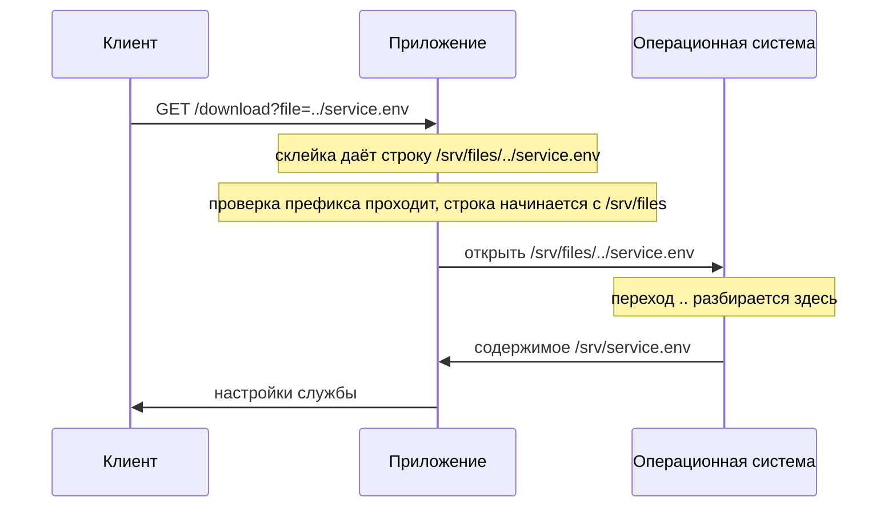
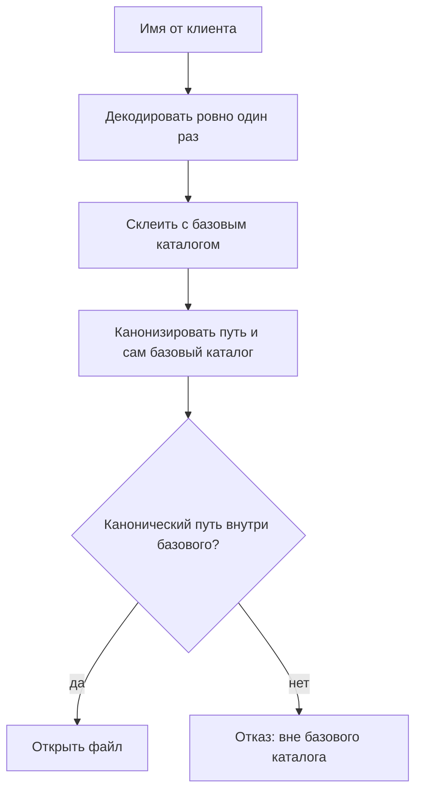

# Path traversal и обходы фильтров пути

В кабинете биллинга есть раздел счетов: приложение складывает выставленные
счета в один каталог на диске и отдаёт файл по имени из запроса. Отдавать
приложению можно только из этого каталога, и дальше он называется базовым,
или каталогом выдачи. Пользователь `anna` просит свой счёт, и в адресе видно,
как его зовут: `?file=invoice-2026-01.txt`. Из любопытства она подставляет
вместо имени `../service.env` и в ответ получает настройки самой службы, а в
них — токен доступа к соседней системе.

Две точки в таком имени — не буквы, а команда: на языке путей файловой
системы `..` означает «поднимись в родительский каталог». Это как фраза
«выйди из комнаты в коридор и зайди в соседнюю дверь»: комната — каталог
выдачи, коридор — уровень выше, соседняя дверь — чужой файл. Служба послушно
вышла из своего каталога и открыла его.

Функция, которая пропустила такое имя, умещается в пять строк. Переменная
`base` в ней — путь к каталогу выдачи. Найдите ошибку до разбора:

```python
# УЯЗВИМО — демонстрация, не для продакшена
def read_document(name):
    path = os.path.join(base, name)
    if not path.startswith(base):
        raise PermissionError("вне базового каталога")
    return open(path, encoding="utf-8").read()
```

Разработчик о выходе за каталог подумал. Перед открытием имя склеивается с
базовым каталогом, то есть соединяется с ним в одну строку пути, и результат
сверяется с этим каталогом. Прогон из лабы этой темы показывает, чего такая
сверка стоит:

```text
$ python hack.py
  опыт 1 — ../service.env: ПРОЧИТАН SERVICE_API_TOKEN=...
```

Клиент прислал именем файла `../service.env`, и настройки службы ушли наружу.
Склеенная строка и правда начинается с базового каталога, поэтому проверка
её пропускает. А переход вверх из этой строки разбирает уже не приложение,
а операционная система, и делает это в момент открытия файла. Проверка
смотрела не на тот путь.

Такой дефект называется path traversal, обходом пути: присланное имя выводит
чтение за пределы каталога, отведённого приложением. Рабочая часть атаки —
переход `..`, повторённый столько раз, сколько нужно, чтобы подняться
наверх. Дефект рождается не из склейки самой по себе, а из порядка операций:
путь сверили с разрешённым каталогом раньше, чем привели к окончательному
виду. Дальше разберём, почему три похожие операции над путём делают разное,
как обходят фильтры на точки, префикс и расширение и какая мера закрывает
класс целиком.

Границы темы. Загрузка файлов — тот же путь, но на запись — ждёт вас в теме
`file-upload`. То, что этим дефектом читают, — конфиги, ключи, исходники —
разберёт тема `source-config-exposure`. Сообщение об ошибке как подсказку о
строении файловой системы разберёт `information-disclosure`. А почему фильтр
по подстроке проигрывает в общем виде, вы уже видели в теме
`filter-and-waf-bypass`. Здесь они не повторяются.

**Зачем это в работе AppSec-инженера.** Такой код писали и вы: счёт в личном
кабинете, вложение в тикете, отчёт по номеру — всё это файл по имени из
запроса. Вопрос к каждому такому месту один: что сверяется с базовым
каталогом, присланная строка или путь, который в итоге откроется. Ответ
читается по двум-трём строкам кода, а цена ошибки — доступ к тому, к чему
доступа не выдавали.

## Подумай, прежде чем читать

1. Приложение склеивает каталог `/var/www/files` с именем файла от клиента
   штатной функцией языка. Защищает ли эта функция от выхода за каталог?
2. Перед открытием файла код проверяет, что собранный путь начинается с
   `/var/www/files`. Достаточно ли этого?
3. Фильтр вырезает из имени файла все вхождения `../`. Что он пропустит?

Ответы приходят по ходу чтения, а в конце темы те же вопросы встретятся
снова — уже как проверка.

## Как это работает

**Откуда это взялось.** Файловая система старше веба, и переход к
родительскому каталогу существовал в ней задолго до первого обработчика
HTTP. Когда приложение стало отдавать файлы по имени из запроса, два мира
встретились. Имя из запроса — строка, которую выбирает клиент. Путь в
файловой системе — язык, в котором две точки означают команду «поднимись на
уровень выше». Приложение подставляет строку в язык, не проверив, нет ли в
ней команд этого языка. Дефект того же рода, что SQL-инъекция из темы
`sqli-basics`, только интерпретатор здесь — не база данных, а операционная
система.

Где сравнение ломается. У запроса к базе есть параметризация, приём,
который отделяет данные от команд, — её разбирает тема
`parameterized-queries`. У пути такого приёма нет: любая строка с точками
остаётся командой. Остаются два приёма: канонизация, то есть приведение
пути к окончательному виду с опросом файловой системы, и сверка результата
с разрешённым каталогом. Как они работают, видно ниже.

### Как имя файла попадает в путь

Схема одинакова почти везде. Приложение держит базовый каталог, куда сложены
файлы, и получает от клиента имя. Дальше оно склеивает одно с другим и
открывает результат. В запросе имя выглядит как параметр — `?file=report.pdf`,
сегмент адреса `/download/report.pdf`, поле формы, значение cookie. WSTG,
руководство OWASP по тестированию, требует начинать проверку с перечисления
таких точек. Годится всё, что попадает в имя файла, а не только параметр,
названный словом `file`.

Опасность появляется от того, что имя не обязано быть именем. Клиент вправе
прислать любую строку, и строка `../../etc/passwd` для приложения выглядит
таким же именем, как `report.pdf`. Для склейки все строки равны.

### Три операции над путём

Три операции над путями называют похоже, а делают разное, и разница между
ними — центр темы. Разберём каждую на одном базовом каталоге. Стенд на
Python 3.14.7 показывает первые две:

```text
$ python e01-join.py
BASE = /var/www/files

присланное имя      | join                            | normpath
--------------------|---------------------------------|-------------------
report.pdf          | /var/www/files/report.pdf       | /var/www/files/...
../../etc/passwd    | /var/www/files/../../etc/passwd | /var/etc/passwd
/etc/passwd         | /etc/passwd                     | /etc/passwd
subdir/../report.pdf| /var/www/files/subdir/../rep... | /var/www/files/...
```

Длинные значения в таблице усечены по ширине стенда: `...` на конце значит
продолжение пути, а не переход вверх.

**Склейка** соединяет части через разделитель и на этом останавливается.
Строка `/var/www/files/../../etc/passwd` — законный результат склейки:
функция не обязана понимать, что в ней написано. Документация `os.path`
описывает и вторую тонкость, которая читается в третьей строке таблицы:
если второй аргумент — абсолютный путь, все предыдущие отбрасываются
целиком. Склеили базовый каталог с именем от пользователя, а получили
`/etc/passwd`, и базового каталога в результате нет вовсе.

**Нормализация** сокращает путь по правилам записи: убирает `.`, схлопывает
`..` с предыдущим сегментом, чистит повторные разделители. Это операция над
строкой, файловую систему она не спрашивает. Во второй строке таблицы она
честно убирает переходы: `/var/www/files/../../etc/passwd` превращается в
`/var/etc/passwd`. Путь стал короче и по-прежнему ведёт наружу:
нормализация не знает, где граница разрешённого.

**Канонизация** делает то же и вдобавок разворачивает символические ссылки.
Символическая ссылка — файл-указатель: внутри него записан путь к другому
файлу, и операционная система при открытии переходит по нему сама. Бытовой
аналог — ярлык на рабочем столе: значок лежит на столе, а программа — в
другой папке. Где аналогия ломается: ярлык читает только проводник, а ссылку
разворачивает сама система при любом обращении, поэтому программа подмены не
замечает. Канонизация обращается к файловой системе и возвращает путь,
который откроется на самом деле.

Различие трёх операций важно на практике. Нормализация не знает, что
`notes.txt` внутри каталога выдачи — ссылка на файл снаружи, а канонизация
знает. Склейка не знает и этого, потому что не знает ничего: её дело —
соединить строки.

А кто и когда разбирает переходы вверх, видно по пути запроса целиком:



**Описание схемы.** Схема читается сверху вниз и показывает, кто что делает
с именем `../service.env`. Приложение склеивает имя с базовым каталогом и
сверяет строку: та начинается с `/srv/files`, и проверка пропускает. Переход
вверх в приложении никто не разбирал — его раскрывает операционная система
при открытии, и открывается файл уровнем выше.

### Четыре фильтра и как их обходят

Разработчик, услышавший про `..`, чаще всего пишет фильтр. Стенд ставит на
настоящем каталоге четыре таких защиты по очереди и пробует пройти каждую.
Секрет лежит рядом с базовым каталогом, а не внутри:

```text
$ python e02-bypass.py
без фильтра, ../           -> ПРОЧИТАН: DB_PASSWORD=hunter2
вырезаем ../ один раз      -> отказ: FileNotFoundError
вырезаем ../, вложенно     -> ПРОЧИТАН: DB_PASSWORD=hunter2
декодируем, %2e%2e%2f      -> ПРОЧИТАН: DB_PASSWORD=hunter2
декодируем, двойное        -> отказ: FileNotFoundError
требуем префикс BASE       -> ПРОЧИТАН: DB_PASSWORD=hunter2
требуем префикс, абс.      -> отказ: префикс
требуем .pdf               -> отказ: расширение
требуем .pdf, нуль-байт    -> отказ: ValueError
```

Читается таблица по строкам, и каждая строка — отдельный урок.

**Вырезание подстроки бьётся вложенностью.** Фильтр, убирающий `../` одним
проходом, останавливает прямую попытку — вторая строка таблицы. Строка
`....//` его проходит: после удаления `../` из середины остаётся ровно `../`.
Приём общий для всех однопроходных замен — фильтр сам собирает из обрезков
то, что искал.

**Кодирование переносит точки мимо текстового фильтра.** Последовательность
`%2e%2e%2f` — это `../`, записанное процентным кодированием: `%2e` — точка,
`%2f` — слеш, сам приём разобран в теме `url-and-encoding`. Фильтр, который
ищет точки в исходной строке, их не находит, а декодирование ниже по цепочке
возвращает переход вверх. Порядок решает и здесь: проверять надо после
декодирования, а не до.

**Двойное кодирование срабатывает не всегда, а ровно там, где декодируют
дважды.** Строка `%252e%252e%252f` — то же кодирование, применённое дважды:
`%25` раскодируется в знак `%`, и после одного прохода получается
`%2e%2e%2f`. Это текст, а не переход, поэтому пятая строка таблицы — отказ.
Второй проход превращает её в `../`. Отсюда точное условие: двойное
кодирование работает, когда в цепочке два декодирующих узла, а проверка
стоит между ними. Стандарт ASVS, по которому сверяют требования к
приложению, требует обратного порядка прямо (v5.0-1.1.1). Декодировать в
канонический вид положено ровно один раз и до дальнейшей обработки, а не
после проверки.

**Требование расширения останавливает вектор, но не закрывает класс.**
Восьмая строка таблицы — отказ: имя `../secret.conf` не оканчивается на
`.pdf`. Защита работает ровно до тех пор, пока за каталогом нет ничего с
нужным расширением, а бэкапы и выгрузки такое расширение носят охотно. Кроме
того, требование к расширению ничего не говорит о каталоге: файл `.pdf`
этажом выше проверку пройдёт.

**Нуль-байт в этой связке больше не работает.** Нуль-байт — байт со
значением ноль, и в языке C он означает конец строки. Когда-то им обрезали
обязательное расширение: проверка видела хвост `.pdf`, а открытие
останавливалось на нулевом байте. В стенде приём даёт `ValueError`: Python
отказывается открывать путь с нулевым байтом внутри. Строку с `\x00` стоит
считать признаком попытки, а не рабочим вектором на этой платформе.

### Проверка не там, где нужно

Шестая строка таблицы — главная в теме и выглядит противоречиво: защита
объявлена, а файл прочитан. Разбор на третьем стенде:

```text
$ python e03-defense.py
join             /tmp/e03/www/files/../../secret.conf
startswith(base) True   <- пропускает
realpath         /tmp/e03/secret.conf
startswith(base) False  <- ловит
```

Обе строки проверяют одно и то же условие и дают разные ответы, потому что
проверяют разные пути. Первая смотрит на склеенную строку: она начинается с
базового каталога, и условие выполнено. Вторая смотрит на канонический путь,
на то, что откроется, — и условие нарушено. Между ними лежит вся тема.

Заодно объясняется седьмая строка предыдущей таблицы, где абсолютный путь
получил отказ. Склейка с абсолютным путём отбрасывает базовый каталог,
результат перестаёт с него начинаться, и проверка префикса срабатывает.
Проверка не бесполезна целиком: она ловит один вектор из двух и пропускает
второй, а это худший вид защиты — такой, что даёт уверенность.

### Ссылка наружу и сосед по префиксу

Канонизация закрывает и то, чего нормализация не видит. Стенд кладёт внутрь
каталога выдачи символическую ссылку на файл снаружи:

```text
base/link.pdf -> /tmp/e03/secret.conf
без realpath:  startswith(base) = True
safe_serve:    отказ: вне базового каталога
```

Имя `link.pdf` не содержит ни точек, ни переходов вверх. Любой фильтр по
подстроке его пропустит, и нормализация тоже: с точки зрения записи путь
лежит внутри. Наружу ведёт сама файловая система, и увидеть это можно,
только спросив её. Для этой формы в CWE, общем реестре видов дефектов, есть
отдельный номер: CWE-59, следование по ссылке до обращения к файлу.

Последняя ловушка — в самом сравнении. Проверка «путь начинается с базового
каталога» верна как фраза и неверна как код:

```text
$ python e04-prefix.py
путь                      startswith  commonpath  is_relative_to
/var/www/files/a.pdf      True        True        True
/var/www/files-old/a.pdf  True        False       False
/var/www/filesecret       True        False       False
```

Каталог-сосед с общим началом имени проходит сравнение по строке и не
проходит сравнение по сегментам пути. Строковый приём не различает
`/var/www/files` и `/var/www/files-old`: начало совпало, а каталог другой.
Сравнение по сегментам делают `commonpath` и `is_relative_to`: оба понимают
разделители. Сравнивать пути надо такими приёмами, а не оператором для
строк.

## Как это атакуют

Стенд — лаба этой темы (`pilot/lab/path-traversal`). Служба отдаёт клиенту
счета из каталога выдачи, имя файла приходит от клиента. О выходе за каталог
разработчик подумал: перед открытием стоит проверка префикса. Стоит она до
канонизации.

```text
$ python hack.py
  опыт 1 — ../service.env: ПРОЧИТАН SERVICE_API_TOKEN=...
  опыт 2 — archive/../../service.env: ПРОЧИТАН SERVICE_API_TOKEN=...
  опыт 3 — notes.txt (ссылка наружу): ПРОЧИТАН SERVICE_API_TOKEN=...
  опыт 4 — контроль, законный invoice-2026-01.txt: отдан
```

Опыт 1 поднимается на уровень вверх из корня выдачи и читает файл настроек
службы. Проверка префикса пропускает: склеенная строка начинается с каталога
выдачи.

Опыт 2 делает то же из законного подкаталога. Разница не косметическая: в
приложении, где подкаталоги разрешены штатно, атакующему не нужно угадывать
глубину — он спускается по разрешённому пути и поднимается оттуда.

Опыт 3 не содержит перехода вверх вовсе. Наружу выводит символическая
ссылка, лежащая внутри каталога выдачи. Фильтр по подстроке против неё
бессилен.

Опыт 4 — контроль на живучесть. Законная выдача обязана работать и после
починки, иначе починкой это назвать нельзя.

Тяжесть решает то, что именно прочитано, а не сам факт чтения. Файл настроек
службы несёт учётные данные к соседним системам, и утечка одного такого
файла превращает чтение файла в доступ к базе. Тем же дефектом читают
исходный код, ключи и файлы окружения — это предмет темы
`source-config-exposure`. Запись за каталог опаснее чтения: подмена файла,
который приложение исполняет или разбирает, переводит дефект в выполнение
кода.

## Как это выглядит в коде

Ревьюер смотрит на одно место: путь, собранный из внешнего значения, и
порядок операций вокруг него. Модуль `sandbox` здесь из лабы: он ставит
дерево каталогов во временном каталоге и возвращает путь к каталогу выдачи.
Ответьте сами: в какой строке здесь ошибка?

```python
# УЯЗВИМО — демонстрация, не для продакшена
def read_document(name):
    base = str(sandbox.base())
    path = os.path.join(base, name)
    if not path.startswith(base):     # проверка ДО канонизации пути
        raise PermissionError("вне базового каталога")
    with open(path, encoding="utf-8") as f:
        return f.read()
```

Признак дефекта — сверка с базовым каталогом раньше, чем путь приведён к
каноническому виду. Ещё один признак, более грубый, — отсутствие сверки
вовсе: склеили и открыли. Листинг показывает правило темы в миниатюре:
объект проверки — не присланная строка, а путь, который откроется. Вопрос на
применение: проверка стоит после `normpath`, но до `realpath` — класс закрыт
или нет?

**Тот же дефект на другом стеке.** На Node.js та же ошибка с другими именами
функций — убедитесь, что находите её и здесь:

```javascript
// ФРАГМЕНТ — срез, самостоятельно не компилируется
// УЯЗВИМО — демонстрация, не для продакшена
const p = path.join(BASE, req.query.name);
if (!p.startsWith(BASE)) throw new Error("вне каталога");
return fs.readFileSync(p, "utf8");
```

Инвариант здесь — «сверка пути стоит раньше его канонизации». Декорация —
язык, имя функции склейки и способ получить значение из запроса.

**Где ревьюер ошибается.** Наличие вызова нормализации в коде ещё не значит,
что порядок верен: нормализовать можно и после проверки. И обратная ошибка —
считать дефектом любую склейку с внешним значением. Если значение сверено со
списком разрешённых имён до склейки, выйти за каталог нечем. Смотреть надо
на то, откуда берётся имя и что с ним делают до открытия.

## Как защититься

Первый ответ — не брать имя от пользователя вовсе. Стандарт ASVS ставит эту
меру главной: пути для файловых операций строятся из внутренних или
доверенных данных (v5.0-5.3.2). Строгая проверка и очистка применяются лишь
там, где имя от пользователя обойти нельзя. На практике это значит
идентификатор вместо имени: клиент присылает номер документа, приложение
находит по нему настоящее имя в базе и склеивает путь из своего.

Там, где имя всё же приходит извне, порядок операций перевёрнут против
уязвимого кода:

```python
# Исправлено: сначала канонизация, потом сверка.
def read_document(name):
    base = os.path.realpath(str(sandbox.base()))
    path = os.path.realpath(os.path.join(base, name))
    if os.path.commonpath([base, path]) != base:
        raise PermissionError("вне базового каталога")
    with open(path, encoding="utf-8") as f:
        return f.read()
```

Три решения в четырёх строках. Канонизация идёт до сверки, поэтому сверяется
то, что откроется. Канонизируется и базовый каталог: сравнивать канонический
путь с неканоническим основанием бессмысленно, если в самом основании есть
ссылка. Сравнение идёт по сегментам пути, а не по началу строки, — это
закрывает каталог-сосед из раздела про сравнение.

Функциональность при этом не страдает. Путь `archive/../invoice-2026-02.txt`
остаётся рабочим: канонический вид у него внутри базового каталога, и сверка
его пропускает. Защита отсекает выход, а не точки как таковые.

Правильный порядок целиком выглядит так:



**Описание схемы.** Схема читается сверху вниз и показывает порядок, при
котором сверке верить можно. Сначала имя декодируется один раз, потом
склеивается с базовым каталогом, затем путь приводится к каноническому виду
вместе с самим базовым каталогом. Сверка идёт между двумя каноническими
путями по сегментам: путь внутри открывается, путь снаружи получает отказ.

**Где это не работает.** Канонизация обращается к файловой системе, и между
проверкой и открытием проходит время. Если каталог доступен на запись другим
процессам, ссылку можно подменить в этом промежутке: проверяли один путь, а
открывается уже другой. Это гонка вида «проверка и использование»: между
двумя действиями объект успевают подменить. Закрывается она не канонизацией,
а открытием по дескриптору каталога или запретом на запись в каталог выдачи.
Дескриптор здесь — уже открытый объект у операционной системы, и подменить
путь под ним поздно. Отдельный случай — Windows: там у пути есть формы,
которых нет в POSIX, семействе правил устройства Unix-систем, и правила
сравнения другие.

**Что добавляется поверх.** Список разрешённых имён или расширений сужает
поверхность, но защитой сам по себе не работает — стенд это показал. Права
на каталог выдачи ограничивают ущерб: процесс, которому нечего читать
снаружи, мало что унесёт. Приём с вырезанием подстрок из имени не годится ни
в каком виде: это попытка перечислить плохое там, где надо разрешать
хорошее.

## Как убедиться, что защита работает

Починку проверяют ретестом — повторным прогоном тех же опытов после
исправления — и добавляют то, что обязано работать. Прогон эксплойта против
решения из лабы:

```text
$ LAB_TARGET=solution.py python hack.py
  опыт 1 — ../service.env: отказ (PermissionError)
  опыт 2 — archive/../../service.env: отказ (PermissionError)
  опыт 3 — notes.txt (ссылка наружу): отказ (PermissionError)
  опыт 4 — контроль, законный invoice-2026-01.txt: отдан
```

Три выхода закрыты, законная выдача работает. Функциональность закрывается
тестами, и в лабе их пять. Это документ из каталога выдачи, документ из
подкаталога, путь с `..` внутри каталога, отказ на несуществующем имени и
сбор перечня. Все пять зелёные и на уязвимом коде, и на решении: тема правит
проверку пути, а не поведение службы.

Со стороны чёрного ящика, то есть при проверке извне без чтения кода, WSTG
предлагает двухэтапную процедуру. Сперва перечислить все точки ввода,
попадающие в имя файла. Затем прогнать по каждой набор техник: переходы
вверх, их кодирования, абсолютный путь. Разница между отказом и ответом
«файл не найден» тут содержательна — второй ответ говорит, что путь до
файловой системы дошёл.

**Чеклист для ревью.** Всё сказанное о порядке операций собирается в семь
проверок, каждая смотрит на своё место дефекта:

1. Проверьте, что пути для файловых операций строятся из внутренних или
   доверенных данных, а не из присланного имени (ASVS v5.0-5.3.2).
2. Проверьте, что путь приводится к каноническому виду до сверки с базовым
   каталогом, а не после.
3. Проверьте, что канонический путь сверяется с каноническим базовым
   каталогом по сегментам, а не сравнением начала строки.
4. Проверьте, что декодирование присланного значения выполняется один раз и
   до проверки, а не после неё (ASVS v5.0-1.1.1).
5. Проверьте, что защита не сведена к вырезанию подстрок из имени файла.
6. Проверьте, что символические ссылки внутри каталога выдачи либо
   развёрнуты канонизацией, либо запрещены.
7. Проверьте, что каталог выдачи не даёт процессу прав на чтение и запись за
   его пределами.

## Как это находят инструменты

Статический анализ — разбор кода без запуска: инструмент читает текст
программы и ищет в нём фрагменты по правилам. Правило этой темы написано на
порядок операций: путь собран склейкой и открыт, а канонизации между ними
нет.

Правило целиком — в `pilot/semgrep/path-join-user-input.yaml`, написано для
Semgrep, инструмента статического анализа, который ищет фрагменты кода по
шаблону. Уровень находки — `ERROR`: это важность того, что нашлось. Уверенность
правила — `MEDIUM`: это мера того, насколько форма кода наверняка означает
дефект. Сверено прогоном: на
уязвимом файле лабы одна находка, на решении — ноль, на четырёх размеченных
тест-кейсах расхождений нет.

**Чего это правило не ищет.** Оно судит по форме кода, а не по происхождению
имени. Откуда пришло значение — из запроса или из постоянной в модуле, —
правило не знает. Это видно в тест-кейсах: склейка с литералом `index.txt`
помечена находкой, хотя внешнего значения там нет. Разбор происхождения
требует анализа потока данных — отслеживания, откуда значение пришло, — а
такой анализ на длине этого правила не умещается.

**Что правило пропустит.** Канонизацию, выполненную после сверки: обе
операции в коде есть, порядок неверен, а по форме вызовов это не отличить.
Пропустит и другие способы открыть файл — чтение через библиотеку, отдачу
штатным средством фреймворка, распаковку архива.

**Что здесь сильнее автоматики.** Вопрос «откуда берётся имя» решается
чтением одного маршрута и не решается формой вызова. Правило годится как
сеть на типовую форму, а вывод о дефекте делает человек.

## Частая ошибка

Часто слышно: штатная функция склейки путей для того и сделана, чтобы
собирать пути безопасно, — она сама разберётся с лишними точками. Правда ли
это? Решите, не заглядывая в опровержение.

**Склейка не проверяет и не сокращает ничего; с абсолютным путём она ещё и
отбрасывает базовый каталог.** Документация `os.path` говорит об этом прямо,
и стенд это воспроизводит: склейка с именем `/etc/passwd` возвращает
`/etc/passwd` целиком, без всякого следа базового каталога. Функция сделана,
чтобы собирать пути правильно с точки зрения синтаксиса, а не чтобы
удерживать результат внутри каталога.

Заблуждение держится на слове «безопасно», которого в описании функции нет.
Склейка решает задачу переносимости: не заботиться о разделителе и о том,
сколько их подряд. Задачу удержания в границах она не решала никогда, и ни
одна документация этого не обещает. Проверка границ остаётся на вызывающем
коде.

Второй вид той же ловушки — «мы вырезаем `../`». Контрпример из прогона:
строка `....//` после вырезания `../` превращается ровно в `../` и читает
файл снаружи. Фильтр собрал вектор своими руками.

## Попробуй сам

`lab-path-traversal`, каталог `pilot/lab/path-traversal`. Формат «почини»:
правится `code.py`, пока `hack.py` и `tests.py` не станут зелёными
одновременно.

**Цель одной фразой:** добиться, чтобы `hack.py` вышел с кодом 0, а
`tests.py` продолжил выходить с кодом 0.

Всё локально: сети нет, дерево каталогов ставится во временном каталоге.

Подсказка одна: проверка в уязвимом коде не лишняя, она стоит не в том
порядке. Сверять надо тот путь, который в итоге откроется, а не присланную
строку, — и сравнивать его по сегментам, а не по началу строки.

**Отдельная задача «почини».** Закрыть три выхода — переход вверх из корня
выдачи, переход вверх из подкаталога и символическую ссылку наружу, — не
сломав путь `archive/../invoice-2026-02.txt`, который законен. Решение — в
`solution.py`, открывается после своей попытки.

## Проверь себя

1. Проверку переписали: нормализация пути через `normpath` стоит до сверки,
   сравнение идёт по сегментам:

   ```python
   def read_document(name):
       base = os.path.realpath("/srv/files")
       path = os.path.normpath(os.path.join(base, name))
       if os.path.commonpath([base, path]) != base:
           raise PermissionError("вне базового каталога")
       return open(path, encoding="utf-8").read()
   ```

   Класс закрыт? Подсказка: в каталоге выдачи лежит `notes.txt` —
   символическая ссылка наружу.

2. Функция из введения проверяет склеенную строку до её приведения:

   ```python
   def read_document(name):
       path = os.path.join(base, name)
       if not path.startswith(base):
           raise PermissionError("вне базового каталога")
       return open(path, encoding="utf-8").read()
   ```

   Какую починку вы выберете?

   А. Вырезать из имени все вхождения `../` до склейки.

   Б. Привести путь к каноническому виду через `realpath`, канонизировать и
      базовый каталог, а сверять по сегментам через `commonpath`.

   В. Требовать, чтобы присланное имя оканчивалось на разрешённое
      расширение, например `.pdf`.

3. Почему проверка «собранный путь начинается с базового каталога»
   пропускает переход вверх, но ловит абсолютный путь?
4. Предскажите, что напечатает этот фрагмент, — какие два предвопроса темы
   он закрывает разом?

   ```python
   import os
   base = "/var/www/files"
   print(os.path.join(base, "/etc/passwd"))
   name = "....//secret.conf"
   print(name.replace("../", ""))
   ```

5. Возврат к теме `url-and-encoding`: почему проверку надо ставить после
   декодирования, а декодировать ровно один раз?
6. Возврат к теме `http-basics`: какие части запроса, кроме параметра
   запроса, стоит перечислить как точки ввода имени файла?

<details markdown="1">
<summary>Ответ 1</summary>

1. Нет: `normpath` работает со строкой и файловую систему не спрашивает, а
   наружу здесь ведёт не запись, а ссылка. Имя `notes.txt` не содержит ни
   точек, ни переходов, нормализованный путь лежит внутри каталога — и файл
   откроется снаружи. Этот вектор видит только канонизация: `realpath`
   разворачивает символические ссылки, обращаясь к файловой системе. Правило
   темы: сверяется то, что в итоге откроется, а не то, как записан путь.

</details>

<details markdown="1">
<summary>Ответ 2: разбор вариантов</summary>

2. Верный ответ — Б.

   А. Однопроходное вырезание обходится вложенностью: строка `....//` после
      удаления `../` из середины превращается ровно в `../` — фильтр сам
      собирает искомое из обрезков. Это перечисление плохого там, где надо
      разрешать хорошее.

   Б. Сверяется канонический путь — то, что откроется на самом деле, — и
      сверяется по сегментам, поэтому не проходит ни переход вверх, ни
      ссылка наружу, ни каталог-сосед `/var/www/files-old`. Прогон
      `LAB_TARGET=solution.py python3 hack.py` в `pilot/lab/path-traversal`
      даёт отказ на всех трёх опытах и отдаёт законный файл.

   В. Требование расширения останавливает вектор и не закрывает класс: файл
      с нужным расширением этажом выше проверку пройдёт, а бэкапы и выгрузки
      такое расширение носят охотно. Про каталог оно не говорит ничего.

</details>

<details markdown="1">
<summary>Ответ 3</summary>

3. Строка `база/../../файл` начинается с базового каталога, и проверка её
   пропускает, а переходы вверх разбирает уже операционная система при
   открытии. Абсолютный путь при склейке отбрасывает базовый каталог,
   результат перестаёт с него начинаться — и та же проверка срабатывает.
   Проверка ловит один вектор из двух и пропускает второй — худший вид
   защиты: дающий уверенность.

</details>

<details markdown="1">
<summary>Ответ 4</summary>

4. `/etc/passwd` и `../secret.conf`. Первая строка: склейка с абсолютным
   путём отбрасывает базовый каталог целиком — штатная функция собирает пути
   правильно по синтаксису и границы не удерживает. Вторая: вырезание `../`
   из вложенной записи собирает ровно ту последовательность, которую искало.
   Проверяется прогоном файла `predict.py` с этим кодом:

   ```bash
   python3 predict.py
   ```

   ```text
   /etc/passwd
   ../secret.conf
   ```

   Это и есть ответы на два предвопроса разом: штатная склейка от выхода за
   каталог не защищает, а фильтр вырезанием пропускает вложенную запись.

</details>

<details markdown="1">
<summary>Ответ 5</summary>

5. Проверка до декодирования смотрит не на то значение, которое дойдёт до
   файловой системы: `%2e%2e%2f` для неё не содержит точек. Декодирование
   больше одного раза открывает двойное кодирование, поэтому раскодировать
   нужно один раз и до проверки.

</details>

<details markdown="1">
<summary>Ответ 6</summary>

6. Всё, что попадает в имя файла: сегменты пути адреса, значения cookie,
   поля формы и загружаемого тела, а также заголовки, если приложение берёт
   имя оттуда.

</details>

## Источники

1. PortSwigger Web Security Academy, «Path traversal»; реестр
   `ps-path-traversal`. Разделы: чтение произвольных файлов, обходы фильтров
   (вложенные последовательности, абсолютный путь, двойное кодирование,
   обязательный префикс, обязательное расширение), How to prevent.
   <https://portswigger.net/web-security/file-path-traversal>
2. OWASP WSTG v4.2, «WSTG-ATHZ-01 — Testing Directory Traversal File
   Include»; реестр `wstg-v42-athz-01-directory-traversal`. Разделы:
   перечисление точек ввода, техники обхода, процедура ретеста.
   <https://owasp.org/www-project-web-security-testing-guide/v42/4-Web_Application_Security_Testing/05-Authorization_Testing/01-Testing_Directory_Traversal_File_Include>
3. Документация Python, «os.path — Common pathname manipulations»; реестр
   `python-os-path`. Разделы: `join` и поведение с абсолютным аргументом,
   `normpath`, `realpath`, `commonpath`.
   <https://docs.python.org/3/library/os.path.html>

Каркас этапа: `owasp-asvs-5-document` (ASVS v5.0.0), `owasp-wstg-42`,
`owasp-top10-2025`. Наследуются всеми темами и отдельной строкой не
повторяются.

**Скоропортящийся слой.** Поведение с нулевым байтом привязано к версии
среды: на Python 3.14 путь с `\x00` отвергается, на других платформах и в
других языках приём мог сохраниться. Правила сравнения путей на Windows
отличаются от POSIX, и приведённые сравнения проверены только на POSIX.

**Маркеры уверенности.** Поведение склейки, нормализации и канонизации,
обходы четырёх наивных фильтров, разница проверки префикса до и после
канонизации, символическая ссылка изнутри наружу и ловушка сравнения по
началу строки — **проверено лично** 2026-08-24 на Python 3.14.7 (стенды
`e01-join.py`, `e02-bypass.py`, `e03-defense.py`, `e04-prefix.py` и
`hack.py` лабы): склейка с абсолютным путём отбрасывает базовый каталог;
`....//` проходит однопроходное вырезание; `%2e%2e%2f` проходит при одном
декодировании, `%252e%252e%252f` — при двух; проверка префикса до
канонизации пропускает переход вверх и ловит абсолютный путь; путь с нулевым
байтом даёт `ValueError`. Прогоны лабы, сверка правила статического анализа
и факты про склейку с абсолютным путём, вложенное вырезание, нормализацию,
сравнение по сегментам и нулевой байт повторены **проверено лично**
2026-10-03 на той же версии: `hack.py` читает файл снаружи в трёх опытах из
трёх на `code.py` и получает отказ на всех трёх на `solution.py`, пять
тестов функциональности зелёные в обоих случаях, правило даёт одну находку
на уязвимом файле и ноль на решении. Листинг из вопроса 4 прогнан
2026-10-03, вывод совпал дословно. Требования к построению путей и к
однократному декодированию — **по документации** (ASVS v5.0.0, открыт лично
2026-08-24). Процедура ретеста и перечень точек ввода — **по документации**
(WSTG-ATHZ-01, открыт лично 2026-08-24). Поведение Node-стека и правила
сравнения путей на Windows **не воспроизводились**: листинг показывает форму
дефекта, а не прогон.
