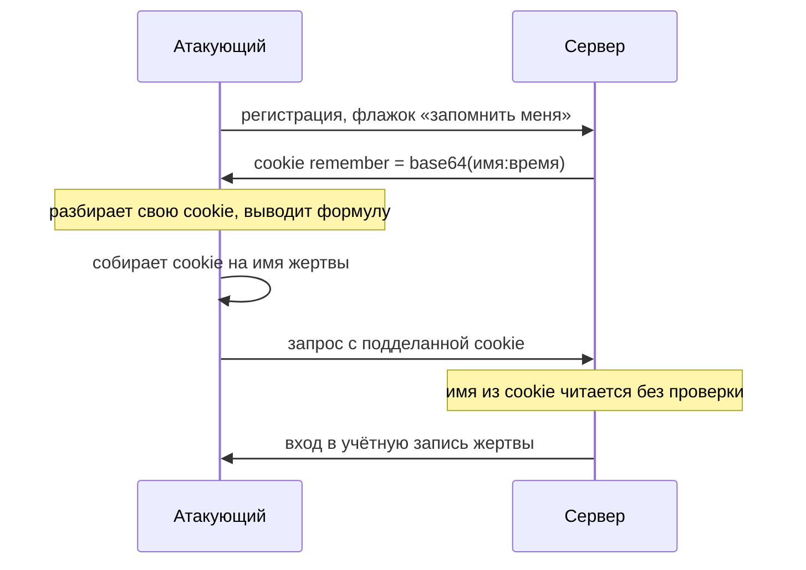
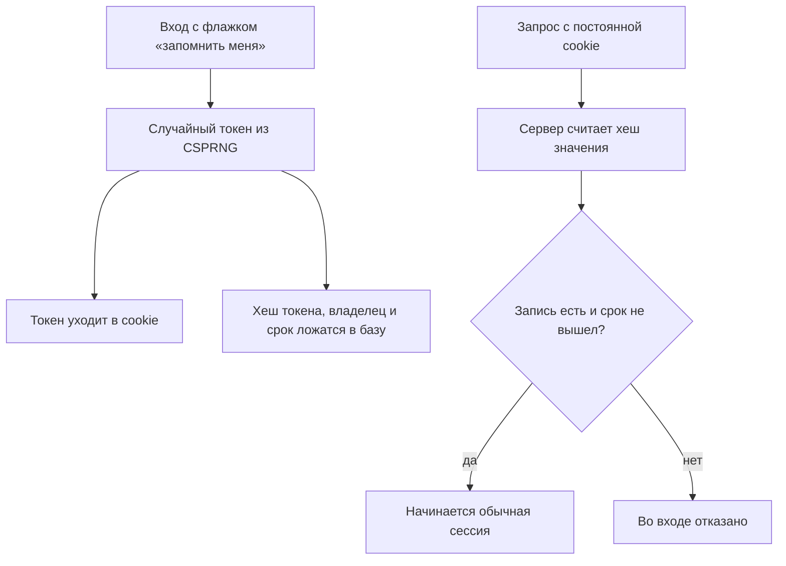

# «Запомнить меня» и постоянные токены

Под формой входа почти в каждом приложении с длинной сессией есть флажок
«запомнить меня». Ставите его в почте на домашнем ноутбуке, закрываете
браузер, возвращаетесь через неделю — и почта открывается уже вошедшей.
Пароль не спросили: за вход ответила постоянная cookie, секрет, который
браузер хранит на диске и предъявляет серверу вместо пароля.

Заведите учётную запись на стенде темы, включите флажок и посмотрите, что
сервер положил в cookie. Там лежит:

```text
remember=YXR0YWNrZXI6MTc4NzUwMDAwMA==
```

Строка похожа на шифр, но это base64: кодировка, которая записывает любые
байты печатными символами по открытой таблице. Как азбука Морзе: таблицу
знают все, секрета в ней нет, и запись читается обратно без ключа. Аналогия
ломается на алфавите: Морзе записывает буквы и цифры, а base64 умеет любые
байты, хоть картинку. Под этой строкой лежат имя пользователя и метка
времени, а значит, чужую такую cookie соберёт любой, кто вывел формулу.

## Как это работает

**Откуда это взялось.** Сессия из темы `sessions-vs-tokens` живёт, пока открыт
браузер: закрыли — и идентификатор пропал. Приложению же нужно узнавать
пользователя неделями, и для этого нужен секрет, который лежит на диске и
переживает закрытие. Так появилась постоянная cookie с токеном. Раз токен
предъявляется вместо пароля и открывает учётную запись целиком, к нему
применимы требования идентификатора сессии. Значение обязано быть
непредсказуемым, привязанным к учётной записи и ограниченным по сроку.

Ломается эта конструкция в одном месте: когда значение собирают из того, что
атакующий знает или умеет вычислить. Академия PortSwigger называет типовую
ошибку: токен собирают из имени пользователя, метки времени, иногда пароля.
Атакующему достаточно завести собственную учётную запись, посмотреть на свою
cookie и вывести правило её сборки. Дальше он применяет это правило к чужим
именам.

### Три способа собрать значение

Разберём три схемы, которые встречаются в приложениях, — от худшей к рабочей.

**Схема «а» — склейка в base64.** Сервер берёт имя пользователя и метку
времени, склеивает их через двоеточие и записывает в base64. Получается строка
вроде той, что в начале темы. Кодировка обратима, и обе части предсказуемы:
имя атакующий знает, метку времени подбирает по дате регистрации. Кто понял
формулу, тот собирает cookie за любого пользователя дословно.

**Схема «б» — хеш без соли.** Здесь в cookie кладут `md5` от имени
пользователя. Хеш-функция — это алгоритм, который необратимо сворачивает
любые данные в строку фиксированной длины: по значению хеша имя обратно не
восстановить. Выглядит надёжно, но у имени маленькое предсказуемое множество
значений. Атакующий берёт словарь типичных имён, считает `md5` от каждого и
сравнивает со своей cookie: совпадение выдаёт формулу. Соль — это случайная
строка, которую подмешивают к значению перед хешированием; у каждого
пользователя она своя, поэтому заранее посчитанная таблица ломается.

Приём называется словарной атакой, а заранее посчитанные таблицы хешей —
радужными; и соль, и таблицы тема `password-storage` дальше по маршруту
разбирает подробно. Заметьте, что здесь произошло: хеш спрятал имя из cookie,
но не убрал формулу. Предсказуемое значение под хешем остаётся предсказуемым.

**Схема «в» — случайный токен.** Рабочая схема не собирает значение из данных
вовсе: сервер берёт случайную строку из криптографически стойкого генератора
случайных чисел (CSPRNG). Такой генератор устроен как лототрон: все
предыдущие числа вы видели, а следующее не предскажете. Отличие от лототрона:
генератор детерминирован, и его выход непредсказуем, только пока никому не
известно зерно, с которого он стартовал. Формулы у такого токена нет, и
проверить его может только сервер, который его выдал. Поэтому сервер держит
запись: хеш токена, владелец и срок.

**Зачем это в работе AppSec-инженера.** Постоянную cookie ревьюят реже
сессионной, хотя весит она столько же: её предъявление обходит вход. Ревьюер
задаёт один вопрос: если завести свою учётную запись и посмотреть на cookie,
виден ли в ней способ собрать чужую. Ответ «да» — находка, и лечится она не
«шифрованием» base64, а случайным значением.

### Пароль в cookie — отдельная беда

Академия называет крайний случай: пароль как часть значения cookie. Даже под
хешем он опасен. Люди выбирают пароли из маленького предсказуемого множества,
и хеши популярных паролей давно посчитаны: готовый хеш ищется в поисковике.
Здесь работает тот же механизм, что в схеме «б», только секрет уехал с
сервера на клиент. Украденную базу хешей взламывают офлайн, сервера это не
касается; пароль в cookie отдаёт секрет каждому, кто добрался до диска или
трафика пользователя.

## Как это атакуют

Атака начинается с легального шага: у атакующего есть собственная учётная
запись. Дальше он действует так:

1. Заводит свою учётную запись и включает «запомнить меня».
2. Читает собственную постоянную cookie и понимает, как собрано значение.
3. Подставляет в формулу имя жертвы и собирает её cookie.
4. Подставляет собранную cookie в браузер, и сервер впускает его в чужую
   учётную запись без пароля.

Заметьте, сколько в этой процедуре работы офлайн. Разбор своей cookie и
сборка чужой сервера не касаются: ни одного подозрительного запроса, кроме
финального входа. В журналах такая атака не выглядит перебором.

Прогон на стенде темы (`.smgr/appsec-stage1-auth/exp/e05-remember.py`,
Python 3.14.7) проверяет все три схемы:

```text
а) склейка: своя cookie YXR0YWNrZXI6MTc4NzUwMDAwMA==
   разбирается как 'attacker:1787500000'
   собранная для жертвы совпала с настоящей: ДА
б) MD5 без соли: cookie жертвы найдена словарём из 5 имён: ДА → anna
в) случайный токен: формулы нет; на сервере лежит хеш токена, не сам токен
```

По схеме «а» cookie жертвы собралась совпадающей с настоящей: имя и время
прочитались из собственной cookie атакующего, и осталось подставить `anna`.
Метка времени здесь одна на всех: стенд создаёт учётные записи в одном
прогоне. В живом приложении метку жертвы подбирают по дате регистрации, как
сказано в схеме «а», — формулу это не меняет. По схеме «б» хватило словаря из
пяти имён: `md5` от `anna` совпал с cookie жертвы. Схема «в» не поддалась:
формулы нет, а на сервере лежит хеш токена, не сам токен.



**Описание схемы.** Атакующий общается с сервером дважды: сначала как
легальный пользователь и получает свою cookie, затем как носитель
подделанной. Между запросами он работает офлайн: разбор своей cookie и сборка
чужой сервера не касаются. На последнем шаге сервер верит имени из cookie,
потому что проверять ему нечего: записи о выданных токенах нет.

> **Предупреждение.** «Зашифровали base64» защиты не даёт: это обратимое
> кодирование, не шифрование. Хеш без соли тоже вскрывается словарём.
> Академия добавляет: перебор такой cookie обходит лимит попыток входа, если
> лимит на угадывание cookie отдельно не наложен. Лимиты из темы
> `brute-force-defense` обычно стоят на форме входа, а угадывание cookie идёт
> мимо неё, обычными запросами к страницам.

## Как это выглядит в коде

Ревьюер ищет, из чего собран токен. Отметьте до чтения выносок, чем здесь
собирают значение и кому доверяет проверка.

```python
# УЯЗВИМО — демонстрация, не для продакшена
def issue_remember(user):
    raw = f"{user}:{int(time.time())}"           # (1)
    token = base64.b64encode(raw.encode())       # (2)
    return set_cookie("remember", token, max_age=YEAR)

def check_remember(cookie):
    user, _ = base64.b64decode(cookie).split(b":")  # (3)
    return login_as(user)
```

1. Значение собрано из имени и времени — оба предсказуемы.
2. base64 — кодирование, не шифрование: разбирается обратно.
3. Проверка доверяет разобранному имени: кто предъявил cookie, тем и входит.

Признаки такие. Токен, собранный из имени, метки времени, счётчика. base64
или иное обратимое кодирование, названное «шифрованием». Хеш без соли от
предсказуемого значения. Пароль в составе cookie. Отсутствие серверной записи
о выданных токенах — а с ней и невозможность отзыва.

## Как защититься

Правило состоит из четырёх частей: значение даёт криптографически стойкий
генератор, смысл токена лежит на сервере, у токена есть срок и его можно
отозвать. К листингу ниже три вопроса: откуда берётся значение, где живёт
смысл токена, что ограничивает его жизнь и даёт отзыв.

```python
# Исправлено.
def issue_remember(user):
    token = secrets.token_urlsafe(32)            # (1)
    REMEMBER[sha256(token)] = {"user": user,     # (2)
                               "exp": now() + 30 * DAY}
    return set_cookie("remember", token, max_age=30 * DAY,
                      http_only=True, secure=True)

def check_remember(cookie):
    rec = REMEMBER.get(sha256(cookie))           # (3)
    if not rec or now() > rec["exp"]:
        return None
    return start_session(rec["user"])            # (4)
```

1. Значение из CSPRNG, ASVS v5.0-7.2.3 требует не менее 128 бит. Формулы в
   таком значении нет.
2. На сервере — хеш токена, владелец и срок. Сам токен в базе не лежит, как и
   пароль: утечка базы не выдаёт действующих токенов.
3. Проверка ищет запись по хешу предъявленного значения. Нет записи — нет
   входа.
4. По токену начинается обычная сессия; правило `session-fixation` о смене
   идентификатора действует и здесь.

Здесь правило читается построчно: случайное значение, серверная запись, срок,
отзыв. Мысленно уберите серверную запись и верните токену самодостаточность:
какое из четырёх требований ломается первым?



**Описание схемы.** Верхняя ветка — выдача: токен уходит пользователю, а на
сервере остаются только его хеш, владелец и срок. Нижняя ветка — проверка: по
предъявленной cookie считается хеш, и вход даёт только живая запись. Удаление
записи — это и есть отзыв: токен на руках остаётся, но перестаёт работать.

**Что ставится рядом.** Атрибуты cookie из темы `cookies`: `HttpOnly`, чтобы
XSS не прочитал токен, `Secure` и, где применимо, префикс `__Host-`. Отзыв:
запись на сервере позволяет погасить токен при смене пароля или по кнопке
«выйти на всех устройствах». И отдельный лимит на угадывание самого токена по
правилам темы `brute-force-defense`: иначе перебор cookie обходит лимит
входа.

**Как проверить починку.** Повторите атаку из раздела «Как это атакуют» на
исправленном приложении. Заведите свою учётную запись, включите флажок и
прочитайте свою cookie: в ней должна быть случайная строка, без имени и
времени. Потом смените пароль и убедитесь, что старая cookie перестала
работать, — это проверка отзыва. И последнее: соберите по старой формуле
cookie на другое имя и проверьте, что сервер её отклоняет.

## Частая ошибка

Ответьте до чтения дальше: если значение постоянной cookie «зашифровано»,
подделать его нельзя?

Вывод привязан к одному слову: cookie «зашифрована», значит, подделать её
нельзя. За словом при этом обычно стоит base64 или хеш без соли — то есть не
шифрование вовсе.

**base64 — не шифрование, а хеш без соли перебирается.** Обратимое кодирование
читается обратно любым, у кого есть таблица, а таблица открыта. Хеш без соли
от предсказуемого значения вскрывается словарём. И то и другое даёт формулу,
по которой собирают чужие токены. Ошибка здесь терминологическая:
необратимость присвоена слову «шифрование», а словом названо обратимое
кодирование. Свойство от переименования не появилось.

Контрпример из прогона. Cookie-склейка `attacker:1787500000` в base64
разобралась дословно, и токен для `anna` собрался совпадающим с настоящим
(схема «а»). «Шифрования» здесь не было вовсе — было переименованное
кодирование.

## Чеклист для ревью

1. Проверьте, что значение постоянной cookie порождается CSPRNG и не выводится
   из имени, времени или счётчика (ASVS v5.0-7.2.3).
2. Проверьте, что смысл токена лежит на сервере, а не разбирается из самой
   cookie (ASVS v5.0-7.2.1).
3. Проверьте, что cookie не содержит пароль ни в каком виде, включая хеш.
4. Проверьте, что у токена есть срок и его можно отозвать при смене пароля.
5. Проверьте, что cookie несёт `HttpOnly`, `Secure` и, где применимо, префикс
   `__Host-`.
6. Проверьте, что перебор самого токена ограничен, а не только перебор пароля
   на входе (WSTG-v42-ATHN-05).

## Попробуй сам

Возьмите приложение с флажком «запомнить меня»: подойдёт собственный почтовый
ящик или форум, где у вас есть учётная запись. Войдите с флажком, найдите
постоянную cookie и разберите её значение. Хранилище cookie показывает
вкладка Application в инструментах разработчика: тема `cookies` разбирала её
на своём стенде. Попробуйте понять, собрано ли значение из имени, времени или
иного предсказуемого куска.

**Наблюдаемый критерий:** разбор значения cookie с выводом, случайное оно или
выводимое, и ответ, можно ли по своей cookie собрать чужую. Если значение
обратимо кодировано — покажите, во что оно раскрывается.

## Проверь себя

1. «Запомнить меня» выдаёт постоянную cookie так:

   ```python
   def issue_remember(user):
       token = md5(user.encode()).hexdigest()
       return set_cookie("remember", token, max_age=YEAR)
   ```

   Атакующий завёл свою учётную запись и видит свою cookie. Что он сделает
   дальше и почему этот токен не лучше склейки в base64?

2. Схема «а» из темы собирает токен склейкой имени и времени в base64:

   ```python
   def issue_remember(user):
       raw = f"{user}:{int(time.time())}"
       token = base64.b64encode(raw.encode())
       return set_cookie("remember", token, max_age=YEAR)
   ```

   Какую починку вы выберете?

   A. Заменить base64 на шифрование AES той же склейки: содержимое cookie
      перестанет читаться.

   B. Выдавать случайное значение из CSPRNG, а на сервере хранить его хеш
      вместе с владельцем и сроком.

   C. Заменить склейку на `md5` от имени пользователя: имя в cookie перестанет
      быть видимым.

3. Почему серверная запись о выданных токенах нужна не только для проверки, но
   и для отзыва? Что ломается первым, если токен снова сделать
   самодостаточным?
4. Предскажите, что напечатает этот фрагмент и что из него следует для схемы
   «а».

   ```python
   import base64
   cookie = "YXR0YWNrZXI6MTc4NzUwMDAwMA=="
   print(base64.b64decode(cookie).decode())
   print(base64.b64encode("anna:1787500000".encode()).decode())
   ```

5. Возврат к теме `sessions-vs-tokens`: почему идентификатор сессии не собрать
   из имени пользователя даже через хеш?
6. Возврат к теме `cookies`: какие атрибуты постоянной cookie снимают кражу
   токена через XSS и передачу по открытому каналу?

<details markdown="1">
<summary>Ответ 1</summary>

1. Он посчитает `md5` от словаря имён и найдёт, чьё имя даёт его собственную
   cookie, — подтвердив формулу. Дальше `md5` от имени жертвы становится её
   токеном: вычисляется офлайн, без единого запроса. Это та же словарная
   атака, что вскрывает хеши паролей в теме `password-storage`: хеш без соли
   от предсказуемого значения перебирается заранее. По сравнению со склейкой
   в base64 меняется только то, что формулу сначала угадывают, а не читают
   прямо.

</details>

<details markdown="1">
<summary>Ответ 2: разбор вариантов</summary>

2. Верный ответ — B.

   A. Шифрование скрывает содержимое cookie и не мешает её предъявлению:
      украденная или просроченная cookie работает как рабочая, отозвать её
      нечем — серверной записи нет. «Зашифровано» отвечает на чтение и молчит
      про подмену и отзыв.

   B. Значение не выводится ни из чего известного: 128 бит из CSPRNG перебору
      не поддаются. Серверная запись даёт проверку по хешу, срок и отзыв при
      смене пароля или выходе на всех устройствах.

   C. Хеш без соли от предсказуемого значения вскрывается словарём: имён
      пользователей мало, и `md5` от каждого считается заранее. Читаемость
      имени пропала, формула осталась.

</details>

<details markdown="1">
<summary>Ответ 3</summary>

3. Без записи токен нельзя погасить: он живёт до срока в cookie, и кража
   необратима. Запись позволяет отозвать токен при смене пароля или по кнопке
   «выйти на всех устройствах». Самодостаточный токен ломает первым именно
   отзыв: проверку подпись ещё даёт, срок в значении ещё лежит, а погасить
   выданное уже нечем.

</details>

<details markdown="1">
<summary>Ответ 4</summary>

4. Первая строка печатает `attacker:1787500000`: base64 разбирается обратно
   без всякого ключа, и имя с меткой времени читаются. Вторая печатает
   `YW5uYToxNzg3NTAwMDAw`: по выведенной формуле собрана cookie для `anna`, и
   она совпадёт с той, что выдал бы сервер. Проверка прогоном файла
   `decode.py` с этим кодом:

   ```bash
   python3 decode.py
   ```

   ```text
   attacker:1787500000
   YW5uYToxNzg3NTAwMDAw
   ```

   Вывод для схемы «а»: обратимое кодирование формулу не прячет.

</details>

<details markdown="1">
<summary>Ответ 5</summary>

5. Имя пользователя — из маленького предсказуемого множества, его хеш находят
   словарём. Случайный токен из CSPRNG — из пространства в 128+ бит, перебор
   невозможен независимо от скорости хеша.

</details>

<details markdown="1">
<summary>Ответ 6</summary>

6. `HttpOnly` не даёт скрипту прочитать токен при XSS; `Secure` не пускает
   cookie по открытому HTTP; префикс `__Host-` привязывает её к origin.

</details>

## Источники

1. PortSwigger Web Security Academy, «Vulnerabilities in other authentication
   mechanisms»; реестр `ps-auth-other-mechanisms`. Раздел Keeping users logged
   in (predictable tokens, Base64, unsalted hashes, password in cookie).
   <https://portswigger.net/web-security/authentication/other-mechanisms>
2. OWASP WSTG-ATHN-05 «Testing for Vulnerable Remember Password», WSTG v4.2;
   реестр `wstg-v42-athn-05-remember-password`. Разделы: How to Test,
   Remediation.
   <https://owasp.org/www-project-web-security-testing-guide/v42/4-Web_Application_Security_Testing/04-Authentication_Testing/05-Testing_for_Vulnerable_Remember_Password>
3. OWASP Session Management Cheat Sheet; реестр `owasp-cs-session-management`.
   Разделы: свойства идентификатора сессии, атрибуты cookie, префикс `__Host-`.
   <https://cheatsheetseries.owasp.org/cheatsheets/Session_Management_Cheat_Sheet.html>

Каркас этапа: `owasp-asvs-5-document` (ASVS v5.0.0), `owasp-wstg-42`,
`owasp-top10-2025`; якоря подраздела: `ps-authentication`,
`owasp-cs-authentication`. Наследуются всеми темами и отдельной строкой не
повторяются.

**Скоропортящийся слой.** Срок токена (здесь 30 дней) — параметр приложения, не
норматив. Способы вывода формулы cookie привязаны к тому, как её собирает
конкретный фреймворк; open-source-фреймворк документирует сборку публично.

**Маркеры уверенности.** Вывод формулы по своей cookie для трёх схем (склейка в
base64, `md5` без соли, случайный токен) — **проверено лично** 2026-08-24 на
Python 3.14.7 стендом `e05-remember.py`. Фрагмент из вопроса 4 прогнан локально
2026-10-03, Python 3.14.7; вывод совпал дословно. Типовые ошибки токена, обход
лимита входа перебором cookie, опасность пароля в cookie — **по документации**:
PortSwigger Academy, WSTG v4.2, Session Management Cheat Sheet, ASVS v5.0.0,
открыты лично 2026-08-24. Кража cookie через XSS и поиск хеша пароля в
поисковике **не воспроизводились**: названы по Академии.
