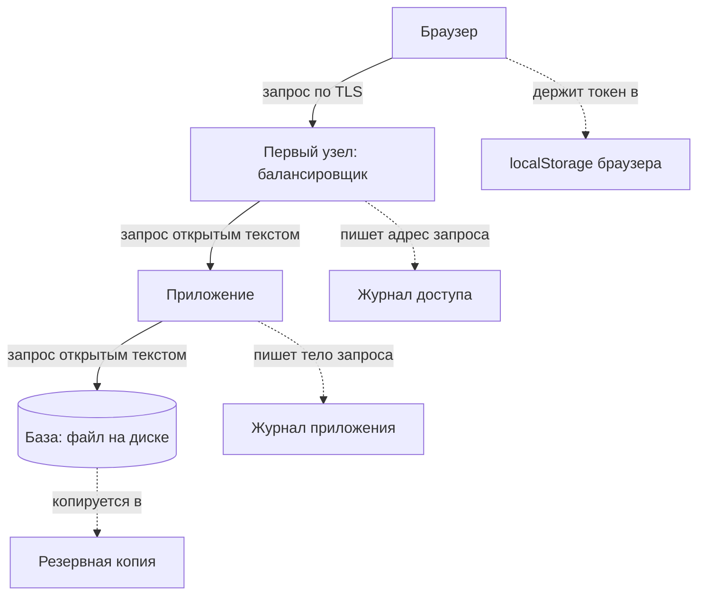

# Данные в открытом виде при передаче и хранении

Стенд этой темы пропускает вход пользователя через промежуточный узел и
спрашивает у узла, что тот прочитал по дороге. Таким узлом в реальной сети
работают прокси, балансировщик или точка доступа в кафе; их устройство
разбирает тема `app-architecture`. Вот что ответил узел.

```bash
python e11-plaintext.py
```

```text
(2) Данные в открытом виде при передаче
  промежуточный узел снял 150 байт
  пароль виден в кадре: True
  прочитано узлом: 'hunter2-correct-horse'
  узел не ломал шифрование: его не было
```

Главное здесь — последняя строка: вскрывать оказалось нечего. Фраза
«включили HTTPS» закрывает один участок пути, от браузера до первого узла.
Дальше те же данные идут открытыми: между сервисами, в журнал, в кэш, в
файл базы. Устройство закрытого участка разбирает тема `tls-and-proxy`,
а выбор версий и наборов шифров — тема `weak-algorithms`. Предмет этой
темы — инвентаризация участков, где защиты нет, потому что их никто не
посчитал участками.

## Что такое открытые данные

Открытые данные — это данные, которые читаются как есть, без ключа. Пароль
из прогона выше — открытые данные: узел прочитал байты, которые через него
прошли, и больше ему ничего не понадобилось. У класса есть и номера в общем
каталоге слабостей CWE: передача открытым текстом — CWE-319, хранение
открытым текстом — CWE-312. Записаны они порознь, потому что закрывают их
разные механизмы: передачу — TLS, хранение — шифрование на уровне
хранилища.

Второй источник дефекта — кодирование, принятое за шифрование. Кодирование
— это смена записи по открытому правилу: Base64 записывает байты печатными
символами, шестнадцатеричная запись — цифрами и буквами. Правило известно
всем, и читает такую запись обратно любой, у кого она оказалась. Ключей и
секретов здесь нет.

Бытовой пример кодирования — азбука Морса. Сообщение выглядит непривычно,
но любой, у кого есть таблица, восстановит текст за минуту. Соответствие
такое: точки и тире — это символы Base64, таблица Морса — открытое правило
преобразования. Ломается аналогия на скорости: человеку нужна минута,
а программа раскодирует запись мгновенно, и программа есть у каждого.

Шифрование устроено иначе: алгоритм открыт, а секрет держится на ключе, как
в замке и комбинации из темы `tls-and-proxy`. Подписанный токен из темы
`jwt-basics` устроен по принципу кодирования: его полезная часть читается
обратно без ключа, а подпись защищает от подмены, но не от чтения. Поэтому
ASVS формулирует прямо: данные, которые только закодированы,
классифицируются наравне с открытыми (`v5.0-14.1.1`).

**Зачем это в работе AppSec-инженера.** Класс попадает в отчёт почти
каждого внешнего исследования и почти каждого ревью архитектуры.
Формулировка «шифровать чувствительные данные» без перечня мест бесполезна
для команды, и тема даёт этот перечень и порядок работы с ним. Сначала
выписать, какие данные чувствительны; потом — по каким участкам они ходят
и где оседают; и только потом спорить об алгоритме. Разговор о ключах
продолжается в теме `secrets-in-code`: шифрование хранимого поля переносит
вопрос с данных на ключ, а не снимает его.

## Откуда это взялось

Шифрование транспорта долго считалось дорогим. Процессор тратился на каждое
соединение, а сертификат стоил денег и требовал ручной работы. Отсюда пошёл
приём «HTTPS на страницу входа, HTTP на остальное» и разделение сети на
внешний периметр под шифрованием и внутреннюю без него. Оба довода отпали:
OWASP Transport Layer Security Cheat Sheet прямо указывает на инструкции
процессора для AES и на бесплатные удостоверяющие центры. Приём при этом
остался — в конфигурациях, написанных, когда довод работал.

## Как это работает

Данные проходят путь из многих участков, и TLS закрывает первый из них.
Дальше идут соединения между сервисами, запись в журнал, попадание в кэш,
запись в базу, выгрузка в резервную копию и отправка в стороннюю систему.
На каждом участке отвечает свой механизм, и пропущен обычно тот, который
никто не считал участком. Именно его и находит атакующий.



**Описание схемы.** Схема читается сверху вниз. Сплошные стрелки — путь
запроса: TLS живёт только на первом отрезке, дальше данные идут открытыми.
Пунктирные стрелки — места, где данные оседают по дороге: журналы,
резервная копия и хранилище браузера.

### Где данные открыты при передаче

Транспорт до приложения закрывается TLS, и на этом внимание обычно
кончается. Дальше данные идут по местам, где TLS уже не работает. Разберём
каждое место по порядку.

**Адрес запроса.** Журнал доступа — это файл, куда веб-сервер пишет по
строке на каждый запрос: время, адрес, код ответа. Строка запроса попадает
туда целиком, со всеми параметрами адреса. Кроме журнала адрес оседает в
истории браузера, в поле `Referer` следующего запроса и в журналах
промежуточных узлов; устройство поля `Referer` разбирает тема
`security-headers`. Токен, положенный в параметр адреса, оседает во всех
четырёх местах сразу (`v5.0-14.2.1`).

**Соединения между сервисами.** Приложение ходит к базе, к очереди, к
системе мониторинга. Эти соединения живут внутри вашей сети, и TLS на них
часто не ставят — почему довод «своя сеть» слабый, разбирает раздел
«Частая ошибка». ASVS требует шифрования и здесь (`v5.0-12.3.1`), а не
только на внешнем контуре.

**Хранилище браузера.** `localStorage` — хранилище внутри браузера, которое
переживает закрытие вкладки и читается любым скриптом в том же источнике.
От куки из темы `cookies` оно отличается тем, что не уходит на сервер само,
зато доступно скриптам всегда. ASVS запрещает держать там чувствительные
данные и делает одно исключение — токен сессии (`v5.0-14.3.3`). Но и он под
ударом: одна уязвимость XSS раскрывает всё хранилище целиком. Поэтому тема
`sessions-vs-tokens` советует куку: её атрибут HttpOnly скрывает значение
от скриптов.

**Кэш.** Общий кэш хранит ответ целиком, и без запрета кэширования
чувствительный ответ достаётся следующему пользователю. Условия, при
которых общий кэш отдаёт чужое, разбирает тема `app-architecture`.

**Журналы приложения.** Тело запроса, попавшее в отладочную запись, живёт
столько, сколько хранятся журналы, — обычно дольше, чем живёт сам запрос.

### Где данные открыты при хранении

При хранении шифрование выбирают по тому, от кого защищаются. Такой список
«от кого» называют моделью угроз. Уровней шифрования три, и закрывают они
разное.

**Шифрование диска.** Диск шифруется целиком, и система расшифровывает его
при загрузке. Уровень закрывает кражу носителя: украденный диск без ключа
читается как шум. Он не закрывает ничего, если атакующий получил доступ к
работающей системе: для её процессов содержимое уже расшифровано.

**Шифрование на уровне базы.** Сама СУБД пишет файлы зашифрованными, а
расшифровывает в памяти. Уровень закрывает чтение файлов базы мимо неё
самой — например, поиском по байтам в скопированном файле.

**Шифрование поля в приложении.** Приложение шифрует значение до записи в
базу. Уровень закрывает и кражу файлов, и чтение через работающую базу, но
переносит ключ в приложение и ломает поиск по полю: зашифрованное значение
запросом не найти.

Сводка по уровням.

| Уровень | Что закрывает | Чего не закрывает |
|---|---|---|
| Шифрование диска | кражу выключенного носителя | доступ к работающей системе |
| Шифрование базы | чтение файлов мимо базы | запросы через саму базу |
| Шифрование поля | и то и другое | поиск по полю, ключ в приложении |

Стенд кладёт номер карты в базу и смотрит на сырой файл.

```text
(1) Данные в открытом виде при хранении
  файл базы 8192 байт
  номер карты виден в сыром файле: True
  sqlite 3.53.4, secure_delete=1
  после DELETE номер виден в файле: False
  тот же DELETE при secure_delete=0: True
  то же поле под AES-GCM: номер виден: False
  последние 4 цифры для интерфейса хранятся отдельно: '1111'
```

Читают этот вывод так. Номер карты виден в файле обычным поиском по байтам:
ни база, ни её пароль для этого не нужны, нужен файл. Дальше строку
удаляют, и результат зависит от настройки `secure_delete`. Это режим
SQLite, при котором удалённые данные затираются в файле, а не помечаются
свободным местом. С ним после `DELETE` номер из файла пропал, без него —
остался. «Удалена из таблицы» и «удалена из файла» — разные события.

Предпоследняя строка — тот же номер под AES-GCM. Это режим AES, который
заодно проверяет, что данные не подменили; вы встречали его в наборе
`TLS_AES_256_GCM_SHA384` из темы `tls-and-proxy`. В файле такое поле не
видно. А последняя строка показывает приём, который снимает вопрос целиком:
интерфейсу нужны четыре цифры для подписи «карта *1111», а не номер, и
хранить достаточно их.

Опыт повторяет главную мысль темы на уровне файла: данные открыты не
потому, что защиту сломали, а потому, что место никто не считал местом
хранения. Отсюда вопрос к своему проекту: какое поле вашей базы читается из
сырого файла таким же поиском по байтам?

## Как это атакуют

Атакующий не вскрывает шифрование — он ищет участок, где его нет. Способов
четыре, и каждый целится в обычное место пути из раздела «Как это
работает».

Первый — файл базы и его копии. Стенд показал, что номер читается из файла
поиском по байтам. Доступ к файлу даёт украденная резервная копия, машина,
куда уже попал чужой, или хранилище копий, куда пускают шире, чем на сам
сервер.

Второй — журналы. Токен в адресе оседает в журнале доступа, а журналы
съезжаются в общий сборщик, где их читают люди без доступа к серверу.
Отладочная запись с телом запроса ждёт там же.

Третий — внутренняя сеть. Один чужой внутри периметра слушает открытый
трафик между приложением и базой и собирает учётные данные и токены. Как
чужой попадает внутрь, разбирает раздел «Частая ошибка».

Четвёртый — хранилище браузера. Любой скрипт в том же источнике читает
`localStorage`, а скрипт попадает туда, например, через хранимый XSS из
темы `xss-stored`. Токен сессии из такого хранилища уходит одной строкой
кода.

## Как это выглядит в коде

Ревьюер ищет два признака. Первый — чувствительное значение в адресе, а не
в теле запроса. Второй — кодирование, названное шифрованием. Разбор идёт
тремя планами: найти, где значение покидает тело запроса; проверить схему
соединения; сверить имя переменной с тем, что делает вызов. До выносок
ответьте сами: где в каждом листинге значение остаётся открытым?

```python
# УЯЗВИМО — демонстрация, не для продакшена
def send_reset(email: str, token: str) -> None:
    url = f"https://app.test/reset?token={token}"   # (1)
    requests.get(f"http://internal-mailer:8025/send", params={
        "to": email, "body": url})                  # (2)
```

1. Токен в строке запроса: он попадёт в журнал доступа и в `Referer`.
2. Внутреннее соединение без шифрования — адрес со схемой `http`.

```javascript
// УЯЗВИМО — демонстрация, не для продакшена
const encrypted = Buffer.from(JSON.stringify(profile))
  .toString('base64');                    // (3)
localStorage.setItem('profile', encrypted); // (4)
```

3. Имя переменной обещает шифрование, вызов даёт кодирование.
4. Хранилище браузера переживает сессию и читается скриптом того же
   источника.

Ложное срабатывание того же вида: `base64` рядом с шифрованием законен,
когда он оборачивает уже зашифрованные байты для передачи текстом. Смотреть
надо на то, что попадает на вход, а не на имя функции.

## Как защититься

Порядок работы такой: сначала перечень, потом механизм. Без перечня фразу
«шифруем чувствительное» нечего проверять.

**Классификация до шифрования.** Выпишите, какие данные чувствительны, и
назначьте каждому классу уровень защиты. Под уровень уже выбирается
механизм, и ревью проверяет соответствие одного другому.

**TLS на всех страницах и всех соединениях.** Не на входе, а везде, включая
вызовы между сервисами и к базе (`v5.0-12.2.1`, `v5.0-12.3.1`). Порт 80
оставляют только под постоянное перенаправление, а для интерфейсов
приложения выключают совсем. Отката на нешифрованный протокол быть не
должно: сервер его не предлагает.

**HSTS поверх перенаправления.** Перенаправление не закрывает первый запрос
по HTTP: он уходит открытым ещё до него. Заголовок HSTS из темы
`security-headers` закрывает это окно в следующие разы, потому что браузер
запоминает правило и сам ходит только по HTTPS.

**Чувствительное — в тело, не в адрес.** Токены, ключи и идентификаторы
сессии передаются полем заголовка или телом запроса. Тело в журнал доступа
не пишется, а в `Referer` не попадает вовсе. Вот исправленный вариант
функции из раздела про код.

```python
# Исправленный вариант
def send_reset(email: str, token: str) -> None:
    requests.post("https://internal-mailer:8025/send", json={
        "to": email, "reset_token": token})   # (1)
```

1. Токен едет в теле POST, а не в адресе, и журнал доступа его не видит.
   Схема `https` шифрует соединение с внутренним сервисом почты. Оба
   дефекта закрыты тем, что изменилось место значения и схема соединения.

**Не хранить то, что не нужно.** Четыре цифры вместо номера карты, срок
вместо даты рождения, признак вместо самого значения. Данные, которых нет,
утекать не могут.

**Запрет кэширования на чувствительные ответы.** Заголовок
`Cache-Control: no-store` ставится на ответ, а не на страницу целиком: без
него общий кэш отдаст чужой ответ следующему.

**Уровень шифрования — по модели угроз.** Сверьтесь со сводкой уровней из
раздела про хранение. От кражи носителя хватает шифрования диска, от чтения
файлов — шифрования базы, от доступа через работающую базу — шифрования
поля. Цена последнего — ключ в приложении, и его хранение разбирает тема
`secrets-in-code`.

## Частая ошибка

Решите до чтения дальше: если внутренняя сеть закрыта периметром и снаружи
туда не попасть, нужно ли шифровать соединения между своими сервисами?

Ходовое рассуждение говорит «нет»: периметр держит, значит, внутри можно
открытым текстом. Оно неверно, потому что периметр перестаёт быть границей,
как только внутри оказывается один чужой. Через уязвимость SSRF
(Server-Side Request Forgery, подделку запросов от имени сервера — тема
`ssrf-basics`), через контейнер соседней команды, через украденный ключ
развёртывания — способ найдётся. После него открытый трафик между сервисами
отдаёт всё сразу: учётные данные к базе, токены, содержимое запросов. ASVS
требует шифрования внутренних соединений тем же пунктом, что и внешних. И
отдельно оговаривает: откатываться на нешифрованный протокол сервер не
должен.

Тот же довод в другой одежде — «база лежит на нашей машине». Прогон из
раздела про хранение показал: номер карты читается из файла базы обычным
поиском по байтам. Ни сама база, ни её пароль для этого не нужны — нужен
файл, а файл утекает вместе с резервной копией.

## Чеклист для ревью

1. Проверьте, что TLS используется на всех страницах и во всех соединениях, а не
   только на входе, и отката на нешифрованный протокол нет (`v5.0-12.2.1`).
2. Проверьте, что соединения между внутренними сервисами, к базе и к системам
   мониторинга тоже шифруются (`v5.0-12.3.1`).
3. Проверьте, что токены, ключи и идентификаторы сессии не передаются в пути и
   строке запроса (`v5.0-14.2.1`).
4. Проверьте, что в хранилище браузера нет чувствительных данных, кроме токена
   сессии (`v5.0-14.3.3`).
5. Проверьте, что данные, которые только закодированы, учтены как открытые, а не
   как защищённые (`v5.0-14.1.1`).
6. Проверьте, что для каждого класса хранимых данных назван уровень шифрования и
   названо, от какой угрозы он защищает.
7. Проверьте, что ответы с чувствительными данными помечены запретом
   кэширования.

## Попробуй сам

Возьмите один чувствительный элемент данных в своём или учебном приложении
— номер телефона, адрес, токен. Проследите его путь: откуда пришёл, по
каким соединениям прошёл, где записан, куда попал помимо базы. Помимо базы
это журнал, кэш, резервная копия и сторонняя система.

**Критерий выполнения.** Составлен список участков с пометкой напротив
каждого: закрыт, открыт или неизвестно. Названо, какой участок оказался
открытым, и какая мера его закрывает.

## Проверь себя

1. На внешнем контуре включён TLS с HSTS, а конфигурация балансировщика
   такая:

   ```nginx
   location /api/ {
       proxy_pass http://10.0.0.12:8080;
       access_log /var/log/nginx/api_access.log;
   }
   ```

   Какие два участка пути данных здесь остаются открытыми?

2. Отправка письма со ссылкой сброса из раздела «Как это выглядит в коде»:

   ```python
   def send_reset(email: str, token: str) -> None:
       url = f"https://app.test/reset?token={token}"
       requests.get(f"http://internal-mailer:8025/send", params={
           "to": email, "body": url})
   ```

   Какую починку вы выберете?

   А. Включить HTTPS на внешнем контуре с HSTS — ссылка дальше поедет уже
      по защищённому сайту.

   Б. Убрать токен из строки запроса в тело, зашифровать соединение с
      внутренним сервисом почты.

   В. Кодировать токен в base64 перед помещением в адрес: в открытом виде
      его в журнале не будет.

3. Почему шифрование диска не закрывает чтение файла базы у работающей
   системы?
4. Предскажите, что напечатает этот фрагмент, — что он говорит о фразе
   «база лежит на нашей машине»?

   ```python
   import sqlite3, tempfile, os
   path = tempfile.mktemp(suffix=".db")
   db = sqlite3.connect(path)
   db.execute("CREATE TABLE cards (num TEXT)")
   db.execute("INSERT INTO cards VALUES ('4111111111111111')")
   db.commit(); db.close()
   raw = open(path, "rb").read()
   print("размер файла:", len(raw))
   print("номер виден в файле:", b"4111111111111111" in raw)
   os.unlink(path)
   ```

5. Возврат к теме `tls-and-proxy`: почему установленное соединение TLS не
   защищает данные, записанные в журнал доступа веб-сервера?
6. Возврат к теме `app-architecture`: на каких узлах пути запроса оседает
   адрес с токеном после того, как соединение TLS закончилось?

<details markdown="1">
<summary>Ответ 1</summary>

1. Соединение от балансировщика к приложению идёт открытым HTTP: TLS
   закрывает участок от браузера до первого узла, и дальше данные идут
   открытыми. И журнал доступа пишет адреса запросов целиком, со строкой
   запроса и всем, что в ней положено, — токен в параметре адреса осядет в
   нём. ASVS требует шифрования и на соединениях между сервисами
   (v5.0-12.3.1), а не только на внешнем контуре.

</details>

<details markdown="1">
<summary>Ответ 2: разбор вариантов</summary>

2. Верный ответ — Б.

   А. HTTPS на внешнем контуре закрывает один участок пути — от браузера до
      первого узла. Токен в строке запроса оседает в журнале доступа,
      истории браузера, Referer и журналах промежуточных узлов при любой
      защите канала. А внутреннее соединение с почтовым сервисом остаётся
      открытым.

   Б. Тело запроса в журналы доступа не попадает, а шифрование внутреннего
      соединения закрывает чтение между сервисами. Плюс сама ссылка
      собирается из доверенного адреса приложения, а не из адреса,
      присланного почтовику в теле запроса.

   В. Base64 — кодирование, а не шифрование: читается обратно без ключа
      любым, кто получил журнал. ASVS относит данные, которые только
      закодированы, к открытым (v5.0-14.1.1).

</details>

<details markdown="1">
<summary>Ответ 3</summary>

3. Шифрование диска закрывает кражу носителя и выключенной машины. На
   работающей системе содержимое уже расшифровано для всех её процессов, и
   атакующий с доступом к системе читает файл базы как есть. Чтение файлов
   базы мимо неё самой закрывает шифрование на уровне базы или поля.

</details>

<details markdown="1">
<summary>Ответ 4</summary>

4. `размер файла: 8192` и `номер виден в файле: True`: номер карты читается
   из сырого файла обычным поиском по байтам. Ни сама база, ни её пароль
   для этого не нужны — нужен файл. Проверьте на своей машине:
   `python3 - <<'EOF' … EOF`. «Лежит на нашей машине» защищает от сети и не
   защищает от того, кто получил сам файл, — резервной копии это тоже
   касается.

</details>

<details markdown="1">
<summary>Ответ 5</summary>

5. Потому что журнал пишет уже расшифрованный запрос: соединение кончилось
   на веб-сервере, и всё, что было внутри, лежит у него в открытом виде.
   TLS защищает участок между двумя концами, а не данные после их
   получения.

</details>

<details markdown="1">
<summary>Ответ 6</summary>

6. Журнал доступа веб-сервера и балансировщика, журналы промежуточных
   узлов, история браузера и заголовок `Referer` при следующем переходе. На
   каждом участке отвечает свой механизм, и TLS среди них нет.

</details>

## Источники

1. OWASP Transport Layer Security Cheat Sheet; реестр `owasp-cs-tls`. Разделы:
   Only Support Strong Protocols, Use TLS For All Pages, Do Not Mix TLS and
   Non-TLS Content, Use the «Secure» Cookie Flag, Prevent Caching of Sensitive
   Data (`Cache-Control: no-store`), Use HTTP Strict Transport Security.
   <https://cheatsheetseries.owasp.org/cheatsheets/Transport_Layer_Security_Cheat_Sheet.html>
2. IETF, RFC 9846 «The Transport Layer Security (TLS) Protocol Version 1.3»,
   Standards Track; реестр `rfc9846-tls13`. Разделы: Abstract (документ
   отменяет RFC 8446 и RFC 5246), § 1.3 Major Differences from TLS 1.2 (все
   механизмы обмена ключами дают forward secrecy, остались только режимы
   аутентифицированного шифрования).
   <https://www.rfc-editor.org/rfc/rfc9846.html>

Каркас этапа: `owasp-asvs-5-document` (ASVS v5.0.0), `owasp-wstg-42`,
`owasp-top10-2025`. Наследуются всеми темами и отдельной строкой не
повторяются.

**Скоропортящийся слой.** Перечень мест, где данные оседают помимо базы,
зависит от состава инфраструктуры и меняется вместе с ней; правило «сначала
перечень данных и участков, потом выбор механизма» стабильно.

**Маркеры уверенности.** Чтение пароля промежуточным узлом на нешифрованном
соединении, видимость номера карты в сыром файле базы, поведение при удалении
строки в двух режимах `secure_delete` и невидимость того же поля под AES-GCM —
**проверено лично** 2026-08-24 на Python 3.14.7, sqlite 3.53.4, библиотека
`cryptography` 50.0.0 (стенд `e11-plaintext.py`). Требования к участкам пути и
к хранилищу браузера — **по документации** (ASVS v5.0.0, разделы V12 и V14,
открыты лично 2026-08-24). Указание на инструкции процессора для AES и на
бесплатные удостоверяющие центры — **по документации** (OWASP Transport Layer
Security Cheat Sheet, открыт лично 2026-08-24). Отмена RFC 8446 и RFC 5246
документом RFC 9846 —
**по документации** (заголовок и Abstract RFC 9846, открыт лично 2026-08-24).
Поведение живых прокси, балансировщиков и промышленных СУБД
**не воспроизводилось**: в стенде их нет.
