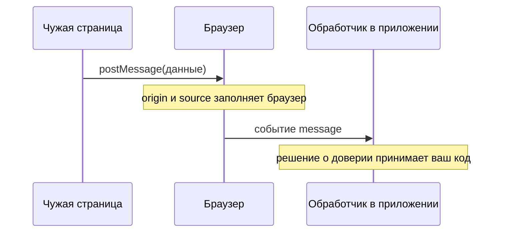
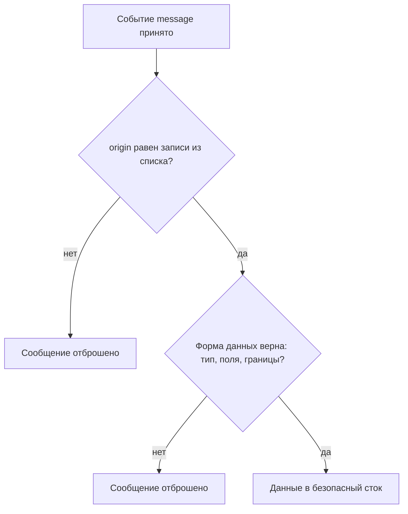

# Уязвимости postMessage

Приложение встраивает виджет, и виджет общается с главным окном сообщениями
через `postMessage`. Этот канал браузер оставляет открытым между разными
источниками; его устройство разобрано в теме `same-origin-policy`. Тем же
каналом пользуется и чужая страница: она встраивает само приложение в кадр
и шлёт ему сообщения. Обработчик в приложении отправителя сверяет, и сверка
выглядит убедительно:

```javascript
window.addEventListener('message', (event) => {
  if (event.origin.indexOf('normal.test') === -1) return;
});
```

Проверка читается как «принимать сообщения только с `normal.test`». Прогон
темы на трёх origin показывает, что она делает на самом деле: её прошли оба
чужих отправителя — и `http://normal.test.evil.test:8142`, и
`http://evilnormal.test:8143`. А соседняя проверка, по концу строки, отвергла
даже своё сообщение: origin оканчивается портом, и до имени домена конец
строки не доходит.

Подделать origin отправитель не может — его в событие ставит браузер. Поэтому
дефект живёт в получателе: в том, как он сверяет присланное, и в том, куда
данные сообщения идут дальше.

## Как это работает

**Откуда это взялось.** До межоконных сообщений документы разных origin
переговаривались обходными приёмами, и WSTG прямо называет большинство из
них небезопасными. Механизм сообщений завели как безопасную замену, и
заменой он служит — при условии, что получатель сверяет отправителя. Условие
это в интерфейсе не выражено: обработчик работает и без проверки, отличается
только исход. Так безопасный механизм получил самое небезопасное умолчание.

### Что приходит обработчику

WSTG перечисляет три поля доставленного события: данные сообщения, origin
документа-отправителя и ссылку на окно-источник. Данные целиком пишет
отправитель — это его текст. Origin и ссылку на окно заполняет браузер в
момент доставки, и отправитель на них влияния не имеет. Поэтому сверка
личности отправителя строится на origin: это единственное поле, за которое
отвечает браузер, а не тот, кто послал сообщение.

Из чего состоит origin, подробно разбирает тема `same-origin-policy`; здесь
важно одно следствие. Origin — это схема, имя хоста и порт вместе, а путь и
фрагмент в него не входят. Поэтому `http://example.com` и
`https://example.com` — разные origin, и `http://example.com` и
`http://example.com:8080` — тоже разные. Проверка, написанная как сравнение
с именем домена, про схему и порт ничего не знает — и дальше это сыграет.

Кто что заполняет в событии, видно из порядка доставки:



**Описание схемы.** Схема читается сверху вниз. Чужая страница вызывает
`postMessage` и управляет только данными. Браузер принимает вызов и сам
дописывает в событие origin и ссылку на окно-источник: отправитель эти поля
не пишет и подменить их не может. Обработчику событие доходит уже собранным,
и решение о доверии принимает он.

**Зачем это в работе AppSec-инженера.** Обработчик сообщений — короткая
функция, которая в ревью читается за минуту, а последствия у неё те же, что
у XSS. Проверка в ней либо есть, либо нет, и оба состояния видны сразу.
Норма при этом одна: сообщение отбрасывается, если origin не из доверенных
или если форма сообщения неверна.

## Как это атакуют

Атакующий начинает с чтения обработчика: код страницы виден каждому, кто её
открыл. Дальше он не подделывает origin — это невозможно — а подбирает имя
домена под увиденную проверку. Разница принципиальна: защита, построенная
на вхождении строки, обходится регистрацией домена, а регистрация — дело
минут.

Бытовое соответствие такое. Проверка по подстроке — это охранник, который
пропускает всех, у кого строка «Иванов» встречается в записи о посетителе:
пройдут и Ивановский, и Петров-Иванов. Запись о посетителе здесь — origin,
строка «Иванов» — искомая подстрока, охранник — метод `indexOf`. Где
аналогия ломается: фамилию под охранника не выбирают, а доменное имя под
проверку регистрируют — атакующему даже легче, чем в примере.

### Прогон на трёх origin

Все варианты сверки из этой темы прогнаны на стенде: приложение на
`http://normal.test:8141` и две чужие площадки,
`http://normal.test.evil.test:8142` и `http://evilnormal.test:8143`. Каждая
площадка встраивает приложение в кадр и шлёт ему сообщение. Итог по шести
вариантам:

| Проверка в обработчике | свой origin | `normal.test.evil.test` | `evilnormal.test` |
|---|:-:|:-:|:-:|
| `o === 'http://normal.test:8141'` | принято | отвергнуто | отвергнуто |
| `o.indexOf('normal.test') > -1` | принято | **принято** | **принято** |
| `o.startsWith('http://normal.test')` | принято | **принято** | отвергнуто |
| `o.endsWith('normal.test')` | **отвергнуто** | отвергнуто | отвергнуто |
| `/normal\.test/.test(o)` | принято | **принято** | **принято** |
| `/^http:\/\/normal\.test:[0-9]+$/.test(o)` | принято | отвергнуто | отвергнуто |

Строка с `indexOf` — та самая, которую разбирает академия PortSwigger:
проверяется вхождение подстроки куда угодно, и чужой домен с нужной строкой
внутри имени её проходит. Оба чужих имени зарегистрированы ровно под эту
проверку: у первого имя вашего домена стоит префиксом чужого, у второго —
входит внутрь имени. Проверка по началу строки ломается дописанным хвостом:
`normal.test.evil.test` начинается с нужной строки, а что стоит дальше,
`startsWith` не спрашивает.

Строка с `endsWith` показательна иначе: она отвергла и своё сообщение.
Причина — порт: origin оканчивается на `:8141`, а не на имя домена. Проверка,
которая молча отвергает всё, дефектом не выглядит и живёт до первого
приложения без порта в адресе. А там она начнёт пропускать чужое: origin
`http://evilnormal.test` оканчивается ровно на `normal.test`. Случай без
порта прогнан отдельно, на строковых значениях origin: `true` дали оба
адреса — и свой, и чужой.

Вывод один: сверяется равенство целого origin со списком, а не вхождение
куска. Регулярное выражение тоже законно, но с якорями — метками `^` и `$`,
которые требуют совпадения с начала и до конца значения. Выражение без
якорей повторяет беду `indexOf`, а с якорями и полным шаблоном повторяет
равенство, как в последней строке таблицы.

### Обработчик как источник

У дефекта есть вторая половина, и академия описывает её так: обработчик,
принявший сообщение, — источник в той же браузерной рамке, что и `location`
или `window.name`. Пара «источник — сток» разобрана в теме `xss-dom`:
источник — место, откуда чужие данные входят в страницу, сток — функция,
которая разбирает строку как разметку или как код. Данные сообщения идут
дальше по странице и попадают в стоки. Если в теле обработчика стоит `eval`,
`innerHTML` или присваивание адреса, чужая страница получает исполнение
своего текста. При этом своей разметки в приложении она не меняла — всё
сделало сообщение.

Это проверено прогоном: обработчик без сверки origin принял сообщение от
чужой площадки и записал его в `innerHTML`, а обработчик картинки внутри
записанной разметки сработал.

Отсюда следствие, которое упускают чаще всего. Проверка origin закрывает
случай чужого отправителя и не закрывает случай отправителя доверенного, но
взломанного: origin тогда настоящий, а содержимое чужое. Такой сценарий
ставит шестой опыт лабы из темы `same-origin-policy`. Поэтому порядок
проверок в обработчике такой: сначала origin, потом форма данных — ровно то,
что требует ASVS v5.0-3.5.5 и что живой стандарт HTML записывает в § 9.3.2.1.

Сообщение — ещё и один из трёх источников загрязнения прототипа: строка JSON
из сообщения, слитая с настройками без проверки ключей, кладёт своё в
прототип объекта. Этот класс разбирает тема `prototype-pollution`.

## Как это выглядит в коде

Ревьюер читает обработчик целиком, и разбор идёт тремя планами: проверить,
кто прислал; проверить, что прислали; проследить, куда уйдут данные. Счёт
ведите сами: сколько неверных решений принято в этом обработчике и какие
именно?

```javascript
// УЯЗВИМО — демонстрация, не для продакшена
window.addEventListener('message', (event) => {
  if (event.origin.indexOf('normal.test') === -1) return;   // (1)
  const cfg = JSON.parse(event.data);                       // (2)
  document.getElementById('panel').innerHTML = cfg.title;   // (3)
});
```

1. Проверка на вхождение подстроки вместо равенства: проходят и
   `normal.test.evil.test`, и `evilnormal.test` — это показал прогон стенда.
2. Форма данных не проверена: разбор строки JSON падает на чужом вводе или
   даёт объект произвольного вида, и дальше это значение используется вслепую.
3. Сток опасный: данные сообщения уходят в разметку через `innerHTML`.

Признаки в коде такие. `indexOf`, `startsWith`, `endsWith`, `includes` или
регулярное выражение без якорей рядом с `event.origin`. Сравнение с именем
домена вместо origin целиком. Чтение `event.data` до проверки. Отсутствие
обращения к `event.origin` в теле обработчика вовсе.

В этих шести строках собрана вся тема: неверная сверка отправителя, нет
проверки формы и опасный сток — три решения, неверных каждое по-своему.
Потому и починка тройная. А теперь без подглядывания в раздел починки: если
строку (1) заменить на строгое равенство со списком, какие дефекты в этом
обработчике останутся?

## Как защититься

Правило одно: сверка целого origin со списком доверенных, затем проверка
формы данных, и только потом использование. Исправленный вариант того же
обработчика читается теми же тремя планами, что и уязвимый:

```javascript
// Исправлено.
const TRUSTED = new Set(['https://widget.example.com']);

window.addEventListener('message', (event) => {
  if (!TRUSTED.has(event.origin)) return;                   // (1)
  let cfg;
  try { cfg = JSON.parse(event.data); } catch { return; }
  if (typeof cfg?.title !== 'string') return;               // (2)
  if (cfg.title.length > 80) return;
  document.getElementById('panel').textContent = cfg.title; // (3)
});
```

1. Равенство целого origin, и список, а не одно значение: собственные
   сообщения страницы приходят со своего origin и тоже должны попасть в
   список, если они есть.
2. Форма данных: тип и границы. Это вторая проверка, а не замена первой.
   Разбор строки завёрнут в `try`, потому что строка JSON от чужого окна
   может не разобраться вовсе, и тогда сообщение тихо отбрасывается.
3. Сток выбран по тому, чем значение служит: здесь это текст, поэтому
   `textContent`. Выбор стока по назначению значения разбирает тема
   `xss-contexts`.

Порядок из правила стоит нарисовать, потому что в нём и состоит вся защита:



**Описание схемы.** Схема читается сверху вниз. У сообщения две проверки, и
порядок у них не произвольный: сначала «кто прислал», потом «что прислали».
Отказ на любом из двух шагов отбрасывает сообщение целиком. До данных
обработчик добирается только после обеих проверок, и попадают данные в
безопасный сток.

**Границы применимости.** Список доверенных origin ведётся как список, а не
как шаблон. Шаблон с подстановкой поддомена возвращает первую беду темы:
любой поддомен, который кто-то заведёт, окажется доверенным. Как ломается
такой шаблон даже с якорями, показывает первый вопрос самопроверки.

**Что делать, когда отправитель заранее неизвестен.** Тогда сообщение
остаётся недоверенным целиком, и его данные проходят весь путь проверок, как
значение из адреса. Проверка origin в этом случае не отменяется, а
заменяется явным решением: сообщение принимается от кого угодно и потому
используется только там, где стока нет.

**Сторона отправителя.** У механизма две стороны, и вторая закрывается одной
строкой: MDN требует указывать в вызове `postMessage` конкретный адрес
получателя, а не звёздочку. Иначе сообщение с чувствительными данными доедет
до того документа, который окажется в окне, — а окажется там может и чужой.
Разбор этой половины лежит в теме `same-origin-policy`; здесь она названа,
чтобы список проверок в ревью был полным.

**Как проверить починку.** Стенд из начала темы поднимается заново: те же
три origin, те же сообщения. Эталон — строка равенства из таблицы: своё
сообщение принято, оба чужих отвергнуты. Второй опыт говорит про форму:
сообщение от доверенного origin, но неверной формы, тоже отбрасывается — это
шестой опыт лабы из темы `same-origin-policy`. И регрессия: своё сообщение
верной формы по-прежнему применяется. Проверка, которая отвергает всё
подряд, снова строит ловушку `endsWith`.

## Частая ошибка

Так оправдывают сверку по подстроке: origin в событии подделать нельзя,
значит, проверки на вхождение имени домена достаточно. Где здесь слабое
звено — решите до чтения разбора.

Подделывать origin и не нужно: чужой домен подбирается под проверку.
Регистрируется имя, в котором нужная строка встречается, — и проверка на
вхождение пропускает его сама, без всякой подделки. Это не гипотеза, а
прогон темы: два разных чужих origin проходят проверку по подстроке, один из
них — и проверку по началу строки.

Контрпример из тех же прогонов. Проверка `endsWith('normal.test')` отвергла
сообщение со своего же origin, потому что origin оканчивается портом. Такая
проверка ничего не пропускает и выглядит строгой, а на деле сломана: в
приложении без порта в адресе она начнёт пропускать `evilnormal.test`.
Признак верной проверки — равенство целого origin, а не совпадение куска.

## Чеклист для ревью

1. Проверьте, что обработчик события `message` сверяет `event.origin` на
   равенство со списком доверенных origin (ASVS v5.0-3.5.5).
2. Проверьте, что в проверке нет `indexOf`, `startsWith`, `endsWith`,
   `includes` и регулярного выражения без якорей.
3. Проверьте, что сравнение идёт с полным origin — схемой, хостом и
   портом, — а не с именем домена (WSTG-v42-CLNT-11).
4. Проверьте, что после проверки отправителя проверяется форма данных: тип,
   набор полей, границы значений.
5. Проверьте, что данные сообщения не попадают в опасный сток до обеих
   проверок.
6. Проверьте, что вызовы `postMessage` указывают конкретный адрес
   получателя, а не звёздочку.

## Попробуй сам

Возьмите обработчик события `message` из приложения, с которым работаете,
или напишите свой на локальной странице. Ответьте на четыре вопроса.
Сверяется ли `event.origin`. Сравнением или вхождением. Сравнивается ли
полный origin вместе со схемой и портом. Проверяется ли форма данных до их
использования.

**Критерий выполнения** наблюдаемый: четыре ответа и один пример чужого
origin, который прошёл бы найденную проверку. Если проверка верна — одно
предложение о том, почему приведённый пример её не проходит.

А чтобы пощупать механизм руками, пройдите пятый и шестой опыты лабы
`pilot/lab/same-origin-policy` из темы `same-origin-policy`. Там чужая
площадка шлёт сообщение обработчику, а взломанный доверенный виджет —
сообщение неверной формы. Чинится `code.js` ровно той парой проверок, что
разобрана в этой теме. Команды запуска — в `README.md` каталога лабы. Там же,
в теме `same-origin-policy`, разобрано и правило SAST, которое ловит
обработчик без сверки origin.

## Проверь себя

1. Обработчик виджета сверяет origin регулярным выражением с якорями:

   ```javascript
   window.addEventListener('message', (event) => {
     if (!/^https:\/\/[\w.]*widget\.example\.com$/.test(event.origin)) return;
     document.getElementById('title').textContent = event.data.title;
   });
   ```

   Якоря на месте, сток безопасный. Какие два origin пройдут эту проверку,
   хотя в списке доверенных их никто не заводил?

2. Обработчик из раздела «Как это выглядит в коде» проверяет отправителя по
   подстроке:

   ```javascript
   window.addEventListener('message', (event) => {
     if (event.origin.indexOf('normal.test') === -1) return;
     const cfg = JSON.parse(event.data);
     document.getElementById('panel').innerHTML = cfg.title;
   });
   ```

   Какую починку вы выберете?

   А. Заменить проверку на `event.origin.endsWith('normal.test')`: конец
      строки подделать труднее, чем середину.

   Б. Сверять целый `event.origin` на равенство со списком доверенных, затем
      проверять форму данных и только потом отдавать их в сток.

   В. Оставить `indexOf`, но искать подстроку `'https://normal.test'` — со
      схемой чужое имя не совпадёт.

3. Почему после проверки отправителя нужна ещё и проверка формы данных?
4. Четыре проверки из темы собраны в один файл. Предскажите, что напечатает
   прогон, — какая из четырёх отвергла своё сообщение?

   ```javascript
   const checks = {
     eq:  (o) => o === 'http://normal.test:8141',
     sub: (o) => o.indexOf('normal.test') > -1,
     pre: (o) => o.startsWith('http://normal.test'),
     suf: (o) => o.endsWith('normal.test'),
   };
   for (const [name, f] of Object.entries(checks))
     console.log(name,
       f('http://normal.test:8141'),
       f('http://normal.test.evil.test:8142'),
       f('http://evilnormal.test:8143'));
   ```

5. Возврат к теме `xss-dom`: почему обработчик сообщения считается источником
   той же рамки, что и `location`?
6. Возврат к теме `same-origin-policy`: что на стороне отправителя закрывается
   одной строкой и какой именно?

<details markdown="1">
<summary>Ответ 1</summary>

1. Любой поддомен `widget.example.com` — шаблон `[\w.]*` пропускает его, а
   завести поддомен может не только ваша команда. Имя вроде
   `https://notwidget.example.com` проходит тоже: класс символов перед именем
   не требует точки. Шаблон с подстановкой поддомена возвращает проверку на
   вхождение. Список доверенных origin ведётся как список конкретных
   значений, а не как шаблон.

</details>

<details markdown="1">
<summary>Ответ 2: разбор вариантов</summary>

2. Верный ответ — Б.

   А. Проверка по концу строки ломается о порт: origin оканчивается на
      `:8141`, и `endsWith('normal.test')` отвергнет и своё сообщение — это
      показано прогоном темы. А в приложении без порта в адресе она начнёт
      пропускать `evilnormal.test`. Молча отвергающая всё проверка дефектом
      не выглядит, и потому живёт долго.

   Б. Равенство целого origin со списком не оставляет чужому имени места:
      ни подстрока, ни начало строки больше не решают. Проверка формы данных
      закрывает второй случай — доверенный, но взломанный отправитель. Сток
      `innerHTML` здесь же стоит заменить на `textContent`.

   В. Со схемой в подстроке не совпадёт `evilnormal.test`, но совпадёт
      `https://normal.test.evil.test`: вхождение остаётся вхождением, и чужой
      домен подбирается под него регистрацией имени, без всякой подделки
      origin.

</details>

<details markdown="1">
<summary>Ответ 3</summary>

3. Проверка origin закрывает случай чужого отправителя и не закрывает случай
   отправителя доверенного, но взломанного: origin тогда настоящий, а
   содержимое чужое. Форма данных — вторая, независимая проверка, и ASVS
   v5.0-3.5.5 требует именно такой порядок.

</details>

<details markdown="1">
<summary>Ответ 4</summary>

4. Листинг сохраняется в файл `checks.js` и запускается командой:

   ```bash
   node checks.js
   ```

   Прогон печатает:

   ```text
   eq true false false
   sub true true true
   pre true true false
   suf false false false
   ```

   Своё сообщение отвергла `suf` — проверка по концу строки: origin
   оканчивается портом, до имени домена конец строки не доходит. Обе проверки
   на вхождение приняли оба чужих origin, и только равенство отвергло всё
   чужое, приняв своё. Вывод перепроверен запуском на Node.js v26.10.0.

</details>

<details markdown="1">
<summary>Ответ 5</summary>

5. Данные сообщения приходят снаружи и идут дальше в те же стоки — `eval`,
   `innerHTML`, присваивание адреса. Разница только в способе доставки:
   вместо адресной строки — событие от чужого окна.

</details>

<details markdown="1">
<summary>Ответ 6</summary>

6. Указание конкретного адреса получателя в вызове `postMessage` вместо
   звёздочки. Без этого сообщение с чувствительными данными доедет до того
   документа, который окажется в окне, — а окажется там может и чужой.

</details>

## Источники

1. PortSwigger Web Security Academy, «Controlling the web message source»;
   реестр `ps-postmessage`. Разделы: What is the impact of DOM-based web
   message vulnerabilities, How to construct an attack using web messages as
   the source, Origin verification, Which sinks can lead to DOM-based web
   message vulnerabilities.
   <https://portswigger.net/web-security/dom-based/controlling-the-web-message-source>
2. MDN Web Docs, «Window: postMessage() method»; реестр `mdn-postmessage`.
   Разделы: Syntax — targetOrigin, Security concerns.
   <https://developer.mozilla.org/en-US/docs/Web/API/Window/postMessage>
3. OWASP Top 10:2025, «A07:2025 Authentication Failures»; реестр
   `owasp-top10-2025-a07`. Раздел: Mapped CWEs — CWE-346.
   <https://owasp.org/Top10/2025/A07_2025-Authentication_Failures/>
4. OWASP WSTG-CLNT-11 «Testing Web Messaging», WSTG v4.2; реестр
   `wstg-v42-clnt-11-web-messaging`. Разделы: Summary, Origin Security.
   <https://owasp.org/www-project-web-security-testing-guide/v42/4-Web_Application_Security_Testing/11-Client-side_Testing/11-Testing_Web_Messaging>

Каркас этапа: `owasp-asvs-5-document` (ASVS v5.0.0), `owasp-wstg-42`,
`owasp-top10-2025`. Наследуются всеми темами и отдельной строкой не
повторяются.

**Скоропортящийся слой.** Набор полей события и правила сравнения origin
заданы стандартом и меняются медленно. Список доверенных origin приложения
меняется вместе с его интеграциями и потому требует ревизии при каждой новой.

**Маркеры уверенности.** Поведение шести проверок — **проверено лично**
2026-08-24 в браузере `HeadlessChrome/152.0.7977.42` на трёх origin
(`http://normal.test:8141`, `http://normal.test.evil.test:8142`,
`http://evilnormal.test:8143`): равенство и регулярное выражение с якорями
приняли только своё сообщение; `indexOf` и выражение без якорей приняли оба
чужих; проверка по началу строки приняла один чужой; проверка по концу
строки отвергла всё, включая своё. Отдельным прогоном проверено, что
обработчик без сверки origin принял сообщение от чужой площадки и разметка
из него сработала в стоке `innerHTML`. Обе строки таблицы с регулярными
выражениями и листинг из вопроса 4 самопроверки перепроверены локально
2026-10-03 на Node.js v26.10.0; вывод совпал дословно. Случай приложения без
порта в адресе в браузере лично **не воспроизводился** — стенд поднимался на
портах, — но строковая его половина прогнана локально 2026-10-03 на Node.js
v26.10.0: `new URL('http://normal.test:80').origin` печатается без порта, и
`endsWith('normal.test')` даёт `true` на обоих origin — на своём и на
`http://evilnormal.test`. Разбор обхода проверок и обработчик как источник —
**по документации** (Web Security Academy, открыта лично 2026-08-24). Состав
origin и три поля события — **по документации** (WSTG-CLNT-11, открыт лично
2026-08-24). Требование указывать конкретный адрес получателя — **по
документации** (MDN, открыт лично 2026-08-24). Требование 3.5.5 сверено с
текстом ASVS v5.0.0 (открыт лично 2026-08-24). Категории `A07:2025` и
`A05:2025` сверены со списками сопоставленных CWE на страницах категорий
(открыты лично 2026-08-24).
