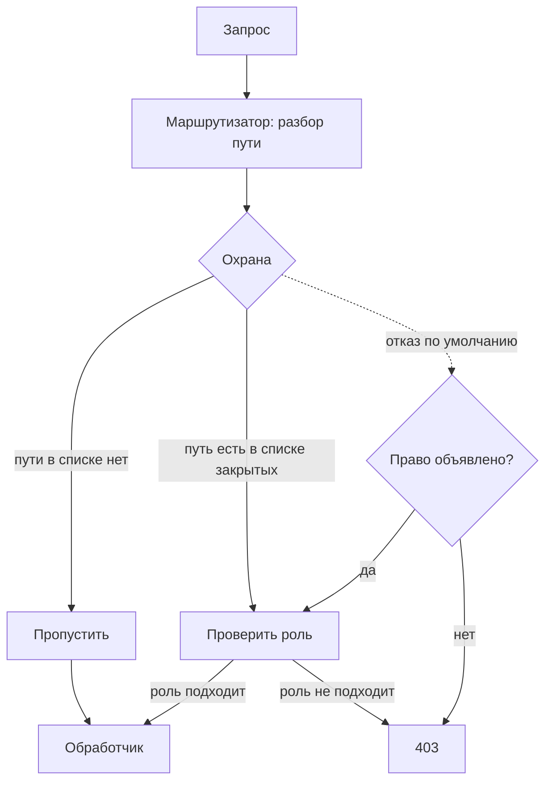

# Вертикальная эскалация привилегий

Уровень **L1** · время 93 мин (теория 43 / лаба 35 / самопроверка 15,
оценка)

Что прочитать сначала: `access-control-models`, `sessions-vs-tokens`.

**Зачем это в работе AppSec-инженера.** Маршрут вы добавляли не раз: строка в
роутере, обработчик, тесты зелёные. Список закрытых путей лежит в другом файле,
и дописать в него строку никто не напоминает. Это первый пункт первой категории
OWASP Top 10 и находка на каждом втором ретесте. Список закрытого отстаёт от
кода всегда, вопрос лишь в том, на сколько маршрутов.

**Что это такое.** Роли делят функции приложения: то, что позволено
администратору, обычному пользователю не положено. Граница между ними держится
не сама — её держит код, который перед вызовом обработчика спрашивает о праве.
Вертикальная эскалация — это когда обычный пользователь попадает в функцию
администратора, потому что спросить о праве оказалось некому.

Дальше всё решает умолчание. Охрану обычно пишут списком закрытого:
перечисляют пути, куда посторонним нельзя. Маршруты при этом добавляют кодом, а
список правят руками, и делают это разные люди в разное время. Что в список не
попало — открыто.

**Пример: выгрузка заявок ушла обычному пользователю.** Портал заявок, охрана
закрывает `/admin/users` и `/admin/tickets/delete`. Через полгода в код добавили
выгрузку всех заявок портала по адресу `/admin/export`, а в список охраны его не
дописали. Обычный пользователь `anna` набрал адрес руками.

**Запрос**

```http
GET /admin/export HTTP/1.1
Host: tickets.example.com
Cookie: session=7cQx1
```

**Ответ**

```http
HTTP/1.1 200 OK
Content-Type: application/json

{"1":{"owner":"anna"},"2":{"owner":"boris"},"3":{"owner":"sysadmin"}}
```

Ни подделки, ни инъекции здесь нет. Сессия настоящая, роль в ней настоящая —
`user`, и `anna` её не меняла. Адрес тоже настоящий: его объявил разработчик.
Дефект в том, что охрана про этот адрес не знает, а не знать для неё значит
пропустить.

К этой выгрузке тема возвращается четыре раза. «Эксплуатация» повторяет её на
стенде и ставит рядом три опыта, «Как выглядит в коде» показывает охрану и
маршрут изнутри. «Как чинится» меняет в них умолчание, «Как проверить фикс»
показывает тот же запрос с кодом 403.

Подмена признака роли в запросе разобрана отдельной темой
`role-parameter-tampering`: здесь атакующий ничего не подделывает, он
приходит туда, где его не ждали.

## 0. Коротко

То же в терминах, которыми это обсуждают. Вертикальная эскалация — доступ к
функции, положенной более высокой роли: обычный пользователь открывает
административную страницу, выгружает базу, удаляет чужую запись. Причина почти
всегда одна — охрана знает про часть функций, а не про все. Чинится отказом по
умолчанию: маршрут без объявленного права недоступен, а охрана и маршрутизатор
разбирают запрос одинаково.

## 1. Цели

После этого раздела вы сможете:

1. Отличить вертикальную эскалацию от горизонтальной по тому, что получил
   атакующий.
2. Назвать четыре пути, которыми находят закрытую функцию.
3. Найти в коде охрану, привязанную к пути, и отличить её от привязанной к
   функции.
4. Проверить фикс ретестом и регрессом, не сломав штатный доступ
   администратора.
5. Написать правило SAST на административный маршрут без объявленного права.

## 2. Предвопросы

Попробуйте ответить до чтения — даже если ответ окажется неверным, дальше он
будет с чем сравнить.

1. Приложение не показывает обычному пользователю ссылку на административную
   панель. Что должно случиться, если он введёт её адрес руками?
2. Охрана закрывает путь `/admin`. Разработчик добавляет маршрут
   `/reports/export`, который выгружает все заявки. Кто теперь имеет к нему
   доступ?
3. Чем «пользователь получил чужой заказ» отличается от «пользователь получил
   список всех заказов» с точки зрения того, что сломалось?

## 3. Механика

**Откуда это взялось.** Первые веб-приложения раздавали файлы, и доступ
закрывали там же, где раздавали: правило писалось на каталог сервера. Пока
страница и файл совпадали, список закрытых каталогов совпадал с набором
закрытых функций. Дальше пути и функции разошлись. Маршрут стал объявляться в
коде одной строкой, охрана осталась отдельным списком, и список начал
отставать. Ответ отрасли — перевернуть умолчание: не перечислять закрытое, а
требовать объявленного разрешения на открытое.

Вертикальная эскалация — это доступ к **функциональности**, положенной другому
уровню привилегий. WSTG-v42-ATHZ-03 разводит два случая по тому, чей доступ
получен. Вертикальный — доступ к ресурсам более привилегированных учётных
записей. Горизонтальный — доступ к ресурсам записи того же уровня.
PortSwigger формулирует то же через вид контроля: вертикальный контроль
ограничивает доступ к чувствительным функциям, горизонтальный — к ресурсам
конкретных пользователей.

Разница не в приёме, а в добыче. Приёмы совпадают: подменить значение в
запросе, ввести адрес руками, поменять метод. Совпадает и то, что горизонтальная
эскалация часто перерастает в вертикальную — достаточно добраться до учётной
записи администратора и сбросить ей пароль.

### Разбор по общей рамке

Разбор дефекта в гайдбуке идёт по одному набору подцелей, и вертикальная
эскалация раскладывается по нему без остатка.

**Источник** — адрес и метод запроса: их полностью задаёт отправитель.
**Путь** — маршрутизатор, который по этому адресу выбирает обработчик.
**Sink** — сам обработчик: функция, выполняющая чувствительное действие.
**Отсутствующий контроль** — решение о праве на эту функцию, которого между
маршрутизатором и обработчиком не оказалось. **Условие эксплуатации** — знание
адреса; учётная запись при этом нужна обычная, а иногда и она не нужна.

Полезно заметить, чего в этом наборе нет. Нет подделки: атакующий не меняет ни
роль, ни подпись, ни идентификатор. Он отправляет корректный запрос по
настоящему адресу, и приложение обслуживает его штатно. Это отличает тему от
`role-parameter-tampering`, где значение в запросе именно подменяют.

### Четыре пути к закрытой функции

**Функция не защищена вовсе.** Самый частый случай. Административные ссылки
стоят на странице администратора и не стоят на странице пользователя, а сам
адрес открыт любому, кто его наберёт. PortSwigger называет это отправной
точкой: защиты нет, есть отсутствие ссылки.

**Адрес спрятан.** Панель лежит по неочевидному адресу вида
`/administrator-panel-yb556`. Перебором такое не находят, зато адрес утекает:
из `robots.txt`, из скрипта, который строит меню по роли, из сообщения об
ошибке. Приём разобран отдельно в теме `client-side-access-checks`; здесь важно
одно — сокрытие не считается контролем доступа.

**Правило есть, но не про то.** Охрана написана про путь и метод, а функция
вызывается маршрутизатором, и два разбора расходятся: регистр, завершающий
слеш, расширение, заголовок с подменой адреса. Это тема
`access-control-bypass-headers`, и на ретесте она даёт находки чаще прочих.

**Правило есть, но не на этой функции.** Список закрытого полон на день, когда
его писали. Новый маршрут в него не попал — и вышел открытым, хотя выглядит
административным по имени и по содержимому ответа.

Четвёртый путь стоит держать отдельно от первого, хотя выглядят они одинаково.
В первом случае контроля доступа в приложении нет вовсе, и это видно любому
читателю кода. В четвёртом контроль есть, работает и проходит ревью: список
закрытого на месте, проверка роли написана, тесты зелёные. Дефект живёт в
зазоре между двумя списками, которые ведут разные люди в разное время. Именно
поэтому он переживает и ревью, и приёмку, и всплывает на первом же ретесте
через полгода после запуска.

Из этого следует практическое правило чтения кода: смотреть не на проверки, а
на способ их назначения. Проверка, привязанная к обработчику, живёт и умирает
вместе с ним. Проверка, привязанная к строке в отдельном списке, живёт своей
жизнью — и расходится с кодом тем быстрее, чем чаще меняются маршруты.

### Где принимается решение

Все четыре пути упираются в один вопрос: **что происходит с запросом, о
котором охрана ничего не знает.** Ответов ровно два, и они задают устройство
приложения.



**Описание схемы.** Запрос проходит маршрутизатор и попадает в охрану. Сплошные
стрелки — устройство со списком закрытых путей: путь в списке ведёт к проверке
роли, путь вне списка — прямо к обработчику. Пунктирная стрелка — устройство с
отказом по умолчанию: охрана спрашивает не про список, а про объявленное право,
и отсутствие объявления даёт отказ.

Второе устройство требуют оба документа. ASVS v5.0-8.2.1: доступ к функции
ограничен потребителями с явным разрешением. Описание A01:2025 ставит то же
первым пунктом рекомендаций — кроме публичных ресурсов, отказывать по
умолчанию.

Отдельно оговорено, **где** решение принимается. ASVS v5.0-8.3.1 требует
доверенного слоя службы и запрещает опираться на средства, которыми управляет
недоверенный потребитель. До кода стоит документация: v5.0-8.1.1 требует, чтобы
правила доступа к функциям были записаны, — иначе проверять фикс не с чем.

## 4. Эксплуатация

Стенд — лаба этой темы (`pilot/lab/privilege-escalation-vertical`). Портал
заявок с тремя учётными записями: `anna` и `boris` с ролью `user`, `sysadmin` с
ролью `admin`. Охрана сверяет путь со списком `PROTECTED`.

Шаг первый — собрать карту маршрутов. В лабе они видны в коде; в живом
приложении их собирают из четырёх мест. Первое — скрипты интерфейса: они
содержат адреса всех функций, включая те, что рисуются только администратору.
Второе — ответы самого приложения: перенаправления, ссылки в письмах, поля
`Link`. Третье — служебные файлы: `robots.txt`, карта сайта, описание API.
Четвёртое — подбор по словарю имён. Маршрутов в лабе пять, административных по
смыслу — три.

Шаг второй — сверить карту со списком закрытого. В `PROTECTED` два пути из
трёх. Третий, `/admin/export`, заведён позже и в список не попал.

```text
$ python3 hack.py
  опыт 1 — /admin/export без роли: код 200 — ВЫГРУЗКА ПОЛУЧЕНА
  опыт 2 — /ADMIN/USERS без роли: код 200 — СПИСОК УЧЁТНЫХ ЗАПИСЕЙ ПОЛУЧЕН
  опыт 3 — удаление чужой заявки: код 200 — ЗАЯВКА УДАЛЕНА
  опыт 4 — контроль, администратор: код 200
```

Опыт 1 — четвёртый путь из механики: правило есть, но не на этой функции.
Обычный пользователь получает все заявки портала.

Опыт 2 — третий путь. Маршрутизатор приводит путь к нижнему регистру и находит
обработчик; охрана сверяет присланную строку как есть и в списке её не находит.
Одна и та же функция закрыта по одному написанию и открыта по другому.

Опыт 3 — тот же приём против изменяющего действия. Чтение чужих данных
переходит в удаление чужих данных, и это разные строки в отчёте.

Опыт 4 — не атака, а контроль: администратор в свою функцию попадает. Без него
починка сведётся к запрету всего подряд, и это будет видно только на
приёмке.

Шаг третий — оценить, что получено. Здесь важно не остановиться на первом
успехе. Выгрузка заявок — утечка; удаление — нарушение целостности; а список
учётных записей из опыта 2 обычно ведёт дальше, к сбросу пароля чужой записи.
Описание A01:2025 приводит этот же ход отдельным сценарием: неаутентифицированный
пользователь открывает `/app/admin_getappInfo`, и уже одно это считается
дефектом, независимо от того, что лежит в ответе.

## 5. Как выглядит в коде

Ревьюер ищет не проверку, а **умолчание**: что случится с маршрутом, о котором
никто ничего не объявил. Вопрос задаётся коду, а не документации.

```python
# УЯЗВИМО — демонстрация, не для продакшена.
PROTECTED = {"/admin/users", "/admin/tickets/delete"}    # (1)

def guard(request):
    if request["path"] in PROTECTED:                     # (2)
        if USERS[request["user"]]["role"] != "admin":
            raise Denied

@app.route("/admin/export")                              # (3)
def admin_export(request):
    return {"status": 200, "body": dict(TICKETS)}
```

1. Список закрытого. Он полон ровно на день, когда его писали.
2. Сверка присланной строки. Маршрутизатор к этому моменту уже привёл путь к
   своему канону, а охрана работает с исходным.
3. Маршрут объявлен без единого слова о правах. Ни аргумента, ни декоратора,
   ни вызова в теле — и это законный код, который проходит ревью.

Тот же дефект на втором стеке выглядит как порядок правил. Spring Security
разбирает пары «шаблон — правило» **в порядке объявления и применяет только
первое совпадение**.

```java
// УЯЗВИМО — демонстрация, не для продакшена.
http.authorizeHttpRequests(authorize -> authorize
    .requestMatchers("/admin/**").hasAuthority("ADMIN")
    .anyRequest().authenticated()                        // (4)
);
```

4. Замыкающее правило требует лишь аутентификации. Маршрут `/reports/export`
   под первый шаблон не подходит, попадает во второе правило и открывается
   любому вошедшему.

**Что искать глазами.** Признак не в имени функции и не в наличии слова
`admin`, а в трёх вопросах к охране. По чему она ищет правило — по строке пути
или по обработчику? Что она делает, не найдя правила? Совпадает ли её разбор
пути с разбором маршрутизатора?

**Обёртки, которые не спасают.** Проверка «пользователь вошёл» отвечает на
вопрос об аутентификации, а не о правах. Правило на префикс `/admin` закрывает
адреса, а не функции: выгрузка всех заявок остаётся административной, лёжа под
`/reports`. Сокрытие ссылки в интерфейсе не закрывает ничего.

**Ложное срабатывание.** Маршрут без явного правила в приложении, где базовый
класс контроллера отказывает, пока право не объявлено. Признак — правило
пишется как разрешение, а не как запрет: `@app.route(..., role="admin")`.

## 6. Как чинится

Меняется не проверка, а умолчание. Право объявляется рядом с маршрутом, а
маршрут без объявления закрыт.

```python
def route(self, path, methods=("GET",), role=None):
    if role is None:                                     # (1)
        raise ValueError(f"маршрут {path} без объявленного права")
    ...

def normalize(path):                                     # (2)
    return "/" + path.strip("/").lower()

def guard(request, required):
    if required is None:                                 # (3)
        raise Denied
    if required != "any" and USERS[request["user"]]["role"] != required:
        raise Denied
```

1. Маршрут без объявленного права не заводится вовсе: ошибка видна при старте,
   а не на ретесте через полгода.
2. Путь приводится к канону один раз — до маршрутизации и до охраны. Разбор у
   них становится общим, и опыт 2 закрывается.
3. Отказ по умолчанию в самой охране: нет правила — нет доступа. Это второй
   рубеж на случай, если маршрут заведён в обход декоратора.

На втором стеке то же правило — одна строка в конце цепочки.

```java
http.authorizeHttpRequests(authorize -> authorize
    .requestMatchers("/admin/**").hasAuthority("ADMIN")
    .requestMatchers("/reports/**").hasAuthority("ADMIN")
    .anyRequest().denyAll()                              // (4)
);
```

4. Замыкающее `denyAll` превращает набор правил в список разрешённого.
   Документация Spring Security называет отказ по умолчанию здоровой
   практикой безопасности ровно по этой причине.

**Границы применимости.** Отказ по умолчанию вводится сразу целиком, и в
работающем приложении это дорого. Список правил на момент включения неполон, а
всё, что в него не попало, немедленно ломается. Порядок работ — включить
механизм в режиме журналирования, собрать список функций, которые получили бы
отказ, разобрать его до пустоты и только потом переключить.

К починке примыкает то, без чего она не замечается: журнал. Описание A01:2025
требует записывать отказы контроля доступа и предупреждать администраторов при
повторяющихся отказах. Смысл не в отчётности. Перебор маршрутов выглядит как
серия отказов подряд от одной учётной записи, и это единственный сигнал,
приходящий до того, как атакующий найдёт незакрытую функцию.

**Чем за это платят.** Правило приходится объявлять на каждый маршрут, включая
публичные: страница входа и статика тоже получают явное разрешение. Это лишняя
строка при каждом новом обработчике — и она же единственное, что мешает
маршруту выйти открытым по недосмотру. Вторая часть цены — порядок правил там,
где он значим: в Spring Security первое совпадение решает, поэтому широкий
шаблон, поставленный выше узкого, отменяет узкий целиком.

**Чего это не закрывает.** Права на объект. Механизм, умеющий отказывать по
функции, ничего не знает о владельце записи: администратор попадает в свою
функцию и достаёт оттуда чужой объект. Это требование v5.0-8.2.2, и разбирает
его тема `idor`. Для административных интерфейсов ASVS требует большего:
v5.0-8.4.2 просит несколько слоёв защиты и запрещает считать сетевое
расположение вызывающего единственным основанием доступа.

## 7. Как проверить фикс

Ретест повторяет эксплуатацию и добавляет к ней негативные случаи — то, что
обязано продолжать работать.

```text
$ LAB_TARGET=solution.py python3 hack.py
  опыт 1 — /admin/export без роли: код 403
  опыт 2 — /ADMIN/USERS без роли: код 403
  опыт 3 — удаление чужой заявки: код 403
  опыт 4 — контроль, администратор: код 200
```

Три отказа и один пропуск. Отказ на четвёртом опыте означал бы, что починка
свелась к запрету, и приёмку она не проходит.

Регресс закрывается тестами функциональности. В лабе их девять, и проверяют они не
безопасность, а сохранность работы. Свой профиль открыт. Свои заявки видны, и
только свои. Администратор получает списки, удаление работает, неизвестный
маршрут по-прежнему даёт 404.

```text
$ LAB_TARGET=solution.py python3 tests.py
  OK   свой профиль открыт обычному пользователю
  ...
  OK   административная функция закрыта обычному пользователю
  упало: 0
```

Три негативных случая стоит проверять отдельно, потому что их ломают чаще
всего. Первый: неизвестный маршрут отвечает 404, а не 403 — иначе перебор
маршрутов подтверждает существование закрытых. Второй: публичные страницы
остались публичными, для них право объявлено явно. Третий: маршрут, забытый при
переводе на новое умолчание, ломается при старте, а не тихо в рантайме.

Отдельный тест на регресс — тот, который ловит возврат дефекта: новый маршрут,
заведённый без объявленного права, обязан уронить сборку. В лабе это `raise
ValueError` в самом декораторе, и проверяется он попыткой такой маршрут завести.

## 8. Как ловится автоматикой

Статический анализ здесь работает, но не на общем случае. Отсутствие проверки
доказать нельзя: она бывает в базовом классе, в промежуточном слое, в
конфигурации сервера. Ловится **синтаксическая** форма — административный
маршрут, у которого право не объявлено ни одним из принятых способов.

```yaml
patterns:
  - pattern: |
      @$APP.route($PATH, ...)
      def $F(...):
          ...
  - metavariable-regex:
      metavariable: $PATH
      regex: (?i)^["'].*/admin.*["']$
  - pattern-not: |
      @$APP.route(..., role=$R, ...)
      def $F(...):
          ...
  - pattern-not: |
      @$APP.route($PATH, ...)
      def $F(...):
          ...
          require_role(...)
          ...
```

Правило целиком лежит в `pilot/semgrep/admin-route-no-authz.yaml` и сверено
прогоном: на уязвимом файле лабы три находки, на решении — ноль, на семи
размеченных тест-кейсах расхождений нет.

**Что правило пропустит.** Всё, что не названо `admin`: та же выгрузка заявок,
положенная под `/reports/export`, останется невидимой, хотя от переноса она
административной быть не перестала. Всякую охрану, устроенную списком путей, а не объявлением у
маршрута. Любой стек, где маршруты заводятся не декоратором.

**Какой шум даст.** Административные маршруты, закрытые промежуточным слоем на
уровне приложения, попадут в находки: правило видит объявление маршрута и не
видит слой. На корпусе, где принята такая архитектура, правило переводится в
предупреждение или дополняется исключением на конкретный слой.

Отдельно стоит сказать, чего от статического анализа ждать не стоит вовсе.
Он не отвечает на вопрос, административная ли функция по смыслу: выгрузка всех
заявок и выгрузка своих отличаются одной строкой запроса к базе. Решение об
этом принимает человек, читающий код, и никакая сигнатура его не заменит.

**Чем это дополняется.** Тем, что автоматика делает лучше человека: сверкой
списка маршрутов со списком объявленных прав. Такая проверка пишется не
сигнатурой, а обходом таблицы маршрутов при старте — и ловит ровно тот случай,
который пропускает сигнатура.

## 9. Ловушка

Выгрузка из введения лежала по угадываемому адресу, и первый ответ, который
приходит на такую находку, — переименовать. Отсюда представление: если
административная страница не показана в интерфейсе и её адрес нигде не
напечатан, доступ к ней закрыт — угадать адрес нельзя.

**Сокрытие адреса не создаёт контроля доступа.** Адрес — не секрет: он
существует в скриптах интерфейса, в журналах, в закладках сотрудников, в
сообщениях об ошибках и в файлах конфигурации.

Почему так выходит. Приложение отдаёт один и тот же скрипт всем ролям и
дорисовывает меню по признаку роли на стороне браузера. Адрес панели попадает в
этот скрипт вместе с условием. Роль условие меняет, содержимое файла — нет.

Контрпример. Панель по адресу `/administrator-panel-yb556` перебором не
находится. Скрипт, который строит интерфейс, содержит этот адрес внутри
условия `if (isAdmin)`. Скрипт отдаётся любому посетителю. Атакующему остаётся
открыть его и прочитать строку — сокрытие продержалось до первого просмотра
исходников страницы.

## 10. Чеклист ревью

1. Verify that маршрут без объявленного права закрыт, а не открыт
   (ASVS v5.0-8.2.1).
2. Verify that охрана ищет правило по обработчику или маршруту, а не по строке
   пути.
3. Verify that разбор пути у охраны и у маршрутизатора общий — регистр,
   завершающий слеш и расширение дают один результат.
4. Verify that решение принимается в доверенном слое службы, недоступном
   потребителю (ASVS v5.0-8.3.1).
5. Verify that правила доступа к функциям записаны до кода и доступны для
   сверки (ASVS v5.0-8.1.1).
6. Verify that ресурс недоступен без аутентификации и после выхода из системы
   (WSTG-v42-ATHZ-02).
7. Verify that административные интерфейсы защищены не только сетевым
   расположением вызывающего (ASVS v5.0-8.4.2).
8. Verify that неизвестный маршрут отвечает так же, как закрытый, и не
   подтверждает существование скрытых функций.

## 11. Лаба

`lab-privilege-escalation-vertical`, каталог
`pilot/lab/privilege-escalation-vertical`. Формат «почини»: правится `code.py`,
пока `hack.py` и `tests.py` не станут зелёными одновременно.

**Цель одной фразой:** добиться, чтобы `hack.py` вышел с кодом 0, а `tests.py`
продолжил выходить с кодом 0.

Всё локально, только стандартной библиотекой Python, без сети и без Docker.
HTTP не поднимается: запрос — словарь, маршрутизатор — тридцать строк.

Одна подсказка: спрашивайте не «какие пути закрыть», а «что происходит с
маршрутом, о котором охрана ничего не знает».

**Отдельная задача «почини».** Приведите `code.py` к состоянию, в котором новый
административный маршрут нельзя завести молча: попытка объявить маршрут без
права обязана уронить приложение при старте. Проверяется добавлением такого
маршрута в конец файла.

Решение лежит в `solution.py` и открывается после того, как своя попытка
сделана.

## 12. Проверь себя

1. Чем вертикальная эскалация отличается от горизонтальной по тому, что
   получил атакующий?
2. Какие четыре пути ведут к закрытой функции и какой из них не закрывается
   правкой списка путей?
3. Что происходит в приложении со списком закрытых путей, когда разработчик
   добавляет новый маршрут?
4. Почему после починки нужен опыт, в котором администратор попадает в свою
   функцию?
5. Что правило SAST из блока 8 пропустит и почему это не делает его
   бесполезным?
6. Возврат к теме `access-control-models`: почему проверка роли не отвечает на
   вопрос о правах на конкретный объект?

<details>
<summary>Ответы</summary>

1. При вертикальной атакующий получает функциональность более высокой роли:
   административную страницу, выгрузку, удаление чужих записей. При
   горизонтальной — ресурсы учётной записи того же уровня.
2. Функция не защищена вовсе; адрес спрятан; правило написано про путь и
   расходится с маршрутизатором; правило есть, но не на этой функции. Третий
   путь правкой списка не закрывается: разбор строки у охраны и маршрутизатора
   остаётся разным.
3. Ничего: маршрут появляется, список не меняется. Функция выходит открытой
   всем вошедшим, и ни один тест этого не замечает.
4. Иначе починка сведётся к запрету всего подряд. Отказ администратору в его
   же функции — тоже дефект, и обнаружится он на приёмке или в проде.
5. Пропустит всё, что не названо `admin`, охрану списком путей и стеки без
   декораторов. Полезным его делает цена: сигнатура ловит частую форму дефекта
   на каждом коммите и стоит одного прогона.
6. Роль отвечает на вопрос о функции. Какой объект достанет обработчик, решает
   параметр запроса, и права на этот объект — отдельное требование
   (ASVS v5.0-8.2.2).

</details>

## 13. Дальше

- `idor` — вторая половина задачи: права на объект, а не на функцию.
- `deny-by-default` — то же правило как свойство всего приложения.
- `access-control-bypass-headers` — третий путь из механики, разобранный
  целиком.
- `bfla` — как эта же нехватка выглядит в интерфейсе программы.

## 14. Источники

1. PortSwigger Web Security Academy, «Access control vulnerabilities and
   privilege escalation»; реестр `ps-access-control`. Разделы: Vertical access
   controls, Vertical privilege escalation, Unprotected functionality, How to
   prevent access control vulnerabilities.
   <https://portswigger.net/web-security/access-control>
2. OWASP WSTG-ATHZ-03 «Testing for Privilege Escalation», WSTG v4.2; реестр
   `wstg-v42-athz-03-privilege-escalation`. Разделы: Summary, Test Objectives,
   Testing for Role/Privilege Manipulation.
   <https://owasp.org/www-project-web-security-testing-guide/v42/4-Web_Application_Security_Testing/05-Authorization_Testing/03-Testing_for_Privilege_Escalation>
3. OWASP WSTG-ATHZ-02 «Testing for Bypassing Authorization Schema», WSTG v4.2;
   реестр `wstg-v42-athz-02-bypassing-authz-schema`. Разделы: Summary, Testing
   for Vertical Bypassing Authorization Schema.
   <https://owasp.org/www-project-web-security-testing-guide/v42/4-Web_Application_Security_Testing/05-Authorization_Testing/02-Testing_for_Bypassing_Authorization_Schema>
4. OWASP Top 10:2025, «A01:2025 Broken Access Control»; реестр
   `owasp-top10-2025-a01`. Разделы: Description, How to prevent, Example attack
   scenarios (сценарий 2).
   <https://owasp.org/Top10/2025/A01_2025-Broken_Access_Control/>
5. Spring Security Reference, «Authorize HttpServletRequests»; реестр
   `spring-security-authorize-http-requests`. Разделы: порядок правил и первое совпадение,
   Matching by HTTP Method, замыкающее `denyAll`.
   <https://docs.spring.io/spring-security/reference/servlet/authorization/authorize-http-requests.html>

Каркас этапа: `owasp-asvs-5-document` (ASVS v5.0.0), `owasp-wstg-42`,
`owasp-top10-2025`; якорь подраздела: `owasp-cs-authorization`. Наследуются
всеми темами и отдельной строкой не повторяются. Первая сноска — якорь
подраздела, четвёртая ведёт на отдельную запись реестра: главу A01:2025, а не
на оглавление издания.

**Скоропортящийся слой.** Документация Spring Security — живая, без даты
публикации; форма `authorizeHttpRequests` заменила `authorizeRequests` и сама
со временем сменится. Страница Web Security Academy тоже живая. Версии Python
и Semgrep, на которых снимались прогоны, названы в шапке.

**Маркеры уверенности.** Прогоны лабы и правила SAST — **проверено лично**
2026-08-23 на Python 3.14.7 и Semgrep 1.174.0: три опыта эксплойта дают 200 на
`code.py` и 403 на `solution.py`, девять тестов функциональности проходят в
обоих случаях, правило даёт три находки на уязвимом файле и ноль на решении.
Определения вертикальной и горизонтальной эскалации и четыре пути к закрытой
функции — **по документации** (WSTG-ATHZ-03 и Web Security Academy, открыты
лично 2026-08-23). Порядок правил, первое совпадение и оценка `denyAll` —
**по документации** (Spring Security Reference, открыт лично 2026-08-23):
листинги на Java **не запускались**, стенда со Spring не собиралось.
Требования 8.1.1, 8.2.1, 8.3.1 и 8.4.2 сверены с текстом ASVS v5.0.0 (открыт
лично 2026-08-23).
