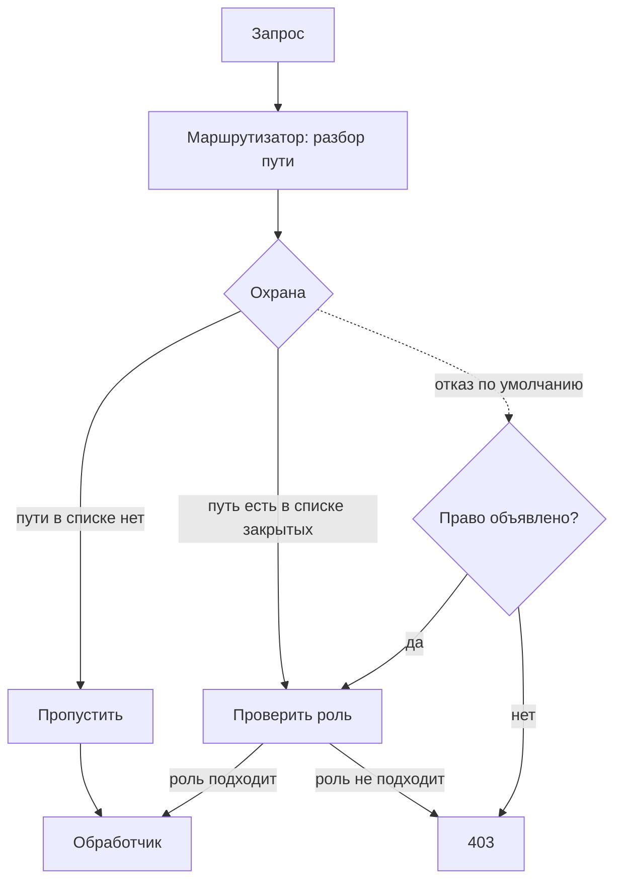

# Вертикальная эскалация привилегий

Внутренний портал заявок работает второй год, и вход в него проверяется
исправно: у каждого вошедшего есть сессия, а в сессии записана роль.
Роль `admin` у одной учётной записи, остальные — обычные пользователи.
Две административные функции, список учётных записей и удаление заявок,
закрыты охраной. Охраной в этой теме называется код, который перед
вызовом обработчика сверяет роль из сессии с той, что положена функции.
Месяц назад разработчик дописал третью административную функцию:
выгрузку всех заявок по адресу `/admin/export`. В список закрытых путей
её внести забыли. Сегодня обычный пользователь портала набирает этот
адрес руками.

**Запрос обычного пользователя**

```http
GET /admin/export HTTP/1.1
Host: tickets.example.com
Cookie: session=7cQx1
```

**Ответ**

```http
HTTP/1.1 200 OK
Content-Type: application/json

{"1":{"owner":"anna"},"2":{"owner":"boris"},"3":{"owner":"sysadmin"}}
```

Смотрите, чего в этом обмене нет: ни подделки, ни взлома. Сессия
настоящая, роль в ней настоящая — `user`, и запрос её не меняет. Адрес
тоже настоящий, его объявил сам разработчик. Портал обслужил запрос
штатно, как любой другой. Поломка в одном месте: про этот адрес охрана
не знает, а не знать для неё значит пропустить.

Такой случай называют вертикальной эскалацией привилегий: пользователь
получает функцию, положенную более высокой роли. Эскалация — это подъём,
а вертикаль здесь — лестница ролей, где администратор стоит ступенью
выше пользователя. Бытовой пример — вахтёр в бизнес-центре. У него есть
список дверей, куда с гостевым пропуском нельзя, и дверь бухгалтерии в
этом списке есть. Про новую переговорку директора в список внести
забыли, и гость входит в неё беспрепятственно: остановить его некому.

Соответствие такое: гостевой пропуск — это сессия с ролью `user`,
переговорка — адрес `/admin/export`, список вахтёра — список закрытых
путей в коде. Аналогия ломается на видимости. Новую дверь в коридоре
вахтёр заметит глазами и впишет в список, а новый адрес в коде не виден
никому. Поэтому список закрытых путей отстаёт от приложения незаметно,
и обнаруживает это тот, кто перебирает адреса.

Граница темы. Здесь атакующий ничего не подделывает: ни роль, ни
подпись, ни идентификатор сессии. Он отправляет корректный запрос по
настоящему адресу, и приложение обслуживает его штатно. Случай, когда
значение в запросе именно подменяют, — другой дефект, его разбирает тема
`role-parameter-tampering`.

**Зачем это в работе AppSec-инженера.** Маршрут вы добавляли сами:
строка в маршрутизаторе (таблице соответствия «адрес — обработчик»),
сам обработчик, тесты зелёные. Список закрытых путей лежит
в другом файле, и дописать в него строку никто не напоминает. Поэтому
незакрытая функция — находка на каждом втором ретесте, то есть на
повторной проверке приложения после починки прошлых находок. Список
закрытого отстаёт от кода всегда, вопрос лишь в том, на сколько
маршрутов.

## Подумай, прежде чем читать

1. Приложение не показывает обычному пользователю ссылку на
   административную панель. Что должно случиться, если он введёт её
   адрес руками?
2. Охрана закрывает путь `/admin`. Разработчик добавляет маршрут
   `/reports/export`, который выгружает все заявки. Кто теперь имеет к
   нему доступ?
3. Чем «пользователь получил чужой заказ» отличается от «пользователь
   получил список всех заказов» с точки зрения того, что сломалось?

## Как это работает

**Откуда это взялось.** Первые веб-приложения раздавали файлы, и доступ
закрывали там же, где раздавали: правило писалось на каталог сервера.
Пока страница и файл совпадали, список закрытых каталогов совпадал с
набором закрытых функций. Дальше пути и функции разошлись. Маршрут стал
объявляться в коде одной строкой, охрана осталась отдельным списком, и
список начал отставать. Ответ отрасли — перевернуть умолчание охраны: не
перечислять закрытое, а требовать объявленного разрешения на открытое.
Что это за умолчание, видно в конце раздела.

Руководство OWASP по тестированию приложений, WSTG, разводит два случая
по тому, чей доступ получен (раздел WSTG-v42-ATHZ-03). Вертикальный —
доступ к ресурсам более привилегированных учётных записей: обычный
пользователь открывает административную страницу или выгружает базу.
Горизонтальный — доступ к ресурсам записи того же уровня: пользователь
читает заказ соседа, подставив его номер в адрес. PortSwigger Web
Security Academy, учебный полигон авторов Burp Suite, формулирует то же
через вид контроля. Вертикальный контроль ограничивает доступ к
чувствительным функциям, горизонтальный — к ресурсам конкретных
пользователей.

Разница между ними не в приёме, а в добыче. Приёмы совпадают: ввести
адрес руками, подменить значение в запросе, поменять метод. Совпадает и
то, что горизонтальная эскалация часто перерастает в вертикальную.
Достаточно добраться до учётной записи администратора и сбросить ей
пароль — и функции более высокой роли уже в руках атакующего.

### Разбор по общей рамке

Дефекты в гайдбуке разбираются по одному набору подцелей, и вертикальная
эскалация раскладывается по нему без остатка.

**Источник** — то, откуда приходят недоверенные данные; здесь это адрес
и метод запроса, и их полностью задаёт отправитель. **Путь** — то, через
что данные идут к месту дефекта; здесь это маршрутизатор из введения,
та самая таблица соответствия «адрес — обработчик» внутри фреймворка.
**Сток** — точка, где происходит опасное действие; здесь это сам
обработчик, функция выгрузки или удаления. **Отсутствующий контроль** — решение о
праве на эту функцию, которого между маршрутизатором и обработчиком не
оказалось. **Условие эксплуатации** — знание адреса; учётная запись при
этом нужна обычная, а иногда не нужна и она.

Заметьте, чего в этом наборе нет: подделки. Запрос корректен с первого
до последнего поля — это показано в начале темы. Рамка это подтверждает:
данные запроса здесь честны, а дефект живёт в отсутствии решения о
праве.

### Четыре пути к закрытой функции

**Функция не защищена вовсе.** Самый частый случай. Административные
ссылки стоят на странице администратора и не стоят на странице
пользователя, а сам адрес открыт любому, кто его наберёт. PortSwigger
называет это отправной точкой: защиты нет, есть отсутствие ссылки.

**Адрес спрятан.** Панель лежит по нестандартному адресу вида
`/administrator-panel-yb556`. Перебором такое не находят, зато адрес
утекает: из `robots.txt`, из скрипта, который строит меню по роли, из
сообщения об ошибке. Приём разобран отдельно в теме
`client-side-access-checks`; здесь важно одно — сокрытие не считается
контролем доступа.

**Правило есть, но не про то.** Охрана написана про путь и метод, а
функцию выбирает маршрутизатор, и два разбора расходятся: регистр,
завершающий слеш, расширение, заголовок с подменой адреса. Это тема
`access-control-bypass-headers`, и на ретесте она даёт находки чаще
прочих.

**Правило есть, но не на этой функции.** Список закрытого полон на день,
когда его писали. Новый маршрут в него не попал — и вышел открытым,
хотя выглядит административным по имени и по содержимому ответа. Именно
так вышла выгрузка из начала темы.

Четвёртый путь стоит держать отдельно от первого, хотя выглядят они
одинаково. В первом случае контроля доступа в приложении нет вовсе, и
это видно любому читателю кода. В четвёртом контроль есть, работает и
проходит ревью: список закрытого на месте, проверка роли написана, тесты
зелёные. Дефект живёт в зазоре между двумя списками, которые ведут
разные люди в разное время. Именно поэтому он переживает и ревью, и
приёмку, и всплывает на первом же ретесте через полгода после запуска.

Из этого следует практическое правило чтения кода: смотреть не на
проверки, а на способ их назначения. Проверка, привязанная к
обработчику, живёт и умирает вместе с ним. Проверка, привязанная к
строке в отдельном списке, живёт своей жизнью — и расходится с кодом
тем быстрее, чем чаще меняются маршруты.

### Где принимается решение

Все четыре пути упираются в один вопрос: что происходит с запросом, о
котором охрана ничего не знает. Ответов ровно два, и они задают
устройство приложения. При первом охрана держит список закрытых путей,
и всё, чего в списке нет, открыто. При втором охрана требует, чтобы
право на маршрут было объявлено явно, а маршрут без объявления закрыт —
это и называют отказом по умолчанию. Вернёмся к вахтёру: в первом доме
у него список запретных дверей, во втором — список гостей, и незнакомец
без записи во второй дом не попадёт.


```mermaid
flowchart TD
    R[Запрос] --> M[Маршрутизатор: разбор пути]
    M --> G{Охрана}
    G -->|путь есть в списке закрытых| C[Проверить роль]
    G -->|пути в списке нет| O[Пропустить]
    O --> H[Обработчик]
    C -->|роль подходит| H
    C -->|роль не подходит| D[403]
    G -.->|отказ по умолчанию| P{Право объявлено?}
    P -->|нет| D
    P -->|да| C
```

**Описание схемы.** Схема читается сверху вниз. Запрос проходит
маршрутизатор и попадает в охрану. Сплошные стрелки — устройство со
списком закрытых путей: путь в списке ведёт к проверке роли, путь вне
списка — прямо к обработчику. Пунктирная стрелка — устройство с отказом
по умолчанию: охрана спрашивает, объявлено ли право на маршрут, и
отсутствие объявления даёт отказ.

Второе устройство требуют оба документа. Стандарт ASVS, каталог
проверяемых требований к приложению, в пункте v5.0-8.2.1 говорит: доступ
к функции ограничен потребителями с явным разрешением. Описание A01:2025
ставит то же первым пунктом рекомендаций — кроме публичных ресурсов,
отказывать по умолчанию. A01:2025 — это глава списка OWASP Top 10, куда
собраны самые распространённые риски веб-приложений; сломанный контроль
доступа стоит в нём первым.

Отдельно оговорено, **где** решение принимается. ASVS v5.0-8.3.1 требует
доверенного слоя службы — то есть серверного кода приложения: он
исполняется на вашей стороне, и вызывающий не может его изменить.
Проверка в браузере под это не годится, потому что браузером управляет
сам клиент. Поэтому тот же пункт запрещает опираться на средства,
которыми управляет недоверенный потребитель. До кода стоит документация:
v5.0-8.1.1 требует, чтобы правила доступа к функциям были записаны, —
иначе проверять фикс не с чем.

## Как это атакуют

Стенд — лаба этой темы, каталог `pilot/lab/privilege-escalation-vertical`.
Портал заявок с тремя учётными записями: `anna` и `boris` с ролью
`user`, `sysadmin` с ролью `admin`. Охрана сверяет путь со списком
`PROTECTED`. Атаку повторяет `hack.py` — эксплойт, то есть программа,
которая проводит её от начала до конца и печатает результат каждого
опыта.

Шаг первый — собрать карту маршрутов, то есть список адресов, которые
приложение обслуживает. В лабе они видны в коде; в живом приложении их
собирают из четырёх мест. Первое — скрипты интерфейса: они содержат
адреса всех функций, включая те, что рисуются только администратору.
Второе — ответы самого приложения: перенаправления, ссылки в письмах,
поля `Link`. Третье — служебные файлы: `robots.txt`, карта сайта,
описание API. Четвёртое — подбор по словарю имён. Маршрутов в лабе
пять, административных по смыслу — три.

Шаг второй — сверить карту со списком закрытого. В `PROTECTED` два пути
из трёх. Третий, `/admin/export`, заведён позже и в список не попал.

**Команда**

```bash
python3 hack.py
```

**Вывод** (сокращён: убраны строка с именем цели и итоговый вердикт)

```text
  опыт 1 — /admin/export без роли: код 200 — ВЫГРУЗКА ПОЛУЧЕНА
  опыт 2 — /ADMIN/USERS без роли: код 200 — СПИСОК УЧЁТНЫХ ЗАПИСЕЙ ПОЛУЧЕН
  опыт 3 — удаление чужой заявки: код 200 — ЗАЯВКА УДАЛЕНА
  опыт 4 — контроль, администратор: код 200
```

Опущенный вердикт звучит так: «ЭКСПЛОЙТ СРАБОТАЛ: обычный пользователь
дошёл до административной функции (3 из 3 опытов)», а код возврата — 1.

Опыт 1 — четвёртый путь из раздела «Как это работает»: правило есть, но
не на этой функции. Обычный пользователь получает все заявки портала.

Опыт 2 — третий путь. Маршрутизатор приводит путь к нижнему регистру и
находит обработчик; охрана сверяет присланную строку как есть и в списке
её не находит. Одна и та же функция закрыта по одному написанию и
открыта по другому.

Опыт 3 — тот же приём против изменяющего действия. Чтение чужих данных
переходит в удаление чужих данных, и это разные строки в отчёте.

Опыт 4 — контрольный: администратор в свою функцию попадает.
Без него починка сведётся к запрету всего подряд, и это будет видно
только на приёмке.

Шаг третий — оценить, что получено. Здесь важно не остановиться на
первом успехе. Выгрузка заявок — утечка; удаление — нарушение
целостности; а список учётных записей из опыта 2 обычно ведёт дальше, к
сбросу пароля чужой записи. Описание A01:2025 приводит этот же ход
отдельным сценарием: неаутентифицированный пользователь открывает
`/app/admin_getappInfo`, и уже одно это считается дефектом, независимо
от того, что лежит в ответе.

## Как это выглядит в коде

Ревьюер ищет **умолчание**: что случится с маршрутом, о котором никто
ничего не объявил. Ответ на этот вопрос даёт код; документация может
отставать от него, как список закрытых путей. Читайте фрагмент тремя планами. Первый — найти список
закрытых путей. Второй — понять, что охрана делает с путём вне списка.
Третий — найти объявление маршрута и проверить, есть ли при нём слово о
правах. Прежде чем читать выноски, проследите сами, каким путём запрос к
`/admin/export` проходит мимо охраны, и назовите строку, где он мог бы
остановиться.

```python
# УЯЗВИМО — демонстрация, не для продакшена
PROTECTED = {"/admin/users", "/admin/tickets/delete"}    # (1)

def guard(request):
    if request["path"] in PROTECTED:                     # (2)
        if USERS[request["user"]]["role"] != "admin":
            raise Denied

@app.route("/admin/export")                              # (3)
def admin_export(request):
    return {"status": 200, "body": dict(TICKETS)}
```

1. Список закрытого. Он полон ровно на день, когда его писали.
2. Сверка присланной строки. Маршрутизатор к этому моменту уже привёл
   путь к своему канону, а охрана работает с исходным.
3. Маршрут объявлен без единого слова о правах. Ни аргумента, ни
   декоратора, ни вызова в теле — и это законный код, который проходит
   ревью.

Эта пара устроена как вся тема: находку делает умолчание охраны —
маршрут (3) проходит потому, что про него ничего не объявлено. Прежде чем листать дальше, прикиньте: какая одна правка в
этом фрагменте сделала бы дефект невозможным при любом содержимом
`PROTECTED`?

Тот же дефект на втором стеке выглядит как порядок правил. Spring
Security разбирает пары «шаблон — правило» **в порядке объявления и
применяет только первое совпадение**. До чтения выноски ответьте сами:
выгрузка всех заявок из блока «Подумай, прежде чем читать» лежит по
адресу `/reports/export` — откроется ли она здесь любому вошедшему?

```java
// УЯЗВИМО — демонстрация, не для продакшена
http.authorizeHttpRequests(authorize -> authorize
    .requestMatchers("/admin/**").hasAuthority("ADMIN")
    .anyRequest().authenticated()                        // (4)
);
```

4. Замыкающее правило требует лишь аутентификации. Маршрут
   `/reports/export` под первый шаблон не подходит, попадает во второе
   правило и открывается любому вошедшему.

**Что искать глазами.** Имя функции и слово `admin` здесь ни о чём не
говорят; признак — три вопроса к охране. По чему она ищет правило — по
строке пути или по обработчику? Что она делает, не найдя правила?
Совпадает ли её разбор пути с разбором маршрутизатора?

**Обёртки, которые не спасают.** Проверка «пользователь вошёл» отвечает
на вопрос об аутентификации; вопроса о правах в ней нет. Правило на
префикс `/admin` закрывает адреса; функций оно не видит: выгрузка всех
заявок остаётся административной, лёжа под `/reports`. Сокрытие ссылки в
интерфейсе не закрывает ничего.

**Ложное срабатывание.** Маршрут без явного правила в приложении, где
базовый класс контроллера отказывает, пока право не объявлено. Признак —
правило пишется как разрешение: `@app.route(..., role="admin")`.

## Как защититься

Меняется не проверка, а умолчание. Право объявляется рядом с маршрутом,
а маршрут без объявления закрыт. Листинг читается в три приёма. Первый —
найти место, где маршрут без права отвергается ещё при старте. Второй —
увидеть, где путь приводится к канону, общему для маршрутизатора и
охраны. Третий — проверить, где сама охрана отвечает отказом на
отсутствие правила.

```python
def route(self, path, methods=("GET",), role=None):
    if role is None:                                     # (1)
        raise ValueError(f"маршрут {path} без объявленного права")
    ...

def normalize(path):                                     # (2)
    return "/" + path.strip("/").lower()

def guard(request, required):
    if required is None:                                 # (3)
        raise Denied
    if required != "any" and USERS[request["user"]]["role"] != required:
        raise Denied
```

1. Маршрут без объявленного права не заводится вовсе: ошибка видна при
   старте, а не на ретесте через полгода.
2. Путь приводится к канону один раз — до маршрутизации и до охраны.
   Разбор у них становится общим, и опыт 2 закрывается.
3. Отказ по умолчанию в самой охране: нет правила — нет доступа. Это
   второй рубеж на случай, если маршрут заведён в обход декоратора.

На втором стеке то же правило — одна строка в конце цепочки.

```java
http.authorizeHttpRequests(authorize -> authorize
    .requestMatchers("/admin/**").hasAuthority("ADMIN")
    .requestMatchers("/reports/**").hasAuthority("ADMIN")
    .anyRequest().denyAll()                              // (4)
);
```

4. Замыкающее `denyAll` превращает набор правил в список разрешённого.
   Документация Spring Security называет отказ по умолчанию здоровой
   практикой безопасности ровно по этой причине.

**Границы применимости.** Отказ по умолчанию вводится сразу целиком, и в
работающем приложении это дорого. Список правил на момент включения
неполон, а всё, что в него не попало, немедленно ломается. Порядок работ
такой: включить механизм в режиме журналирования, собрать список
функций, которые получили бы отказ, разобрать его до пустоты и только
потом переключить.

К починке примыкает то, без чего она не замечается: журнал. Описание
A01:2025 требует записывать отказы контроля доступа и предупреждать
администраторов при повторяющихся отказах. Смысл не в отчётности.
Перебор маршрутов выглядит как серия отказов подряд от одной учётной
записи, и это единственный сигнал, приходящий до того, как атакующий
найдёт незакрытую функцию.

**Чем за это платят.** Правило приходится объявлять на каждый маршрут,
включая публичные: страница входа и статика тоже получают явное
разрешение. Это лишняя строка при каждом новом обработчике — и она же
единственное, что мешает маршруту выйти открытым по недосмотру. Вторая
часть цены — порядок правил там, где он значим: в Spring Security первое
совпадение решает, поэтому широкий шаблон, поставленный выше узкого,
отменяет узкий целиком.

**Чего это не закрывает.** Права на объект. Механизм, умеющий отказывать
по функции, ничего не знает о владельце записи: администратор попадает в
свою функцию и достаёт оттуда чужой объект. Это требование v5.0-8.2.2, и
разбирает его тема `idor`. Для административных интерфейсов ASVS требует
большего: v5.0-8.4.2 просит несколько слоёв защиты и запрещает считать
сетевое расположение вызывающего единственным основанием доступа.

## Как убедиться, что защита работает

Ретест повторяет эксплуатацию и добавляет к ней негативные случаи — то,
что обязано продолжать работать. Тот же эксплойт запускается против
починенного варианта:

**Команда**

```bash
LAB_TARGET=solution.py python3 hack.py
```

**Вывод** (сокращён так же, как выше)

```text
  опыт 1 — /admin/export без роли: код 403
  опыт 2 — /ADMIN/USERS без роли: код 403
  опыт 3 — удаление чужой заявки: код 403
  опыт 4 — контроль, администратор: код 200
```

Опущенный вердикт: «эксплойт не сработал: все три опыта отвергнуты,
администратор доступ сохранил», код возврата — 0. Три отказа и один
пропуск. Отказ на четвёртом опыте означал бы, что починка свелась к
запрету, и приёмку она не проходит.

Регресс, то есть возврат старого дефекта после правки, закрывается
тестами функциональности. В лабе их девять, и проверяют они сохранность
работы; безопасность уже проверил ретест выше. Свой профиль открыт. Свои заявки
видны, и только свои. Администратор получает списки, удаление работает,
неизвестный маршрут по-прежнему даёт 404.

**Команда**

```bash
LAB_TARGET=solution.py python3 tests.py
```

**Вывод**

```text
Цель: solution.py
  OK   свой профиль открыт обычному пользователю
  OK   свои заявки открыты обычному пользователю
  OK   в своих заявках только свои
  OK   администратор видит список учётных записей
  OK   администратор выгружает заявки
  OK   администратор удаляет заявку
  OK   заявка действительно удалена
  OK   неизвестный маршрут даёт 404
  OK   административная функция закрыта обычному пользователю

упало: 0
```

Три негативных случая стоит проверять отдельно, потому что их ломают
чаще всего. Первый: неизвестный маршрут отвечает 404. Обработчика на
такой адрес нет, и до охраны запрос не доходит — отвечает сам
маршрутизатор. Это штатная функциональность, и `tests.py` на неё
смотрит: починка не должна превращать все ответы подряд в 403. Второй:
публичные страницы остались публичными, для них право объявлено явно.
Третий: маршрут, забытый при переводе на новое умолчание, ломается явно
при старте, до всякого рантайма.

Отдельно про пару «закрытый — несуществующий». В лабе закрытый маршрут
отвечает 403, а несуществующий — 404. Перебор адресов по этой разнице
подтверждает, что закрытая функция существует. Лаба так устроена
намеренно: разница делает находку видимой в выводе. В приложении, где
важно скрыть сам факт существования функции, ответы выравнивают. Это
отдельная мера со своими тестами, и о ней — последний пункт списка для
ревью.

Отдельный тест на регресс — тот, который ловит возврат дефекта: новый
маршрут, заведённый без объявленного права, обязан уронить сборку. В
лабе это `raise ValueError` в самом декораторе, и проверяется он
попыткой такой маршрут завести.

На ревью пройдите по списку.

1. Проверьте, что маршрут без объявленного права закрыт, а не открыт
   (ASVS v5.0-8.2.1).
2. Проверьте, что охрана ищет правило по обработчику или маршруту, а не
   по строке пути.
3. Проверьте, что разбор пути у охраны и у маршрутизатора общий —
   регистр, завершающий слеш и расширение дают один результат.
4. Проверьте, что проверка права происходит в доверенном слое службы,
   недоступном вызывающей стороне (ASVS v5.0-8.3.1).
5. Проверьте, что правила доступа к функциям записаны до кода и доступны
   для сверки (ASVS v5.0-8.1.1).
6. Проверьте, что ресурс недоступен без аутентификации и после выхода из
   системы (WSTG-v42-ATHZ-02).
7. Проверьте, что административные интерфейсы защищены не только сетевым
   расположением вызывающего (ASVS v5.0-8.4.2).
8. Проверьте, что ответ на закрытый маршрут неотличим от ответа на
   несуществующий: иначе перебор адресов подтверждает существование
   скрытых функций.

## Как это находят инструменты

Статический анализ, SAST, — это проверка исходного кода без его запуска.
Инструмент читает текст программы и ищет формы, о которых заранее
известно, что они опасны. Здесь он работает, но не на общем случае.
Отсутствие проверки доказать нельзя: она бывает в базовом классе, в
промежуточном слое, в конфигурации сервера. Промежуточный слой,
middleware, — код, который запускается между приёмом запроса и вызовом
обработчика и может отклонить запрос до обработчика.

Ловится **синтаксическая** форма — административный маршрут, то есть
адрес с `/admin`. У такого маршрута право не объявлено ни одним из
принятых способов: ни аргументом декоратора, ни вызовом проверки внутри
обработчика. Образец текста, с которым правило сравнивает программу,
называют сигнатурой; у нашего правила это «маршрут с `/admin` в адресе
и без объявленного права».

Правило целиком лежит в `pilot/semgrep/admin-route-no-authz.yaml` и
сверено прогоном: на уязвимом файле лабы три находки, на решении — ноль,
на семи размеченных тест-кейсах расхождений нет.

**Что правило пропустит.** Всё, что не названо `admin`: та же выгрузка
заявок, положенная под `/reports/export`, останется невидимой, хотя от
переноса она административной быть не перестала. Всякую охрану,
устроенную отдельным списком путей: она живёт вне обработчиков, и
сигнатура её не видит. Любой стек, где маршруты заводятся не
декоратором.

**Какой шум даст.** Административные маршруты, закрытые промежуточным
слоем на уровне приложения, попадут в находки: правило видит объявление
маршрута и не видит слой. На корпусе, где принята такая архитектура,
правило переводится в предупреждение или дополняется исключением на
конкретный слой.

Отдельно стоит сказать, чего от статического анализа ждать не стоит
вовсе. Он не отвечает на вопрос, административная ли функция по смыслу:
выгрузка всех заявок и выгрузка своих отличаются одной строкой запроса к
базе. Решение об этом принимает человек, читающий код, и никакая
сигнатура его не заменит.

**Чем это дополняется.** Тем, что автоматика делает лучше человека:
сверкой списка маршрутов со списком объявленных прав. Такая проверка
пишется обходом таблицы маршрутов при старте — и ловит ровно тот случай,
который пропускает сигнатура.

## Частая ошибка

Вопрос до разбора: закроет ли находку переименование выгрузки в адрес,
который нельзя угадать? Выгрузка из введения лежала по угадываемому
адресу, и первый ответ, который приходит на такую находку, —
переименовать. Отсюда представление: если административная страница не
показана в интерфейсе и её адрес нигде не напечатан, доступ к ней закрыт
— угадать адрес нельзя.

**Сокрытие адреса не создаёт контроля доступа.** Адрес — не секрет: он
существует в скриптах интерфейса, в журналах, в закладках сотрудников, в
сообщениях об ошибках и в файлах конфигурации.

Почему так выходит. Приложение отдаёт один и тот же скрипт всем ролям и
дорисовывает меню по признаку роли на стороне браузера. Адрес панели
попадает в этот скрипт вместе с условием. Роль условие меняет,
содержимое файла — нет.

Контрпример. Панель по адресу `/administrator-panel-yb556` перебором не
находится. Скрипт, который строит интерфейс, содержит этот адрес внутри
условия `if (isAdmin)`. Скрипт отдаётся любому посетителю. Атакующему
остаётся открыть его и прочитать строку — сокрытие продержалось до
первого просмотра исходников страницы.

## Попробуй сам

Лаба этой темы — `lab-privilege-escalation-vertical`, каталог
`pilot/lab/privilege-escalation-vertical`. Формат «почини»: правите
`code.py`, пока `hack.py` и `tests.py` не станут зелёными одновременно.
Всё работает локально, только стандартной библиотекой Python, без сети и
без Docker. HTTP не поднимается: запрос представлен словарём,
маршрутизатор — тридцатью строками.

**Запуск**

```bash
cd pilot/lab/privilege-escalation-vertical
python3 tests.py
python3 hack.py
```

Первый прогон покажет девять зелёных проверок функциональности, второй —
три сработавших опыта и вердикт «ЭКСПЛОЙТ СРАБОТАЛ» с кодом возврата 1.
Это отправная точка: лаба ещё уязвима, и чинить её вам.

**Цель одной фразой:** добиться, чтобы `hack.py` вышел с кодом 0, а
`tests.py` продолжил выходить с кодом 0.

Одна подсказка: спрашивайте не «какие пути закрыть», а «что происходит с
маршрутом, о котором охрана ничего не знает».

**Отдельная задача «почини».** Приведите `code.py` к состоянию, в
котором новый административный маршрут нельзя завести молча: попытка
объявить маршрут без права обязана уронить приложение при старте.
Проверяется добавлением такого маршрута в конец файла.

Решение лежит в `solution.py` и открывается после того, как своя попытка
сделана. Прогнать те же проверки против него:

```bash
LAB_TARGET=solution.py python3 hack.py
LAB_TARGET=solution.py python3 tests.py
```

## Проверь себя

1. Обычный пользователь портала отправляет:

   ```http
   GET /Admin/Users HTTP/1.1
   Host: tickets.example.com
   Cookie: session=anna
   ```

   Охрана сверяет присланный путь со списком `PROTECTED` как есть, а
   маршрутизатор приводит путь к нижнему регистру. Что ответит портал?
2. Какая одна правка охраны из раздела «Как это выглядит в коде» делает
   дефект невозможным при любом содержимом списка закрытых путей?

   A. Держать список закрытых путей полным: дописывать в него каждый
      новый маршрут при добавлении.

   B. Перевернуть умолчание: маршрут без объявленного права недоступен.

   C. Спрятать административные функции за нестандартными адресами,
      которые не найти перебором.
3. Почему после починки нужен опыт, в котором администратор попадает в
   свою функцию?
4. Правила охраны на втором стеке:

   ```java
   http.authorizeHttpRequests(authorize -> authorize
       .requestMatchers("/admin/**").hasAuthority("ADMIN")
       .requestMatchers("/billing/**").hasAuthority("BILLING")
       .anyRequest().authenticated()
   );
   ```

   Портал добавил выгрузку всех заявок по адресу `/export/all`. Кто
   получит к ней доступ?
5. Возврат к теме `access-control-models`: почему проверка роли не
   отвечает на вопрос о правах на конкретный объект?
6. Возврат к теме `sessions-vs-tokens`: сессия anna настоящая и
   проверяется — что она доказывает о запросе и чего не доказывает?

<details markdown="1">
<summary>Ответ 1</summary>

1. Код 200 со списком учётных записей. Охрана ищет `/Admin/Users` в
   списке и не находит, а маршрутизатор по нижнему регистру находит
   обработчик — расхождение двух разборов одной строки. Прогон:
   `cd pilot/lab/privilege-escalation-vertical && python3 -c "import code; print(code.handle('anna', '/Admin/Users'))"`
   — печатает `{'status': 200, 'body': ['anna', 'boris', 'sysadmin']}`.

</details>

<details markdown="1">
<summary>Ответ 2: разбор вариантов</summary>

2. Верный ответ — B.

   A. Неверно. Список закрытого ведут руками и не тот человек, кто
      добавляет маршруты: он отстаёт от кода всегда, и новый маршрут
      выходит открытым, хотя выглядит административным.

   B. Верно. Отказ по умолчанию меняет вопрос охраны: не «есть ли путь в
      списке закрытых», а «объявлено ли право». Маршрут без объявления
      отвергается независимо от содержимого списка — так требуют
      ASVS v5.0-8.2.1 и A01:2025.

   C. Неверно. Сокрытие адреса — не контроль доступа: адрес утекает из
      `robots.txt`, скриптов меню и сообщений об ошибках, а перебору
      нестандартное имя и не нужно.

</details>

<details markdown="1">
<summary>Ответ 3</summary>

3. Иначе починка сведётся к запрету всего подряд. Отказ администратору в
   его же функции — тоже дефект, и обнаружится он на приёмке или в
   проде.

</details>

<details markdown="1">
<summary>Ответ 4</summary>

4. Любой вошедший. Правила применяются в порядке объявления и только
   первое совпадение: `/export/all` не подходит ни под `/admin/**`, ни
   под `/billing/**`. Он попадает в замыкающее правило, которое требует
   лишь вход.

</details>

<details markdown="1">
<summary>Ответ 5</summary>

5. Роль отвечает на вопрос о функции. Какой объект достанет обработчик,
   решает параметр запроса, и права на этот объект — отдельное
   требование (ASVS v5.0-8.2.2).

</details>

<details markdown="1">
<summary>Ответ 6</summary>

6. Сессия доказывает, кто пришёл, — аутентификацию. Что этому человеку
   можно, она не говорит: это вопрос авторизации. На него отвечает
   отдельная проверка права на функцию, которой в запросе из вопроса 1
   не было.

</details>

## Источники

1. PortSwigger Web Security Academy, «Access control vulnerabilities and
   privilege escalation»; реестр `ps-access-control`. Разделы: Vertical
   access controls, Vertical privilege escalation, Unprotected
   functionality, How to prevent access control vulnerabilities.
   <https://portswigger.net/web-security/access-control>
2. OWASP WSTG-ATHZ-03 «Testing for Privilege Escalation», WSTG v4.2;
   реестр `wstg-v42-athz-03-privilege-escalation`. Разделы: Summary, Test
   Objectives, Testing for Role/Privilege Manipulation.
   <https://owasp.org/www-project-web-security-testing-guide/v42/4-Web_Application_Security_Testing/05-Authorization_Testing/03-Testing_for_Privilege_Escalation>
3. OWASP WSTG-ATHZ-02 «Testing for Bypassing Authorization Schema», WSTG
   v4.2; реестр `wstg-v42-athz-02-bypassing-authz-schema`. Разделы:
   Summary, Testing for Vertical Bypassing Authorization Schema.
   <https://owasp.org/www-project-web-security-testing-guide/v42/4-Web_Application_Security_Testing/05-Authorization_Testing/02-Testing_for_Bypassing_Authorization_Schema>
4. OWASP Top 10:2025, «A01:2025 Broken Access Control»; реестр
   `owasp-top10-2025-a01`. Разделы: Description, How to prevent, Example
   attack scenarios (сценарий 2).
   <https://owasp.org/Top10/2025/A01_2025-Broken_Access_Control/>
5. Spring Security Reference, «Authorize HttpServletRequests»; реестр
   `spring-security-authorize-http-requests`. Разделы: порядок правил и
   первое совпадение, Matching by HTTP Method, замыкающее `denyAll`.
   <https://docs.spring.io/spring-security/reference/servlet/authorization/authorize-http-requests.html>

Каркас этапа: `owasp-asvs-5-document` (ASVS v5.0.0), `owasp-wstg-42`,
`owasp-top10-2025`; якорь подраздела: `owasp-cs-authorization`.
Наследуются всеми темами и отдельной строкой не повторяются. Первая
сноска — якорь подраздела, четвёртая ведёт на отдельную запись реестра:
главу A01:2025, а не на оглавление издания.

**Скоропортящийся слой.** Документация Spring Security — живая, без даты
публикации; форма `authorizeHttpRequests` заменила `authorizeRequests` и
сама со временем сменится. Страница Web Security Academy тоже живая.
Версии Python и Semgrep, на которых снимались прогоны, названы в
маркерах ниже.

**Маркеры уверенности.** Прогоны лабы и правила SAST — **проверено
лично** 2026-08-23 на Python 3.14.7 и Semgrep 1.174.0: три опыта
эксплойта дают 200 на `code.py` и 403 на `solution.py`, девять тестов
функциональности проходят в обоих случаях, правило даёт три находки на
уязвимом файле и ноль на решении. Прогоны повторены при переписывании
2026-10-03 на тех же версиях с тем же результатом, включая команду из
ответа 1. Определения вертикальной и горизонтальной эскалации и четыре
пути к закрытой функции — **по документации** (WSTG-ATHZ-03 и Web
Security Academy, открыты лично 2026-08-23). Порядок правил, первое
совпадение и оценка `denyAll` — **по документации** (Spring Security
Reference, открыт лично 2026-08-23): листинги на Java **не запускались**,
стенда со Spring не собиралось. Требования 8.1.1, 8.2.1, 8.3.1 и 8.4.2
сверены с текстом ASVS v5.0.0 (открыт лично 2026-08-23).
