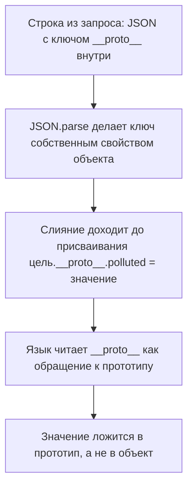
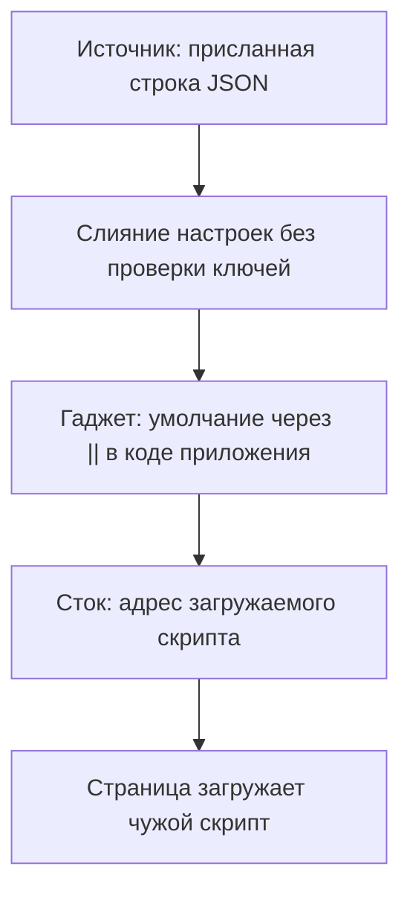

# Загрязнение прототипа

Вы пишете страницу настроек приложения. Пользователь выбирает тему и язык,
браузер отправляет выбор строкой JSON, а код сливает присланное с настройками
по умолчанию — так устроен каждый второй сайт. Однажды в логах вы замечаете
запрос, где вместо темы приехал ключ `__proto__`, а внутри него `isAdmin` со
значением `true`. Отклонить такой запрос не за что: формат верный, ключ как
ключ.

А через неделю выясняется, что проверка прав на странице ведёт себя странно:
у объекта, в котором прав нет вовсе, свойство `isAdmin` читается как `true`.
Никто его туда не записывал — оно появилось у всех объектов сразу. Так
выглядит загрязнение прототипа: чужое значение легло в общий образец, по
которому язык достраивает объекты. Дальше разберём, как запись из одного
запроса доезжает до каждого объекта на странице и что отделяет её от
исполнения чужого кода.

## Прототип: общий образец всех объектов

Объект в JavaScript — набор пар «имя — значение», и такие пары называют
свойствами. Когда код читает `user.name`, язык ищет свойство `name` в самом
объекте. Теперь опыт: возьмите только что созданный пустой объект и прочитайте
у него свойство, которое никто не записывал. Выражение `({}).toString` не даёт
ошибки, оно возвращает функцию. Откуда она взялась у пустого объекта?

Отвечает прототип. Прототип — это объект-образец, на который у всякого
объекта есть скрытая ссылка. Если свойства нет в самом объекте, язык идёт по
ссылке и ищет в образце, потом в образце образца — и так до конца цепочки.
Функция `toString` живёт в корневом образце `Object.prototype`, общем предке
всех обычных объектов. Зачем так устроено: общие свойства не копируются в
каждый объект, а хранятся в образце один раз. Миллион объектов делят одну
`toString`, и память не тратится на копии.

Бытовой пример — бланк заявления в отделе кадров. У каждого сотрудника свой
бланк, и заполнены в нём только фамилия и дата. Пункты формы и адрес
организации все читают из образца, который висит на стенде. Здесь бланк
соответствует объекту, заполненные графы — собственным свойствам, а образец
на стенде — прототипу. Граница у аналогии одна, и в этой теме она важнее
всего. Образец на стенде сотрудник поменять не может, а прототип меняет любой
код, который до него доберётся, — и новая строка появится на всех бланках
сразу.

Добраться до прототипа можно по имени `__proto__`. Это не обычное имя
свойства, а рычаг: язык перехватывает его и понимает как «дай ссылку на
прототип». Поэтому записать собственное свойство с таким именем в объектный
литерал не выйдет. Объектным литералом называют запись объекта прямо в коде,
фигурными скобками: `{ theme: 'dark' }`.

Собственным называют свойство, записанное в сам объект, а не унаследованное
из образца. Метод `hasOwnProperty` проверяет ровно это и в прототип не
заглядывает. Два опыта ниже различаются одним — тем, как создан объект. В
первом он записан литералом. Во втором та же запись пришла строкой и
разобрана через `JSON.parse`.

**Два опыта в консоли (исполняемый пример, Node.js 26)**

```javascript
({'__proto__':{}}).hasOwnProperty('__proto__')      // false
JSON.parse('{"__proto__":{}}').hasOwnProperty('__proto__')  // true
```

В первом опыте ключа нет: язык перехватил `__proto__` при разборе литерала,
и собственное свойство не возникло. Во втором есть: разборщик JSON про особое
имя ничего не знает и создаёт обычное собственное свойство. Запомните эту
развилку. Один и тот же ключ язык понимает по-особому, а разборщик строки —
как обычные данные, и атака строится ровно на этом зазоре.

## Как это работает

**Откуда это взялось.** Наследование через прототип в JavaScript было с самого
начала, а вот честного доступа к прототипу из кода не было. Браузеры добавили
свойство `__proto__` как своё расширение, и разработчики к нему привыкли.
Позже стандарт признал его частью языка — уже ради совместимости с
написанным. Одновременно объект стал типовым способом передать настройки, а
слияние настроек с умолчаниями — типовой операцией. Две привычки встретились,
и вышло так, что имя, которое язык понимает особым образом, приезжает в
слияние обычной строкой из запроса.

Вторая половина механизма — рекурсивное слияние. У приложения есть настройки
по умолчанию, а пользователь присылает свои, и их надо слить: взять умолчания
и перезаписать тем, что прислали. Настройки вложенные, например внутри `ui`
лежит `theme`, а внутри него `fontSize`. Поэтому слияние идёт вглубь:
встретив объект внутри объекта, оно вызывает само себя для внутренней пары.
Такая функция есть в любой библиотеке утилит, и в своём коде её пишут
постоянно.

Теперь следим за ключом `__proto__` из второго опыта. Объект с ним попадает в
слияние, и слияние уходит вглубь. В коде ключ подставляется через скобки,
`dst[key]`, но для перехвата разницы нет: запись через скобки действует так
же, как через точку. Поэтому чтение `dst['__proto__']` возвращает прототип,
и рекурсия делает его целью слияния.

На глубине выполняется присваивание вида `цель.__proto__.свойство = значение`:
язык читает `__proto__` как обращение к прототипу, и значение ложится в
прототип, а не в саму цель. Присваивание было одно, а запомнил его общий
образец всех объектов страницы.



**Описание схемы.** Схема читается сверху вниз и показывает путь одного ключа.
Строка из запроса проходит разбор JSON, и ключ `__proto__` становится
собственным свойством объекта. Слияние достаёт этот ключ и выполняет
присваивание, где `__proto__` стоит слева от точки. Язык перехватывает имя,
и значение записывается в прототип.

Проверим всю цепочку одним прогоном. Слияние ниже упрощено для примера, но
работает как настоящее: прогон исполняемый, и вывод под ним воспроизводится
командой `node` с этим файлом.

**Загрязнение целиком (исполняемый пример, Node.js 26)**

```javascript
function merge(dst, src) {
  for (const key in src) {
    if (typeof src[key] === 'object' && src[key] !== null) {
      dst[key] = dst[key] || {};
      merge(dst[key], src[key]);
    } else {
      dst[key] = src[key];
    }
  }
  return dst;
}

const body = '{"__proto__": {"polluted": "yes", "isAdmin": true}}';
const settings = merge({}, JSON.parse(body));
console.log(({}).polluted, ({}).isAdmin);
console.log([].polluted);
```

**Вывод команды**

```text
yes true
yes
```

Записи в пустой объект никто не делал, а чтение возвращает присланные
значения. То же видно и у пустого массива: массив наследует от
`Array.prototype`, а тот — от общего `Object.prototype`. Запись одна,
действует везде. Это и есть загрязнение прототипа: присланное значение по
ключу `__proto__` легло в прототип встроенного объекта, и всё, у чего своего
такого свойства нет, наследует подставленное.

## Как это атакуют

Сама по себе запись в прототип почти всегда безвредна. Появилось у всех
объектов свойство `polluted` — и что с того, кто его читает? Опасной запись
делает читатель. В теме `xss-dom` цепочка атаки разобрана как пара «источник —
сток»: источник даёт чужие данные, сток их исполняет. Здесь между ними стоит
третья часть, без которой цепочка не складывается, — гаджет.

Гаджет — это место в коде, которое читает свойство и передаёт его дальше без
проверки. Сам по себе гаджет — обычный рабочий код, и без загрязнения он
делает ровно то, что задумано. Условие одно: у объекта не должно быть своего
такого свойства, иначе своё победит наследованное. Бытовой образ — розетка
без защитной крышки: нормальная часть дома, пока кто-то не нашёл, что туда
можно вставить. Образ ломается в одном месте: розетку видно, и её закрывают
заранее. А гаджет выглядит как обычное чтение настройки, и находится он
только в связке с записью в прототип.

Источники перечисляет Академия PortSwigger — учебный полигон авторов Burp
Suite. Источников три: строка запроса или фрагмент адреса, вход в виде JSON
и сообщения между окнами — устройство последних разбирает тема
`postmessage-vulns`. Стоки те же, что в `xss-dom`: места, дающие исполнение,
например присвоение адреса загружаемому скрипту. Разница только в пути —
значение приходит в сток не напрямую из источника, а через свойство,
подставленное в прототип.

Типовой гаджет — чтение настройки с умолчанием. Академия показывает его одной
строкой: `config.transport_url || defaults.transport_url`. Пока свойства
`transport_url` нет ни у объекта настроек, ни в прототипе, оператор `||`
берёт умолчание. После загрязнения чтение уходит в прототип и возвращает
подставленное. Дальше это значение попадает в адрес загружаемого скрипта, и
цепочка замкнулась: страница загружает чужой код. Проверено прогоном: после
загрязнения выражение `opts.polluted || 'default'` на пустом объекте `opts`
возвращает подставленное значение вместо умолчания. Гаджет сработал.



**Описание схемы.** Схема читается сверху вниз и собирает цепочку атаки из
частей. Источник приносит строку с ключом `__proto__`, слияние записывает
значение в прототип. Гаджет читает это свойство как настройку, сток делает из
него адрес скрипта, и страница исполняет чужой код.

Чем кончается цепочка, зависит от стороны. На клиенте исход обычно один —
XSS в DOM из темы `xss-dom`. На сервере тот же приём доходит до выполнения
кода в процессе, и этот случай разбирает тема `prototype-pollution-server`.

Заметить такой дефект трудно, потому что три его части лежат в трёх разных
местах. Источник — в своём коде, в функции слияния настроек. Гаджет — чаще
всего в чужой библиотеке, где он написан как обычное умолчание. Сток — там же
или в браузерном интерфейсе. Ни одно из трёх мест по отдельности дефектом не
выглядит: слияние объектов — обычная операция, умолчание через `||` — обычная
идиома, присваивание адреса скрипту — обычная работа загрузчика. Академия
отмечает и мотив: разработчик, не знающий про этот класс уязвимостей, считает
такие свойства неуправляемыми снаружи и не проверяет их вовсе.

**Зачем это в работе AppSec-инженера.** Дефект живёт на стыке двух ревью:
источник обычно в приложении, а гаджет — в чужой библиотеке, и порознь оба
места читаются как безопасные. Ревьюеру нужен признак, который виден в своём
коде: рекурсивное слияние объектов без проверки ключей и объектные словари
там, где нужен словарь. Норма сформулирована прямо: код пишется так, чтобы
загрязнение прототипа было невозможным.

## Как это выглядит в коде

Прочитаем слияние из раздела «Как это работает» глазами ревьюера. Планов три:
найти точку входа недоверенных данных, проследить уход вглубь и понять,
откуда ключ `__proto__` взялся как собственное свойство.

**Уязвимое слияние (упрощено для примера)**

```javascript
// УЯЗВИМО — демонстрация, не для продакшена
function merge(dst, src) {
  for (const key in src) {                                    // (1)
    if (typeof src[key] === 'object' && src[key] !== null) {
      dst[key] = dst[key] || {};
      merge(dst[key], src[key]);                              // (2)
    } else {
      dst[key] = src[key];
    }
  }
  return dst;
}

const settings = merge({}, JSON.parse(await res.text()));     // (3)
```

1. Цикл по ключам присланного объекта — это вход недоверенных данных. Ключи
   берутся как есть, проверки на `__proto__` и `constructor` нет, поэтому
   опасный ключ беспрепятственно доходит до присваивания.
2. Рекурсивный вызов для вложенного объекта — это уход вглубь. Именно на
   глубине `__proto__` оказывается слева от точки в присваивании, и значение
   ложится в прототип.
3. Объект настроек получен разбором строки JSON — это источник. В таком
   объекте `__proto__` — собственное свойство, и цикл его увидит; из
   литерала, записанного в самом коде, этот ключ бы не приехал.

Признаки в коде: цикл `for ... in` по присланному объекту, рекурсивный вызов
слияния, функция с именем `merge`, `extend`, `deepAssign` или `setValue`.
Второй признак — объект-словарь, ключи которого приходят снаружи:
`counts[name] += 1` на обычном объекте.

Разобранный пример — правило темы в миниатюре: дефект не сидит ни в одной
строке отдельно. Он складывается из трёх обычных вещей — входа без проверки
ключей, рекурсии вглубь и источника, где `__proto__` приехал обычной строкой.
Уберите любую из трёх частей, и пример перестаёт работать. Проверим это
вопросом: тот же код слияния, но объект собран литералом в самом коде, без
разбора JSON, — уязвим он или нет? Разбор ответа ждёт в самопроверке.

## Как защититься

Правило одно: структура, у которой нет связи с прототипом, либо проверка
ключей на входе. Исправленный вариант держится на трёх приёмах. Читать его
стоит по одному приёму за раз: чем заменён словарь, чем заменён объект
настроек, как устроен отсев ключей.

**Исправленный вариант (упрощено для примера)**

```javascript
// Исправлено.
const counts = new Map();                       // (1)
counts.set(name, (counts.get(name) ?? 0) + 1);

const settings = Object.create(null);           // (2)
merge(settings, safeKeys(JSON.parse(body)));

const BANNED = new Set(['__proto__', 'constructor', 'prototype']);
function safeKeys(obj) {                        // (3)
  for (const key of Object.keys(obj)) if (BANNED.has(key)) delete obj[key];
  return obj;
}
```

1. Словарь по ключам от пользователя заменён на `Map`. У `Map` ключи — не
   свойства объекта, и наследование в поиске ключа не участвует вовсе. OWASP
   Prototype Pollution Prevention Cheat Sheet ставит эту меру первой.
   Оператор `??` берёт правое значение, только когда левое равно `null` или
   `undefined`. Проверено прогоном: после загрязнения прототипа проверка
   `new Map().has('polluted')` даёт `false`.
2. Объект настроек создан без прототипа, вызовом `Object.create(null)`.
   Загрязнённому свойству неоткуда наследоваться: проверено прогоном, у
   такого объекта оно не читается.
3. Отсев ключей `__proto__`, `constructor` и `prototype` стоит вторым
   рубежом, а не основной мерой. Он перечисляет запрещённое, и потому несёт
   слабое место любого чёрного списка — что именно он не видит, показано
   ниже.

**Границы применимости.** У отсева из примера одно коренное слабое место: он
смотрит только верхний уровень объекта. Поэтому ключ `__proto__`, спрятанный
глубже внутри JSON, проходит: строка `{"a": {"__proto__": {"mark": "x"}}}`
несёт наверху безобидный ключ `a`, а на глубине списка уже нет. Проверено
прогоном: после такого слияния `({}).mark` читается.

По той же причине проходит и цепочка `constructor.prototype`. У любого
объекта свойство `constructor` ведёт к функции-конструктору, у неё есть
свойство `prototype`, и это тот же общий образец. Ключи `constructor` и
`prototype` в списке есть, но глубже верхнего уровня список не смотрит, и
строка `{"a": {"constructor": {"prototype": {"mark": "y"}}}}` доезжает.
Дальше исход зависит от режима. Модуль — файл с `import` и `export`, там
всегда строгий режим — падает с `TypeError`: служебное свойство `prototype`
у функции перезаписать нельзя. Классический скрипт ту же запись выполняет
молча, и значение ложится в прототип. Оба исхода проверены прогоном.

Поэтому отсев стоит рядом со структурой без прототипа, а не вместо неё.

Cheat sheet называет и тяжёлую меру — заморозку прототипа через
`Object.freeze`. Тут же оговорена её цена: приложение ломается, если
какая-нибудь из его библиотек правит встроенные прототипы. Там же сказано,
что удаление `__proto__` закрывает не всё. В Node.js это флаг запуска
`--disable-proto=delete`; проверено прогоном: с флагом обращение `__proto__`
даёт `undefined`, а цепочка `constructor.prototype` по-прежнему ведёт к
образцу.

**Чего починка одного места не даёт.** Убрать источник в своём коде полезно,
но источников три, и один из них — сообщение между окнами, их разбор в теме
`postmessage-vulns`. Убрать гаджет в чужой библиотеке нельзя вовсе — можно
только обновить её или заменить.

## Как убедиться, что защита работает

Защита доказывается повторением атаки: та же строка JSON с ключом
`__proto__`, то же слияние, те же чтения. Если хоть одно чтение вернуло
присланное значение, защиты нет. Проверку запускают новым процессом, и вот
почему: цикл `for ... in` перебирает не только собственные ключи, но и
унаследованные. В процессе, где прототип уже грязный от прошлого опыта,
слияние притащит эти ключи в чистый объект настроек даже после отсева.
Проверка покажет протечку, к которой исправление отношения не имеет.
Проверено прогоном: в грязном процессе `settings.polluted` читается как
собственное свойство.

**Повторный прогон после исправления (исполняемый пример, Node.js 26)**

```javascript
// Запускать новым процессом: прототип на старте должен быть чистым.
function merge(dst, src) {
  for (const key in src) {
    if (typeof src[key] === 'object' && src[key] !== null) {
      dst[key] = dst[key] || {};
      merge(dst[key], src[key]);
    } else {
      dst[key] = src[key];
    }
  }
  return dst;
}

const BANNED = new Set(['__proto__', 'constructor', 'prototype']);
function safeKeys(obj) {
  for (const key of Object.keys(obj)) if (BANNED.has(key)) delete obj[key];
  return obj;
}

const body = '{"__proto__": {"polluted": "yes", "isAdmin": true}}';
const settings = Object.create(null);
merge(settings, safeKeys(JSON.parse(body)));
console.log(({}).polluted, [].polluted);
console.log(new Map().has('polluted'), settings.polluted);
```

**Вывод команды**

```text
undefined undefined
false undefined
```

Каждый результат читается отдельно. Пара `undefined` у пустого объекта и
пустого массива говорит, что прототип чист и запись не доехала. `false` у
`Map` означает, что словарь про наследование не знает в принципе. Последний
`undefined` показывает, что сам объект настроек опасный ключ не получил: его
отсёк `safeKeys`. Четыре чтения, четыре подтверждения — и каждое про свою
меру.

На ревью пройдите по списку.

1. Проверьте, что словари, ключи которых приходят снаружи, построены на `Map`
   или на объекте без прототипа, а не на объектном литерале
   (ASVS v5.0-15.3.6).
2. Проверьте, что рекурсивное слияние объектов отсеивает ключи `__proto__`,
   `constructor` и `prototype`.
3. Проверьте, что объект, полученный разбором строки JSON, не сливается с
   настройками без проверки ключей.
4. Проверьте, что сообщения между окнами и значения из адреса не попадают в
   слияние настроек напрямую.
5. Проверьте, что в коде нет чтения настроек через `||` и `??` там, где
   значение идёт дальше в опасный сток.
6. Проверьте, что библиотеки, принимающие объект настроек, обновляются по
   расписанию: гаджет чаще всего находится в них.

## Частая ошибка

Представьте ревью, где нашлось загрязнение прототипа. Что чинить первым
делом? Решите до чтения дальше.

Частый вывод: загрязнение прототипа — дефект библиотеки слияния объектов, и
починка сводится к её обновлению. Он неверен, потому что дефект складывается
из трёх частей, и лежат они в разных местах. Обновление убирает источник,
если он был в библиотеке. Гаджет от этого никуда не девается: он живёт в
другом коде и сработает от любого другого источника. Верно и обратное:
приложение с безопасным слиянием остаётся уязвимым, если ключи попадают в
прототип через объектный словарь.

Контрпример из прогонов этой темы. Загрязнение сделано один раз, одной
строкой JSON. После неё свойство читается у нового пустого объекта, у пустого
массива и у объекта настроек, к которому эта строка отношения не имела. Ни
одна из трёх точек чтения не связана с местом записи ни вызовом, ни ссылкой.
Чинить «место записи» здесь значит чинить три места сразу — или разрывать
связь, как это делают `Map` и объект без прототипа.

## Попробуй сам

Возьмите консоль браузера или Node.js и проведите три опыта на своей машине,
не трогая чужие системы.

Первый опыт — два вызова из раздела «Прототип: общий образец всех объектов»:
`({'__proto__':{}}).hasOwnProperty('__proto__')` и
`JSON.parse('{"__proto__":{}}').hasOwnProperty('__proto__')`. Ожидается
`false`, затем `true`: литерал отдаёт ключ прототипу, а разборщик строки
создаёт собственное свойство.

Второй опыт: присвойте `Object.prototype.mark = 'x'` и прочитайте `mark` у
нового пустого объекта и у пустого массива. Оба чтения вернут `'x'`: запись
в общий образец видна всем, у кого своего такого свойства нет.

Третий опыт: повторите чтение у `Object.create(null)` и через
`new Map().has('mark')`. Ожидается `undefined` и `false`: у объекта без
прототипа читать наследованное неоткуда, а `Map` ключи хранит вне
наследования.

**Критерий выполнения** наблюдаемый: три пары результатов и одно предложение
о том, почему второй опыт объясняет, зачем в третьем нужна другая структура.
Прототип после опытов вернуть на место: `delete Object.prototype.mark`.

## Проверь себя

1. Предскажите, что напечатает эта программа, и почему второе значение именно
   такое?

   ```javascript
   const a = JSON.parse('{"__proto__": {"mark": 1}}');
   console.log(a.hasOwnProperty('__proto__'), ({}).mark);
   ```

2. Слияние из раздела «Как это выглядит в коде» берёт ключи из присланного
   объекта и уходит вглубь без проверки. Какая правка устраняет дефект?

   A. Отсеивать ключ `__proto__` на входе чёрным списком.

   B. Строить словари на `Map`, а настройки — на `Object.create(null)`.

   C. Обновить библиотеку слияния, в которой нашли загрязнение.

3. Почему без гаджета запись в прототип чаще всего безвредна?

4. Тот же код слияния, но объект собран литералом в самом коде, без разбора
   JSON:

   ```javascript
   const settings = merge({}, { theme: 'dark', '__proto__': { mark: 1 } });
   ```

   Уязвим ли он и почему?

5. Возврат к теме `xss-dom`: чем стоки этой темы отличаются от стоков XSS в
   DOM?

<details markdown="1">
<summary>Ответ 1</summary>

1. `true undefined`. Разборщик JSON видит в `__proto__` обычную строку, и ключ
   становится собственным свойством объекта. А прототип при этом не тронут:
   загрязнения нет, потому что разбор — не слияние, присваивания вглубь не
   было. Прогон: `node probe.mjs` с фрагментом из вопроса.

</details>

<details markdown="1">
<summary>Ответ 2: разбор вариантов</summary>

2. Верный ответ — B.

   A. Неверно как единственная мера. Отсев перечисляет запрещённое, а тот же
      результат достигается через цепочку `constructor.prototype`: чёрный
      список годится вторым рубежом, не основным.

   B. Верно. У `Map` ключи не свойства объекта, и наследование в поиске ключа
      не участвует; у объекта без прототипа читать загрязнённое неоткуда.
      Структура разрывает связь, а не перечисляет опасные имена.

   C. Неверно. Дефект складывается из трёх частей в трёх местах. Обновление
      убирает источник, если он был в библиотеке. А гаджет живёт в другом
      коде и сработает от любого другого источника.

</details>

<details markdown="1">
<summary>Ответ 3</summary>

3. Гаджет — место, где код читает свойство и передаёт его дальше без
   проверки. Без него подставленное свойство никто не читает, и запись ничего
   не меняет.

</details>

<details markdown="1">
<summary>Ответ 4</summary>

4. Нет. В записи литералом ключ `__proto__` собственным свойством не
   становится — язык понимает его как обращение к прототипу, и в цикл слияния
   он не попадает. Поэтому источник дефекта — именно разбор строки, а не
   любой объект. Прогон сравнения, файл `probe.mjs`:

   ```javascript
   const lit = { '__proto__': {} };
   const parsed = JSON.parse('{ "__proto__": {} }');
   console.log(lit.hasOwnProperty('__proto__'),
               parsed.hasOwnProperty('__proto__'));
   ```

   ```bash
   node probe.mjs
   ```

   ```text
   false true
   ```

</details>

<details markdown="1">
<summary>Ответ 5</summary>

5. Ничем: стоки те же. Разница в пути к ним — значение приходит не из
   источника напрямую, а через свойство, подставленное в прототип.

</details>

## Источники

1. PortSwigger Web Security Academy, «Prototype pollution»; реестр
   `ps-prototype-pollution`. Разделы: What is prototype pollution, How do
   prototype pollution vulnerabilities arise, Prototype pollution sources,
   Prototype pollution via the URL, Prototype pollution via JSON input,
   Prototype pollution sinks, Prototype pollution gadgets, Example of a
   prototype pollution gadget.
   <https://portswigger.net/web-security/prototype-pollution>
2. OWASP Prototype Pollution Prevention Cheat Sheet; реестр
   `owasp-cs-prototype-pollution`. Разделы: Explanation, Use `new Set()` or
   `new Map()`, If objects or object literals are required, Use object
   freeze and seal mechanisms, Node.js configuration flag.
   <https://cheatsheetseries.owasp.org/cheatsheets/Prototype_Pollution_Prevention_Cheat_Sheet.html>

Каркас этапа: `owasp-asvs-5-document` (ASVS v5.0.0), `owasp-wstg-42`,
`owasp-top10-2025`. Наследуются всеми темами и отдельной строкой не
повторяются.

**Скоропортящийся слой.** Набор гаджетов привязан к версиям библиотек и
меняется вместе с ними. Флаг запуска Node.js и поведение встроенных объектов
зависят от версии среды. Страницы академии и cheat sheet — живые площадки без
даты публикации.

**Маркеры уверенности.** Поведение языка — **проверено лично** 2026-08-24 в
браузере `HeadlessChrome/152.0.7977.42`: ключ `__proto__` у объекта из
`JSON.parse` оказывается собственным свойством; в объектном литерале
собственного свойства не возникает (дополнительно проверено 2026-09-03 на
Node.js v26.8.1); после слияния такого объекта свойства `polluted` и
`isAdmin` читаются у нового пустого объекта и у пустого массива; выражение
`opts.polluted || 'default'` возвращает подставленное значение; у
`Object.create(null)` свойство не читается; `new Map().has` даёт
ложь. Прогоны повторены 2026-10-03 на Node.js v26.10.0, вывод совпал
дословно. Там же проверены новые для темы факты: отсев ключей верхнего
уровня пропускает `__proto__`, спрятанный глубже внутри JSON; вложенная
цепочка `constructor.prototype` в модуле падает с `TypeError`, а в
классическом скрипте довозит значение до прототипа; при флаге
`--disable-proto=delete` обращение `__proto__` даёт `undefined`, а цепочка
`constructor.prototype` работает; в процессе с уже загрязнённым прототипом
цикл `for ... in` переносит унаследованные ключи в чистый объект. Разбор
цепочки на
источник, гаджет и сток, список источников и пример гаджета с адресом скрипта
— **по документации** (Web Security Academy, открыта лично 2026-08-24). Меры
защиты, оговорка про заморозку прототипа и про цепочку `constructor.prototype`
— **по документации** (Prototype Pollution Prevention Cheat Sheet, открыт
лично 2026-08-24). Требование 15.3.6 сверено с текстом ASVS v5.0.0 (открыт
лично 2026-08-24). Отсутствие CWE-1321 в списках сопоставленных слабостей —
**проверено лично** 2026-08-24 поиском по всем десяти страницам категорий
издания 2025 года. Раскрутка загрязнения до исполнения кода через настоящий
гаджет библиотеки лично **не воспроизводилась**: стенда с такой библиотекой
не собиралось.
