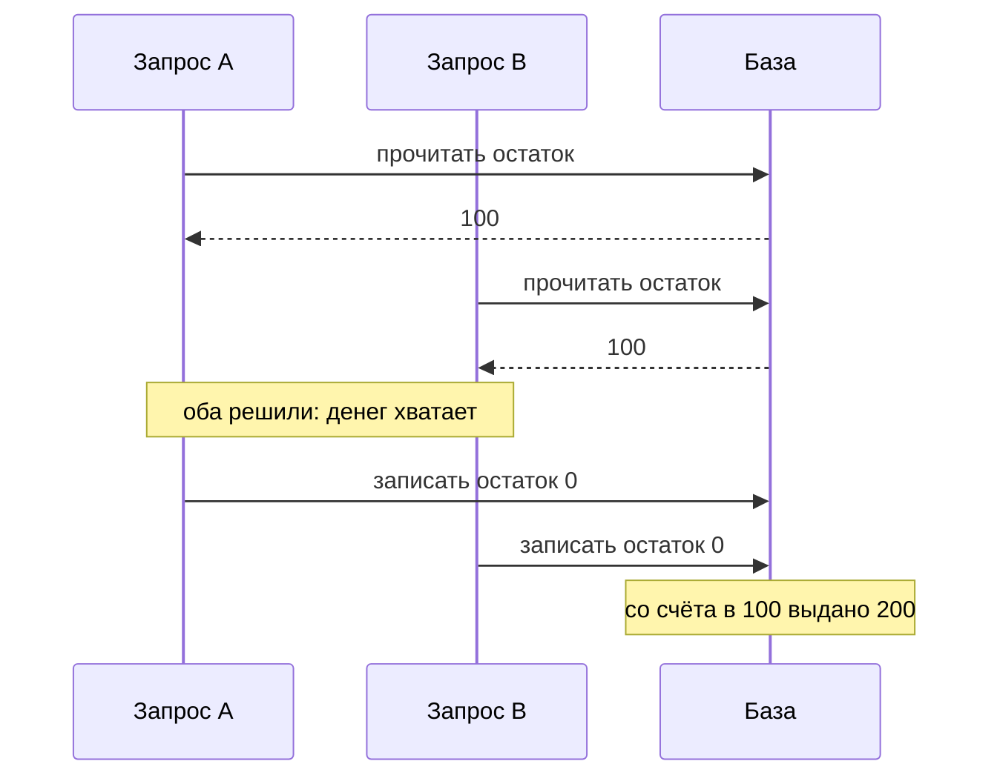

# Гонки: TOCTOU, limit overrun, single-packet

Обработчик с пределом вы писали сами: прочитать остаток на счёте, сравнить
с суммой снятия, записать новое значение. Проверка честная, остаток
настоящий. Теперь представьте, что такому обработчику прислали двадцать
запросов одновременно. Вот прогон стенда этой темы, сто запусков:

```text
обработчик            перерасход  снятий сред  макс
без транзакции            58 из 100         3.62    19
атомарный UPDATE           0 из 100         1.00     1
```

В 58 прогонах из ста со счёта в сто единиц деньги выдали больше одного раза,
в худшем — девятнадцать раз. При этом ошибки в проверке нет: сравнение
верное, остаток настоящий. Неверно другое: между чтением остатка и записью
нового значения состояние успевает измениться, потому что рядом работает
второй запрос. Арифметика верная, итог неверный.

Что значат две строки таблицы. Первая — обработчик без защиты от
одновременности: чтение и запись уходят в базу разными операциями и ничем не
склеены. Транзакция — это как раз способ склейки: просьба к базе выполнить
несколько операций как одно целое, где либо выполнятся все, либо отменятся
все. Во второй строке склейка доведена до предела: решение и запись стали
одной операцией базы, условие проверяется в момент записи, и щели между
ними нет. Чем транзакция против гонки помогает, а чем нет — тема отдельного
раздела.

Это и есть гонка: дефект, при котором две одновременные обработки трогают
одни и те же данные, и исход решает, чья операция успела раньше. Промежуток
между чтением и записью, в котором столкновение возможно, называют окном
гонки. А проверку, оторванную от применения, — TOCTOU, от английского
time-of-check to time-of-use, «время проверки против времени использования».

Бытовой пример — два операциониста в банке, которые обслуживают один счёт в
разных окнах. Первый смотрит в журнал: на счёте сто рублей. Второй смотрит
в тот же журнал и видит те же сто. Оба решают, что денег хватает, и каждый
выдаёт по сто. Журнал здесь соответствует базе данных, а пауза между
«посмотрел» и «записал» — окну гонки. Где пример перестаёт работать: живые
операционисты увидели бы друг друга и договорились, а обработчики на сервере
друг про друга не знают вовсе.

Предыдущая тема маршрута, `business-logic-flaws`, разбирала правило,
нарушенное порядком шагов: там обход повторяется при каждой попытке. Здесь
порядка нет вовсе: два запроса приходят одновременно, и каждый видит
состояние до того, как второй его изменил. Предел, записанный в коде
правильными словами, снимается тем, что его проверяют и применяют разными
операциями.

**Зачем это в работе AppSec-инженера.** Вопрос к любому обработчику с
пределом короткий: чем предел удержан, если два таких запроса придут в одну
миллисекунду. Ответ читается по числу операций между чтением и записью.

## Подумай, прежде чем читать

1. Обработчик читает остаток, сравнивает с суммой и списывает. Сколько раз
   можно снять 100 со счёта, где лежит 100, если прислать двадцать запросов
   сразу?
2. Тот же код обёрнут в транзакцию. Что изменится и от чего это зависит?
3. Окно гонки длится доли миллисекунды. Что мешает атакующему в него попасть,
   если запросы идут по сети с разной задержкой?

## Как это работает

**Откуда это взялось.** Одновременность появилась задолго до веба: два
процесса, работающие с одним файлом, спорили за него ещё в системах
разделения времени. Веб добавил к этому две вещи. Первая — сервер
обрабатывает запросы параллельно по умолчанию, а разработчик пишет обработчик
так, будто тот на свете один. Вторая — момент отправки запросов выбирает
клиент. Окно, которое раньше открывалось случайно, стало открываться по
команде извне.

Разберёмся, откуда на сервере берётся параллельность. Запросы не стоят в
очереди по одному: сервер обрабатывает их одновременно, в нескольких потоках
или процессах. Поток — это независимая линия выполнения внутри одной
программы. Два потока могут исполнять один и тот же обработчик в один и тот
же момент, и у каждого своя точка, на какой он строке. Поэтому картина
«запрос пришёл, обработался, ушёл, пришёл следующий» неверна по умолчанию.
Верна картина из вступления, где два запроса читают один остаток.



**Описание схемы.** Схема читается сверху вниз и показывает два одновременных
запроса на снятие. Оба читают остаток до того, как кто-либо успел записать,
поэтому оба видят сто и оба решают, что денег хватает. Затем оба записывают
ноль, и со счёта в сто единиц выплачено двести.

Окно гонки на этой схеме — промежуток между первым чтением и последней
записью. Формально оно начинается, когда первый запрос прочитал состояние, и
кончается, когда он его записал. Всё, что второй запрос успевает сделать
внутри этого промежутка, первый уже не увидит: решение он принял раньше.

### Окно гонки на прогоне

Стенд ставит счёт с остатком 100 и отпускает двадцать потоков, каждый просит
снять по 100. Обработчик читает остаток, сравнивает и записывает новое
значение. Правильный ответ — одна выдача.

```text
$ python e01-toctou.py
Python 3.14.7, SQLite 3.53.4
20 потоков просят снять по 100 со счёта с балансом 100; 100 прогонов

обработчик            перерасход  снятий сред  макс  отказов СУБД
без транзакции            58 из 100         3.62    19           0.0
BEGIN (deferred)           0 из 100         1.00     1          11.4
BEGIN IMMEDIATE            0 из 100         1.00     1           0.0
атомарный UPDATE           0 из 100         1.00     1           0.0
```

Первая строка — дефект. В 58 прогонах из 100 со счёта в 100 единиц выдали
больше одного раза, в худшем прогоне — девятнадцать. Никакой ошибки в коде
проверки нет: сравнение верное, остаток настоящий. Неверно то, что между
чтением и записью состояние успевает измениться. Вопрос до разбора: чем три
правильные строки таблицы отличаются от первой по устройству, а не по числам?

Теперь по именам в этих строках, потому что они новые. `BEGIN (deferred)` —
обычная транзакция: чтение и запись склеены, но прочитанную строку никто не
удерживает, и база разбирает столкновения отказом «база занята». Отсюда
последний столбец: в среднем 11,4 отказа на двадцать запросов.
`BEGIN IMMEDIATE` — транзакция, которая при входе сразу берёт блокировку на
запись: до её конца писать никто другой не может, и отказов нет.
«Атомарный UPDATE» — вообще одна операция: условие и вычитание живут в одном
запросе. Почему первая из трёх строк — ловушка, а не решение, разобрано в
разделе «Частая ошибка».

### Что расширяет окно

Второй стенд меняет две величины: паузу между проверкой и списанием и число
одновременных запросов. В клетке — доля прогонов из двухсот, в которых
списали дважды.

```text
$ python e03-window.py
пауза между проверкой и списанием         2 зпр.        5 зпр.       20 зпр.
нет                                         62 %          89 %          97 %
0,1 мс                                      90 %         100 %         100 %
1 мс                                        99 %         100 %         100 %
10 мс                                      100 %         100 %         100 %
```

Верхняя левая клетка отвечает на третий предвопрос. Двух запросов без всякой
искусственной паузы хватает в 62 случаях из ста. Окно шире, чем кажется: в
него входит не только вызов базы, но и всё, что обработчик успевает сделать
между чтением и записью.

Дальше видно, чем окно расширяется. Любая работа внутри окна — обращение к
соседней службе, отправка письма, запись в журнал, разбор шаблона — переводит
вероятность к единице. Число запросов действует так же: пять параллельных
запросов дают почти гарантию там, где два дают две трети.

### Как атакующий выравнивает запросы

Числа из прогонов сняты на стенде, где сети нет вовсе. По сети мешает разброс
времени доставки: два запроса, отправленных вместе, доходят порознь, потому
что пакеты идут с разной задержкой. Против этого разброса академия
PortSwigger — учебный полигон авторов Burp Suite — описывает два приёма.

Для HTTP/1 это синхронизация по последнему байту: тела запросов отправляются
заранее, а последние байты всех запросов — вместе, и сервер достраивает их в
одну миллисекунду. Для HTTP/2 — атака одним пакетом. В HTTP/2 много запросов
идёт по одному соединению, и их части чередуются внутри него. Завершающие
части двадцати-тридцати запросов можно уложить в один TCP-пакет. Тогда они
доходят до сервера без разброса вовсе.

Второй источник разброса — сам сервер: даже пришедшие вместе запросы он
раздаёт потокам с разной скоростью. Против него академия советует слать не
два запроса, а два-три десятка: чем их больше, тем выше шанс, что хотя бы
пара попадёт в одно окно. Лично эти приёмы не воспроизводились: стенд
работает в одном процессе, и сетевого разброса в нём нет.

### Предел, который снимают повтором

Второй подкласс гонок называют превышением предела, limit overrun. Правило
говорит «один раз»: один промокод, один голос, одна выплата бонуса.
Обработчик проверяет отметку, начисляет и ставит отметку — те же три
операции, и между ними то же окно.

```text
$ python e02-limit.py
20 одновременных запросов на одноразовый промокод, 100 прогонов

обработчик                              сверхлимит  макс начислений
проверка, начисление, отметка               80 из 100               20
уникальный ключ в схеме                      0 из 100                1
условие внутри UPDATE                        0 из 100                1
```

Восемьдесят прогонов из ста дали больше одного начисления, в пределе — все
двадцать. Две нижние строки — два способа починки, и оба разобраны в разделе
«Как защититься». «Уникальный ключ в схеме» — это правило, записанное в
описании таблицы. Двух строк с одинаковой парой кода и пользователя в базе
быть не может: вторую вставку отвергает сама база. «Условие внутри UPDATE»
— знакомый приём из вступления, где решение и запись слились в одну операцию.

WSTG, руководство OWASP по тестированию веб-приложений, выделяет предел на
число вызовов функции в отдельный тест. Раздел о починке требует ставить
ограничение на уровне базы или счётчика на бэкенде, а не на уровне
интерфейса. Строки второго и третьего вариантов показывают ровно эти два
способа.

### Скрытые подсостояния

Академия PortSwigger идёт дальше двух подклассов. Один запрос нередко
запускает целую последовательность шагов внутри себя, и приложение проходит
через состояния, которых снаружи не видно. Их и называют скрытыми
подсостояниями. Пример академии — вход со вторым фактором, когда после
пароля требуется ещё одно подтверждение, например код из приложения на
телефоне. Сессия уже помечена вошедшей, а требование второго фактора
выставляется следующей строкой. Между этими двумя строками существует
состояние «вошёл без второго фактора», и параллельный запрос к закрытому
адресу в него попадает.

Отсюда методика поиска, которую академия предлагает вместо перебора всех
адресов. Сначала отобрать те обработчики, где столкновение вообще возможно:
два запроса должны трогать одну запись. Затем снять образец поведения при
последовательной отправке и сравнить с поведением при одновременной — годится
любое отклонение, включая содержание письма или изменение, заметное позже.
И только затем убрать лишние запросы и убедиться, что действие повторяется.

### Две ловушки поиска

Академия называет ещё две вещи, без которых поиск даёт ложный отрицательный
ответ.

Первая — блокировка по сессии. Часть окружений обрабатывает запросы одной
сессии по одному: так устроен штатный обработчик сессий в PHP. Со стороны это
выглядит как отсутствие гонки: запросы идут друг за другом, столкновений нет.
Отличить это от настоящей защиты можно одним приёмом — послать те же запросы
с разными токенами сессии. Если столкновения появились, гонка была всё время.

Вторая — частично собранный объект. Приложение создаёт запись в несколько
шагов: сперва пользователь, затем его ключ доступа. Между шагами существует
запись, у которой ключ ещё не заполнен, и сравнение с этим незаполненным
значением проходит, если прислать пустоту нужного вида. Академия показывает
это на разборе параметров: часть окружений превращает параметр без значения
в пустой список или в `null`, и такое значение сходится с неинициализированным
полем.

Оба случая объединяет одно: столкновение существует не между двумя записями,
а между двумя мгновениями жизни одной. Искать его надо не по числу запросов,
а по числу шагов внутри одного обработчика. Отсюда и первый вопрос к
незнакомому коду: сколько раз этот обработчик трогает хранилище и что видно
между обращениями.

## Как это атакуют

Стенд — лаба этой темы (`pilot/lab/race-conditions`). В нём живёт учебный
кошелёк: он выдаёт деньги со счёта и применяет одноразовый промокод. Оба
обработчика читают состояние и записывают решение разными запросами, то есть
содержат ровно ту форму, которая разобрана выше. Роль атакующего играет файл
`hack.py`: эксплойт, программа, которая использует дефект. Он шлёт двадцать
потоков и повторяет каждый опыт тридцать раз.

```text
$ python hack.py
счёт: 100, код: SALE, потоков: 20, прогонов: 30

  опыт 1 — 20 снятий по 100: перерасход в 17 из 30, выдач до 15
  опыт 2 — 20 применений кода: сверхлимит в 22 из 30, начислений до 20
  опыт 3 — контроль, последовательная работа: сохранена
```

Опыт 1 снимает со счёта в сто единиц до пятнадцати выдач по сто. Опыт 2
применяет одноразовый код до двадцати раз. Опыт 3 — контроль:
последовательная работа кошелька обязана сохраниться и после починки.

Числа плавают от прогона к прогону, и это свойство предмета, а не стенда:
перерасход появляется в 15–20 прогонах из 30. Вывод из этого практический.
Гонку не опровергают одной неудачной попыткой: отсутствие столкновения в
одном прогоне не говорит ни о чём. Доказательством служит повторяемость на
серии.

Тяжесть считается тем, что удалось превысить. Тот же дефект на выводе средств
даёт убыток на кратный остаток, на промокоде — на стоимость скидки. На
счётчике неудачных входов он снимает защиту от перебора пароля целиком.

## Как это выглядит в коде

Ревьюер ищет форму «прочитал, посчитал у себя, записал обратно». Разбор идёт
тремя планами: найти чтение состояния, найти решение по прочитанному, найти
запись числа, посчитанного в приложении. Окно образуют несколько строк —
отметьте их сами до чтения выносок.

```python
# УЯЗВИМО — демонстрация, не для продакшена
def withdraw(amount):
    conn = sandbox.connect()
    balance = conn.execute(
        "SELECT balance FROM acct WHERE id=1").fetchone()[0]   # (1)
    if balance < amount:
        return "недостаточно средств"
    conn.execute("UPDATE acct SET balance=? WHERE id=1",       # (2)
                 (balance - amount,))
    return "выдано"
```

1. Читается остаток, и с этого мгновения он устарел: до записи ниже его может
   изменить соседний запрос, а решение останется принятым по старому числу.
2. Записывается число, посчитанное в приложении. Правка соседнего запроса,
   пришедшая между строками, затирается без следа.

**Тот же дефект на другом стеке.** В Node на любой
ORM (Object-Relational Mapping) он выглядит так же. ORM — слой, который
превращает строки базы в объекты языка, чтобы код работал с объектами, а не
с текстом запросов. Как такой слой собирает запросы с параметрами, разбирает
тема `parameterized-queries`:

```javascript
// ФРАГМЕНТ — срез, самостоятельно не компилируется
// УЯЗВИМО — демонстрация, не для продакшена
const acct = await Account.findByPk(1);
if (acct.balance < amount) return "недостаточно средств";
await acct.update({ balance: acct.balance - amount });
```

Инвариант — «новое значение посчитано над прочитанным, а не над столбцом».
Декорация — язык и слой доступа к данным.

**Где ревьюер промахивается.** Первый промах — искать слово «поток»: в
веб-приложении потоков в коде нет, параллельность даёт сервер. Второй —
считать чтение безопасным, если оно и запись стоят рядом: расстояние в
строках не имеет отношения к ширине окна. Третий — принимать ORM за защиту:
академия отдельно предупреждает, что слой, прячущий транзакции, берёт на себя
ответственность за них, но не обязательно её несёт.

## Как защититься

Меры перечислены от сильной к слабой, и первые две закрывают почти всё. У
каждой сказано и что делать, и почему это работает.

- **Решение и запись — одна операция.** Условие переносится внутрь
  изменяющего запроса, а новое значение считается над столбцом:
  `SET balance=balance-? WHERE id=1 AND balance>=?`. Ответ клиенту решает
  число затронутых строк: если условие не прошло, запрос не тронул ни одной
  строки, и приложение отвечает отказом. ASVS требует, чтобы проверка
  состояния ресурса и зависящее от неё действие выполнялись одной неделимой
  операцией (v5.0-15.4.2).
- **Правило переносится в схему.** Уникальный ключ на пару кода и
  пользователя отвергает второе начисление силами базы. ASVS называет
  блокировку на уровне бизнес-логики обязательной там, где ресурс ограничен
  по количеству, — места в зале, окна доставки (v5.0-2.3.4).
- **Строка берётся под запись до чтения.** Там, где условие в один запрос не
  укладывается, читать нужно с намерением записать: `SELECT … FOR UPDATE` в
  PostgreSQL, `BEGIN IMMEDIATE` в SQLite. Такое чтение ставит блокировку на
  строку, и соседний запрос ждёт конца транзакции. Документация PostgreSQL
  говорит об этом прямо: при незапрещённой параллельной записи текущее
  состояние строки удерживают только `SELECT FOR UPDATE`, `SELECT FOR SHARE`
  или блокировка таблицы.
- **Хранилища не подпирают друг друга.** Сессия не годится как замок для
  базы, а счётчик в кеше — как предел для денег. Академия называет это
  отдельным правилом: не смешивать данные из разных мест хранения.

```python
# Исправлено: условие и новое значение живут внутри одного UPDATE.
def withdraw(amount):
    conn = sandbox.connect()
    cursor = conn.execute(
        "UPDATE acct SET balance=balance-? WHERE id=1 AND balance>=?",
        (amount, amount))
    return "выдано" if cursor.rowcount == 1 else "недостаточно средств"
```

Отдельного чтения нет вовсе, и окну негде открыться. Решение принимает база
по числу строк, попавших под условие.

**Где это не работает.** Одна операция закрывает одну запись. Если правило
связывает две таблицы — списать со счёта и создать заказ, — атомарной должна
стать пара изменений. Это уже транзакция с явной блокировкой либо уровень
изоляции `serializable`. Уровень изоляции — настройка, решающая, что видят
параллельные транзакции. Самый строгий из них, `serializable`, выдаёт
результат, как будто транзакции шли по одной. Цена — отказы при конфликте,
которые приложение обязано повторять. ASVS требует того же от
бизнес-операции целиком: она либо выполняется вся, либо откатывается
(v5.0-2.3.3).

Отдельный случай — операции, которых в базе нет. Отправка письма и вызов
платёжного шлюза не откатываются, и порядок «сначала запись, потом внешний
вызов» здесь важнее любой блокировки.

**Что добавляется поверх.** Ограничения целостности в схеме ловят то, что
пропустил код. Требование к многопоточному коду — обращаться к общим объектам
через потокобезопасные типы и примитивы синхронизации (v5.0-15.4.1) —
закрывает кеши и файлы, до которых база не достаёт. Потокобезопасным называют
тип, у которого одновременные обращения из разных потоков не портят
состояние.

## Как убедиться, что защита работает

Ретест, то есть повторная проверка после починки, повторяет опыты эксплойта
и добавляет то, что обязано работать. Тот же `hack.py` запускается против
исправленного файла:

```text
$ LAB_TARGET=solution.py python hack.py
  опыт 1 — 20 снятий по 100: перерасход в 0 из 30, выдач до 1
  опыт 2 — 20 применений кода: сверхлимит в 0 из 30, начислений до 1
  опыт 3 — контроль, последовательная работа: сохранена
```

Оба предела удержаны во всех тридцати прогонах, кошелёк работает.
Функциональность закрывается тестами, и в лабе их семь. Снятие в пределах
остатка, точность остатка после снятия, отказ на снятии сверх остатка,
неизменность остатка после отказа. Первое применение кода, отказ на втором и
отказ на неизвестном коде. Все семь зелёные и на уязвимом коде, и на решении:
дефект не в логике отказа, а в одновременности.

Ретест гонки отличается от обычного одним: он статистический. Один зелёный
прогон ничего не доказывает, поэтому проверка гоняет серию и требует нуля во
всей серии. Со стороны чёрного ящика, то есть при проверке снаружи без чтения
кода, WSTG предлагает встречную процедуру для пределов. Найти функции, у
которых предел должен быть, и попробовать выполнить каждую больше разрешённого
числа раз — в том числе возвратом на предыдущий шаг.

На ревью пройдите по списку.

1. Проверьте, что проверка состояния и зависящее от неё изменение выполняются
   одной неделимой операцией (ASVS v5.0-15.4.2).
2. Проверьте, что новое значение считается выражением над столбцом, а не числом,
   посчитанным в приложении по прочитанному значению.
3. Проверьте, что ресурс, ограниченный по количеству, защищён блокировкой на
   уровне бизнес-логики или ограничением в схеме (ASVS v5.0-2.3.4).
4. Проверьте, что бизнес-операция выполняется целиком либо откатывается к
   прежнему состоянию (ASVS v5.0-2.3.3).
5. Проверьте, что уровень изоляции и способ удержания строки названы явно, а не
   подразумеваются словом «транзакция».
6. Проверьте, что предел, объявленный правилом, не удерживается сессией, кешем
   или счётчиком в памяти процесса.
7. Проверьте, что общие объекты в многопоточном коде берутся через
   потокобезопасные типы и примитивы синхронизации (ASVS v5.0-15.4.1).
8. Проверьте, что отказ базы по конфликту записи обрабатывается повтором, а не
   доходит до пользователя ошибкой.

## Как это находят инструменты

Автоматика здесь — статический анализ (Static Application Security Testing,
SAST): проверка текста программы без её запуска. В лабе это правило для
Semgrep, инструмента, который ищет в коде заданные формы. Правило написано на
форму «прочитал, посчитал у себя, записал обратно»: изменяющий запрос,
которому предшествует чтение той же величины и в котором столбцу
присваивается связанный параметр.

Различающий признак — то, что стоит справа от знака равенства в запросе.
Присвоение столбцу связанного параметра означает, что число посчитано в
приложении; выражение над самим столбцом означает, что считает база. Правило
целиком — в `pilot/semgrep/read-modify-write-no-lock.yaml`. Сверено прогоном:
на уязвимом файле лабы одна находка, на решении — ноль, на пяти размеченных
тест-кейсах расхождений нет.

**Чего это правило не ищет.** Оно смотрит на текст запроса и потому слепо к
слою доступа к данным: то же чтение и та же запись через ORM формы
`SELECT … UPDATE` не имеют. Слепо оно и к гонкам вне базы — к кешу, файлу,
счётчику в памяти процесса.

**Что правило пропустит.** Второй опыт лабы: там нет присвоения столбцу, есть
вставка строки и отметка флага. Пропустит и скрытые подсостояния целиком:
сомнительного вызова там нет вовсе, есть две правильные строки, между
которыми существует состояние.

**Что здесь сильнее автоматики.** Вопрос «что будет, если этих запросов
придёт два» задаёт человек, читающий обработчик. Правило годится как сеть на
частую форму, а вывод делает тот, кто знает предел.

## Частая ошибка

Ходовой ответ на вопрос о гонках: обернуть в транзакцию — и всё закрыто.
Назовите свой ответ, прежде чем читать дальше: закрыто или нет?

**Транзакция даёт неделимость записи, а удержание прочитанной строки —
отдельное свойство, и по умолчанию его нет.** Документация PostgreSQL
описывает это прямо для уровня `Read Committed`, который стоит по умолчанию.
На этом уровне транзакция видит снимок базы — состояние данных на момент
начала каждой своей команды, — и чужие записи в этот снимок не попадают.
`SELECT` читает снимок, а `UPDATE` перевычисляет своё условие уже на
обновлённой версии строки. Отсюда различение, которое решает дело. Запись
`SET balance=balance-100 WHERE balance>=100` безопасна: условие проверяет
база в момент записи. Присвоение числа из приложения теряет чужую правку:
число посчитано по устаревшему снимку.

Строка `BEGIN (deferred)` из прогона показывает вторую половину той же
ловушки. Перерасхода в ней нет, но цена видна в последнем столбце: в среднем
11,4 запроса из двадцати получили от базы отказ по занятости. Обёртка не
сделала обработчик правильным — она переложила разбор столкновений на базу, и
та отказала большинству. Приложение, которое такой отказ не ловит и не
повторяет, для законного пользователя выглядит сломанным.

Отсюда практический вывод для ревью. Слово «транзакция» в коде ответом не
служит; вопросов два — какой уровень изоляции и берётся ли строка под запись.
Ответ на них даёт документация конкретной базы, а не общее рассуждение о
транзакциях.

## Попробуй сам

Лаба `lab-race-conditions`, каталог `pilot/lab/race-conditions`. Формат
«почини»: правится `code.py`, пока `hack.py` и `tests.py` не станут зелёными
одновременно.

**Цель одной фразой:** добиться, чтобы `hack.py` вышел с кодом 0 во всех
тридцати прогонах, а `tests.py` продолжил выходить с кодом 0.

Всё локально: сети нет, база ставится во временном каталоге. Запуск из
каталога лабы:

```bash
python3 hack.py
python3 tests.py
```

Проверка против образца починки, когда своя попытка сделана:

```bash
LAB_TARGET=solution.py python3 hack.py
```

Подсказка, она же лежит в `hint.md`: обёртка той же пары запросов в
транзакцию делу не поможет. Сведите решение и запись к одной операции
хранилища — условие внутрь изменяющего запроса, а для промокода перенесите
правило в схему.

**Отдельная задача «почини».** Закрыть два обхода — снятие сверх остатка
двадцатью одновременными запросами и применение одноразового кода больше
одного раза, — не сломав последовательную работу кошелька. Решение — в
`solution.py`, открывается после своей попытки.

## Проверь себя

1. Промокод одноразовый, а обработчик его такой:

   ```python
   def apply(code, user):
       found = conn.execute("SELECT 1 FROM uses WHERE code=? AND user=?",
                            (code, user)).fetchone()
       if found:
           return "уже применён"
       conn.execute("INSERT INTO uses (code, user) VALUES (?, ?)",
                    (code, user))
       return "начислено"
   ```

   Где здесь окно гонки и что дадут двадцать одновременных применений?
2. Функция `withdraw` из раздела «Как это выглядит в коде» читает остаток,
   проверяет и записывает посчитанное число. Какая правка устраняет дефект?

   A. Обернуть чтение и запись в обычную транзакцию: неделимость закроет окно.

   B. Перенести условие и вычитание в один `UPDATE`, а ответ решать по числу
      затронутых строк.

   C. Поставить замок на сессию: запросы одного пользователя пойдут по одному.
3. Почему `SET balance=balance-100 WHERE balance>=100` безопасен, а присвоение
   посчитанного числа — нет?
4. Не запуская, предскажите, что напечатает эта модель двух запросов,
   прочитавших состояние до чужой записи?

   ```python
   balance = [100]
   paid = []

   def step_read():
       return balance[0]

   def step_write(seen, amount):
       if seen >= amount:
           balance[0] = seen - amount
           paid.append(amount)

   a = step_read()   # запрос A прочитал
   b = step_read()   # запрос B прочитал то же
   step_write(a, 100)
   step_write(b, 100)
   print('выплачено:', sum(paid), 'остаток:', balance[0])
   ```

5. Возврат к теме `business-logic-flaws`: чем гонка отличается от нарушенного
   порядка шагов, если вред в обоих случаях одинаков?
6. Возврат к теме `http-basics`: почему момент, в который сервер начнёт
   обрабатывать запрос, выбирает клиент, а не сервер?

<details markdown="1">
<summary>Ответ 1</summary>

1. Окно между `SELECT` и `INSERT`: оба запроса читают «не применён» до чужой
   записи. Двадцать одновременных применений дают несколько начислений по
   одноразовому коду — в прогонах лабы это доходило до всех двадцати.

</details>

<details markdown="1">
<summary>Ответ 2: разбор вариантов</summary>

2. Верный ответ — B.

   A. Неверно. Транзакция даёт неделимость записи, а удержание прочитанной
      строки — отдельное свойство, и по умолчанию его нет. Прогон темы это
      показал: перерасхода нет, но база отвечает отказом занятости чаще чем
      каждому второму запросу — обработчик правильным не стал.

   B. Верно. Условие проверяет база в момент изменения строки, а новое значение
      считается над её текущим содержимым: окну негде открыться. Ответ клиенту
      решает число затронутых строк.

   C. Неверно. Замок по сессии лишь прячет гонку от поиска: атакующий шлёт те
      же запросы с разными токенами сессии, и столкновения возвращаются.

</details>

<details markdown="1">
<summary>Ответ 3</summary>

3. В первом случае условие проверяет база в момент изменения строки, и новое
   значение считается над её текущим содержимым. Во втором число посчитано в
   приложении по снимку, устаревшему к моменту записи, и затирает чужую правку.

</details>

<details markdown="1">
<summary>Ответ 4</summary>

4. `выплачено: 200 остаток: 0` — обе проверки прошли по устаревшему чтению, и
   со счёта в сто единиц выплачено двести. Прогон — `python3 probe.py`, где
   `probe.py` и есть фрагмент из вопроса; повторён 2026-10-03, вывод совпал.

</details>

<details markdown="1">
<summary>Ответ 5</summary>

5. Нарушенный порядок шагов повторяем: тот же обход срабатывает каждый раз, и
   правило нарушено детерминированно. Гонка вероятностна, зависит от совпадения
   по времени и доказывается серией прогонов, а не одним.

</details>

<details markdown="1">
<summary>Ответ 6</summary>

6. Сервер начинает обработку тогда, когда запрос до него дошёл, а момент
   отправки выбирает отправитель. Поэтому одновременность на сервере
   назначается снаружи, и приёмы выравнивания повышают точность этого
   назначения.

</details>

## Источники

1. PortSwigger Web Security Academy, «Race conditions»; реестр
   `ps-race-conditions`. Разделы: окно гонки, превышение предела, скрытые
   многошаговые последовательности, методика из трёх шагов, выравнивание
   окон, атака одним пакетом, блокировка по сессии, частично собранный
   объект, Preventing.
   <https://portswigger.net/web-security/race-conditions>
2. PostgreSQL 17 Documentation, «13.2. Transaction Isolation»; реестр
   `pg-transaction-iso`. Разделы: `Read Committed` как уровень по умолчанию,
   перевычисление условия `UPDATE` на обновлённой версии строки, `Repeatable
   Read` и отказ сериализации; соседний раздел 13.4.2 — удержание строки
   через `SELECT FOR UPDATE`.
   <https://www.postgresql.org/docs/17/transaction-iso.html>
3. OWASP WSTG v4.2, «WSTG-BUSL-05 — Test Number of Times a Function Can Be
   Used Limits»; реестр `wstg-v42-busl-05-function-limits`. Разделы: Test
   Objectives, How to Test, Remediation.
   <https://owasp.org/www-project-web-security-testing-guide/v42/4-Web_Application_Security_Testing/10-Business_Logic_Testing/05-Test_Number_of_Times_a_Function_Can_Be_Used_Limits>

Каркас этапа: `owasp-asvs-5-document` (ASVS v5.0.0), `owasp-wstg-42`,
`owasp-top10-2025`. Наследуются всеми темами и отдельной строкой не
повторяются.

**Скоропортящийся слой.** Числа прогонов сняты на одной машине и одной версии
среды; на другом числе ядер и другой нагрузке доли изменятся, останется только
направление. Поведение обычной транзакции привязано к базе: в SQLite писатели
разбираются отказом по занятости, в PostgreSQL на уровне по умолчанию
столкновение проходит молча. Приёмы выравнивания запросов зависят от версии
инструмента и от поддержки HTTP/2 на стороне цели.

**Маркеры уверенности.** Поведение четырёх обработчиков, зависимость от
ширины окна и числа запросов, превышение предела на промокоде и работа
починенного кошелька — **проверено лично** 2026-08-24 на Python 3.14.7 и
SQLite 3.53.4 (стенды `e01-toctou.py`, `e02-limit.py`, `e03-window.py` и
`hack.py` лабы): без транзакции перерасход в 58 прогонах из ста и до
девятнадцати выдач; обычная транзакция перерасхода не даёт, но в среднем 11,4
запроса из двадцати получают отказ по занятости; `BEGIN IMMEDIATE` и условный
`UPDATE` дают ровно одну выдачу без отказов; двух запросов без паузы хватает
в 62 % прогонов из двухсот, паузы в 1 мс — в 99 %; одноразовый код применяется
до двадцати раз в 80 прогонах из ста; правило SAST даёт одну находку на
уязвимом файле и ноль на решении; семь тестов функциональности зелёные в
обоих случаях. Прогоны лабы и правила повторены 2026-10-03: `hack.py` на
уязвимом коде дал перерасход в 15 из 30 прогонов (выдач до 15) и сверхлимит
в 24 из 30 (начислений до 19), на `solution.py` — нули во всех прогонах; семь
тестов зелёные; сверка `pilot/semgrep/check.py read-modify-write` прошла.
Поведение уровня `Read Committed` и способы удержания строки —
**по документации** (PostgreSQL 17, открыта лично 2026-08-24): стенда на
PostgreSQL не ставилось. Требования к неделимости, блокировке ограниченного
ресурса и откату операции — **по документации** (ASVS v5.0.0, открыт лично
2026-08-24). Атака одним пакетом, синхронизация по последнему байту, разбор
скрытых подсостояний и методика из трёх шагов — **по документации** (раздел
академии о гонках, открыт лично 2026-08-24) и **не воспроизводились**: сети в
стенде нет. Поведение Node-стека **не воспроизводилось**: листинг показывает
форму дефекта, а не прогон.
