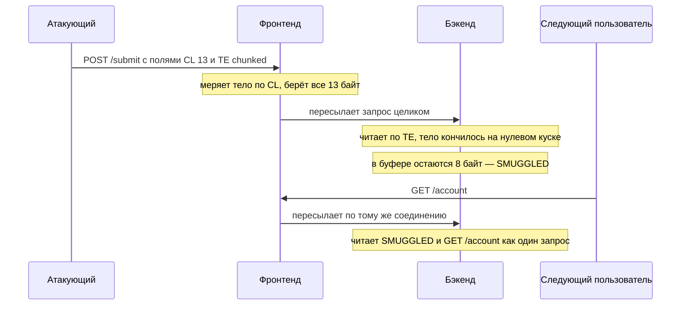
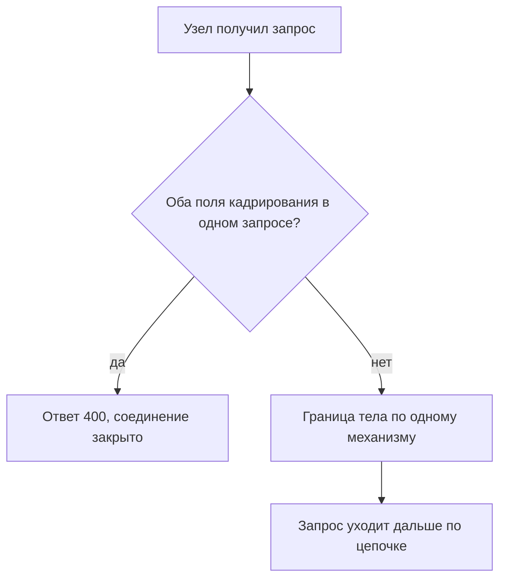

# HTTP request smuggling: CL.TE, TE.CL, H2

Утром на сайт магазина приходит запрос на оформление заказа. Между
покупателями и приложением стоят два сервера: первый, фронтенд, принимает
запросы снаружи и пересылает их дальше, второй, бэкенд, работает с заказами.
Запрос выглядит обычно, и оба сервера принимают его без ошибок. Но после
него в приёмном буфере бэкенда остаются восемь чужих байт. Через секунду по
тому же служебному соединению приходит запрос другого покупателя, и бэкенд
прочитает его вместе с чужим хвостом, как одно сообщение.

Так устроен HTTP request smuggling, протокольная контрабанда: два сервера
по-разному поняли, где кончается один и тот же запрос. Дальше разберём,
почему у HTTP/1.1 на этот вопрос два ответа, как их расхождение протаскивает
чужой запрос мимо проверок фронтенда и как закрыть расхождение на границе.

## Где кончается тело запроса

Сервер читает запрос из соединения как поток байт. В потоке нет перегородок:
за строкой запроса и заголовками идёт тело, а за телом начинается следующий
запрос. Поэтому получателю нужно правило, по которому он решает, где тело
кончается. Такое правило называют кадрированием. В HTTP/1.1 способов
кадрирования два, и уязвимость этой темы живёт ровно в зазоре между ними.

### Способ первый: назвать длину

Первый способ знаком по теме `http-basics`: заголовок `Content-Length`
называет длину тела в байтах. Получатель отсчитывает ровно столько байт от
начала тела и считает его законченным. Всё, что пришло следом, относится
уже к следующему запросу. Правило точное, пока длину назвали честно.

### Способ второй: резать на куски

Второй способ объявляет заголовок `Transfer-Encoding: chunked`, то есть
тело, разрезанное на куски. Каждый кусок начинается строкой с его размером
в шестнадцатеричной записи. Конец тела обозначает кусок нулевой длины.
Так сервер принимает тело, не зная его размера заранее, например когда
содержимое собирается на лету.

**Запрос с телом кусками**

```http
POST /submit HTTP/1.1
Host: shop.example
Transfer-Encoding: chunked

4
milk
3
egg
0

```

Те же байты в явной записи, где `\r\n` — перевод строки:
`b'4\r\nmilk\r\n3\r\negg\r\n0\r\n\r\n'`. Читается она так: размер 4,
четыре байта данных, размер 3, три байта данных, ноль — тело кончилось.

Бытовой аналог — посылка с двумя описями. Тело примера несёт семь байт
данных: четыре в первом куске и три во втором. Способ с длиной — надпись
«всего семь килограммов»: приёмщик взвешивает и останавливается. Способ с
кусками — пронумерованные коробки, где последняя пустая и помечена словом
«конец». Соответствие такое: надпись — заголовок с длиной, коробки — куски,
пометка — кусок нулевой длины. Где аналогия ломается: приёмщик может вскрыть
посылку и пересчитать глазами, а сервер видит только поток байт и вынужден
доверять одной из надписей.

Когда в одном запросе стоят оба заголовка, надписи противоречат друг другу.
Одна говорит «семь байт», другая — «читай куски до нулевого», и эти
указания ставят границу в разные места. Спецификация HTTP/1.1 разрешает спор
так: куски перекрывают длину, а сообщение с обоими полями следует считать
ошибкой. Пока запрос разбирает один сервер, на этом всё и кончается.

### Одно соединение на много запросов

Дальше два свойства, без которых атака не собирается. Первое —
переиспользование соединения. Установка соединения стоит времени: сначала
сетевое рукопожатие, потом рукопожатие TLS из темы `tls-and-proxy`. Поэтому
HTTP/1.1 не закрывает соединение после ответа, а держит его открытым для
следующих запросов. Фронтенд перед бэкендом идёт дальше и держит постоянное
служебное соединение, по которому подряд идут запросы разных пользователей.

Второе свойство — приёмный буфер. Узел, то есть любой сервер на пути
запроса, читает из соединения порциями, как данные приходят. Байты, которые
уже приняты, но не отнесены ни к одному запросу, ждут в буфере. Именно в
этот буфер попадут чужие байты: следующий запрос бэкенд начнёт читать не
с начала, а с остатка.

## Как это работает

**Откуда это взялось.** Два способа оказались в одном протоколе по
историческим причинам. Ранние реализации иногда слали `Transfer-Encoding:
chunked` для кадрирования и при этом примерный `Content-Length` для
индикатора загрузки. Поэтому спецификация HTTP/1.1, документ RFC 9112,
определила `Transfer-Encoding` как перекрывающий `Content-Length`, а не как
несовместимый с ним (§ 6.1). Та же спецификация признаёт: пересылка такого
сообщения ведёт к request smuggling, если узел ниже по цепочке разберёт его
иначе (§ 6.3).

Расхождение двух узлов о том, где кончается запрос, называют
десинхронизацией. Атака на нём и есть HTTP request smuggling: атакующий
вписывает в свой запрос начало чужого, и фронтенд протаскивает его дальше,
не разбирая. Дальше три классических варианта. Название каждого говорит,
кто из узлов какой заголовок читает.

### CL.TE: фронтенд считает байты, бэкенд — куски

В варианте CL.TE фронтенд меряет тело по `Content-Length`, а бэкенд по
`Transfer-Encoding`. Запрос атакующего несёт оба поля, и значения подобраны
так, чтобы границы разошлись.

**Запрос атакующего**

```http
POST /submit HTTP/1.1
Host: shop.example
Content-Length: 13
Transfer-Encoding: chunked

0

SMUGGLED
```

Тело здесь — тринадцать байт: цифра ноль, два перевода строки и восемь
букв. В явной записи это `b'0\r\n\r\nSMUGGLED'`. Фронтенд читает
`Content-Length: 13`, берёт все тринадцать байт как тело и пересылает запрос
бэкенду целиком. Бэкенд читает `Transfer-Encoding` и видит кусок нулевой
длины. Для него тело кончилось после пяти байт `0\r\n\r\n`, а восемь байт
`SMUGGLED` остаются в буфере.



**Описание схемы.** Схема читается сверху вниз. Атакующий отправляет один
запрос с двумя полями кадрирования. Фронтенд меряет тело по длине и
пересылает всё. Бэкенд режет тело на куски, останавливается раньше и
оставляет хвост в буфере. Следующий запрос по тому же соединению бэкенд
читает вместе с этим хвостом.

Тот же разбор показывает учебный стенд `e01-smuggling.py`. Он прогоняет один
байтовый поток через две функции кадрирования: одна меряет по длине, другая
режет на куски. Сетевой атаки в стенде нет: две модели разбора работают над
одним буфером в памяти.

```bash
python e01-smuggling.py
```

**Вывод команды (сокращённо)**

```text
=== CL.TE (фронтенд по CL, бэкенд по TE) ===
  бэкенд прочитал первым запросом: …chunked\r\n\r\n0\r\n\r\n
  осталось в буфере бэкенда:        b'SMUGGLED'
  -> протащено в начало следующего запроса: b'SMUGGLED'
```

В боевом запросе на месте `SMUGGLED` стоит начало настоящего запроса,
например обращение к закрытому разделу. Фронтенд этих байт не видел: он
переслал тело, не разбирая, и его правила на хвост не действуют. Бэкенд
исполнит хвост как начало следующего запроса.

### TE.CL: то же расхождение наоборот

В варианте TE.CL приоритеты зеркальны. Фронтенд читает куски, бэкенд считает
байты, и теперь длина занижена.

**Запрос атакующего**

```http
POST /submit HTTP/1.1
Host: shop.example
Content-Length: 3
Transfer-Encoding: chunked

8
SMUGGLED
0

```

Фронтенд читает куски: восемь байт данных и кусок нулевой длины. Для него
тело — это `b'8\r\nSMUGGLED\r\n0\r\n\r\n'` целиком, и он пересылает всё.
Бэкенд читает `Content-Length: 3` и берёт первые три байта: восьмёрку и
перевод строки. Остаток `SMUGGLED\r\n0\r\n\r\n` остаётся в буфере и
встречает следующий запрос.

**Вывод команды (продолжение)**

```text
=== TE.CL (фронтенд по TE, бэкенд по CL) ===
  осталось в буфере бэкенда:        b'SMUGGLED\r\n0\r\n\r\n'
  -> протащено в начало следующего запроса: b'SMUGGLED\r\n0\r\n\r\n'
```

Оба варианта — одно правило, прочитанное с двух сторон. Дефект живёт не в
запросе атакующего, а в расхождении двух узлов о том, где запрос кончается.
Посмотрите на свою цепочку: сколько в ней разборщиков и совпадает ли их
ответ о границе тела?

### TE.TE: сбитый разборщик

Третий вариант работает, когда оба узла понимают `Transfer-Encoding`. Тогда
атака сводится к тому, чтобы один из них перестал распознавать заголовок.
Достаточно отклонения от спецификации, которое один разборщик терпит, а
другой нет. Годятся пробел перед двоеточием, табуляция вместо пробела,
второе поле `Transfer-Encoding` с мусорным значением, перенос строки внутри
значения.

Узел, который заголовок не распознал, остаётся с одним `Content-Length`, и
дальше атака идёт как CL.TE или TE.CL: смотря кого удалось сбить. Реальный
код редко следует спецификации байт в байт, и реализации расходятся в том,
что они прощают. Одного сбитого узла достаточно для расхождения.

### HTTP/2 и понижение версии

Протокол HTTP/2 устроен иначе. Он не пишет запрос текстом, а режет его на
двоичные кадры, и тело идёт кадрами `DATA`. Длина записана в заголовке
каждого кадра, поэтому второго способа обозначить границу нет и спорить не
о чем. Сайт, где HTTP/2 работает на всём пути от клиента до приложения,
неоднозначности не знает (RFC 9113 § 8.1.1).

Так бывает не всегда. Часто HTTP/2 говорит только фронтенд, а бэкенд
остаётся на HTTP/1.1, и фронтенд переводит запрос вниз. Такой перевод
называют понижением версии. Поля HTTP/2 становятся заголовками HTTP/1.1.
Если их значения не проверены, возврат каретки, перевод строки и двоеточие
внутри значения превращаются в разделители нового заголовка или новой строки
запроса. Спецификация требует считать такие поля некорректными и не
пересылать их (RFC 9113 § 8.2.1, § 10.3). Где проверки нет, понижение версии
возвращает десинхронизацию сайту, который уже считает себя на HTTP/2.

**Зачем это в работе AppSec-инженера.** Ревью здесь начинается не с кода
приложения, а со схемы узлов: дефект живёт на стыке, и увидеть его можно,
только зная архитектуру из темы `app-architecture`. Смотрят, сколько
разборщиков стоит на пути запроса и одинаково ли они кадрируют тело. На
ревью тема даёт два вопроса к каждой цепочке прокси. Принимает ли
какой-нибудь узел оба заголовка сразу? Есть ли на пути понижение версии
протокола?

## Как это выглядит в коде

Дефект не в бизнес-логике: искать надо узел, который принимает
неоднозначное кадрирование. Признак — разборщик, который при обоих
заголовках доверяет одному из них вместо того, чтобы отвергнуть запрос.

Чтение листинга идёт по трём планам: где функция решает, каким заголовком
мерить тело; что происходит, когда стоят оба; какие байты возвращаются
остатком. До чтения выноски ответьте, какой из трёх планов здесь провален.

```python
# УЯЗВИМО — демонстрация модели разбора, не для продакшена
def frame(head, rest):
    cl = header(head, b"content-length")
    te = header(head, b"transfer-encoding")
    if cl is not None:                     # (1)
        n = int(cl)
        return rest[:n], rest[n:]
    if te and b"chunked" in te:
        return dechunk(rest)
    return b"", rest
```

1. Заголовок `Content-Length` проверяется первым и без оглядки на
   `Transfer-Encoding`. Узел ниже по цепочке, у которого приоритет обратный,
   разойдётся с этим на каждом запросе с обоими полями.

Провален второй план: случай «стоят оба» здесь не отличён от случая «стоит
один». Функция молча выбирает длину, и запрос уходит дальше с двумя
границами сразу.

Второй признак живёт на стыке HTTP/2 и HTTP/1.1. Это узел, который переводит
запрос вниз и переносит значения полей в заголовки HTTP/1.1, не отвергая
значения с возвратом каретки, переводом строки или двоеточием. В коде такого
узла ищите место, где строка заголовка собирается из присланного значения
без проверки этих символов.

## Как защититься

Защита ставится на границу, потому что расхождение рождается там, где запрос
разбирают дважды. Три правила ниже сводятся к одному: неоднозначного
кадрирования в цепочке быть не должно.

Чинить код приложения здесь бессмысленно: приложение получает запрос после
посредников, и его собственный разбор уже ничего не решает. Чинят узлы на
пути запроса: входной прокси, балансировщик, переводчик версий. Поэтому
каждое правило ниже адресовано конкретному узлу цепочки.

**Первое правило: неоднозначный запрос отвергается.** Узел, получивший
запрос и с `Content-Length`, и с `Transfer-Encoding`, отвечает ошибкой 400
и закрывает соединение, а не выбирает один заголовок (RFC 9112 § 6.3).
Выбор одного заголовка не защищает: соседний узел может выбрать другой, и
пара снова разойдётся. Соединение закрывается, потому что в его буфере уже
могут лежать чужие байты: доверять ему после неоднозначного запроса нельзя.
Посредник, который
всё же пересылает такое сообщение дальше, обязан сначала удалить
`Content-Length` и разобрать тело по кускам. Тогда все узлы цепочки
определяют границу одним и тем же механизмом (ASVS v5.0-4.2.1).

Исправленный разборщик отличается от уязвимого одной проверкой:

```python
# Исправленный вариант
def frame(head, rest):
    cl = header(head, b"content-length")
    te = header(head, b"transfer-encoding")
    if cl is not None and te is not None:  # (1)
        raise BadRequest()                 # (2)
    if cl is not None:
        n = int(cl)
        return rest[:n], rest[n:]
    if te and b"chunked" in te:
        return dechunk(rest)
    return b"", rest
```

1. Запрос с обоими полями отвергается до всякого разбора тела: расхождению
   неоткуда взяться.
2. Ответ 400, и соединение закрывается: остаток в буфере не образуется и не
   встретит чужой запрос.

Стенд подтверждает правило прогоном. Те же два запроса проходят через
разборщик, следующий правилу спецификации, и оба отвергаются:

```text
=== те же запросы через разборщик по RFC 9112 § 6.3 ===
  CL.TE: отвергнут -> 400: Content-Length и Transfer-Encoding вместе
  TE.CL: отвергнут -> 400: Content-Length и Transfer-Encoding вместе
```

**Второе правило: поля при понижении версии проверяются.** Узел, переводящий
HTTP/2 в HTTP/1.1, отбрасывает значения с возвратом каретки, переводом
строки и двоеточием (RFC 9113 § 8.2.1, ASVS v5.0-4.2.4). Поля, которые имеют
смысл только для одного соединения, вроде `Transfer-Encoding`, он не
пересылает вовсе (RFC 9113 § 8.2.2, ASVS v5.0-4.2.3).

Проверка здесь конкретная и стоит до сборки заголовка, а не после. Значение
поля со встроенным переводом строки при переводе вниз становится двумя
строками: всё, что после перевода, HTTP/1.1 прочитает как новый заголовок.
Поэтому узел сравнивает каждое значение с запрещёнными символами до того,
как из него собран текст запроса.

**Третье правило: одна власть над кадрированием.** Где возможно, HTTP/2
ведут до самого бэкенда без перевода вниз: у запроса на всём пути остаётся
один способ кадрирования. Где перевод неизбежен, на всех узлах ставят один
и тот же разборщик: одинаковый код одинаково прощает и одинаково отвергает.
Единый разборщик означает и единую версию: два узла с разными выпусками
одного сервера прощают разные отклонения, и вариант TE.TE возвращается.

Полумера здесь — фильтровать запросы по сигнатурам на входе. Фильтр сам
разбирает запрос и сам прощает отклонения, а вариант TE.TE живёт ровно на
разнице таких прощений. Надёжнее другое правило: не искать подозрительное,
а отвергать неоднозначное.



**Описание схемы.** Схема читается сверху вниз и показывает проверку на
границе. Запрос с обоими полями кадрирования отвергается ошибкой 400, и
соединение закрывается. Запрос с одним механизмом разбирается по нему и
уходит дальше по цепочке.

### Как убедиться, что граница держит

Проверка повторяет атаку на собственный узел. Отправьте на входной узел
цепочки запрос с обоими полями, как в разделе про CL.TE. Узел без дефекта
ответит ошибкой 400 и закроет соединение. Ответ 200 означает, что узел
выбрал один заголовок. Какой именно, выясняют повтором с заниженной длиной:
читающий по длине возьмёт три байта и отравит хвостом следующий запрос, а
читающий по кускам ответит чисто.

Вторая проверка идёт в другую сторону: запрос с заниженной длиной из
раздела про TE.CL. Узел без дефекта снова отвечает ошибкой 400. Если хотя бы
на одну из двух проверок пришёл ответ 200, узел разбирает тело молча, и с
соседним узлом они разойдутся.

Третья проверка адресована узлу перевода версий. Ему отправляют запрос
HTTP/2, в значении поля которого стоит перевод строки. Узел без дефекта
отвергнет такое значение и не перешлёт его дальше. Исход всех трёх проверок
записывают: эта запись и есть доказательство на ретесте. Ту же тройку
прогоняют после каждой замены прокси в цепочке.

**Границы применимости.** Отказ от переиспользования соединения — не защита,
а смягчение: смуглинг протаскивает байты и в собственный следующий запрос
атакующего. Корень дефекта — согласие узлов о границе сообщения, а не общее
соединение.

## Частая ошибка

Вопрос на выбор: сайт на HTTP/2 иммунен к смуглингу по построению — да или
нет?

Довод «за» строится на версии: у HTTP/2 один механизм кадрирования, и двум
границам взяться неоткуда.

**Иммунен только сквозной HTTP/2.** Как только фронтенд переводит запрос в
HTTP/1.1 для бэкенда, у сообщения снова появляются `Content-Length` и
`Transfer-Encoding`. Неоднозначность возвращается, а вместе с ней и новый
канал через непроверенные значения полей HTTP/2. Фраза «мы на HTTP/2»
описывает фронтенд, а дефект живёт на стыке с бэкендом.

Вторая половина той же ловушки звучит так: оба заголовка запрещены, значит,
их никто не шлёт. Запрет относится к корректной реализации. Вариант TE.TE
живёт ровно на том, что реальные разборщики прощают отклонения от
спецификации по-разному.

## Чеклист для ревью

1. Проверьте, что каждый узел на пути запроса определяет границу тела одним
   и тем же механизмом кадрирования.
2. Проверьте, что запрос с обоими заголовками `Content-Length` и
   `Transfer-Encoding` отвергается, а не разбирается по одному из них.
3. Проверьте, что посредник, пересылающий сообщение с обоими полями, удаляет
   `Content-Length` и обрабатывает `Transfer-Encoding`.
4. Проверьте, что узел, понижающий HTTP/2 до HTTP/1.1, проверяет значения
   полей на возврат каретки, перевод строки и двоеточие.
5. Проверьте, что connection-специфичные поля не переносятся из HTTP/2 в
   HTTP/1.1 при переводе версии.
6. Проверьте, что цепочка узлов и точки перевода версии протокола описаны,
   а не выведены по памяти.

## Попробуй сам

Соберите разбор двух узлов над одним буфером: одна функция кадрирует тело по
`Content-Length`, другая по `Transfer-Encoding: chunked`. Подайте обеим один
неоднозначный запрос с обоими заголовками и запишите, где каждая ставит
границу. Тем же прогоном проверьте третью функцию: разборщик, который
отвергает запрос с обоими полями.

Одна подсказка: размеры кусков считайте в шестнадцатеричной записи, а длину
по `Content-Length` — в байтах, включая переводы строк. Расхождение этих
двух счётов и есть граница, которую узлы ставят по-разному.

**Критерий выполнения** наблюдаемый: для CL.TE и для TE.CL записано, какие
байты остаются в буфере второго разборщика после первого запроса. Отдельной
строкой показано, что разборщик, отвергающий запрос с обоими полями,
остатка не оставляет.

## Проверь себя

1. Запрос пришёл с обоими полями кадрирования:

   ```http
   POST /submit HTTP/1.1
   Host: shop.example
   Content-Length: 6
   Transfer-Encoding: chunked

   0

   XY
   ```

   Фронтенд меряет тело по `Content-Length`, бэкенд — по `Transfer-Encoding`.
   Что каждый из них считает концом первого запроса?

2. Узел на границе получил запрос с обоими полями кадрирования. Какая реакция
   устраняет дефект?

   A. Доверять `Content-Length`: он проще и читается первым.

   B. Ответить ошибкой 400 и закрыть соединение.

   C. Удалить `Transfer-Encoding` и разобрать тело по `Content-Length`.

3. Почему вариант TE.TE работает, хотя оба узла понимают `Transfer-Encoding`?

4. Предскажите, что напечатает эта модель разбора.

   ```python
   raw = b'0\r\n\r\nXY'
   print('по CL=6 телом ушло:', raw[:6])
   print('остаток у читающего по TE:', raw[5:])
   ```

5. Возврат к теме `http-basics`: почему два заголовка кадрирования в одном
   запросе — это неоднозначность, а не дубль?
6. Возврат к теме `app-architecture`: где в цепочке узлов надо искать
   расхождение разборщиков?

<details markdown="1">
<summary>Ответ 1</summary>

1. Фронтенд возьмёт шесть байт тела: `0`, перевод строки, ещё перевод строки
   и `X` — и пересланный запрос уйдёт целиком. Бэкенд увидит кусок нулевой
   длины и конец запроса после него. А байты `XY` останутся в буфере началом
   следующего запроса.

</details>

<details markdown="1">
<summary>Ответ 2: разбор вариантов</summary>

2. Верный ответ — B.

   A. Неверно. Выбор одного заголовка — это и есть уязвимая модель из
      раздела о коде. Узел ниже по цепочке с обратным приоритетом поставит
      границу тела в другом месте, и расхождение возникнет на каждом таком
      запросе.

   B. Верно. Так требует RFC 9112 § 6.3: сообщение с обоими полями считается
      ошибкой. Узлы цепочки определяют границу одним механизмом, и
      расхождению неоткуда взяться.

   C. Неверно. Правило посредника обратное: тот, кто всё же пересылает такое
      сообщение, обязан удалить `Content-Length` и разобрать тело по
      `Transfer-Encoding`, — а не наоборот.

</details>

<details markdown="1">
<summary>Ответ 3</summary>

3. Потому что распознать поле можно сбить: реальные разборщики по-разному
   прощают отклонения от спецификации — пробел перед двоеточием, табуляцию,
   второе поле, перенос строки внутри значения. Достаточно отклонения,
   которое терпит один узел и не терпит другой: сбитый читает по
   `Content-Length`, и дальше атака идёт как CL.TE или TE.CL.

</details>

<details markdown="1">
<summary>Ответ 4</summary>

4. `по CL=6 телом ушло: b'0\r\n\r\nX'` и `остаток у читающего по TE: b'XY'`
   — один буфер, две границы. Проверка прогоном файла `probe.py` с этим
   кодом (2026-10-03, Python 3.14.7):

   ```bash
   python3 probe.py
   ```

   ```text
   по CL=6 телом ушло: b'0\r\n\r\nX'
   остаток у читающего по TE: b'XY'
   ```

</details>

<details markdown="1">
<summary>Ответ 5</summary>

5. Потому что два заголовка задают границу тела независимо и могут указать
   разные концы. Пока сообщение разбирает один узел, побеждает один
   заголовок; в цепочке узлы могут выбрать разные.

</details>

<details markdown="1">
<summary>Ответ 6</summary>

6. На стыках, где сообщение разбирается заново: фронтенд и бэкенд, точки
   перевода версии протокола, любой посредник, переписывающий запрос.

</details>

## Источники

1. IETF, RFC 9112 «HTTP/1.1», STD 99; реестр `rfc9112-http11`.
   Разделы: § 6.1 «Transfer-Encoding» — почему TE перекрывает CL; § 6.2
   «Content-Length»; § 6.3 «Message Body Length» — приоритет механизмов,
   пункт 3 про оба поля сразу и обязанность посредника; § 11.2 «Request
   Smuggling».
   <https://www.rfc-editor.org/rfc/rfc9112.html>
2. IETF, RFC 9113 «HTTP/2»; реестр `rfc9113-http2`. Разделы: § 8.1.1
   «Malformed Messages» — единое кадрирование; § 8.2.1 «Field Validity» —
   обязательная проверка значений полей и связь с смуглингом при понижении
   версии; § 8.2.2 — запрет connection-специфичных полей; § 10.3
   «Intermediary Encapsulation Attacks».
   <https://www.rfc-editor.org/rfc/rfc9113.html>
3. PortSwigger Web Security Academy, «HTTP request smuggling»; реестр
   `ps-request-smuggling`. Разделы: цепочка фронтенд — бэкенд, CL.TE, TE.CL,
   TE.TE и способы искажения `Transfer-Encoding`, понижение версии HTTP/2.
   <https://portswigger.net/web-security/request-smuggling>

Каркас этапа: `owasp-asvs-5-document` (ASVS v5.0.0), `owasp-wstg-42`,
`owasp-top10-2025`. Наследуются всеми темами и отдельной строкой не
повторяются.

**Скоропортящийся слой.** Конкретные способы искажения `Transfer-Encoding` и
поведение отдельных серверов при понижении версии — свойство реализаций и
меняются с их обновлениями; нормативная часть (правило § 6.3, требования
§ 8.2 HTTP/2) стабильна.

**Маркеры уверенности.** Расхождение двух разборщиков на CL.TE и TE.CL и
отказ строгого разборщика на запросе с обоими полями — **проверено лично**
2026-08-24 на Python 3.14.7 (стенд `e01-smuggling.py`): в обоих вариантах в
буфере второго разборщика остаётся `SMUGGLED`, строгий разбор отвергает оба
запроса кодом 400. Байтовый разбор обоих запросов стенда и фрагмент из
вопроса 4 прогнаны повторно 2026-10-03, Python 3.14.7: выводы совпали
дословно. Правило приоритета кадрирования, обязанность посредника и запрет
обоих полей — **по документации** (RFC 9112 § 6.1, § 6.3, открыт лично
2026-08-24). Единое кадрирование HTTP/2, обязательная проверка полей и
запрет connection-специфичных полей — **по документации** (RFC 9113
§ 8.1.1, § 8.2.1, § 8.2.2, § 10.3, открыт лично 2026-08-24). Поведение
конкретных живых серверов и прокси при десинхронизации **не
воспроизводилось**: сетевой цепочки в стенде нет, показан лишь механизм
расхождения разборщиков.
