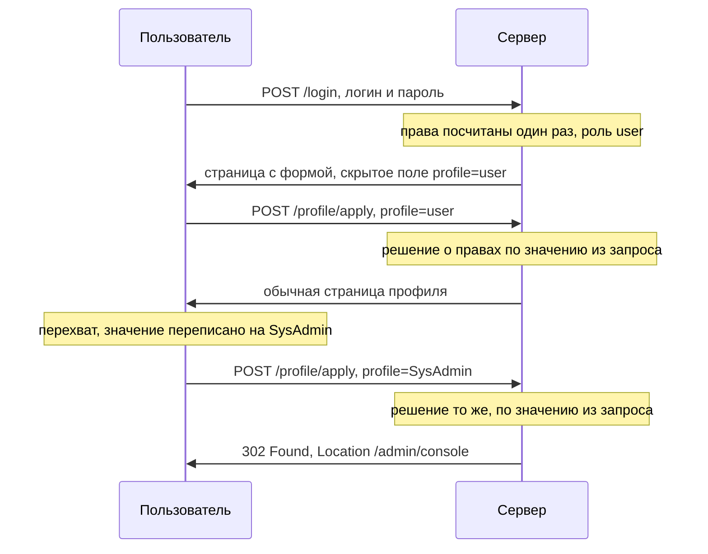

# Манипуляции с токенами и параметрами роли

Вы входите на внутренний портал компании под обычной учётной записью. Сервер
проверяет пароль, определяет ваши права и возвращает страницу с формой,
которая отправляет себя сама. В форме лежит скрытое поле — элемент, который
не рисуется на странице, но чьи имя и значение уходят в запросе наравне с
видимыми. Поле называется `profile`, и в него сервер записал `user`.

Вы перехватываете отправку, как делали в теме `tls-and-proxy`, и переписываете
значение на `SysAdmin`. Ответ приходит без единой ошибки: сервер
перенаправляет вас в административную консоль. Пароль вы не подбирали, чужую
сессию не крали, трафик не расшифровывали — приложение само спросило у
запроса, какие у вас права, и поверило ответу.

**Что отправляла форма**

```http
POST /profile/apply HTTP/1.1
Host: portal.example.com
Cookie: session=9fQx1
Content-Type: application/x-www-form-urlencoded

profile=user
```

**Отправлено вместо этого**

```http
POST /profile/apply HTTP/1.1
Host: portal.example.com
Cookie: session=9fQx1
Content-Type: application/x-www-form-urlencoded

profile=SysAdmin
```

**Ответ**

```http
HTTP/1.1 302 Found
Location: /admin/console
```

## Что здесь произошло

Сравните два запроса. Отличие одно: значение поля `profile`. Сессия при этом
настоящая и не менялась, чужие данные не читались. Приложение спросило о
правах у запроса и получило ответ, который в запрос положил сам отправитель.
Значение `SysAdmin` он придумал сам, и приложение приняло присланное как есть.

У дефекта есть имя. **Подмена параметра роли** — это когда решение о правах
принимается по значению, которое приложение само отдало клиенту и приняло
обратно. Такое значение дальше называется признаком права. Бытовое
соответствие — охранник на проходной, который вместо своего списка сотрудников
читает должность с бейджа посетителя. Бейдж у посетителя в руках, и переписать
его он может сам.

Где соответствие ломается. У настоящей проходной есть свой список: охранник
вправе сверить бейдж с ним и не пустить уволенного. У приложения из примера
своего списка при проверке нет: поле из запроса — единственный источник, и
спросить больше не у кого.

Вопрос, который пример оставляет открытым: чем замена `user` на `SysAdmin`
отличается от прямого запроса к адресу `/admin/console`? При прямом запросе
значение из запроса в решении не участвует: сервер решает по своим данным о
пользователе. Дефект другого рода возникает, когда проверки нет вовсе и
функция открыта любому, — её разбирает тема `privilege-escalation-vertical`.
Здесь же проверка есть, но читает она не тот источник: не запись о
пользователе в хранилище, а поле из запроса. Поэтому и закрываются два случая
по-разному: отсутствующую проверку добавляют, а подмену параметра устраняют
переносом источника — поле из запроса перестаёт влиять на решение.

**Зачем это в работе AppSec-инженера.** Права вы считали при входе и клали в
токен, чтобы не ходить в базу на каждом запросе. Само значение при этом уехало
клиенту, и решение о правах принимается по тому, что вернулось. Дефект
держится на разнице между «данные подписаны» и «данные не влияют на решение».
Подпись закрывает подделку и не закрывает устаревание: роль, отозванная минуту
назад, в подписанном токене остаётся действительной до его истечения. Разговор
о такой находке упирается в требования, которые надо уметь назвать: без
номеров требований разговор не сходится, и дальше они названы.

**Откуда это взялось.** Права дороги в вычислении: их собирают из ролей, групп
и признаков учётной записи, а нужны они на каждом запросе. Первым решением
стало посчитать права один раз при входе и носить результат с собой. Пока
результат лежал в серверной сессии, вопрос не стоял: клиент видел только
непрозрачный идентификатор, строку без смысла вне сервера. Дальше состояние
ушло к клиенту. Причины назывались разные: снять нагрузку с хранилища,
развести узлы без общей памяти, упростить внешний интерфейс. Вместе с
состоянием к клиенту уехало и решение о правах.

## Как это работает

Право — это вывод, а не данные: приложение выводит его из личности субъекта,
его ролей и групп. Как записывают такие выводы в разных моделях, разбирает
тема `access-control-models`. Вывод дорого считать заново на каждый запрос,
поэтому его сохраняют, а место для хранения выбирают там, откуда читать
дешевле. Если это место у клиента, то клиент им и распоряжается.

Три таких места называет Web Security Academy — учебная площадка создателей
Burp Suite: скрытое поле формы, cookie и заранее заданный параметр строки
запроса. Третье место показывает адрес вида `home.jsp?admin=true`: если
приложение читает признак из адреса, ссылка работает ровно так, как выглядит.



**Описание схемы.** Схема читается сверху вниз и показывает один сеанс дважды:
до подмены и после. Права считаются один раз, при входе, и дальше сервер на
каждом запросе читает поле `profile` и верит ему. Замена значения в перехвате
меняет решение, потому что другого источника у этого решения нет.

### Подписанный токен

Подпись меняет вид дефекта, но не его природу. Признак права внутри
подписанного токена переписать нельзя. Требование ASVS v5.0-9.1.1 велит
проверять подпись или код аутентичности до того, как содержимое принято; код
аутентичности — штамп, который сервер считает от значения и своего секрета.
Зато подписанное значение продолжает говорить то, что было верно в момент
выпуска. Решение по нему — решение по вчерашнему состоянию прав.

Остаётся вторая половина задачи — устаревание. Требование ASVS v5.0-8.3.2
формулирует её так: изменения значений, на которых делается решение о доступе,
применяются немедленно. Там, где немедленно не получается, нужны
компенсирующие меры — действия, которые снижают ущерб, когда основное
требование выполнить нельзя. Самодостаточный токен — ровно такой случай: он
несёт утверждения в себе, и сервер при проверке к хранилищу не ходит, поэтому
об отзыве роли токен не узнает. Меры по тексту требования — предупреждение о
действии субъекта, который уже не авторизован, и откат такого действия;
случившуюся утечку сведений они не закрывают.

Отсюда практический вывод для ревью: подпись переводит вопрос из «можно ли
подменить роль» в «за сколько минут отзыв прав доходит до решения». Атаки на
саму подпись — как её снять или подсунуть чужой ключ — вынесены в тему
`jwt-attacks`; здесь остаётся решение о правах, принятое по значению от
клиента.

## Как это атакуют

Готовый порядок проверки написан в руководстве OWASP по тестированию:
WSTG-v42-ATHZ-03 разбирает подмену роли по трём точкам, и они покрывают почти
все встречающиеся случаи. Атакующий идёт по ним как по списку. Признак находки
у всех трёх один: замена значения меняет решение сервера — открывает чужой
заказ, административную консоль или следующий шаг обработки.

**Параметр группы или объекта в теле запроса.** Запрос
`POST /user/viewOrder.jsp` несёт в теле `groupID=grp001&orderID=0001`.
Проверяется, сможет ли пользователь вне группы `grp001` подставить чужие
значения и получить чужой заказ. Приложение здесь спрашивает у тела запроса,
чей заказ показывать.

**Скрытое поле профиля в ответе после входа.** Это случай из начала темы:
сервер возвращает форму со скрытым полем `profile`, и страница отправляет её
автоматически. Значение меняется в перехвате, и вопрос ровно один: станет ли
отправитель администратором.

**Значение условия в ответе сервера.** Приложение отдаёт клиенту служебную
строку состояния и доверяет тому, что вернётся. Пример — номер шага мастера
оформления или итог проверки в скрытом поле, которое следующий запрос
возвращает назад. Клиент здесь не сообщает данные, а управляет ходом
обработки: переставить значение — значит пропустить шаг.

## Как это выглядит в коде

Ревьюер ищет чтение признака права из запроса — в любой его части: тело,
cookie, адрес, токен. Разбор листинга идёт двумя планами: найти точку, где
недоверенные данные входят в программу, и проследить, где это значение
принимает решение. Строка, которая прочитала `profile` из введения, выглядит
так. До выносок ответьте сами: что здесь осталось без защиты?

```python
# ФРАГМЕНТ — срез, самостоятельно не компилируется
# УЯЗВИМО — демонстрация, не для продакшена
role = request.form.get("profile") or request.cookies.get("role")  # (1)
if role == "SysAdmin":                                             # (2)
    return admin_console()
```

1. План «вход недоверенных данных»: признак права читается из тела запроса и
   из cookie, а обе части запроса ставит отправитель.
2. План «решение»: в консоль пускает слово из запроса, а не запись о
   пользователе, поэтому подмена поля равна подмене роли.

Тот же дефект в подписанном виде опаснее для ревью, потому что проверенная
подпись создаёт впечатление закрытого вопроса:

```python
# ФРАГМЕНТ — срез, самостоятельно не компилируется
claims = jwt.decode(token, key, algorithms=["RS256"])   # подпись проверена
if claims["role"] == "admin":                           # (3)
    return admin_console()
```

3. Подделка закрыта: утверждения прошли проверку подписи. Устаревание — нет:
   роль внутри токена отражает состояние на момент выпуска, и об отзыве токен
   не узнает.

Две обёртки выглядят защитой, а ею не стали. Шифрование значения роли в cookie
закрывает чтение, а не подмену: если целостность не проверяется, отправитель
подставит чужой зашифрованный блок, даже не читая его. Блоку есть откуда
взяться: из чужой cookie, попавшей в журналы или перехват, или из другого поля
своей же cookie, зашифрованного тем же ключом. Сверка контрольной
суммы, посчитанной без секрета, закрывает случайную порчу, а не замену: сумму
под новое значение отправитель пересчитает сам.

Есть и ложное срабатывание. Чтение роли из запроса ради отрисовки интерфейса —
например, чтобы скрыть пункт меню — не дефект этой темы, когда решение о
доступе принято отдельно и на сервере. Подмена такого значения меняет картинку
на экране, а не права.

## Как защититься

Защита меняет источник значения, а не его форму: права вычисляются на сервере
по личности субъекта, а из запроса берётся только она. Листинг читается двумя
планами: взять личность из состояния сессии на сервере, вычислить права до
всякой работы.

```python
# ФРАГМЕНТ — срез, самостоятельно не компилируется
user = load_user(session_subject())   # личность — из состояния сессии
if authz.can(user, "admin_console"):  # права — вычислены на сервере
    return admin_console()
```

Из запроса берётся только сессия, и поле `profile` перестаёт на что-либо
влиять: подменённое значение никто не читает. Это чинит дефект, а не маскирует
его: решение больше не зависит от того, что прислал клиент, и переписывание
поля теряет смысл, а не становится сложнее.

**Границы применимости.** Приём переносит вычисление прав на каждый запрос, и
это стоит обращения к хранилищу. Там, где отказаться от самодостаточного
токена нельзя, задача не решается, а разменивается. Первая часть размена —
короткий срок жизни токена: окно, в котором устаревшая роль ещё действует,
сжимается до минут. Вторая — проверка чувствительных действий по свежему
состоянию: перед опасной операцией права считаются заново, уже по хранилищу.

Третья часть размена — одна из мер отзыва. Список завершённых токенов: сервер
запоминает отозванные токены до их истечения и отвергает их при верной
подписи. Отсечение по дате выпуска: у субъекта хранят время последней смены
прав, и токены, выпущенные раньше, не принимают. Ротация ключа: ключ подписи
меняют, и все выпущенные токены перестают проходить проверку разом — мера
грубая, потому что завершает и живые токены. Цена размена известна: на сервере
возвращается состояние, ради отказа от которого самодостаточную модель и
выбирали.

## Частая ошибка

Решите до чтения дальше. Поле `profile` из введения переписывалось руками, и
первая правка, которая приходит на такую находку, — значение подписать. Отсюда
расхожее представление: роль внутри подписанного токена подменить нельзя,
поэтому решение по ней безопасно. Верно ли, что после этой правки вопрос
закрыт?

Нет. Подпись закрывает подделку, а не устаревание. Проверка подписи отвечает
на вопрос, кто выпустил токен и не менялся ли он по дороге. О том, верны ли
утверждения на момент проверки, она не говорит ничего. Рассуждение спотыкается
на подмене вопроса: «нельзя подменить» говорит о целостности, а безопасность
решения зависит ещё и от свежести утверждений, которую подпись не проверяет.

Контрпример. Сотрудника переводят на другую должность, и роль `admin` снимают
в десять утра. Токен с этой ролью выпущен в девять и живёт восемь часов. До
шести вечера подпись верна, утверждение `role: admin` верно с точки зрения
проверки, и административная консоль открывается. Требование v5.0-8.3.2
написано ровно про этот случай.

## Чеклист для ревью

1. Проверьте, что решение о правах не принимается по значению, пришедшему от
   клиента, — полю формы, cookie, параметру адреса (ASVS v5.0-8.3.1).
2. Проверьте, что признак права, отданный клиенту для отрисовки интерфейса, не
   читается обратно при решении о доступе.
3. Проверьте, что подпись или код аутентичности самодостаточного токена
   проверяются до того, как содержимое принято (ASVS v5.0-9.1.1).
4. Проверьте, что изменение прав применяется немедленно либо заведены
   компенсирующие меры с предупреждением и откатом (ASVS v5.0-8.3.2).
5. Проверьте, что чувствительные действия проверяются по свежему состоянию
   прав, а не по утверждениям токена.
6. Проверьте, что целостность значений в cookie обеспечена ключом сервера, а
   не контрольной суммой без секрета.

## Попробуй сам

Соберите список всех мест, где знакомое приложение отдаёт клиенту признак его
прав: поля форм, cookie, параметры адреса, утверждения токена. Для каждого
проверьте, читается ли значение обратно при решении о доступе. Таблица,
собранная по трём местам WSTG из раздела «Как это атакуют», — это и есть
ретест подмены роли: проверка, которую вы прогоните снова после любой правки.

Одна подсказка: начните с ответа точки профиля и со скрытых полей форм на
страницах, где меняются права, — там признак чаще всего и лежит.

**Критерий выполнения** наблюдаемый: таблица «где лежит признак — читается ли
обратно — чем это проверено». Для подписанных токенов дополнительно записано
время между снятием права и отказом в доступе.

## Проверь себя

1. Приложение отвечает на такой запрос открытием административной консоли:

   ```http
   GET /admin/console HTTP/1.1
   Host: portal.example.com
   Cookie: session=9fQx1; role=SysAdmin
   ```

   Где здесь решение о правах принято по слову клиента?
2. Фрагмент из раздела «Как это выглядит в коде» читает `role` из формы или
   cookie и пускает в консоль. Какая правка устраняет дефект?

   A. Подписать значение роли ключом сервера, чтобы его нельзя было переписать.

   B. Вычислять права на сервере по личности субъекта из сессии, а поле
      `profile` не читать вовсе.

   C. Сверять контрольную сумму значения роли, посчитанную без секрета.

3. Почему подписанный токен с ролью продолжает открывать консоль после того,
   как роль у сотрудника отозвали?
4. Из токена взята средняя часть. Предскажите, что в ней записано, и что
   это говорит о подписи.

   ```text
   eyJyb2xlIjoidXNlciIsImV4cCI6MTcwMDAwMDAwMH0
   ```

5. Возврат к теме `access-control-models`: почему подмена параметра роли
   опаснее в RBAC, чем в модели, где правило написано про объект?
6. Возврат к теме `jwt-attacks`: подпись токена проверяется верно — какие
   атаки на токен этим всё равно не закрыты?

<details markdown="1">
<summary>Ответ 1</summary>

1. В cookie `role=SysAdmin`: cookie ставит отправитель, и приложение прочитало
   признак права из запроса. Сессия при этом настоящая и не менялась — подменён
   признак, который приложение само отдало клиенту и приняло обратно.

</details>

<details markdown="1">
<summary>Ответ 2: разбор вариантов</summary>

2. Верно: B.

   A. Неверно как полная починка. Подпись закрывает подделку, но не
      устаревание: роль, отозванная минуту назад, в подписанном значении
      остаётся действительной до его истечения. А главное, решение по-прежнему
      принято по присланному значению.

   B. Верно. Право — вывод из личности субъекта, а не данные: из запроса берётся
      только сессия, и подменённое поле никто не читает.

   C. Неверно. Контрольная сумма без секрета пересчитывается отправителем на
      новом значении: она закрывает от случайной порчи, а не от замены.

</details>

<details markdown="1">
<summary>Ответ 3</summary>

3. Подпись отвечает на вопрос, кто выпустил токен и не менялся ли он. О том,
   верны ли утверждения на момент проверки, она не говорит: утверждение
   отражает состояние на момент выпуска. Поэтому требуются компенсирующие меры —
   короткий срок, отзыв, проверка чувствительных действий по свежему состоянию.

</details>

<details markdown="1">
<summary>Ответ 4</summary>

4. Записано `{'role': 'user', 'exp': 1700000000}`: прочитать может каждый, код
   здесь не прячет. Подпись этому чтению не мешает — она про целостность, а не
   про секретность. Прогон:
   `python3 -c "import base64,json; print(json.loads(base64.urlsafe_b64decode('eyJyb2xlIjoidXNlciIsImV4cCI6MTcwMDAwMDAwMH0'+'==')))"`.

</details>

<details markdown="1">
<summary>Ответ 5</summary>

5. В RBAC роль — единственный вход в решение, и подмена роли меняет весь набор
   прав сразу. Правило про объект требует ещё и владения объектом, поэтому
   подменённая роль сама по себе доступа не даёт.

</details>

<details markdown="1">
<summary>Ответ 6</summary>

6. Верная проверка закрывает подмену содержимого и перепутанные алгоритмы.
   Остаются кража самого токена целиком и устаревание его утверждений — второе
   и есть предмет этой темы.

</details>

## Источники

1. OWASP WSTG-ATHZ-03 «Testing for Privilege Escalation», WSTG v4.2; реестр
   `wstg-v42-athz-03-privilege-escalation`. Разделы: Testing for Role/Privilege
   Manipulation, Manipulation of User Group, Manipulation of User Profile,
   Manipulation of Condition Value.
   <https://owasp.org/www-project-web-security-testing-guide/v42/4-Web_Application_Security_Testing/05-Authorization_Testing/03-Testing_for_Privilege_Escalation>
2. PortSwigger Web Security Academy, «Access control vulnerabilities and
   privilege escalation»; реестр `ps-access-control`. Раздел: Parameter-based
   access control methods.
   <https://portswigger.net/web-security/access-control>
3. OWASP Top 10:2025, «A01:2025 Broken Access Control»; реестр
   `owasp-top10-2025-a01`. Раздел: Description (пункт про манипуляцию
   метаданными).
   <https://owasp.org/Top10/2025/A01_2025-Broken_Access_Control/>

Каркас этапа: `owasp-asvs-5-document` (ASVS v5.0.0), `owasp-wstg-42`,
`owasp-top10-2025`; якорь подраздела: `owasp-cs-authorization`. Наследуются
всеми темами и отдельной строкой не повторяются: третья сноска ведёт на
отдельную запись реестра — главу A01:2025, а не на оглавление издания.

**Скоропортящийся слой.** Формулировка компенсирующих мер в v5.0-8.3.2
привязана к редакции ASVS 5.0.0. Страница Web Security Academy — живая
платформа без даты.

**Маркеры уверенности.** Три точки подмены роли и их разбор — **по
документации** (WSTG-ATHZ-03, открыт лично 2026-08-23). Три места хранения
признака прав на клиенте — **по документации** (Web Security Academy, открыта
лично 2026-08-23). Пункт про манипуляцию метаданными — **по документации**
(страница A01:2025, открыта лично 2026-08-23). Требования 8.3.1, 8.3.2 и 9.1.1
сверены с текстом ASVS v5.0.0 (открыт лично 2026-08-23). Листинги **не
запускались**. Прогон из ответа 4 перепроверен локально 2026-10-03, Python
3.14.7: вывод совпал дословно.
