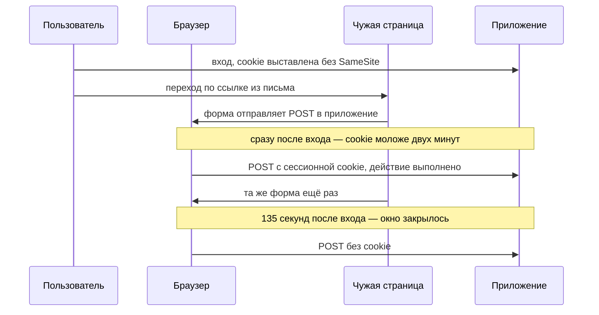
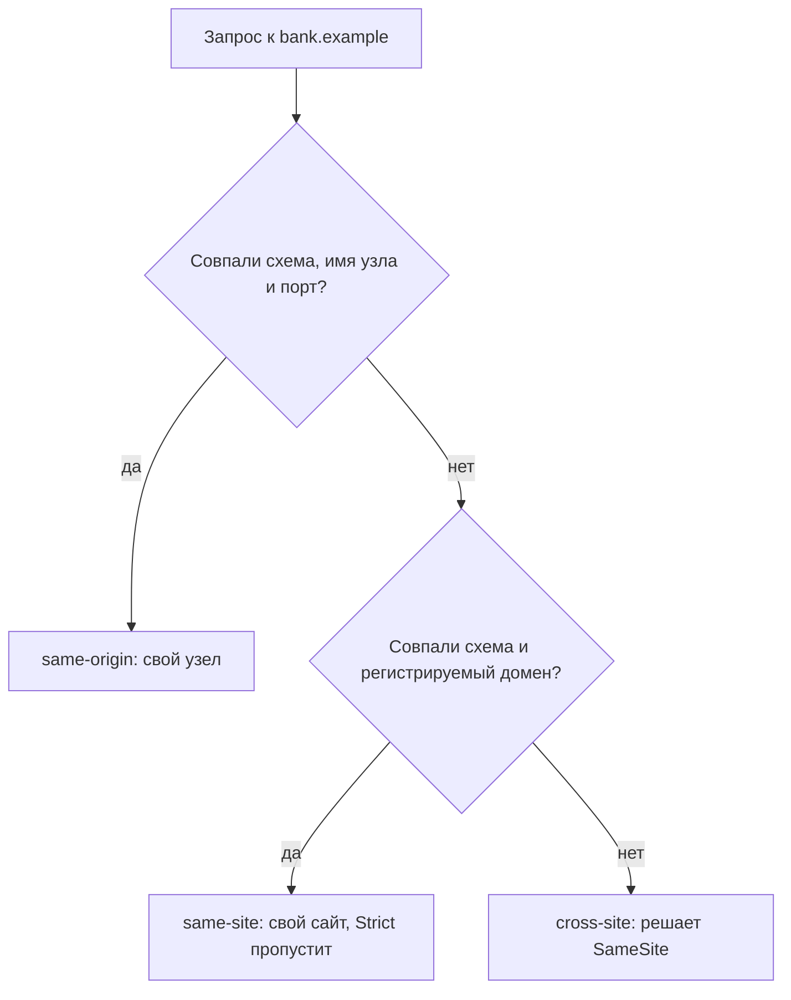

# SameSite как защита от CSRF и её границы

На учебном стенде из трёх сайтов пользователь входит в кабинет приложения,
и сразу после входа страница на чужом сайте отправляет в это приложение
POST-форму. Запрос приходит с сессионной cookie, и действие выполняется.
Ту же форму отправляют повторно через 135 секунд после входа, и запрос
приходит уже без cookie. Cookie одна и та же, атрибута `SameSite` у неё нет,
браузер один и тот же — различаются попытки только возрастом cookie.

Разгадка в умолчании браузера: к молодой cookie он вправе применять
послабление, о котором приложение не просило, и окно открывается как раз
в момент входа. Атрибут `SameSite` указывает браузеру, когда прикладывать
cookie к запросу, затеянному чужим сайтом. Граница у меры шире, чем кажется:
«свой» запрос считается по сайту, а не по origin. Сама подделка и три её
условия разобраны в теме `csrf-mechanics`, устройство cookie и их атрибутов —
в теме `cookies`.

## Что такое SameSite

Из темы `cookies` вы помните: браузер прикладывает cookie к запросу сам,
без кода страницы и без участия пользователя. Тема `csrf-mechanics` показала
цену этого автоматизма. Чужая страница отправляет запрос в приложение,
cookie прикладывается, и действие выполняется, хотя пользователь его не
затевал. Приложение не может отличить свой запрос от подделанного, потому
что вопроса «кто затеял запрос» в самом запросе нет.

**SameSite — это атрибут cookie, который говорит браузеру, прикладывать ли
её к запросу, затеянному другим сайтом.** Ставит его сервер в заголовке
`Set-Cookie`, вместе с остальными атрибутами. Дальше работает браузер. При
каждом запросе он смотрит, кто запрос затеял, и по значению атрибута решает:
уйдёт cookie вместе с запросом или останется в хранилище.

Запросы, затеянные другим сайтом, называют кросс-сайтовыми. Примеры: форма
на `evil.test`, которая отправляет POST в `bank.example`, или картинка на
чужой странице, которая тянет адрес `bank.example`. Переход по ссылке из
письма — случай особый. Запрос начался вне сайта, но страница приложения при
нём открывается целиком, и адрес в строке меняется. Такие переходы называют
навигациями верхнего уровня, и атрибут обращается с ними мягче, чем с
запросами изнутри страницы.

Зачем нужен атрибут, видно на бытовом примере. Представьте бизнес-центр,
где охранник сам прикладывает ваш пропуск к турникету, стоит вам подойти.
На пропуске написано, где он действует, и охранник следует пометке буквально.
Соответствие примера и механизма такое:

| В примере | В браузере |
|---|---|
| Пропуск | cookie |
| Охранник сам прикладывает пропуск к турникету | Браузер сам прикладывает cookie к запросу |
| Пометка, где пропуск действует | Атрибут `SameSite` |
| «Только наше здание» | `Strict` |
| «Вошедшим через парадный вход» | `Lax` |
| «Действует везде» | `None` |

Где аналогия ломается. Охранник видит человека и может усомниться, а браузер
видит только запрос и решает строго по пометке. «Здание» у браузера устроено
шире, чем кажется: одним зданием оказываются все поддомены одного домена,
и раздел «Сайт — это не origin» показывает, чем это кончается. И поблажки
для свежих пропусков у охранника нет, а у браузера есть — для cookie моложе
двух минут.

Значений у атрибута три. `Strict` запрещает всё кросс-сайтовое: cookie не
покидает свой сайт. `Lax` делает одно исключение — навигации верхнего уровня
безопасным методом. Безопасным HTTP называет метод, который по замыслу ничего
не меняет, то есть GET или HEAD: переход по ссылке идёт методом GET. `None`
снимает ограничение целиком, и такую cookie браузер принимает только с
атрибутом `Secure`, то есть по зашифрованному каналу.

**Зачем это в работе AppSec-инженера.** Проверка занимает один заголовок
ответа, а вывод из неё делается неверно чаще всего. Утверждение «браузеры
теперь `Lax` по умолчанию, значит CSRF закрыт» неточно в трёх местах. Знать
эти три места важнее, чем помнить сами значения атрибута.

## Как это работает

**Откуда это взялось.** До появления атрибута браузер прикладывал cookie
ко всякому запросу к выдавшему её сайту, кем бы этот запрос ни был затеян.
Отделить свой запрос от чужого приложение могло только само. Атрибут появился,
чтобы дать браузеру признак, которого у него не было, — кто затеял запрос.
Ввести его умолчанием сразу не вышло: на прежнем поведении держались
работающие сценарии входа, и жёсткое умолчание их ломает. Отсюда компромисс,
который и составляет большую часть границ этой меры.

### Что пропускает каждое значение

Спецификация rfc6265bis описывает ровно эти три значения, и других браузер
не знает. Прогон на стенде из трёх сайтов показывает их в поведении. Колонка
`Sec-Fetch-Site` — служебный заголовок, которым браузер сам помечает, откуда
начался запрос. Значения такие: `same-origin` — с того же узла, `same-site` —
с того же сайта, `cross-site` — с чужого сайта.

```text
SameSite  способ отправки                 cookie  Sec-Fetch-Site
без атр.  POST-форма с чужого сайта       да      cross-site
без атр.  GET-навигация с чужого сайта    да      cross-site
без атр.  GET картинкой с чужого сайта    нет     cross-site
Lax       POST-форма с чужого сайта       нет     cross-site
Lax       GET-навигация с чужого сайта    да      cross-site
Lax       GET картинкой с чужого сайта    нет     cross-site
Strict    POST-форма с чужого сайта       нет     cross-site
Strict    GET-навигация с чужого сайта    нет     cross-site
Strict    POST-форма с родственного узла  да      same-site
None      GET картинкой с чужого сайта    да      cross-site
```

Строка `Lax` с навигацией — главная. Ограничение пропускает переход по
ссылке, и потому изменяющее действие на методе GET оно не закрывает. Строка
`Strict` с родственного узла — вторая по важности. Запрос внутри одного сайта
атрибут не трогает, и раздел «Сайт — это не origin» показывает почему.

### Умолчание браузера — не то же, что явный Lax

Первые три строки таблицы описывают cookie **без** атрибута. Такая cookie
уходит с кросс-сайтовым POST, хотя явная `SameSite=Lax` не уходит никогда.
Почему умолчание оказалось мягче явного значения?

Причина названа в самой спецификации. Её § 5.6.7.2 описывает режим
`Lax-allowing-unsafe` — послабление, которое браузер вправе применять
к cookie, у которых атрибут не задан вовсе. С такой cookie кросс-сайтовая
навигация верхнего уровня проходит **любым** методом, включая POST. Зачем
послабление, объясняет § 8.8.6: часть входных сценариев завершается
кросс-сайтовым POST. Например, вход через внешний сервис возвращает
пользователя в приложение POST-запросом, и жёсткий `Lax` такой вход ломает.
Спецификация просит применять режим только к молодым cookie и называет
разумным пределом возраст в две минуты.



**Описание схемы.** Схема читается сверху вниз. Пользователь входит, и
приложение выставляет cookie без атрибута `SameSite`. Чужая страница дважды
отправляет одну и ту же форму. Первая отправка попадает в окно послабления,
и браузер прикладывает cookie: действие выполнено. Вторая отправляется через
135 секунд после входа, окно уже закрылось, и запрос уходит без cookie.

Проверено прогоном: тот же кросс-сайтовый POST через 135 секунд после входа
приходит уже без cookie. Браузер этот режим применяет, и предел в две минуты
соблюдает.

Практический вывод короткий. Окно открывается ровно в момент входа, когда
сессионная cookie и выставляется. Пользователь в эти две минуты ходит по
приложению, и привести его на чужую страницу атакующему проще всего именно
тогда.

### Сайт — это не origin

Ограничение считает сайты, а не origin. **Сайт — это схема плюс
регистрируемый домен.** Регистрируемый домен — часть имени, которую покупают
у регистратора: в имени `blog.bank.example` это `bank.example`. Поддомены
внутри своего домена владелец заводит сам, и их может быть сколько угодно.
Web Security Academy, учебный полигон авторов Burp Suite, называет такую
запись TLD+1: домен верхнего уровня плюс один уровень. Академия оговаривает
при этом, что схема тоже учитывается.

Origin из темы `same-origin-policy` считает точнее: схема, имя узла целиком
и порт. Разница видна на трёх парах адресов:

| Пара адресов | origin | Сайт |
|---|---|---|
| `https://app.example.com` и `https://intranet.example.com` | разные | один |
| `https://bank.example` и `https://blog.bank.example` | разные | один |
| `http://bank.example` и `https://bank.example` | разные | разные |

Отсюда следствие, которое ломает интуицию. Для cookie с `SameSite=Strict`
запрос между `app.example.com` и `intranet.example.com` — свой, и cookie
к нему приложится. Прогон это подтверждает: POST с `blog.bank.example` в
`bank.example` приходит с cookie и выполняет действие.



**Описание схемы.** Сравниваются два адреса: адрес страницы, которая начала
запрос, и адрес, куда запрос идёт. Схема читается сверху вниз и показывает,
как браузер решает, свой запрос или чужой. Сначала проверяется точное
совпадение: схема, имя узла и порт. Совпали — запрос same-origin. Не совпали —
проверяется более широкая граница: схема и регистрируемый домен. Совпали они —
запрос same-site, и `SameSite=Strict` его не остановит. Не совпали — запрос
кросс-сайтовый, и дальше решает значение атрибута.

Cheat sheet OWASP разворачивает это следствие в список условий, при которых
мера не работает. Условия такие: общий родительский домен с чужим содержимым,
поддомен с файлами пользователей, унаследованный узел или купленный продукт на
том же домене. Унаследованный — значит, достался от прежней команды и живёт
без присмотра.

Отдельно назван захват заброшенного поддомена. Так бывает, когда
DNS-запись указывает на внешний сервис, которым компания давно не пользуется,
а саму запись удалить забыли. Атакующий регистрирует освободившееся имя
в этом сервисе, получает узел на вашем домене, а с ним и same-site-запросы.
Требование ASVS v5.0-3.5.4 говорит о том же с другой стороны: разные
приложения держат на разных именах.

### Каких запросов атрибут не касается

Спецификация в § 8.8.1 просит помнить, что same-site-запросы исполняются
в связке с другими дефектами: с XSS и со злоупотреблением редиректами. Прогон
показывает второй случай в чистом виде. У приложения с cookie
`SameSite=Strict` есть страница, которая делает клиентский редирект: берёт
адрес из параметра запроса и ведёт браузер туда скриптом, уже после
загрузки. Чужая страница уводит жертву на неё, и второй запрос уходит как
свой. Cookie приложена, действие выполнено, а поле `Sec-Fetch-Site`
показывает `same-origin`.

Серверный редирект того же приложения так не работает: при ответе 302 браузер
помнит, что переход начался кросс-сайтово, и cookie не прикладывает. Разница
в том, кто делает второй шаг. При клиентском редиректе новый запрос начинает
страница самого приложения, и для браузера он свой от начала до конца.

Ещё три границы у этой меры, и две из них называет cheat sheet. Мера не
применяется к клиентскому варианту подделки, где запрос собирает свой же
скрипт приложения: такой запрос свой по построению, и ограничивать там
нечего. Вторая граница — сам носитель: мера держится на браузере. Старые
браузеры и встроенные клиенты, то есть браузерные движки внутри мобильных
приложений и других программ, атрибута не знают, и ограничение там не
работает вовсе. Третья видна из устройства ограничения: там, где действие
входа не требует, cookie не нужна.

### Когда атрибута достаточно

Cheat sheet перечисляет условия, при выполнении **всех** которых меру можно
считать самостоятельной защитой от подделки запроса:

- Приложение не делит регистрируемый домен ни с одним узлом вне вашего
  контроля.
- Ни один безопасный метод в приложении состояния не меняет.
- Сессионная cookie несёт `SameSite=Strict` — либо `Lax` вместе с префиксом
  `__Host-` и разбором каждого обработчика метода GET.
- Сверка `Origin` или `Referer` стоит вторым рубежом на изменяющих действиях.
- Вы согласны потерять пользователей, чей браузер ограничение не применяет.

Список читается как проверочный: одного невыполненного пункта хватает, чтобы
вернуться к токену. Токен здесь — серверная мера из темы `csrf-mechanics`:
секретное значение, привязанное к сессии, которого у чужой страницы нет.

## Как это выглядит в коде

Ревьюер смотрит на заголовок ответа, а не на настройку фреймворка: заголовок
показывает, что дошло до браузера. Оба дефекта в этом фрагменте — найдите их
до выносок.

```javascript
// УЯЗВИМО — демонстрация, не для продакшена
res.setHeader('Set-Cookie',
  `session=${id}; Path=/; HttpOnly`);              // (1)

app.get('/subscribe', (req, res) => {              // (2)
  activate(req.session.user, req.query.plan);
  res.end('ок');
});
```

1. Атрибута `SameSite` нет. Приложение отдало решение умолчанию браузера, а
   умолчание — это `Lax` с окном в две минуты после выставления.
2. Изменяющее действие на методе GET. Даже явная `SameSite=Lax` его не
   закрывает: переход по ссылке она пропускает.

Здесь обе половины темы в одном файле: решение отдано умолчанию браузера, и
действие висит на методе, который ограничение пропускает. Закроет ли
`SameSite=Strict` вторую строку, если ссылку на это действие разместить на
блоге того же сайта?

Признаки такие. Заголовок `Set-Cookie` без атрибута `SameSite`. Значение
`None` на сессионной cookie. Атрибут `Domain` на сессионной cookie, из-за
которого она уходит на все поддомены. Изменяющие действия на методе GET.
Отсутствие префикса `__Host-` в имени.

**Тот же дефект на другом стеке.** В Django значение задаётся настройкой
`SESSION_COOKIE_SAMESITE`, и опасны два её вида. Строка `'None'` снимает
ограничение. Значение `None` языка Python просит Django не выводить атрибут
вовсе. Различить их в обзоре настроек — отдельная работа: выглядят они почти
одинаково, а означают разное.

## Как защититься

Правило одно: значение выбирается по назначению cookie и задаётся явно.
Требование ASVS v5.0-3.3.2 формулирует это прямо.

```javascript
// Исправлено.
res.setHeader('Set-Cookie',
  `__Host-session=${id}; Path=/; Secure; HttpOnly; SameSite=Strict`); // (1)

app.post('/subscribe', requireCsrfToken, (req, res) => {            // (2)
  activate(req.session.user, req.body.plan);
  res.end('ок');
});
```

1. Значение задано явно, префикс `__Host-` запрещает ставить эту cookie с
   другого узла и требует `Path=/` (ASVS v5.0-3.3.3). Атрибут `Domain`
   отсутствует: cookie не уходит на поддомены.
2. Изменяющее действие переехало на POST и закрыто токеном. Атрибут остаётся
   вторым рубежом, а не единственным.

**Чем платят за `Strict`.** Цену спецификация описывает в § 8.8.2. Переход
по ссылке из письма или из чата приходит без cookie, и пользователь видит
страницу входа там, где ждал содержимое. Выход спецификация предлагает такой:
две cookie вместо одной. Первая даёт чтение и несёт `Lax`, вторая разрешает
изменяющие действия и несёт `Strict`. Отсутствие второй означает не отказ,
а требование подтвердить вход.

**Что делать, когда нужен `None`.** Cookie, работающая во встраивании,
обязана нести `SameSite=None` и `Secure`. Встраивание — это когда ваше
содержимое открыто внутри чужой страницы, например виджет оплаты на сайте
магазина. Такая cookie не защищена браузером вовсе, и токен на её действиях
обязателен. Академия просит не ставить `None` без понимания последствий
и проверять каждую такую cookie на вопрос, нужна ли она там вообще.

## Частая ошибка

Часто слышно: браузеры перешли на `Lax` по умолчанию, подделка запроса больше
не работает, и специально ничего делать не нужно. Верно ли это хотя бы для
свежего браузера?

**Умолчание браузера — не то же, что защита приложения.** Приложение не
выбирает браузер пользователя, не видит, применилось ли ограничение, и не
управляет его границами. Спецификация просит ставить серверные меры и не
сводить защиту к атрибуту.

Случай, который это ломает, проверен на стенде. Приложение поставило
`SameSite=Strict` — самое строгое значение. Рядом на том же сайте живёт блог.
POST с блога в кабинет приходит с cookie и выполняется, потому что для
браузера это свой запрос. Атрибут отработал ровно так, как обещал, а действие
подделано.

## Чеклист для ревью

1. Проверьте, что каждая cookie несёт явное значение атрибута `SameSite`,
   выбранное по её назначению (ASVS v5.0-3.3.2).
2. Проверьте, что сессионная cookie не помечена `SameSite=None` без разобранной
   причины, а такая пометка сопровождается токеном на изменяющих действиях.
3. Проверьте, что ни один безопасный метод в приложении не меняет состояния: `Lax`
   переход по ссылке пропускает.
4. Проверьте, что сессионная cookie несёт префикс `__Host-` и не несёт атрибута
   `Domain`, если её не нужно делить с поддоменами (ASVS v5.0-3.3.3).
5. Проверьте, что на регистрируемом домене приложения нет узлов вне вашего
   контроля, включая заброшенные поддомены (ASVS v5.0-3.5.4).
6. Проверьте, что атрибут не назван единственной защитой: серверная проверка стоит
   на изменяющих действиях независимо от него.
7. Проверьте, что страницы приложения не делают клиентских редиректов по значению
   из адреса: такой переход уходит как свой.

## Попробуй сам

Возьмите приложение, с которым работаете, и снимите заголовки `Set-Cookie` при
входе. Выпишите для каждой cookie её имя, значение атрибута `SameSite`, наличие
атрибута `Domain` и наличие префикса в имени. Затем найдите на регистрируемом
домене приложения все остальные узлы.

**Критерий выполнения** наблюдаемый: таблица из четырёх колонок по cookie и
список узлов домена. Плюс один вывод: какой из найденных узлов сделал бы
подделку запроса возможной, даже если бы все cookie несли `SameSite=Strict`.

## Проверь себя

1. Возврат к теме `cookies`. Что сделает браузер с таким полем ответа и почему?

   ```http
   Set-Cookie: session=9f2a; SameSite=None
   ```

2. Cookie без `SameSite`, подписка переключается на методе GET. Какая правка
   устраняет дефект?

   A. Ничего не менять: браузеры держат `Lax` умолчанием.

   B. Задать `SameSite=Strict` явно, перевести действие на POST и закрыть его
      токеном.

   C. Задать `SameSite=Strict` явно: самое строгое значение закрывает всё.

3. Почему POST с `blog.bank.example` в `bank.example` проходит при
   `SameSite=Strict`?

4. Модель режима `Lax-allowing-unsafe` для cookie без атрибута. Предскажите,
   что она напечатает.

   ```python
   def attaches(nav_top, safe, age_s):
       return (nav_top and safe) or (age_s < 120 and nav_top)

   print(attaches(True, False, 30), attaches(True, False, 200))
   ```

5. Возврат к теме `csrf-mechanics`: почему атрибут не закрывает подделку там,
   где вход не нужен?

<details markdown="1">
<summary>Ответ 1</summary>

1. Не примет. `None` снимает ограничение целиком, то есть разрешает отправку
   куда угодно, и браузер требует при этом `Secure` — зашифрованный канал как
   минимум. Без `Secure` cookie отклоняется.

</details>

<details markdown="1">
<summary>Ответ 2: разбор вариантов</summary>

2. Верно: B.

   A. Неверно. Умолчание браузера — не защита приложения: к молодой cookie
      браузер вправе применять `Lax-allowing-unsafe`. Тогда кросс-сайтовый POST
      проходит в первые две минуты после входа. А приложение не выбирает
      браузер пользователя и не видит, сработало ли ограничение.

   B. Верно. Явный `Strict` убирает окно умолчания, переезд на POST убирает
      действие из-под навигации, которую `Lax` пропускает. А токен остаётся
      серверным рубежом там, где атрибут не действует вовсе.

   C. Неверно. Ограничение считает сайты, а не origin: POST с блога того же
      регистрируемого домена для браузера свой, и cookie приложится. Атрибут
      отработает ровно как обещал, а действие будет подделано.

</details>

<details markdown="1">
<summary>Ответ 3</summary>

3. Потому что сайт — это схема плюс регистрируемый домен, а не origin: оба
   узла принадлежат `bank.example`. Запрос между ними для браузера same-site, и
   `Strict` его не трогает.

</details>

<details markdown="1">
<summary>Ответ 4</summary>

4. `True False`: для cookie без атрибута кросс-сайтовая навигация с любым
   методом проходит, пока она моложе двух минут, и не проходит после. Проверяется
   запуском: фрагмент сохраняется как `probe.py` и выполняется
   `python3 probe.py`.

</details>

<details markdown="1">
<summary>Ответ 5</summary>

5. Ограничение действует на отправку cookie. Там, где действие выполняется без
   входа, cookie в запросе не нужна вовсе, и ограничивать нечего.

</details>

## Источники

1. PortSwigger Web Security Academy, «Bypassing SameSite cookie restrictions»;
   реестр `ps-samesite`. Разделы: What is a site in the context of SameSite
   cookies, What's the difference between a site and an origin, How does
   SameSite work, Strict, Lax, None, Bypassing SameSite Lax restrictions using
   GET requests, Bypassing SameSite restrictions using on-site gadgets,
   Bypassing SameSite restrictions via vulnerable sibling domains.
   <https://portswigger.net/web-security/csrf/bypassing-samesite-restrictions>
2. IETF, «Cookies: HTTP State Management Mechanism», draft-ietf-httpbis-
   rfc6265bis-22; реестр `rfc6265bis-cookies`. Разделы: 4.1.2.7 The SameSite
   Attribute, 5.6.7.2 «Lax-Allowing-Unsafe» enforcement, 8.8.1 Defense in
   depth, 8.8.2 Top-level Navigations, 8.8.6 Top-level requests with «unsafe»
   methods.
   <https://datatracker.ietf.org/doc/draft-ietf-httpbis-rfc6265bis/>
3. OWASP Cross-Site Request Forgery Prevention Cheat Sheet; реестр
   `owasp-cs-csrf-prevention`. Разделы: SameSite (Cookie Attribute),
   Limitations of SameSite, When SameSite May Be Sufficient On Its Own.
   <https://cheatsheetseries.owasp.org/cheatsheets/Cross-Site_Request_Forgery_Prevention_Cheat_Sheet.html>

Каркас этапа: `owasp-asvs-5-document` (ASVS v5.0.0), `owasp-wstg-42`,
`owasp-top10-2025`. Наследуются всеми темами и отдельной строкой не
повторяются.

**Скоропортящийся слой.** Документ rfc6265bis — черновик со сроком годности;
номер версии и разбивка на разделы меняются, а после публикации сменится и
номер документа. Умолчания браузеров по атрибуту уже менялись, и режим
`Lax-allowing-unsafe` спецификация оставляет на усмотрение браузера. Страницы
академии и cheat sheet — живые площадки без даты публикации.

**Маркеры уверенности.** Поведение браузера — **проверено лично** 2026-08-24 в
`HeadlessChrome/152.0.7977.42` на Node.js v26.7.0 на стенде из трёх сайтов по
HTTPS на петле. Проверено: при `SameSite=Strict` не проходит ни кросс-сайтовый
POST формой, ни переход по ссылке, а POST с родственного узла того же сайта
проходит и выполняет действие; при `SameSite=Lax` переход по ссылке проходит, а
POST формой и загрузка картинкой — нет; при `SameSite=None` проходит всё,
включая загрузку картинкой; cookie без атрибута проходит с кросс-сайтовым POST
сразу после входа и не проходит через 135 секунд; клиентский редирект внутри
приложения проносит cookie `Strict` и показывает `Sec-Fetch-Site: same-origin`,
серверный редирект того же приложения — нет. Определение сайта, различие сайта
и origin и три обхода — **по документации** (Web Security Academy, открыта
лично 2026-08-24). Три значения атрибута, режим `Lax-allowing-unsafe` с
пределом в две минуты, разбор переходов верхнего уровня и просьба не сводить
защиту к атрибуту — **по документации** (draft-ietf-httpbis-rfc6265bis-22,
открыт лично 2026-08-24). Список границ и условия самодостаточности — **по
документации** (Cross-Site Request Forgery Prevention Cheat Sheet, открыт
лично 2026-08-24). Требования 3.3.2, 3.3.3 и 3.5.4 сверены с текстом ASVS
v5.0.0 (открыт лично 2026-08-24). Захват заброшенного поддомена и поведение
старых браузеров лично **не воспроизводились**. Поведение Django **не
воспроизводилось**: разбор настройки взят из её описания. Листинг из вопроса 4
прогнан локально 2026-10-03, Python 3.14.7; вывод совпал дословно.
