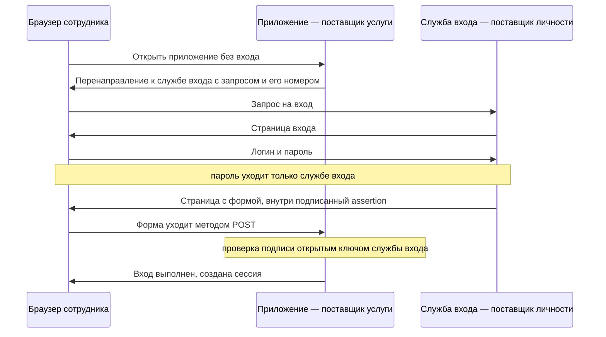
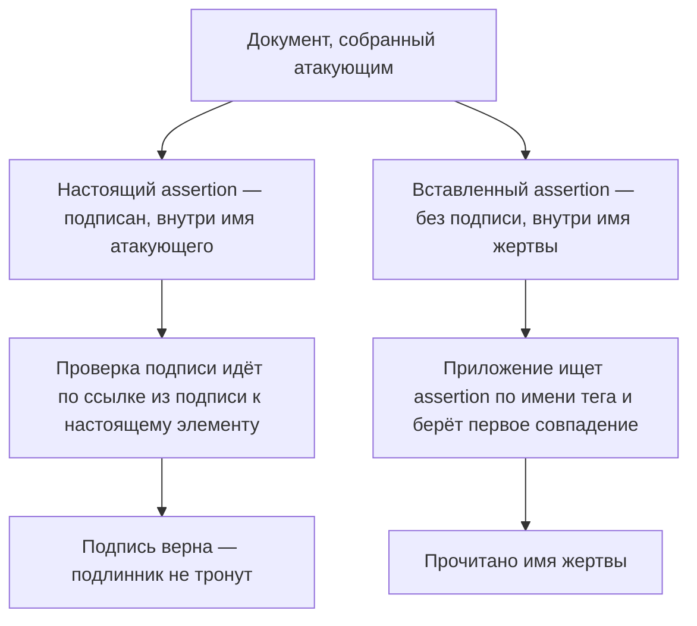

# SAML

Утро в крупной компании. Сотрудник открывает внутренний портал, и тот
перебрасывает браузер на общую страницу входа. Пароль вводится один раз,
а дальше почта, трекер задач и файловое хранилище пускают без единого
вопроса. Самого пароля эти приложения не видели никогда. Каждое из них
получило от службы входа подписанный документ и поверило подписи.

У доверия к такому документу есть учебный пример. В уязвимости единого
входа Google, которую разбирает cheat sheet OWASP, в ответе службы входа
не хватало обязательных полей, и одним из недостающих было
`InResponseTo`. Злоумышленником оказался свой же партнёр, злонамеренный
поставщик услуги: чужой готовый ответ он предъявлял как ответ на свой
запрос, и приложение пускало его под чужим именем.

## Один вход вместо двадцати

Просить пароль у каждого приложения и неудобно, и опасно. Люди
придумывают один пароль на всех или записывают их на бумажке, а каждое
приложение становится местом, где пароль могут украсть. Ответом стал
единый вход (single sign-on, SSO): человек входит один раз у одной
службы, и все приложения доверяют её результату. SAML (Security
Assertion Markup Language) — открытый стандарт, который описывает такой
обмен: как одна сторона сообщает другой, кто вошёл и с какими правами.

Участников двое, и между ними стоит браузер. Поставщик личности
(Identity Provider, IdP) — служба, которая знает пользователя в лицо:
проверяет логин и пароль и выпускает документ о результате. Поставщик
услуги (Service Provider, SP) — приложение, которое этот документ
принимает и по нему пускает пользователя. Документ называется assertion:
подписанный XML с утверждениями о том, кто вошёл. Как устроена цифровая
подпись на паре ключей и чем она отличается от HMAC, разбирает тема
`hmac-vs-signature`.

Устройство похоже на бюро пропусков бизнес-центра. Бюро проверяет
паспорт один раз и выдаёт подписанный пропуск, а охранник каждого этажа
паспорт уже не спрашивает: он смотрит подпись бюро. Здесь бюро
соответствует поставщику личности, охранник приложению, а пропуск
документу assertion. Ломается аналогия на переносе. Бумажный пропуск вы
несёте в кармане, а assertion переносит браузер, и всё, что проходит
через браузер, его владелец может прочитать и переписать. Поэтому вся
защита обмена держится на подписи и на том, что именно она покрывает.

## Как это работает

Обмен начинается, когда человек без входа открывает приложение. Формы
логина у приложения нет: оно отвечает перенаправлением к поставщику
личности, и вместе с перенаправлением уходит запрос на вход с уникальным
номером. Браузер показывает страницу входа, человек вводит пароль, и
пароль уходит только поставщику личности. Тот проверяет его, собирает
assertion, подписывает своим закрытым ключом и возвращает браузеру
страницу с формой. Форма отправляется в приложение сама, методом POST,
и несёт ответ с подписанным assertion. Приложение проверяет подпись
открытым ключом поставщика личности и создаёт сессию, как после
обычного входа.

Такой вариант называется веб-браузерным профилем SSO, и он самый частый.
Профиль — готовая связка правил под конкретный случай, здесь это «человек
входит через браузер». У профиля две привязки, то есть способа перенести
сообщение: запрос едет через перенаправление, а ответ возвращается формой
методом POST. Прямого канала между серверами здесь нет, всё переносит
браузер. Своего секрета у приложения в этом обмене нет: открытый ключ
поставщика личности ему выдали заранее, при настройке. Вся безопасность
держится на том, что именно покрывает подпись, — assertion целиком или
его часть.

**Описание схемы.** Схема читается сверху вниз и показывает полный обмен
веб-браузерного профиля. Каждое сообщение между приложением и службой
входа проходит через браузер: туда перенаправлением, обратно формой.
Пароль не покидает участок между браузером и службой входа, приложение
его не видит. Приложение получает только подписанный assertion и решает
всё по подписи.

**Откуда это взялось.** Единый вход понадобился раньше OAuth: крупные
организации держали десятки внутренних приложений, и просить пароль у
каждого было и неудобно, и опасно. SAML вынес аутентификацию к одному
поставщику личности, а приложениям отдал подписанное утверждение о
результате. XML и подпись над XML были тогда естественным выбором.
Вместе с ними стандарт унаследовал и тонкость формата: подпись в XML
можно приложить к одной части документа, а прочитать при этом другую.
На этой тонкости и стоит главная атака темы.

## Подпись верна, а прочитано чужое

Подпись в XML устроена иначе, чем в JWT (JSON Web Token), который
разбирают темы `jwt-basics` и `jwt-attacks`. Там
подписывается сообщение целиком. Здесь подпись лежит внутри самого
документа и покрывает один элемент: у подписи есть ссылка на
идентификатор того, что подписано. Рядом с подписанным элементом в том
же документе может лежать неподписанный, и формат не видит в этом
проблемы.

Атака называется обёртыванием подписи (XML signature wrapping), и cheat
sheet отсылает к статье 2012 года «On Breaking SAML: Be Whoever You Want
to Be». Атакующий входит сам, как обычный пользователь, и получает
настоящий assertion со своим именем, подписанный поставщиком личности.
Дальше он собирает новый документ. Настоящий элемент остаётся
нетронутым, и подпись над ним продолжает сходиться. А рядом вставляется
второй assertion, уже без подписи, с именем жертвы.

Уязвимое приложение делает два шага по разным адресам. Подпись оно
проверяет по ссылке из подписи и попадает на настоящий элемент: подпись
верна, подлинник не тронут. А читать личность оно идёт поиском по имени
тега, и поиск возвращает первое совпадение. Первым оказывается
вставленный элемент: порядком в документе управляет атакующий. Подпись
проверена над одним, а доверие отдано другому.

Это как договор, где подписана третья страница, а сумму проверяющий
читает с вложенного листа. Подпись на третьей странице настоящая, и лист
вкладыша её не портит: он лежит рядом. Здесь подписанная страница
соответствует настоящему assertion, вкладыш — подделке, а чтение суммы
«со страницы с заголовком про деньги» — поиску по имени тега. Ломается
аналогия на том, что в XML оба куска живут в одном файле, и вопрос лишь
в том, какой из них код найдёт первым.

**Описание схемы.** Схема читается сверху вниз. Из одного документа идут
две ветки: настоящий подписанный assertion и вставленный рядом поддельный.
Проверка подписи по ссылке из подписи приходит к настоящему элементу и
заканчивается вердиктом «подпись верна». Чтение личности поиском по имени
тега приходит к вставленному элементу, и приложение читает имя жертвы.

## Что проверяет принимающая сторона

Cheat sheet перечисляет меры против обёртывания, и держатся они на одном
принципе: доверять ровно тому, что подписано, а не тому, что лежит рядом
и похоже. Меры адресованы принимающей стороне, то есть приложению:
именно оно проверяет документ, и именно его код обманывает обёртывание.

1. Сначала схема, потом разбор. Схема XML — формальное описание
   допустимого устройства документа: какие элементы в нём бывают, в каком
   порядке и сколько раз. Документ сверяют со строгой локальной схемой до
   всякого использования, и лишний assertion в такую схему не
   вписывается. Схема обязана быть локальной: загруженная из сети могла
   приехать от атакующего.
2. Ключ от поставщика личности, а не из документа. Внутри подписи может
   лежать элемент `KeyInfo`, где отправитель прилагает ключ или
   сертификат. Доверять ему нельзя: атакующий подпишет подделку своим
   ключом и приложит в `KeyInfo` его же. Ключ берут напрямую у поставщика
   личности, хранят локально, а `KeyInfo` из документа игнорируют.
3. Элемент выбирают абсолютным путём. XPath — язык адресов внутри XML:
   путь перечисляет вложенность от корня документа до нужного элемента.
   Поиск по имени тега возвращает первое совпадение, а порядок в
   документе контролирует атакующий. Абсолютный путь указывает то место,
   где стоит подписанный элемент.
4. Сверяется, что именно подписано. У подписи есть ссылка на
   идентификатор подписанного элемента. Приложение проверяет, что эта
   ссылка указывает на тот самый assertion, которому оно собралось
   доверять. Эта проверка названа в cheat sheet прямой мерой против
   обёртывания: «подписано одно, прочитано другое» она делает
   невозможным по построению.
5. Ответ привязывается к запросу. Поле `InResponseTo` в ответе повторяет
   номер запроса, который приложение отправляло поставщику личности. Без
   него чужой готовый ответ предъявляется как ответ на ваш запрос. Именно
   этого поля не хватало в уязвимости единого входа Google.

Остался вопрос на границе мер. Спасло бы присутствие `InResponseTo` от
обёртывания подписи? Нет. `InResponseTo` привязывает к запросу ответ
целиком и работает против подмены ответа. Обёртывание подменяет не ответ,
а структуру внутри него: ответ настоящий и запросу соответствует, а
прочитан неподписанный элемент. Проверки закрывают разные дыры, и нужны
обе.

## Как опознать SAML в чужой системе

Признаков несколько. Вход уводит браузер на страницу, которая приложению
не принадлежит, — корпоративную службу входа. Возврат приходит формой
методом POST с полем `SAMLResponse`: внутри него base64, а под ним XML с
элементами `Response` и `Assertion`. Запрос в обратную сторону едет с
полем `SAMLRequest`. Ту же задачу входа поверх OAuth решает надстройка
OpenID Connect из темы `oidc`, только там вместо XML приезжает
подписанный JWT.

На ревью вопросов три. Какой элемент приложение читает, и покрывает ли
подпись именно его? Откуда берётся ключ проверки, из документа или из
настроек? Проверяются ли `InResponseTo` и сроки действия документа? Тем
же взглядом «доверяют не тому, что подписано» смотрит и тема
`jwt-attacks`.

**Зачем это в работе AppSec-инженера.** SAML — это XML и подписи над XML.
Дефекты его проверки отличаются по форме от JWT, но не по сути: это
подпись, которой доверяют не там или не так. В ревью SSO-интеграций такой
обмен встречается постоянно. Задача темы — научить узнавать SAML в чужой
системе и видеть место, где проверка расходится с чтением, а не сделать
специалистом по стандарту.

## Источники

1. OWASP SAML Security Cheat Sheet; реестр `owasp-cs-saml`. Разделы:
   Introduction, Validate Message Confidentiality and Integrity, Validate
   Protocol Usage (InResponseTo), Validate Signatures (XML signature
   wrapping), Validate Protocol Processing Rules, Identity Provider and
   Service Provider Considerations (Reference URI на Assertion).
   <https://cheatsheetseries.owasp.org/cheatsheets/SAML_Security_Cheat_Sheet.html>
2. OpenID Connect Core 1.0 (errata set 2); реестр `oidc-core`. Раздел:
   Introduction — сопоставление с SAML-подобным единым входом.
   <https://openid.net/specs/openid-connect-core-1_0.html>

Каркас этапа: `owasp-asvs-5-document` (ASVS v5.0.0), `owasp-wstg-42`,
`owasp-top10-2025`. Наследуются всеми темами и отдельной строкой не
повторяются. Тема `hmac-vs-signature` разбирает разницу подписи, HMAC и
шифрования, на которую опирается разбор подписи assertion.

**Скоропортящийся слой.** Библиотеки разбора XML и их поведение по выбору
подписанного элемента меняются с версией; конкретные привязки и профили
SAML задаются смежными спецификациями OASIS.

**Маркеры уверенности.** Все утверждения темы — **по документации**, лично
открытой 2026-08-24 и перечитанной 2026-10-03: роли IdP и SP, обмен
подписанным assertion, веб-профиль SSO с привязками Redirect и POST,
обёртывание подписи и меры против него, требование `InResponseTo` и
уязвимость единого входа Google — по OWASP SAML Security Cheat Sheet
(Introduction, Validate Protocol Usage, Validate Signatures, Identity
Provider and Service Provider Considerations); сопоставление с
SAML-подобным входом — по OpenID Connect Core 1.0. Локальные стенды в
этой теме **не ставились**: уровень обзорный, задача — узнать SAML в
чужой системе, а не воспроизвести обёртывание подписи.
