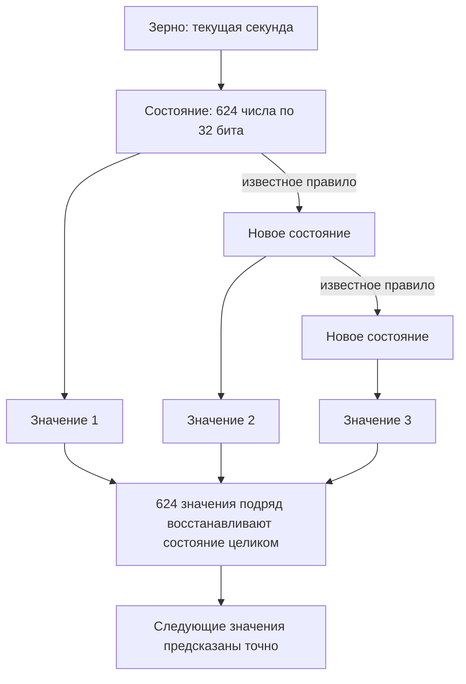

# Небезопасные генераторы случайных чисел

Пользователь нажимает «забыл пароль», и приложение присылает письмо со
ссылкой для сброса. В ссылке лежит токен — длинная строка вроде
`9f2c4a81e0b3…`. Кто её предъявил, тому приложение разрешает задать новый
пароль; жизненный цикл такого токена разбирает тема `password-reset-flaws`.
Токен обязан быть неугадываемым, иначе ссылку на чужой аккаунт получают без
всякого письма.

Теперь представьте, что приложение собирает токен так: берёт
текущую секунду и прогоняет её через обычный генератор случайных чисел из
стандартной библиотеки. Атакующий знает секунду выдачи приблизительно,
например он заказал сброс на свой адрес и видел время отправки. Он перебирает
секунды из этого окна, повторяет вычисление приложения и за доли секунды
находит зерно, которое даёт тот же токен. Взлома здесь не было: он повторил
работу приложения, потому что «случайность» в нём вычислима.

## Два генератора случайных чисел

Программа не умеет выбирать наугад: любое её действие — вычисление. Поэтому
случайные числа в ней получают двумя способами. Первый — посчитать по формуле,
второй — замерить шум. На первом устроен обычный генератор случайных чисел,
на втором — криптографически стойкий, и разница между ними решает всё в этой
теме.

Обычный генератор — это функция с памятью. Память называют состоянием: набор
чисел внутри генератора, который меняется после каждого выданного значения.
Стартовое состояние задаёт зерно (seed) — число, из которого генератор
выращивает всю последовательность. Каждое новое значение он считает из
состояния по фиксированному правилу и тут же обновляет состояние тем же
правилом. Отсюда свойство, которое в моделировании считается достоинством:
одно зерно всегда даёт одну последовательность.

Это похоже на тасование колоды по записанному рецепту: переложи верхнюю карту
вниз три раза, сними половину, вставь в середину. Рецепт известен всем, и,
пока начальный порядок карт секретен, результат выглядит случайным. Стоит
узнать начальный порядок — и весь результат воспроизводится дословно, ведь
рецепт не менялся. Здесь рецепт соответствует правилу генератора, начальный
порядок — зерну, итоговый порядок карт — выданным значениям. Где аналогия
ломается: колоду можно перетасовать руками непредсказуемо, а генератор без
нового зерна всегда повторит сам себя.

Второй способ устроен иначе. Криптографически стойкий генератор (CSPRNG)
берёт данные у операционной системы, а та копит шум от железа: тайминги
диска, сети, клавиатуры. Восстановимого по выводу состояния у него нет, и
прошлые значения о следующих не говорят ничего. Бытовое сравнение — игральная
кость против рецепта тасования. Каждый бросок кости — новый замер, и по
предыдущим броскам следующий не вычислить.

Важно не перепутать два свойства, потому что внешне они неотличимы. Разброс —
это равномерность: на длинной выборке значения обоих генераторов ложатся
ровно, и по картинке их не различить. Непредсказуемость — это невозможность
вычислить следующее значение по предыдущим. Обычный генератор даёт первое и
не даёт второго, стойкий даёт оба. Поэтому вопрос «каким генератором это
сделано» — не про качество чисел, а про то, что сможет атакующий.

Отсюда деление мест приложения на два сорта. Там, где нужен только разброс,
хватит обычного генератора. Это перемешивание карточек на странице, выбор
сервера из списка, разброс задержек перед повтором. Там, где значение нельзя
угадать, обязателен стойкий: такие значения называют секретами. Это
идентификатор сессии (тема `sessions-vs-tokens`) и токен восстановления
пароля. Сюда же относятся токен против межсайтовых запросов (тема
`csrf-tokens`), соль для хеша пароля (тема `password-storage`) и ключи.

**Зачем это в работе AppSec-инженера.** Дефект попадается в ревью постоянно и
чинится одной строкой, поэтому находка почти всегда доходит до правки. Работа
здесь — два действия: найти вызовы негодной функции и по каждому решить,
попадает ли значение в разряд секретов. Второе действие и есть тема: `random`
в перемешивании карточек — не находка, `random` в токене восстановления —
находка.

## Как это работает

**Откуда это взялось.** Генератор в стандартной библиотеке писался под задачи
моделирования. От него требовались три свойства: равномерность, скорость и
воспроизводимость по зерну — последнее нужно, чтобы повторить численный опыт
с теми же данными. Все три свойства работают против секретности, потому что
воспроизводимость — это и есть предсказуемость. Когда те же функции взяли
для идентификаторов сессий, достоинство превратилось в уязвимость, и языкам
пришлось заводить второй генератор. Первый при этом остался на месте и
зовётся коротким привычным именем: `random`, `rand`, `Math.random`.

Посмотреть на оба способа в деле можно на стенде `e04-random.py`. Он
показывает два способа предсказать вывод обычного генератора и один
правильный вариант:

```text
$ python e04-random.py
(1) Генератор засеян временем выдачи (УЯЗВИМО)
  окно перебора: 7201 секунда; попыток до совпадения: 3601
  найден seed: 1787600000; токен воспроизведён: True
(2) Генератор по умолчанию, seed неизвестен (УЯЗВИМО)
  наблюдений: 624 подряд по 32 бита
  следующие 5 значений предсказаны: True
(3) secrets (ПРАВИЛЬНО)
  совпали: False; бит энтропии на токен: 128
  внутреннего состояния, восстановимого по выводу, у os.urandom нет
```

Первый случай — явное зерно из времени, тот самый сценарий с письмом из
начала темы. Приложение засеивает генератор текущей секундой и выдаёт токен.
Атакующий берёт окно в час до и час после известной секунды, это 7201
секунда. Каждую секунду он подставляет как зерно, пока вывод не совпадёт с
чужим токеном. На стенде зерно лежало посередине окна, и совпадение нашлось
на 3601-й попытке. По времени это доли секунды, потому
что попытка — одно вычисление.

Второй случай тяжелее и потому опаснее: зерно неизвестно и взято у
операционной системы. Это не помогает, потому что атака идёт не через зерно,
а через сам вывод. Генератор в стандартной библиотеке Python называется
MT19937. Его состояние — 624 числа по 32 бита, и каждое выданное значение
получается из одного числа состояния обратимой цепочкой сдвигов и побитового
исключающего ИЛИ. Обратимость значит, что по выходу вычисляется вход, и
никакой системы уравнений решать не нужно: каждое значение напрямую
разворачивается в своё число состояния. Поэтому 624 подряд идущих значения
возвращают состояние целиком. Стенд восстановил его и предсказал следующие
пять значений точно.

Наблюдения при этом не требуют привилегий. Если приложение печатает числа из
`random` в идентификаторах заказов, кодах приглашения или токенах, атакующий
соберёт 624 значения обычными запросами — так, как их собирает любой
пользователь.



**Описание схемы.** Схема читается сверху вниз. Из зерна возникает состояние,
и дальше генератор живёт по кругу: состояние даёт значение и по известному
правилу переходит в новое состояние. Атакующий видит только значения справа,
но 624 значений подряд хватает, чтобы восстановить само состояние. С этого
момента он вычисляет все следующие значения точно.

Третий случай на стенде — контрольный. Тот же токен собран генератором
`secrets`: два вызова подряд дали разные значения по 128 бит. Восстанавливать
по ним нечего, потому что состояния с известным правилом там нет.

Оба опыта с обычным генератором заканчиваются одним выводом: он предсказуем
по устройству, и выбор зерна этого не меняет. Неизвестное зерно закрывает
первый способ и не мешает второму. Вопрос на перенос: какие значения вашего
приложения порождает обычный генератор и сколько их подряд увидит атакующий
обычными запросами?

### Сколько бит нужно

Второе требование к секрету — количество. Энтропия — это мера
непредсказуемости: сколько вариантов пришлось бы перебирать атакующему.
Считают её в битах, и один бит — это деление пространства вариантов пополам.
Бытовой пример — кодовый замок с четырьмя цифрами: вариантов 10 000, это
примерно 13 бит, и перебрать их можно за вечер. У токена в 128 бит вариантов
2 в степени 128, и перебор невозможен физически.

Энтропию значения считают по алфавиту и длине, а не на глаз. Шестнадцатеричный
знак — 16 вариантов, это 4 бита. Знак из набора «буквы обоих регистров и
цифры» — 62 варианта, это около 5,95 бита. Токен из 32 шестнадцатеричных
знаков даёт 32 × 4 = 128 бит, и это норма. Токен из 16 знаков даёт 64 бита,
и для значения, которое нельзя угадать, этого мало.

## Как это атакуют

Порядок этой работы описывает WSTG-v42-SESS-01 — раздел руководства OWASP по
тестированию. Сначала атакующий собирает значения одного вида обычными
запросами: идентификаторы сессий, коды приглашений, номера заказов. Выборку
берут в одном временном окне, чтобы следы времени не смазались. Затем
значения выписывают столбиком и ищут три следа: общие части у всех значений,
поля, которые растут от значения к значению, и участки, похожие на время.

Каждый след указывает на свой источник. Общая часть — это константа или адрес
машины, как в UUID версии 1 (стандартный идентификатор из 128 бит; разбор —
в разделе «Частая ошибка»). Возрастающее поле — счётчик или время. Ровный
разброс без следов — генератор, и тогда вопрос сводится к его типу. Дальше
проверяют два предположения из стенда выше: перебирают правдоподобные зёрна
вокруг известных моментов и копят значения для восстановления состояния.
Успех в обоих случаях один и тот же: атакующий предсказывает чужие значения
раньше, чем приложение их выдаёт.

## Как это выглядит в коде

Ревьюер ищет имя функции. Список негодных короткий, и для каждого языка он
свой. В C это `random()` и `rand()`, в Java — `Math.random()` и
`java.util.Random`, в PHP — `mt_rand()` и `uniqid()`. В C# это `Random()`,
в Ruby — `rand()`, в Go — пакет `math/rand`, в Node.js — `Math.random()`,
в Python — `random`. Не читая выносок, укажите строки, где значение становится
угадываемым.

```python
# УЯЗВИМО — демонстрация, не для продакшена
import random, time
def reset_token() -> str:
    random.seed(int(time.time()))                       # (1)
    return "%032x" % random.getrandbits(128)            # (2)
```

1. Зерно из времени: значение выводится из момента выдачи. Именно этот вызов
   перебрал стенд в первом опыте.
2. Даже без явного зерна генератор остаётся предсказуемым по своему выводу —
   это второй опыт стенда.

```javascript
// УЯЗВИМО — демонстрация, не для продакшена
const id = Math.random().toString(36).slice(2);   // (3)
const csrf = Date.now() + '-' + userId;           // (4)
```

3. Годная замена — `crypto.randomBytes` или `crypto.getRandomValues`.
4. Собственная сборка из времени и известного значения: угадывается целиком,
   и генератор для этого не нужен.

Ложное срабатывание того же вида — `random` там, где непредсказуемость не
нужна: порядок баннеров, разброс времени повтора, выбор сервера из списка.
Различает их вопрос: что получит атакующий, угадав значение. Если ответ
«ничего», это не находка.

## Как защититься

Правка короткая, а решение за ней делается в два шага. Шаг первый: каждое
значение, которое нельзя угадать, порождается криптографически стойким
генератором (ASVS `v5.0-11.5.1`). В Python это `secrets`, в Java —
`SecureRandom`, в Node.js — `crypto.randomBytes`, в PHP — `random_bytes`,
в Go — `crypto/rand`. Та же функция `reset_token` после правки выглядит так:

```python
import secrets

def reset_token() -> str:
    return secrets.token_hex(16)   # 32 шестнадцатеричных знака, 128 бит
```

Вызов `token_hex(16)` возвращает 16 байт, записанные 32 шестнадцатеричными
знаками. Ручного зерна здесь нет и быть не должно: стойкий генератор берёт
данные у операционной системы сам. Заданное вручную зерно превращает вывод в
воспроизводимый, а это ровно то, от чего мы ушли.

Шаг второй — количество. Норма — не меньше 128 бит энтропии, и считают её по
алфавиту и длине, как в разделе «Сколько бит нужно». К числу добавляются две
оговорки. UUID — не источник непредсказуемости, разбор ниже в разделе «Частая
ошибка». И хеш поверх предсказуемого значения не спасает: хеш-функция
детерминирована, и угадываемый вход даёт угадываемый выход.

Отдельный пункт — поведение под нагрузкой. Генератор обязан оставаться
стойким всегда: при нехватке системного шума правильное поведение —
подождать или вернуть ошибку, а не переключиться на слабый запасной источник
(ASVS `v5.0-11.5.2`). Запасной путь через обычный генератор сводит защиту на
нет ровно в момент нагрузки, то есть тогда, когда атакующий активнее всего.

## Частая ошибка

UUID на роль токена — годится? Сам UUID — стандартный вид уникального
идентификатора: 128 бит, записанные 32 шестнадцатеричными знаками в пять
групп через дефис. Генерируется он локально, без единого запроса наружу,
поэтому сгенерировать его может любая машина в любой момент. Довод звучит
так: UUID придуманы, чтобы не повторяться, длина у них внушительная, значит,
и на роль токена они годятся. Решите сами, прежде чем читать дальше.

Довод смешивает два свойства. Уникальность значит «не повторится»,
непредсказуемость — «не угадается», и UUID отвечает за первое. Посмотрите на
версию 1: два значения, выданные подряд одной машиной, различаются только
первой группой знаков.

```text
$ python3 -c "import uuid; print(uuid.uuid1()); print(uuid.uuid1())"
033dd172-bf00-11f1-8697-30560f0a910d
033dd1c2-bf00-11f1-8697-30560f0a910d
```

Последние двенадцать знаков — адрес узла, то есть самой машины, и у всех
значений, выданных на ней, он один. Старшая часть выведена из времени с
точностью до сотни наносекунд, поэтому два значения подряд почти совпадают.
Атакующий, который знает адрес машины и примерное время выдачи, перебирает
остаток. Версия 4 честно случайна, но шесть
бит из 128 заняты служебными полями: четыре под номер версии, два под
вариант. Случайных остаётся 122 бита — ниже нормы, которую ASVS ставит для
непредсказуемых значений, и потому в требовании UUID оговорены отдельно.

Тот же корень у другого довода: «мы засеваем генератор временем,
идентификатором процесса и счётчиком, угадать такое нельзя». Все три величины
наблюдаемы или перебираются. Время видно по письму, идентификатор процесса
перебирается в малом диапазоне, а счётчик по устройству последователен.
Смешение наблюдаемых величин не добавляет энтропии, а перекладывает её:
энтропия не складывается из наблюдаемого.

## Чеклист для ревью

1. Проверьте, что значения, которые нельзя угадать, порождаются криптографически
   стойким генератором (`v5.0-11.5.1`).
2. Проверьте, что длина и алфавит такого значения дают не меньше 128 бит
   энтропии.
3. Проверьте, что зерно генератора не задаётся из времени, идентификатора
   процесса или счётчика.
4. Проверьте, что UUID не используется там, где требуется непредсказуемость.
5. Проверьте, что каждое найденное применение обычного генератора разобрано по
   вопросу «что получит атакующий, угадав значение».
6. Проверьте, что генератор остаётся стойким под нагрузкой и не переходит на
   запасной источник (`v5.0-11.5.2`).

## Попробуй сам

Соберите из своего или учебного приложения два-три десятка значений одного
вида: идентификаторов сессии, токенов, кодов приглашения. Берите их в одном
временном окне, как в разделе «Как это атакуют». Выпишите значения в столбик
и посмотрите на общие части, возрастающие поля и повторяющиеся хвосты. Затем
найдите в коде место, где они порождаются.

**Критерий выполнения.** Названа функция-источник и решено, годная она или
нет. Энтропия значения посчитана по алфавиту и длине, и число сопоставлено со
128 битами. Отдельно записано, нашлись ли в столбике общие части.

## Проверь себя

1. Коды приглашения порождаются так:

   ```python
   import random

   def invite_code():
       return '%08x' % random.getrandbits(32)
   ```

   Атакующий собрал 624 выданных кода подряд обычными запросами. Что он получил
   и что сможет делать дальше?
2. Функция `reset_token` из раздела «Как это выглядит в коде» засевает
   `random` временем. Какая правка устраняет дефект?

   A. Засевать генератор временем вместе с идентификатором процесса и
      счётчиком — такое сочетание не угадать.

   B. Заменить `random` на `secrets` и убрать ручное зерно вовсе.

   C. Прогонять значение через SHA-256: вывод перестанет читаться.

3. Почему неизвестное зерно, взятое у операционной системы, не спасает обычный
   генератор?
4. Предскажите, что напечатает эта программа: два разных токена или два одинаковых?

   ```python
   import random
   random.seed(1787600000)
   print('%032x' % random.getrandbits(128))
   random.seed(1787600000)
   print('%032x' % random.getrandbits(128))
   ```

5. Возврат к теме `sessions-vs-tokens`: почему предсказуемый идентификатор
   сессии опаснее предсказуемого кода приглашения?

<details markdown="1">
<summary>Ответ 1</summary>

1. Состояние генератора целиком: 624 подряд идущих значения по 32 бита его
   восстанавливают. Дальше атакующий предсказывает каждый следующий код
   приглашения точно и регистрируется по чужим кодам.

</details>

<details markdown="1">
<summary>Ответ 2: разбор вариантов</summary>

2. Верный ответ — B.

   A. Неверно. Все три величины наблюдаемы или перебираются, и их смешение
      энтропию не складывает, а перекладывает: энтропия не складывается из
      наблюдаемого.

   B. Верно. `secrets` берёт данные у операционной системы, и восстановимого по
      выводу состояния у него нет. Ручное зерно убрано, потому что оно делает
      вывод воспроизводимым.

   C. Неверно. Хеш-функция детерминирована: атакующий перебирает те же входы и
      сравнивает хеши с выданным значением. Предсказуемый вход даёт
      предсказуемый хеш.

</details>

<details markdown="1">
<summary>Ответ 3</summary>

3. Потому что восстановление состояния идёт по самому выводу и о зерне ничего
   не предполагает: 624 наблюдения возвращают состояние независимо от того, чем
   генератор засеян. Перебор зерна — другой способ, и он работает только когда
   зерно угадываемо, например время.

</details>

<details markdown="1">
<summary>Ответ 4</summary>

4. Два одинаковых: генератор детерминирован зерном, и одно зерно даёт одну
   последовательность. Прогон: фрагмент из вопроса, сохранённый как
   `probe.py`, — `python3 probe.py` печатает два совпадающих значения:

   ```text
   $ python3 probe.py
   705e5f1b1be869f68e5bb2897e1552f6
   705e5f1b1be869f68e5bb2897e1552f6
   ```

</details>

<details markdown="1">
<summary>Ответ 5</summary>

5. Потому что идентификатор сессии сам по себе даёт доступ: угадав его,
   атакующий работает от имени пользователя без пароля. Код приглашения обычно
   ведёт к отдельному действию с собственными проверками, и цена угадывания
   ниже.

</details>

## Источники

1. OWASP Web Security Testing Guide v4.2, WSTG-SESS-01 «Testing for Session
   Management Schema»; реестр `wstg-v42-sess-01-session-schema`. Разделы:
   Session Analysis — Token Structure & Information Leakage, Session ID
   Predictability and Randomness (сбор выборки в одном временном окне, поиск
   возрастающих полей и следов времени, перечень вопросов к выборке), Cookie
   Reverse Engineering (непредсказуемость среди четырёх свойств cookie).
   <https://owasp.org/www-project-web-security-testing-guide/v42/4-Web_Application_Security_Testing/06-Session_Management_Testing/01-Testing_for_Session_Management_Schema>
2. OWASP Cryptographic Storage Cheat Sheet; реестр `owasp-cs-crypto-storage`.
   Разделы: Secure Random Number Generation (разделение генераторов и таблица
   негодных и годных функций по языкам), UUIDs and GUIDs (версия 1 из времени
   и адреса узла, версия 4 и зависимость от реализации), Key Generation.
   <https://cheatsheetseries.owasp.org/cheatsheets/Cryptographic_Storage_Cheat_Sheet.html>

Каркас этапа: `owasp-asvs-5-document` (ASVS v5.0.0), `owasp-wstg-42`,
`owasp-top10-2025`. Наследуются всеми темами и отдельной строкой не
повторяются.

**Скоропортящийся слой.** Таблица негодных и годных функций по языкам живёт
вместе с их стандартными библиотеками и обновляется вместе с ними; разделение
на два генератора и требование к энтропии стабильны.

**Маркеры уверенности.** Перебор зерна за 3601 попытку, восстановление
состояния генератора Python по 624 значениям с точным предсказанием следующих
пяти, разброс двух вызовов `secrets.token_hex`, повтор адреса узла в двух
подряд выданных UUID версии 1 и 122 случайных бита в версии 4 —
**проверено лично** 2026-08-24 на Python 3.14.7 (стенд `e04-random.py`, свой
разбор преобразования выхода генератора). При переписывании 2026-10-03 все
четыре прогона повторены локально на Python 3.14.7, выводы совпали; прогон
ответа 4 (`probe.py` с зерном 1787600000) повторён там же и печатает два
совпадающих значения. Перечень негодных и годных функций других языков —
**по документации** (Cryptographic Storage Cheat Sheet, открыт лично
2026-08-24) и **не воспроизводился**: стендов на этих языках не ставилось.
Процедура сбора и анализа выборки идентификаторов — **по документации**
(WSTG-SESS-01, открыт лично 2026-08-24). Требование 128 бит и оговорка про
UUID — **по документации** (ASVS v5.0.0, раздел V11.5).
