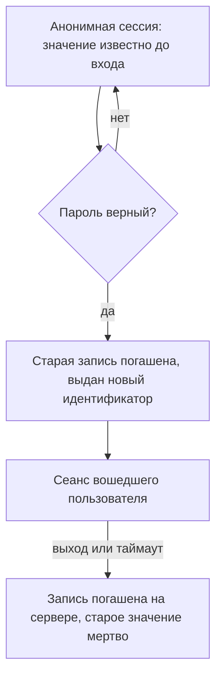
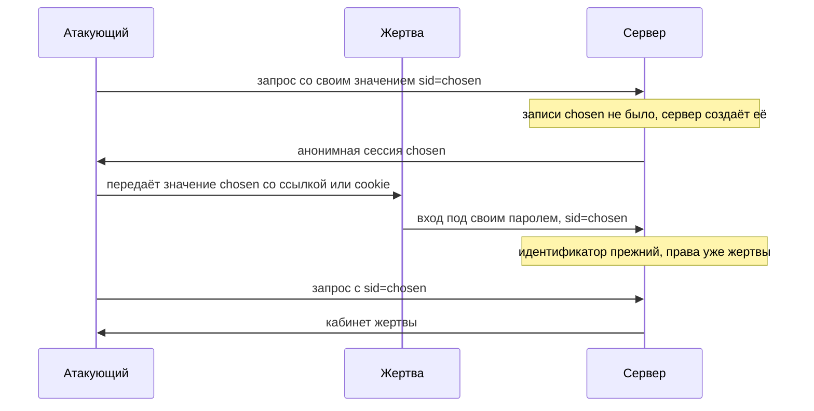

# Session fixation и инвалидация сессии

Стенд темы (`.smgr/appsec-stage1-auth/exp/e03-session.py`, Python 3.14.7)
прогоняет два опыта против приложения с привычным входом: форма принимает
логин и пароль, а ссылка «выйти» очищает cookie. В первом опыте атакующий
навязывает своё значение сессии жертве по имени anna, и она входит под
ним. Во втором пользователь по имени boris выходит, а копию его cookie,
сохранённую до выхода, предъявляют серверу заново. Вот что печатает
прогон:

```text
после входа идентификатор прежний:     ДА
атакующий со своим значением видит:     anna
предъявление cookie после выхода даёт:  boris
```

Первые две строки значат, что вход не сменил идентификатор сессии:
значение, выбранное атакующим, стало значением сеанса вошедшей anna. Это
закрепление сессии (session fixation), атака, где значение выбирает
атакующий, а жертва входит уже под ним. Третья строка — про выход: cookie
в браузере boris стёрта, но запись на сервере жива, и сохранённая копия
«воскрешает» его сеанс. Это сломанная инвалидация: инвалидацией называют
гашение записи сессии на сервере, после которого старый идентификатор
больше ничего не открывает.

## Как это работает

Уровень доверия — это то, сколько приложение знает о человеке за запросом
и что ему разрешает. Бытовой аналог — посетитель банка: с улицы он может
взять буклет, назвавшись по паспорту — проверить счёт, а после повторного
подтверждения — перевести крупную сумму. У приложения ступени те же:
аноним, вошедший пользователь, вошедший с недавним подтверждением. Где
аналогия ломается: в банке ступени различает сотрудник, а у приложения
есть только строка из запроса, и вся разница между ступенями записана в
ней.

**Откуда это взялось.** Ранняя схема была экономной: сеанс один,
идентификатор выдаётся на первом визите и живёт до выхода. Менять его при
входе казалось излишним, потому что сеанс тот же. Сломалась эта экономия
на том, что значение до входа видит не только сервер: его можно получить
гостем, передать чужому браузеру, а кое-где и выбрать самому. Тогда
запись, чьё значение известно атакующему, при входе получает права
жертвы. Ответом стало правило: смена уровня доверия обязана менять
идентификатор.

Почему правило звучит именно так. Запись сессии живёт на сервере, а
идентификатор — бессмысленная строка-ссылка на неё; эта модель разобрана
в теме `sessions-vs-tokens`. Кто знает строку, тот и предъявляет запись.
Если при входе строка остаётся прежней, все, кто знал её до входа, входят
вместе с жертвой. Новый идентификатор разрывает это равенство: после
входа старая строка не указывает ни на что.

У правила есть вторая половина, про конец сеанса. Выход обязан гасить
запись на сервере, а не только стирать cookie в браузере. Cookie — лишь
носитель строки: стёртая cookie забирает строку у браузера, но не у того,
кто успел её сохранить. Пока запись на сервере жива, сохранённая строка
продолжает открывать сеанс.



**Описание схемы.** Схема показывает жизненный цикл сессии как цепочку
состояний, и в ней два перехода, ради которых написана тема. Переход
«пароль верный» обязан гасить старую запись и порождать новый
идентификатор: без этого остаётся закрепление. Переход «выход или
таймаут» обязан гасить запись на сервере: без этого остаётся
«воскрешение» по сохранённому значению. Оба дефекта из прогона в начале
темы — это две стрелки, по которым забыли сделать шаг.

## Как это атакуют

Признак уязвимости тестовый гид формулирует прямо (WSTG-v42-SESS-03):
если после успешного входа сервер не выдал новый идентификатор,
закрепление сессии возможно. Проверка не требует кода: записать значение
до входа, войти, сравнить.

Атака идёт в четыре шага:

1. Атакующий получает значение сессии у приложения как гость или
   навязывает своё, если сервер принимает чужие значения.
2. Он доставляет значение в браузер жертвы: ссылкой с идентификатором в
   адресе, как в сценарии из `sessions-vs-tokens`, или принудительной
   cookie с родственного узла.
3. Жертва входит под своим паролем, и запись с известным атакующему
   значением получает её права.
4. Атакующий предъявляет то же значение и попадает в кабинет жертвы.

Принудительная, или навязанная, cookie — это cookie, которую жертве ставит
не само приложение, а смежный узел того же домена. Например,
скомпрометированный блог `blog.bank.example` вправе поставить cookie на
весь `bank.example`, и браузер приложит её к запросам приложения. Механика
атрибута `Domain` разобрана в теме `cookies`. Отдельный тест гида, Test
with Forced Cookies, проверяет ровно это: примет ли приложение значение,
которого оно не выдавало.

Стенд из начала темы прогоняет всю цепочку на двух приложениях, уязвимом
и исправленном:

```text
=== уязвимое приложение ===
1. сервер принял подставленное значение:      ДА
2. после входа идентификатор прежний:         ДА
3. атакующий со своим значением видит:         anna
4. предъявление cookie после выхода даёт:      boris
=== исправленное приложение ===
1. сервер принял подставленное значение:      нет
2. после входа идентификатор прежний:         нет
3. атакующий со своим значением видит:         аноним
4. предъявление cookie после выхода даёт:      аноним
```

Строки 1–3 — закрепление. Уязвимое приложение приняло подставленное
значение, не сменило его при входе, и атакующий со своим значением увидел
кабинет вошедшей anna. Исправленное на входе выдало новый идентификатор,
и старое значение осталось анонимным. Строка 4 — инвалидация: после выхода
уязвимое приложение по сохранённой cookie всё ещё показывает кабинет
вышедшего boris, а исправленное отвечает анонимом.



**Описание схемы.** Атакующий касается сервера дважды: создаёт сеанс со
своим значением и в конце предъявляет его. Вход жертвы между этими двумя
касаниями ничего в значении не меняет, и в этом весь дефект. У
исправленного приложения на шаге входа появляется действие, которого здесь
нет: старая запись гасится, и предъявление `chosen` в финале вернуло бы
анонима.

### Выход, который ничего не гасит

Вторая половина темы атакуется без жертвы вовсе. Тест WSTG-v42-SESS-06
предлагает такую проверку: скопировать cookie до выхода, выйти,
восстановить значение и дойти по нему до защищённой страницы. Если
получилось, выход был косметическим, потому что сервер запись не погасил.
Cheat Sheet по управлению сессиями говорит то же: сеанс завершается на
бэкенде. Заголовок `Clear-Site-Data` и стирание cookie он называет мерами
вспомогательными. `Clear-Site-Data` велит браузеру стереть данные сайта,
то есть cookie, хранилище и кеш. Но до копии значения, сохранённой
атакующим, не добирается ни он, ни стирание.

**Зачем это в работе AppSec-инженера.** Оба дефекта проверяются одним
наблюдением: сравнить идентификатор сессии до и после входа, а после
выхода — предъявить старый. Если при входе значение не поменялось или
после выхода старое всё ещё работает, это находка. Ни строчки кода читать
не нужно: вся проверка — несколько запросов и одна сохранённая cookie.

## Как это выглядит в коде

Ревьюер ищет, меняется ли идентификатор при входе и гасится ли запись при
выходе. В двух функциях ниже три дефекта: два на входе и один на выходе.
Назовите все три до чтения выносок.

```python
# УЯЗВИМО — демонстрация, не для продакшена
def login(request):
    sid = request.cookies.get("sid") or new_sid()   # (1)
    SESSIONS[sid]["user"] = authenticate(request)    # (2)
    return set_cookie("sid", sid)

def logout(request):
    return set_cookie("sid", "")                     # (3)
```

1. Идентификатор берётся из присланной cookie. Значение выбрал клиент, и
   вход его не меняет. Это строки 1 и 2 прогона.
2. Вход пишет пользователя в ту же запись, и идентификатор остаётся
   прежним. Отсюда строка 3 прогона: атакующий видит кабинет жертвы.
3. Выход стирает cookie в браузере, но запись на сервере жива:
   предъявление старого значения возвращает сеанс. Это строка 4 прогона.

Признаки такие. Вход, который использует присланный идентификатор.
Отсутствие вызова смены идентификатора при входе: в одних фреймворках это
`session.regenerate`, в других, например в Java, — пересоздание объекта
`HttpSession`. Выход, который трогает только cookie. Приём идентификатора
из строки запроса или адреса страницы. Отсутствие таймаута: без него
сохранённое или навязанное значение живёт бессрочно.

## Как защититься

Правило темы раскладывается на два события: подъём доверия гасит старое
значение и порождает новое, конец сеанса гасит запись на сервере. Разбор
исправленного варианта идёт по трём следам: в какой момент рождается новый
идентификатор, что происходит со старой записью, чем выход отличается от
стирания cookie.

```python
# Исправлено.
def login(request):
    user = authenticate(request)
    if not user:
        return error("Неверный логин или пароль")
    old = request.cookies.get("sid")
    SESSIONS.pop(old, None)                          # (1)
    sid = new_sid()                                  # (2)
    SESSIONS[sid] = {"user": user}
    return set_cookie("sid", sid, http_only=True)

def logout(request):
    SESSIONS.pop(request.cookies.get("sid"), None)   # (3)
    return set_cookie("sid", "")
```

1. Старая запись гасится до выдачи новой: подставленное значение перестаёт
   что-либо значить.
2. Новый идентификатор порождается сервером после успешной проверки
   (ASVS v5.0-7.2.4).
3. Выход удаляет запись на сервере, а не только cookie (ASVS v5.0-7.4.1).

Разложим листинг по трём следам. Новый идентификатор рождается только
после того, как пароль проверен: до проверки доверия нет, и менять нечего.
Старая запись удаляется в том же шаге, поэтому значение, которое атакующий
успел узнать или навязать, указывает в никуда. Выход зеркалит вход: запись
удаляется на сервере, и сохранённая кем-то копия значения больше не
открывает сеанс. Подумайте сами, почему новый идентификатор порождается
только после успешной проверки, а не в её начале: разбор ждёт в блоке
«Проверь себя».

**Смена уровня доверия — не только вход.** То же правило действует при
любом подъёме привилегий: подтверждение второго фактора (тема
`mfa-bypass`), вход в административную зону, повторная аутентификация
перед чувствительным действием. Cheat Sheet требует нового идентификатора
при каждом таком переходе. Логика та же, что у входа: до перехода значение
могли знать посторонние, после него — только владелец.

**Что ставится рядом.** Смена идентификатора не ограничивает жизнь сессии,
поэтому рядом ставят два срока. Таймаут бездействия гасит запись, если от
пользователя долго нет запросов, а абсолютный срок гасит её в любом
случае, даже при живой активности. Ориентиры Cheat Sheet: 2–5 минут
бездействия для высокорисковых приложений, 15–30 для остальных,
абсолютный срок 4–8 часов. Дальше идут атрибуты cookie из темы `cookies`:
`HttpOnly`, `Secure`, префикс `__Host-`. А при смене пароля гасят прочие
сессии учётной записи, и эта процедура разобрана в `password-reset-flaws`.

Убедиться, что защита работает, можно без чтения кода, тем же наблюдением,
что описано в разделе «Как это атакуют». Запишите идентификатор до входа и
после: значения обязаны различаться. Выйдите и предъявите сохранённое значение защищённой
странице: ответ обязан быть анонимным. Ровно это показывает исправленное
приложение из прогона.

## Частая ошибка

Cookie в браузере стёрта — сессия закрыта? Ответьте сами, до разбора.

Судят по видимой стороне: при выходе cookie стёрлась, значит, сессия
закрыта.

**Сессия живёт на сервере, а не в cookie.** Стёртая cookie забирает
значение у браузера, но запись сеанса остаётся на сервере. Любой, кто
сохранил значение заранее, предъявляет его и возвращается в сеанс.
Подмена здесь одна: значение в браузере принято за сам сеанс, а значение —
лишь предъявитель записи, которая никуда не делась.

Контрпример из прогона. Уязвимое приложение после выхода стёрло cookie,
но предъявление сохранённого значения, строка 4, вернуло кабинет
вышедшего `boris`. Запись на сервере никто не гасил, и выход оказался
косметическим.

## Чеклист для ревью

1. Проверьте, что вход выдаёт новый идентификатор сессии и гасит прежний
   (ASVS v5.0-7.2.4).
2. Проверьте, что приложение отвергает идентификатор сессии, которого само
   не выдавало.
3. Проверьте, что идентификатор сессии не принимается из строки запроса
   или адреса страницы.
4. Проверьте, что выход гасит запись сессии на сервере, а не только
   стирает cookie (ASVS v5.0-7.4.1).
5. Проверьте, что предъявление значения после выхода или таймаута не
   восстанавливает сеанс (WSTG-v42-SESS-06).
6. Проверьте, что идентификатор меняется при каждом подъёме уровня
   доверия, а не только при первом входе.
7. Проверьте, что у сессии заданы таймаут бездействия и абсолютный срок.

## Попробуй сам

Возьмите приложение, с которым работаете. Запишите идентификатор сессии до
входа и сразу после: cookie видны в инструментах разработчика браузера.
Затем войдите, скопируйте значение cookie, выйдите и предъявите
скопированное значение защищённой странице.

**Критерий выполнения** наблюдаемый: два значения идентификатора, до входа
и после, и ответ на предъявление старой cookie после выхода. Вывод
записывается двумя строками: меняется ли идентификатор при входе и гасится
ли сессия на сервере при выходе.

## Проверь себя

1. Выход из кабинета отвечает так:

   ```http
   POST /logout HTTP/1.1
   Cookie: sid=9f2a

   HTTP/1.1 200 OK
   Set-Cookie: sid=; Max-Age=0
   ```

   Жива ли сессия на сервере после этого — видно ли по транскрипту?
2. Вход и выход собраны как в разделе «Как это выглядит в коде»:
   идентификатор берётся из присланной cookie, выход стирает cookie. Какая
   правка устраняет оба дефекта?

   A. При выходе стирать cookie и полем `Max-Age=0`, и заголовком
      `Clear-Site-Data` — тогда запись можно оставить.

   B. При входе гасить старую запись и порождать новый идентификатор, при
      выходе — удалять запись на сервере.

   C. При входе принимать присланный идентификатор, только если он есть в
      хранилище сессий.
3. Почему новый идентификатор порождается после успешной проверки пароля,
   а не в её начале?
4. Предскажите, что напечатает эта модель входа без смены идентификатора и
   что она показывает?

   ```python
   SESSIONS = {}

   def login(sid, user):
       sid = sid or 'srv-1'
       SESSIONS.setdefault(sid, {})
       SESSIONS[sid]['user'] = user
       return sid

   login('chosen', None)    # атакующий получил анонимную сессию
   login('chosen', 'anna')  # жертва вошла под навязанным значением
   print(SESSIONS.get('chosen'))
   ```

5. Возврат к теме `cookies`: как родственный узел ставит жертве значение
   сессии на весь сайт?
6. Возврат к теме `sessions-vs-tokens`: где живёт сеанс у ссылочной сессии
   и почему выход гасит именно запись на сервере?

<details markdown="1">
<summary>Ответ 1</summary>

1. Не видно. `Set-Cookie` с пустым значением стирает cookie в браузере и
   ничего не говорит о записи на сервере. Проверка одним запросом:
   предъявить `sid=9f2a` защищённой странице — вернулся кабинет, значит
   инвалидации на сервере нет.

</details>

<details markdown="1">
<summary>Ответ 2: разбор вариантов</summary>

2. Верный ответ — B.

   A. Неверно. Сессия живёт на сервере, а не в cookie: стирание значения в
      браузере запись не гасит, и сохранённое значение «воскрешает» сеанс.
      `Clear-Site-Data` — мера вспомогательная, не замена.

   B. Верно. Подъём доверия гасит старое значение и порождает новое, конец
      сеанса гасит запись на сервере: предъявленное старое значение ни на
      что не указывает.

   C. Неверно. Анонимную сессию атакующий получает легально — она в
      хранилище есть — и навязывает её жертве. Проверка принята, а
      идентификатор при входе не сменился: после входа жертвы запись
      принадлежит ей, а значение по-прежнему известно атакующему.

</details>

<details markdown="1">
<summary>Ответ 3</summary>

3. Новый идентификатор отмечает смену уровня доверия, а до проверки
   доверия нет. Порождённый заранее идентификатор создавал бы запись на
   каждую чужую попытку входа и гасил бы старую анонимную сессию при
   каждой ошибке.

</details>

<details markdown="1">
<summary>Ответ 4</summary>

4. `{'user': 'anna'}`: атакующий предъявляет значение, которое сам
   навязал, и видит сеанс вошедшей жертвы. Вход записал пользователя в ту
   же запись, и идентификатор не сменился. Сам прогон: `python3 probe.py`
   с фрагментом из вопроса.

</details>

<details markdown="1">
<summary>Ответ 5</summary>

5. Родственный узел `blog.bank.example` ставит cookie сессии с атрибутом
   на весь домен `bank.example`; браузер прикладывает её и к приложению.

</details>

<details markdown="1">
<summary>Ответ 6</summary>

6. У ссылочной сессии смысл лежит в хранилище сервера, а идентификатор —
   бессмысленная ссылка на запись. Гасят запись: без неё предъявленное
   значение ни на что не указывает.

</details>

## Источники

1. OWASP Session Management Cheat Sheet; реестр `owasp-cs-session-management`.
   Разделы: Renew the Session ID After Any Privilege Level Change, Session
   Expiration, Manual/Automatic Session Timeout, Logout, Clear-Site-Data.
   <https://cheatsheetseries.owasp.org/cheatsheets/Session_Management_Cheat_Sheet.html>
2. OWASP WSTG-SESS-03 «Testing for Session Fixation», WSTG v4.2; реестр
   `wstg-v42-sess-03-session-fixation`. Разделы: How to Test, Test with Forced
   Cookies.
   <https://owasp.org/www-project-web-security-testing-guide/v42/4-Web_Application_Security_Testing/06-Session_Management_Testing/03-Testing_for_Session_Fixation>
3. OWASP WSTG-SESS-06 «Testing for Logout Functionality», WSTG v4.2; реестр
   `wstg-v42-sess-06-logout`. Раздел Testing for Server-Side Session
   Termination.
   <https://owasp.org/www-project-web-security-testing-guide/v42/4-Web_Application_Security_Testing/06-Session_Management_Testing/06-Testing_for_Logout_Functionality>

Каркас этапа: `owasp-asvs-5-document` (ASVS v5.0.0), `owasp-wstg-42`,
`owasp-top10-2025`; якоря подраздела: `ps-authentication`,
`owasp-cs-authentication`. Наследуются всеми темами и отдельной строкой не
повторяются.

**Скоропортящийся слой.** Значения таймаутов (2–5, 15–30 минут, 4–8 часов)
— рекомендация Cheat Sheet, живого документа без даты; годятся как
ориентир. Имена вызовов ротации сессии привязаны к фреймворку и его версии.

**Маркеры уверенности.** Приём подставленного значения, отсутствие ротации
при входе и «воскрешение» сеанса по старой cookie после выхода —
**проверено лично** 2026-08-24 на Python 3.14.7 стендом `e03-session.py`
(два приложения на одном порту). Правило смены идентификатора, процедура
forced cookies, серверная инвалидация, таймауты — **по документации**:
Session Management Cheat Sheet, WSTG v4.2, ASVS v5.0.0, открыты лично
2026-08-24. Постановка cookie с родственного узла разобрана в теме
`cookies` и здесь **не воспроизводилась** заново. Фрагмент из вопроса 4
прогнан повторно 2026-10-03, Python 3.14.7; вывод совпал дословно.
