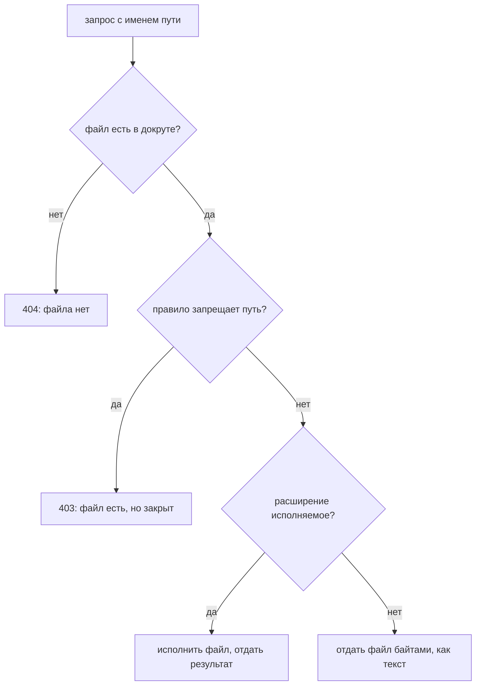

# Раскрытие исходников и конфигов

Вечером разработчик выкладывает новую версию магазина привычным способом.
Он заходит на боевую машину и обновляет там рабочую копию сайта — каталог,
выгруженный из репозитория. Тут же он правит прямо на месте и код, и
конфигурацию. А про запас снимает дамп базы — выгрузку всех таблиц в один
файл — и кладёт его рядом, на час. Утром в каталоге сайта лежит восемь
имён:

```text
.app.py.swp
.env
.git/
app.py
app.py~
backup.sql
config.php.bak
index.html
```

По замыслу наружу отдаются два файла из восьми: страница `index.html` и
результат работы `app.py`. Но веб-сервер про замысел не знает. У него один
принцип: пришёл запрос с именем пути — отдай байты файла с таким именем.
Поэтому адрес `/.git/config` возвращает внутренний адрес репозитория. А
адрес `/config.php.bak` показывает исходный текст конфигурации с паролями:
копию с изменённым расширением сервер не исполняет, а отдаёт как текст.

Такие находки и составляют класс раскрытия исходников и конфигов:
посторонний файл в каталоге, который веб-сервер отдаёт по прямому запросу.
Утечки, которые приложение порождает в рантайме, — стектрейсы, отладочные
страницы — разбирает тема `information-disclosure`. Здесь же след оставляет
не работающее приложение, а процедура выкладки. Дальше разберём, что именно
она оставляет, как это находят снаружи и как убрать класс целиком, а не
одно имя из списка.

## Как это работает

**Откуда это взялось.** Ранние способы выкладки состояли в том, чтобы
забрать рабочую копию прямо на боевой машине: перейти в каталог сайта и
обновить его из репозитория. Приём требует одной команды и пережил свою
эпоху, а вместе с ним в каталог приезжает служебный каталог системы
контроля версий. Та же история у редакторов: они пишут резервную копию
рядом с правимым файлом, и правка конфигурации на боевой машине оставляет
соседа. Ни один из этих файлов никто не выкладывал намеренно; их принесла
процедура.

Чтобы сказать, чем это опасно, нужно одно понятие. Каталог, из которого
веб-сервер отдаёт файлы наружу, называют корнем отдачи, или докрутом
(document root). Всё, что лежит внутри него, получает любой, кто знает имя
файла. Всё, что снаружи, запросом не достать. Устройство цепочки узлов
перед приложением разбирает тема `app-architecture`; здесь важен один её
конец — сам каталог отдачи.

Докрут похож на витрину магазина: что выставлено на витрине, то покупатель
получает без лишних вопросов, а до склада за дверью ему не дотянуться.
Соответствие прямое: витрина — это каталог отдачи, склад — остальная
файловая система сервера. А ломается аналогия на охране. Настоящую витрину
от покупателя отделяет стекло, и продавец решает, что туда класть. У
веб-сервера ни стекла, ни продавца нет: границу витрины задаёт только то,
какие файлы оказались в каталоге.

### Что лежит в докруте

Стенд `e11-docroot.py` собирает игрушечный каталог сайта и кладёт в него
типовой след выкладки:

```text
$ python e11-docroot.py
=== А. что лежит в докруте ===
    .app.py.swp
    .env
    .git/
    app.py
    app.py~
    backup.sql
    config.php.bak
    index.html
```

Восемь имён, из которых по замыслу отдаются два. Остальные шесть попали
сюда по дороге, и у каждого своё происхождение. Разберём их по одному.

### Каталог репозитория

Каталог `.git/` приезжает при выкладке через обновление рабочей копии. Это
служебный каталог системы контроля версий: git хранит в нём всё, что нужно
для своей работы, и среди прочего полную историю проекта. На боевой машине
внутри него оказывается вот что:

```text
=== Б. что внутри .git ===
    .git/HEAD             есть
    .git/config           есть
    .git/COMMIT_EDITMSG   есть
    .git/index            есть
    .git/config говорит, куда push:
        url = https://git.internal/shop/backend.git
```

Что здесь ценного для чужого. Файл `config` называет внутренний адрес
репозитория, а иногда несёт и учётные данные к нему. Файл `index`
перечисляет все файлы рабочей копии, включая те, которых снаружи не видно.
А хранилище объектов держит историю целиком, то есть и старые версии
файлов. Пароль, попавший в репозиторий год назад и удалённый на следующий
день, продолжает лежать в истории.

Поэтому стандарт верификации безопасности приложений OWASP (ASVS) выносит
метаданные репозитория отдельным требованием (v5.0-13.4.1). Приложение
развёртывается либо без них, либо так, чтобы эти каталоги были недоступны и
снаружи, и самому приложению.

### Файл окружения

Файл `.env` кладётся рядом с кодом по договорённости фреймворка: приложение
при старте читает из него настройки, которые нельзя коммитить в репозиторий.
Получается, что файл заведён ровно ради того, за чем за ним и приходят.
Внутри строки подключения к базе, ключи платёжных систем и секреты подписи.

### Следы редактора

Файл с завершающей тильдой `app.py~` и скрытый `.app.py.swp` — обычный
результат правки конфигурации по месту. Редактор пишет резервную копию
рядом с правимым файлом: один добавляет тильду, другой оставляет swap-файл
с незаконченной правкой. Тильда меняет расширение, и веб-сервер перестаёт
узнавать файл как программу: он отдаёт его как текст, а не передаёт
интерпретатору.

Именно поэтому копия `config.php.bak` опаснее самого `config.php`.
Оригинал сервер исполнит и вернёт результат работы, а копию покажет
исходным текстом — целиком, с паролями и адресами внутри.

### Резервные копии и выгрузки

Последняя пара — архив рядом с приложением, дамп базы вроде `backup.sql`,
остаток слияния с расширением `.orig`, который инструмент слияния оставляет
на случай отката. WSTG, руководство OWASP по тестированию, держит для
поиска таких файлов отдельную процедуру (WSTG-CONF-04). Там они названы
файлами, на которые ничего не ссылается: в разметке сайта их нет. Обходом
ссылок их не найти, только прямым запросом по угаданному имени.

### Как сервер решает, что отдать

Все шесть историй сходятся в одном месте: в решении веб-сервера на каждый
запрос. Решение короткое, и потому его честно видно целиком:



**Описание схемы.** Схема читается сверху вниз. На каждый запрос сервер
отвечает на три вопроса по очереди. Есть ли файл в докруте, не запрещён ли
его путь правилом, исполняемое ли у него расширение. По ответам запрос
приходит к одному из четырёх исходов: 404, 403, результат работы программы
или байты файла как есть.

Схема объясняет оба факта темы разом. Ответ 403 вместо 404 сообщает, что
путь серверу знаком: о нём написано правило. Строго говоря, 403 доказывает
правило, а не файл: у иного сервера запрет срабатывает раньше проверки
самого файла. И правило — тоже находка: запрет про `/.git` пишут там, где
такой каталог живёт. А ветка про расширение показывает, почему копия
`config.php.bak` отдаётся исходником: сервер дошёл до третьего вопроса и
ответил «нет».

**Зачем это в работе AppSec-инженера.** Работа ревьюера здесь смещена в
сторону развёртывания. Сервис обычно запускается из образа — упакованного
слепка приложения вместе с его окружением, а рецептом сборки образа служит
файл Dockerfile. Перечень того, что попало в образ, читается быстрее кода и
говорит больше. Класс у дефекта тот же, что у контроля доступа, — доступ к
тому, что доступным не объявляли.

## Как это атакуют

Взгляд на приложение снаружи, без доступа к коду, называют чёрным ящиком. С
этой стороны перечень служебных имён превращается в список запросов.
Атакующий берёт типовые имена — `.git/config`, `.env`, `backup.sql`,
`config.php.bak` и ещё сотню таких — и запрашивает каждое по очереди.
Процедуру такого поиска описывает всё та же WSTG-CONF-04.

Ответ на каждый запрос читается одним из трёх кодов со схемы выше. Код 404
говорит «такого файла нет». Код 200 и тело файла — находка. А код 403 — не
«закрыто»: сервер знает про этот путь больше, чем про несуществующий. Как
минимум о пути написано правило, а пишут его там, где файл при выкладке
есть.

Проверим на живом сервере. Встроенный сервер Python отдаёт каталог как
есть, и прогон повторяет начало темы:

```bash
mkdir -p probe/.git && cd probe
echo 'url = https://git.internal/shop/backend.git' > .git/config
python3 -m http.server 8901 &
```

```bash
curl -s http://127.0.0.1:8901/.git/config
```

```text
url = https://git.internal/shop/backend.git
```

Сервер отдал служебный файл с кодом 200, потому что не знает, что путь
служебный. В том же прогоне запрос `/.env` вернул строку
`DB_PASSWORD=s3cr3t`, а несуществующий путь дал код 404. Запрос к каталогу
`/.git/` показал ещё один исход, которого на схеме нет: схема про запрос к
файлу, а здесь запрошен каталог. Сервер вернул страницу со списком всех
файлов внутри. Такой список называют листингом каталога, и когда он
включён, имена угадывать не нужно вовсе (запись CWE-548 в каталоге
слабостей, требование ASVS v5.0-13.4.3).

## Как это выглядит в коде

Кода здесь чаще всего нет — есть сборка и конфигурация. Признак читается в
рецепте образа, то есть в Dockerfile. До выноски ответьте сами: какая
строка здесь всё решает?

```text
# УЯЗВИМО — демонстрация, не для продакшена
FROM python:3.14
WORKDIR /srv/www
COPY . .                      # (1)
RUN pip install -r requirements.txt
CMD ["python", "app.py"]
```

1. Одна строка копирует в образ рабочий каталог целиком: вместе с `.git`,
   `.env`, файлами редактора и всем, что лежало рядом во время сборки.

Второй признак — в конфигурации сервера: корень отдачи совпадает с корнем
приложения. Тогда любой файл рядом с кодом доступен по прямому запросу, и
единственной защитой остаётся перечень запрещённых путей:

```text
# УЯЗВИМО — по замыслу: запрещаем поимённо то, что вспомнили
location ~ /\.git { deny all; }
root /srv/www;
```

У такого перечня есть имя и противоположность. Список запрещённого закрывает
то, что автор вспомнил, и молчит про всё остальное. Список разрешённого
устроен наоборот: открыто то, что названо, а всё неназванное закрыто само.
Для файла с непредусмотренным именем разница решает всё: первый список его
отпускает, второй закрывает. Та же ловушка со списком запрещённых
расширений разобрана в теме `file-upload`.

Оба признака сходятся в одном: класс закрывается составом отдаваемого
каталога, а не перечнем запрещённых имён. Спросите о своей сборке: что в
ней мешает файлу с непредусмотренным именем попасть в отдаваемый каталог?

## Как защититься

Меры выстраиваются по силе, и первые две убирают класс, а не имя.

- **Не класть постороннее в отдаваемый каталог.** Корень веб-сервера
  содержит только то, что отдаётся: собранная статика и точка входа. Код,
  настройки и служебные каталоги лежат вне его, и запросу не за что
  зацепиться.
- **Собирать образ из перечня, а не из каталога.** Копировать в образ
  названные файлы либо исключать служебные явным списком исключений. Тогда
  `.git` и `.env` не попадают в образ независимо от того, что лежало рядом
  во время сборки.
- **Метаданные системы контроля версий недоступны** ни снаружи, ни самому
  приложению (ASVS v5.0-13.4.1).
- **Листинг каталога выключен** на всех отдающих узлах (ASVS v5.0-13.4.3).
- **Сервер отдаёт только заданные расширения.** Перечень разрешённого
  вместо перечня запрещённого закрывает и то, чего никто не вспомнил
  (ASVS v5.0-13.4.7).
- **Секреты не лежат файлом рядом с кодом.** Они приходят из хранилища
  секретов — отдельной службы, которая выдаёт их по запросу и ведёт учёт
  выдачи, — или из окружения процесса.

Исправленный рецепт образа короче уязвимого, потому что называет то, что
нужно, а не тащит всё:

```text
# Направление фикса: в образ едет перечень, отдаётся отдельный корень.
COPY app/ /srv/app/
COPY static/ /srv/www/
# .git, .env и файлы редактора в перечень не входят
```

Рецепт называет два каталога по именам, и всё остальное в образ не попадает.
Отдаётся отдельный корень `/srv/www`, а код лежит в `/srv/app`, вне его.
Файлу с придуманным именем взяться в образе неоткуда: строки про него нет.

**Где это не работает.** Перечень исключений при сборке — та же ловушка
списка запрещённого, если он написан вместо перечня включаемого: исключено
то, что вспомнили. Проверка докрута находит известные имена и молчит на
файле с придуманным именем. И ни одна из мер не отменяет главного: секрет,
однажды попавший в историю репозитория, остаётся в ней. Закрытие доступа к
`.git` не заменяет отзыв утёкшего ключа: ключ заменяют везде, где он
действует, потому что старый уже известен чужим.

## Как проверить свой каталог

Проверка своего каталога сводится к двум спискам: имена целиком и суффиксы.
Тот же стенд прогоняет её по собранному докруту:

```text
=== В. проверка: что искать у себя ===
    НАЙДЕНО  .app.py.swp        swap-файл редактора
    НАЙДЕНО  .env               файл окружения с секретами
    НАЙДЕНО  .git               каталог системы контроля версий
    НАЙДЕНО  app.py~            резервная копия редактора
    НАЙДЕНО  backup.sql         выгрузка базы
    НАЙДЕНО  config.php.bak     резервная копия
    всего находок: 6
```

Проверка укладывается в один обход каталога и потому ставится в сборку.
Важнее её полноты — место, где она стоит: смотреть надо на собранный образ
или на боевой каталог, а не на репозиторий. Репозиторий как раз чист,
потому что `.env` и файлы редактора в него не коммитят; в докрут они
попадают мимо него.

## Частая ошибка

Записанный запрет принимают за итог: доступ к `.git` закрыт правилом
сервера, значит вопрос решён. Сначала решите для себя: закрыт ли он на
самом деле?

**Правило закрывает одно имя, а класс остаётся открытым.** Рядом лежат
`.env`, `app.py~`, `config.php.bak`, `backup.sql`, и каждому нужно своё
правило. Контрпример собирается прогоном. Сервер поднят с запретом ровно
одного пути, `/.git`, и его спросили о трёх адресах:

```bash
for p in /.git/config /no-such-file /.env; do
  curl -s -o /dev/null -w "%{http_code} $p\n" "http://127.0.0.1:8902$p"
done
```

```text
403 /.git/config
404 /no-such-file
200 /.env
```

Запрет работает, и служебный путь отвечает отказом. Но соседний `.env` про
запрет не знает и отдаётся — а с ним и остальные четыре находки из шести.
Причём `config.php.bak` отдаётся исходным текстом именно потому, что
расширение изменено.

Вторая половина ошибки — сам ответ 403. Он выглядит как «закрыто», а
сообщает, что путь серверу знаком: о нём есть правило, а несуществующий
путь в том же прогоне дал 404. Для проверяющего это не успех защиты, а
подтверждение находки.

## Чеклист для ревью

1. Проверьте, что метаданные системы контроля версий не развёрнуты вместе с
   приложением и недоступны снаружи (ASVS v5.0-13.4.1).
2. Проверьте, что корень веб-сервера содержит только то, что предназначено
   к отдаче, а код и настройки лежат вне его.
3. Проверьте, что образ собирается копированием перечня файлов, а не
   каталога целиком.
4. Проверьте, что листинг каталога выключен на всех отдающих узлах
   (ASVS v5.0-13.4.3).
5. Проверьте, что веб-сервер отдаёт только заданные расширения, а не всё,
   кроме запрещённого (ASVS v5.0-13.4.7).
6. Проверьте, что проверка на служебные файлы и резервные копии выполняется
   по собранному образу или боевому каталогу, а не по репозиторию.
7. Проверьте, что секреты не хранятся файлом рядом с кодом приложения.

## Попробуй сам

Составьте два списка — имён целиком и суффиксов — и прогоните их по
собранному образу или боевому каталогу своего либо учебного приложения.
Отдельно проверьте, что отвечает сервер на прямой запрос каждой находки.

Одна подсказка: начальный набор обоих списков уже напечатан в разделе «Что
лежит в докруте» — шесть найденных там имён дают и имена целиком, и
суффиксы.

**Критерий выполнения** наблюдаемый: таблица «путь — откуда взялся — что
отдаёт сервер». В третьей колонке различить 404, 403 и успешную отдачу и
объяснить, почему 403 не считается закрытым вопросом. Отдельной строкой —
какая мера из раздела «Как защититься» убрала бы сразу все найденные
строки.

## Проверь себя

1. Сервер настроен так:

   ```text
   root /srv/app;
   location ~ /\.(git|env) { deny all; }
   ```

   Докрут содержит `.git/`, `.env`, `app.py~` и `backup.sql`. Что ответят
   прямые запросы к каждому из четырёх?

2. Рецепт образа из раздела «Как это выглядит в коде» копирует рабочий
   каталог целиком. Какая правка устраняет класс?

   A. Дописать в конфиг сервера запреты на `.git`, `.env`, тильду, `.bak` и
      `.sql`.

   B. Копировать в образ перечень файлов и отдавать отдельный корень, где
      лежит только статика.

   C. Оставить сборку как есть, но выключить листинг каталогов.

3. Почему `config.php.bak` опаснее, чем `config.php`?

4. Каталог с `index.html` и `.git/config` отдаётся встроенным сервером
   Python. Что ответит запрос к служебному пути?

   ```bash
   python3 -m http.server 8901 &
   curl -s http://127.0.0.1:8901/.git/config
   ```

5. Возврат к теме `information-disclosure`: почему у этих двух классов
   разные владельцы починки?
6. Возврат к теме `app-architecture`: какой узел решает, будет ли файл
   рядом с кодом отдан по прямому запросу?

<details markdown="1">
<summary>Ответ 1</summary>

1. К `.git/` и `.env` — отказ 403: про эти пути написано правило, а
   несуществующий путь дал бы 404. Для проверяющего это находка, а не
   закрытый вопрос. А `app.py~` и `backup.sql` отдаются как текст: список
   запрещённого закрыл то, что автор вспомнил.

</details>

<details markdown="1">
<summary>Ответ 2: разбор вариантов</summary>

2. Верный ответ — B.

   A. Неверно. Правило закрывает одно имя, а класс остаётся открытым:
      завтра в докруте появится файл с придуманным именем, и его ничто не
      спросит. Это ловушка списка запрещённого.

   B. Верно. Класс закрывается составом отдаваемого каталога: `.git`,
      `.env` и файлы редактора не попадают в образ независимо от того, что
      лежало рядом во время сборки.

   C. Неверно. Листинг лишь показывает имена без угадывания; прямой запрос
      к известному имени работает и без него.

</details>

<details markdown="1">
<summary>Ответ 3</summary>

3. Оригинал сервер передаёт интерпретатору и возвращает результат работы.
   У копии расширение другое, и сервер отдаёт её как обычный текст, то есть
   исходный код целиком.

</details>

<details markdown="1">
<summary>Ответ 4</summary>

4. Код 200 и содержимое файла — сервер отдаёт байты по имени и не знает,
   что путь служебный. Прогон: `mkdir -p probe/.git && cd probe`, затем
   `echo 'url = https://git.internal/shop/backend.git' > .git/config`, и
   дальше две команды из вопроса — последняя печатает строку из файла.

</details>

<details markdown="1">
<summary>Ответ 5</summary>

5. Утечку рантайма правит тот, кто пишет обработчик ошибок; след выкладки —
   тот, кто собирает образ и настраивает сервер. Один и тот же отчёт уходит
   двум разным адресатам.

</details>

<details markdown="1">
<summary>Ответ 6</summary>

6. Веб-сервер или обратный прокси: он решает, какой каталог считать корнем
   отдачи и какие расширения отдавать байтами.

</details>

## Источники

1. PortSwigger Web Security Academy, «Information disclosure vulnerabilities»;
   реестр `ps-information-disclosure`. Разделы: служебные файлы, история
   системы контроля версий и резервные копии как источник исходного кода,
   листинг каталога.
   <https://portswigger.net/web-security/information-disclosure>
2. OWASP WSTG v4.2, «WSTG-CONF-04 — Review Old Backup and Unreferenced Files
   for Sensitive Information»; реестр `wstg-v42-conf-04-backup`. Разделы:
   резервные копии редакторов, архивы рядом с приложением, каталоги систем
   контроля версий, файлы с незапрошенными расширениями, процедура поиска.
   <https://owasp.org/www-project-web-security-testing-guide/v42/4-Web_Application_Security_Testing/02-Configuration_and_Deployment_Management_Testing/04-Review_Old_Backup_and_Unreferenced_Files_for_Sensitive_Information>

Каркас этапа: `owasp-asvs-5-document` (ASVS v5.0.0), `owasp-wstg-42`,
`owasp-top10-2025`. Наследуются всеми темами и отдельной строкой не
повторяются.

**Скоропортящийся слой.** Состав служебного каталога системы контроля версий
и имена временных файлов редакторов зависят от версий инструментов. Способы
выкладки меняются: приём с обновлением рабочей копии на боевой машине
встречается реже, чем прежде, но сборка образа копированием каталога
целиком воспроизводит тот же результат.

**Маркеры уверенности.** Состав докрута после типовой выкладки, содержимое
служебного каталога репозитория и работа проверки по двум спискам —
**проверено лично** 2026-08-24 на Python 3.14.7 (стенд `e11-docroot.py`,
собственный игрушечный каталог): в каталоге оказываются шесть посторонних
объектов сверх двух отдаваемых; файлы `HEAD`, `config`, `COMMIT_EDITMSG` и
`index` на месте; `config` называет адрес удалённого репозитория; проверка
по именам и суффиксам находит все шесть. Ничего чужого стенд не запрашивал.
Требования к метаданным системы контроля версий, листингу каталога и
перечню отдаваемых расширений — **по документации** (ASVS v5.0.0, открыт
лично 2026-08-24). Процедура поиска забытых файлов — **по документации**
(WSTG-CONF-04, открыт лично 2026-08-24). Поведение веб-сервера на прямой
запрос служебного пути и различие ответов 403 и 404 — **проверено лично**
2026-10-03 на Python 3.14.7, оба сервера на 127.0.0.1: встроенный сервер
вернул для `/.git/config` и `/.env` код 200 и содержимое файла,
несуществующий путь дал 404, а запрос `/.git/` вернул страницу с листингом
каталога; сервер с запретом пути `/.git` ответил 403 на `/.git/config`, 404
на несуществующий путь и 200 на `/.env`, которого запрет не касался.
