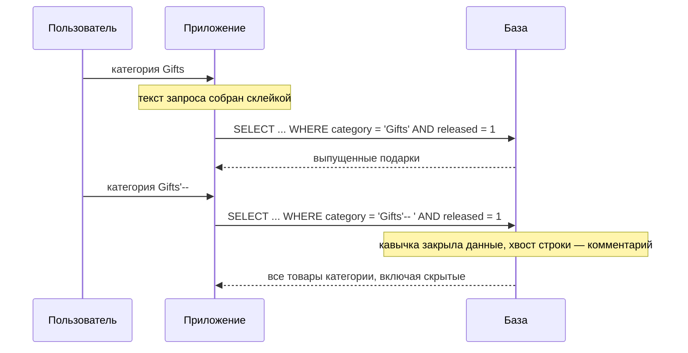
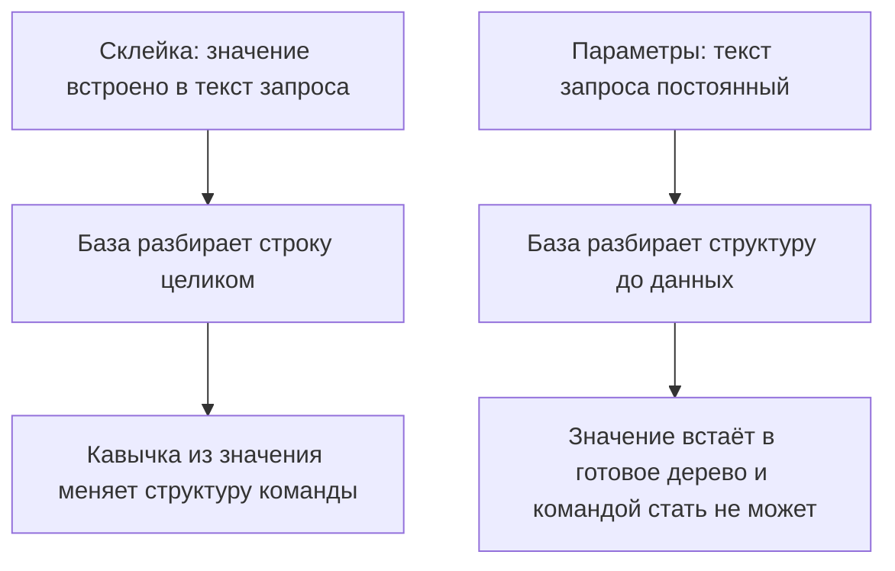

# SQL-инъекции: классические и UNION-based

Витрина интернет-магазина ищет товары по категории: покупатель выбирает
категорию, приложение подставляет её в запрос к базе. База отвечает за
хранение таблиц и честную выдачу по ним, а код на Python берёт присланное
значение и склеивает его с текстом команды:

```python
query = ("SELECT name, price FROM products "
         "WHERE category = '" + category + "' AND released = 1")
```

Плюс и кавычки — знакомая картина: такое писали и вы, потому что склейка —
самый короткий способ подставить значение в команду. Пока в `category`
приходит `Gifts`, витрина честно показывает выпущенные подарки. Теперь
покупатель прислал `Gifts'--`, и база получила уже другой текст команды:

```sql
SELECT name, price FROM products
WHERE category = 'Gifts'-- ' AND released = 1
```

Кавычка закрыла строку `Gifts`, а два минуса открыли комментарий: дальше
база не читает ничего, включая условие `AND released = 1`. В выдачу попали
товары, снятые с витрины. Одна кавычка убрала условие, потому что
пользователь поменял не данные, а саму команду.

Это и есть SQL-инъекция: присланная строка стала частью текста запроса SQL
и поменяла его смысл. Для базы код и данные выглядят одной строкой, и
границу между ними знает только автор кода. Та же дверь открывает больше,
чем снятый фильтр: через неё заходят администратором без пароля и читают
чужую таблицу целиком, вместе с паролями.

Чинится дефект одним ходом: текст запроса остаётся постоянной строкой, а
данные едут в базу отдельными параметрами. Слепой случай инъекции, когда
выдача не показывает результат запроса напрямую, и обход фильтров разбирают
темы `sqli-blind` и `filter-and-waf-bypass`. Здесь — механизм в чистом виде
и лаба: витрина на SQLite, где два запроса собраны такой же склейкой, и
починить их предстоит руками.

**Зачем это в работе AppSec-инженера.** SQL-инъекция — самый проверяемый
класс дефектов: в ревью она ищется одним вопросом к каждому запросу, собран
ли его текст из присланных данных. Вопрос этот задаётся поиску по каталогу,
форме входа, фильтру отчётов, сортировке и любому месту, где значение из
запроса попадает в строку запроса SQL. Ответ виден прямо в коде, без
стенда.

## Подумай, прежде чем читать

1. Форма входа проверяет имя и пароль одним запросом к таблице пользователей.
   Что произойдёт, если в поле имени прислать кавычку?
2. Поиск по каталогу возвращает только выпущенные товары. Откуда база знает,
   что товар выпущен, и можно ли это условие снять снаружи?
3. Запрос возвращает две колонки. Почему это важно тому, кто хочет прочитать
   через него чужую таблицу?

Ответы приходят по ходу чтения, а в конце темы те же вопросы встретятся
снова — уже как проверка.

## Как это работает

**Откуда это взялось.** База данных — программа, которая хранит таблицы и
исполняет команды на языке SQL. Команда — обычный текст: строка
`SELECT name, price FROM products` читается как «верни названия и цены из
таблицы товаров». Пока запросы писали руками в консоли базы, один язык
покрывал и выборку, и изменение схемы. Затем запросы стали собираться в
приложении, и в них потребовалось подставлять данные пользователя: имя для
входа, категорию для поиска.

Короткий способ подстановки — склеить строку, и с этого момента данные и
код поехали в базу одной строкой. Граница между ними осталась только в
голове автора: база получает готовый текст и не знает, какие символы написал
программист, а какие прислал покупатель. Позже драйверы баз получили
отдельный механизм подстановки — связанные параметры, — но склейка никуда
не делась, потому что работает и выглядит короче.

Инъекцию в целом OWASP, открытый проект по безопасности приложений,
описывает так: недоверенные данные попадают в интерпретатор, и тот
исполняет их часть как команды. Интерпретатор — программа, которая читает
текст и выполняет записанное в нём: база читает SQL, оболочка читает
командную строку. В этой теме интерпретатор — база, команды — SQL, а
недоверенные данные — всё, что клиент прислал в HTTP-запросе (тема
`http-basics`).

### Команда и данные

Чтобы увидеть механизм, нужны два понятия из синтаксиса SQL. Первое —
строковый литерал: значение в одинарных кавычках, например `'Gifts'`, и всё
между кавычками база считает данными, а не командой. Второе — комментарий:
два минуса `--` велят базе пропустить остаток строки. В MySQL ту же роль
играет `#`, а `--` считается комментарием только с пробелом после него.
Оба понятия работают в тексте команды, и данные им не подчиняются — пока
данные не оказались внутри текста.

Теперь вернёмся к запросу из начала темы. Место подстановки в нём стоит
между кавычек:

```sql
SELECT name, price FROM products
WHERE category = '<CATEGORY>' AND released = 1
```

Слово `<CATEGORY>` — то место, куда попадает присланное. При честном
значении `Gifts` запрос ищет выпущенные подарки. При значении `Gifts'--`
присланная кавычка закрывает литерал раньше времени, и текст дальше
перестаёт быть данными: минусы открывают комментарий, и условие
`released = 1` исчезает из команды. Присланное изменило не результат
запроса, а сам запрос.

### Разбор по общей рамке

Уязвимости в гайдбуке раскладываются по одной рамке из пяти подцелей — она
введена в теме `privilege-escalation-vertical`. SQL-инъекция заполняет её
без остатка. **Источник** — значение из HTTP-запроса: параметр строки
запроса, поле формы, поле JSON, значение заголовка. **Путь** — код, который
вставляет это значение в текст запроса SQL. **Сток** — вызов, отправляющий
текст в базу: `cursor.execute` в Python, `Statement.executeQuery` в Java,
`db.query` в Node.js.

**Отсутствующий контроль** — разделение кода и данных: текст запроса обязан
быть постоянным, а данные — приезжать связанными параметрами, отдельно от
текста. **Условие эксплуатации** — возможность прислать строку с символами
синтаксиса: кавычкой, парой минусов, словом `UNION`. Когда контроля нет,
эти символы из данных переезжают в команду.

Честный запрос и атака проходят один и тот же маршрут, и видно это по
строкам, которые получает база:



**Описание схемы.** Схема читается сверху вниз и показывает два прохода
одного маршрута. В первом пользователь присылает честную категорию,
приложение склеивает текст запроса, и база возвращает выпущенные подарки.
Во втором значение содержит кавычку и минусы: для приложения это те же
данные, а для базы — закрытый литерал и комментарий. Границы между кодом и
данными на маршруте нет, потому что приложение отдало их одной строкой.

### Один класс, разные интерпретаторы

SQL-инъекция — частный случай общего дефекта. OWASP держит инъекцию одной
категорией, потому что механизм у всех её форм один: недоверенные данные
попадают в интерпретатор, и тот исполняет их часть как команды. Меняется
только интерпретатор. Поэтому механизм, понятый один раз, узнаётся в любом
интерпретаторе.

- База читает SQL — это SQL-инъекция.
- Оболочка операционной системы читает командную строку — это инъекция
  команд ОС, тема `os-command-injection`.
- Браузер читает HTML и JavaScript — это межсайтовый скриптинг (XSS), тема
  `xss-reflected`.
- Документная база читает оператор запроса — это NoSQL-инъекция, тема
  `nosql-injection`.

Отсюда вывод, который переносится на все формы: чинит инъекцию не чистка
данных, а разделение кода и данных на входе в интерпретатор. У SQL это
связанные параметры, у оболочки — вызов без строки команды, у браузера —
экранирование по контексту вывода. Средства разные, а правило одно:
интерпретатор не должен получать код и данные одной строкой.

**Не путать с утечкой прав.** Инъекция даёт исполнение чужой команды, а не
доступ к своему объекту по чужому идентификатору. Второе — тема `idor`: там
запрос корректен, а неверна проверка прав. При инъекции неверен сам запрос.
Разница видна на вопросе «что сломано»: при инъекции ломается текст
команды, при утечке прав — решение о доступе.

### Три приёма по нарастанию

Классических приёмов с видимой выдачей три, и они идут по нарастанию: от
поломки своего условия к чтению чужих таблиц.

**Срез условия.** Комментарий `--` отсекает хвост запроса, и этим снимается
его вторая половина: проверка выпуска в поиске, проверка пароля во входе.
Имя `administrator'--` в форме входа закрывает литерал имени и срезает
проверку пароля — база возвращает администратора, не спросив пароль.

**Тавтология.** Вместо среза к запросу дописывается условие, истинное
всегда: `' OR '1'='1`. Такое условие называют тавтологией — оно верно при
любом раскладе, как «два равно двум». Запрос `WHERE category = 'no-such'
OR '1'='1'` возвращает все строки таблицы, потому что второе условие
выполнено для каждой. Тем же приёмом снимают фильтры выборки: доступ к
чужим строкам открывается там, где условие ограничивало выдачу владельцем.

**UNION.** Оператор `UNION` складывает выдачи двух запросов `SELECT` в
одну: строки второго дописываются под строками первого. Через него из
запроса о товарах читается таблица пользователей — при двух условиях,
разобранных ниже. Это переход от «сломать своё условие» к «прочитать чужие
данные».

### UNION: два условия

`UNION` объединяет две выборки в одну, и Web Security Academy, учебная
площадка компании PortSwigger, называет два требования к этому.

1. Оба запроса возвращают одинаковое число колонок.
2. Типы колонок попарно совместимы.

Число колонок узнают до чтения, двумя способами. Первый — `ORDER BY` с
растущим номером: `' ORDER BY 1--`, затем `' ORDER BY 2--`. Номер в
`ORDER BY` — позиция колонки в выборке: двойка сортирует выдачу по второй
колонке. Поэтому пробу продолжают, пока база не ответит ошибкой о номере
вне диапазона: последний принятый номер и есть число колонок.
Второй — подстановка `NULL`: `' UNION SELECT NULL--`, затем `NULL,NULL`,
пока ошибка не исчезнет. `NULL` подходит к любому типу, поэтому такая проба
проверяет только число.

Дальше в подходящую по типу колонку ставят нужные данные:

```sql
' UNION SELECT username, password FROM users--
```

Выдача о товарах теперь несёт имена и пароли. На Oracle у каждого `SELECT`
обязан быть источник строк, поэтому в пробу добавляют встроенную таблицу:
`FROM dual`. Это поправка на диалект, и она не единственная: синтаксис
комментария у MySQL свой, он назван в разделе «Команда и данные». Общими
остаются два условия UNION — число колонок и совместимость типов.

### Где в запросе встречается вставка

Место входа не сводится к условию `WHERE`, хотя оно самое частое. Web
Security Academy перечисляет пять мест, и у каждого своя механика. Список
стоит знать, потому что ревьюер, который смотрит только на условие
`WHERE`, пропустит остальные четыре входа из пяти.

- `WHERE` в `SELECT` — выбор строк, разобранный выше.
- Значения в `UPDATE` и условие `WHERE` в нём — правка чужих строк.
- Значения в `INSERT` — вставка своих данных в команду вставки.
- Имя таблицы или колонки в `SELECT` — их нельзя параметризовать, и это
  опасное место по построению.
- Выражение в `ORDER BY` — сортировка, тоже не параметризуемая.

Последние два пункта важны для починки. Заполнитель `?` подставляет
значение, но не имя объекта и не порядок сортировки. Значит, там, где в
запрос попадает имя колонки или направление сортировки, параметр не спасает,
и нужна сверка со списком разрешённого. Тема `parameterized-queries`
разбирает эти случаи отдельно, потому что типовая ошибка — считать, что
параметры закрывают запрос целиком.

### Что ещё достаёт атакующий

Видимая выдача открывает не только чужие таблицы. Через `UNION` читают
устройство самой базы. Список таблиц и колонок лежит в служебной базе
`information_schema`, а версию отдаёт свой запрос у каждого движка — на
Oracle это `SELECT * FROM v$version`. Зная версию и схему, атакующий
переходит от догадок к точным запросам.

Отдельно стоит инъекция второго порядка. Присланное сохраняется без вреда:
имя пользователя с кавычкой легло в таблицу и ничего не сломало. Позже
другой код достаёт это значение и вставляет в запрос склейкой, и тогда
кавычка срабатывает. Опасен не тот запрос, что принял данные, а тот, что
позже собрал из них команду. Поэтому в ревью проверяются оба конца: и
место, где данные входят, и место, где они потом идут в запрос.

## Как это атакуют

Стендом служит лаба этой темы, каталог `pilot/lab/sqli-basics`. Витрина
каталога умеет две вещи: искать товары по категории и пускать в кабинет по
имени и паролю. База — SQLite в памяти процесса, оба запроса собраны
склейкой, сокет и HTTP не поднимаются: функции витрины вызываются напрямую.

Шаг первый — найти место вставки. Признак один: ответ меняется от кавычки.
Пустая одиночная кавычка `'` — первая проба, и она либо даёт ошибку
синтаксиса, либо меняет выдачу. Оба ответа говорят одно: присланное
значение попало в текст команды. В лабе местом вставки служат обе функции
витрины: и поиск, и вход.

Шаг второй — снять условие и прочитать чужое. Эксплойт лабы делает четыре
опыта и два контроля:

```bash
python3 hack.py
```

```text
Цель: code.py
  опыт 1 — вход как administrator'-- : РОЛЬ ADMIN БЕЗ ПАРОЛЯ
  опыт 2 — Gifts'-- показывает невыпущенное: ДА, 3 строк
  опыт 3 — OR '1'='1 отдаёт весь каталог: ДА, 3 строк
  опыт 4 — UNION вытягивает пароль admin: ДА, пароль s3cr3t-9f2a
  опыт 5 — контроль, поиск Gifts: работает
  опыт 6 — контроль, вход wiener: работает

ЭКСПЛОЙТ СРАБОТАЛ: присланная строка исполнилась как код (4 из 4 опытов)
```

Опыт 1 — срез условия во входе: комментарий убрал проверку пароля, и база
вернула первую строку с именем `administrator`. Опыт 2 — срез условия в
поиске: пропало `released = 1`, и снятый с витрины товар попал в выдачу.
Опыт 3 — тавтология: `OR '1'='1` сделало условие категории истинным для
каждой строки. Опыт 4 — UNION: второй `SELECT` прочитал таблицу `users`, и
пароль администратора приехал в списке товаров.

Опыты 5 и 6 — контроль: обычный поиск и честный вход обязаны работать и
после починки. Без них исправление сведётся к запрету кавычек, и это
выяснится только на приёмке, когда сломается фамилия с апострофом.
Контроль в эксплойте стоит рядом с приёмами именно затем, чтобы такая
починка не прошла незамеченной.

Шаг третий — оценить добычу. Вход администратором без пароля — повышение
прав: атакующий получил возможности, которые ему не положены. Выдача
скрытых товаров — утечка данных. Чтение таблицы паролей через UNION —
компрометация всех учётных записей: пароль каждого пользователя перестал
быть секретом, теперь его знает и атакующий. Отсюда пятое место инъекции
в рейтинге OWASP Top 10:2025, перечне важнейших рисков веб-приложений:
одним дефектом берётся вся база.

## Как это выглядит в коде

Ревьюер ищет пару признаков: текст запроса SQL, собранный из строк, и
данные запроса в этой сборке. Один признак без другого дефекта не даёт, и
контрпример стоит в конце раздела. До чтения выносок найдите в функции обе
половины дефекта и решите, какая из них превращает кавычку в команду.

```python
# УЯЗВИМО — демонстрация, не для продакшена
def search_products(category):
    query = (
        "SELECT name, price FROM products "
        "WHERE category = '" + category + "' AND released = 1"  # (1)
    )
    cur.execute(query)                                          # (2)
    return cur.fetchall()
```

1. Значение `category` склеено в текст запроса между кавычек. Кавычка
   внутри значения закроет литерал и начнёт команду.
2. Сток: готовая строка уходит в базу одним аргументом. Разделить код и
   данные здесь уже нельзя — они одна строка.

Разобранная функция — правило темы в миниатюре: база не отличает присланное
от написанного автором, потому что получает их одной строкой. А если то же
значение уйдёт в запрос не в `WHERE`, а в имя колонки сортировки — разбор
останется верным?

Глазами это находится по трём признакам. Первый — оператор `+`, f-строка со
вставкой в фигурных скобках, `%` или `.format()` вокруг текста запроса.
Второй — рядом имя переменной с данными запроса внутри этой сборки. Третий
— вызов `execute` с одним аргументом-строкой, без второго аргумента со
значениями.

**Ложное срабатывание.** Склейка постоянных строк без данных — перенос
длинного запроса на несколько литералов подряд. Пара литералов
`"SELECT ... " "WHERE ... "` читается базой как один, данных в ней нет, и
дефекта тоже. Ревьюер отличает её по содержимому: в сборке нет ни одной
переменной.

## Как защититься

Правило одно: текст запроса — постоянная строка, данные — связанные
параметры. Связанный параметр — значение, которое едет в базу отдельным
аргументом и встаёт на место заполнителя `?` уже после разбора текста. База
разбирает структуру команды до того, как увидит данные, и данные структуру
изменить уже не могут.

Та же функция после починки:

```python
# Исправлено.
def search_products(category):
    cur.execute(
        "SELECT name, price FROM products "
        "WHERE category = ? AND released = 1",   # (1)
        (category,))                             # (2)
    return cur.fetchall()
```

1. В тексте запроса на месте данных стоит заполнитель `?`. Текст постоянный.
2. Значение едет вторым аргументом. Кавычка в нём — часть данных, а не
   команды.

Тот же приём на другом стеке — Java с `PreparedStatement`:

```java
// Исправлено.
PreparedStatement ps = conn.prepareStatement(
    "SELECT name, price FROM products WHERE category = ? AND released = 1");
ps.setString(1, category);   // (1)
ResultSet rs = ps.executeQuery();
```

1. Текст запроса задан один раз с заполнителем, значение связывается
   отдельно. Инвариант тот же, что в Python: постоянный текст плюс связанный
   параметр. Меняется синтаксис, не механизм.

Разница двух сборок — в моменте, когда база впервые видит данные:



**Описание схемы.** Схема читается сверху вниз, в ней две цепочки. Верхняя
— склейка: данные встроены в текст до разбора, и база не может отличить их
от команды. Нижняя — параметры: разбор структуры закончен до прихода
данных, и значению остаётся одно место — внутри готового дерева. Усилие
авторов одинаковое, а результат противоположный.

**Почему параметр надёжен.** База получает текст запроса и данные раздельно.
Сначала она разбирает текст в дерево команды и планирует выполнение — на
этом шаге данных ещё нет. Затем на места заполнителей подставляются значения
уже готового дерева. Значение не может стать новым узлом дерева: структуру
определил постоянный текст. Кавычка, `--` или `UNION` внутри значения
остаются данными, потому что решение о структуре принято до того, как их
прочитали.

**Границы применимости.** Параметризуются данные, но не структура запроса.
Имя таблицы, имя колонки и направление сортировки `ASC`/`DESC` заполнителем
не подставляются — они часть команды, а не значение. Памятка OWASP по
предотвращению SQL-инъекций называет это прямо: там, где параметр
невозможен, нужна проверка по списку разрешённого или переделка запроса.
Отсюда ответ на вопрос из раздела «Как это выглядит в коде»: в имени
колонки сортировки механика дефекта та же, а починка другая. Разбор этих
случаев — тема `parameterized-queries`.

Побочная выгода параметров важнее, чем кажется: запрос на параметрах
правильно обрабатывает данные с кавычкой. Фамилия `O'Brien` ломает склейку
и работает через параметр, потому что кавычка едет как данные. Починка от
инъекции чинит заодно и обычную ошибку с апострофом. Это видно на приёмке:
починку, которая ломает фамилии, откатят.

**Что добавляется поверх.** Параметры закрывают дефект, остальное
ограничивает цену промаха, и памятка называет две дополнительные меры.
Первая — наименьшие права: учётная запись, от которой приложение ходит в
базу, не должна иметь административного доступа, тогда даже сработавшая
инъекция достанет меньше. Вторая — проверка по списку разрешённого как
второй рубеж перед запросом, для случаев, где параметр невозможен.
Отдельно: текст ошибки базы не уходит в ответ пользователю, иначе он
подсказывает атакующему структуру запроса и ускоряет подбор.

## Как убедиться, что защита работает

Ретест — повторная проверка после починки — повторяет четыре приёма и
добавляет то, что обязано продолжать работать:

```bash
LAB_TARGET=solution.py python3 hack.py
```

```text
Цель: solution.py
  опыт 1 — вход как administrator'-- : отвергнут
  опыт 2 — Gifts'-- показывает невыпущенное: нет
  опыт 3 — OR '1'='1 отдаёт весь каталог: нет
  опыт 4 — UNION вытягивает пароль admin: нет
  опыт 5 — контроль, поиск Gifts: работает
  опыт 6 — контроль, вход wiener: работает

эксплойт не сработал: все четыре приёма отвергнуты, поиск и вход работают
```

Четыре отказа и два рабочих контроля — это и есть картина починки. Отказ на
пятом или шестом опыте означал бы, что витрина сломалась: кавычки запрещены,
а с ними и фамилии с апострофом. Приёмку такая починка не проходит. Поэтому
контроли стоят в эксплойте рядом с приёмами, а не отдельным документом.

Регресс закрывается тестами функциональности. В лабе их семь, и проверяют
они сохранность работы: обе категории, неизвестную категорию, оба входа и
неверный пароль. Отдельно стоит проверить два негативных случая. Первый:
неизвестная категория и снятое условие дают разную выдачу, иначе тавтология
останется незамеченной. Второй: честное значение с кавычкой, та же
`O'Brien`, проходит, а не роняет запрос.

Тест на регресс, который ловит возврат склейки, писать вручную не нужно:
эту роль играет правило статического анализа из раздела «Как это находят
инструменты». Оно срабатывает на каждом коммите и находит сборку запроса из
строк раньше ревью. Такой сторож дешевле ручной сверки и не устаёт.

**Чеклист для ревью.** Всё сказанное выше собирается в семь проверок,
каждая смотрит на своё место дефекта:

1. Проверьте, что запрос SQL записан постоянной строкой, а значения идут
   связанными параметрами (ASVS v5.0-1.2.4).
2. Проверьте, что вокруг текста запроса нет склейки, f-строки, `%` или
   `.format()` с данными из запроса.
3. Проверьте, что имена таблиц и колонок и направление сортировки не берутся
   из присланных данных, а сверяются со списком разрешённого.
4. Проверьте, что запрос через ORM (Object-Relational Mapping,
   объектно-реляционное отображение) не содержит «сырого» фрагмента,
   собранного из данных.
5. Проверьте, что данные проверяются на сервере, а не только в браузере
   (WSTG-v42-INPV-05).
6. Проверьте, что учётная запись базы, от которой идёт запрос, имеет только
   нужные права, а не административные.
7. Проверьте, что сообщение об ошибке базы не уходит в ответ пользователю.

## Как это находят инструменты

Статический анализ — разбор кода без запуска: инструмент читает текст
программы и ищет в нём дефекты по правилам. У SQL-инъекции есть источник,
сток и очищающий приём — параметризация. Поэтому она ложится на анализ
помеченных данных: инструмент помечает значения из запроса и следит,
доходит ли помеченное до стока. Правило отвечает на один вопрос: доходит
ли до `execute` строка, собранная склейкой, f-строкой, `%` или `.format()`.

Правило написано для Semgrep, свободного анализатора, который ищет
фрагменты кода по шаблону, и целиком лежит в
`pilot/semgrep/sql-query-string-built.yaml`. Оно сверено прогоном: две
находки на уязвимом файле лабы, ноль на решении, восемь размеченных
тест-кейсов сошлись без расхождений. Каждый кейс — маленький файл с
пометкой, где правило обязано сработать, а где промолчать.

**Что правило пропустит.** Запрос, собранный форматированием в логгере и
попавший в базу иным путём. Текст запроса, пришедший из другой функции или
из константы модуля, если склейка была вне анализируемого тела. Запрос через
ORM, где инъекция прячется в «сыром» фрагменте, — это отдельный разбор в
теме `parameterized-queries`.

**Какой шум даст.** Всякую склейку строк, уходящую в функцию с именем
`execute`, даже когда это не база: правило видит форму вызова, а не смысл.
В корпусе с собственной обёрткой над базой список стоков дополняется её
именем — это правка одной строки.

Граница статического анализа здесь заслуживает отдельной оговорки.
Инструмент не скажет, опасны ли данные на самом деле: пришли они от
пользователя или из доверенной константы. Он отвечает на форму, а не на
происхождение, и поэтому даёт и пропуски, и шум. Надёжнее сама конструкция:
в запросе на параметрах находить нечего.

## Частая ошибка

Свой ответ назовите до чтения дальше. Запрос собран склейкой, а
переписывать его некогда — достаточно ли удвоить каждую кавычку во вводе?
Отсюда расхожее представление: инъекция закрывается экранированием, то есть
заменой каждой `'` на `''`, и склейку можно оставить. Представление
правдоподобно: для строкового значения удвоение действительно срабатывает,
и это видно на первом же опыте.

**Экранирование чинит один символ, а инъекция живёт не только в нём.**
Памятка OWASP называет экранирование ненадёжной крайней мерой: оно зависит
от движка базы и ломается на мелочах. Числовой параметр без кавычек
экранировать нечего — `OR 1=1` вставляется прямо. Многобайтные кодировки
дают последовательности, где экранирующий обратный слэш склеивается с
соседним байтом, и кавычка проходит целой.

Контрпример. Фильтр удаляет одиночные кавычки из всех полей. Поиск по
числовому идентификатору `id=1 OR 1=1` кавычек не содержит вовсе и проходит
фильтр целиком: условие становится истинным для всех строк. Экранирование
кавычек не сработало, потому что кавычек здесь и не было. Полный разбор
таких обходов — тема `filter-and-waf-bypass`, и она показывает, что чёрный
список проигрывает всегда.

## Попробуй сам

`lab-sqli-basics`, каталог `pilot/lab/sqli-basics`. Формат «почини»:
правится `code.py`, пока `hack.py` и `tests.py` не станут зелёными
одновременно.

**Цель одной фразой:** добиться, чтобы `hack.py` вышел с кодом 0, а
`tests.py` продолжил выходить с кодом 0.

Всё локально, только модулем `sqlite3` из стандартной библиотеки, без сети
и без Docker. База живёт в памяти процесса.

Одна подсказка: дефект не в кавычке и не в слове `UNION`, а в том, что
текст запроса и данные едут в базу одной строкой. Разделите их.

**Отдельная задача «почини».** Оба запроса, поиск и вход, собраны склейкой.
Переведите на связанные параметры каждый: если починить только вход, приём
с UNION в поиске, опыт 4, останется зелёным у атакующего.

Решение лежит в `solution.py` и открывается после того, как своя попытка
сделана.

## Проверь себя

1. Форма входа лабы проверяет имя и пароль одним запросом к таблице
   пользователей:

   ```python
   query = (
       "SELECT username, role FROM users "
       "WHERE username = '" + username + "' "
       "AND password = '" + password + "'"
   )
   ```

   В поле имени прислали `administrator'--`. Что вернёт база?
2. Откуда база знает, что товар выпущен, и можно ли снять это условие
   снаружи? Витрина добавила фильтр по цене, собранный той же склейкой:

   ```python
   def cheap(max_price):
       query = ("SELECT name, price FROM products "
                "WHERE price < " + max_price + " AND released = 1")
       cur.execute(query)
   ```

   В параметре прислали `1 OR 1=1--`. Что вернёт база?
3. Функция `search_products` из раздела «Как это выглядит в коде» собирает
   запрос склейкой. Какую починку вы выберете?

   A. Удвоить каждую кавычку в значении перед склейкой, запрос не трогать.

   B. Записать текст запроса постоянной строкой с заполнителем, а значение
      передать вторым аргументом.

   C. Вырезать из значения слова `OR` и `UNION` и последовательность `--`.
4. Запрос возвращает две колонки. Почему это важно тому, кто хочет
   прочитать через него чужую таблицу? Атакующий подбирает число колонок и
   прислал `' UNION SELECT 'x'--`:

   ```python
   import sqlite3
   con = sqlite3.connect(':memory:')
   con.execute('CREATE TABLE t(a, b)')
   con.execute("SELECT a, b FROM t UNION SELECT 'x'").fetchall()
   ```

   Что ответит база и что он узнал?
5. Возврат к теме `http-basics`: из каких частей HTTP-запроса приложению
   приезжают значения, которые потом могут попасть в текст запроса SQL?
6. Возврат к теме `app-architecture`: на каком узле цепочки исполняется
   команда SQL и почему текст её ошибки нельзя показывать пользователю?

<details markdown="1">
<summary>Ответ 1</summary>

1. Первую строку с именем `administrator` — роль admin без пароля, как в
   опыте 1 лабы. База получила
   `WHERE username = 'administrator'-- ' AND password = '...'`: присланная
   кавычка закрыла литерал имени, а `--` открыл комментарий, и проверка
   пароля срезана.

</details>

<details markdown="1">
<summary>Ответ 2</summary>

2. Всю таблицу, включая снятые с витрины. Про выпуск база знает из условия
   `released = 1` в тексте запроса, а текст собран из присланного, поэтому
   условие снимается снаружи. Запрос стал
   `WHERE price < 1 OR 1=1--  AND released = 1`: условие `1=1` истинно для
   каждой строки, а `--` открыл комментарий, и проверка выпуска пропущена.
   Кавычек в нагрузке нет, поэтому экранирование кавычек её не заметило бы.

</details>

<details markdown="1">
<summary>Ответ 3: разбор вариантов</summary>

3. Верный ответ — B.

   A. Неверно. Экранирование правит один знак, а инъекция живёт не только в
      нём: числовой параметр обходится без кавычек вовсе. Многобайтная
      кодировка склеивает экранирующий слэш с соседним байтом. Памятка
      OWASP называет эту меру ненадёжной и крайней.

   B. Верно. База разбирает постоянный текст в дерево команды до того, как
      увидит данные, и значение уже не может стать новым узлом дерева.
      Кавычка внутри значения остаётся данными.

   C. Неверно. Список слов ломает законные данные — фамилию `O'Brien` и
      город Ору — и не видит приёмов без этих слов: срез условия через `#`
      в MySQL проходит целиком. Запрещённое не перечислить, перечисляется
      разрешённое.

</details>

<details markdown="1">
<summary>Ответ 4</summary>

4. UNION требует одинакового числа колонок у обеих выборок, и число
   исходного запроса атакующему надо узнать заранее — в этом важность двух
   колонок. База отвечает ошибкой `SELECTs to the left and right of UNION
   do not have the same number of result columns`. Из неё атакующий узнал,
   что число колонок не совпало: у исходного запроса их две, у его
   подстановки одна, — и перебор продолжается. Прогон:
   `python3 -c "import sqlite3; con=sqlite3.connect(':memory:'); con.execute('CREATE TABLE t(a,b)'); con.execute(\"SELECT a,b FROM t UNION SELECT 'x'\").fetchall()"`
   — падает с этим текстом `sqlite3.OperationalError`.

</details>

<details markdown="1">
<summary>Ответ 5</summary>

5. Из цели запроса с её параметрами, из полей-заголовков и из тела — поля
   формы или JSON. Всё это выбирает клиент, поэтому источник инъекции
   недоверен по построению.

</details>

<details markdown="1">
<summary>Ответ 6</summary>

6. Команда исполняется на узле базы данных — за приложением, внутри
   периметра. Пользователь видит только ответ приложения, и текст ошибки
   базы в этом ответе раскрывает структуру запроса и ускоряет подбор: его
   подсказки атакующий получает бесплатно.

</details>

## Источники

1. PortSwigger Web Security Academy, «SQL injection»; реестр `ps-sqli`.
   Разделы: Retrieving hidden data, Subverting application logic, SQL injection
   UNION attacks, Determining the number of columns, Finding columns with a
   useful data type.
   <https://portswigger.net/web-security/sql-injection>
2. OWASP SQL Injection Prevention Cheat Sheet; реестр `owasp-cs-sqli-prevention`.
   Разделы: Primary Defenses — Prepared Statements, Option 3 Allow-list Input
   Validation, Option 4 Escaping (Strongly Discouraged), Additional Defenses —
   Least Privilege.
   <https://cheatsheetseries.owasp.org/cheatsheets/SQL_Injection_Prevention_Cheat_Sheet.html>
3. OWASP Top 10:2025, «A05:2025 Injection»; реестр `owasp-top10-2025-a05`.
   Разделы: Overview, Description, How to Prevent, Example Attack Scenarios.
   <https://owasp.org/Top10/2025/A05_2025-Injection/>

Каркас этапа: `owasp-asvs-5-document` (ASVS v5.0.0), `owasp-wstg-42`,
`owasp-top10-2025`. Наследуются всеми темами и отдельной строкой не
повторяются. Первая и вторая сноски — якоря подраздела 1.3.

**Скоропортящийся слой.** Список стоков по стекам пополняется вместе с
библиотеками. Страницы Web Security Academy и памятка — живые площадки без
даты публикации. Версии Python и Semgrep, на которых снимались прогоны,
названы в маркерах уверенности.

**Маркеры уверенности.** Прогоны лабы и правила статического анализа —
**проверено лично** 2026-10-03 на Python 3.14.7 и Semgrep 1.174.0: четыре
приёма дают выдачу на `code.py` и отказ на `solution.py`, семь тестов
функциональности проходят в обоих случаях, правило даёт две находки на
уязвимом файле и ноль на решении. Приёмы среза, тавтологии и UNION, два
условия UNION и способы узнать число колонок — **по документации** (Web
Security Academy, открыта лично 2026-08-24). Три меры защиты и ненадёжность
экранирования — **по документации** (SQL Injection Prevention Cheat Sheet,
открыт лично 2026-08-24). Пятое место инъекции и сопоставленные CWE —
**по документации** (A05:2025, открыта лично 2026-08-24). Требование 1.2.4
сверено с текстом ASVS v5.0.0 (открыт лично 2026-08-24). Листинг на Java
**не запускался**: стенда под JVM не собиралось.
