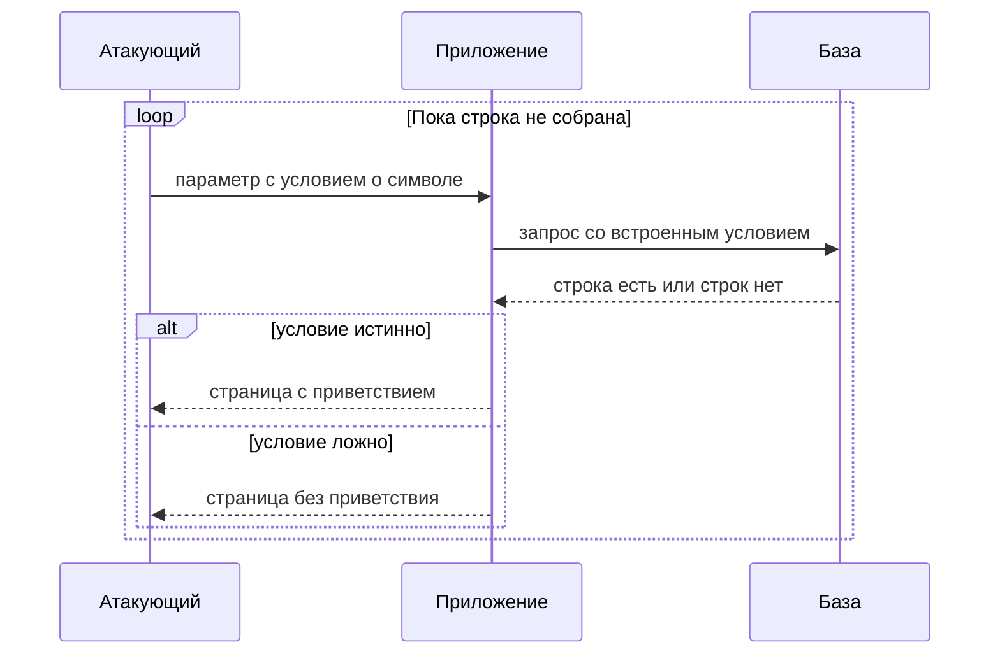

# Слепые SQL-инъекции: boolean и time-based

Приложение отвечает на вход приветствием «Welcome back», если внутренний
запрос к базе вернул строку, и молчит, если не вернул. Выдачи запроса на
странице нет, текста ошибки тоже нет, а в теме `sqli-basics` инъекция
читалась прямо из ответа: сломал условие — увидел чужие строки. Здесь
смотреть не на что, но посмотрите, что происходит, если в параметр
подставить условие о чужом пароле:

```text
xyz' AND SUBSTRING((SELECT Password FROM Users
  WHERE Username = 'Administrator'), 1, 1) > 'm
```

Приветствие появилось — первый символ пароля администратора больше буквы
`m`, не появилось — не больше. Повторяя вопрос с другими порогами,
атакующий находит один символ за несколько запросов, а всю строку — за
серию. Страница так и не показала ни одной записи из базы, а пароль уже
вычитан по буквам — по одному биту на запрос.

Это и есть слепая SQL-инъекция: тот же дефект, что и обычная, — присланная
строка меняет команду, — но ответ не несёт ни выдачи, ни текста ошибки.
Слепой она называется потому, что результат читают не по тексту ответа, а по
наблюдаемому различию: изменился ли ответ (булев канал) или задержался
(временной канал).

## Как это работает

В `sqli-basics` атакующий видел результат глазами: срез условия выводил
скрытые товары в выдачу, а `UNION` подклеивал к ответу чужую таблицу
целиком. В слепом случае выдачи нет вовсе: запрос исполняется, но его
результат разве что решает, какую из двух страниц покажет приложение. Дефект
при этом тот же самый — команда по-прежнему собирается склейкой. Меняется
только канал, по которому читают результат.

**Зачем это в работе AppSec-инженера.** Слепой случай — не экзотика, а
норма: приложение обычно не печатает результат внутреннего запроса в ответ.
Поэтому важно не принять отсутствие выдачи за отсутствие дефекта. Признак
слепого стока в коде такой: результат запроса влияет на поведение, но сам в
ответ не попадает. Строка входа пускает или не пускает, товар показывается
или нет — этого уже достаточно для канала в один бит.

**Откуда это взялось.** Ранние инъекции читали прямо из выдачи: сломал
условие — увидел чужие строки. Затем приложения перестали печатать
результаты внутренних запросов в ответ, а тексты ошибок убрали со страницы,
потому что и то и другое помогало атакующему. Выдача пропала, а дефект
остался: команду как собирали склейкой, так и собирали. Поэтому данные
начали доставать не из ответа, а из его наблюдаемых различий.

Почему хватает одного бита, видно на игре «угадай число». Задумано число от
одного до ста, и на вопросы отвечают только «больше» или «меньше». Первый
вопрос — «больше пятидесяти?» — отсекает половину вариантов, второй вопрос
отсекает половину оставшихся, и семи вопросов хватает на любое число. Каждый
ответ «да» или «нет» — это один бит, а сам приём называется половинным
делением: диапазон каждый раз режется пополам. С символом пароля работает то
же самое: вопрос «символ больше m?» делит алфавит пополам, и символ
находится за несколько запросов вместо полного перебора всех букв.

Где аналогия ломается. В игре ведущий отвечает честно и бесплатно, а
приложение отдаёт бит как побочный эффект, который никто не хотел отдавать.
Здесь каждый вопрос стоит одного сетевого запроса. Поэтому такая вычитка
шумная: пароль из десяти символов — это десятки запросов подряд, и все они
видны в журнале приложения.

### Булев канал

Булев канал — это любой признак, по которому ответ «да» отличить от ответа
«нет». Классический пример — приветствие «Welcome back» из начала темы: оно
появляется, когда запрос вернул строку, и пропадает, когда не вернул.
Каналом служит и другой текст страницы, и другой код ответа, и другая длина
тела — всё, что заметно меняется от условия.

Посмотрим на подстановку из начала темы по частям. Фрагмент `xyz'` закрывает
строковый литерал параметра — это знакомый ход из `sqli-basics`. Дальше
стоит `SUBSTRING`, функция, которая берёт кусок строки:
`SUBSTRING('secret', 1, 1)` возвращает первый символ, `s`. Вложенный `SELECT`
читает пароль администратора из таблицы пользователей. Всё вместе спрашивает
у базы: первый символ этого пароля больше буквы `m`? Ответ базы на страницу
не попадает, но от него зависит, вернётся ли строка, — а от этого зависит
приветствие. Приветствие есть — «да», нет — «нет».



**Описание схемы.** Схема читается сверху вниз и показывает один виток
вычитки. Атакующий подставляет в параметр условие о символе пароля,
приложение включает его в запрос к базе. Ответ базы решает, какую из двух
страниц увидит атакующий: с приветствием или без него. Разница между
страницами — один бит. Виток повторяется со сдвинутым порогом, пока не
найден символ, и со следующим символом, пока не собрана вся строка.

Этот пример показывает главное про слепой случай: канал — не выдача, а любое
наблюдаемое различие, зависящее от условия. Отсюда следующий вопрос, и на
него стоит ответить до чтения дальше: что будет каналом, если приложение
отвечает одинаково на оба исхода?

### Временной канал

Иногда ответ не меняется ни от истины, ни от лжи. Страница одна и та же при
любом условии, либо запрос вообще не влияет на видимую часть. Тогда бит
читают по времени: в условие ставят задержку, которая срабатывает только
при истине.

```text
'; IF (1=1) WAITFOR DELAY '0:0:10'--
```

Разберём подстановку по частям. Точка с запятой завершает первую команду и
открывает вторую. В булевой подстановке условие встраивалось внутрь
существующего запроса, а здесь рядом со штатным запросом выполняется
отдельная команда. Два минуса в конце срезают хвост — знакомый приём из
`sqli-basics`. Вторая команда читается как «если условие истинно, жди десять
секунд». Выполнить её разрешают не все движки и драйверы. Драйвер sqlite3 в
Python отвергает такую подстановку с ошибкой «You can only execute one
statement at a time», а в SQL Server вторая команда исполняется.

В показанной подстановке условие `1=1` истинно всегда, поэтому она
проверяет сам канал: задержка есть — вторая команда выполнилась, и склейка
на месте. В реальной вычитке на месте `1=1` стоит то же сравнение очередного
символа с порогом, что и в булевом случае. Тогда ответ через десять секунд
означает «да», а ответ сразу — «нет». Это как собеседник, который на «нет»
отвечает сразу, а перед «да» молчит десять секунд: пауза сама стала
ответом. Аналогия ломается в одном месте: собеседник молчит нарочно, а
сервер молчит, потому что база честно выполнила команду ожидания.

Имя функции задержки зависит от движка базы: `WAITFOR DELAY` в SQL Server,
`SLEEP()` в MySQL, `pg_sleep()` в PostgreSQL. Подстановка выше написана в
синтаксисе SQL Server. Дальше работает то же половинное деление, только
сигналом служит не текст страницы, а длительность ответа.

Временной канал медленнее булева, потому что каждое «да» стоит секунд
ожидания. Он ещё и шумит: обычная сетевая задержка похожа на сигнал, поэтому
одиночному замеру не верят и время ответа измеряют несколько раз. Берут
временной канал тогда, когда булева признака нет вовсе.

### Условная ошибка

Ещё один способ добыть бит — заставить запрос падать только при истине:

```text
SELECT CASE WHEN (1=1) THEN 1/0 ELSE 'a' END
```

Если деление на ноль роняет запрос, ответы различаются по коду: ошибка
сервера против обычной страницы. Приём привязан к движку. В SQL Server
деление на ноль — ошибка, а в SQLite то же выражение спокойно возвращает
NULL, и никакой разницы в ответе нет. Поэтому приём сначала проверяют на
живой базе, а не по документации чужого движка.

Бывает, что не различить ни текст, ни код, ни время. Тогда работает
out-of-band: база сама отправляет данные наружу, например DNS-запросом на
сервер атакующего, и обратный канал через ответ не нужен вовсе. Это
отдельный приём, и он разобран в следующей теме, `sqli-oob`.

## Как это выглядит в коде

Сток тот же, что в `sqli-basics`: текст запроса собран склейкой. Отличие
слепого случая в другом — результат не возвращается в ответ, а только влияет
на ветку. Разбор ниже идёт тремя планами: найти, как собран запрос; понять,
что уходит наружу; решить, достаточно ли этого атакующему. До выносок
ответьте сами: где здесь дефект и что атакующий получит на выходе?

```python
# УЯЗВИМО — демонстрация, не для продакшена
def is_released(category):
    cur.execute(
        "SELECT 1 FROM products "
        "WHERE category = '" + category + "' AND released = 1")  # (1)
    return cur.fetchone() is not None                            # (2)
```

1. Склейка данных в текст запроса — тот же дефект, что разобран в
   `sqli-basics`: присланное значение становится частью команды.
2. Наружу уходит не строка из базы, а факт «есть или нет». Это и есть булев
   канал: одного бита хватает, чтобы вычитать значение целиком.

Пункт 2 не должен читаться как защита. Вопрос к коду один и тот же: собран
ли текст запроса из данных. Виден результат в ответе или нет — вопрос
эксплуатации, а не наличия дефекта. Найдите в своём коде функцию, которая по
запросу к базе решает «показать или нет»: какое наблюдаемое различие в её
ответе отдаёт наружу один бит?

## Как защититься

Починка совпадает с `sqli-basics`: текст запроса постоянный, а данные едут в
базу связанными параметрами — отдельно от команды.

```python
# Исправлено.
def is_released(category):
    cur.execute(
        "SELECT 1 FROM products WHERE category = ? AND released = 1",
        (category,))
    return cur.fetchone() is not None
```

Одна эта правка закрывает все три канала сразу, и вот почему. Связанный
параметр не даёт данным влиять на структуру запроса: база получает текст
команды и значение раздельно, и кавычка внутри значения остаётся обычным
символом строки. Подставить `AND SUBSTRING(...)`, задержку или условную
ошибку становится некуда, поэтому булев, временной и out-of-band каналы
исчезают вместе с дефектом. Отдельной «защиты от слепого случая» не
существует: это тот же дефект, и лечится он в одном месте.

**Границы применимости.** Как и в `sqli-basics`, параметр подставляет
данные, но не имя таблицы, колонки или направление сортировки: это части
структуры запроса, а не данные. Слепая инъекция в `ORDER BY` встречается и
требует сверки со списком разрешённых значений — параметр там не поможет.

## Как убедиться, что защита работает

Проверка повторяет атаку против исправленного кода, потому что защита,
которой нечего отразить, ничего не доказывает. Зондов два, по числу каналов
из этой темы. Зонд — это пробный запрос, который проверяет, жив ли канал.
Булев зонд — то же условие о символе, с порогом `m` и с порогом `t`. До починки приветствие появлялось и пропадало от порога. После
починки база ищет категорию с именем `xyz' AND ...` целиком, не находит её и
честно отвечает отказом при любом пороге. Признак перестал переключаться —
канала нет. Временной зонд — подстановка задержки: время ответа не должно
зависеть от условия внутри значения.

Тот же приём ложится в регрессионный тест: параметр с кавычкой и условием
обязан дать тот же ответ, что заведомо отсутствующая категория. Если позже
какая-нибудь правка вернёт склейку, тест упадёт раньше, чем дефект доедет
до ревью.

На ревью пройдите по списку.

1. Проверьте, что SQL-текст неизменен, а все данные передаются через
   связанные параметры (ASVS v5.0-1.2.4).
2. Проверьте, что склейка с данными не считается безопасной на том
   основании, что результат запроса не возвращается в ответ.
3. Проверьте, что условие ветвления в коде не строится из непроверенного
   запроса к базе с данными пользователя.
4. Проверьте, что сообщения об ошибке базы и различия в тексте ответа не
   выдают истинность условия наружу как побочный канал.
5. Проверьте, что слепой сток в `ORDER BY` закрыт сверкой со списком
   разрешённого, а не параметром.

## Частая ошибка

Страница не печатает выдачу запроса и прячет тексты ошибок базы. Есть ли
тогда что читать через инъекцию? Решите до чтения дальше.

Ответ, который дают с ходу: если результат запроса не виден в ответе и
ошибки скрыты, инъекция неопасна — читать нечего.

**Невидимость выдачи сужает канал, а не закрывает его.** Рассуждение
ломается на втором шаге: «читать нечего» неверно уже потому, что читают не
выдачу, а различие. Достаточно одного наблюдаемого различия — другой текст,
другой код ответа, другая задержка, — и данные достаются по биту.
Приложение, отвечающее «да» или «нет», уже даёт булев канал; отвечающее
одинаково — временной.

Контрпример. Форма проверки промокода отвечает «код принят» или «код не
найден», и внутренний запрос в ответ не печатает. Условие
`' OR (SELECT SUBSTRING(...)) > 'm'--` меняет ответ между двумя фразами в
зависимости от символа пароля. Ни выдачи, ни ошибки в ответе нет, а пароль
администратора вычитывается по одной букве.

## Попробуй сам

Возьмите функцию с булевым стоком — свою или `is_released` из раздела «Как
это выглядит в коде». Не эксплуатируя её против чужой системы, ответьте
письменно на три вопроса. Какой наблюдаемый признак различает истинное и
ложное условие в ответе приложения? Сколько запросов нужно, чтобы узнать
один символ половинным делением по 95 печатным символам? Что изменится в
этой оценке, если булева признака нет и остаётся только задержка?

**Критерий выполнения** наблюдаемый: три письменных ответа. Для второго
приведён расчёт (семь запросов на символ: 2⁷ = 128 ≥ 95), а для третьего
названа причина замедления и шума временного канала.

## Проверь себя

1. Проверка промокода не печатает ничего из базы:

   ```python
   def promo_ok(code):
       cur.execute("SELECT 1 FROM promos WHERE code = '" + code + "'")
       return "код принят" if cur.fetchone() else "код не найден"
   ```

   Где здесь дефект, и что выигрывает приложение от того, что выдача
   запроса не попадает в ответ?
2. Функция `is_released` из раздела «Как это выглядит в коде» собирает
   запрос склейкой и отвечает веткой «показать или нет». Какая правка
   устраняет дефект?

   A. Убрать со страницы тексты ошибок и сделать ответы неразличимыми,
      чтобы атакующему нечего было читать.

   B. Переписать запрос на связанный параметр: текст постоянный, значение
      отдельно.

   C. Запретить в присланном значении слова `AND`, `SUBSTRING` и `SLEEP`.
3. Почему связанный параметр закрывает булев, временной и out-of-band
   каналы сразу, без отдельной защиты от каждого?
4. Предскажите, что напечатает эта программа, и какой один бит о пароле
   администратора она выдала?

   ```python
   import sqlite3
   con = sqlite3.connect(':memory:')
   con.execute('CREATE TABLE users(name, password)')
   con.execute("INSERT INTO users VALUES ('admin', 's3cr3t')")
   rows = con.execute("SELECT 1 FROM users WHERE name='admin' "
                      "AND substr(password,1,1) > 'm'").fetchall()
   print('welcome' if rows else '-')
   ```

5. Возврат к теме `sqli-basics`: почему отсутствие выдачи в ответе не
   означает отсутствия дефекта?

<details markdown="1">
<summary>Ответ 1</summary>

1. Дефект — склейка `code` в текст запроса: условие, зависящее от чужого
   значения, подставляется через `' OR ...` и меняет ветку ответа. Выигрыша
   от скрытой выдачи нет: две разные фразы ответа — уже булев канал, один
   бит на запрос. Пароль вычитывается по символам, и выдача для этого не
   нужна.

</details>

<details markdown="1">
<summary>Ответ 2: разбор вариантов</summary>

2. Верный ответ — B.

   A. Неверно. Неразличимые ответы убирают булев признак, но оставляют
      временной: задержку, срабатывающую при истине, одинаковым текстом не
      замаскировать. Это ловушка темы — невидимость сужает канал до бита, а
      не закрывает его.

   B. Верно. Параметр не даёт данным влиять на структуру запроса:
      подставить `SUBSTRING`, `SLEEP` или условную ошибку становится некуда,
      и все каналы исчезают вместе с дефектом.

   C. Неверно. Список слов не видит приёмов без этих слов — условную ошибку
      делением, сравнение через `LIKE`, — и ломает законные значения, где
      такие подстроки встречаются в тексте.

</details>

<details markdown="1">
<summary>Ответ 3</summary>

3. Потому что канал — это способ читать результат, а не сам дефект. Дефект
   один: присланное меняет структуру команды. Параметр делает текст запроса
   постоянным, и всем трём каналам нечего читать.

</details>

<details markdown="1">
<summary>Ответ 4</summary>

4. `welcome`: условие истинно, потому что первый символ пароля, `s`, больше
   `m`. Выданный бит — «первый символ выше порога m»; следующий запрос с
   порогом `t` уже вернёт пустоту. Прогон: фрагмент из вопроса, сохранённый
   как `probe.py`, — `python3 probe.py` печатает `welcome`.

</details>

<details markdown="1">
<summary>Ответ 5</summary>

5. Невидимость выдачи сужает канал до одного бита, но бит достаётся по
   наблюдаемому различию: тексту, коду ответа или задержке. Дефект тот же.

</details>

## Источники

1. PortSwigger Web Security Academy, «Blind SQL injection»; реестр `ps-sqli`.
   Разделы: Exploiting blind SQL injection by triggering conditional
   responses, Inducing conditional responses by triggering SQL errors,
   Exploiting blind SQL injection by triggering time delays.
   <https://portswigger.net/web-security/sql-injection>
2. OWASP SQL Injection Prevention Cheat Sheet; реестр
   `owasp-cs-sqli-prevention`. Разделы: Primary Defenses — Prepared
   Statements.
   <https://cheatsheetseries.owasp.org/cheatsheets/SQL_Injection_Prevention_Cheat_Sheet.html>

Каркас этапа: `owasp-asvs-5-document` (ASVS v5.0.0), `owasp-wstg-42`,
`owasp-top10-2025`. Наследуются всеми темами и отдельной строкой не
повторяются.

**Скоропортящийся слой.** Имена функций задержки привязаны к движку базы:
`WAITFOR DELAY` в SQL Server, `SLEEP()` в MySQL, `pg_sleep()` в PostgreSQL.
Их набор меняется вместе с версиями движков. Страница Web Security Academy —
живая площадка без даты публикации.

**Маркеры уверенности.** Булев вывод — **проверено лично** 2026-08-24 на
SQLite 3.53.4: условие `AND 1=1` возвращает строку, `AND 1=2` — нет;
сравнение `substr(p,1,1) > 'm'` отделяет пароль, начинающийся на `s`, от
порога. Условная ошибка делением на ноль на SQLite **не воспроизвелась**:
`1/0` там возвращает NULL, а не ошибку, — приём привязан к движку
(SQL Server), помечен по документации. Приёмы булева, временного и
ошибочного канала и имена функций задержки — **по документации** (Web
Security Academy, открыта лично 2026-08-24). Временной канал на SQLite **не
воспроизводился**: функции задержки в нём нет. Фрагмент из вопроса 4 и
проверка `1/0` прогнаны повторно 2026-10-03 (Python 3.14.7, SQLite 3.53.4):
вывод совпал дословно. Драйвер sqlite3 вторую команду через точку с запятой
отвергает: «You can only execute one statement at a time» — **проверено
прогоном** 2026-10-03.
