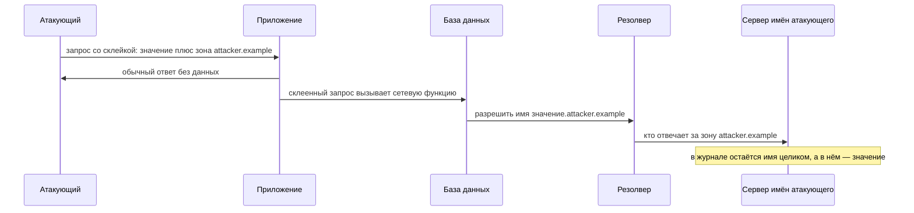

# Out-of-band SQL-инъекции

У приложения есть форма «сообщить о проблеме»: посетитель пишет текст,
а сайт отвечает одной и той же строкой «спасибо, мы разберёмся». Ответ
не меняется ни по содержимому, ни по коду, ни по времени, что бы ни
подставить в поле. Ни условие про чужой пароль, ни команда задержки из
темы `sqli-blind` не оставляют в ответе следа. Причина честная: текст
формы приложение ставит в очередь — список заданий на потом — и разбирает
его фоновое задание, когда страница давно отдана. Атакующий тем не менее
подставляет в поле склейку с командой к базе. Через минуту в журнале его
собственного сервера имён появляется запись:

```text
<значение-пароля>.attacker.example  →  запрос DNS
```

Это внеполосная SQL-инъекция (out-of-band, «вне полосы» обмена запросом
и ответом): данные уносит не ответ приложения, а сама база, открывая
сетевое соединение наружу. Искомое значение вписано в имя хоста, и
атакующий читает его в журнале сервера, которым управляет.

## DNS — справочная, которая ведёт журнал

Чтобы понять, как пароль оказался в чужом журнале, нужна одна деталь
устройства сети. Машины находят друг друга по числовым адресам, а имена
вроде `shop.example` придуманы для людей. Переводом имени в адрес
занимается DNS (Domain Name System, система доменных имён) — всемирная
справочная служба. Программа спрашивает у неё «какой адрес у такого-то
имени», получает число и только потом открывает соединение. Такой вопрос
называется разрешением имени, а спрашивающая часть системы — резолвером.
Не путать с резолвером GraphQL из темы `rest-and-graphql`: тот исполняет
поле схемы, а этот спрашивает адрес по имени.

Бытовой пример такой справочной — телефонная служба города: вы звоните
туда и называете фамилию, а вам отвечают номером. Соответствие с сетью
такое:

| В телефонной справочной | В DNS |
|---|---|
| фамилия, которую вы называете | доменное имя |
| номер, которым вам отвечают | числовой адрес машины |
| журнал вызовов справочной | журнал сервера имён |

Третья строка таблицы — сердце всей темы. Справочная знает, кого вы
искали: сам вопрос уже выдаёт интерес. Так и в DNS: чтобы получить адрес,
машина обязана назвать имя вслух, и это имя видно тому, кто за него
отвечает. Участок пространства имён, за который отвечает конкретный
сервер, называется зоной, а имя внутри зоны — поддоменом. В имени
`<значение>.attacker.example` зоной владеет сервер атакующего, и вопрос
про это имя рано или поздно до него доходит.

Где аналогия ломается. Городская справочная одна и отвечает сразу.
Система доменных имён устроена цепочкой: резолвер переспрашивает
вышестоящие сервера, и вопрос проходит через несколько чужих рук.
Атакующему это на руку: принимать соединение от базы ему не нужно.
Достаточно владеть сервером имён своей зоны — вопрос придёт к нему сам.

## Как это работает

**Откуда это взялось.** Булев и временной каналы из темы `sqli-blind`
требуют, чтобы результат запроса хоть как-то влиял на ответ: поменялось
содержимое или выросло время. Когда запрос ни на что видимое не влияет —
например, исполняется в фоне, — оба канала пропадают, ведь оба читают
различия ответа. Осталась одна лазейка: многие СУБД, то есть системы
управления базами данных, умеют сами ходить в сеть. Честной работе это нужно, чтобы загрузить файл по адресу или
запросить веб-сервис. Эту штатную способность и приспособили под вынос
данных, когда обратного пути через ответ нет.

Ходит в сеть не хранилище само по себе, а его служебные функции, и набор
их зависит от СУБД. В SQL Server есть расширенная процедура `xp_dirtree`
— служебная операция, встроенная в саму базу. Она перечисляет содержимое
каталога, а адресом ей можно дать сетевой путь. Так в Windows записывают папку на другой машине: две косые черты,
имя машины, каталог. Чтобы прочитать чужой каталог, системе сперва нужен
адрес этой машины, и она просит резолвер разрешить имя.

В Oracle ходить в сеть умеют пакет `UTL_HTTP`, делающий запросы HTTP, и
службы XML. В MySQL под Windows к разрешению имени приводит и чтение
файла сетевым путём функцией `LOAD_FILE`. Имена разные, итог один: вызов
функции базы становится поводом спросить у системы DNS чужое имя.

Атакующему остаётся подклеить к уязвимому запросу вызов такой функции с
именем, собранным из двух частей: искомого значения и своей зоны.

```text
// концепт, не рабочий эксплойт
<искомое-значение>.attacker.example  →  запрос DNS  →  журнал атакующего
```

База выполняет функцию, система разрешает имя, и вопрос про зону
`attacker.example` приходит на сервер имён атакующего. Тот видит вопрос
целиком, включая первую часть имени, — а в ней лежит значение пароля.
Ответ приложения в этом канале не нужен: атакующий читает не его, а свой
журнал.



**Описание схемы.** Схема читается сверху вниз. Атакующий отправляет
приложению запрос со склейкой и получает обычный ответ без данных: по
нему узнать ничего нельзя. Дальше работает вторая половина цепочки.
Приложение отдаёт базе склеенный запрос, база вызывает сетевую функцию,
и собранное имя уходит резолверу. Резолвер переспрашивает сервер имён
атакующего, и в журнале того остаётся имя целиком, вместе со значением.

Почему целью берут DNS, а не прямой запрос HTTP. Разрешение имени идёт
через цепочку резолверов и почти никогда не блокируется на уровне сети,
тогда как исходящее соединение HTTP из базы часто закрыто межсетевым
экраном. Вторая причина — порядок работ. Адрес нужен уже для открытия
соединения, поэтому разрешение имени идёт раньше любой проверки
исходящего трафика: даже если само соединение потом отрежут, имя уже
ушло. Запрос DNS проходит там, где сам HTTP был бы отрезан, и оставляет
след в журнале, которым атакующий управляет.

Плата за такую проходимость — узость канала. У доменного имени есть
пределы: не больше 253 символов на имя целиком и 63 на одну часть между
точками. Гарантированно переживают дорогу только буквы, цифры и дефис.
Длинное значение в одно имя не помещается, и данные уносят по частям:
каждый кусок становится поддоменом своего запроса. Против булева канала
это щедро — уходит не бит за запрос, а строка, — но и заметно: серия
похожих имён торчит в журнале резолвера.

Отдельная ценность канала — асинхронный случай, с которого началась тема.
Запрос, поставленный в очередь или исполняемый фоном, на ответ не влияет
вовсе, поэтому булев и временной каналы здесь мертвы. Внеполосный
работает и тут, потому что сетевое обращение база делает сама,
независимо от того, увидит ли пользователь результат.

Приём «подкинуть серверу адрес, обращение к которому видно на стороне»
называется внеполосным тестированием (out-of-band application security
testing, OAST). Своего сервера для него не обязательно: приёмник таких
обращений встроен, например, в Burp Suite под именем Collaborator.
Соседние внеполосные каналы разбирают темы `blind-ssrf`, где сервер ходит
по чужому адресу без всякого SQL, и `xxe`, где тот же приём проворачивает
парсер XML. Место этого случая в картине одно: последняя ступень слепой
инъекции, когда в ответе не осталось ни одного наблюдаемого различия.

Скажите, не возвращаясь к тексту: что из цепочки «склейка, вызов функции,
запрос DNS, журнал» исчезает, если запрос к базе собран на связанных
параметрах?

## Как закрыть канал

Ответ на вопрос выше — и есть главная починка: исчезает первый шаг
цепочки. Канал — только способ чтения результата, а дефект тот же, что у
любой инъекции из темы `sqli-basics`: присланная строка слилась с
командой. При параметризации значение из формы едет в базу отдельно от
текста команды. Стать частью команды и превратиться в вызов `xp_dirtree`
оно не может; устройство таких связанных параметров разбирает тема
`parameterized-queries` дальше по маршруту. Нет вызова — нет
обращения к имени, и в журнал атакующего попадать нечему. Свод требований
к проверке приложений ASVS требует того же: динамические запросы строятся
параметризацией (требование v5.0-1.2.4).

Почему после главной починки нужны ещё два рубежа. Параметризация лечит
причину, но только в том запросе, который вы сегодня нашли: завтрашняя
склейка в новом коде откроет канал снова. Права и сеть причину не лечат,
зато срезают урон, когда она проскочила. Поэтому находку закрывают
починкой кода, а рубежи проверяют отдельно.

Из устройства канала следует и то, чем он не закрывается. Скрыть ответ
приложения — значит заклеить окошко, в которое никто и не смотрел: данные
идут мимо ответа, через журнал чужого сервера. Поэтому «ответ не
меняется» — не доказательство безопасности, а повод проверить, нет ли у
базы собственного выхода в сеть.

Второй рубеж — права учётной записи, под которой приложение ходит в базу.
Сетевые функции и расширенные процедуры, как правило, требуют повышенных
прав. Прикладной учётной записи они не нужны: она читает и пишет строки
таблиц, и этого достаточно. Права на такие вызовы у неё отзывают, и даже
прошедшая склейка упирается в отказ самой базы. Частая находка на ревью —
прикладная учётная запись с правами администратора базы: их выдали при
установке и забыли отозвать. Набор ролей и доступных
процедур у каждой СУБД свой, поэтому выдачу прав проверяют по настройкам
конкретного сервера.

Третий рубеж — сеть вокруг сервера базы. Базе, как правило, незачем
открывать соединения наружу, и на межсетевом экране ей закрывают
исходящий трафик: и запросы HTTP, и доступ к чужим сетевым папкам.
Запросы DNS с машины базы пускают только через внутренний резолвер
компании, а его журнал просматривают: серия имён со значениями внутри —
готовый сигнал тревоги. Рубеж именно третий, а не основной: он душит
канал, но не лечит инъекцию, и полагаться только на него — значит
оставить сам дефект жить.

Тонкость рубежа — в направлении заткнутой дыры. Перекрывать нужно выход
самого запроса, а не ответа на него: значение уезжает в вопросе, и ответ
атакующему не нужен. Поэтому фильтрация ответов DNS здесь бессильна, а
работают запрет прямых запросов наружу и принудительный внутренний
резолвер.

Как убедиться, что канал закрыт. На ревью ищите не имена сетевых функций
— они меняются от СУБД к СУБД. Ищите ту же склейку строки рядом с вызовом
запроса: признак тот же, что у обычной инъекции. Ручная проверка самим
приёмом требует собственного сервера имён или внеполосного приёмника,
поэтому при ревью кода её заменяют вопросами к конфигурации:

1. Собирается ли хоть один запрос к базе склейкой строки, или все запросы
   параметризованы?
2. Есть ли у учётной записи приложения права на сетевые функции и
   расширенные процедуры, и если есть, то зачем?
3. Какие исходящие соединения разрешены серверу базы и чей резолвер
   обслуживает его запросы DNS?
4. Назначен ли владелец журнала этого резолвера: кто смотрит его и по
   каким именам поднимает тревогу?

Канал считается закрытым, если на первый вопрос есть ответ «все
параметризованы». На остальные вопросы нужны ответы с местом в
конфигурации или с именем владельца, а не «кажется, закрыто».

У проверки защиты есть и опытная половина, где стенд позволяет. После
починки тот же ввод со склейкой отправляют снова. Смотрят при этом не на
ответ приложения, а в журнал внутреннего резолвера: обращения к чужой
зоне быть не должно. Вторая отправка — контрольная, с обычным текстом:
он обязан по-прежнему доходить до базы. Без контрольной отправки за
починку принимают и сломанную целиком функцию. Результат опыта записывают
двумя строками: что отправлено и что появилось или не появилось в
журнале.

**Зачем это в работе AppSec-инженера.** Внеполосный канал — тот случай,
из-за которого «ответ не меняется» нельзя считать доказательством
безопасности. Ревьюеру достаточно знать, что канал существует, и что
чинится он тем же, чем обычная инъекция, — параметризацией запроса.

## Источники

1. PortSwigger Web Security Academy, «Blind SQL injection»; реестр `ps-sqli`.
   Раздел: Exploiting blind SQL injection using out-of-band (OAST) techniques.
   <https://portswigger.net/web-security/sql-injection>
2. OWASP SQL Injection Prevention Cheat Sheet; реестр `owasp-cs-sqli-prevention`.
   Раздел: Primary Defenses — Prepared Statements.
   <https://cheatsheetseries.owasp.org/cheatsheets/SQL_Injection_Prevention_Cheat_Sheet.html>

Каркас этапа: `owasp-asvs-5-document` (ASVS v5.0.0), `owasp-wstg-42`,
`owasp-top10-2025`. Наследуются всеми темами и отдельной строкой не
повторяются.

**Скоропортящийся слой.** Имена сетевых функций привязаны к СУБД и версии:
`xp_dirtree` в SQL Server, `UTL_HTTP` в Oracle, `LOAD_FILE` в MySQL. Их
доступность зависит от прав и настроек сервера.

**Маркеры уверенности.** Приём внеполосного канала, выбор DNS как цели и
имена сетевых функций СУБД — **по документации** (Web Security Academy,
открыта лично 2026-08-24). Пределы длины доменного имени — по стандарту
DNS (RFC 1035). Лично **не воспроизводился**: нужен свой сервер имён и
стенд с уязвимой СУБД, границы миссии их не предполагают.
