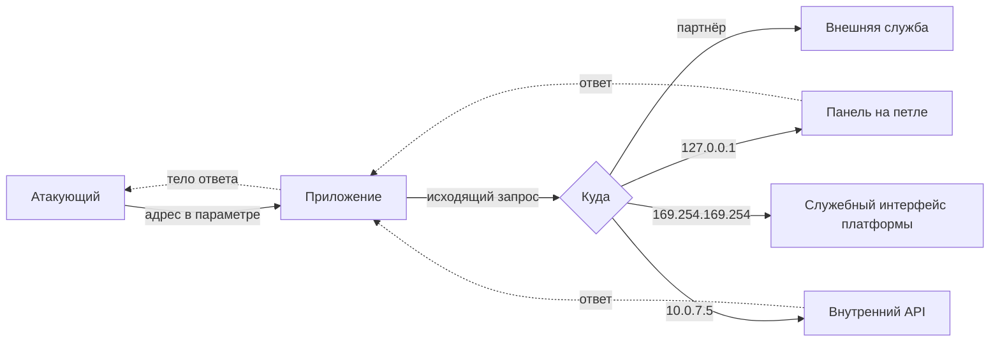

# Базовый SSRF: доступ к внутренним сервисам

Уровень **L1** · время 95 мин (теория 45 / лаба 35 / самопроверка 15,
оценка)

Что прочитать сначала: `app-architecture`, `url-and-encoding`.

Портал собирает карточку для каждой вставленной ссылки — заголовок, описание,
картинка. Карточку собирает сервер: он сам открывает адрес и разбирает ответ.
В поле вставили адрес `http://10.0.7.5/reports/invoices`, и вернулось вот что.

**Запрос**

```http
GET /preview?url=http://10.0.7.5/reports/invoices HTTP/1.1
Host: portal.example.com
Cookie: session=7bQ2mK
```

**Ответ**

```http
HTTP/1.1 200 OK
Content-Type: application/json

{"title":"Счета за август","text":"acme 12000, globex 90000"}
```

Адрес `10.0.7.5` из интернета не открывается: служба отчётов стоит внутри сети.
Запрос к ней ушёл от портала, а не из интернета — и служба ответила, потому что
спрашивать имя вызывающего её никто не учил. Пароль здесь не подобран и
проверка не обойдена: карточку собрал штатный код по адресу из поля формы.

Приложение давно не только отвечает на запросы, но и делает их само. Если адрес
такого исходящего запроса приезжает из данных, то цель выбирает отправитель.
Сервер идёт по этому адресу со своего места — изнутри периметра, где стоят
службы, закрытые от интернета и потому не спрашивающие пароля. Это и называют
подделкой запроса на стороне сервера, сокращённо SSRF: запрос настоящий,
отправлен вашим сервером, а цель ему назвали снаружи.

К этой карточке тема возвращается пять раз. «Механика» ставит адрес `10.0.7.5`
во второй из трёх кругов целей. «Эксплуатация» повторяет тот же ход на стенде и
добирает остальные круги. «Как выглядит в коде» показывает обработчик
предпросмотра изнутри, «Как чинится» — что в нём меняют. «Ловушка» отвечает на
возражение, что предпросмотр для этого и написан.

Обход фильтров, слепой случай и метаданные облака разобраны отдельными темами
подраздела. Здесь — механизм в чистом виде: приложение, которое ходит по
адресу, полученному из данных.

## 0. Коротко

SSRF — дефект, при котором адрес
исходящего запроса приложения задаёт тот, кто прислал запрос входящий.
Атакующий подменяет адрес и получает сервер в роли посредника. Тот ходит туда,
куда самому атакующему хода нет: на петлю, во внутреннюю сеть, на служебные
интерфейсы платформы. Опасно это не самим запросом: внутренние
службы обычно не спрашивают, кто их зовёт. Их защищала недоступность снаружи,
и она перестала работать. Чинится тем, что адрес собирает приложение по списку
разрешённого, а не клиент. То же в терминах, которыми это обсуждают.

**Зачем это в работе AppSec-инженера.** Строку `requests.get(url)` вы писали:
приложению нужно забрать картинку по ссылке, дёрнуть вебхук, подтянуть отчёт из
соседней службы. Вопрос «кто выбрал этот адрес» при этом не возникал: адрес
приехал в поле формы, поле заполнил пользователь, картинка загрузилась.
Проверка начинается ровно с этого вопроса. Задаётся он каждому исходящему
запросу: загрузчику аватара, обработчику вебхука, генератору отчётов,
импортеру, любой интеграции, которая ходит по адресу из настроек.

## 1. Цели

После этого раздела вы сможете:

1. Объяснить, что получает атакующий, подменив адрес исходящего запроса.
2. Назвать места, которыми адрес попадает в приложение, кроме поля с адресом.
3. Отличить в коде адрес, собранный приложением, от адреса из запроса.
4. Собрать список разрешённого так, чтобы он проверял адрес назначения.
5. Написать правило SAST на исходящий запрос по непроверенному адресу.

## 2. Предвопросы

Попробуйте ответить до чтения — даже если ответ окажется неверным, дальше он
будет с чем сравнить.

1. Приложение показывает предпросмотр ссылки, которую вставил пользователь.
   Чем этот запрос отличается от запроса, который сделал бы сам пользователь
   из браузера?
2. Внутренняя служба отчётов слушает на адресе, недоступном из интернета, и
   пароля не спрашивает. Что защищает её от чужого запроса?
3. Приложение сверяет присланное имя хоста со списком партнёров и запрос
   отправляет. Что произойдёт, если партнёрское имя начнёт разрешаться во
   внутренний адрес?

## 3. Механика

**Откуда это взялось.** Пока приложение было единственным узлом, вся защита
строилась по входящим соединениям: снаружи — межсетевой экран и вход по
паролю, внутри — доверие. Затем приложение само стало клиентом: оно ходит к
службе оплаты, к хранилищу картинок, к внутреннему API отчётов. Периметр
остался прежним, а внутри него выросли службы, которые никто не закрывал, —
их защищала недоступность снаружи. Дальше остаётся одна деталь: адрес
исходящего запроса стал приходить от пользователя, и недоступность снаружи
кончилась. Защита периметра этого не заметила.

Определение стандарта короткое. ASVS называет SSRF атакой, которая
злоупотребляет функциональностью сервера, чтобы читать или изменять внутренние
ресурсы. Атакующий поставляет или изменяет адрес, а код на сервере по нему
читает или отправляет данные.

### Разбор по общей рамке

Разбор дефекта в гайдбуке идёт по одному набору подцелей, и SSRF
раскладывается по нему без остатка.

**Источник** — адрес или его часть в запросе: параметр, поле формы, значение в
теле JSON, поле заголовка. **Путь** — код, который строит из этого адрес и
передаёт его клиенту HTTP. **Сток** — вызов клиента: `requests.get`, `fetch`,
`urlopen`, `HttpClient.send`. **Отсутствующий контроль** — решение о том, куда
приложению позволено ходить; между источником и стоком его нет. **Условие
эксплуатации** — доступ к тому самому полю; учётная запись при этом нужна
обычная, а часто и она не нужна.

Полезно заметить, чего в этом наборе нет. Нет обмана самого протокола:
запрос уходит корректный, отвечает на него настоящая служба. Атакующий не
подделывает ни адрес отправителя, ни подпись — он пользуется тем, что
отправителем стал сервер приложения. Каталог MITRE называет такую роль
посредника отдельным классом, CWE-441: узел выполняет чужое поручение,
пользуясь своими правами.

### Чем это не похоже на подделку межсайтового запроса (CSRF)

Названия близки, и на собеседовании их сравнивают часто. Разница в том, чей
клиент делает запрос. При подделке запроса на стороне браузера — так ASVS
называет CSRF, разбор в теме `csrf-mechanics` — запрос отправляет браузер
жертвы. Ценность приёма в том, что к
запросу прикладываются её cookie. Атакующий при этом не видит ответа и не
получает доступа к сети жертвы.

При SSRF запрос отправляет сервер приложения. Cookie жертвы к нему отношения не
имеют, зато к нему прикладывается положение сервера: адреса, доступные изнутри
периметра, и доверие внутренних служб к соседу. Отсюда и разная добыча.
Подделка на стороне браузера даёт действие от имени пользователя, SSRF — доступ
к сети.

### Три круга целей

**Сам сервер.** Приложению говорят пойти на петлю: `http://127.0.0.1/admin`
или `http://localhost/admin`. Запрос приходит с локального адреса, и
приложение обслуживает его иначе. Web Security Academy перечисляет три
причины, почему так выходит. Проверка прав живёт в отдельном компоненте перед
сервером приложения, и соединение изнутри её минует. Административный доступ с
локальной машины оставлен без пароля на случай восстановления. Панель слушает
на другом порту, недоступном пользователям напрямую.

**Внутренняя сеть.** Службы, до которых пользователю хода нет, стоят на адресах
вида `10.0.7.5` или `192.168.0.68`. Их защищала топология сети, поэтому
проверок в них обычно меньше: внутренний API отчётов отдаёт всё, что попросят,
без единого вопроса о правах. Служба отчётов из введения — ровно этот круг: она
отдала счета в карточку предпросмотра, ни о чём не спросив.

**Наружу.** Запрос уходит на узел, выбранный атакующим. Отсюда две разные
вещи: подтверждение самой уязвимости внеполосным обращением, разобранное в
теме `blind-ssrf`, и атака на третью сторону от имени организации, которая
приложение держит.



**Описание схемы.** Слева атакующий, передающий адрес параметром. Приложение
делает по нему исходящий запрос, и выбор цели полностью задан этим адресом:
партнёрская служба, панель на петле, внутренний API, служебный интерфейс
платформы. Пунктиром показан обратный ход — ответ внутренней службы возвращается
приложению и оттуда попадает атакующему. Когда обратного хода нет, случай
называется слепым, и его разбирает отдельная тема.

### Где адрес попадает в приложение

Поле с полным адресом — самый заметный случай и не самый частый. WSTG-v42-INPV-19
и Web Security Academy вместе дают такой набор мест.

**Часть адреса.** В параметре приезжает только имя хоста или кусок пути, а
адрес собирает сервер. Управление у атакующего неполное, и приём от этого не
исчезает — он ограничивается.

**Адрес внутри формата данных.** Разбор XML умеет ходить по ссылкам сам:
внешняя сущность заставляет парсер сделать запрос. Это тема 1.3.10, и SSRF там
получается побочным следствием.

**Поле заголовка.** Аналитика на сервере пишет в журнал заголовок `Referer` и
нередко сама открывает адреса, которые в нём видит. WSTG прямо отмечает, что
полезная нагрузка ставится и в поля заголовков, и в cookie, а не только в
параметр.

**Генератор документов.** Сервер собирает PDF из размётки, которую прислал
пользователь. WSTG перечисляет носители: `iframe`, `img`, `base`, `script` и
функция `url()` в стилях. Запрос делает библиотека разметки, а не код
приложения, и в обзоре кода этот сток видно хуже всего.

**Схема адреса.** Клиент, которому не сказали иного, часто понимает больше
схем, чем нужно приложению. WSTG показывает `file:` для чтения файла;
prevention cheat sheet добавляет `ftp:`, `gopher:`, `dict:` и другие. Чтение
локального файла через непроверенный путь — отдельное требование
ASVS v5.0-5.3.2, и оно перечисляет SSRF среди того, от чего защищает.

## 4. Эксплуатация

Стенд — лаба этой темы (`pilot/lab/ssrf-basics`). Витрина партнёрских товаров
показывает карточку по адресу, который прислал клиент. Сеть изображена двумя
таблицами: имя в адрес и адрес с портом в службу. Сокет не открывается ни
один, поэтому опыты воспроизводимы и никуда не уходят.

Шаг первый — найти сток. В лабе он один и виден в коде. В живом приложении
его ищут по местам из блока 3, начиная с полей, где адрес ожидается по
замыслу.

Шаг второй — узнать, что стоит за адресом. До этого момента известно только,
что сервер куда-то ходит. Проверка занимает один запрос на петлю: если ответ
изменился, адрес влияет на цель.

Шаг третий — обойти три круга целей.

```text
$ python3 hack.py
  опыт 1 — петля, 127.0.0.1:8080: код 200 — СЕССИЯ АДМИНИСТРАТОРА ПОЛУЧЕНА
  опыт 2 — внутренняя сеть, 10.0.7.5: код 200 — ЧУЖОЙ СЧЁТ ПОЛУЧЕН
  опыт 3 — метаданные, 169.254.169.254: код 200 — КЛЮЧИ РОЛИ ПОЛУЧЕНЫ
  опыт 4 — схема file:: код 200 — ФАЙЛ НАСТРОЕК ПОЛУЧЕН
  опыт 5 — партнёр ведёт внутрь: код 200 — КЛЮЧИ РОЛИ ЧЕРЕЗ ХОСТ СПИСКА
  опыт 6 — контроль, карточка партнёра: код 200 — карточка отдана
```

Опыт 1 — первый круг. Панель на петле отдаёт сессию администратора, потому что
запрос пришёл с локального адреса.

Опыт 2 — второй круг, тот же ход, что в предпросмотре из введения. Служба
счетов не спрашивает ни о правах, ни об имени вызывающего: её защищала
недоступность из интернета.

Опыт 3 — служебный интерфейс платформы. Разбирает его тема
`cloud-metadata-ssrf`; здесь важно, что адрес ничем не отличается от прочих и
попадает в тот же список.

Опыт 4 — схема вместо адреса. Клиент читает локальный файл, и никакой сети для
этого не нужно.

Опыт 5 — хост из списка партнёров, отвечающий перенаправлением внутрь. Опыт
поставлен отдельно, потому что список имён его пропускает: приём разобран в
теме `ssrf-filter-bypass`.

Опыт 6 — не атака, а контроль: карточка партнёра должна отдаваться и после
починки. Без него исправление сведётся к запрету всего подряд, и это выяснится
на приёмке.

Шаг четвёртый — оценить добычу. Ответ службы счетов — утечка. Сессия из панели
— повышение прав. Учётные данные роли — доступ к платформе. Описание A01:2025
относит SSRF к нарушениям контроля доступа именно поэтому: результат здесь тот
же, что у обхода проверки прав.

## 5. Как выглядит в коде

Ревьюер ищет пару: сток исходящего запроса и путь до него от данных запроса.
Сток — вызов клиента HTTP. Опасен он тогда, когда первый аргумент собран из
того, что прислали. Обработчик предпросмотра из введения изнутри выглядит так.
Не читая выносок, назовите сами источник и сток в этих трёх строках — и место,
где должно стоять решение о цели.

```python
# УЯЗВИМО — демонстрация, не для продакшена
import requests

def preview(request):
    url = request["query"].get("url", "")     # (1)
    resp = requests.get(url, timeout=5)       # (2)
    return {"body": resp.text}
```

1. Источник: адрес целиком задаёт отправитель.
2. Сток: клиент идёт по этому адресу и приносит ответ обратно. Между двумя
   строками нет решения о том, куда ходить позволено.

Тот же дефект на втором стеке выглядит так же, и это в нём главное: меняется
имя клиента, механизм не меняется. Отметьте в нём источник и сток, не
подглядывая в нумерацию.

```javascript
// УЯЗВИМО — демонстрация, не для продакшена
app.get("/preview", async (req, res) => {
  const target = req.query.url;                    // (3)
  const upstream = await fetch(target);            // (4)
  res.send(await upstream.text());
});
```

3. Тот же источник в идиоме другого стека.
4. Тот же сток. Клиент `fetch` по умолчанию проходит перенаправления, и цель
   запроса задаёт уже не только присланный адрес.

**Что искать глазами.** Список стоков конечен и стоит того, чтобы держать его
в голове. В Python это `requests`, `httpx`, `urlopen` и `urllib3`; в Node.js —
`fetch`, `axios` и `got`; в Java — `HttpClient`, `RestTemplate` и
`URL.openStream`. Дальше
три вопроса. Откуда взялся первый аргумент? Есть ли между источником и стоком
сверка со списком разрешённого? Проходит ли клиент перенаправления?

**Обёртки, которые не спасают.** Проверка «строка похожа на адрес» отвечает на
вопрос о форме, а не о цели. Список запрещённых имён закрывает то, что автор
вспомнил, — почему этого мало, разбирает тема `ssrf-filter-bypass`. Тайм-аут и
ограничение размера ответа уменьшают ущерб и не меняют того, куда уходит
запрос.

**Ложное срабатывание.** Адрес, собранный приложением из постоянной части и
номера: `f"{CATALOG}/{int(item_id)}"`. Из запроса здесь приходит число, а не
адрес, и целью управлять нечем.

## 6. Как чинится

Меняется не проверка адреса, а то, кто его собирает. Приложение знает конечный
список мест, куда ему положено ходить, и строит адрес само. Читайте функцию с
тремя планами: отсечь лишние схемы; сверить хост со списком без послаблений на
форму записи; проверить адрес после разрешения имени. Выноски ставят каждый
план на свою проверку.

```python
SCHEMES = ("http", "https")
PARTNERS = ("partner.example", "cdn.example")

def allowed_url(url):
    scheme, host, port, path = split(url)
    if scheme not in SCHEMES:                     # (1)
        raise Denied(f"схема не разрешена: {scheme}")
    if host not in PARTNERS:                      # (2)
        raise Denied(f"хост не в списке: {host}")
    address = resolve(host)
    if (address, port) not in ALLOWED:            # (3)
        raise Denied(f"адрес не разрешён: {address}")
    return f"{scheme}://{host}:{port}{path}"
```

1. Список схем. Без него клиент понимает `file:` и прочее, чего приложению не
   нужно.
2. Список хостов. Сверка идёт со списком целиком, а не по вхождению подстроки.
3. Сверка адреса **после** разрешения имени. Она закрывает случай «имя в
   списке, а разрешается во внутренний адрес» — и она же единственное, что
   отделяет список разрешённого от списка имён.

Вызов клиента после этого выглядит так, и второй аргумент здесь такая же часть
починки, как и первый.

```python
target = allowed_url(request["query"].get("url", ""))
resp = net.get(target, follow_redirects=False)
if resp["status"] == 302:
    raise Denied("перенаправление не проходится")
```

Запрос из введения дальше второй сверки не уходит: адрес `10.0.7.5` в списке
партнёров не значится, и карточка не собирается вовсе.

Требование ASVS v5.0-1.3.6 просит ровно этого: сверять непроверенные данные со
списком разрешённых схем, доменов, путей и портов. Требование
ASVS v5.0-13.2.4 повторяет то же на уровне развёртывания и добавляет, где
список может жить: приложение, веб-сервер, межсетевой экран или их сочетание.
Prevention cheat sheet отдельной строкой просит выключить проход по
перенаправлениям в клиенте.

**Границы применимости.** Список разрешённого работает, пока набор целей
известен заранее. Там, где пользователь по замыслу называет любой внешний
адрес — вебхуки, предпросмотр произвольной ссылки, — списка нет, и остаётся
запрещающий, который обходится. Prevention cheat sheet называет этот случай
вторым и честно пишет, что непробиваемой стены здесь не выходит. Что делать
дальше, разбирает тема `ssrf-defense`.

**Чем за это платят.** Ведением списка: каждый новый партнёр — правка. Второй
частью цены становится разрешение имён — приложение делает его само и до
запроса, а значит, зависит от того, какой резолвер отвечает.

**Чего это не закрывает.** Расхождений разборщиков адреса. Проверяющий код и
клиент могут понять одну строку по-разному, и тогда список сверится с одним
адресом, а запрос уйдёт на другой. Это отдельное требование
ASVS v5.0-13.2.4 не покрывает, а разбирает тема `ssrf-filter-bypass`.

## 7. Как проверить фикс

Ретест повторяет пять опытов и добавляет то, что обязано продолжать работать.

```text
$ LAB_TARGET=solution.py python3 hack.py
  опыт 1 — петля, 127.0.0.1:8080: код 400
  опыт 2 — внутренняя сеть, 10.0.7.5: код 400
  опыт 3 — метаданные, 169.254.169.254: код 400
  опыт 4 — схема file:: код 400
  опыт 5 — партнёр ведёт внутрь: код 400
  опыт 6 — контроль, карточка партнёра: код 200 — карточка отдана
```

Пять отказов и один пропуск. Отказ на шестом опыте означал бы, что витрина
перестала работать, и приёмку такая починка не проходит.

Регресс закрывается тестами функциональности. В лабе их восемь, и проверяют они
не безопасность, а сохранность работы: карточки обоих партнёров, явный порт,
схема `https`, пустой адрес и мусор вместо адреса.

```text
$ LAB_TARGET=solution.py python3 tests.py
  OK   карточка первого партнёра отдаётся
  ...
  OK   мусор вместо адреса даёт 400 или 502
  упало: 0
```

Три негативных случая стоит проверить отдельно. Первый: отказ по списку и
недоступность цели отвечают разными кодами, иначе список разрешённого сам
станет способом изучать сеть. Второй: пустое и неразбираемое значение дают
отказ, а не исключение с трассировкой в ответе. Третий: перенаправление с
разрешённого хоста не проходится — этот опыт закрывается позже прочих и ломается
первым при возврате к прежнему клиенту.

Отдельный тест на регресс — тот, который ловит возврат дефекта: вызов клиента
в обход `allowed_url`. Вместо теста его несёт правило из блока 8, поэтому
проверка стоит на каждом коммите.

## 8. Как ловится автоматикой

SSRF хорошо ложится на анализ помеченных данных: у дефекта есть источник, есть
сток и есть очищающая функция между ними. Правило пишется в режиме `taint` и
отвечает на один вопрос — доходит ли значение из запроса до вызова клиента, не
пройдя сверку.

```yaml
# ФРАГМЕНТ — срез файла pilot/semgrep/outbound-url-unvalidated.yaml,
# самостоятельно не запускается: опущены rules, id и message
mode: taint
pattern-sources:
  - pattern: request[...]
  - pattern: $R["query"].get(...)
pattern-sanitizers:
  - pattern: int(...)
  - pattern: allowed_url(...)
pattern-sinks:
  - pattern: requests.$M($URL, ...)
  - pattern: urlopen($URL, ...)
  - pattern: net.get($URL, ...)
```

Правило целиком лежит в `pilot/semgrep/outbound-url-unvalidated.yaml` и сверено
прогоном: на уязвимом файле лабы одна находка, на решении — ноль, на семи
размеченных тест-кейсах расхождений нет.

**Что правило пропустит.** Всякий клиент, которого нет в списке стоков:
собственную обёртку над HTTP, вызов через очередь задач, библиотеку разметки,
которая ходит по ссылкам сама. Всякий источник, не похожий на разбор запроса:
адрес, прочитанный из базы, куда его положил пользователь. И весь случай
частичного адреса, когда из запроса приходит только имя хоста.

**Какой шум даст.** Любую очищающую функцию, названную не так, как в списке
санитайзеров. Правило видит имена, а не смысл: сверка со списком, написанная
внутри обработчика без отдельной функции, для него не существует. На корпусе с
собственной обёрткой правило дополняется её именем — и это правка одной строки,
а не написание нового правила.

Есть и то, чего статический анализ не увидит в принципе. Он не
отвечает, куда ведёт адрес, потому что это выясняется во время работы:
разрешение имени, перенаправление, свой резолвер. Приём из опыта 5 —
разрешённый хост, отвечающий перенаправлением внутрь, — для сигнатуры выглядит
безупречно. Отсюда правило дополняется двумя вещами: проверкой настроек клиента
на проход перенаправлений и сетевым ограничением исходящих соединений, которое
не зависит от кода вовсе.

## 9. Ловушка

Предпросмотр ссылок портал из введения обещал открыто: ради карточки он и
написан. Отсюда представление: приложение по замыслу ходит по ссылке, которую
дал пользователь, — предпросмотр, импорт, вебхук. Значит, исходящий запрос
здесь функция, а не дефект, и говорить не о чем. Что в этом рассуждении не так?

**Дефект не в том, что приложение ходит по ссылке, а в том, что цель выбирает
клиент.** Функция состоит в том, чтобы принести содержимое внешнего ресурса.
Внутренняя служба и петля к внешним ресурсам не относятся, и ни один замысел
их не предполагал.

Отсюда видно, где проходит граница. Приложение, которое ходит по любому
публичному адресу и не ходит по внутренним, свою функцию выполняет целиком.
Приложение, которое ходит по любому адресу вообще, выполняет ещё и чужую.

Контрпример. Предпросмотр ссылки в корпоративном мессенджере принимает адрес
`http://169.254.169.254/latest/meta-data/`, показывает карточку и в её описании
печатает ответ служебного интерфейса платформы. Функция сработала ровно так,
как задумана: ресурс принесён и показан. Задумана она была для внешних адресов,
но об этом знал автор, а не код.

## 10. Чеклист ревью

1. Verify that адрес исходящего запроса собирает приложение, а из запроса
   приходит идентификатор или часть адреса, но не адрес целиком.
2. Verify that непроверенные данные сверяются со списком разрешённых схем,
   доменов, путей и портов (ASVS v5.0-1.3.6).
3. Verify that сверка идёт со списком целиком, а не по началу строки, концу
   строки или вхождению подстроки.
4. Verify that проверяется адрес назначения после разрешения имени, а не
   только имя хоста.
5. Verify that клиент HTTP не проходит перенаправления сам либо повторяет
   проверку для каждого перехода.
6. Verify that список разрешённых внешних систем задан на уровне приложения,
   веб-сервера или межсетевого экрана (ASVS v5.0-13.2.4).
7. Verify that путь к локальному файлу не строится из присланных данных
   (ASVS v5.0-5.3.2).
8. Verify that адрес ищется не только в полях с адресом, но и в полях
   заголовков, cookie и вложенных форматах данных (WSTG-v42-INPV-19).

## 11. Лаба

`lab-ssrf-basics`, каталог `pilot/lab/ssrf-basics`. Формат «почини»: правится
`code.py`, пока `hack.py` и `tests.py` не станут зелёными одновременно.

**Цель одной фразой:** добиться, чтобы `hack.py` вышел с кодом 0, а `tests.py`
продолжил выходить с кодом 0.

Всё локально, только стандартной библиотекой Python, без сети и без Docker.
Сокет не открывается ни один: сеть изображена таблицей имён и таблицей служб в
`net.py`.

Одна подсказка: спрашивайте не «какие адреса запретить», а «по какому конечному
списку схем и адресов витрине вообще положено ходить».

**Отдельная задача «почини».** Закройте опыт 5 — партнёрский адрес, отвечающий
перенаправлением внутрь. Список хостов его пропускает, потому что хост в нём
законный. Проверяется тем, что пятая строка вывода `hack.py` меняет код с 200
на отказ, а карточка партнёра из опыта 6 продолжает отдаваться.

Решение лежит в `solution.py` и открывается после того, как своя попытка
сделана.

## 12. Проверь себя

1. Чем запрос, который приложение делает по присланному адресу, отличается от
   запроса, который сделал бы сам пользователь из браузера?
2. Три причины, по которым служба на петле обслуживает запрос без проверки
   прав, — какие?
3. Почему сверка имени хоста со списком партнёров закрывает не весь механизм и
   что к ней добавляется?
4. Какие четыре места, кроме поля с адресом, приносят адрес в приложение?
5. Что правило SAST из блока 8 не увидит и чем это дополняется?
6. Возврат к теме `url-and-encoding`: какие части адреса задают цель запроса, а
   какие на неё не влияют?

<details markdown="1">
<summary>Ответы</summary>

1. Отправителем становится сервер приложения. Он стоит внутри периметра, ему
   доступны адреса, недоступные пользователю, и внутренние службы считают его
   своим.
2. Проверка прав живёт в отдельном компоненте перед сервером приложения, и
   соединение изнутри её минует. Административный доступ с локальной машины
   оставлен без пароля для восстановления. Панель слушает на другом порту.
3. Имя может разрешаться во внутренний адрес, и список имён этого не видит.
   Добавляется сверка адреса назначения после разрешения имени и запрет
   проходить перенаправления.
4. Часть адреса, собираемая сервером; адрес внутри формата данных, например
   внешняя сущность XML; поля заголовков и cookie, включая `Referer`; разметка,
   которую разбирает генератор документов.
5. Клиентов вне списка стоков, источники, не похожие на разбор запроса, и
   частичный адрес. Дополняется проверкой настроек клиента на проход
   перенаправлений и сетевым ограничением исходящих соединений.
6. Цель задают схема, имя хоста или адрес и порт. Путь, строка запроса и
   фрагмент выбор узла не меняют — при том что путь решает, что именно будет
   получено от этого узла.

</details>

## 13. Источники

1. PortSwigger Web Security Academy, «Server-side request forgery (SSRF)»;
   реестр `ps-ssrf`. Разделы: What is SSRF, Impact, SSRF attacks against the
   server, SSRF attacks against other back-end systems, Finding hidden attack
   surface for SSRF vulnerabilities.
   <https://portswigger.net/web-security/ssrf>
2. OWASP WSTG-INPV-19 «Testing for Server-Side Request Forgery», WSTG v4.2;
   реестр `wstg-v42-inpv-19-ssrf`. Разделы: Summary, How to Test, HTTP Methods
   Used, PDF Generators, Remediation.
   <https://owasp.org/www-project-web-security-testing-guide/v42/4-Web_Application_Security_Testing/07-Input_Validation_Testing/19-Testing_for_Server-Side_Request_Forgery>
3. OWASP Server-Side Request Forgery Prevention Cheat Sheet; реестр
   `owasp-cs-ssrf`. Разделы: Context, Cases, Case 1 — Application layer,
   Case 2 — Challenges in blocking URLs at application layer.
   <https://cheatsheetseries.owasp.org/cheatsheets/Server_Side_Request_Forgery_Prevention_Cheat_Sheet.html>
4. OWASP Top 10:2025, «A01:2025 Broken Access Control»; реестр
   `owasp-top10-2025-a01`. Разделы: Background, List of Mapped CWEs.
   <https://owasp.org/Top10/2025/A01_2025-Broken_Access_Control/>

Каркас этапа: `owasp-asvs-5-document` (ASVS v5.0.0), `owasp-wstg-42`,
`owasp-top10-2025`. Наследуются всеми темами и отдельной строкой не
повторяются. Первая и третья сноски — якоря подраздела 1.2.

**Скоропортящийся слой.** Список стоков по стекам пополняется вместе с
библиотеками. Страницы Web Security Academy и cheat sheet — живые площадки без
даты публикации. Версии Python и Semgrep, на которых снимались прогоны, названы
в маркерах уверенности.

**Маркеры уверенности.** Прогоны лабы и правила SAST — **проверено лично**
2026-08-24 на Python 3.14.7 и Semgrep 1.174.0: пять опытов эксплойта дают 200 на
`code.py` и 400 на `solution.py`, восемь тестов функциональности проходят в
обоих случаях, правило даёт одну находку на уязвимом файле и ноль на решении.
Три причины доверия к запросу с петли, три круга целей и набор мест, откуда
приходит адрес, — **по документации** (Web Security Academy и WSTG-INPV-19,
открыты лично 2026-08-24). Отнесение CWE-918 к A01:2025 сверено со списком
сопоставленных CWE на странице категории (открыта лично 2026-08-24). Требования
1.3.6, 5.3.2 и 13.2.4 сверены с текстом ASVS v5.0.0 (открыт лично 2026-08-24).
Листинг на JavaScript **не запускался**: стенда под Node.js не собиралось.
