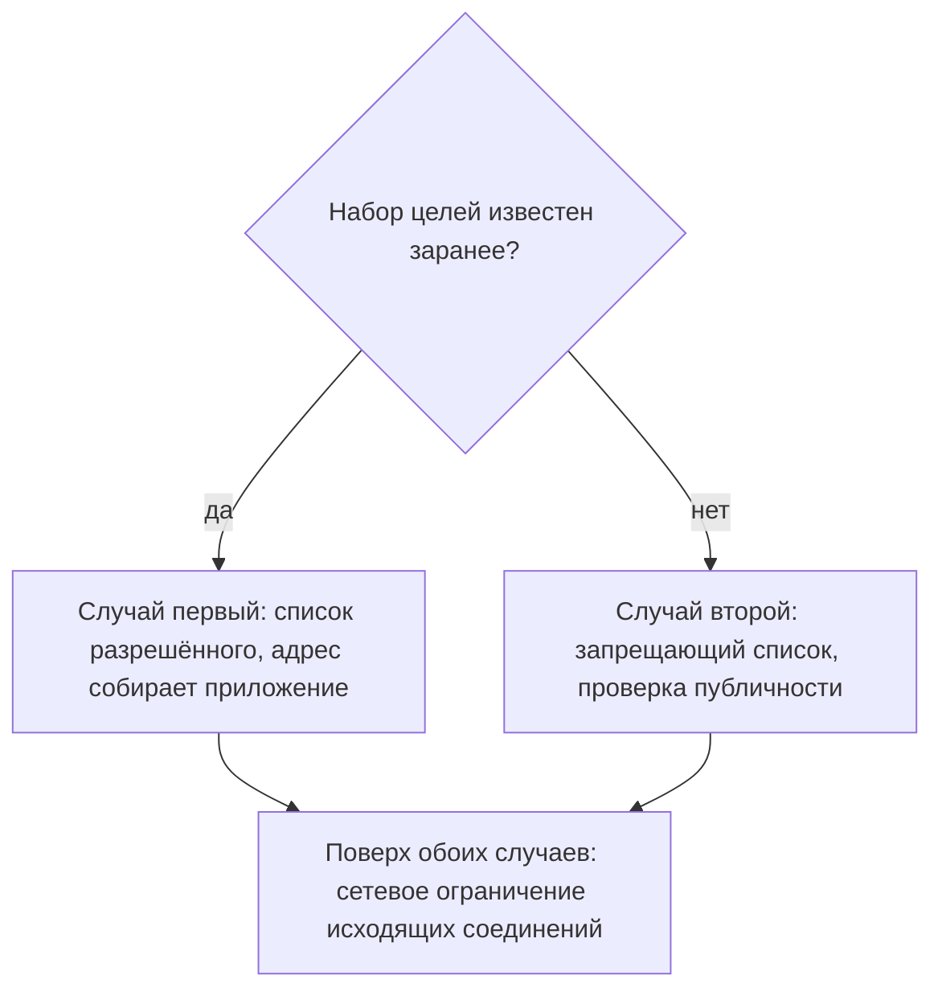

# Защита от SSRF: allow-list и сегментация

Магазин шлёт уведомления о заказе на вебхук — адрес, который клиент называет
сам: событие случилось, и сервер делает на него запрос. Из темы `ssrf-basics`
вы знаете, чем это опасно: подменённый адрес превращает сервер в посредника,
которому открыта внутренняя сеть. Поэтому в коде стоит проверка: если адрес
внутренний, отказать, а признак внутренности взят готовый из библиотеки
`ipaddress`. Её поле `is_private` отвечает на вопрос «внутренний ли это
адрес», а поле `is_global` — «достижим ли адрес из интернета». Клиент прислал
`http://100.64.1.1/admin`, и вот что об этом адресе говорит библиотека.

```python
ipaddress.ip_address("100.64.1.1").is_private
ipaddress.ip_address("100.64.1.1").is_global
```

**Вывод**

```text
False
False
```

Адрес не внутренний — и не публичный: оба поля дали `False`. Диапазон
`100.64.0.0/10` отведён операторам связи: им провайдер соединяет своих
абонентов, как офисная телефонная станция — сотрудников добавочными
номерами. С улицы на добавочный не дозвониться, и из интернета на такой адрес
не прийти, но и домашним адресом он не считается. Проверка сработала ровно
как написана, и уведомление ушло на `/admin` по этому адресу. Библиотека
ответила честно, а неверным был вопрос: «внутренний ли» и «можно ли туда
ходить» — разные вопросы; как задать правильный и почему ответов два,
разберём ниже.

## Два случая, а не один

Защита от SSRF — не одна мера, а три слоя, и первый существует не всегда.
Это список разрешённого: перечень целей, куда приложению позволено ходить; вы
собирали такой в теме `ssrf-basics`. Он возможен, когда цели известны
заранее, и невозможен, когда цель называет пользователь. Второй слой
проверяет уже свойство адреса: публичный он или нет. Третий стоит вне кода —
это правило на исходящие соединения самой машины.

Два случая различаются одним вопросом: известен ли набор целей заранее.
Приложению, которое ходит в кадровую систему и к двум партнёрам, список
разрешённого собрать можно: все цели названы в схеме взаимодействия. Вебхуку
из начала темы — нельзя: перечень адресов клиентов неизвестен заранее и
меняется каждый день. Памятка OWASP по защите от SSRF, Server Side Request
Forgery Prevention Cheat Sheet, строит защиту ровно по этому делению. Темы
`ssrf-basics` и `ssrf-filter-bypass` в своих блоках про починку отсылают
именно сюда: здесь защита собрана целиком, включая то, что делается вне кода
приложения.



**Описание схемы.** Схема читается сверху вниз и сводит защиту к одному
вопросу: известен ли набор целей заранее. Если да, работает список
разрешённого, и адрес приложение собирает само. Если цель называет
пользователь, остаётся запрещающий список с проверкой публичности каждого
адреса. Обе ветки сходятся в сетевом ограничении исходящих соединений: оно
стоит вне кода приложения и переживает ошибку в любой из проверок.

**Зачем это в работе AppSec-инженера.** Замечание ревью «сделайте allow-list»
вы, возможно, уже получали, и в код тогда пошло то, что нашлось в библиотеке.
Рекомендация годится ровно в одном из двух случаев: во втором она означает
«перепишите продукт», потому что произвольный адрес и есть смысл функции.
Ревьюер, который различает случаи, пишет выполнимое требование, а не общее
место. Деление на случаи задаёт и структуру разговора с командой: сначала
вопрос «известен ли набор целей», потом меры.

## Как это работает

**Откуда это взялось.** Первым ответом на SSRF был фильтр: перечислить, куда
ходить нельзя. Он не сработал, и причина разобрана в теме
`ssrf-filter-bypass`: проверяется строка, а соединение идёт по адресу. Вторым
ответом стал список разрешённого, и он упёрся в приложения вроде вебхуков,
где цель называет пользователь. Так защита разделилась на два случая, а
поверх них встал третий слой, который работает без участия кода, — правила
сети.

### Случай первый: набор целей известен

Главное требование памятки здесь короткое: не принимать от пользователя адрес
целиком. Почему — видно из темы `ssrf-filter-bypass`: строку адреса два
разборщика читают по-разному, и проверка строки не говорит, куда пойдёт
соединение. Вместо него принимают часть: адрес узла, имя домена или вовсе
идентификатор партнёра, а целый адрес приложение собирает само из проверенных
частей.

Проверка принятого значения идёт в два слоя. Первый — форма: значение
действительно адрес узла или действительно имя домена, без лишних частей.
Памятка называет для этого проверенные библиотеки по языкам и отдельно
отмечает, какие из них поддаются записи адреса в шестнадцатеричном,
восьмеричном и смешанном виде. Метод `IPAddress.TryParse` в .NET поддаётся
всему, кроме процентного кодирования. Библиотеки `InetAddressValidator` в
Java, `ip-address` в JavaScript и `IPAddr` в Ruby — нет. Второй слой — сверка
результата разбора со списком строгим сравнением, без `endswith` и вхождения
подстроки.

От подмены адреса под разрешённым именем, повторного разрешения из темы
`ssrf-filter-bypass`, памятка требует двух знакомых вам мер. Домены
организации разрешаются своим резолвером первым в цепочке. Домены из списка
отслеживаются: если один начал разрешаться в локальный или внутренний адрес,
это видно до инцидента, а не из него.

### Случай второй: цель называет пользователь

У вебхуков, предпросмотра ссылки и импорта по адресу перечня целей не будет
никогда. Памятка прямо пишет, что запрещающий список — не непробиваемая
стена, а последняя мера, и в этом случае он лучшее, что есть. Разница со
списком разрешённого — как у двух постов охраны. Первый сверяет гостя со
списком приглашённых и не пропустит никого лишнего. Второй держит список
нежелательных и пропустит любого, кого забыли внести. Аналогия ломается на
масштабе: список всех хороших адресов интернета не составить, поэтому вместо
перечня проверяют свойство адреса.

Свойство формулируется положительно: адрес обязан быть публичным. Это и есть
правильный вопрос из начала темы. Проверка «не внутренний ли» отвергает
перечисленное, а проверка «публичный ли» — всё, что свойству не отвечает,
включая диапазоны, о которых автор не думал. Для имени домена правило то же с
дополнением: берутся все записи `A` и `AAAA`. Это записи DNS, которые
связывают имя с адресами IPv4 и IPv6, и у одного имени их бывает несколько.
Каждый полученный адрес проверяется отдельно. Схема сверяется со списком из
двух значений: `http` и `https`.

Сверх этого памятка предлагает доказательство законности вызова. Принимающее
приложение заранее выдаёт вызывающему случайный токен — длинную случайную
строку, которую нельзя угадать, — и вызов без него не принимает. Точка приёма
при этом отвечает только на `POST`: `GET` срабатывает сам, из картинки или
предзагрузки, и тела с токеном в нём нет. Смысл в том, что исходящий запрос
доходит лишь туда, где его ждут: случайный или подменённый вызов токена не
предъявит.

### Что обязан закрыть запрещающий список

Минимум задан таблицей памятки, а полный перечень берут не из памяти, а из
реестра специальных адресов IANA — ведомства, которое ведёт официальные
таблицы интернет-адресов. У реестра есть колонка «Globally Reachable»,
достижим ли адрес глобально: она и отвечает на вопрос «публичный ли это
адрес» без экспертизы. Диапазон `100.64.0.0/10` из начала темы показывает,
зачем колонка нужна: приватным в обычном смысле он не считается, а в колонке
у него стоит «нет».

| Что | Диапазоны |
|---|---|
| Метаданные платформ | `169.254.169.254`, `metadata.amazonaws.com`, `metadata.google.internal` |
| Петля и «этот узел» | `127.0.0.0/8`, `0.0.0.0/8`, `::1/128` |
| Приватные, RFC 1918 | `10.0.0.0/8`, `172.16.0.0/12`, `192.168.0.0/16` |
| Групповая рассылка | `224.0.0.0/4`, `ff00::/8` |

Первая строка — адреса, по которым облачные платформы отвечают на вопросы о
самой машине; их разбирает тема `cloud-metadata-ssrf`. Вторая — петля и «этот
узел». Записи петли `127.0.0.0/8` вы перебирали в теме `ssrf-filter-bypass`,
а `::1/128` — та же петля в IPv6. Запись из одних нулей в конфиге сервера
значит «слушать все интерфейсы». Как адрес назначения она читается иначе —
«этот узел»: стек отвечает на него как на самого себя.

Третья — частные диапазоны из RFC 1918, документа, который отвёл их под
домашние и офисные сети: маршрутизаторы интернета такие адреса не пересылают
дальше. Четвёртая — групповая рассылка: пакет на такой адрес получают все
подписанные узлы разом, как объявление по громкой связи в здании.

### Третий слой: сеть

Сетевое ограничение исходящих соединений отличается от обеих проверок одним:
оно не зависит от того, как приложение разобрало строку. Машине, на которой
стоит приложение, сеть разрешает исходящие соединения только по списку
направлений. Разбиение сети на участки с правилами прохода между ними
называют сегментацией. Бытовой пример — торговый центр: из фуд-корта нет хода
в служебные коридоры, потому что дверь между зонами открывает только свой
пропуск. Аналогия ломается на том, что пропуска в сети нет: решение принимает
межсетевой экран по адресу назначения.

Памятка называет сегментацию настоятельно рекомендованной именно потому, что
она останавливает незаконный вызов на сетевом уровне. ASVS требует того же
двумя пунктами. Требование v5.0-13.2.4 — список внешних систем, с которыми
приложению позволено общаться; жить он может в приложении, на веб-сервере, на
межсетевом экране или в их сочетании. Требование v5.0-13.2.5 — сам сервер
настроен списком ресурсов, к которым он вправе обращаться.

## Как это выглядит в коде

Ревьюер смотрит не на наличие проверки, а на то, что именно она проверяет и в
какой момент. Разбор идёт тремя планами: найти, на каком свойстве стоит
проверка; назвать, какие адреса она пропускает; назвать, где она обходится.
Проверка из начала темы выглядит так. До выносок ответьте сами: что здесь
проверяется?

```python
# УЯЗВИМО — демонстрация, не для продакшена
def check(url):
    ip = ipaddress.ip_address(urlsplit(url).hostname)
    if ip.is_private:                 # (1)
        raise Denied("внутренний адрес")
```

1. Проверка на приватность вместо проверки на публичность. Для адреса из
   начала темы `is_private` даёт `False` и `is_global` даёт `False`:
   непубличный адрес проходит, потому что вопрос задан неверно.

Исправленный вариант читается тремя планами: получить все адреса имени,
отвергнуть каждый непубличный, вернуть вызывающему только проверенный список.

```python
# ФРАГМЕНТ — срез, самостоятельно не компилируется
def allowed_target(host):
    addresses = [ip for record in ("A", "AAAA")     # (1)
                 for ip in resolve(host, record)]
    if not addresses:
        raise Denied("имя не разрешается")
    for ip in addresses:
        if not ipaddress.ip_address(ip).is_global:  # (2)
            raise Denied(f"адрес не публичный: {ip}")
    return addresses
```

1. Берутся все записи обоих типов: одна запись `A` ничего не говорит о том,
   что вернёт резолвер по `AAAA`, и наоборот.
2. Проверяется публичность, а не приватность: это тот же приём, что в примере
   из памятки, и он закрывает диапазоны, о которых автор не думал.

**Обёртки, которые не спасают.** Проверка, стоящая в одном месте, обходится
новым кодом, который вызывает клиента напрямую. Единая функция сборки
исходящего запроса стоит дороже одной проверки: все вызовы идут через неё, и
следующему автору обходить нечего.

## Как защититься

Порядок работ здесь важнее отдельных мер, потому что меры разной цены.

Первое — определить случай: известен набор целей или нет. Ответ получается за
один разговор с командой и меняет всё последующее.

Второе — убрать из интерфейса приём адреса целиком там, где это возможно.
Замена — идентификатор или имя домена, из которых адрес собирает приложение
(ASVS v5.0-1.3.6).

Третье — выключить проход по перенаправлениям в клиенте HTTP. Памятка
повторяет это требование для обоих случаев отдельной строкой, а причина
известна из темы `ssrf-filter-bypass`: разрешённый хост с открытым
перенаправлением снимает фильтр целиком. Умолчания у библиотек разные:
`httpx` не проходит перенаправления, пока не попросят, а `requests` проходит.
Умолчание проверяется без сети, по сигнатуре конструктора. Фрагмент
исполняемый, `httpx` 0.28.1:

```python
import inspect
import httpx

params = inspect.signature(httpx.Client.__init__).parameters
print(params["follow_redirects"].default)
```

**Вывод**

```text
False
```

Четвёртое — поставить список исходящих направлений вне кода: на веб-сервере,
на межсетевом экране или в исходящем прокси (ASVS v5.0-13.2.4,
ASVS v5.0-13.2.5). Исходящий прокси — посредник, через который сервер ходит
наружу и который пускает только по списку. Этот слой закрывает то, что
пропустит проверка в коде: другой разбор строки, забытый диапазон, новый
вызов в обход общей функции.

На вебхуках из начала темы второй шаг не проходит: адрес там и есть смысл
функции. Вес защиты переносится на третий и четвёртый шаги.

**Границы применимости.** Сетевое ограничение не различает законный и
незаконный запрос к разрешённой цели. Приложение, которому позволено ходить к
партнёру, сходит туда и по чужой просьбе, и открытое перенаправление на этом
партнёре останется работать. Слой в коде и слой в сети закрывают разное, и ни
один не заменяет другого.

## Частая ошибка

Решите до чтения дальше: проверка адреса в коде написана верно и покрыта
тестами — закрыт ли дефект?

Проверка из начала темы стояла в коде и была покрыта тестами. Отсюда расхожее
представление: SSRF чинится в коде приложения, а сеть — не дело разработчика,
и вся защита сводится к проверке адреса.

Оно неверно, потому что проверка в коде и ограничение в сети закрывают разные
отказы. Проверка работает, пока она верна: её подводят другой разборщик,
забытый диапазон, новый вызов клиента в обход общей функции. Ограничение в
сети от разбора строки не зависит и останавливает вызов на уровне соединения.
ASVS разрешает списку внешних систем жить на уровне приложения, веб-сервера
или межсетевого экрана, а также в сочетании — потому что устойчивость
требуется от сочетания.

Контрпример. Проверка написана через признак публичности и покрыта тестами.
Через полгода добавляется новая интеграция, и её автор вызывает клиента
напрямую, потому что общей функции не заметил. Проверка на месте, дефект
вернулся, и единственное, что его остановит, — правило исходящих соединений,
которого никто не менял.

## Чеклист для ревью

1. Проверьте, что для каждого исходящего вызова определено, известен ли набор
   целей заранее, и защита выбрана по этому признаку.
2. Проверьте, что приложение не принимает от пользователя адрес целиком там,
   где достаточно идентификатора или имени домена (ASVS v5.0-1.3.6).
3. Проверьте, что проверка адреса опирается на признак публичности, а не на
   признак приватности.
4. Проверьте, что для имени домена проверяются все полученные адреса записей
   `A` и `AAAA`, а запрещающий список сверен с реестром специальных адресов.
5. Проверьте, что клиент HTTP не проходит перенаправления либо повторяет
   проверку на каждом переходе.
6. Проверьте, что список внешних систем задан вне кода приложения — на
   веб-сервере, межсетевом экране или в их сочетании (ASVS v5.0-13.2.4).
7. Проверьте, что сервер настроен списком ресурсов, к которым ему позволено
   обращаться (ASVS v5.0-13.2.5).

## Попробуй сам

Возьмите в своём коде один исходящий вызов и определите его случай. Затем
напишите для него защиту: для первого случая — список разрешённого из
проверенных частей, для второго — проверку публичности всех адресов имени.
Отдельно выясните, что ваш клиент HTTP делает с перенаправлениями по
умолчанию.

Одна подсказка: умолчание клиента проверяется без сети — по сигнатуре функции
или по значению поля в конструкторе, как в разделе «Как защититься».

**Критерий выполнения** наблюдаемый: три строки. Первая — случай вызова и
почему. Вторая — код проверки, который отвергает `169.254.169.254` и
`100.64.1.1` и пропускает адрес партнёра. Третья — название параметра
клиента, отвечающего за перенаправления, и его значение по умолчанию.

## Проверь себя

1. Что сделает эта проверка с адресом `http://100.64.1.1/admin` и почему?

   ```python
   def check(url):
       ip = ipaddress.ip_address(urlsplit(url).hostname)
       if ip.is_private:
           raise Denied("внутренний адрес")
   ```

2. Уведомления из начала темы: перечня целей нет. Какая правка устраняет
   дефект?

   A. Заменить `is_private` проверкой вхождения в диапазоны RFC 1918.

   B. Проверять `is_global` у всех адресов имени и выключить перенаправления.

   C. Оставить проверку и скрыть ответ вызова от атакующего.

3. Почему ограничение исходящих ставится поверх проверки в коде, а не вместо
   неё?

4. Не запуская, предскажите, что скажет `is_global` про каждый из двух
   адресов.

   ```python
   import ipaddress
   print(ipaddress.ip_address('192.0.2.1').is_global)
   print(ipaddress.ip_address('8.8.8.8').is_global)
   ```

5. Возврат к теме `ssrf-filter-bypass`: почему список разрешённого не
   спасает, если проверка и клиент разбирают адрес разными библиотеками?

<details markdown="1">
<summary>Ответ 1</summary>

1. Пропустит: у `100.64.1.1` признак `is_private` ложен. Но и `is_global` у
   него ложен — диапазон отведён операторам связи, — поэтому проверка
   публичности его отвергнет, а проверка приватности пропустит.

</details>

<details markdown="1">
<summary>Ответ 2: разбор вариантов</summary>

2. Верно: B.

   A. Неверно. `100.64.0.0/10` в RFC 1918 не входит, как и метаданные
      платформ, и «этот узел»: перечень закрывает то, что автор вспомнил.
      Отвергать надо всё непубличное, а не перечисленное.

   B. Верно. Признак публичности отвергает всё, что не подходит под
      положительное свойство. Проверка всех записей имени закрывает подмену
      одной из них, а сетевой список работает и при неверной проверке в коде.

   C. Неверно. Скрытый ответ сужает канал, а не закрывает его: результат
      читают по задержке или по внеполосному обращению, и сам вызов никуда не
      девается.

</details>

<details markdown="1">
<summary>Ответ 3</summary>

3. Проверка в коде работает, пока она верна: её подводят другой разборщик,
   забытый диапазон, новый вызов клиента в обход общей функции. Ограничение в
   сети от разбора строки не зависит и останавливает вызов на уровне
   соединения. Слои закрывают разное, и ни один не заменяет другого.

</details>

<details markdown="1">
<summary>Ответ 4</summary>

4. Про документационный `192.0.2.1` — `False`, про `8.8.8.8` — `True`:
   публичность отвергает и служебные диапазоны, отказ уходит в сторону
   запрета. Ответ получен запуском: `python3 probe.py` с фрагментом из
   вопроса, повторён 2026-10-03 на Python 3.14.7.

</details>

<details markdown="1">
<summary>Ответ 5</summary>

5. Потому что список сверяется с результатом одного разбора, а соединение
   устанавливается по результату другого. Совпадение двух разборов —
   отдельное требование, а не следствие списка.

</details>

## Источники

1. OWASP Server-Side Request Forgery Prevention Cheat Sheet; реестр
   `owasp-cs-ssrf`. Разделы: Cases, Case 1 — Application layer (String, IP
   address, Domain name, URL), Case 1 — Network layer, Case 2 — Challenges in
   blocking URLs at application layer, Case 2 — Application layer, Deny-list
   (Last Resort).
   <https://cheatsheetseries.owasp.org/cheatsheets/Server_Side_Request_Forgery_Prevention_Cheat_Sheet.html>
2. IANA, «IPv4 Special-Purpose Address Space», обновлён 9 октября 2025;
   реестр `iana-ipv4-special-registry`. Разделы: таблица блоков, колонка
   Globally Reachable.
   <https://www.iana.org/assignments/iana-ipv4-special-registry>
3. OWASP WSTG-INPV-19 «Testing for Server-Side Request Forgery», WSTG v4.2;
   реестр `wstg-v42-inpv-19-ssrf`. Разделы: How to Test, Common Filter
   Bypass.
   <https://owasp.org/www-project-web-security-testing-guide/v42/4-Web_Application_Security_Testing/07-Input_Validation_Testing/19-Testing_for_Server-Side_Request_Forgery>

Каркас этапа: `owasp-asvs-5-document` (ASVS v5.0.0), `owasp-wstg-42`,
`owasp-top10-2025`; SSRF отнесён к A01:2025. Наследуются всеми темами и
отдельной строкой не повторяются. Первая сноска — якорь подраздела 1.2.

**Скоропортящийся слой.** Список проверенных библиотек по языкам и их
стойкость к записям адреса живут в памятке OWASP и меняются вместе с ней.
Умолчания клиентов HTTP по перенаправлениям меняются между версиями. Реестр
IANA пополняется: дата последнего обновления вынесена в запись реестра
источников.

**Маркеры уверенности.** Поведение `ipaddress` на диапазоне `100.64.0.0/10` —
**проверено лично** 2026-08-24 на Python 3.14.7: для `100.64.1.1` признак
`is_private` даёт `False`, признак `is_global` — `False`; прогон повторён
2026-10-03 на той же версии, вывод совпал дословно. Умолчания клиентов —
**проверено лично** там же по сигнатурам: `httpx` 0.28.1 держит
`follow_redirects` со значением `False`, `requests` 2.34.2 проходит
перенаправления по умолчанию; повторено 2026-10-03 на тех же версиях.
Разделение на два случая, список библиотек, меры против смены адреса под
именем и таблица запрещающего списка — **по документации** (памятка OWASP,
открыта лично 2026-08-24). Диапазоны и колонка публичной достижимости — **по
реестру** (IANA, открыт лично 2026-08-24). Требования 1.3.6, 13.2.4 и 13.2.5
сверены с текстом ASVS v5.0.0 (открыт лично 2026-08-24). Сетевые меры **не
проверялись**: стенда с сегментацией под гайдбук не собиралось.
