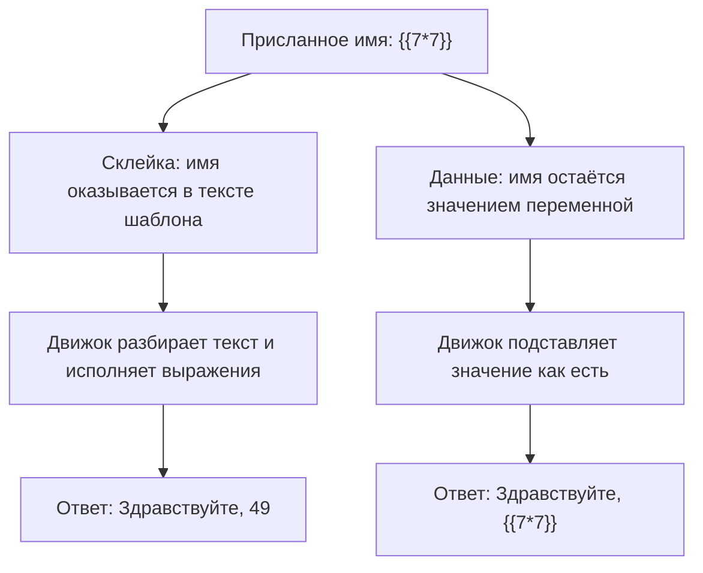

# SSTI: инъекции в шаблонизаторы

Представьте почтовую рассылку интернет-магазина. Менеджер один раз написал
заготовку письма — «Здравствуйте, » и пропуск для имени, — а программа перед
отправкой вписывает в пропуск имя каждого клиента. Таких заготовок в
приложении много: письма, страницы товаров, отчёты. Однажды покупатель
вписывает в поле имени не имя, а строку `{{7*7}}`. Адресат получает письмо
с текстом «Здравствуйте, 49»: кто-то за кулисами посчитал умножение.
Посчитал его движок шаблонов — та самая программа, что вписывает имена в
пропуски. Почему одну запись в поле имени он выводит как есть, а другую
исполняет, и чем это грозит серверу, — предмет этой темы.

**Ответы движка на два способа передать имя**

```text
Здравствуйте, 49
Здравствуйте, {{7*7}}
```

Обе строки прошли через один и тот же движок шаблонов — Jinja2 из мира
Python. Первая получилась, когда присланное имя склеили с текстом заготовки:
движок нашёл в ней своё выражение и посчитал `7*7`. Вторая — когда то же
имя передали отдельно, как данные: движок вывел его буквально. Между двумя
ответами — одна строка кода, и дальше разберём, что в ней решается.

## Как это работает

### Шаблон и данные

Заготовка письма из вступления называется шаблоном, а программа, которая
оживляет её значениями, — движком шаблонов, или шаблонизатором. Задача
шаблонизатора — отделить макет от данных. Текст письма хранится один раз и
не меняется от клиента к клиенту, а имена и суммы приходят отдельно и встают
в отмеченные места при отправке. Место для значения помечается особыми
знаками: в Jinja2 это двойные фигурные скобки, и запись `{{ name }}`
читается как «подставь сюда значение переменной name».

Момент подстановки называют отрисовкой: движок берёт текст шаблона и словарь
со значениями и выдаёт готовый текст. Бытовой пример — типовой бланк
заявления из отдела кадров. Текст бланка напечатан заранее, а фамилию и дату
каждый вписывает ручкой в пустые поля. Бланк здесь соответствует шаблону,
вписанные значения — данным, а сотрудник, переносящий их в чистовик, —
движку. Аналогия ломается в одном месте: сотрудник не станет выполнять то,
что вписано в поле «фамилия». Движок — станет, если запись окажется в тексте
самого бланка.

### Движок умеет считать

Фигурные скобки в Jinja2 — не только пропуск для значения. Движок умеет
исполнять то, что стоит внутри них, как выражение: посчитать `{{ 2 + 2 }}`,
вызвать метод объекта, пройти по полям записи. Это сделано нарочно: дату у
записи отформатировать прямо в шаблоне короче, чем выносить форматирование
в код. Цена у такой вычислительной силы одна. Всё, что оказалось в тексте
шаблона, движок считает своим и исполняет, а отличить «свою» запись от
присланной он не может: для него это один текст.

### Данные против шаблона

Разница между уязвимой и безопасной записью — в том, куда попадает
присланное. Небезопасно — имя склеено в текст шаблона (оба фрагмента
упрощены для примера):

```python
Environment().from_string("Здравствуйте, " + name).render()
```

Безопасно — имя передано данными, а текст шаблона постоянен:

```python
Environment().from_string("Здравствуйте, {{ name }}").render(name=name)
```

В первой записи присланное становится частью текста шаблона, и движок
разбирает в нём свой синтаксис: найдёт `{{7*7}}` — посчитает. Во второй
присланное — значение переменной `name`, а внутри значений движок свой
синтаксис не ищет, поэтому `{{7*7}}` выведется буквально. У дефекта из
первой записи есть имя: инъекция в шаблонизатор, по-английски server-side
template injection, сокращённо SSTI. Общая рамка инъекций, где присланные
данные исполняются как команды, разобрана в теме `os-command-injection`;
здесь интерпретатором выступает движок шаблонов.

Тот же ход с постоянным текстом и отдельными данными вы уже видели в
`parameterized-queries`: там так отделяли запрос к базе от значений. Смена
интерпретатора приёма не меняет.

**Откуда это взялось.** Шаблонизатор придумали, чтобы макет и данные жили
раздельно: верстальщик правит текст страницы, программист — подстановку
значений, и они не мешают друг другу. Пока шаблон постоянен, а данные
приходят отдельно, разделение держится. Сломалось оно тогда, когда текст
шаблона начали собирать из присланного: например, чтобы менеджер мог править
письмо прямо в настройках. Разработчик хотел подставить имя, а отдал движку
право исполнить всё, что тот умеет.

Два пути одного присланного имени — на схеме.



**Описание схемы.** Схема читается сверху вниз и показывает два пути одного
присланного имени. Левая ветка — склейка: имя попадает в текст шаблона,
движок разбирает его и исполняет выражение, поэтому ответ содержит `49`.
Правая ветка — передача данными: текст шаблона постоянен, имя подставляется
как значение, и в ответе остаётся `{{7*7}}` буквально.

### Почему исход тяжёлый

Движок шаблонов работает на сервере и видит объекты приложения: настройки,
подключения к базе, модули языка. Через выражение шаблона атакующий
добирается до методов этих объектов, а от них — до чтения файлов и запуска
команд операционной системы. Поэтому по оценке SSTI стоит рядом с инъекцией
команд из темы `os-command-injection`: это путь к выполнению кода на
сервере, а не только к искажению страницы. Web Security Academy называет
диапазон исхода — от чтения чужих файлов до полного контроля над сервером.

**Зачем это в работе AppSec-инженера.** Искать SSTI стоит там, где текст
шаблона строится из присланного: письма по макету из настроек, страницы из
пользовательской разметки, отчёты с настраиваемым макетом. Путь от находки
до выполнения кода у SSTI такой же прямой, как у инъекции команд, а рамка
источник — путь — сток уже знакома: меняется только интерпретатор. Ревьюеру
здесь хватает одного вопроса к каждому месту отрисовки: присланное попадает
в текст шаблона или только в его данные.

## Как это атакуют

### Проба

Уязвимое место подтверждают пробой — выражением, чей результат нельзя
спутать с обычным текстом. Для движков с фигурными скобками, Jinja2 и Twig,
классическая проба — `{{7*7}}`; движки с другой записью выражений проверяют
через `${7*7}`. Если в ответе вместо пробы стоит `49`, движок посчитал
выражение, значит, присланное попало в текст шаблона. Если ответ содержит
`{{7*7}}` буквально, присланное прошло как данные. Разница `49` против
`{{7*7}}` и отличает уязвимое место от безопасного.

Обе ветки прогнаны на Jinja2 3.1.6: строка `Здравствуйте, {{7*7}}`,
склеенная в шаблон, отрисовывается как `Здравствуйте, 49`, а переданная
данными остаётся `Здравствуйте, {{7*7}}`.

### Два контекста

Проба показывает и различие контекстов. В текстовом контексте присланное
попадает в шаблон целиком, и `{{7*7}}` срабатывает сразу. В контексте кода
присланное уже стоит внутри готового выражения шаблона, и сначала из него
нужно выйти синтаксисом самого движка. Разбор такого выхода остаётся за
пределами уровня темы. Здесь важен сам признак: если движок считает
присланное, место уязвимо, какой бы контекст ни был.

### Куда ведёт подтверждённая проба

Подтверждённая проба — начало пути, а не его конец. Дальше атакующий обходит
объекты, доступные шаблону, ищет среди них модули языка и через них выходит
к чтению файлов и запуску команд. Механика этого выхода та же, что в
`os-command-injection`: разница только в том, кто исполняет присланное.
Готового рецепта здесь нет по правилам гайдбука: вектор и механизм — да,
работающий эксплойт — нет. Для защиты важнее другое: дефект чинится не
подбором запретов под выражения, а перестановкой присланного на место
данных.

## Как это выглядит в коде

Ревьюер ищет место, где текст шаблона собран из присланной строки. Листинг
ниже разбирается двумя планами: найти, где присланное входит в текст
шаблона, и найти, где этот текст уходит в движок. До чтения выносок назовите
сами строку, в которой ввод получает права шаблона. Фрагмент упрощён для
примера.

```python
# УЯЗВИМО — демонстрация, не для продакшена
def greet(name):
    template = "Здравствуйте, " + name        # (1)
    return Environment().from_string(template).render()   # (2)
```

1. План «вход данных»: присланное `name` склеено в текст шаблона, и с этой
   строки ввод перестаёт быть данными.
2. План «вызов движка»: `from_string` разбирает весь текст целиком, включая
   присланное, и исполняет найденные в нём выражения.

Признак при ревью такой: присланное значение стоит внутри строки, которая
уходит в `from_string`, `render_template_string` или их аналог, а не в
аргументы отрисовки. Отдельный признак — приложение, которое даёт
пользователю править сам шаблон: это SSTI по замыслу, и вопрос лишь в том,
куда выпустят исполнение. А изменится ли ответ, если то же имя придёт не из
формы, а из записи в базе, которую завели неделю назад?

## Как защититься

Правило одно: ввод передаётся шаблону данными, а текст шаблона постоянен.
Исправленный листинг разбирается теми же двумя планами, и оба теперь ведут
мимо опасности: присланное входит в словарь данных, а в движок уходит
постоянный текст. Фрагмент упрощён для примера.

```python
# Исправлено.
def greet(name):
    template = "Здравствуйте, {{ name }}"      # (1)
    return Environment().from_string(template).render(name=name)   # (2)
```

1. План «вход данных»: текст шаблона постоянен, место для значения помечено
   `{{ name }}`, и присланное в текст не попадает.
2. План «вызов движка»: присланное едет аргументом `render` как данные, и
   движок не ищет в нём свой синтаксис.

Тот же приём на Twig, движке шаблонов из мира PHP:
`$twig->render("Здравствуйте, {{ name }}", ["name" => $name])` вместо
`$twig->render("Здравствуйте, " . $name)`. Инвариант один в любом движке:
текст шаблона задан заранее, а присланное — значение переменной.

Проверяется защита той же пробой, без чтения кода движка. После правки
отправьте в поле имени `{{7*7}}` повторно и сравните ответ с тем, что было
до неё. До правки ответ был «Здравствуйте, 49», после — «Здравствуйте,
{{7*7}}» буквально. Ответ совпал с присланным — значит, ввод больше не
получает прав шаблона.

**Границы применимости.** Если по требованию пользователь настраивает макет
сам, одной передачей данными не обойтись: макет и есть шаблон. Web Security
Academy называет для такого случая три меры. Первая — не давать
пользователям править или присылать шаблоны вовсе. Вторая, где без настройки
нельзя, — движок без выражений вроде Mustache: он умеет только подставлять
значения, поэтому исполнять в присланном нечего. Третья — исполнять
недоверенный шаблон в песочнице, изолированной среде с урезанными правами,
или в отдельном контейнере. Песочница при этом слой, а не гарантия: обходы
песочниц движков известны, и полагаться на неё одну нельзя.

## Частая ошибка

Решите до чтения дальше: все выводимые значения в приложении экранируются —
закрыта ли этим инъекция в шаблон? Отвечают «да» таким рассуждением: вывод
экранируется от XSS, значит, присланное обезврежено, и выражение не
исполнится.

Чтобы разобрать ответ, нужны два понятия из тем, которые в маршруте ещё
впереди. Межсайтовый скриптинг, сокращённо XSS, — дефект, при котором
присланная разметка исполняется в браузере другого пользователя: например,
вместо текста отзыва на странице окажется чужой скрипт. Экранирование вывода
— защита от него: перед показом страницы опасные знаки разметки в данных
заменяют безопасными записями, и браузер показывает их как текст, а не
исполняет. Оба понятия про браузер и про момент показа страницы.

**Экранирование вывода против XSS и защита от SSTI — разные вещи на разных
этапах.** SSTI срабатывает на сервере, когда движок разбирает шаблон, — до
того, как результат вообще уйдёт в браузер. Экранирование действует позже и
на другого потребителя: оно защищает браузер от разметки в данных, а не
сервер от выражения в шаблоне.

Контрпример. Приложение экранирует все выводимые значения и уверено в защите
от инъекций. Имя `{{7*7}}`, склеенное в шаблон, движок считает на сервере и
подставляет `49` ещё до экранирования. Экранировать к моменту вывода уже
нечего: выражение исполнено. Защита браузера не сработала, потому что дефект
был не в браузере.

## Чеклист для ревью

1. Проверьте, что присланные данные передаются шаблону аргументами отрисовки,
   а не склеиваются в текст шаблона.
2. Проверьте, что текст шаблона — постоянная строка, а не значение,
   собранное из ввода (WSTG-v42-INPV-18).
3. Проверьте, что пользователь не может править или присылать сам шаблон.
4. Проверьте, что там, где настройка макета неизбежна, применён движок без
   выражений или песочница, а не полный движок.
5. Проверьте, что защита от SSTI не сведена к экранированию вывода: оно
   работает против XSS в браузере и на сервере не действует.

## Попробуй сам

Возьмите движок шаблонов своего стека. Не атакуя чужую систему, отрисуйте
две строки: `"Здравствуйте, " + "{{7*7}}"` как текст шаблона и
`"Здравствуйте, {{ name }}"` с `name="{{7*7}}"` как данные. Запишите
результат каждой отрисовки и одним предложением объясните разницу.

Если ваш стек на Python, вот исполняемый пример на Jinja2 3.1.6. Сохраните
его как `probe_greet.py` и запустите:

```python
from jinja2 import Environment

name = "{{7*7}}"
tpl = "Здравствуйте, {{ name }}"
print(Environment().from_string("Здравствуйте, " + name).render())
print(Environment().from_string(tpl).render(name=name))
```

```bash
python3 probe_greet.py
```

**Вывод команды**

```text
Здравствуйте, 49
Здравствуйте, {{7*7}}
```

**Критерий выполнения** наблюдаемый: два результата, `Здравствуйте, 49` и
`Здравствуйте, {{7*7}}`. И одно предложение о том, почему в первом случае
движок посчитал выражение, а во втором — нет.

## Проверь себя

1. Письмо строится по макету, который пользователь правит в настройках:

   ```python
   def render_letter(user_tpl, user):
       return Environment().from_string(user_tpl).render(user=user)
   ```

   Пользователь сохранил макет `Итог: {{7*7}}`. Что получит адресат?

2. Функция `greet` из раздела «Как это выглядит в коде» склеивает имя в
   текст шаблона. Какая правка устраняет дефект?

   A. Экранировать все выводимые значения от XSS — тогда и выражение не
      исполнится.

   B. Сделать текст шаблона постоянным и передавать имя аргументом отрисовки.

   C. Запретить в имени фигурные скобки.

3. Почему исход SSTI сравним с инъекцией команд по тяжести?

4. Предскажите, что напечатают две отрисовки.

   ```python
   from jinja2 import Environment
   print(Environment().from_string('Итог: {{7*7}}').render())
   print(Environment().from_string('Итог: {{ name }}').render(name='{{7*7}}'))
   ```

5. Возврат к теме `os-command-injection`: что общего у SSTI и инъекции
   команд в рамке источник — путь — сток — отсутствующий контроль?

<details markdown="1">
<summary>Ответ 1</summary>

1. Адресат получит «Итог: 49»: движок исполнил выражение в присланном
   макете. Место уязвимо полностью: макет здесь — текст шаблона, и из
   `{{7*7}}` путь идёт дальше, к чтению файлов и выполнению кода. Передача
   `user` данными не спасает: уязвим не аргумент отрисовки, а сам текст
   макета, который целиком ушёл в `from_string`.

</details>

<details markdown="1">
<summary>Ответ 2: разбор вариантов</summary>

2. Верно: B.

   A. Неверно. Экранирование вывода действует позже и на браузера: SSTI
      срабатывает на сервере при разборе шаблона, и к моменту вывода
      выражение уже посчитано — экранировать нечего.

   B. Верно. Текст шаблона задан заранее, присланное едет как значение
      переменной: движок не ищет в нём свой синтаксис, и `{{7*7}}` в имени
      выведется буквально.

   C. Неверно. Запрет знаков ломает законные имена и закрывает одну запись
      пробы. У движка есть и другие формы выражений, а в контексте кода
      выход из выражения делается синтаксисом самого движка.

</details>

<details markdown="1">
<summary>Ответ 3</summary>

3. Движок исполняется на сервере и имеет доступ к объектам приложения.
   Через выражение шаблона добираются до методов и модулей, а от них — до
   чтения файлов и запуска команд. Это тот же исход, что у инъекции команд:
   выполнение кода на сервере, а не только искажение страницы.

</details>

<details markdown="1">
<summary>Ответ 4</summary>

4. `Итог: 49` и `Итог: {{7*7}}`: в первой строке выражение — часть текста
   шаблона и посчитано, во второй присланное — данные и выведено буквально.
   Прогон: фрагмент из вопроса, сохранённый как `probe.py`, —
   `.venv-site/bin/python probe.py` (Jinja2 3.1.6).

</details>

<details markdown="1">
<summary>Ответ 5</summary>

5. Источник — присланное значение, путь — построение шаблона, сток —
   отрисовка движком, отсутствующий контроль — разделение данных и шаблона.
   Меняется только интерпретатор: оболочка у команд, движок шаблонов у SSTI.

</details>

## Источники

1. PortSwigger Web Security Academy, «Server-side template injection»; реестр
   `ps-ssti`. Разделы: What is SSTI, Constructing an attack, Detect (plaintext
   and code contexts), How to prevent server-side template injection
   vulnerabilities.
   <https://portswigger.net/web-security/server-side-template-injection>
2. OWASP Top 10:2025, «A05:2025 Injection»; реестр `owasp-top10-2025-a05`.
   Разделы: Description, How to Prevent.
   <https://owasp.org/Top10/2025/A05_2025-Injection/>

Каркас этапа: `owasp-asvs-5-document` (ASVS v5.0.0), `owasp-wstg-42`,
`owasp-top10-2025`. Наследуются всеми темами и отдельной строкой не
повторяются.

**Скоропортящийся слой.** Синтаксис пробы привязан к движку: `{{7*7}}` в
Jinja2 и Twig, `${7*7}` в других. Обходы песочниц движков закрываются
версиями. Страница Web Security Academy — живая площадка без даты
публикации.

**Маркеры уверенности.** Проба и разница результата между склейкой и
передачей данными — **проверено лично** 2026-08-24 на Jinja2 3.1.6 и
повторено при переписывании 2026-10-03 на той же версии: строка
`Здравствуйте, {{7*7}}`, склеенная в шаблон, отрисовывается как
`Здравствуйте, 49`, а переданная данными остаётся `Здравствуйте, {{7*7}}`.
Диапазон исхода, пробы для контекста кода и меры защиты (движки без
выражений, песочница) — **по документации** (Web Security Academy и
A05:2025, открыты лично 2026-08-24). Выход из выражения в контексте кода и
путь до выполнения команд лично **не воспроизводились**: разбор эксплуатации
за пределами уровня, стенда с целевым приложением не собиралось. Листинг на
Twig **не запускался**: стенда под PHP не собиралось.
