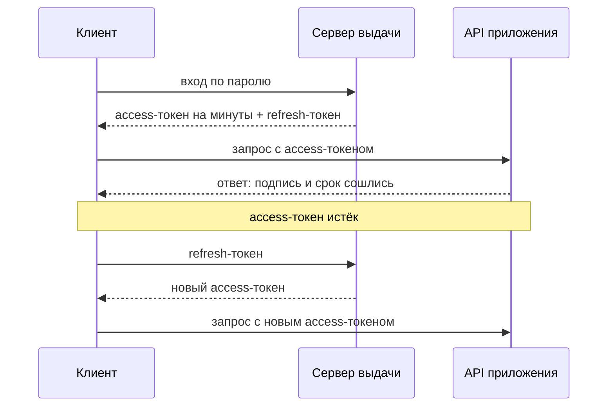
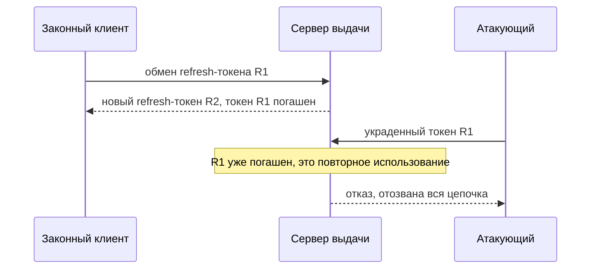

# Сроки жизни, refresh-токены, отзыв

Проделайте небольшой опыт с любым приложением, которое выдаёт JWT. Войдите
в аккаунт, скопируйте выданный токен, нажмите «выйти» и предъявите копию
защищённой странице. У многих приложений страница откроется, хотя вы только
что вышли. Причина видна в обработчике выхода, и выглядит он так:

```python
# Фрагмент. УЯЗВИМО — демонстрация, не для продакшена
def logout(session):
    response.delete_cookie("access_token")   # стёрли только у клиента
    return "вы вышли"
```

Cookie у клиента стёрта, а на сервере не произошло ничего. Самодостаточный
токен, чьё устройство разбирает тема `jwt-basics`, проверяется подписью,
записи о нём нет, и копия годна, пока не истёк срок из поля `exp`. Копии при
этом лежат в журналах прокси, в истории браузера, на старом телефоне. Тема —
о том, как в конструкцию без серверной записи всё-таки возвращают кнопку
«погасить».

## Как это работает

### Отзыв — кнопка «погасить», которой у токена нет

Выход из аккаунта, смена пароля, отключение мошенника — во всех трёх случаях
нужно одно и то же. Надо, чтобы уже выданный токен перестал работать сразу,
не дожидаясь конца своего срока. Это действие и называется отзывом. Бытовой
пример — банковская карта. Срок годности напечатан на ней, но украденную
карту блокируют по звонку, не дожидаясь даты на пластике. Блокировка
работает, потому что терминал спрашивает о карте банк, а у банка есть список.
Граница аналогии: терминал спрашивает банк о каждой карте всегда, а токен
обычно проверяется офлайн, одной подписью. Поэтому список для токена
приходится строить отдельно, и дальше видно как.

Со ссылочной сессией из темы `sessions-vs-tokens` отзыв устроен как у банка:
сервер стирает запись, и предъявленный идентификатор больше ни на что не
указывает. С самодостаточным токеном так не выходит. Он проверяется подписью
и сроком, записи о нём сервер не держит, а значит, и удалять нечего. Расплата
видна в опыте из вступления: «выйти» нажали, а копия токена работает.

**Откуда это взялось.** Хранилище сессий убрали нарочно: сервер не ходит
в базу на каждый запрос, и проверка токена не зависит от её доступности.
Тема `sessions-vs-tokens` формулирует плату за это так: сервер, который
ничего не хранит, ничего и не забывает. Вместе с хранилищем исчезла и точка
контроля, где сессия завершалась одним действием. Поэтому отзыв для такого
токена собирают отдельными средствами, и дальше — о том, из каких именно.

### Срок жизни — единственный встроенный предел

У токена есть один встроенный ограничитель, поле `exp` из темы `jwt-basics`:
в нём записан момент, после которого токен недействителен. Проверка срока не
требует памяти о токене: сервер сравнивает `exp` с текущим временем. Отсюда
прямое следствие: чем короче срок, тем меньше окно, в котором работает
украденная копия.

Почему же не выдавать токен на минуту? Потому что по истечении срока
приложение выгоняет человека на повторный вход. Срок в минуты означал бы
пароль каждые несколько минут, и люди отвечают на это паролем в заметке рядом
с монитором. Нужен способ держать токен коротким и при этом не дёргать
пользователя.

### Два токена вместо одного

Способ — разделить доступ на два токена с разной работой. Access-токен, токен
доступа, предъявляется на каждый запрос и живёт минуты. Refresh-токен, токен
обновления, живёт дни или недели и служит одному делу. Когда access-токен
истёк, клиент предъявляет refresh-токен серверу выдачи и получает новый
access-токен. Пароль при этом никто не вводит.

Бытовой пример — бюро пропусков. Access-токен — дневной пропуск: его
предъявляют на каждом входе, а вечером он мёртв. Refresh-токен — документ,
по которому бюро каждое утро выписывает новый дневной пропуск. Документ лежит
дома, а не ходит с вами по этажам: потерять дневной пропуск не страшно,
потерять документ — страшно. Граница аналогии: документ в бюро предъявляют
лично, а refresh-токен можно скопировать незаметно, — и это впереди ещё
сыграет.

Сервер выдачи и API приложения, которые дальше встретятся на схеме, — роли,
а не обязательно две машины: в маленьком приложении обе исполняет один
сервер. Разделяют их потому, что выдача трогает пароль и хранилище
refresh-токенов, а API только проверяет подпись.



**Описание схемы.** Схема читается сверху вниз. Клиент входит по паролю и
получает от сервера выдачи сразу два токена. Дальше access-токен идёт
в приложение с каждым запросом, пока не истечёт. Тогда клиент один раз ходит
на сервер выдачи с refresh-токеном, получает новый access-токен и продолжает
работу.

Придумана пара в OAuth, протоколе, где приложению дают доступ к вашему
аккаунту, не сообщая ему пароль; сам протокол разбирает тема `oauth-basics`.
Смысл пары прямо формулирует свод предписаний для OAuth, RFC 9700 «Best
Current Practice for OAuth 2.0 Security». По нему refresh-токен позволяет
выдавать access-токены с коротким сроком и суженной областью, то есть набором
разрешённых действий, снижая цену их утечки.

Посмотрите на адресаты в схеме. Access-токен показывается на каждом запросе,
поэтому встречается всюду: в журналах, на прокси, в трассировке. Refresh-токен
ходит по одному адресу и редко. В этом и снижение цены утечки: токен, который
светится на каждом запросе, живёт минуты, а долгоживущий почти не покидает
клиента.

### Цена сместилась на refresh-токен

Теперь привлекательная цель — refresh-токен, потому что он живёт долго и
представляет весь выданный доступ. Украденный access-токен работает минуты.
Украденный refresh-токен работает неделями, и атакующий выпускает себе
access-токены сам, без пароля. RFC 9700 отвечает на это двумя мерами и
требует применить хотя бы одну.

- **Привязка к клиенту, sender-constrained.** Refresh-токен криптографически
  связывают с конкретным клиентом, например с ключом, который тот предъявляет
  при каждом обмене. Перехваченный токен у чужого не сработает. Бытовой
  пример — пропуск с фотографией: украденная карточка не пускает постороннего.
  Граница: фотографию проверяет человек и ошибается, а привязку проверяет
  криптография.
- **Ротация.** На каждый обмен сервер выдаёт новый refresh-токен, а прежний
  гасит. Старый токен становится одноразовым: использовать его дважды нельзя.

Ротация не мешает утечке, но делает её заметной и обрывает. Если токен утёк,
им пользуются двое, атакующий и законный клиент, и один из них предъявит уже
погашенный токен. Сервер увидит повтор и отзовёт всю цепочку: и токен
атакующего, и текущий токен клиента. Платой служит то, что законный клиент
при повторе вылетает на повторный вход. Срабатывание ротации на утечке
выглядит так:



**Описание схемы.** Схема читается сверху вниз. Законный клиент обменял токен
R1 и получил R2, а R1 погашен. Атакующий предъявляет украденный R1 и получает
отказ: сервер видит повторное использование и отзывает всю цепочку выданных
токенов.

### Как погасить уже выданное

Срок и пара токенов закрывают будущее, но не отвечают на требование «погасить
немедленно»: последний выданный access-токен доживёт свой срок. Для такого
отзыва памятка OWASP по JWT, второй источник темы, перечисляет три приёма.

1. **Список завершённых токенов, denylist.** Сервер заводит список погашенных
   досрочно и сверяет с ним входящие токены. Аналог — стоп-лист украденных
   карт: он существует только для отказа. Сервер снова начинает помнить,
   но только об отозванных, а не обо всех: записей мало, и живут они недолго.
2. **Список статусов, Token Status List.** Компактная сводка состояния
   токенов, которую проверяющий подтягивает по ссылке из самого токена.
   Подходит системам, где токен проверяют многие стороны, а не один сервер.
3. **Короткий `exp` в паре с ротацией ключа подписи.** Сменил ключ — все
   токены со старой подписью разом перестали быть валидными. Бытовой пример —
   смена печати организации: документы со старым оттиском перестают принимать.
   Граница: печать одна на организацию, поэтому мера гасит вообще все выданные
   токены, а не один аккаунт.

Оговорка про ключ списка. Ключом записи служат `iss`, издатель токена, и
`jti`, его идентификатор из темы `jwt-basics`, — а не сам токен и не его хеш.
Памятка объясняет почему. Подпись ECDSA, которая стоит за алгоритмом `ES256`
из той же темы, при том же смысле записывается по-разному, и разбор токена
терпит разную запись. От другой записи меняется хеш, а `iss` с `jti` остаются
теми же. Поэтому токен обходит список по хешу, оставаясь тем же по смыслу.

**Зачем это в работе AppSec-инженера.** К любому механизму на самодостаточных
токенах ревью задаёт короткий вопрос: что происходит с выданным токеном при
выходе и при смене пароля. Ответ «ничего до истечения `exp`» — найденная дыра
в отзыве. Собрать ответ помогают три меры этой темы, а показать дыру на
практике — задача в конце.

## Как это выглядит в коде

Дефект узнаётся по тому, что выход и смена пароля не трогают выданные токены.
Форма такого выхода — в листинге, которым открывается тема: cookie у клиента
стёрта, а сервер молчит. Отдельно стоит посмотреть, какой срок сервер ставит
токену при выдаче.

Признаков три. Первый: выход лишь стирает cookie у клиента и ничего не
отзывает на сервере. Второй: access-токен живёт часами или сутками, и длинное
окно заменяет отзыв. Третий: после смены пароля прежние токены продолжают
проверяться. Каждый признак оставляет украденную или забытую копию в силе.

Встречается и обратный перекос: сервер заводит запись по каждому активному
токену и проверяет её на каждый запрос. Так он стирает главный смысл
самодостаточного формата, получив хранилище сессий обходным путём. Отзыв
держат на исключениях, а не на всём потоке.

## Как защититься

Правило сборки короткое: access-токен короткий, тяжёлые события отзывают
выданное, а проверка отзыва стоит на исключениях. Исправленный вариант
читается тремя планами: что делает выход, что делает смена пароля и почему
список отзыва не разрастается.

```python
# Фрагмент. Исправленный вариант: короткий access, отзыв по событию.
def logout(session):
    deny_list.add(session["jti"], expires_at=session["exp"])  # (1)
    response.delete_cookie("access_token")
    return "вы вышли"

def on_password_change(user):
    user.token_epoch += 1        # (2) токены старше эпохи недействительны
```

1. Выход заносит `jti` токена в список завершённых до его собственного
   истечения. Держать запись дольше `exp` незачем: после истечения токен мёртв
   и без списка. Отсюда и второй довод за короткий срок: чем меньше `exp`,
   тем меньше список.
2. Смена пароля двигает «эпоху» пользователя, счётчик, который сервер хранит
   по одному на аккаунт. Токен несёт эпоху своей выдачи, и токен старше
   текущей отвергается без поимённого списка. RFC 9700 прямо разрешает
   отзывать refresh-токены при смене пароля и выходе.

Бытовой пример эпохи — смена замка в подъезде: старые ключи не подходят, и
вести список бывших жильцов не нужно. Граница: замок меняют для всего
подъезда разом, а эпоха двигается по одному аккаунту, остальные пользователи
не затронуты.

**Границы применимости.** Список завершённых возвращает серверу состояние:
он тем меньше, чем короче `exp`. Привязка refresh-токена к клиенту требует
поддержки на обеих сторонах; там, где её нет, остаётся ротация. Ротация
обрывает и легитимную сессию, если два устройства делят один refresh-токен,
поэтому у каждого устройства он должен быть свой. У всех трёх мер есть своя
цена.

Как убедиться, что починка сработала, показывает задача в конце темы: это
тот же опыт из вступления, повторённый после исправления.

## Частая ошибка

Решите до чтения ответа: в приложении есть refresh-токен. Что происходит
с последним выданным access-токеном в момент выхода?

Расхожее представление: refresh-токен решает проблему отзыва, и раз он есть,
сессию можно завершить в любой момент.

Оно неверно, потому что refresh-токен управляет продлением, а не отзывом уже
выданного access-токена. Пока короткий access-токен не истёк, он годен
независимо от судьбы refresh-токена: сервер не сверяет его с хранилищем.
Отзыв «немедленно» дают короткий срок и отзыв на событии, а не наличие
refresh-токена. Refresh добавляет одно: при следующем продлении новый
access-токен не выдадут. Разница видна в окне между кражей и истечением:
закрывает его короткий `exp`, а не сам факт, что refresh-токен существует.

## Чеклист для ревью

1. Проверьте, что access-токен на самодостаточном формате живёт минуты, а не
   часы (ASVS v5.0-7.3.2).
2. Проверьте, что выход отзывает выданные токены на сервере, а не только
   стирает cookie у клиента (WSTG-v42-SESS-06).
3. Проверьте, что смена пароля делает прежние токены недействительными.
4. Проверьте, что refresh-токен привязан к клиенту или ротируется при каждом
   обмене.
5. Проверьте, что ключом списка отзыва служат `iss` и `jti`, а не сам токен
   или его хеш.
6. Проверьте, что список отзыва держится на исключениях, а не проверяется по
   каждому активному токену на каждый запрос.

## Попробуй сам

Возьмите приложение на самодостаточных токенах, с которым работаете. Войдите,
скопируйте access-токен, затем выйдите и предъявите скопированное значение
защищённой странице. Отдельно смените пароль и повторите предъявление
токеном, выданным до смены.

Если копия сработала после выхода, дефект воспроизведён. Примените починку
из раздела «Как защититься» и повторите опыт: теперь копия обязана получить
отказ, а после смены пароля — и токен прошлой эпохи.

**Наблюдаемый критерий:** ответ приложения на предъявление токена после
выхода и после смены пароля, плюс значение `exp` выданного токена. Вывод из
наблюдения двойной: гасится ли выданный токен на сервере и насколько велико
окно до его истечения.

## Проверь себя

1. Из access-токена взята средняя часть:

   ```text
   eyJzdWIiOiJhbm5hIiwiZXhwIjoxNzAwMDAwMDAwfQ
   ```

   Что в ней записано и что ответит сервер на предъявление этого токена
   сегодня?

2. Выход в приложении на самодостаточных токенах устроен как во вступлении:
   стирается cookie у клиента. Какая правка устраняет дефект?

   A. Сократить срок access-токена до минуты: утечка перестанет быть опасной.

   B. Заносить `jti` в список завершённых до истечения `exp`, а смену пароля
      вести через эпоху пользователя.

   C. Завести refresh-токен — тогда сессию можно будет завершить в любой
      момент.

3. Почему ключом списка отзыва берут `jti`, а не хеш токена?

4. Предскажите, что напечатает эта модель окна жизни токена.

   ```python
   issued = 1_700_000_000          # момент выдачи
   exp = issued + 60               # минута жизни
   ok = lambda now: now <= exp     # записи на сервере нет
   print(ok(issued + 30), ok(issued + 90))
   ```

5. Возврат к теме `sessions-vs-tokens`: чем отзыв ссылочного токена проще
   отзыва самодостаточного?
6. Возврат к теме `jwt-basics`: какое поле токена служит единственным
   встроенным пределом его жизни и почему его проверка не требует памяти?

<details markdown="1">
<summary>Ответ 1</summary>

1. В полезной части `{'sub': 'anna', 'exp': 1700000000}` — момент истечения
   приходится на ноябрь 2023 года. Сервер сравнит `exp` с текущим временем и
   откажет: памяти о токене для этого не нужно. Прогон:
   `python3 -c "import base64,json; print(json.loads(base64.urlsafe_b64decode('eyJzdWIiOiJhbm5hIiwiZXhwIjoxNzAwMDAwMDAwfQ'+'==')))"`.

</details>

<details markdown="1">
<summary>Ответ 2: разбор вариантов</summary>

2. Верно: B.

   A. Неверно как ответ на выход. Короткий срок сужает окно утечки, но до
      истечения скопированный токен годен: срок — предел будущего, а не отзыв
      выданного.

   B. Верно. Выход заносит `jti` в список до его собственного истечения, а
      смена пароля двигает эпоху пользователя: токены старше неё отвергаются
      без поимённого списка.

   C. Неверно. Refresh-токен управляет продлением, а не отзывом уже выданного:
      пока access-токен не истёк, он годен независимо от судьбы refresh-токена.
      Это ловушка темы.

</details>

<details markdown="1">
<summary>Ответ 3</summary>

3. По хешу токен обходит список за счёт податливости разбора и подписи ECDSA,
   оставаясь тем же по смыслу; `jti` идентифицирует токен независимо от его
   двоичной формы.

</details>

<details markdown="1">
<summary>Ответ 4</summary>

4. `True False`: внутри минуты копия годна, после — нет, и решает это только
   `exp`. Прогон фрагмента, сохранённого в файл `probe.py`:

   ```bash
   python3 probe.py
   ```

   ```text
   True False
   ```

</details>

<details markdown="1">
<summary>Ответ 5</summary>

5. Ссылочный токен гасится удалением серверной записи, на которую он
   указывает; самодостаточный указывать не на что, и отзыв приходится
   собирать отдельно.

</details>

<details markdown="1">
<summary>Ответ 6</summary>

6. Поле `exp`: сервер сравнивает его с текущим временем, и памяти о токене
   для этого не нужно.

</details>

## Источники

1. RFC 9700, «Best Current Practice for OAuth 2.0 Security»; реестр
   `rfc9700-oauth-bcp`. Разделы: 2.2.2 Refresh Tokens, 4.14 Refresh Token
   Protection (Discussion, Recommendations — привязка, ротация, отзыв при смене
   пароля и выходе, истечение по бездействию).
   <https://www.rfc-editor.org/rfc/rfc9700.html>
2. OWASP JSON Web Token Cheat Sheet; реестр `owasp-cs-jwt`. Разделы:
   Considerations about using JWTs, JWT revocation (Token Status List), Replay
   protection (JWT denylist, предупреждение о ключе по хешу).
   <https://cheatsheetseries.owasp.org/cheatsheets/JSON_Web_Token_Cheat_Sheet.html>
3. OWASP WSTG «Testing for Session Timeout», WSTG v4.2; реестр
   `wstg-v42-sess-07-session-timeout`. Разделы: Summary, Test Objectives, How to
   Test.
   <https://owasp.org/www-project-web-security-testing-guide/v42/4-Web_Application_Security_Testing/06-Session_Management_Testing/07-Testing_Session_Timeout>

Каркас этапа: `owasp-asvs-5-document` (ASVS v5.0.0), `owasp-wstg-42`,
`owasp-top10-2025`. Наследуются всеми темами и отдельной строкой не
повторяются.

**Скоропортящийся слой.** Механизмы отзыва развиваются: оформление
Token Status List меняется вместе со спецификацией.
Конкретные величины сроков — вопрос политики приложения, а не норматива.

**Маркеры уверенности.** Все утверждения темы — **по документации**, лично
открытой 2026-08-24: невозможность отзыва самодостаточного токена удалением,
роль `exp`, схема пары access и refresh, привязка и ротация refresh-токена,
отзыв при смене пароля и выходе — по RFC 9700 (§ 2.2.2 и § 4.14); denylist по
`jti`, список статусов и предупреждение о ключе по хешу — по JSON Web Token
Cheat Sheet; проверка таймаута — по WSTG. Локальные стенды в этой теме
**не ставились**: предмет — проектные решения и предписания, а не поведение
конкретной библиотеки; листинги показывают форму дефекта и форму починки,
а не прогон.
