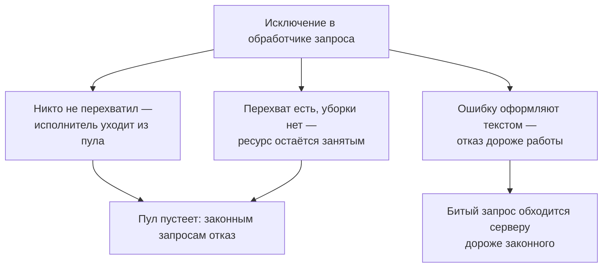
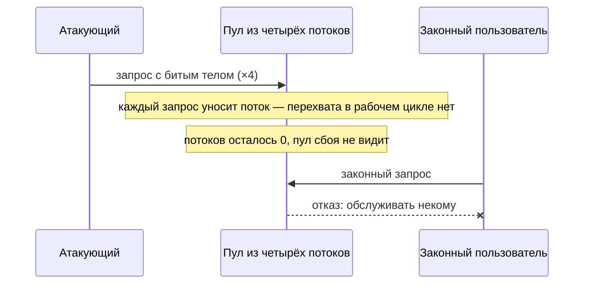

# Необработанные исключения как вектор DoS

Представьте стенд: приложение принимает запросы, и каждый обслуживает
поток из пула. Пул — это заранее созданный набор исполнителей: держать
их наготове дешевле, чем создавать новый поток на каждый запрос. На стенд
приходят сорок законных запросов и четыре отравленных — с телом, на
котором разбор падает с исключением. Перехвата исключений в обработчике
нет. Каждый отравленный запрос уносит один поток: исключение доходит до
верха рабочего цикла, и среда исполнения завершает поток целиком. Через
четыре таких запроса пул пуст, и сорока законным запросам отвечать
некому.

```text
обработчик      отравленные  потоков цело  обслужено
без try/except  первыми             0         0 из 40
с try/except    первыми             4        40 из 40
```

Сервис при этом жив: процесс работает, порт отвечает, а обслуживания нет.
Такое состояние называют отказом в обслуживании (denial of service, DoS):
законные пользователи не получают ответа, потому что ресурсы обслуживания
кончились. Это как смена в колл-центре, где оператор, не понявший звонок,
уходит домой, а в журнале звонок числится завершённым. Оператор здесь —
поток, непонятный звонок — отравленный запрос, а журнал — учёт пула, где
сбой и завершение выглядят одинаково. Аналогия ломается на надзоре: за
сменой следит начальник, а за пулом потоков по умолчанию не следит никто.

DoS-атаку обычно представляют лавиной трафика, которую отсекают на границе
сети. Здесь объёма нет: четыре запроса по частоте неотличимы от работы, и
на графиках такой отказ не виден. Тема `fail-open-vs-fail-closed`
разбирала неверное решение при отказе. Здесь решения нет вовсе: исключение
уходит выше обработчика, и распоряжается им уже среда исполнения.

## Как это работает

Одно исключение в обработчике запроса превращается в отказ тремя разными
путями, и у каждого свой дефект в коде. Первый — гибель исполнителя,
которую пул не замечает. Второй — ресурс, оставшийся занятым, потому что
строка освобождения не выполнилась. Третий — путь ошибки, который
обходится в десятки раз дороже рабочего пути.



**Описание схемы.** Схема читается сверху вниз. Одно исключение ведёт
тремя ветками в зависимости от того, что с ним сделал код. Если перехвата
нет совсем, исполнитель гибнет. Если перехват есть, а уборки нет, ресурс
остаётся занятым. Если ошибку ещё и оформляют текстом, отказ становится
дороже обслуживания. Первые две ветки кончаются пустым пулом, третья —
тем, что битый запрос стоит серверу дороже законного.

**Откуда это взялось.** Пулы исполнителей появились ради экономии:
создавать поток на каждый запрос дорого, поэтому их создают заранее и
переиспользуют. Экономия оплачивается допущением — исполнитель считается
вечным. Пока каждая задача завершается, допущение верно. Исключение,
дошедшее до тела рабочего цикла, его нарушает, и пул тихо уменьшается.
Каталог слабостей держит для общего случая CWE-755, «исключительная
ситуация обработана неверно», а для неперехваченного исключения — отдельный
номер CWE-248: оно роняет программу или раскрывает лишнее.

### Исполнитель уходит и не возвращается

Поток в пуле крутит рабочий цикл: взять задачу из очереди, обработать,
взять следующую. Если исключение из задачи никто не перехватил внутри
цикла, завершается не задача, а сам поток. Пул об этом не узнаёт: с его
точки зрения задача закончилась, а чем именно — он не различает.

Стенд гоняет через пул из четырёх потоков сорок законных запросов и четыре
отравленных, ломающих разбор.

```text
$ python e05-worker-crash.py
потоков в пуле 4, законных запросов 40, отравленных 4

обработчик      отравленные  потоков цело  обслужено
без try/except  первыми             0         0 из 40
без try/except  вразбивку           0         8 из 40
с try/except    первыми             4        40 из 40
с try/except    вразбивку           4        40 из 40
```

Четыре запроса против четырёх потоков: пул кончился, и законные запросы
остались без обслуживания. Порядок влияет только на то, сколько успели
сделать до конца: если отравленные идут первыми, не обслужен ни один из
сорока. Существенно другое — восстановления нет. Пул не поднимет потоки
обратно, потому что с его точки зрения ничего не сломалось: задача
завершилась, восстанавливать нечего.

Этот стенд — иллюстрация общего устройства дефекта: среда не умеет
отличить сбой от завершения, поэтому отличать их обязан код внутри
рабочего цикла. Найдите в своём проекте рабочий цикл без перехвата и
прикиньте, сколько отравленных запросов ему хватит.

### Ресурс остаётся занятым

Второй механизм не требует гибели исполнителя. Обработчик захватывает
ресурс — соединение с базой из пула соединений, файловый дескриптор (номер,
под которым операционная система ведёт открытый файл), блокировку — и
отпускает его последней строкой. Исключение ломает поток управления, и до
освобождения дело не доходит. Отдельный номер каталога, CWE-460, описывает
ровно это: код не убирает за собой при брошенном исключении.

```text
$ python e06-resource-leak.py
размер пула 5, битых запросов подряд, затем один законный

обработчик  битых до отказа  свободно в пуле  законный запрос
leaky                   5                0    503 пул пуст
finally                50                5    прошёл
```

Пять битых запросов исчерпали пул из пяти соединений, и следующий законный
запрос получил отказ 503. Строка возврата соединения в обработчике стояла
последней и не выполнилась ни разу. Вариант с `finally` пережил пятьдесят
таких запросов, не потеряв ни одного соединения. Заметить разницу тестами
трудно: рабочий путь у обоих обработчиков одинаков, а расходятся они
только на сбое.

### Цена пути ошибки

Третий механизм не ломает ничего — он делает отказ дороже работы. Cheat
Sheet по отказам в обслуживании ставит это правилом проектирования:
сначала дешёвые проверки, дорогие после них. Стенд меряет, во что
обходится один запрос, если исключение не только поймано, но и оформлено в
текст.

```text
$ python e07-cost-asymmetry.py
вложенность JSON 60, повторов 2000, Python 3.14.7

путь                        мкс на запрос  во сколько раз
разбор удался                   4.40            1.00
исключение поймано              5.38            1.22
исключение + текст            141.60           32.08
```

Само исключение почти бесплатно — четверть сверх рабочего пути. Дорого
стоит построение текста: сбор трассировки в строку обошёлся в 32 раза
дороже успешного разбора. Трассировка — это текст с цепочкой вызовов от
места броска до места перехвата, и чтобы собрать её, среда обходит весь
стек. Приложение, которое форматирует и пишет полный текст на каждую
ошибку, отдаёт атакующему рычаг. Тот шлёт заведомо битые запросы, самые
дешёвые для себя, и получает многократный расход на стороне сервера.

Кому какой текст ошибки нужен, разбирает тема `error-message-leaks`:
подробная трассировка идёт в журнал, а не клиенту. Здесь добавляется
вторая причина того же правила: полный текст не только лишнее раскрытие,
но и заметный расход на каждый битый запрос.

**Зачем это в работе AppSec-инженера.** Руководство по тестированию
называет такой отказ прямо: систему роняют двумя способами. Первый —
довести её до взаимной блокировки, состояния, где два исполнителя вечно
ждут друг друга. Второй — до необработанного исключения, которое посылает
сигнал среде исполнения. В
отличие от нагрузочных атак, здесь нет объёма, по которому дефект видно на
графиках: десяток запросов с одинаковым битым полем неотличим от ошибки
клиента. На ревью это вопрос к каждому обработчику: что случится с
исполнителем, если эта строка бросит исключение.

## Как это атакуют

Атакующему не нужны ни объём, ни доступ внутрь — нужен вход, который
приложение разбирает. Порядок такой. Сначала он находит точку разбора:
тело JSON, параметр запроса, загружаемый файл. Затем подбирает ввод, на
котором разбор падает. Руководство по тестированию называет конкретные
приёмы: оборвать JSON посередине, подставить длинный текст на место
короткого, вставить недопустимые символы. Остаётся повторить запрос
столько раз, сколько в пуле исполнителей или соединений — смотря какой из
трёх механизмов сработал.



**Описание схемы.** Схема читается сверху вниз и показывает прогон стенда
с точки зрения участников. Атакующий отправляет четыре запроса с битым
телом, и каждый уносит один поток пула, потому что перехвата в рабочем
цикле нет. Пул остаётся пустым и не считает случившееся сбоем. Законный
пользователь приходит после и получает отказ: обслужить его запрос уже
некому.

Третий механизм атакуют иначе: повторять не обязательно, потому что каждый
битый запрос сам по себе обходится серверу в разы дороже законного.
Поток таких запросов выжигает процессорное время на оформление ошибок,
и обслуживание законных запросов дорожает, хотя ничего не сломано. Все
эти приёмы проверяются на собственном стенде, а не на чужой системе.

## Как это выглядит в коде

Первый признак — тело рабочего цикла без перехвата. Назовите сами, через
какую строку исключение покинет поток, до чтения выноски.

```python
# УЯЗВИМО — демонстрация, не для продакшена
def worker(queue):
    while True:
        task = queue.get()
        handle(task)          # (1) исключение выходит из while и из потока
```

1. Цикл не переживёт первого исключения: `while` останется позади.

Второй признак — освобождение ресурса последней строкой; найдите в этом
фрагменте место сбоя и строку, которая из-за него не выполнится.

```python
# УЯЗВИМО — демонстрация, не для продакшена
conn = pool.acquire()
data = json.loads(body)       # (2) сюда приходит битое тело
result = do_work(conn, data)
pool.release(conn)            # (3) при исключении не выполняется
```

2. Разбор присланного — самое вероятное место сбоя, и оно стоит после
   захвата.
3. Правится переносом в `finally` или в контекстный менеджер.

Третий признак — работа, размер которой задаёт присланное: разбор без
ограничения глубины и длины, цикл по числу из тела запроса, выделение
буфера по заявленному размеру. Cheat Sheet называет это отдельными
правилами: не выделять ресурсы по вводу и не давать вводу управлять числом
вызовов.

Ложное срабатывание частое, и признак законности один: перехват на границе
исполнителя обязан быть широким, а внутри обработчика — узким.
`except Exception` в теле цикла рабочего потока законен и нужен; тот же
перехват вокруг проверки прав — дефект из темы `fail-open-vs-fail-closed`.
Различает их не ширина, а то, что стоит следом: запись в журнал и переход
к следующей задаче против возврата разрешения.

## Как защититься

Трём механизмам отвечают три приёма, и ещё два работают для всех сразу.
Разберём каждый: что он делает, где стоит и почему устроен именно так.

Первый приём — перехват на границе исполнителя. Тело рабочего цикла,
обработчик очереди, точка входа задачи планировщика — там перехват
широкий, с записью в журнал и продолжением цикла. Исправление первого
листинга занимает три строки:

```python
# Исправленный вариант — демонстрация, не для продакшена
def worker(queue):
    while True:
        task = queue.get()
        try:
            handle(task)
        except Exception:
            log.exception("задача отклонена")  # (1)
```

1. Перехват стоит внутри цикла, на границе одной задачи. Исключение
   больше не выходит из `while`, поток живёт и берёт следующую задачу, а
   запись в журнал сохраняет подробности для разбора.

Второй приём — обработчик последней надежды (`v5.0-16.5.4`). Это одно
место, которое ловит всё, что просочилось мимо остальных перехватов:
последний рубеж на границе процесса, как дежурный администратор, к которому
попадает любой неразобранный случай. Требование называет обе причины
сразу: не потерять подробности для журнала и не дать ошибке уронить
процесс. В веб-фреймворках эту роль играет верхний обработчик ошибок, в
фоновых задачах — перехват в точке входа.

Третий приём — освобождение при любом выходе. `finally`, контекстный
менеджер `with`, `defer` в Go — конструкция, которая не зависит от того,
каким путём управление покинуло блок. Исправление второго листинга:

```python
# Исправленный вариант — демонстрация, не для продакшена
conn = pool.acquire()
try:
    data = json.loads(body)       # (1)
    result = do_work(conn, data)
finally:
    pool.release(conn)            # (2)
```

1. Разбор присланного остаётся самым вероятным местом сбоя, но теперь он
   внутри `try`.
2. `finally` выполняется при любом выходе из блока — и при успехе, и по
   исключению, — поэтому соединение возвращается в пул всегда.

Четвёртый приём — ограничения на всё, что приходит извне: длина тела,
глубина вложенности, число элементов, размер загрузки, число одновременных
задач на пользователя. Они срезают третий механизм в корне: битый запрос,
который отвергнут дешёвой проверкой длины, до дорогого разбора не доходит.
Требование `v5.0-15.1.3` просит отдельно описать требовательную к ресурсам
функциональность и не допускать ответа дольше таймаута потребителя.

Пятый приём — плавная деградация вместо падения (`v5.0-16.5.2`): при
отказе части системы остальные функции продолжают работать. Если легла
служба рекомендаций магазина, каталог и корзина обязаны жить. Cheat Sheet
ставит это условием живучести и добавляет: обеспечьте, чтобы система
пережила отказ внешних служб.

Границы применимости. Перехват на границе исполнителя не заменяет обработку
по существу: пойманное и записанное в журнал исключение — это сохранённая
доступность, но не выполненная работа. Что делать с наполовину выполненной
операцией, разбирает `partial-state-recovery`.

## Как убедиться, что защита работает

Защиту проверяют тем же входом, что и атаку: подайте то, что валит разбор.
Смотреть надо три вещи — живы ли исполнители, возвращены ли ресурсы, не
дороже ли работы путь ошибки. Проверка, которой нечего сломать, ничего не
доказывает.

Первое проверяется прогоном: битая задача стоит между двумя законными,
и если цикл жив, задача после битой будет выполнена.

```python
# Исполняемый пример, Python 3.14
def handle(task):
    if task == "битое":
        raise ValueError("разбор упал")
    print("обработано:", task)


def worker(tasks):
    for task in tasks:
        try:
            handle(task)
        except Exception:
            print("журнал: задача отклонена")


worker(["a", "битое", "b"])
```

```bash
python3 probe_worker.py
```

```text
обработано: a
журнал: задача отклонена
обработано: b
```

Без перехвата тот же список задач печатает только `обработано: a` и
трассировку: цикл умирает на битой задаче, и до `b` дело не доходит. Этот
прогон разобран в вопросе 4 самопроверки.

Второе проверяется так же: битый запрос идёт первым, законный следом.
Если соединение возвращается, законный запрос будет обслужен.

```python
# Исполняемый пример, Python 3.14
pool = ["соединение-1"]


def handle(body):
    conn = pool.pop()        # захват соединения
    try:
        data = int(body)     # разбор присланного
        print("работа выполнена на", conn)
    finally:
        pool.append(conn)    # возврат при любом исходе


for body in ["битое", "42"]:
    try:
        handle(body)
    except ValueError:
        print("запрос отклонён, соединений в пуле:", len(pool))
```

```bash
python3 probe_finally.py
```

```text
запрос отклонён, соединений в пуле: 1
работа выполнена на соединение-1
```

Третье проверяется замером: прогоните ожидаемую ошибку в цикле и сравните
с рабочим путём, как это делает стенд `e07-cost-asymmetry.py`. Если путь
ошибки заметно дороже — например, на каждое ожидаемое отклонение собирается
полная трассировка, — рычаг у атакующего остаётся.

На ревью пройдите по списку.

1. Проверьте, что тело рабочего цикла потока, обработчика очереди и задачи
   планировщика перехватывает исключения и продолжает работу.
2. Проверьте, что в приложении есть обработчик последней надежды,
   записывающий подробности и не дающий ошибке завершить процесс
   (`v5.0-16.5.4`).
3. Проверьте, что захваченный ресурс освобождается конструкцией,
   срабатывающей при выходе по исключению, а не последней строкой рабочего
   пути.
4. Проверьте, что разбор присланного ограничен по длине, глубине
   вложенности и числу элементов.
5. Проверьте, что число одновременных задач и размер выделяемых буферов не
   задаются значением из запроса (`v5.0-15.1.3`).
6. Проверьте, что путь ошибки не выполняет работы, заметно превышающей
   рабочий путь, — в частности, не собирает полную трассировку на каждое
   ожидаемое отклонение.
7. Проверьте, что при отказе внешней зависимости приложение продолжает
   обслуживать независимые от неё функции (`v5.0-16.5.2`).

## Частая ошибка

Прикиньте ответ до чтения опровержения: отказ в обслуживании — это про
объём трафика?

Атака представляется лавиной: отказ в обслуживании — это про объём, и
защита от него живёт на границе сети, в ограничителе частоты и у поставщика
фильтрации трафика.

**Разобранные три механизма к объёму не сводятся, и граница сети их не
видит.** Четыре запроса, снявшие пул из четырёх потоков, по частоте
неотличимы от работы. Битое тело, из-за которого не вернулось соединение,
укладывается в любой лимит длины. Запрос, чей разбор падает на последнем
байте, для ограничителя частоты выглядит как один запрос — а стоит
тридцати двух. Мера против всех трёх лежит в коде обработчика, а не перед
ним.

Второе заблуждение того же вида: «мы всё завернули в `try/except`, значит
устойчивы». Перехват сохраняет исполнителя и ничего не говорит о ресурсах,
которые он держал, о состоянии, которое успел изменить, и о цене, которую
заплатил.

## Попробуй сам

Возьмите один обработчик очереди или рабочий цикл своего проекта. Найдите
в нём все точки, где исключение реально возможно: разбор присланного,
вызов наружу, обращение к базе, работа с файлом. Для каждой ответьте на
два вопроса: переживёт ли исполнитель это исключение и какие ресурсы
останутся занятыми. Затем проверьте два ответа прогоном, подав вход,
который валит разбор.

**Критерий:** составлен перечень точек сбоя хотя бы на пять строк, для
каждой названы судьба исполнителя и список удерживаемых ресурсов. По двум
точкам приведён вывод прогона, подтверждающий или опровергающий ответ по
коду.

## Проверь себя

1. Обработчик захватывает соединение из пула:

   ```python
   def handle(body):
       conn = pool.acquire()
       data = json.loads(body)
       do_work(conn, data)
       pool.release(conn)
   ```

   Битое тело падает в `json.loads`. Что останется занятым и что ответит
   следующий законный запрос, когда таких битых наберётся пять при пуле в
   пять соединений?
2. Какая правка устраняет оба дефекта — и из вопроса 1, и гибель
   исполнителя?

   A. Поставить ограничитель частоты перед приложением: четыре битых
      запроса через него не пройдут.

   B. Перехватывать исключение на границе рабочего цикла с записью в
      журнал, а соединение отпускать в `finally`.

   C. Перехватывать исключение выше по стеку вызовов, оставив отпускание
      соединения последней строкой обработчика.

3. Почему пул потоков не восстанавливается после гибели исполнителя сам?
4. Предскажите, что напечатает эта программа и чего в выводе не хватит.

   ```python
   def handle(task):
       if task == 'битое':
           raise ValueError('разбор упал')
       print('обработано:', task)

   def worker(tasks):
       for task in tasks:
           handle(task)

   worker(['a', 'битое', 'b'])
   ```

5. Возврат к теме `fail-open-vs-fail-closed`: чем случай «исключение
   поймано и обработано неверно» отличается от случая «исключение не
   поймано вовсе» по тому, что видит клиент?

<details markdown="1">
<summary>Ответ 1</summary>

1. Соединение останется занятым: `pool.release` не выполнится ни разу.
   Пять битых запросов исчерпают пул, и законный запрос получит отказ
   503 — при том что рабочий путь обработчика не менялся.

</details>

<details markdown="1">
<summary>Ответ 2: разбор вариантов</summary>

2. Верно: B.

   A. Неверно. Эти механизмы к объёму не сводятся: четыре запроса по
      частоте неотличимы от работы, и на графиках ограничителя такой отказ
      не виден. Мера лежит в коде обработчика, а не перед ним.

   B. Верно. Перехват на границе исполнителя сохраняет поток, а `finally`
      отпускает ресурс при любом выходе из блока — обе половины закрыты.

   C. Неверно. Исполнитель переживёт исключение, а соединение — нет: строка
      отпускания стоит после места сбоя и не выполнится. Перехват сохраняет
      исполнителя и ничего не говорит о ресурсах, которые он держал.

</details>

<details markdown="1">
<summary>Ответ 3</summary>

3. Потому что с точки зрения пула задача завершилась: он не отличает
   нормальный выход из рабочего цикла от выхода по исключению и не считает
   произошедшее сбоем. Восстановление надо писать отдельно.

</details>

<details markdown="1">
<summary>Ответ 4</summary>

4. `обработано: a`, затем трассировка `ValueError` и код выхода 1. Не
   хватит `обработано: b`: цикл не пережил первого исключения, и задача
   после битой не выполнена. Ответ получен запуском `probe.py` — фрагмента
   из вопроса.

</details>

<details markdown="1">
<summary>Ответ 5</summary>

5. В первом случае клиент получает содержательный ответ — обычно 200 с
   выполненным действием, которого не должно было быть; сбой не виден
   никому. Во втором клиент получает ошибку или разрыв соединения, а вред
   достаётся не ему, а следующим пользователям, чьи запросы уже некому
   обслужить.

</details>

## Источники

1. OWASP Cheat Sheet Series, «Denial of Service Cheat Sheet»; реестр
   `owasp-cs-dos`. Разделы: Application attacks (нагрузка на приложение без
   расхода полосы), Software Design Concepts (сначала дешёвые в ресурсах
   проверки; плавная деградация как средство проектирования; обработка
   исключений при отказе; выживание при отказе внешних служб), Input
   validation (ограничение размера запроса и загрузки; запрет выделять
   ресурсы и управлять числом вызовов по вводу).
   <https://cheatsheetseries.owasp.org/cheatsheets/Denial_of_Service_Cheat_Sheet.html>
2. OWASP Web Security Testing Guide v4.2, WSTG-ERRH-01 «Testing for
   Improper Error Handling»; реестр
   `wstg-v42-errh-01-improper-error-handling`. Разделы: Summary (отказ в
   обслуживании через взаимную блокировку или необработанное исключение,
   посылающее сигнал среде исполнения), How to Test → Applications
   (прицельный подбор ввода, ломающего разборщик: обрыв JSON, длинный текст
   на месте короткого, недопустимые символы), Web Servers (нарушение
   правил HTTP, при котором отзывается встроенный сервер).
   <https://owasp.org/www-project-web-security-testing-guide/v42/4-Web_Application_Security_Testing/08-Testing_for_Error_Handling/01-Testing_For_Improper_Error_Handling>

Каркас этапа: `owasp-asvs-5-document` (ASVS v5.0.0), `owasp-wstg-42`,
`owasp-top10-2025`. Наследуются всеми темами и отдельной строкой не
повторяются.

**Скоропортящийся слой.** Числа расхода принадлежат версии среды и
меняются вместе с ней; три механизма и порядок их поиска в коде стабильны.

**Маркеры уверенности.** Тридцать два необслуженных законных запроса из
сорока после четырёх отравленных при пуле в четыре потока; исчерпание пула
из пяти соединений ровно пятью битыми запросами и отказ следующему
законному; расход 4,40 мкс на успешный разбор против 5,38 мкс на пойманное
исключение и 141,60 мкс на его оформление в текст — **проверено лично**
2026-08-24 на Python 3.14.7 (стенды `e05-worker-crash.py`,
`e06-resource-leak.py`, `e07-cost-asymmetry.py`). Отношение 32 получено в
приведённом прогоне; в трёх повторах оно составило от 32 до 39, и это
**оценка**, зависящая от загрузки машины. Оба исполняемых примера из блока
«Как убедиться, что защита работает» прогнаны локально 2026-10-03 на
Python 3.14.7; вывод приведён дословно. Листинг из вопроса 4 прогнан
локально 2026-10-03, Python 3.14.7; вывод совпал с ответом. Механизм
отказа через необработанное исключение и приёмы подбора ввода — **по
документации** (WSTG-ERRH-01, открыт лично 2026-08-24). Правила
проектирования против исчерпания ресурсов — **по документации** (Denial of
Service Cheat Sheet, открыт лично 2026-08-24). Поведение многопроцессного
сервера приложений **не воспроизводилось**: стенд работает потоками в
одном процессе, и для процессов картина отличается тем, что супервизор
(процесс-надзорник, который следит за рабочими процессами) обычно поднимает
упавший процесс заново.
