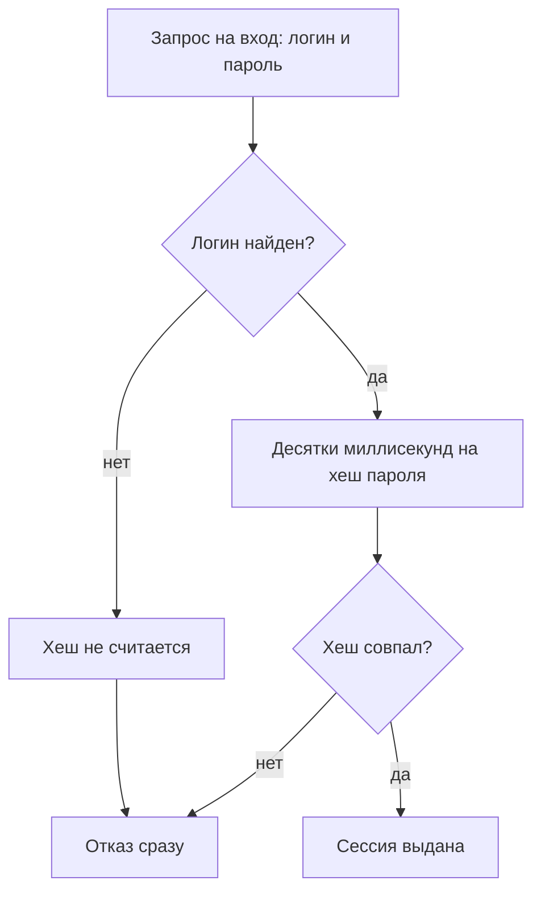
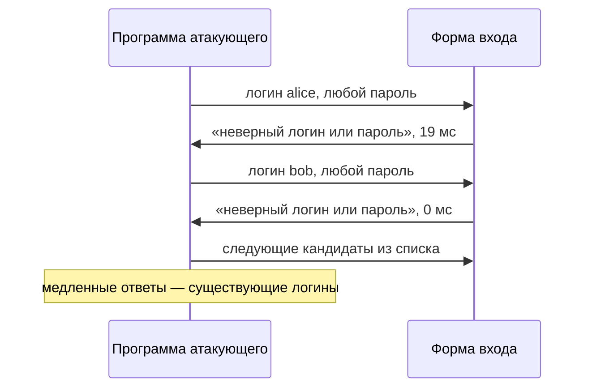

# Перечисление пользователей

Форма входа отвечает одной фразой на оба исхода: «неверный логин или
пароль». По такому тексту не скажешь, существует ли введённый логин, — но у
приложения есть ещё один канал, время обработки, и его никто не выравнивал.
Медиана — средний элемент упорядоченного ряда: в отличие от среднего
арифметического, один случайный выброс её не двигает. Ниже — медианы
двадцати пяти замеров на учебном стенде: входы с существующим логином
против входов с выдуманным.

```text
быстрый выход  есть=19.28 мс  нет= 0.00 мс  Δ=+19.28 мс
хеш всегда     есть=19.21 мс  нет=19.30 мс  Δ= -0.09 мс
```

Верхняя строка — проверка, которая для несуществующего логина отвечает
сразу, не считая хеш пароля. Девятнадцать миллисекунд разницы различимы без
всякой статистики: логин, на который форма отвечает медленно, существует.
Такая утечка называется перечислением пользователей: по ответу приложения
узнают, существует ли логин, не зная пароля. Нижняя строка — та же
проверка, где хеш считается всегда, и разница исчезает почти полностью.

## Что такое перечисление пользователей

Перечисление пользователей (user enumeration) — утечка, при которой
приложение своими ответами подтверждает или опровергает существование
логина. Канал утечки — любой признак, который атакующий способен измерить
снаружи. Таких признаков четыре: текст сообщения, код состояния, длина
страницы и время обработки. Каналов же три: код и длина живут в одном
канале, служебных полях ответа, а время — вообще не в ответе, а в работе
сервера. Ниже каналы разбираются по одному.

Зачем это атакующему: логин — половина пары «логин и пароль». Со списком
существующих логинов перебор паролей идёт по реальным учётным записям, а не
наугад — приёмы такого перебора и защиту от него разбирает тема
`brute-force-defense`. Тот же список ложится в основу подстановки украденных
пар, которую разбирает тема `credential-stuffing`, и в выбор жертв для
целевой рассылки.

Бытовой аналог — портье в отеле. На просьбу соединить с гостем возможны два
ответа: «такой гость у нас не проживает» и «соединить не могу». Первый
выдаёт факт проживания, второй — нет. Где аналогия ломается: портье видит
спрашивающего в лицо и на десятой фамилии насторожится. Сервер же принимает
безликие запросы, и программа перебирает фамилии тысячами, не боясь внимания.

**Зачем это в работе AppSec-инженера.** Дефект выглядит как забота о
пользователе: «подскажем, что именно не так с логином». Ревьюер смотрит на
это как на канал: любой наблюдаемый признак, различающий «логин есть» и
«логина нет», — находка. Три канала чинятся по-разному, и починка текста
ответа ничего не делает с утечкой по времени, поэтому ревью смотрит все три
сразу.

## Как это работает

**Откуда это взялось.** Приложению нужно ответить пользователю, что вход не
удался, и при этом не сообщить атакующему, какие логины существуют. Эти два
требования спорят: чем понятнее сообщение об ошибке, тем больше оно выдаёт.
Cheat Sheet OWASP, открытая памятка по аутентификации, разрешает спор в
пользу единообразия: один ответ на все исходы. Единообразным должен быть не
только текст ответа, но и его код, и время обработки — иначе различие
переезжает в то поле, где его не убрали.

### Текст ответа

Первый канал — само сообщение об ошибке. Cheat Sheet приводит пару фраз:
«Login failed; invalid user ID» против «invalid password». Обе об отказе,
но первая сообщает, что логина нет, а вторая — что логин есть, а пароль
неверен. Требование оттуда же: один ответ на оба случая — «Login failed;
Invalid user ID or password».

То же правило у двух соседних форм. Форма сброса пароля отвечает «если
адрес есть в базе, мы отправили письмо» независимо от того, есть он там или
нет. Регистрация сообщает «ссылка отправлена на этот адрес» и не говорит
«логин уже занят». Иначе перечисление переезжает с формы входа на форму,
где ответ ещё различается.

### Код и длина ответа

Второй канал — служебные поля ответа: код состояния и длина тела (их
устройство разбирает тема `http-basics`). Приложение может показать
человеку одинаковый экран и при этом вернуть 200 на верный логин и 403 на
неверный — или страницу другой длины. Машина сравнивает не экраны, а байты
ответа, и Cheat Sheet называет разный HTTP-код отдельным фактором различия.

В тот же канал попадают и другие поля: отличающийся адрес редиректа или
лишний заголовок программа читает так же хорошо, как код. Те же каналы как
отдельные направления проверки перечисляет раздел WSTG-v42-IDNT-04 —
испытание на перечисление учётных записей в методичке тестировщиков OWASP.

### Время обработки

Третий канал живёт не в ответе, а в обработке. Приложение хранит не сам
пароль, а его хеш — результат необратимого преобразования, по которому
пароль не восстановить. При входе приложение считает хеш от введённого
пароля и сравнивает с хранимым. Функция хеширования здесь PBKDF2-HMAC-SHA-256,
где HMAC — Hash-based Message Authentication Code, код аутентификации
сообщения на хеше. Из всего имени теме важно одно свойство функции: вызов
занимает десятки миллисекунд, и медленность намеренная — она делает перебор
паролей дорогим. Устройство медленного хеширования разбирает тема
`password-storage`.

Если логин не найден, хранимого хеша нет и сравнивать не с чем — проверка
отвечает сразу. Если найден — сначала идут десятки миллисекунд работы.
Разница во времени рождается не в ответе, а в разном объёме работы на двух
путях. Место, где пути расходятся, показано на схеме.



**Описание схемы.** Схема читается сверху вниз и показывает два пути
проверки входа. Если логин не найден, проверка выходит в отказ, минуя шаг с
хешем, и левая ветка короче на десятки миллисекунд. Если логин найден, хеш
считается всегда, и только потом принимается решение. Левая ветка — тот
самый источник разницы из таблицы в начале темы.

### Откуда берётся разница во времени

Прогон на учебном стенде (`.smgr/appsec-stage1-auth/exp/e01-timing.py`,
Python 3.14.7, PBKDF2-HMAC-SHA-256) сравнивает две реализации проверки
пароля. Медиана двадцати пяти замеров:

```text
быстрый выход  пароль 13 симв.       есть=19.28 мс  нет= 0.00 мс Δ=+19.28 мс
быстрый выход  пароль 100 000 симв.  есть=19.33 мс  нет= 0.00 мс Δ=+19.33 мс
хеш всегда     пароль 13 симв.       есть=19.21 мс  нет=19.30 мс Δ= -0.09 мс
хеш всегда     пароль 100 000 симв.  есть=19.25 мс  нет=19.27 мс Δ= -0.02 мс
```

Верхние две строки — «быстрый выход»: для несуществующего логина проверка
возвращает управление сразу и отвечает за доли миллисекунды против
девятнадцати. Нижние две — «хеш всегда»: хеш считается и для несуществующего
логина, и разница падает до сотых миллисекунды. Длина пароля роли не играет
ни там, ни там: длинная строка удлиняет оба пути одинаково.

Академия PortSwigger советует усиливать такой разрыв чрезмерно длинным
паролем: обработка очень длинной строки должна добавить времени пути
существующего логина. Замер показывает, где этот совет бесполезен. На
«быстром выходе» разрыв уже полный, и усиливать нечего. На «хеше всегда»
стотысячный пароль удлиняет оба пути одинаково, и разрыва не создаёт.

> **Примечание.** Замеры сняты на одной машине, а PBKDF2 взят с заниженным
> числом итераций ради скорости прогона. Годятся они как порядок величины:
> важна не цифра «девятнадцать», а то, что один путь считает хеш, а другой
> нет.

## Как это атакуют

Перечисление ведёт программа, а не человек. Атакующий собирает список
кандидатов: частые логины вроде `admin` и `test`, адреса из публичной
переписки компании, имена сотрудников из открытых источников. Каждый
кандидат прогоняется через форму входа или сброса, и по каждому
записываются все три признака: текст ответа, код и длина, время до ответа.
Время замеряется несколько раз на кандидата, потому что разовый замер
шумит: сеть и планировщик добавляют случайные миллисекунды. Медиана десяти
замеров этот шум глушит: одиночный выброс почти не сдвигает её.



**Описание схемы.** Программа подаёт кандидатов по одному, и текст ответа у
всех одинаковый. Различается время: кандидат alice обрабатывался девятнадцать
миллисекунд, кандидат bob — доли миллисекунды. Сортировка по времени ответа
превращает список кандидатов в список существующих логинов, и ни одного
пароля для этого не понадобилось.

Счётчик неудачных попыток из темы `brute-force-defense` замедляет
перечисление, но не закрывает его: замеры идут с обычной частотой входов, а
время ответа счётчик не выравнивает. Поэтому канал времени чинят в самой
проверке пароля, а не ограничителем частоты — эта починка и есть раздел «Как
защититься».

## Как это выглядит в коде

На ревью ищут ранний выход по несуществующему логину. Перед чтением
листинга назовите себе два места, где прячется утечка: где путь
несуществующего логина расходится с путём существующего и где текст ответа
различает исходы. Каналов здесь два — обозначьте каждый, не заглядывая в
выноски.

```python
# УЯЗВИМО — демонстрация, не для продакшена
def login(user, password):
    stored = STORE.get(user)
    if stored is None:                       # (1)
        return error("Пользователь не найден")
    if not verify(password, stored):         # (2)
        return error("Неверный пароль")
    return grant_session(user)
```

1. Ранний выход: для несуществующего логина хеш не считается, и ответ
   приходит раньше. Плюс текст ответа прямо называет причину.
2. Второй текст ответа отличается от первого — тот же канал утечки, только
   в тексте.

Признаки дефекта такие. Разные сообщения для «нет логина» и «неверный
пароль». Разный код ответа или заметно разная длина страницы. Проверка
пароля под условием «если логин найден». Форма восстановления, отвечающая
по-разному на известный и неизвестный адрес. Регистрация, сообщающая «этот
логин уже занят».

## Как защититься

Правило одно: один ответ на все исходы, один код ответа и одинаковая работа
на обоих путях. Хеш считается всегда, даже когда логина нет, — для этого
заводят заглушку, заранее посчитанный хеш случайного значения. При чтении
листинга найдите три ответа: где берётся заглушка, чем занят путь
несуществующего логина, в каком месте принимается решение.

```python
# Исправлено.
DUMMY = hash_password(os.urandom(16))            # (1)

def login(user, password):
    stored = STORE.get(user, DUMMY)              # (2)
    ok = verify(password, stored)
    if not ok or user not in STORE:              # (3)
        return error("Неверный логин или пароль")
    return grant_session(user)
```

1. Заглушка считается один раз при старте. С ней сверяется пароль для
   несуществующего логина, чтобы этот путь занял то же время.
2. Для отсутствующего логина берётся заглушка, а не ранний выход: ветки
   расходиться перестали.
3. Единый текст на оба исхода. Проверка `user not in STORE` стоит после
   `verify`: решение принимается, когда работа уже сделана, и не зависит от
   того, нашёлся ли логин.

Вопрос к листингу: что продолжит утекать, если заглушку убрать, а единый
текст оставить? Ответ — время. Несуществующий логин снова выйдет из
проверки, не считая хеш, и таблица из начала темы вернётся к верхней
строке. Правило держится на трёх частях сразу — текст, код, работа, — и
потеря любой возвращает свой канал.

**То же на трёх формах.** Cheat Sheet требует единообразия не только на
входе. Форма сброса отвечает «если адрес в базе, письмо отправлено» при
любом адресе. Регистрация отвечает «ссылка активации отправлена» и не
сообщает «логин занят»: занятость уходит письмом владельцу адреса, а
атакующий видит одинаковый текст. Если единообразие держится только на
входе, перечисление переезжает на форму, где ответ ещё различается.

**Чего единый ответ не закрывает.** Разницу во времени. Единый текст и
единый код не помогают, если один путь считает хеш, а другой нет, — признак
рождается в обработке, а не в ответе. Время выравнивают тем, что дорогую
работу выполняют на обоих путях, — заглушкой из листинга выше.

**Цена решения.** Хеш на каждой попытке входа — процессорное время: при
переборе в сто тысяч попыток это сто тысяч лишних вычислений. Поэтому
единообразие работает в паре со счётчиком неудач из темы
`brute-force-defense`, который отсекает массовый перебор ещё до проверки
пароля. Вторая цена — удобство: честный пользователь не узнает из
сообщения, в логине он ошибся или в пароле. Это осознанный выбор: подсказка
пользователю и подсказка атакующему — одна и та же подсказка.

## Частая ошибка

Одинаковый текст ответа на оба исхода — перечисление закрыто целиком?
Сформулируйте свой ответ до чтения дальше.

Сверка текстов даёт готовый ответ: сообщения об ошибке одинаковые, значит,
перечисление закрыто.

**Единый текст закрывает один канал из трёх.** Остаются код и длина ответа —
и остаётся время. Приложение, которое честно показывает «неверный логин или
пароль» на обоих исходах, но считает хеш только для существующего логина,
перечисляется по секундомеру. Сбой в рассуждении сидит в масштабе проверки:
сравнивались только тексты ответов, а вывод сделан про все три канала
разом.

Контрпример из прогона. Реализация «быстрый выход» отвечала одним текстом,
но для несуществующего логина возвращалась за доли миллисекунды против
девятнадцати. Девятнадцать миллисекунд — устойчивый признак: логин, ответ
на который приходит медленно, существует.

## Чеклист для ревью

На ревью пройдите по списку.

1. Проверьте, что вход отвечает одним сообщением на «нет логина» и «неверный
   пароль» (ASVS v5.0-6.3.8).
2. Проверьте, что код ответа и его длина одинаковы для обоих исходов входа.
3. Проверьте, что форма восстановления пароля отвечает одинаково на известный и
   неизвестный адрес.
4. Проверьте, что регистрация не сообщает о занятости логина в самом ответе
   формы: уведомление уходит письмом владельцу адреса, и атакующий его не видит.
5. Проверьте, что хеш пароля считается на обоих путях, включая несуществующий
   логин, чтобы время ответа не различалось.
6. Проверьте, что защита от перечисления распространена на все каналы, где виден
   исход, включая редиректы и заголовки (WSTG-v42-IDNT-04).

## Попробуй сам

Возьмите форму входа и форму сброса пароля приложения, с которым работаете.
Пошлите каждой заведомо существующий и заведомо несуществующий логин.
Сравните три вещи: текст ответа, код и длину ответа, время до ответа.

**Наблюдаемый критерий:** таблица из шести измерений (две формы × три канала)
и вывод, по какому каналу приложение перечисляется, если перечисляется. Для
времени — не одно измерение, а медиана десяти: разовый замер шумит.

## Проверь себя

1. Вход отвечает единым текстом на оба исхода:

   ```python
   def login(user, password):
       stored = STORE.get(user)
       if stored is None:
           return "Неверный логин или пароль"
       if not verify(password, stored):
           return "Неверный логин или пароль"
       return grant_session(user)
   ```

   Текст ничего не выдаёт. Какой канал остался открыт и через какую строку?
2. Какая правка устраняет дефект из вопроса 1?

   A. Оставить как есть: текст ответа един, перечисление закрыто.

   B. Считать хеш всегда — несуществующий логин сверяется с заглушкой, — и
      решать об исходе после `verify`.

   C. Добавить перед ответом случайную задержку, чтобы замер зашумел.
3. Почему проверку `user not in STORE` в исправленном коде ставят после
   вычисления хеша, а не до?
4. Предскажите, что напечатает этот замер двух реализаций и какой вывод из
   него?

   ```python
   import hashlib, statistics, time
   STORE = {'anna': b'x'}

   def t(fn, user, n=30):
       s = []
       for _ in range(n):
           t0 = time.perf_counter()
           fn(user)
           s.append(time.perf_counter() - t0)
       return statistics.median(s) * 1000

   def fast(user):
       if user not in STORE: return False
       hashlib.pbkdf2_hmac('sha256', b'p', b's', 50_000); return True

   def always(user):
       hashlib.pbkdf2_hmac('sha256', b'p', b's', 50_000)
       return user in STORE

   print('fast:', round(t(fast, 'anna'), 1), round(t(fast, 'no'), 1))
   print('always:', round(t(always, 'anna'), 1), round(t(always, 'no'), 1))
   ```

5. Возврат к теме `http-basics`: какие поля ответа, кроме тела, различают два
   исхода, даже когда текст один?

<details markdown="1">
<summary>Ответ 1</summary>

1. Время обработки — через ранний выход: для несуществующего логина хеш не
   считается, и ответ приходит на десятки миллисекунд раньше. Единый текст
   закрыл первый канал, а этот он не трогает.

</details>

<details markdown="1">
<summary>Ответ 2: разбор вариантов</summary>

2. Верно: B.

   A. Неверно. Единый текст закрывает один канал из трёх: остаются код с длиной
      ответа и время. Сверка текстов даёт готовый ответ «закрыто», а вывод сделан
      про все три канала — в этом и сбой.

   B. Верно. Оба пути проделывают одинаковую работу, и время выравнивается.
      Решение об исходе принимается после `verify`, чтобы не зависеть от того,
      нашёлся логин.

   C. Неверно. Случайная задержка маскирует разовый замер и не маскирует
      медиану: шум усредняется, а разница между «хеш считается» и «не
      считается» остаётся.

</details>

<details markdown="1">
<summary>Ответ 3</summary>

3. Чтобы обе ветки проделали одинаковую работу. Если проверять существование до
   хеша, для несуществующего логина хеш не посчитается, и вернётся утечка по
   времени.

</details>

<details markdown="1">
<summary>Ответ 4</summary>

4. У `fast` существующий логин отвечает медленнее, у `always` оба пути равны.
   Проверяется запуском — фрагмент из вопроса сохранён в `probe.py`:

   ```bash
   python3 probe.py
   ```

   ```text
   fast: 4.6 0.0
   always: 4.6 4.6
   ```

   Прогон от 2026-10-03, Python 3.14.7. Числа зависят от машины, важен знак
   разницы: у `fast` разрыв есть, у `always` его нет.

</details>

<details markdown="1">
<summary>Ответ 5</summary>

5. Код ответа (200 против 403) и длина тела. Cheat Sheet называет разный
   HTTP-код отдельным фактором различия при одинаковом показанном экране.

</details>

## Источники

1. OWASP Authentication Cheat Sheet; реестр `owasp-cs-authentication`. Разделы:
   Authentication and Error Messages (Authentication Responses, Incorrect and
   correct response examples, Error Codes and URLs).
   <https://cheatsheetseries.owasp.org/cheatsheets/Authentication_Cheat_Sheet.html>
2. PortSwigger Web Security Academy, «Vulnerabilities in password-based login»;
   реестр `ps-authentication`. Раздел Username enumeration (status codes, error
   messages, response times).
   <https://portswigger.net/web-security/authentication>
3. OWASP WSTG-IDNT-04 «Testing for Account Enumeration and Guessable User
   Account», WSTG v4.2; реестр `wstg-v42-idnt-04-account-enumeration`. Разделы:
   Testing for Valid/Invalid credentials, Other Ways to Enumerate Users.
   <https://owasp.org/www-project-web-security-testing-guide/v42/4-Web_Application_Security_Testing/03-Identity_Management_Testing/04-Testing_for_Account_Enumeration_and_Guessable_User_Account>

Каркас этапа: `owasp-asvs-5-document` (ASVS v5.0.0), `owasp-wstg-42`,
`owasp-top10-2025`; якоря подраздела: `ps-authentication`,
`owasp-cs-authentication`. Наследуются всеми темами и отдельной строкой не
повторяются.

**Скоропортящийся слой.** Примеры формулировок ответа взяты из Cheat Sheet,
живого документа без даты, и годятся как образец, а не дословный текст. Разрыв
во времени в миллисекундах привязан к железу и числу итераций замера.

**Маркеры уверенности.** Разница во времени между «быстрым выходом» и «хешем
всегда», в том числе с длинным паролем, — **проверено лично** 2026-08-24 на
Python 3.14.7 стендом `e01-timing.py` (PBKDF2-HMAC-SHA-256, медиана 25
замеров). Каналы утечки, требования к единообразию текста, кода и времени —
**по документации**: Authentication Cheat Sheet, WSTG v4.2, PortSwigger
Academy, ASVS v5.0.0, открыты лично 2026-08-24. Листинг из вопроса 4 прогнан
повторно 2026-10-03 на Python 3.14.7: у `fast` разрыв есть, у `always` нет;
абсолютные числа зависят от машины, знак разницы совпал. Поведение конкретных
фреймворков и балансировщиков (различие длины ответа, кэш) **не
воспроизводилось**.
