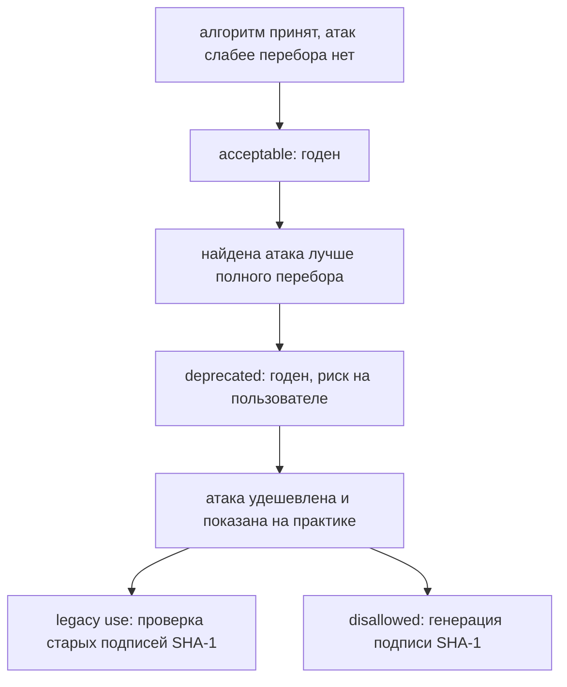

# Слабые и устаревшие алгоритмы

На ревью одного сервиса два разработчика спорят о вызове `hashlib.md5`.
Первый говорит: MD5 сломан, и его надо выкидывать отовсюду. Второй
возражает: вызов считает ключ кэша, а не подпись, и трогать рабочий код без
причины не хочется. Чтобы закрыть спор, они меряют скорость четырёх
хеш-функций на одном ядре.

В замере SHA-256 обгоняет MD5 из-за процессорных инструкций для SHA-2, так
что если бы скорость говорила о стойкости, вышло бы, что MD5 стойче
SHA-256. Замер спора не решает: стойкость живёт в устройстве функции, а не
в секундомере. Решает его документ, который назначает алгоритму статус, и
статус привязан к применению. Поэтому один и тот же вызов бывает дефектом в
подписи и нормой в ключе кэша.

## Что такое «слабый алгоритм»

### Хеш-функция и её отпечаток

Хеш-функция — алгоритм, который сводит вход любой длины к отпечатку
фиксированной длины. Файл в десять гигабайт и слово «мир» дают отпечаток
одной длины, и меняется он от любого изменения входа. Тема
`password-storage` показывала такую функцию на хранении паролей; здесь
нужно другое её свойство.

Бытовой пример — отпечаток пальца. Он маленький и проверяется быстро, а
человека по нему не восстановишь, только узнаешь. С хеш-функцией так же:
вход по отпечатку не собирается обратно, а сравнение двух файлов сводится к
сравнению двух коротких строк. Ломается аналогия в одном месте, и место это
— предмет всей темы. Двух человек с одинаковыми отпечатками не бывает, а
два разных входа с одинаковым отпечатком у хеш-функции существуют всегда.

### Коллизия: два входа, один отпечаток

Коллизией называют пару разных входов с одинаковым отпечатком. Что такие
пары существуют, видно из арифметики: входов бесконечно много, а отпечатков
конечное число, у MD5 это два в степени 128. Вопрос не «бывают ли
коллизии», а «сколько стоит найти хотя бы одну». У годной функции подбор
пары дороже любого реального бюджета, у сломанной укладывается в работу
одного сервера.

Чем это грозит, видно на подписи. Цифровая подпись из темы `tls-and-proxy`
ставится не на сам документ, а на его отпечаток, потому что подписывать
гигабайты долго, а 32 байта быстро. Если атакующий заранее подготовил два
документа с одним отпечатком, честный договор и подлог, подпись под честным
годится и под подлог. Проверяется ведь отпечаток, а он у обоих документов
один. Стойкостью к коллизиям называют свойство функции, при котором такую
пару не подготовить за разумную цену. Подпись без этого свойства не
работает, поэтому требования к ней жёстче, чем к контрольной сумме.

### Статус привязан к применению

«Слабый алгоритм» — не оценка на вкус, а статус из документа. У NIST,
Национального института стандартов и технологий США, такой документ — свод
SP 800-131A, и градаций в нём четыре. Acceptable значит годен. Deprecated
значит годен, но риск на пользователе. Legacy use значит только разбор уже
защищённого, например проверка подписей, выписанных раньше. Disallowed
значит для защиты не применяется.

Четыре градации похожи на пометки о сроке годности: «годен»,
«годен на свой страх и риск», «только в переработку», «выбросить».
Соответствие держится на двух опорах: пометку ставит не покупатель, а
внешнее правило, и одна и та же банка годна взрослому, но негодна ребёнку.
Ломается аналогия на направлении движения: срок годности задан при
производстве, а статус алгоритма пересматривают после каждой новой атаки, и
движется он только в сторону запрета.

Ключевая тонкость в том, что статус принадлежит паре «алгоритм и
применение»: у одного алгоритма таких статусов несколько. У SHA-1 в своде три строки сразу: запрещён в
генерации подписи, разрешён в проверке старых подписей, годен там, где
стойкость к коллизиям не требуется. MD5 устроен жёстче: в перечне
разрешённых хеш-функций его нет вовсе. У ASVS, стандарта требований к
проверке приложений, форма короче: перечень разрешённых алгоритмов и
режимов, и запрет на всё остальное.



**Описание схемы.** Схема читается сверху вниз и показывает путь одного
алгоритма по градациям свода. Пока атаки слабее перебора нет, алгоритм
годен. Первая атака лучше перебора переводит его в разряд «риск на
пользователе». Атака, показанная на практике, разводит применения по двум
веткам: разбор старого остаётся, защита нового запрещается. SHA-1 в подписи
прошёл обе ветки: проверять старые подписи можно, ставить новые нельзя.

**Зачем это в работе AppSec-инженера.** Спор об алгоритме — самый частый
спор, который заканчивается ничем, потому что стороны меряют вкусом. Ссылка
на таблицу статусов заканчивает его за минуту: в документе написано, что и
с какого года. Тема даёт ревьюеру две вещи: список того, что искать в коде
и конфигурации, и адрес документа, которым находка подтверждается.

## Как это работает

**Откуда это взялось.** Алгоритмы не ломаются в один день. Сначала находят
атаку лучше полного перебора, то есть способ получить ответ быстрее, чем
проверкой всех вариантов подряд. Потом атаку удешевляют. Потом кто-то
показывает две разные последовательности байт с одинаковым отпечатком.
Между первой публикацией и запретом проходят годы, и всё это время код
продолжает работать.

Поэтому и форма ответа не «сломан или нет», а таблица с датами, по которой
видно, когда пора менять. Статусы ниже — из редакции SP 800-131A Rev. 2 от
марта 2019 года, и по ней трёхключевой 3DES для шифрования запрещён с конца
2023 года.

### Что чем заменяют

Замены известны и коротки, и собраны они в таблицу по разрядам. Разряд —
роль примитива, то есть базового алгоритма, из которого собирается схема:
чем шифруем, чем хешируем, чем подписываем, как стороны договариваются об
общем ключе. Код аутентичности сообщения здесь — HMAC
(Hash-based Message Authentication Code), метка подлинности на хеш-функции
и общем секрете; его устройство и отличие от подписи разбирает тема
`hmac-vs-signature`.

| разряд | вывели | взамен |
|---|---|---|
| симметричный шифр | DES, 2TDEA, 3DES, RC4, Blowfish | AES-128 и выше |
| хеш | MD4, MD5, SHA-1 в подписи | SHA-2, SHA-3 |
| подпись RSA | ключ короче 2048 бит, PKCS#1 v1.5 | RSA-PSS от 2048, Ed25519 |
| асимметричный шифр | RSA без OAEP | RSA-OAEP, ECIES на Curve25519 |
| обмен ключами | DH короче 2048 бит | X25519, ffdhe2048 и выше |
| протокол | SSLv2, SSLv3, TLS 1.0, TLS 1.1 | TLS 1.3, при нужде TLS 1.2 |
| MAC | HMAC с ключом короче 112 бит | HMAC с ключом от 112 бит |

Прочитаем таблицу по строкам. DES — шифр конца 1970-х с ключом в 56 бит, и
такой ключ перебирается. 2TDEA и 3DES — двух- и трёхключевые варианты
тройного применения DES, и трёхключевой запрещён с конца 2023 года. RC4 и
Blowfish — шифры той же эпохи со своими изъянами.

В строке подписи два дефекта сразу: короткий ключ и старое дополнение
PKCS#1 v1.5. Дополнение — служебные байты, которыми сообщение достраивается
до формата, требуемого операцией RSA. Это как наполнитель, которым доверху
заполняют стандартную коробку; ломается сравнение на цене ошибки: от правил
заполнения зависит, что атакующий выведет из ответов сервера. Правил
достройки три: v1.5, PSS и OAEP. Поэтому замена — пара «RSA-PSS и
ключ от 2048 бит» либо подпись Ed25519 на
эллиптической кривой.

В строке хеша MD4 назван для полноты: он сломан раньше MD5, а замена —
семейства SHA-2 и SHA-3. В строке асимметричного шифрования то же
дополнение уходит в OAEP. RSA со старым дополнением отвечает на
подправленный шифртекст разными ошибками, и по ошибкам текст читается без
ключа. Строка обмена ключами про приём Диффи—Хеллмана из темы
`tls-and-proxy`, DH — его сокращение: X25519 — тот же приём на кривой
Curve25519, ffdhe2048 — именованная группа для классического варианта.
Строка протокола тоже знакома по `tls-and-proxy`: всё до TLS 1.2 выводится.

Нижняя граница стойкости у двух документов разная, и меряется она в битах:
n бит стойкости значат, что атаке нужно около двух в степени n операций.
NIST в этой редакции ведёт отсчёт от 112 бит. ASVS требует минимума в
128 бит для всех примитивов (`v5.0-11.2.3`). Разница объяснима возрастом
документов, и в ревью берут строгую.

### Быстрый хеш — не то же самое, что слабый

Вернёмся к спору из начала темы и к замеру, который в нём прозвучал. Стенд
считает скорость четырёх хеш-функций на одном ядре, вызовов в секунду:

```text
$ python e08-hashrate.py
одиночный хеш, вызовов в секунду (одно ядро)
  md5            4,425,089
  sha1           5,439,696
  sha256         5,264,878
  sha512         3,635,269
```

SHA-256 на этой машине быстрее MD5, потому что у процессора есть
инструкции для SHA-2, а для MD5 их нет. Из скорости, стало быть, не следует
ничего про стойкость, и наоборот. Вывод по разрядам такой. Для паролей
плоха любая из четырёх: там нужна функция с настраиваемой ценой, и разговор
о ней идёт в теме `password-storage`. Для подписи негодны первые две,
потому что подпись требует стойкости к коллизиям (`v5.0-11.4.3`). Чем
обоснован выбор хеш-функции в вашем последнем коде: документом, замером или
привычкой?

### Что библиотека всё ещё умеет

Второй стенд смотрит на OpenSSL — библиотеку, обслуживающую TLS-соединения
из темы `tls-and-proxy`:

```text
$ sh e12-openssl.sh
openssl: OpenSSL 3.6.3 9 Jun 2026
наборы шифров по умолчанию (TLS 1.3 и 1.2):
  TLS_AES_256_GCM_SHA384
  TLS_CHACHA20_POLY1305_SHA256
  TLS_AES_128_GCM_SHA256
  --- TLS 1.2, число наборов по умолчанию: 27
обмен ключами в наборах TLS 1.2 по умолчанию:
       7 Kx=DH
      14 Kx=ECDH
       6 Kx=RSA
устаревшие наборы в спецификации 'DEFAULT':
  NULL     в DEFAULT: 0   доступно явным запросом: 21
  MD5      в DEFAULT: 0   доступно явным запросом: 4
  DES      в DEFAULT: 0   доступно явным запросом: 0
```

Читается вывод в три находки. Первая: наборы по умолчанию давно вычищены, и
в спецификацию `DEFAULT` не входят ни NULL, ни MD5, ни DES. Но «не предлагаются» не
значит «убраны»: двадцать один набор с NULL и четыре с MD5 доступны явным
запросом. А режимы `des-ecb` и `des-ede3-cbc` команда `openssl enc`
принимает и сегодня. Из библиотеки старые примитивы не исчезли — их
перестали предлагать.

Вторая находка потоньше. Шесть наборов TLS 1.2 из двадцати семи
обмениваются ключами не эфемерно. Это ровно строки с `Kx=RSA` из вывода:
`Kx` — вид обмена ключами. В этих наборах общий секрет шифруется
долгоживущим ключом сервера из сертификата; такой обмен знаком по теме
`tls-and-proxy`. Эфемерным называют ключ, который рождается на одно
соединение и не хранится; у наборов без него нет свойства forward secrecy,
прямой секретности.

Смысл свойства в том, что раскрытие ключа сервера не раскрывает трафик,
записанный раньше: сеансовые ключи из долгоживущего не выводятся. Бытовой
аналог — разговор, который никто не записывал: архива нет, и похищать
нечего. Ломается аналогия на памяти: эфемерный ключ всё же живёт в памяти,
пока идёт соединение.

Третья находка — режим сцепления блоков, CBC, в котором работает часть
наборов TLS 1.2 из того же списка. Там каждый блок зацеплен за предыдущий,
а метка целостности проверяется после расшифровки. Противоположный режим,
ECB, шифрует каждый блок сам по себе: одинаковые блоки открытого текста
дают одинаковые блоки шифртекста, и картина данных просвечивает. По разнице
ответов сервера атакующий восстанавливает содержимое по одному байту; приём
называется оракулом дополнения и разбирается в теме `padding-oracle` дальше
по маршруту. Запрет на такие наборы — `v5.0-12.1.2`.

## Как это выглядит в коде

Ревьюер ищет имя примитива в вызове, и список имён короткий: `MD4`, `MD5`,
`SHA1`, `RC2`, `RC4`, `DES`, `Blowfish`, `ECB`, `PKCS1v15`. Ищется он
поиском по строке, потому что алгоритм и режим в вызовах заданы строкой, а
не типом: поиск по имени класса их не найдёт. По каждому найденному вызову
скажите, что в нём запрещено и каким документом.

```python
# УЯЗВИМО — демонстрация, не для продакшена
digest = hashlib.md5(document).hexdigest()        # (1)
sig = private_key.sign(digest, padding.PKCS1v15(),
                       hashes.SHA1())             # (2)
```

1. MD5 под подпись: стойкости к коллизиям нет, а подпись ставится на
   отпечаток, поэтому документ подменяется другим с тем же отпечатком.
2. Дополнение PKCS#1 v1.5 и SHA-1 в подписи запрещены оба, и запрещены
   разными пунктами: `v5.0-11.3.1`, `v5.0-11.4.3`.

```java
// УЯЗВИМО — демонстрация, не для продакшена
Cipher c = Cipher.getInstance("DES/CBC/PKCS5Padding");   // (3)
MessageDigest md = MessageDigest.getInstance("MD5");     // (4)
```

3. Алгоритм и режим заданы строкой, поэтому искать их надо по строке, а не
   по типу.
4. То же имя в другом месте. WSTG выносит эти два вызова в отдельный пункт
   ревью исходного кода.

Ложное срабатывание у такого поиска одно, и встречается оно часто. MD5 и
SHA-1 годятся как некриптографическая контрольная сумма: ключ кэша, поиск
дублей файлов, ускорение сравнения. Криптографической целью это не
считается, и запрет сюда не дотягивается. Различает случаи один вопрос: что
будет, если атакующий подберёт два разных входа с одинаковым значением.
Ответ «ничего» означает ложное срабатывание, ответ «подсунет другой файл»
— настоящее. Спор из начала темы закрывается ровно этим вопросом: вызов
считает ключ кэша, и подмена входа атакующему ничего не даёт.

## Как защититься

Правка идёт в пять ходов, и начинается она не с кода, а с перечня.

- **Сначала перечень, потом правка.** ASVS начинает с инвентаря: какие
  алгоритмы, ключи и сертификаты используются и где. Без перечня правка
  идёт по местам, которые нашлись поиском, а нашлось из них только то, что
  лежало на виду.
- **Замена по разряду, а не по вкусу.** Разряд вызова задаёт строку в
  таблице замен, а выбор внутри разряда берётся из документа. Спор «что
  лучше» закрывается ссылкой, а не обсуждением.
- **TLS 1.3 по умолчанию, TLS 1.2 при нужде.** Всё до TLS 1.2 отключается.
  Из списка TLS 1.2 убираются наборы без forward secrecy и наборы в режиме
  сцепления блоков (`v5.0-12.1.1`, `v5.0-12.1.2`).
- **Сменяемость заложена заранее.** Алгоритм, длина ключа и режим меняются
  настройкой, а не правкой кода. Следующий такой разговор случится через
  несколько лет, когда очередной алгоритм съедет по таблице статусов, и
  повторять работу целиком не придётся.
- **Старое остаётся на чтение.** Проверка выписанных ранее подписей и
  расшифровка старых данных — то самое legacy use: запрещено применение к
  новым данным, а не разбор старых. Поэтому старый примитив не удаляется, а
  уходит под флаг «только разбор».

Вызовы из раздела «Как это выглядит в коде» после правки выглядят так:

```python
# Исправленный вариант
digest = hashlib.sha256(document).hexdigest()            # (1)
pss = padding.PSS(mgf=padding.MGF1(hashes.SHA256()),
                  salt_length=padding.PSS.MAX_LENGTH)
sig = private_key.sign(digest, pss, hashes.SHA256())     # (2)
```

1. Хеш заменён по разряду «подпись»: SHA-256 даёт стойкость к коллизиям, и
   пункт `v5.0-11.4.3` закрыт.
2. Дополнение заменено на PSS, как требует `v5.0-11.3.1`; ключ RSA при этом
   берётся от 2048 бит.

```java
// Исправленный вариант
Cipher c = Cipher.getInstance("AES/GCM/NoPadding");      // (3)
MessageDigest md = MessageDigest.getInstance("SHA-256"); // (4)
```

3. DES в сцеплении блоков заменён на AES в аутентифицированном режиме GCM,
   где шифрование и метка целостности идут одной операцией; такие режимы
   разбирает тема `hmac-vs-signature`.
4. MD5 заменён на SHA-256. Вызов всё так же задаётся строкой, поэтому
   регресс ловится тем же поиском по строке.

## Частая ошибка

Решите до чтения дальше: любой вызов MD5 в коде — дефект, который надо
чинить. Верно ли это?

Неверно, и причина — главная мысль темы: статус назначен не функции, а паре
«функция и применение». У NIST SHA-1 стоит в трёх строках сразу: запрещён в
генерации подписи, разрешён в проверке старых подписей, годен там, где
стойкость к коллизиям не требуется. MD5 строже: в перечне разрешённых
хеш-функций его нет, и ASVS запрещает его для любой криптографической цели.
Но ключ кэша и поиск дублей к криптографическим целям не относятся, и
правка такого места ничего не улучшает. Спор из начала темы закрывается
именно этим.

Обратная ошибка того же корня встречается чаще и стоит дороже: «мы взяли
SHA-256, значит с хешами у нас порядок». Для подписи порядок, для хранения
паролей нет: там годность меряется ценой вычисления, и SHA-256 её не даёт,
это разобрано в теме `password-storage`. Выбор делает назначение, а не
оценка.

## Чеклист для ревью

1. Проверьте, что в коде и конфигурации нет вызовов RC4, DES и 3DES для
   защиты новых данных (`v5.0-11.3.2`).
2. Проверьте, что MD4 и MD5 не применяются ни для какой криптографической
   цели, а SHA-1 не стоит в подписи (`v5.0-11.4.1`, `v5.0-11.4.3`).
3. Проверьте, что все примитивы дают не меньше 128 бит стойкости с учётом
   длины ключа (`v5.0-11.2.3`).
4. Проверьте, что включены только TLS 1.2 и TLS 1.3, а наборы TLS 1.2
   отобраны с эфемерным обменом ключами и без режима сцепления блоков
   (`v5.0-12.1.1`, `v5.0-12.1.2`).
5. Проверьте, что хеш под подписью и проверкой целостности стоек к
   коллизиям и даёт не меньше 256 бит (`v5.0-11.4.3`).
6. Проверьте, что подпись RSA использует дополнение PSS, а шифрование RSA —
   OAEP (`v5.0-11.3.1`).
7. Проверьте, что алгоритм, режим и длина ключа задаются настройкой и
   меняются без правки кода.

## Попробуй сам

Возьмите один сервис своего или учебного стека. Соберите по нему перечень:
чем хешируется, чем шифруется, какие версии и наборы TLS включены, какие
длины ключей. Смотрите в код и в конфигурацию, а не в документацию
продукта: документация говорит, что задумано, а перечень собирается о том,
что стоит.

**Критерий выполнения** наблюдаемый: составлена таблица «где — что —
статус по документу» хотя бы на пять строк, и напротив каждой строки со
статусом ниже «годен» названа замена. Отдельно отмечено, какие находки
оказались неприменимыми к криптографической цели.

## Проверь себя

1. Вызов в приложении:

   ```java
   Cipher c = Cipher.getInstance("AES/ECB/PKCS5Padding");
   ```

   Что здесь запрещено и почему такое место ищется поиском по строке?

2. Подпись документов в приложении собрана как в разделе «Как это выглядит
   в коде»: хеш MD5, дополнение PKCS#1 v1.5, SHA-1. Какая правка устраняет
   дефект?

   A. Заменить MD5 на SHA-256, остальное оставить: хеш стал стойким.

   B. Перевести подпись на RSA-PSS с SHA-256 и ключом от 2048 бит, а
      поиском по именам найти остальные вызовы тех же примитивов.

   C. Оставить как есть: библиотека принимает эти вызовы и сегодня, значит
      они годные.

3. Почему из скорости хеш-функции нельзя вывести её стойкость?

4. Не запуская, предскажите, что напечатает эта программа: хеш или ошибку,
   и что это говорит о библиотеке?

   ```python
   import hashlib
   print(hashlib.md5(b'demo').hexdigest())
   print('md5' in hashlib.algorithms_available)
   ```

5. Возврат к теме `tls-and-proxy`: почему отключение старых версий
   протокола делается на стороне сервера, а не клиента?

<details markdown="1">
<summary>Ответ 1</summary>

1. Запрещён режим ECB: блочный шаблон не скрыт, одинаковые блоки открытого
   текста дают одинаковые блоки шифртекста. Ищется место поиском по строке,
   потому что алгоритм и режим заданы строкой, а не типом: поиск по имени
   класса такой вызов не найдёт.

</details>

<details markdown="1">
<summary>Ответ 2: разбор вариантов</summary>

2. Верный вариант — B.

   A. Неверно. Дополнение PKCS#1 v1.5 и SHA-1 в подписи запрещены отдельно
      от хеша документа: замена по разряду читает всю строку вызова, а не
      одно имя. И замена одного места не отвечает на вопрос, где ещё стоят
      те же примитивы, — отсюда перечень до правки.

   B. Верно. Замена назначена документом по разряду «подпись»: PSS вместо
      v1.5, SHA-256 вместо SHA-1 и MD5, ключ от 2048 бит. А инвентарь
      поиском по именам закрывает то, что перечень не показал.

   C. Неверно. Из библиотеки старые примитивы не исчезли — их перестали
      предлагать по умолчанию: `openssl enc` принимает `des-ecb` и сегодня.
      Принять вызов и быть годным — разные вещи.

</details>

<details markdown="1">
<summary>Ответ 3</summary>

3. Потому что скорость определяется реализацией и поддержкой в процессоре,
   а стойкость — устройством функции. В стенде SHA-256 обогнал MD5 на
   19 % именно за счёт процессорных инструкций.

</details>

<details markdown="1">
<summary>Ответ 4</summary>

4. Хеш `fe01ce2a7fbac8fafaed7c982a04e229` и `True`: MD5 в библиотеке есть
   и работает — его перестали предлагать, а не убрали. Сам прогон: фрагмент
   сохраняется как `probe.py` и запускается `python3 probe.py`, вывод
   совпадает дословно.

</details>

<details markdown="1">
<summary>Ответ 5</summary>

5. Потому что версия выбирается при согласовании, и берётся старшая из
   общих. Клиент предлагает то, что умеет; отказ поддерживать старое
   возможен только у той стороны, которая решает, что принять, — у сервера.

</details>

## Источники

1. NIST, SP 800-131A Rev. 2 «Transitioning the Use of Cryptographic Algorithms
   and Key Lengths», Final, март 2019; реестр `nist-sp-800-131a-r2`. Разделы:
   § 1.2.3 (определения acceptable, deprecated, legacy use, disallowed),
   табл. 1 (симметричные алгоритмы: 2TDEA и SKIPJACK, 3DES с датой 2023),
   табл. 2 (подпись и длины ключей), табл. 8 (хеш-функции: три строки SHA-1),
   табл. 9 (MAC: HMAC с ключом короче 112 бит).
   <https://csrc.nist.gov/pubs/sp/800/131/a/r2/final>
2. OWASP Web Security Testing Guide v4.2, WSTG-CRYP-04 «Testing for Weak
   Encryption»; реестр `wstg-v42-cryp-04-weak-encryption`. Разделы: Basic
   Security Checklist (минимальные длины ключей по разрядам, требования к IV),
   Source Code Review (список ключевых слов для поиска, вызовы Java, режимы
   дополнения RSA), Tools (перечень CWE, к которым сводится проверка).
   <https://owasp.org/www-project-web-security-testing-guide/v42/4-Web_Application_Security_Testing/09-Testing_for_Weak_Cryptography/04-Testing_for_Weak_Encryption>

Каркас этапа: `owasp-asvs-5-document` (ASVS v5.0.0), `owasp-wstg-42`,
`owasp-top10-2025`. Наследуются всеми темами и отдельной строкой не
повторяются.

**Скоропортящийся слой.** Сами статусы и даты — самая скоропортящаяся часть
подраздела: редакция SP 800-131A обновляется, и таблицу перед употреблением
открывают заново. Устойчиво другое — форма ответа: статус назначается паре
«алгоритм и применение», а не алгоритму.

**Маркеры уверенности.** Скорость MD5, SHA-1, SHA-256 и SHA-512 —
**проверено лично** 2026-08-24 на Python 3.14.7 (стенд `e08-hashrate.py`,
замер по одной секунде на функцию, одно ядро). Состав наборов шифров по
умолчанию, распределение по видам обмена ключами и доступность `des-ecb` и
`des-ede3-cbc` — **проверено лично** там же на OpenSSL 3.6.3 (стенд
`e12-openssl.sh`). Числа зависят от машины и сборки библиотеки и вне этого
стенда **оценочные**. Статусы алгоритмов, градации и даты — **по документации**
(SP 800-131A Rev. 2, PDF открыт лично 2026-08-24). Минимальные длины ключей и
список ключевых слов для поиска — **по документации** (WSTG-CRYP-04, открыт
лично 2026-08-24). Подмена документа под одинаковый хеш MD5
**не воспроизводилась**: подбор коллизии за пределами стенда. Прогон ответа
4 повторён 2026-10-03 локально, Python 3.14.7; вывод совпал дословно.
