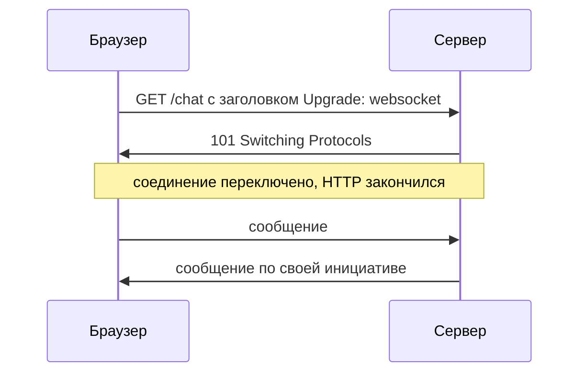
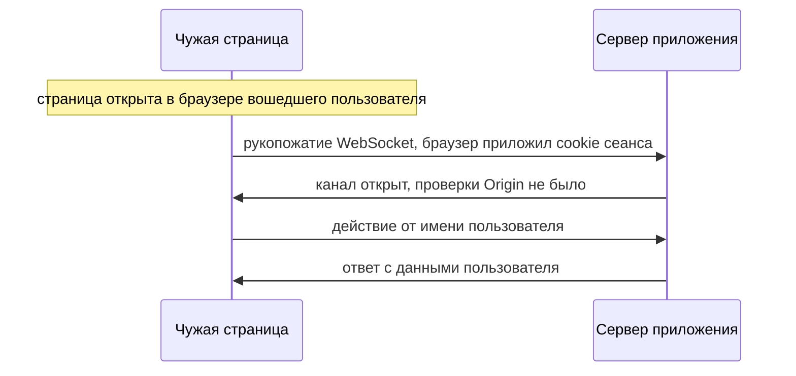

# Уязвимости WebSocket

Прогон на учебном сервере. Две страницы открывают к приложению канал —
постоянное двустороннее соединение по протоколу WebSocket, о котором эта
тема. Первая страница лежит на том же сайте, вторая на чужом, и браузер не
возражает ни разу:

```text
страница того же сайта:   cookie пришла, данные прочитаны
страница другого сайта:   cookie нет, канал всё равно открыт
```

Вторая строка главная: канал открылся и без cookie. Решения о том, кому
открывать канал, браузер не принимает вовсе. А если сервер этого решения не
принимает, канал оказывается открыт для любой страницы в интернете.

## Что такое WebSocket

Протокол HTTP из темы `http-basics` работает по принципу «спросил —
ответил». Сервер молчит, пока клиент не пришлёт запрос, и замолкает снова,
когда ответил. Некоторым приложениям этого мало. Чат, биржевой тикер и
совместное редактирование документа хотят обратного: сервер шлёт новое в тот
момент, когда оно появилось, а не когда его спросили.

До WebSocket это делали опросом: страница каждые пару секунд спрашивала
«есть ли новое?» и почти всегда получала отказ. Приём рабочий, но дорогой:
тысячи пустых запросов плюс задержка, равная периоду опроса. WebSocket решает
задачу иначе. Это постоянное соединение между браузером и сервером, по
которому обе стороны шлют сообщения в любой момент, не дожидаясь запроса.

Бытовое соответствие — разница между перепиской и телефонным звонком. HTTP —
это письма: каждый ответ приходит на конкретное письмо, и без письма ответа
нет. WebSocket — звонок: линия открыта один раз, и говорит любая сторона,
пока кто-то не повесил трубку. Граница аналогии в непрерывности: в телефоне
речь льётся потоком, а по каналу идут отдельные сообщения, порции байтов с
началом и концом.

Открывается соединение рукопожатием. Это обычный запрос HTTP, в котором
страница просит сервер переключить соединение на другой протокол. Если сервер
согласен, он отвечает кодом 101, «переключаю протоколы», и с этого момента
соединение перестаёт быть HTTP. Дальше по нему идут сообщения канала в обе
стороны, пока кто-нибудь его не закроет.



**Описание схемы.** Схема читается сверху вниз. Браузер просит переключения
обычным запросом, сервер соглашается кодом 101, и заметка делит время на до
и после. Ниже этой границы запросов больше нет: сообщения идут в обе
стороны, и сервер вправе послать своё первым.

**Откуда это взялось.** Протокол HTTP отвечает на запрос и замолкает, а
приложениям потребовалось наоборот: сервер шлёт, когда есть что слать.
Обходные приёмы существовали, но были дорогими, и в 2011 году появился
отдельный протокол с рукопожатием поверх HTTP. Описывает его стандарт RFC
6455. Проектировали WebSocket как канал, а не как запрос, и часть привычных
браузерных ограничений на него не перенесли — осознанно. Какое именно
ограничение осталось за бортом, видно в следующем разделе.

**Зачем это в работе AppSec-инженера.** Канал выпадает из проверки чаще
других мест: его трафик не виден в обычном журнале запросов, а обработчики
сообщений лежат вне маршрутов приложения. Ревьюеру хватает двух приёмов.
Первый — найти код, принимающий рукопожатие, и посмотреть, сверяется ли там
поле `Origin`. Второй — найти обработчики сообщений и посмотреть,
проверяются ли их данные так же, как в обычных обработчиках.

## Как это работает

Рукопожатие — обычный запрос HTTP, и читается он как любой запрос из темы
`http-basics`. Вот упрощённый пример, в котором страница приложения открывает
канал к своему серверу.

**Запрос рукопожатия (упрощённый пример)**

```http
GET /chat HTTP/1.1
Host: app.example.com
Upgrade: websocket
Connection: Upgrade
Sec-WebSocket-Key: dGhlIHNhbXBsZSBub25jZQ==
Sec-WebSocket-Version: 13
Origin: https://app.example.com
Cookie: session=c4Tn9
```

**Ответ сервера**

```http
HTTP/1.1 101 Switching Protocols
Upgrade: websocket
Connection: Upgrade
Sec-WebSocket-Accept: s3pPLMBiTxaQ9kYGzzhZRbK+xOo=
```

Строка `Upgrade: websocket` — сама просьба переключить протокол, а код 101 в
ответе — согласие. Пара `Sec-WebSocket-Key` и `Sec-WebSocket-Accept`
техническая: сервер считает из присланного ключа ответное значение и тем
подтверждает, что понял просьбу именно про WebSocket. Cookie приехала по
обычным правилам из темы `cookies`: для неё рукопожатие — такой же запрос к
сайту, как любой другой.

Особенное в этом запросе — поле `Origin`. Стандарт требует, чтобы браузерный
клиент посылал его в рукопожатии всегда, и прямо называет зачем: поле
защищает сервер от использования канала скриптами чужого происхождения. То
есть браузер сообщает серверу, откуда пришла страница, а дальше слово за
сервером.

Решение принимает сервер, и стандарт пишет это прямо. Серверу, не
рассчитанному обслуживать любую страницу, следует сверять `Origin` со списком
ожидаемых источников, а на неприемлемый отвечать кодом 403 (RFC 6455
§ 10.2). Сравните с механизмом CORS (Cross-Origin Resource Sharing, совместное
использование ресурсов между источниками) из темы `cors`: там браузер сам
решает, показывать ли ответ чужой странице. Здесь браузер лишь доставляет сведения, и
вся защита — одна сверка на сервере.

Проверено прогоном. Страница на чужом источнике открыла канал к приложению,
и браузер не помешал. Сервер увидел в рукопожатии источник чужой площадки.
Тот же сервер со сверкой `Origin` рукопожатие отверг, и канал у чужой
страницы не открылся.

У механизма есть предел, и стандарт называет его прямо (RFC 6455 § 10.1).
Поле `Origin` ставит браузер, а клиент, который браузером не работает,
поставит туда что угодно. Таким клиентом может быть скрипт на Python или
чужой бэкенд. Значит, сверка защищает от чужой страницы в браузере
пользователя и не защищает от обращения к серверу напрямую.

Отсюда два разных вопроса к любому каналу. Первый — кто может его открыть, и
это вопрос рукопожатия. Второй — что приходит по уже открытому каналу, и это
вопрос обработки данных. Академия PortSwigger говорит прямо: практически
любой дефект, возникающий при обычных запросах, возникает и внутри канала.

## Как это атакуют

Академия PortSwigger называет атаку cross-site WebSocket hijacking,
межсайтовым захватом канала. Сценарий такой. Пользователь вошёл в приложение,
а затем в том же браузере открыл чужую страницу, например по ссылке из
письма. Скрипт этой страницы открывает канал к приложению. Если правила
cookie позволяют, браузер прикладывает к рукопожатию cookie сеанса. Сервер,
который поле `Origin` не сверяет, рукопожатие принимает. С этого момента
чужая страница работает по каналу от имени вошедшего пользователя.

Механику подделки запроса разбирает тема `csrf-mechanics`: захват канала —
это подделка, направленная в рукопожатие. Отличие в добыче. При подделке
запроса чужая страница отправляет действие и не видит ответа. Здесь
рукопожатие открывает канал, и ответы по нему страница читает. К действию от
имени пользователя добавляются его данные.



**Описание схемы.** Схема читается сверху вниз. Чужая страница исполняется в
браузере вошедшего пользователя и открывает канал к приложению; браузер
прикладывает cookie сеанса сам, как к любому запросу к этому сайту. Сервер
без сверки источника принимает рукопожатие, и дальше по каналу идут действия
от имени пользователя и ответы с его данными.

Условие атаки одно: cookie сеанса должна уехать в рукопожатии. Выполняется
оно не всегда, и прогон на двух раскладках показывает, от чего это зависит.

| Откуда открывают канал | cookie в рукопожатии | канал |
|---|:-:|---|
| страница того же сайта, другой порт | пришла | открылся, данные прочитаны |
| страница другого сайта | не пришла | открылся, данных нет |

Разницу делает атрибут `SameSite` у cookie — тема `samesite-cookies`. При
умолчании браузера cookie не уходит в межсайтовый запрос, а разные порты
одного сайта межсайтовыми не считаются. Отсюда вывод для ревью. Захват опасен
там, где открывающая страница лежит на том же сайте, и там, где cookie
помечена `SameSite=None`: в обоих случаях cookie в рукопожатие уедет. Опасен
он и там, где сеанс держится не на cookie: атрибут `SameSite` управляет
только cookie, и на другой механизм умолчание не действует.

Вторая половина атаки — то, что идёт по уже открытому каналу. Сообщения
канала — обычные недоверенные данные, и академия перечисляет три случая.
Первый: присланное сервер обрабатывает небезопасно, и строка из канала
становится инъекцией, как строка из формы, — те же дефекты, что в темах
`nosql-injection` и `os-command-injection`. Второй: дефект слепой, ответа в
канале не видно, и находят его только внеполосными приёмами, как в теме
`blind-ssrf`. Третий: присланное рассылается другим пользователям и попадает
в их разметку.

Третий случай самый частый. Сообщение чата попадает в разметку страницы
получателя, и если сток выбран как `innerHTML`, канал становится доставкой
хранимого XSS — сам дефект разбирает тема `xss-stored`. Правило починки от
способа доставки не зависит: экранирование по месту вставки, как в теме
`xss-contexts`.

Отдельно академия называет две ошибки уровня замысла. Первая — доверие полям
заголовка рукопожатия при решениях о доступе; выше мы видели, что
небраузерный клиент ставит эти поля сам. Вторая — сеанс. Контекст обработки
сообщений задаётся один раз, рукопожатием, и дефект обработки сеанса
переносится на весь канал целиком.

## Как это выглядит в коде

Ревьюер начинает с обработчика переключения, функции, которая принимает или
отклоняет рукопожатие. Пример ниже написан на библиотеке `ws` для Node.js, и
разбирать его будем тремя планами. Первый план — найти, откуда обработчик
узнаёт пользователя. Второй — найти, сверяет ли он поле `Origin`. Третий —
проследить, куда попадает присланное сообщение. Пока не глядя в выноски:
каких двух проверок здесь нет?

```javascript
// УЯЗВИМО — демонстрация, не для продакшена
server.on('upgrade', (req, socket, head) => {
  const user = sessionFromCookie(req.headers.cookie);        // (1)
  wss.handleUpgrade(req, socket, head, (ws) => {
    ws.on('message', (raw) => {
      const msg = JSON.parse(raw);
      broadcast(`<li>${msg.text}</li>`);                     // (2)
    });
    ws.send(JSON.stringify({ balance: user.balance }));
  });
});
```

1. Сеанс берётся из cookie, а поле `Origin` не читается вовсе. Рукопожатие с
   чужой страницы будет принято от имени вошедшего пользователя: это захват
   канала из раздела выше.
2. Сообщение попадает в разметку склейкой и рассылается другим пользователям.
   Строка пользователя вставится в страницу получателя как есть: сток
   хранимого XSS внутри канала.

Признаки при ревью чужого кода: обработчик переключения без обращения к
`req.headers.origin`; разбор строки без проверки формы. Ещё два: рассылка
присланного другим пользователям; адрес канала, собранный из значения,
пришедшего из браузера.

Этот обработчик ломает обе половины правила разом: рукопожатие не проверено
как запрос, сообщение не проверено как данные. Пишется такой код одним
куском, поэтому одна находка в ревью здесь почти всегда означает вторую.
Скажите, не подглядывая дальше: сверка `Origin` появилась, а рассылка
осталась склейкой разметки. Какая половина темы остаётся открытой и чем это
кончается для получателей сообщений?

## Как защититься

Правило одно: рукопожатие проверяется как запрос, сообщения — как данные.
Исправление читайте теми же тремя планами. Где сверяется источник и как
выглядит отказ. Чем заменена cookie как признак сеанса. Как проверяется форма
сообщения перед рассылкой.

```javascript
// Исправлено.
const TRUSTED = new Set(['https://app.example.com']);

server.on('upgrade', (req, socket, head) => {
  if (!TRUSTED.has(req.headers.origin)) {                    // (1)
    socket.end('HTTP/1.1 403 Forbidden\r\n\r\n');
    return;
  }
  const user = sessionFromWsToken(req.url);                  // (2)
  wss.handleUpgrade(req, socket, head, (ws) => {
    ws.on('message', (raw) => {
      const msg = safeParse(raw);                            // (3)
      if (msg) broadcast(msg.text);
    });
  });
});
```

1. Сверка `Origin` со списком доверенных источников и отказ кодом 403: ровно
   это предписывает стандарт, и это требование ASVS v5.0-4.4.2.
2. Отдельный признак сеанса для канала, полученный через уже пройденную
   проверку подлинности, — требование ASVS v5.0-4.4.4. Одной cookie мало:
   именно она и уезжает в чужом рукопожатии. Токен выдаётся странице после
   обычного входа, и при открытии канала она подставляет его в адрес:
   браузерный API WebSocket не даёт добавить к рукопожатию свои заголовки.
3. Форма сообщения проверяется, а рассылка идёт значением, а не разметкой.
   Выбор стока по месту вставки разбирает тема `xss-contexts`.

**Границы применимости.** Проверка `Origin` не защищает от клиента, который
не браузер: поле такой клиент ставит сам. Поэтому сверка — мера против чужой
страницы, а не замена проверке прав. Список доверенных источников ведётся
списком, а не шаблоном: шаблон с подстановкой поддомена возвращает ту же
беду, что у обработчика сообщений между окнами в теме `postmessage-vulns`.

**Что добавляется поверх.** Адрес канала начинается со схемы, и схем две, как
у HTTP: незащищённая `ws` и защищённая `wss`. Канал поднимают по схеме `wss`,
то есть поверх транспортного шифрования TLS (Transport Layer Security) из
темы `tls-and-proxy`, — требование ASVS v5.0-4.4.1. Адрес канала задают
постоянной строкой: академия называет отдельной мерой не собирать его из
значений, которыми распоряжается браузер.

## Частая ошибка

Кто по протоколу решает, кому открывать канал — браузер или сервер? Решите,
прежде чем читать дальше.

Отвечают на этот вопрос по привычке: канал открывается из браузера, значит,
действует политика одного источника из темы `same-origin-policy`, и чужая
страница до приложения не доберётся.

Это неверно: политика одного источника на рукопожатие не распространяется.
Протокол не поручает браузеру решать, кому позволено открыть канал. Он
поручает браузеру сообщить серверу источник страницы, а решение оставляет
серверу.

Контрпример из прогонов этой темы. Страница чужого источника открыла канал к
приложению, и браузер не возразил ни разу. Сервер увидел рукопожатие с cookie
сеанса и отдал в канал данные пользователя. Тот же прогон со сверкой `Origin`
на сервере закончился отказом 403. Разница — одна проверка на сервере, и
участия браузера в ней нет.

## Чеклист для ревью

1. Проверьте, что обработчик переключения сверяет поле `Origin` со списком
   доверенных и отвечает отказом на прочие (ASVS v5.0-4.4.2).
2. Проверьте, что признак сеанса для канала получен через уже пройденную
   проверку подлинности, а не сводится к cookie рукопожатия (ASVS
   v5.0-4.4.4).
3. Проверьте, что канал поднимается по схеме `wss`, а не по незащищённой
   (ASVS v5.0-4.4.1).
4. Проверьте, что данные из канала проверяются на сервере так же, как данные
   обычного запроса (WSTG-v42-CLNT-10).
5. Проверьте, что сообщения, рассылаемые другим пользователям, попадают в
   разметку через сток, выбранный по месту вставки.
6. Проверьте, что адрес канала задан постоянной строкой, а не собран из
   значения, пришедшего из браузера.

## Попробуй сам

Возьмите приложение с каналом реального времени — чатом, уведомлениями или
живой лентой — и ответьте на три вопроса по его коду. Сверяет ли обработчик
переключения поле `Origin`. Чем определяется пользователь для сообщений
канала: cookie рукопожатия или отдельным признаком. Куда попадает содержимое
сообщения у получателя.

**Критерий выполнения** наблюдаемый: три ответа и вывод, какая из двух
половин темы на этом приложении открыта — рукопожатие или обработка данных. И
одно предложение о том, что помешает захвату канала, если проверку `Origin`
не добавлять.

## Проверь себя

1. Обработчик переключения не читает поле `Origin`:

   ```javascript
   server.on('upgrade', (req, socket, head) => {
     const user = sessionFromCookie(req.headers.cookie);
     wss.handleUpgrade(req, socket, head, (ws) => { /* канал открыт */ });
   });
   ```

   Чужая страница того же сайта, но с другого порта, открывает канал
   браузером вошедшего пользователя. Что ответит сервер и чьи данные уйдут в
   канал?
2. Какая правка устраняет дефект из вопроса 1?

   A. Ничего не менять: политика одного источника не пустит чужую страницу.

   B. Сверять `Origin` со списком доверенных и отвечать 403, а признак сеанса
      брать из отдельного токена канала.

   C. Проверять поле `Origin` у каждого сообщения канала, а не только в
      рукопожатии.

3. Почему проверка `Origin` не защищает от клиента, который не браузер?
4. Предскажите, что напечатает эта модель исправленного обработчика.

   ```javascript
   const TRUSTED = new Set(['https://app.example.com']);
   function upgrade(origin) {
     if (!TRUSTED.has(origin)) return 403;
     return 101;
   }
   console.log(upgrade('https://evil.example'));
   console.log(upgrade('https://app.example.com'));
   ```

5. Возврат к теме `same-origin-policy`: чем этот случай отличается от чтения
   чужого документа в кадре?
6. Возврат к теме `csrf-mechanics`: чем захват канала отличается от подделки
   запроса по тому, что получает чужая страница?

<details markdown="1">
<summary>Ответ 1</summary>

1. Канал откроется. Страница того же сайта, поэтому cookie в рукопожатие
   приехала — это первая строка таблицы из раздела «Как это атакуют». А
   проверять `Origin` некому: браузер поле послал, решение принимает сервер,
   и он его принял. В канал уйдут данные вошедшего пользователя, и чужая
   страница их прочитает. Со страницы другого сайта при умолчании `SameSite`
   cookie бы не приехала, и добычи у атакующего не было бы.

</details>

<details markdown="1">
<summary>Ответ 2: разбор вариантов</summary>

2. Верный ответ — B.

   A. Неверно. Политика одного источника на рукопожатие не распространяется:
      браузер чужую страницу не остановил ни разу. Протокол поручает браузеру
      сообщить источник, а решение оставляет серверу.

   B. Верно. Сверка со списком и отказ 403 — ровно предписание RFC 6455 и
      ASVS v5.0-4.4.2. А признак сеанса через отдельный токен закрывает то,
      что cookie уезжает в чужом рукопожатии сама.

   C. Неверно и невозможно: у сообщений канала нет заголовков — поле `Origin`
      существует только в рукопожатии. Контекст сеанса задаётся рукопожатием,
      и потому проверка живёт именно там.

</details>

<details markdown="1">
<summary>Ответ 3</summary>

3. Поле ставит сам клиент, и тот, кто работает не браузером, поставит туда
   любое значение. Проверка работает против чужой страницы, а не против
   прямого обращения.

</details>

<details markdown="1">
<summary>Ответ 4</summary>

4. `403`, затем `101`: чужой источник отвергнут, свой переключён. Прогон:
   фрагмент из вопроса, сохранённый как `probe.mjs`, — `node probe.mjs`.

</details>

<details markdown="1">
<summary>Ответ 5</summary>

5. Там политика запрещает чтение и делает это сама. Здесь она не запрещает
   ничего, и весь запрет сводится к одной проверке на сервере.

</details>

<details markdown="1">
<summary>Ответ 6</summary>

6. При подделке запроса чужая страница отправляет действие и не видит ответа.
   Здесь рукопожатие открывает канал, и ответы по нему страница читает —
   добыча не только действие от имени пользователя, но и его данные.

</details>

## Источники

1. PortSwigger Web Security Academy, «Testing for WebSockets security
   vulnerabilities»; реестр `ps-websockets`. Разделы: WebSockets, WebSockets
   security vulnerabilities, Manipulating WebSocket messages to exploit
   vulnerabilities, Manipulating the WebSocket handshake to exploit
   vulnerabilities, Using cross-site WebSockets to exploit vulnerabilities,
   How to secure a WebSocket connection.
   <https://portswigger.net/web-security/websockets>
2. OWASP Top 10:2025, «A07:2025 Authentication Failures»; реестр
   `owasp-top10-2025-a07`. Раздел: Mapped CWEs — CWE-346.
   <https://owasp.org/Top10/2025/A07_2025-Authentication_Failures/>
3. IETF, RFC 6455 «The WebSocket Protocol»; реестр `rfc6455-websocket`.
   Разделы: § 1.3 Opening Handshake (назначение поля `Origin`), § 4.1 п. 8
   (требование к клиенту), § 10.1 Non-Browser Clients, § 10.2 Origin
   Considerations.
   <https://www.rfc-editor.org/rfc/rfc6455.html>

Каркас этапа: `owasp-asvs-5-document` (ASVS v5.0.0), `owasp-wstg-42`,
`owasp-top10-2025`. Наследуются всеми темами и отдельной строкой не
повторяются.

**Скоропортящийся слой.** Умолчания браузеров по атрибуту `SameSite` менялись
и влияют на условие захвата канала напрямую. Инструменты перехвата сообщений
канала обновляются вместе с версиями. Страница академии — живая площадка без
даты публикации.

**Маркеры уверенности.** Поведение рукопожатия — **проверено лично**
2026-08-24 в браузере `HeadlessChrome/152.0.7977.42` на своём сервере
рукопожатия: страница чужого источника открыла канал, сервер увидел в
рукопожатии её источник; при открытии со страницы того же сайта в рукопожатие
пришла cookie сеанса и данные пользователя вернулись в канал; при открытии с
другого сайта cookie не пришла, а канал всё равно открылся; сервер, сверявший
`Origin`, рукопожатие отверг. Требование к браузеру посылать поле `Origin`,
рекомендация серверу сверять его и отвечать кодом 403, оговорка про клиента,
который браузером не работает, — **по документации** (RFC 6455, открыт лично
2026-08-24). Захват канала с чужого сайта, перечень дефектов внутри канала и
меры защиты — **по документации** (Web Security Academy, открыта лично
2026-08-24). Требования 4.4.1, 4.4.2 и 4.4.4 сверены с текстом ASVS v5.0.0
(открыт лично 2026-08-24). Категории `A07:2025` и `A01:2025` сверены со
списками сопоставленных CWE на страницах категорий (открыты лично
2026-08-24). Модель из вопроса 4 прогнана локально 2026-10-03 на Node.js
v26.10.0: вывод `403`, затем `101` — совпал с ответом дословно. Перехват и
правка сообщений уже открытого канала инструментом лично **не
воспроизводились**: платного инструмента в границах миссии нет.
