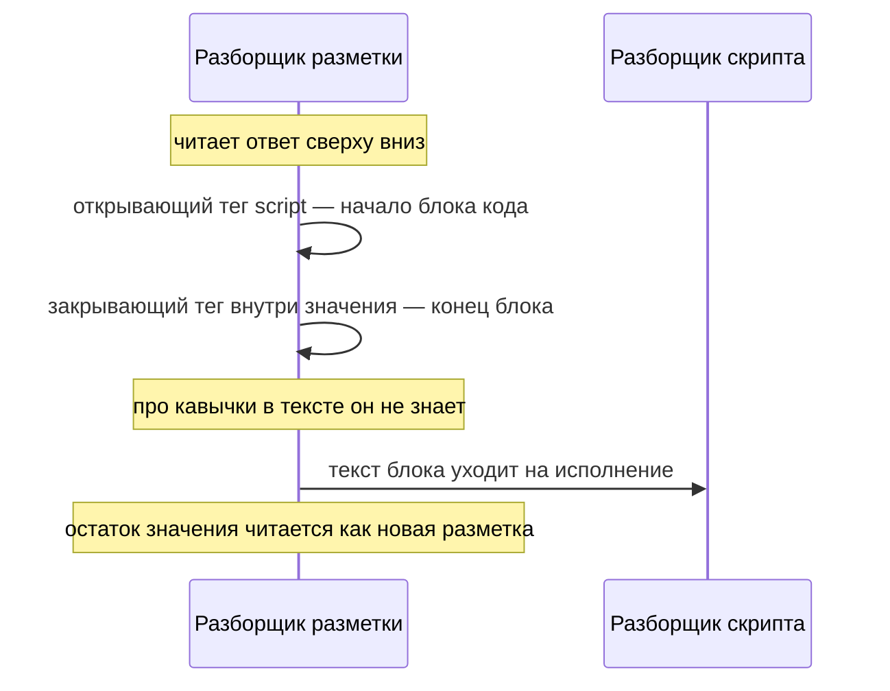

# Контексты вставки и экранирование

Карточка товара на стенде этой темы написана аккуратно. Автор знал про
экранирование и вызвал его у каждого из пяти мест, куда на страницу попадает
присланное значение. Функция заменяет все положенные знаки, пропусков нет, и
ревьюер с вопросом «экранирование есть?» такую карточку пропускает. Прогон
атаки на этой карточке выглядит так:

**Запуск атаки на исходной карточке лабы**

```bash
cd pilot/lab/xss-contexts
node hack.mjs
```

```text
  опыт 1 — значение атрибута без кавычек: СКРИПТ ИСПОЛНЕН
  опыт 2 — адрес javascript: в ссылке: СКРИПТ ИСПОЛНЕН
  опыт 3 — выход из элемента script: СКРИПТ ИСПОЛНЕН
```

Экранирование стоит везде, а скрипт исполняется в трёх местах из пяти. Если вы
писали `escHtml(v)` в шаблоне и считали вопрос закрытым — вот цена этой
привычки. Причина в том, что верность экранирования решает не само значение,
а место вставки: участок разметки вокруг подстановки вместе с правилами
разбора, которые в нём действуют. Такой участок называется контекстом вставки,
и вопрос к нему один: что здесь заканчивает вставку. Эта тема — несущая
страница подраздела: у остальных его тем ответ на вопрос «как чинится»
сводится к тому, что разобрано здесь.

**Зачем это в работе AppSec-инженера.** Половина находок по XSS в живом коде —
не «экранирования нет», а «экранирование есть, но не то». Такое место читается
как защищённое: рядом стоит вызов с правильным именем. Отличить его от
настоящей защиты можно единственным способом — посмотреть на разметку вокруг
подстановки и спросить, что в этом месте заканчивает вставку. Тот же вопрос
превращается в чеклист ревью в конце темы, а не в перебор нагрузок.

## Подумай, прежде чем читать

1. Значение экранировано сущностями HTML и подставлено в атрибут, у которого
   нет кавычек. Что здесь пойдёт не так?
2. В строке `javascript:doSomething()` есть хотя бы один знак, который
   заменяют сущности HTML?
3. Значение экранировано сущностями и подставлено внутрь элемента `script`.
   Что увидит код: кавычку или последовательность из шести знаков?

Ответы приходят по ходу чтения, а в конце темы те же вопросы встретятся
снова — уже как проверка.

## Как это работает

**Откуда это взялось.** Пока страница была одним документом с текстом, место
вставки было одно, и одного правила экранирования хватало. Затем страница
стала слоёной: в неё въехали атрибуты, адреса, встроенные скрипты и стили. У
каждого слоя оказался свой разборщик — часть браузера, которая читает свой
кусок ответа по своим правилам. А функция экранирования осталась одна на всё
приложение, та самая, что писалась под первый слой. Так появился самый частый
дефект этого класса: экранирование стоит, вызвано верно и не защищает, потому
что выбрано под другое место.

Контекст вставки — это и есть такое место: участок разметки, куда попадает
значение, вместе с правилами его разборщика. Бытовое соответствие здесь —
поле бумажного бланка. Одна и та же запись читается по-разному в зависимости
от того, в какое поле она попала. В графе «фамилия» это текст, в графе
«индекс» те же знаки ждут как цифры, а в графе «подпись» их не читают вовсе.

| В бланке | В разметке страницы |
|---|---|
| поле, куда попала запись | место вставки значения |
| правила заполнения поля | правила разборщика этого места |
| рамка поля | то, что заканчивает вставку |

Аналогия ломается на рамке. В бланке её напечатали заранее, и запись рамку не
сдвинет. В разметке границу задаёт само значение: кавычка или пробел внутри
присланной строки закрывают место раньше, чем рассчитывал автор, и хвост
значения вываливается наружу, в разметку.

PortSwigger Web Security Academy, учебный полигон авторов Burp Suite, называет
определение контекста первой задачей при проверке на XSS. Оно складывается из
двух вещей: где именно в ответе оказалось значение и что с ним сделали по
дороге. Место и обработка решают вместе.

### Разбор по общей рамке

Рамка та же, что в `xss-reflected`. **Источник** — присланное значение.
**Путь** — код, доводящий его до шаблона. **Сток** — конкретное место
разметки: тело, атрибут, адрес, скрипт, стиль. **Отсутствующий контроль** —
совпадение правила экранирования с правилами разбора в этом месте.

Этим тема отличается от `xss-reflected`. Там контроля не было вовсе. Здесь он
есть и неверен, а на глаз эти два случая неотличимы.

### Тело документа

Значение стоит между тегами: `<p>Метка: ЗНАЧЕНИЕ</p>`. Вставку здесь
заканчивает открывающая угловая скобка, потому что с неё начинается новый
элемент. Нагрузка `` пользуется именно этим: браузер
встречает скобку и заводит элемент, а обработчик `onerror` исполняет код.

Правило — сущности HTML, те самые из `xss-reflected`. Знак разметки
записывается именем или кодом после амперсанда: `<` превращается в `&lt;`, и
разборщик выводит знак как текст, а не начинает элемент. Памятка OWASP (cheat
sheet — шпаргалка проекта по теме) называет набор из пяти знаков: `&`, `<`,
`>`, `"` и `'`. Двух последних в теле документа хватило бы и без замены. Они
попали в набор потому, что одна функция закрывает и это место, и соседнее —
значение атрибута в кавычках.

Проверено прогоном: значение ``, отданное в тело без
экранирования, исполняется; оно же после замены на сущности выводится
буквально.

### Атрибут в кавычках

Значение стоит в кавычках: `<input value="ЗНАЧЕНИЕ">`. Вставку заканчивает
кавычка, которой атрибут закрыт. Академия показывает две нагрузки для этого
места. Первая закрывает атрибут и тег и открывает свой. Вторая обходится без
угловых скобок: она закрывает кавычку и дописывает к тому же элементу два
атрибута — `autofocus` и обработчик события.

Правило — те же сущности HTML, но теперь замена кавычек обязательна: на ней
всё и держится.

### Атрибут без кавычек

Разметка разрешает писать значение атрибута без кавычек: `data-mark=ЗНАЧЕНИЕ`.
Это отдельный контекст, и сущности его не закрывают, потому что вставку там
заканчивает пробел. Разборщик читает значение до первого пробела, а всё
дальше считает новыми атрибутами того же элемента.

Картина знакомая по командной строке: аргумент с пробелом без кавычек
распадается на два, и `cp мой файл.txt /tmp` копирует не то. Здесь то же
самое, только «лишними аргументами» становятся атрибуты: нагрузка
`x autofocus onfocus=...` даёт элементу фокус и обработчик на него. Проверено
прогоном лабы: это значение, пропущенное через замену пяти знаков на сущности
и подставленное в `data-mark=ЗНАЧЕНИЕ`, исполняется. Ни одного из пяти
заменяемых знаков в нагрузке нет.

У того же места есть вторая сторона, чисто прикладная. Законное значение
`скидка 20 %` в атрибуте без кавычек обрезается по первому пробелу. Такое
место неверно не только по безопасности — оно сломано и по существу, и потому
починка здесь структурная: поставить кавычки.

### Адрес

Значение становится адресом: `<a href="ЗНАЧЕНИЕ">`. У адреса есть схема —
слово до первого двоеточия; устройство адреса разбирает тема
`url-and-encoding`. У обычной ссылки схема `https`. Но браузер согласен
считать адресом и слово `javascript:`: такая ссылка не ведёт на страницу, а
исполняет текст после двоеточия как скрипт, когда по ней нажимают. Академия
отмечает случай прямо: бывает, что атрибут сам создаёт место для кода, и
тогда закрывать кавычку не нужно вовсе.

Экранирование сущностями здесь бесполезно, и причина арифметическая: в строке
`javascript:doSomething()` нет ни одного из пяти заменяемых знаков. Проверено
прогоном: такой адрес после экранирования остаётся рабочим и исполняется по
нажатию.

Правило — не экранирование, а проверка. Памятка требует сначала
канонизировать значение, то есть привести его к одному виду: раскрыть
сущности и процентные записи, чтобы нагрузка не пряталась за записью вроде
`&#106;avascript:doSomething()`. Затем значение проверяется как адрес, и
остаются только разрешённые схемы. Стандарт верификации ASVS говорит то же:
требование v5.0-1.2.2 называет запрещённые схемы поимённо — `javascript:` и
`data:`.
Процентное кодирование при этом остаётся нужным, но для другого — для
значения параметра внутри адреса, который приложение собирает само.

### Строка внутри элемента `script`

Значение стоит в кавычках внутри встроенного скрипта:
`<script>var m = 'ЗНАЧЕНИЕ';</script>`. Здесь работают два разборщика по
очереди, и порядок между ними решает всё. Академия объясняет его так: браузер
сначала разбирает разметку и выделяет блоки скрипта и лишь потом разбирает и
исполняет код внутри.



**Описание схемы.** Два разборщика работают по очереди, и схема читается
сверху вниз. Сначала разборщик разметки идёт по ответу. Открывающий тег
`script` начинает блок кода, а первый же закрывающий тег блок заканчивает.
Это срабатывает и тогда, когда закрывающий тег приехал внутри присланного
значения. Про кавычки в тексте разметка не знает ничего, поэтому
экранированная кавычка её не останавливает. Только потом текст блока уходит
разборщику скрипта, а остаток значения читается уже как новая разметка со
своими элементами.

Отсюда главная нагрузка этого места — закрывающая последовательность самого
элемента `script`, запись `</script>`. Она заканчивает блок кода на шаге
разбора разметки, до того как код вообще прочитан, и срабатывает даже внутри
присланной строки. Проверено прогоном лабы: значение, экранированное обратным
слэшем перед кавычкой, выходит из скрипта и исполняется. В листингах темы та
же последовательность записана как `<\/script>`. Обратный слэш не меняет
вывод, а бережёт сам исходник. Без него последовательность закрыла бы
элемент `script` прямо в тексте программы, окажись он встроен в страницу.

Сущности HTML это место тоже не закрывают, и по неожиданной причине. Внутри
элемента `script` браузер сущности не раскрывает: текст там читается как
данные кода, а не как разметка. Проверено прогоном: строка `a&#x27;+&#x27;b`,
положенная в литерал скрипта, приезжает в код пятнадцатью знаками — как есть.
Нагрузку это остановит, а законное значение с апострофом испортит:
пользователь увидит `&#x27;` вместо кавычки.

Правило — отдать значение готовым литералом. Памятка требует кодировать знаки
в вид `\uXXXX` — шестнадцатеричным кодом знака после `\u` — и ставить
значение только внутрь кавычек. На практике короче собрать литерал вызовом
`JSON.stringify`: он возвращает значение уже в кавычках, и остаётся
дополнительно закрыть знаки разметки. Без этого шага литерал не защищён от
опыта 3: `JSON.stringify` не трогает угловую скобку, и `</script>` внутри
значения по-прежнему закроет блок на разборе разметки. Ещё короче — не
ставить значение в скрипт вовсе, а положить его в атрибут данных и прочитать
оттуда. Атрибут данных (`data-*`) — произвольный атрибут элемента для своих
значений; `data-mark` в лабе — именно такой.

### Обработчик события — отдельный случай

Обработчик выглядит как атрибут, а внутри у него код: `onclick="var m =
'ЗНАЧЕНИЕ'"`. Обработчик события — это атрибут вроде `onclick` или `onfocus`,
значением которого служит текст скрипта; браузер исполняет его, когда событие
случается. Порядок разбора здесь обратный тому, что в элементе `script`:
браузер сначала раскрывает сущности в значении атрибута и лишь потом отдаёт
получившееся разборщику кода.

Проверено прогоном: строка `a&#x27;+&#x27;b` в элементе `script` осталась
собой, а в значении `onclick` превратилась в `'a'+'b'` и была вычислена как
`ab`. Практический вывод жёсткий: экранирование сущностями внутри обработчика
не защищает, а помогает нагрузке — оно даёт способ протащить кавычку мимо
фильтра, который её вырезал.

### Стиль и шаблонный литерал

Памятка добавляет ещё одно место: значение свойства стиля,
`style="width: ЗНАЧЕНИЕ"`. Ставить туда присланное разрешено только как
значение свойства, и кодирование там своё, шестнадцатеричное. Всё остальное в
стиле — имя свойства, селектор — присланным быть не должно.

Академия называет и место, которого не было десять лет назад: шаблонный
литерал JavaScript. Это строка в обратных кавычках, внутри которой работает
подстановка выражения `${...}`; листинги этой темы собраны именно такими
строками. Выходить из шаблонного литерала не нужно вовсе: подстановка
вычисляется при разборе литерала, и нагрузка исполняется внутри него.

### Куда присланное не ставят вовсе

Памятка перечисляет места, где экранирования не хватает ни при каком выборе
правила, и предписывает не ставить туда присланное вообще.

- Имя тега и имя атрибута: `<ЗНАЧЕНИЕ href="/">`.
- Тело комментария разметки.
- Внутренность элемента стиля.
- Код внутри элемента `script` вне строкового литерала.

Список короткий и запоминается целиком. В ревью он работает как отсечка: если
подстановка стоит в одном из этих мест, разговор об экранировании не
начинается, переделывается само место. Про комментарий разметки тут видно и
почему: вставку в нём заканчивает последовательность `-->`, сущности её не
трогают, и потому место в списке запретных.

## Как это атакуют

Стенд — лаба этой темы, каталог `pilot/lab/xss-contexts`. Карточка товара
выводит одно присланное значение в пяти местах: тело документа, атрибут в
кавычках, атрибут без кавычек, адрес ссылки, строка внутри элемента `script`.
Экранирование применено везде: сущности в четырёх местах, обратный слэш перед
кавычкой — в пятом. Полный прогон содержит три нагрузки и два контроля:

**Запуск атаки**

```bash
cd pilot/lab/xss-contexts
node hack.mjs
```

```text
  опыт 1 — значение атрибута без кавычек: СКРИПТ ИСПОЛНЕН
  опыт 2 — адрес javascript: в ссылке: СКРИПТ ИСПОЛНЕН
  опыт 3 — выход из элемента script: СКРИПТ ИСПОЛНЕН
  опыт 4 — контроль, обычное значение в пяти местах: …
  опыт 5 — контроль, знаки разметки и кавычки: показаны буквально
```

Строка четвёртого опыта обрезана: в полной видно, что место `unquoted`
получило значение `скидка` вместо `скидка 20 %`, а остальные четыре места
получили значение целиком.

Опыт 1 — атрибут без кавычек. Ни одного заменяемого знака в нагрузке нет,
поэтому экранирование пропускает её целиком.

Опыт 2 — адрес. Нагрузка состоит из букв, двоеточия и скобок; сущности её не
трогают. Исполнение происходит по нажатию на ссылку.

Опыт 3 — строка внутри элемента `script`. Закрывающая последовательность
элемента заканчивает блок кода на разборе разметки, до разбора кода.

Опыт 4 — контроль, и он на исходной карточке красный: законное значение
`скидка 20 %` в атрибуте без кавычек обрезано по пробелу. Место сломано в обе
стороны сразу: нагрузку пропускает, законное значение портит. Опыт 5 —
контроль, который остаётся зелёным: тело документа и атрибут в кавычках
экранированы верно.

Опыты идут не в порядке разметки, а в порядке цены починки. Первый закрывается
кавычками — правкой на два знака. Второй требует завести проверку адреса.
Третий заставляет переделать способ передачи значения в скрипт.

Последний шаг атакующего — оценить добычу. Из пяти мест защищены два, и
оба — те, под которые правило и писалось. Три остальных открыты, при том что
вызов экранирования стоит у каждого.

## Как это выглядит в коде

Ревьюер смотрит не на вызов, а на разметку вокруг подстановки. Листинг
читается по пяти местам: тело, атрибут в кавычках, атрибут без кавычек, адрес,
строка в скрипте. Не подсматривая в выноски, найдите три места, где
подстановка остаётся опасной, и назовите причину для каждого.

```javascript
// ФРАГМЕНТ — срез, самостоятельно не компилируется
// УЯЗВИМО — демонстрация, не для продакшена
return `
<p id="body">Метка: ${escHtml(v)}</p>
<input id="quoted" value="${escHtml(v)}">
<input id="unquoted" data-mark=${escHtml(v)}>          // (1)
<a id="link" href="${escHtml(v)}">перейти</a>          // (2)
<script>window.mark = '${escQuote(v)}';<\/script>`;    // (3)
```

1. Кавычек вокруг значения нет. Вызов экранирования стоит и не помогает.
2. Место требует проверки схемы, а стоит замена знаков разметки.
3. Экранирована кавычка, а вставку заканчивает не она.

Признаки, по которым это находится глазами, три. Знак равенства сразу перед
подстановкой без кавычки после него. Подстановка в атрибут, имя которого
`href`, `src`, `action` или `formaction`. Подстановка между открывающей и
закрывающей частями элемента `script`.

**Ложное срабатывание.** Подстановка внутри элемента `script`, отданная
готовым литералом. `window.mark = ${forScript(v)}` без кавычек вокруг — это
верная запись: значение уже приехало литералом, и знаки разметки в нём
закрыты.

## Как защититься

Правило одно и общее: у каждого места вставки спрашивается, что здесь
заканчивает вставку, и правило выбирается под ответ.

| Контекст | Что заканчивает вставку | Что применяют |
|---|---|---|
| тело документа | открывающая угловая скобка | сущности HTML |
| атрибут в кавычках | кавычка атрибута | сущности HTML |
| атрибут без кавычек | пробел | кавычки, потом сущности |
| адрес в `href`, `src` | схема адреса | список разрешённых схем |
| строка в элементе `script` | конец элемента `script` | литерал JSON |
| обработчик события | сущность, потом кавычка | не ставить присланное |
| значение свойства стиля | конец значения | кодирование стиля |

Стандарт верификации формулирует то же тремя требованиями подряд: ASVS
v5.0-1.2.1 — для разметки, v5.0-1.2.2 — для адреса, v5.0-1.2.3 — для кода.
Три требования, одна мысль.

Исправленный вариант читается тремя планами: поставить кавычки вокруг
атрибута, проверить адрес до экранирования, передать значение в скрипт готовым
литералом.

```javascript
// ФРАГМЕНТ — срез, самостоятельно не компилируется
// Исправлено.
return `
<p id="body">Метка: ${escHtml(v)}</p>
<input id="unquoted" data-mark="${escHtml(v)}">        // (1)
<a id="link" href="${escHtml(safeUrl(v))}">перейти</a> // (2)
<script>window.mark = ${forScript(v)};<\/script>`;     // (3)
```

1. Кавычки поставлены. Теперь замена пяти знаков закрывает место целиком.
2. Адрес сначала проверен по схеме, и только потом экранирован как значение
   атрибута. Порядок именно такой: памятка называет типовой ошибкой обратный.
3. Значение уезжает готовым литералом JSON, в котором дополнительно закрыты
   знаки разметки. Кавычек вокруг подстановки нет: литерал их несёт сам.

**Первый рубеж — не своя функция.** Шаблонизатор — библиотека, которая
собирает страницу из заготовки с метками подстановки, — умеет экранировать
каждую подстановку сам. Такое автоэкранирование закрывает тело документа и
атрибут в кавычках без участия автора. Чего оно не знает — это адреса и
скрипта: подстановка в `href` или в блок кода выглядит для него такой же, как
подстановка в абзац. Поэтому проверка ревьюера сосредоточена на двух местах
из семи.

**Границы применимости.** Экранирование по контексту закрывает текст. Если по
требованию присылается именно разметка — редактор с оформлением, комментарий
со ссылками, — экранирование ломает задачу. Тогда ставится санитайзер:
библиотека, которая разбирает присланную разметку и вырезает из неё всё вне
списка разрешённого. Разбор его слабых мест — тема `xss-filter-bypass`. И если
контекст вложенный — значение попадает в адрес, который стоит в атрибуте, —
правила применяются по порядку разбора: сначала проверка адреса, затем
экранирование атрибута. Памятка разбирает этот случай отдельно как самый
частый источник двойного преобразования.

**Что добавляется поверх.** Политика содержимого (Content Security Policy,
CSP) не даёт исполниться внедрённому скрипту там, где место вставки выбрано
неверно. Она не заменяет экранирование и в подразделе разбирается отдельно —
тема `csp-bypass`.

## Как убедиться, что защита работает

Ретест — повторная проверка после починки — повторяет три нагрузки и
добавляет два контроля. Та же программа запускается против образцового
решения:

**Ретест против исправленной карточки**

```bash
cd pilot/lab/xss-contexts
LAB_TARGET=solution.mjs node hack.mjs
```

```text
  опыт 1 — значение атрибута без кавычек: скрипт не исполнен
  опыт 2 — адрес javascript: в ссылке: скрипт не исполнен, href="/"
  опыт 3 — выход из элемента script: скрипт не исполнен
  опыт 4 — контроль, обычное значение в пяти местах: везде показано целиком
  опыт 5 — контроль, знаки разметки и кавычки: показаны буквально
```

Опыт 4 после починки становится зелёным, и это отдельный признак: значение с
пробелом доехало до атрибута целиком. В опыте 2 напечатан итоговый адрес:
проверка отбросила чужую схему и вернула корень.

Регресс закрывается тестами функциональности. В лабе их десять, и проверяют
они каждое место по отдельности. Среди них обычное значение во всех пяти
местах, пустое значение, амперсанд, двойная кавычка, апостроф в скрипте,
число, путь в адресе.

Порядок починки виден по замеру: кавычки вокруг атрибута снимают два провальных
опыта из четырёх, проверка схемы — ещё один, литерал JSON — последний.
Частичная правка здесь особенно опасна тем, что выглядит завершённой.

**Чеклист для ревью.** Всё сказанное выше собирается в семь проверок, каждая
смотрит на своё место дефекта:

1. Проверьте, что у каждого места подстановки определён контекст: тело,
   атрибут, адрес, скрипт, стиль (ASVS v5.0-1.2.1).
2. Проверьте, что значения всех атрибутов заключены в кавычки, включая те,
   куда подставляется число.
3. Проверьте, что схема адреса из присланного значения сверена со списком
   разрешённых: `javascript:` и `data:` не проходят (ASVS v5.0-1.2.2).
4. Проверьте, что значение, попадающее в код, отдаётся готовым литералом, а
   не подставляется в кавычки внутри элемента `script` (ASVS v5.0-1.2.3).
5. Проверьте, что присланное значение не подставляется в обработчик события,
   в имя тега, в имя атрибута, в комментарий разметки и в элемент стиля.
6. Проверьте, что при вложенных контекстах правила применены по порядку
   разбора, а не в обратном.
7. Проверьте, что автоэкранирование шаблонизатора включено, а места, которых
   оно не покрывает — адрес и скрипт, — разобраны отдельно (WSTG-v42-INPV-01).

## Как это находят инструменты

Часть этого дефекта видна по форме шаблона, и её ловит статический анализ
(static application security testing, SAST). Это разбор кода без запуска:
инструмент читает текст программы и ищет дефекты по правилам. Два правила без
всякой пометки данных смотрят на место вставки. Первое ищет подстановку в
атрибут, не заключённый в кавычки. Второе — подстановку в строковый литерал
внутри элемента `script`.

Оба правила лежат в `pilot/semgrep/html-context-mismatch.yaml` и написаны для
Semgrep, свободного анализатора, который ищет фрагменты кода по шаблону.
Правила сверены прогоном: на уязвимом файле лабы две находки, на решении —
ноль, на десяти размеченных тест-кейсах расхождений нет. Уверенность у обоих
объявлена высокой, и это оправданно: признак структурный, а не догадка о
происхождении значения.

**Что правила пропустят.** Разметку, собранную не шаблонной строкой:
конкатенацией, шаблонизатором с собственным синтаксисом, деревом элементов.
Атрибут, кавычки вокруг которого поставлены в другой части шаблона.
Подстановку в адрес: отличить `href="${v}"` с проверкой схемы от такого же без
неё по форме нельзя.

**Какой шум дадут.** Подстановку в атрибут без кавычек там, где значение
заведомо постоянное или числовое: `width=${SIZE}` из константы модуля. Находка
верна по форме и не важна по существу, и это цена структурного признака.

Про адрес стоит сказать отдельно, потому что это самое частое место дефекта и
самое неудобное для автоматики. Проверить схему можно только зная, что делает
вызванная функция, а имя у неё в каждом проекте своё. Единственный надёжный
ход здесь — договориться о едином имени такой функции в корпусе и написать
правило на подстановку в `href` без неё.

## Частая ошибка

В памятках это записано коротко: экранирование сущностями HTML — универсальное
средство от XSS. Раз оно заменяет знаки разметки, значит защищает всюду, где
значение попадает на страницу. Сильное слово — «универсальное»: приведите
контрпример раньше разбора.

**Сущности закрывают ровно два места из семи.** В атрибуте без кавычек вставку
заканчивает пробел, и в нагрузке нет ни одного заменяемого знака. В адресе
опасна схема, а не знак. Внутри элемента `script` сущности не раскрываются
вовсе, поэтому они не защищают, а портят значение. В обработчике события они
раскрываются раньше разбора кода — и потому работают на нагрузку.

Контрпример из лабы. Функция экранирования вызвана у всех пяти мест вставки,
проверена и заменяет все пять положенных знаков. Три опыта из трёх проходят.
Ревью, остановившееся на вопросе «экранирование есть?», такую карточку
пропустит: экранирование есть.

## Попробуй сам

`lab-xss-contexts`, каталог `pilot/lab/xss-contexts`. Формат «почини»:
правится `code.mjs`, пока `hack.mjs` и `tests.mjs` не станут зелёными
одновременно.

**Цель одной фразой:** добиться, чтобы `hack.mjs` вышел с кодом 0, а
`tests.mjs` продолжил выходить с кодом 0.

**Запуск проверок**

```bash
cd pilot/lab/xss-contexts
node tests.mjs   # ожидается: Упало проверок: 0, код возврата 0
node hack.mjs    # ожидается: ЭКСПЛОЙТ СРАБОТАЛ, код возврата 1
```

Всё локально: сервер слушает только петлю, адрес `127.0.0.1:8124`, а браузеру
разрешение имён обрублено флагом, поэтому наружу он не выходит. Docker не
нужен.

Одна подсказка: спросите про каждое из пяти мест, что здесь заканчивает
вставку. Ответы разные, и правило выбирается под ответ, а не под значение.

**Отдельная задача «почини».** Опыт 4 — контроль, и на исходной карточке он
красный: атрибут без кавычек теряет хвост законного значения. Починка, которая
закрыла эксплойты и оставила его красным, приёмку не проходит.

Решение лежит в `solution.mjs` и открывается после того, как своя попытка
сделана.

## Проверь себя

1. Фрагмент страницы товара, значение в обоих местах экранировано сущностями:

   ```html
   <div title=${escHtml(user)}>
   <a href="${escHtml(next)}">далее</a>
   ```

   Что заканчивает вставку в каждом из двух мест, и в каком из них нагрузка
   пройдёт экранирование?
2. Место из раздела «Как это выглядит в коде»:
   `<input id="unquoted" data-mark=${escHtml(v)}>`. Какая правка устраняет
   дефект?

   A. Заменить `escHtml` на функцию, которая дополнительно вырезает из
      значения пробелы.

   B. Поставить кавычки вокруг подстановки, экранирование оставить как есть.

   C. Пропустить значение через `encodeURIComponent` вместо `escHtml`.

3. Почему закрывающая последовательность элемента `script` выходит из блока
   кода независимо от того, как экранированы кавычки внутри?
4. Функция `escHtml` заменяет пять знаков на сущности. Предскажите, что она вернёт для
   значения `x autofocus onfocus=alert(1)`?

   ```javascript
   const HTML = { '&': '&amp;', '<': '&lt;', '>': '&gt;',
                  '"': '&quot;', "'": '&#x27;' };
   const escHtml = (v) => String(v).replace(/[&<>"']/g, (c) => HTML[c]);
   console.log(escHtml('x autofocus onfocus=alert(1)'));
   ```

5. Возврат к теме `xss-reflected`: чем случай «экранирование не то» опаснее в
   ревью, чем случай «экранирования нет»?
6. Возврат к теме `url-and-encoding`: зачем процентное кодирование нужно в
   адресе, если схему всё равно проверяют списком?

<details markdown="1">
<summary>Ответ 1</summary>

1. В `title` без кавычек вставку заканчивает пробел, и нагрузка
   `x autofocus onfocus=...` проходит: заменять в ней нечего. В `href` вставку
   заканчивает кавычка, но опасна там схема: адрес `javascript:...` не
   содержит ни одного заменяемого знака и остаётся рабочим. Экранирование
   пройдут оба места — каждое по своей причине.

</details>

<details markdown="1">
<summary>Ответ 2: разбор вариантов</summary>

2. Верно: B.

   A. Неверно. Вырезание пробелов ломает законное значение: «скидка 20 %»
      обрежется и без всякой атаки. А место остаётся без кавычек, и нагрузке
      хватит знака `>`: он закроет тег целиком и откроет новый элемент уже с
      обработчиком. Слэш здесь не поможет: в значении без кавычек он не
      разделитель, а обычный знак внутри значения.

   B. Верно. Вставку в этом месте заканчивает пробел, и кавычки убирают его из
      разбора: значение становится содержимым атрибута целиком. Дальше пять
      сущностей закрывают место полностью — это и есть починка опытов 1 и 4
      лабы.

   C. Неверно. Процентное кодирование — правило для значения параметра внутри
      адреса, а не для разметки: `%20` в значении атрибута браузер не раскодирует
      обратно, и пользователь увидит закодированный текст. Правило выбирается
      под место вставки, а не по знакомству функции.

</details>

<details markdown="1">
<summary>Ответ 3</summary>

3. Браузер разбирает разметку раньше кода: блок `script` выделяется и
   заканчивается на разборе разметки, когда про кавычки внутри ещё ничего не
   известно. Закрывающая последовательность элемента действует на первом шаге,
   а экранирование кавычки — на втором, и потому до неё дело не доходит.

</details>

<details markdown="1">
<summary>Ответ 4</summary>

4. Значение вернётся без изменений: в нём нет ни одного из пяти заменяемых
   знаков. Прогон (апостроф записан как `\x27`, чтобы команду можно было
   скопировать в оболочку):
   `node -e 'const HTML={"&":"&amp;","<":"&lt;",">":"&gt;","\"":"&quot;","\x27":"&#x27;"}; const escHtml=(v)=>String(v).replace(/[&<>"\x27]/g,(c)=>HTML[c]); console.log(escHtml("x autofocus onfocus=alert(1)"))'`
   — печатает `x autofocus onfocus=alert(1)`.

</details>

<details markdown="1">
<summary>Ответ 5</summary>

5. Место с неверным экранированием читается как защищённое: рядом стоит вызов
   с правильным именем. Ревью, проверяющее наличие вызова, его пропускает;
   место без вызова заметно сразу.

</details>

<details markdown="1">
<summary>Ответ 6</summary>

6. Процентное кодирование закрывает другое: значение параметра внутри адреса,
   который собирает приложение. Список схем решает, что это вообще за адрес, а
   кодирование — что параметр не изменит его структуру.

</details>

## Источники

1. PortSwigger Web Security Academy, «Cross-site scripting contexts»; реестр
   `ps-xss-contexts`. Разделы: XSS between HTML tags, XSS in HTML tag
   attributes, XSS into JavaScript — Terminating the existing script,
   Breaking out of a JavaScript string, Making use of HTML-encoding, XSS in
   JavaScript template literals.
   <https://portswigger.net/web-security/cross-site-scripting/contexts>
2. OWASP Cross Site Scripting Prevention Cheat Sheet; реестр
   `owasp-cs-xss-prevention`. Разделы: Output Encoding for HTML Contexts,
   HTML Attribute Contexts, JavaScript Contexts, CSS Contexts, URL Contexts,
   Common Mistake, Dangerous Contexts, Output Encoding Rules Summary.
   <https://cheatsheetseries.owasp.org/cheatsheets/Cross_Site_Scripting_Prevention_Cheat_Sheet.html>
3. OWASP DOM based XSS Prevention Cheat Sheet; реестр
   `owasp-cs-dom-xss-prevention`. Разделы: Introduction — rendering context
   и execution context, Complex Contexts, Encoding Misconceptions.
   <https://cheatsheetseries.owasp.org/cheatsheets/DOM_based_XSS_Prevention_Cheat_Sheet.html>

Каркас этапа: `owasp-asvs-5-document` (ASVS v5.0.0), `owasp-wstg-42`,
`owasp-top10-2025`. Наследуются всеми темами и отдельной строкой не
повторяются. Первая и вторая сноски — якоря подраздела 1.4.

**Скоропортящийся слой.** Набор мест вставки растёт вместе с разметкой и
браузерными интерфейсами: шаблонный литерал появился позже остальных.
Поведение разборщиков привязано к версии браузера. Страницы академии и cheat
sheet — живые площадки без даты публикации.

**Маркеры уверенности.** Прогоны лабы и двух правил SAST — **проверено лично**
2026-08-24 в браузере `HeadlessChrome/152.0.7977.42` на Node.js v26.7.0 и
Semgrep 1.174.0: три нагрузки исполняются на `code.mjs` и не исполняются на
`solution.mjs`, десять тестов функциональности проходят в обоих случаях,
правила дают две находки на уязвимом файле и ноль на решении. Отдельными
прогонами в том же браузере проверены: экранирование сущностями останавливает
нагрузку в теле документа; в атрибуте без кавычек — не останавливает; в
атрибуте `href` со схемой `javascript:` — не останавливает; сущности внутри
элемента `script` не раскрываются, а в значении `onclick` раскрываются до
разбора кода; экранирование только кавычки не мешает закрывающей
последовательности элемента `script`. Определение контекста, нагрузки для
каждого места, порядок разбора разметки и кода, приём с сущностями в
обработчике и шаблонный литерал — **по документации** (Web Security Academy,
открыта лично 2026-08-24). Наборы знаков по контекстам, порядок при вложенных
контекстах, список опасных мест — **по документации** (Cross Site Scripting
Prevention Cheat Sheet, открыт лично 2026-08-24). Требования 1.2.1, 1.2.2 и
1.2.3 сверены с текстом ASVS v5.0.0 (открыт лично 2026-08-24). Кодирование
значения свойства стиля и приёмы для шаблонного литерала лично **не
воспроизводились**: в лабе этих двух мест нет. При переписывании темы
2026-10-03 все прогоны повторены на Node.js v26.10.0 в том же браузере и с
тем же Semgrep 1.174.0: вывод `hack.mjs`, `tests.mjs` и сверка правил
совпали с описанным, поведение сущностей в `script`, `onclick` и `href`
подтвердилось.
