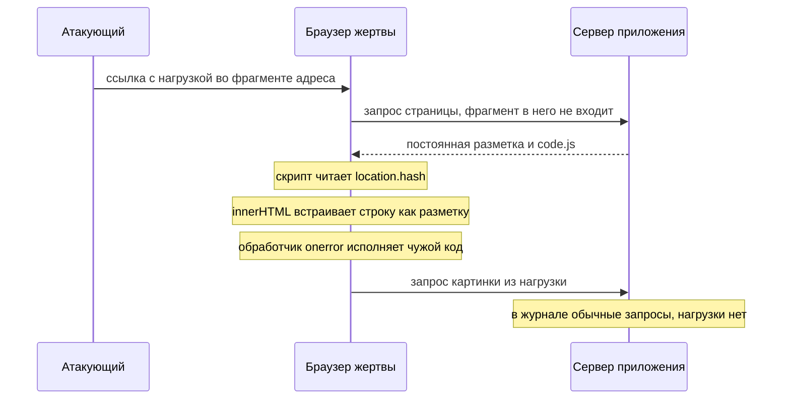

# XSS в DOM: источники и стоки

Вы открываете кабинет по ссылке из письма. Адрес обычный, только после
решётки в нём длинный обрывок знаков. Страница показывает ваши заказы, всё
как всегда. А чужой скрипт на ней уже отработал: он приехал в том обрывке
за решёткой и читает страницу так, как видите её вы. Журнал сервера за эту
минуту записал три обычных запроса, и ничего примечательного в них нет.
Вот тот же приём, прогнанный на учебном кабинете этой темы:

```text
$ node hack.mjs
  опыт 1 — разметка из фрагмента адреса: СКРИПТ ИСПОЛНЕН
     сервер за этот опыт увидел: ["/","/code.js","/%D0%BD%D0%B5%D1%82"]
```

Чужой скрипт исполнен, а сервер за этот запрос увидел путь страницы, путь
скрипта и обращение за несуществующей картинкой. Самой нагрузки в списке
нет: фрагмент адреса, всё после решётки, браузер серверу не отправляет, как
было разобрано в теме `url-and-encoding`. Если вы привыкли искать атаки по
журналу сервера, здесь этот приём молчит. След остаётся только в браузере.

Так устроен XSS в DOM (DOM-based XSS) — разновидность межсайтового
скриптинга, где присланное значение через сервер не проходит вовсе. Имя
говорит про место действия: DOM, объектная модель документа, — это страница
внутри браузера в том виде, в каком её видит и меняет скрипт. Страница сама
берёт значение из адреса, имени окна или хранилища браузера и сама отдаёт
его свойству, которое разбирает строку как разметку или как код.

Подстановку делает браузер, поэтому серверное экранирование на этом пути не
стоит, и починка тоже лежит в браузерном коде. Механика исполнения чужого
скрипта разобрана в `xss-reflected`. Здесь другая половина вопроса: дефект,
у которого и начало, и конец лежат в браузере. Сервер свою разметку при
этом не портил.

## Подумай, прежде чем читать

1. Страница показывает раздел, имя которого берёт из части адреса после
   решётки. Что из этого адреса увидит сервер в журнале?
2. Приложение отдаёт постоянную разметку и не подставляет в неё ни одного
   присланного значения. Может ли на такой странице сработать XSS?
3. Значение из адреса попадает в атрибут `href` ссылки. Поможет ли здесь
   замена знаков разметки на сущности?

## Как это работает

**Откуда это взялось.** Ранние страницы собирались на сервере целиком, и
вся подстановка происходила там. Затем часть работы переехала в браузер:
страница стала читать состояние из адреса и достраивать себя без
перезагрузки. Вместе с работой переехал и дефект. Разработчик по-прежнему
считал, что подстановку делает сервер и защищает тоже сервер, а подстановка
уже делалась в браузере, где серверная защита не действует.

Начнём с места действия. Браузер не рисует файл разметки как текст: он
разбирает его и строит живую модель страницы, объектную модель документа
(Document Object Model, DOM). В этой модели каждый тег — объект со
свойствами: у абзаца есть текст, у ссылки адрес, у картинки источник.
Скрипт на странице работает с этой моделью: поменял свойство — и страница
перерисовалась без перезагрузки и без нового запроса к серверу. Зачем это
нужно, видно на любом чате: новое сообщение появляется в ленте, а страница
не обновляется. Это скрипт достроил модель, а не запросил документ заново.

Бытовое соответствие здесь — рецепт и готовое блюдо. Файл разметки —
рецепт: его можно перечитать, но нельзя досолить. DOM — блюдо на столе:
его можно менять в любой момент, и изменение видно сразу. Соответствие
держится на главном: работа идёт не с описанием, а с самим предметом.
Ломается оно на повторном заходе: остатки блюда никуда не денутся, а
страница при перезагрузке соберётся из файла заново, и все правки скрипта
исчезнут.

Общая рамка разбора вам уже знакома по `xss-reflected`: источник, путь,
сток и отсутствующий контроль. Там источником было значение в запросе, а
стоком — место вставки в ответ сервера. Здесь обе роли переехали в браузер.
**Источник** — свойство браузера, значением которого распоряжается тот, кто
привёл пользователя на страницу. **Сток** — функция или свойство, которое
разбирает переданную строку как разметку, как код или как адрес. Дефект
возникает там, где значение доехало от источника до стока без проверки.

Академия PortSwigger называет такой маршрут потоком помеченных данных:
значение из источника считается помеченным, и до стока оно обязано дойти
очищенным. Соответствие бытовое: инструмент в операционной без отметки о
стерилизации нельзя поднести к пациенту, пока отметки нет. Пометка здесь —
знание «значение чужое», стерилизация — проверка или замена стока, пациент —
документ. Сама по себе работа с DOM дефекта не создаёт: читать адрес и
менять документ странице нужно каждый день. Дефект появляется там, где
помеченное значение доехало до стока в неизменном виде.

Cheat sheet OWASP формулирует различие одной фразой: отражённый и хранимый
XSS — дефекты серверной стороны, XSS в DOM — дефект клиентской. Исполняются
все три в браузере, а внедряются в разных местах.

### Источники

Академия перечисляет типовые источники, и список стоит держать целиком.

- `document.URL`, `document.documentURI`, `document.baseURI` и объект
  `location` со всеми его частями — адрес текущей страницы в разных
  записях, доступный скрипту.
- `document.referrer` — адрес страницы, с которой пришли на эту; браузер
  запоминает его сам при переходе.
- `document.cookie` — значение cookie, и поставить его мог не сервер, а
  любой скрипт этого origin.
- `window.name` — имя окна; его задаёт страница, которая была открыта в
  этом окне раньше.
- `history.pushState` и `history.replaceState` — состояние, записанное в
  историю переходов внутри приложения.
- Хранилища браузера: `localStorage`, `sessionStorage`, база в браузере.

Самый частый источник — адрес. Значение в нём доставляется ссылкой, и
потому доставка та же, что у отражённого XSS. Но часть адреса ведёт себя
иначе: фрагмент, всё после решётки, браузер серверу не отправляет.
Проверено прогоном лабы: за запрос с нагрузкой в фрагменте сервер увидел
только путь страницы и путь скрипта, а самой нагрузки в журнале не было.

Имя окна стоит отдельным пунктом, потому что источник этот не адрес. Чужая
страница кладёт в `window.name` любую строку и уводит браузер на приложение,
а имя переживает переход — приложение читает его уже у себя. Бытовое
соответствие: табличка на двери переговорной. Посетители сменились, дверь
та же, и табличка осталась от прежних. Соответствие держится, пока открыто
одно и то же окно: закрыли вкладку — и «дверь» выбросили вместе с табличкой.

### Стоки

Cheat sheet делит стоки по тому, что именно они разбирают.

- Разметку разбирают `innerHTML`, `outerHTML`, `document.write`,
  `document.writeln`, `insertAdjacentHTML`: им присваивают или передают
  строку, и браузер встраивает её в документ как разметку.
- Код разбирают `eval`, конструктор `Function`, а также `setTimeout` и
  `setInterval`, когда первым аргументом им дают строку: строка исполняется
  как кусок программы.
- Адрес разбирают присваивание `location` и атрибуты `href` со `src`,
  установленные через `setAttribute`: строка становится адресом перехода
  или загрузки.

Главный сток разметки — `innerHTML`, свойство элемента. Ему присваивают
строку, и браузер разбирает её как разметку, заводя новые элементы внутри
этого. У него есть текстовый двойник, `textContent`: присвоенная строка
встаёт в документ как есть, и угловые скобки остаются знаками, а не
командами. Бытовое соответствие — наборщик и копировщик. Наборщику диктуют
текст с пометками «жирным» и «с новой строки», и он эти пометки исполняет.
Копировщик переносит знаки один в один, не читая их как команды. Различие
этих двух свойств — вся починка текстовых стоков этой темы.

Проверено прогоном в браузере лабы. Строка, переданная в `eval`,
исполняется. Строка первым аргументом `setTimeout` исполняется. Конструктор
`Function` собирает из строки рабочую функцию. Проверено там же и различие
внутри стока разметки: элемент `script`, вставленный присваиванием
`innerHTML`, не исполняется, а обработчик `onerror` у вставленной тем же
присваиванием картинки исполняется. Отсюда типовая ошибка вывода:
«`<script>` не сработал — значит, сток безопасен».

У стока адреса своя нагрузка — схема `javascript:`. Обычный адрес говорит,
куда идти. Адрес со схемой `javascript:` говорит, что сделать: ссылка с ним
при нажатии никуда не ведёт, а исполняет строку как программу. Бытовое соответствие — указатель, у которого вместо «налево»
написано «повернись и отдай ключи»: читающий ждёт направления, а получает
команду. Ломается соответствие на том, что человек команду выполнять не
обязан, а браузер исполняет её всегда. Знаков разметки в такой нагрузке
нет ни одного, поэтому экранирование сущностями её не трогает — к этому
различию тема вернётся в починке.

Академия к тому же напоминает, что XSS — лишь один из дефектов этой рамки.
Тот же поток от источника к другому стоку даёт открытое перенаправление
(`window.location`), подмену cookie (`document.cookie`), подмену ссылки
(`element.src`). Даёт он и отравление адреса `WebSocket` — канала
постоянного двустороннего соединения браузера с сервером.

### Как доставляется

Доставка у клиентского случая тоньше, чем у серверного, и вариантов у неё
три.

Первый — ссылка. Атакующий собирает адрес приложения с нагрузкой во
фрагменте или в строке запроса и приводит на него жертву. Внешне это тот
же приём, что у отражённого XSS. Но нагрузка во фрагменте не попадает ни в
один журнал по пути — ни в журнал сервера, ни в журнал обратного прокси.

Второй — чужая страница-посредник. Она задаёт `window.name` и уводит
браузер на приложение: имя переживает переход, как показано разделом про
источники. Адрес, по которому переходит жертва, при этом обычный: смотреть
в него бесполезно.

Третий — хранимые данные, которые читает браузерный код. Приложение отдаёт
запись базы не разметкой, а ответом интерфейса, и вставляет её в документ
уже на клиенте. Сток здесь клиентский, источник — серверный, и дефект
попадает в промежуток между двумя ревью. Серверное экранирование к ответу
интерфейса не применяется, а клиентский код считает ответ своего сервера
доверенным.

### Как искать вручную

Приём тот же, что у серверного случая, только смотреть надо не в ответ, а
в документ. В каждый источник по очереди кладётся короткая неповторимая
строка, после чего она ищется в готовом документе средствами разработчика
в браузере. Найденное вхождение показывает, куда значение доехало и в каком
виде.

Академия честно оговаривает предел приёма: он работает для источников,
которыми можно управлять снаружи по одному. Источники вроде
`document.cookie` и стоки вроде `setTimeout` так не находятся, и замены
чтению браузерного кода для них нет.

### Почему сервер здесь ни при чём

Три следствия сразу, и все три важны для ревью.

Журнал сервера дефекта не покажет: нагрузки в нём нет. Межсетевой экран
приложения его не остановит — cheat sheet прямо называет XSS в DOM классом,
который такие средства пропускают, потому что он работает исключительно на
клиенте. И серверное автоэкранирование шаблона не поможет: шаблон отдал
постоянную разметку, а подстановку сделал браузер.



**Описание схемы.** Схема читается сверху вниз и показывает опыт 1 этой
темы. Атакующий приводит жертву на страницу ссылкой, где нагрузка спрятана
во фрагменте адреса. Браузер просит у сервера страницу без фрагмента, и
сервер отдаёт постоянную разметку. Дальше всё происходит внутри браузера:
скрипт страницы читает фрагмент, встраивает его в документ как разметку, и
обработчик вставленной картинки исполняет чужой код. Сервер за весь обмен
записывает обычные запросы, и нагрузки среди них нет.

Поэтому поиск идёт от источников. Берётся список из раздела «Источники», и
каждое вхождение ищется в браузерном коде. От него прослеживается путь
вперёд — до ближайшего стока или до места, где значение проверили.

**Зачем это в работе AppSec-инженера.** Половина клиентского куста
подраздела опирается на эту рамку. Загрязнение прототипа
(`prototype-pollution`), уязвимости сообщений между окнами
(`postmessage-vulns`) и подмена элементов документа (`dom-clobbering`)
разбираются теми же понятиями источника и стока. Практический вывод
жёсткий: ни журнал сервера, ни межсетевой экран приложения этого дефекта не
увидят, потому что нагрузка к серверу не приходит. Поэтому предмет темы —
не новый приём атаки, а адрес, по которому искать: браузерный код.

## Как это атакуют

Стенд — лаба этой темы, каталог `pilot/lab/xss-dom`. Кабинет на петле
(`127.0.0.1:8122`) отдаёт постоянную разметку и не подставляет в неё
ничего. Три значения приезжают мимо сервера: имя раздела из фрагмента
адреса, черновик из имени окна, адрес возврата из параметра строки запроса.
Рядом поднят второй origin (`127.0.0.1:8123`) — чужая площадка, которая
задаёт имя окна и уводит браузер на приложение.

```text
$ node hack.mjs
  опыт 1 — разметка из фрагмента адреса: СКРИПТ ИСПОЛНЕН
     сервер за этот опыт увидел: ["/","/code.js","/%D0%BD%D0%B5%D1%82"]
  опыт 2 — разметка из имени окна: СКРИПТ ИСПОЛНЕН
  опыт 3 — адрес javascript: в ссылке возврата: СКРИПТ ИСПОЛНЕН
  опыт 4 — контроль, обычный раздел: "Раздел: orders"
  опыт 5 — контроль, ссылка возврата: href="/orders"
```

Опыт 1 — источник `location.hash`, сток `innerHTML`. Строка после решётки
попадает в разметку, картинка не грузится, обработчик срабатывает. Строкой
ниже напечатано, что сервер за этот запрос видел: путь страницы, путь
скрипта и обращение за несуществующей картинкой. Самой нагрузки в списке
нет.

Опыт 2 — источник `window.name`, сток тот же. Значение задала чужая
площадка до перехода. Ссылки с нагрузкой здесь нет вовсе: адрес приложения
обычный.

Опыт 3 — источник `location.search`, сток `setAttribute('href', ...)`.
Значение `javascript:...` становится адресом ссылки и исполняется по
нажатию. Знаков разметки в нагрузке нет ни одного, поэтому экранирование
сущностями её не трогает.

Опыты 4 и 5 — контроль. Обычный раздел обязан открываться, ссылка возврата
с законным путём обязана вести туда же. Без них починка сведётся к запрету
всего, и выяснится это на приёмке.

Порядок опытов показывает три разных пути к одному исходу. Первый идёт
ссылкой и не оставляет следа на сервере. Второй идёт через чужую страницу и
не оставляет следа даже в адресе. Третий не пользуется разметкой вовсе: он
подменяет схему адреса, и защита, настроенная на угловые скобки, его не
видит.

Остаётся оценить добычу. Одна ссылка или один переход через чужую страницу
отдают атакующему всё, что видит вошедший пользователь кабинета. Отличие от
отражённого случая — в невидимости: ни один рубеж на сервере этого не
заметит.

Три опыта сводятся к одному правилу: дефект живёт между браузерным
источником и браузерным стоком, и серверная сторона о нём не узнает. Перед
разбором починки подумайте: какая из двух мер, замена стока или проверка
значения, закроет адрес со схемой `javascript:` и почему сработает только
одна из них?

## Как это выглядит в коде

Ревьюер ищет пару: источник и сток в одном потоке. Фрагмент `code.js` из
лабы читайте тремя планами. Первый план — найти точку входа: откуда
значение приходит из свойства браузера. Второй — найти сток: где строка
становится разметкой или адресом. Третий — проверить, есть ли между ними
проверка. До чтения выносок найдите обе пары сами и объясните, чем
опасность второй отличается от опасности первой.

```javascript
// УЯЗВИМО — демонстрация, не для продакшена
export function showSection() {
  const name = decodeURIComponent(location.hash.slice(1)) || 'profile';
  document.getElementById('section').innerHTML = 'Раздел: ' + name;  // (1)
}

export function showBackLink() {
  const back = new URLSearchParams(location.search).get('back') || '/';
  document.getElementById('back').setAttribute('href', back);        // (2)
}
```

1. Строка со стоком `innerHTML`: значение прочитано из `location.hash`, то
   есть из фрагмента адреса, раскодировано вызовом `decodeURIComponent` и
   вставлено в документ как разметка. Между источником и стоком только
   склейка с постоянной строкой, и она ничего не меняет.
2. Строка со стоком `setAttribute`: значение прочитано из
   `location.search`, то есть из строки запроса, и стало адресом ссылки.
   Здесь опасен не знак разметки, а схема адреса.

Признаки, по которым это находится глазами, три. Имя источника из списка
темы в теле функции. Присваивание в `innerHTML` или `outerHTML` рядом.
Значение, собранное из частей адреса и уходящее в `setAttribute` с именем
`href` или `src`.

Отдельный признак — расстояние. Источник и сток в соседних строках видны с
одного взгляда, а типовой дефект живой системы растянут. Значение читается
при загрузке страницы, кладётся в поле объекта состояния и достаётся оттуда
через несколько модулей. Тогда искать надо не пару строк, а поле состояния,
в которое попал источник.

**Ложное срабатывание.** Значение из источника, прошедшее сверку со списком
разрешённого. `SECTIONS.includes(name) ? name : 'profile'` — тот же
`innerHTML` дальше по потоку безопасен, потому что значение уже не
произвольное. Смотреть надо на проверку между источником и стоком, а не на
факт их соседства.

## Как защититься

Правило одно: сток выбирается по тому, чем значение служит. Для текста
берётся сток, который оставляет его текстом. Для адреса сток не меняется,
потому что ссылке нужен адрес, — проверяется само значение. Исправленный
вариант читается по этим двум планам: первая функция закрывает текст
сверкой со списком и заменой стока, вторая — адрес проверкой формы пути.
Каждая выноска стоит на своём плане.

```javascript
// Исправлено.
const SECTIONS = ['profile', 'orders', 'settings'];

export function showSection() {
  const name = decodeURIComponent(location.hash.slice(1)) || 'profile';
  const known = SECTIONS.includes(name) ? name : 'profile';          // (1)
  document.getElementById('section').textContent = 'Раздел: ' + known;
}

export function showBackLink() {
  const back = new URLSearchParams(location.search).get('back') || '/';
  const safe = /^\/[A-Za-z0-9/_-]*$/.test(back) ? back : '/';        // (2)
  document.getElementById('back').setAttribute('href', safe);
}
```

1. Строка со сверкой: значение сверено со списком разделов, а дальше сток
   заменён на `textContent`. Двух мер здесь не многовато: список закрывает
   смысл, сток закрывает разбор.
2. Строка с проверкой адреса: разрешён только путь от корня, без схемы и
   без имени хоста. Требование ASVS v5.0-1.2.2 говорит то же самое —
   разрешать только безопасные схемы и не пускать `javascript:` и `data:`.

**Почему `textContent`, а не экранирование.** Cheat sheet называет замену
стока правильным способом починки и объясняет причину: `textContent` не
разбирает строку как разметку вовсе, поэтому экранировать нечего и ошибиться
негде. Требование ASVS v5.0-3.2.2 формулирует это как норму: содержимое,
которое показывается текстом, выводится безопасными функциями отрисовки
вроде `createTextNode` или `textContent`.

**Границы применимости.** У `textContent` есть двойник, который безопасным
только кажется. Cheat sheet предупреждает про `innerText`: текст,
присвоенный элементу `script`, попадает в него как программа и исполняется.
Свойство безопасно по разбору разметки и небезопасно по выбору элемента.

**Когда нужна именно разметка.** Бывает, значение обязано остаться
разметкой: редактор комментариев с жирным текстом и ссылками. Замена стока
тут не поможет — `textContent` покажет разметку как текст. Тогда ставится
санитайзер, библиотека, которая разбирает разметку и выбрасывает из неё всё
активное, оставляя безобидное оформление. Бытовое соответствие —
санобработка на входе в стационар: вещи вернут владельцу, но сначала вынут
из них опасное.

У браузера для этого есть встроенное средство, метод `setHTML`. Проверено
прогоном в браузере без окна `HeadlessChrome/152.0.7977.42`. Та же строка,
положенная в `innerHTML`, сохраняет `onerror`, элемент `script`, атрибут
`id` и адрес `javascript:`. После `setHTML` от неё остаются только теги без
атрибутов. Опора на одно средство ненадёжна — поддержка зависит от
браузера, — поэтому в живом приложении рядом ставят библиотеку санитайзера.

**Что добавляется поверх.** Trusted Types — механизм политики безопасности
содержимого, знакомой вам по теме `csp`: при нём опасные стоки перестают
принимать обычную строку. Включается он директивой
`require-trusted-types-for 'script'`, и после этого присваивание строки в
`innerHTML` роняет ошибку: значение обязано прийти из объявленной политики.
Бытовое соответствие — касса, которая принимает не любую бумагу, а только
бланки с печатью своего отдела: подсунуть в сток постороннюю строку больше
не выйдет. Cheat sheet называет это одним из немногих средств, которое
убирает целый класс дефектов, а не смягчает его. Проверено прогоном: объект
`window.trustedTypes` в браузере лабы есть.

## Как убедиться, что защита работает

Ретест повторяет три нагрузки и добавляет то, что обязано работать.

```text
$ LAB_TARGET=solution.js node hack.mjs
  опыт 1 — разметка из фрагмента адреса: скрипт не исполнен
     сервер за этот опыт увидел: ["/","/code.js"]
  опыт 2 — разметка из имени окна: скрипт не исполнен
  опыт 3 — адрес javascript: в ссылке возврата: скрипт не исполнен, href="/"
  опыт 4 — контроль, обычный раздел: "Раздел: orders"
  опыт 5 — контроль, ссылка возврата: href="/orders"
```

Три отказа и два рабочих контроля. В опыте 3 напечатан итоговый адрес
ссылки: проверка отбросила чужую схему и подставила корень. Отказ на
четвёртом или пятом опыте означал бы, что кабинет сломался.

Регресс закрывается тестами функциональности. В лабе их семь: раздел по
умолчанию, два именованных раздела, смена раздела без перезагрузки,
параметр возврата, его отсутствие, пустое имя окна.

Проверять надо каждый сток отдельно. Замер на лабе показывает, чем
кончается частичная правка: с `textContent` у одного стока проваливаются
два опыта, у двух стоков — один. Ноль получается только после того, как
разобран и адрес.

На ревью пройдите по списку.

1. Проверьте, что каждое вхождение источника — `location`,
   `document.referrer`, `window.name`, `document.cookie`, хранилище
   браузера — прослежено вперёд до ближайшего стока.
2. Проверьте, что значение, показываемое текстом, попадает в `textContent`
   или `createTextNode`, а не в `innerHTML` (ASVS v5.0-3.2.2).
3. Проверьте, что разметка, которую нужно оставить разметкой, проходит
   через санитайзер, а не через самодельную чистку.
4. Проверьте, что для адреса, построенного из присланного значения, схема
   ограничена и исключает `javascript:` с `data:` (ASVS v5.0-1.2.2).
5. Проверьте, что в браузерном коде нет `eval`, конструктора `Function` и
   вызовов `setTimeout` со строкой вместо функции.
6. Проверьте, что проверка значения стоит между источником и стоком, а не в
   соседней функции, куда поток может не зайти.
7. Проверьте, что поиск дефекта не сведён к журналу сервера и правилам
   межсетевого экрана: нагрузка до них не доходит (WSTG-v42-CLNT-01).

## Как это находят инструменты

Дефект описан парой «источник — сток», то есть ровно тем, на что рассчитан
анализ помеченных данных. Здесь работает статическая проверка: инструмент
читает исходный код, не запуская его. Как корректор, читающий рукопись без
печати тиража, он следит за помеченным значением по пути к стоку. Источники
в правиле — свойства браузера из списка этой темы: `location.hash`,
`window.name` и другие. Стоки — функции разбора разметки, кода и адреса.
Очищающие приёмы — сверка со списком разрешённого и с формой значения.

Правило целиком лежит в `pilot/semgrep/dom-untrusted-to-sink.yaml` и
сверено прогоном: на уязвимом файле лабы три находки, на решении — ноль, на
одиннадцати размеченных тест-кейсах расхождений нет.

**Что правило пропустит.** Поток, разнесённый по функциям: пометка идёт
внутри одного тела. Источник, полученный обходным путём: `document['URL']`,
значение из хранилища браузера, значение из сообщения `postMessage`. Сток,
вызванный через переменную или через обёртку своего фреймворка.

**Какой шум даст.** Всякую сверку, записанную не так, как в списке
очищающих приёмов: проверка через `if` с ранним возвратом, проверка в
соседней функции, сверка через объект-словарь. Правило видит форму записи,
а не смысл проверки, и потому список приёмов дополняется под идиомы
корпуса.

Отдельно стоит сказать про предел рамки. Правило отвечает на вопрос
«доехало ли», а не «безопасно ли доехавшее». Значение, прошедшее
`encodeURIComponent` и попавшее в `href` целиком, правило засчитает за
очищенное, хотя схема адреса при этом не проверена. Последнее слово в этой
рамке остаётся за ревьюером.

## Частая ошибка

Владелец страницы спокоен: шаблон отдаёт постоянную разметку, серверное
автоэкранирование включено, значит, XSS на этой странице невозможен.
Найдите скрытую посылку в этом рассуждении и решите, верна ли она, прежде
чем читать дальше.

**Сервер защищает то, что подставляет он.** Здесь он не подставляет ничего:
подстановку делает браузер, а значение берёт из места, куда сервер не
заглядывает. Фрагмент адреса до сервера не доезжает по устройству
протокола. Имя окна задала предыдущая страница. Содержимое хранилища
браузера сервер видит только тогда, когда его туда отправят.

Контрпример из лабы. Сервер кабинета отдаёт один и тот же файл разметки
всякий раз и не подставляет в него ни одного присланного значения. Опыт 1
исполняет чужой скрипт, а напечатанный тут же список запросов показывает,
что сервер нагрузки не видел. Ни экранирование шаблона, ни правило
межсетевого экрана на этом пути не стоят.

## Попробуй сам

Лаба `lab-xss-dom`, каталог `pilot/lab/xss-dom`. Формат «почини»: правится
`code.js`, пока `hack.mjs` и `tests.mjs` не станут зелёными одновременно.

**Цель одной фразой:** добиться, чтобы `hack.mjs` вышел с кодом 0, а
`tests.mjs` продолжил выходить с кодом 0.

Всё локально: два сервера слушают петлю, браузеру разрешение имён обрублено
флагом `--host-resolver-rules`, Docker не нужен. В исходном состоянии
`node tests.mjs` печатает «Упало проверок: 0», а `node hack.mjs` печатает
«ЭКСПЛОЙТ СРАБОТАЛ» и выходит с кодом 1. Ваша правка обязана перевернуть
второй результат, не сломав первый.

Одна подсказка: серверу здесь чинить нечего, чинится сток. Для текста сток
меняется, для адреса не меняется — там проверяется само значение.

**Отдельная задача «почини».** Стока три, а починки две. Имя раздела и
черновик — текст, и для них меняется сток. Адрес возврата остаётся в
атрибуте `href`, и потому закрывается проверкой схемы и формы пути.

Решение лежит в `solution.js` и открывается после того, как своя попытка
сделана.

## Проверь себя

1. Кабинет отдаёт постоянную разметку, а браузерный код достраивает её сам:

   ```javascript
   export function render() {
     const name = window.name || 'гость';
     const el = document.getElementById('hello');
     el.innerHTML = 'Здравствуйте, ' + name;
   }
   ```

   Чужая страница задала `window.name` и увела браузер на кабинет. Назовите
   источник и сток этого потока и что запишет журнал сервера, когда
   нагрузка сработает.
2. Функция `showSection` из раздела «Как это выглядит в коде»: значение из
   `location.hash` склеивается со строкой и уходит в `innerHTML`. Какая
   правка устраняет дефект?

   A. Вырезать из значения угловые скобки и слово `script` перед
      подстановкой.

   B. Сверить значение со списком разделов и заменить сток на
      `textContent`.

   C. Включить серверное автоэкранирование шаблона и оставить `innerHTML`.

3. Почему для адреса в `href` замена стока не работает и что делают вместо
   неё?
4. Адрес страницы — `http://app.example/cabinet#`.
   Предскажите, что из этого адреса уйдёт в запрос к серверу, а что
   останется в браузере.

   ```javascript
   const u = new URL('http://app.example/cabinet#');
   console.log(u.pathname + u.search);
   console.log(u.hash);
   ```

5. Возврат к теме `xss-reflected`: чем поиск дефекта в этой теме отличается
   от поиска отражённого XSS?
6. Возврат к теме `same-origin-policy`: какие свойства чужого окна политика
   оставляет доступными и есть ли среди них содержимое документа?

<details markdown="1">
<summary>Ответ 1</summary>

1. Источник — `window.name`, сток — `innerHTML`; между ними только склейка
   с постоянной строкой, и она значение не меняет. Журнал сервера запишет
   обычные запросы за разметкой и скриптом: сервер отдал постоянный файл и
   подстановки не делал, поэтому нагрузки в его журнале нет вовсе.

</details>

<details markdown="1">
<summary>Ответ 2: разбор вариантов</summary>

2. Верно: B.

   A. Неверно. Фильтр знаков ломает законные имена, а нагрузку не
      останавливает: сработает и ``, собранная без
      слова `script`. Фильтр не знает, в каком месте разметки значение
      окажется.

   B. Верно. Список разделов закрывает смысл — значение перестаёт быть
      произвольным. А `textContent` закрывает разбор: он не читает строку
      как разметку вовсе, поэтому экранировать нечего и ошибиться негде.

   C. Неверно. Автоэкранирование работает там, где подстановку делает
      сервер. Здесь сервер отдал постоянную разметку, а подстановку
      выполняет браузер — серверная защита на этом пути не стоит.

</details>

<details markdown="1">
<summary>Ответ 3</summary>

3. Атрибут `href` обязан остаться адресом — другого стока для него нет.
   Поэтому проверяют само значение: схему и форму пути. Экранирование
   сущностями тут бесполезно арифметически: в строке
   `javascript:doSomething()` нет ни одного из пяти заменяемых знаков.

</details>

<details markdown="1">
<summary>Ответ 4</summary>

4. В запрос к серверу уйдёт `/cabinet` — путь и строка запроса; фрагмент
   после решётки останется в браузере и серверу не отправляется. Прогон:
   `node -e 'const u=new URL("http://app.example/cabinet#"); console.log(u.pathname+u.search); console.log(u.hash)'`
   — печатает `/cabinet` и `#%3Cimg%20src=x%20onerror=a()%3E`: фрагмент
   отделён (знаки в нём браузер закодировал, но серверу не отдал).

</details>

<details markdown="1">
<summary>Ответ 5</summary>

5. Отражённый ищут по местам, где сервер печатает присланное в ответ. Здесь
   ищут по источникам в браузерном коде и прослеживают путь до стока;
   журнал сервера бесполезен.

</details>

<details markdown="1">
<summary>Ответ 6</summary>

6. Короткий список: методы `blur`, `close`, `focus`, `postMessage` и
   атрибуты `closed`, `frames`, `length`, `location`, `opener`, `parent`,
   `self`, `top`, `window`. Содержимого документа среди них нет — и имени
   окна тоже: его читает уже новый документ того же окна, как своё.

</details>

## Источники

1. PortSwigger Web Security Academy, «DOM-based vulnerabilities»; реестр
   `ps-dom-based`. Разделы: What is the DOM, Taint-flow vulnerabilities,
   Sources, Sinks, Common sources, Which sinks can lead to DOM-based
   vulnerabilities.
   <https://portswigger.net/web-security/dom-based>
2. OWASP DOM based XSS Prevention Cheat Sheet; реестр
   `owasp-cs-dom-xss-prevention`. Разделы: Introduction, Example Dangerous
   HTML Methods, RULE #6 — Populate the DOM using safe JavaScript functions
   or properties, RULE #7 — Fixing DOM Cross-site Scripting Vulnerabilities,
   Usually Safe Methods.
   <https://cheatsheetseries.owasp.org/cheatsheets/DOM_based_XSS_Prevention_Cheat_Sheet.html>
3. OWASP Cross Site Scripting Prevention Cheat Sheet; реестр
   `owasp-cs-xss-prevention`. Разделы: Safe Sinks, Other Controls — Trusted
   Types, Other Controls — Web Application Firewalls.
   <https://cheatsheetseries.owasp.org/cheatsheets/Cross_Site_Scripting_Prevention_Cheat_Sheet.html>

Каркас этапа: `owasp-asvs-5-document` (ASVS v5.0.0), `owasp-wstg-42`,
`owasp-top10-2025`. Наследуются всеми темами и отдельной строкой не
повторяются.

**Скоропортящийся слой.** Списки источников и стоков растут вместе с
браузерными интерфейсами. Встроенный санитайзер и Trusted Types поддержаны
не везде, и объём поддержки меняется от версии к версии. Страницы академии
и cheat sheet — живые площадки без даты публикации.

**Маркеры уверенности.** Прогоны лабы и правила SAST — **проверено лично**
2026-08-24 в браузере `HeadlessChrome/152.0.7977.42` на Node.js v26.7.0 и
Semgrep 1.174.0: три нагрузки исполняются на `code.js` и не исполняются на
`solution.js`, семь тестов функциональности проходят в обоих случаях,
правило даёт три находки на уязвимом файле и ноль на решении. Отдельными
прогонами в том же браузере проверены: фрагмент адреса в запросах к серверу
не появляется; `eval`, `setTimeout` со строкой и конструктор `Function`
исполняют переданное; элемент `script`, вставленный через `innerHTML`, не
исполняется, а обработчик `onerror` вставленной картинки исполняется;
`setHTML` оставляет от разметки теги без атрибутов; объект
`window.trustedTypes` присутствует. Списки источников и стоков, рамка
потока помеченных данных — **по документации** (Web Security Academy,
открыта лично 2026-08-24). Различие серверной и клиентской стороны, замена
стока как правильная починка, оговорка про `innerText` — **по
документации** (DOM based XSS Prevention Cheat Sheet, открыт лично
2026-08-24). Роль Trusted Types и слепота межсетевого экрана приложения —
**по документации** (Cross Site Scripting Prevention Cheat Sheet, открыт
лично 2026-08-24). Требования 1.2.2 и 3.2.2 сверены с текстом ASVS v5.0.0
(открыт лично 2026-08-24). Поведение `innerText` на элементе `script`
лично **не воспроизводилось**.
