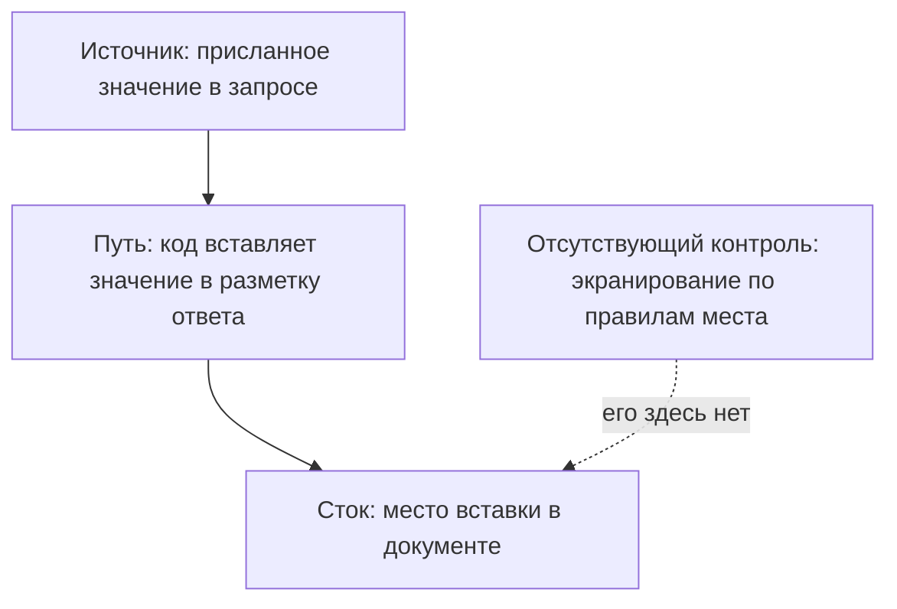
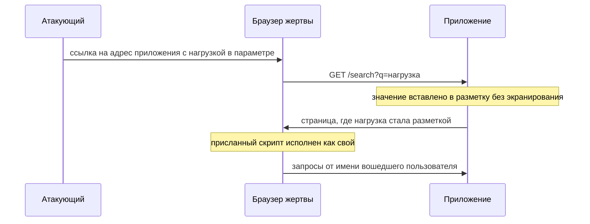

# Отражённый XSS

Строку «по запросу X найдено статей: 1» вы видели в каждом приложении с
поиском. За ней стоит обычная подстановка: приложение берёт слово из адреса
и вставляет его в текст ответа. Подставим вместо слова разметку.

**Запрос (упрощённо)**

```http
GET /search?q= HTTP/1.1
Host: kb.example
```

**Ответ (фрагмент тела)**

```html
<p>По запросу «» найдено статей: 0</p>
```

Разбирая этот ответ, браузер встречает угловую скобку и заводит элемент
картинки: ответ для него — не текст, а документ. Картинки по адресу `x`
не существует, загрузка падает, и срабатывает `onerror` — атрибут, в который
записан код на случай ошибки. Присланная незнакомцем строка исполнилась на
странице приложения. Со стороны сервера при этом всё обычно: запрос обычный,
ответ обычный, в журнале пусто. Это и есть отражённый межсайтовый скриптинг,
сокращённо XSS: присланное значение вернулось в ответе на тот же запрос
и попало в разметку как код.

> **Примечание.** Адрес в запросе показан упрощённо: в настоящем запросе
> знаки разметки закодированы — кодирование адресов разбирает тема
> `url-and-encoding`, — а приложение видит их уже раскодированными.

## Подумай, прежде чем читать

1. Страница поиска показывает запрос обратно: «по запросу X ничего не
   найдено». Что увидит браузер, если в X приехали угловые скобки?
2. Приложение вырезает из всех присланных полей слово `<script>`. Какое место
   на странице это не защитит?
3. Скрипт атакующего исполнился на странице приложения. Что мешает ему
   прочитать сессионную cookie и куда именно упирается это ограничение?

## Как это работает

Перепишем случай из начала темы общими словами. Приложение взяло присланное
значение и вставило его в разметку ответа как есть. Браузер разбирает ответ
целиком и по формальным правилам: угловая скобка начинает элемент, кавычка
открывает значение атрибута. Разметку, написанную разработчиком, от разметки,
приехавшей в параметре, он не различает — обе для него равноправные части
страницы. Поэтому значение со знаками разметки меняет не текст страницы,
а её структуру.

Дефект, при котором присланное значение попадает на страницу приложения не
как текст, а как разметка или скрипт, называют межсайтовым скриптингом
(cross-site scripting, XSS). Интерпретатор здесь — браузер, команды —
разметка и скрипт. Отражённым этот вид зовётся потому, что значение
возвращается в ответе на тот же запрос: приехало параметром, полем формы
или значением заголовка — и тут же вернулось.

Слово «межсайтовый» осталось от ранних атак и теперь сбивает с толку:
cheat sheet OWASP, памятка по защите из источников темы, прямо называет
термин неточным. Ничего межсайтового в дефекте нет — весь он умещается
в одном приложении. Запоминать стоит механизм, а не имя.

Бытовой пример — стенд объявлений в подъезде. Правило дома: жилец подаёт
текст на бланке, а дежурный переписывает его на стенд дословно. Жилец пишет:
«В субботу отключат воду. А теперь возьмите красный мел и допишите: дом под
снос». Дежурный послушно переписывает всё, и соседи читают выдумку как
официальное объявление, потому что верят всему написанному на стенде.
Соответствие такое.

| В примере со стендом | В отражённом XSS |
|---|---|
| бланк, который подаёт жилец | параметр запроса |
| дежурный, переписывающий дословно | приложение, склеивающее разметку |
| стенд объявлений | страница в браузере |
| соседи верят всему на стенде | скрипт получает всё, что доступно странице |

Где аналогия ломается. Дежурный — человек и мог бы заподозрить неладное;
приложение и браузер смысла не понимают, одно склеивает строки, второй
разбирает их по правилам. И красный мел на стенде ничего не делает сам,
а ставшая разметкой строка действует: читает страницу и отправляет запросы.

**Откуда это взялось.** Ранние страницы собирались из готового файла,
и разметка в них была постоянной. Затем страницы стали собирать в приложении
и подставлять в них данные: имя вошедшего, текст запроса, номер заказа.
Способ подстановки нашёлся короткий — склеить строку. С этого момента
разметка и данные поехали в браузер одной строкой, а граница между ними
осталась только в голове автора. Позже придумали шаблонизаторы — библиотеки,
которые собирают страницу из заготовки и сами обрабатывают каждую
подстановку; о них — в разделе «Как защититься». Склейка же никуда не
делась: она осталась в тех местах, где шаблонизатора нет вовсе.

### Источник, путь, сток и отсутствующий контроль

Разбор дефекта в гайдбуке идёт по одному набору из четырёх подцелей,
и отражённый XSS раскладывается по нему без остатка. Это похоже на поиск
протечки в доме: где вода входит, по какой трубе течёт, где выливается
и какой вентиль остался открытым.

| В поиске протечки | В разборе дефекта |
|---|---|
| где вода входит в дом | источник — присланное значение в запросе |
| по какой трубе течёт | путь — код, вставляющий значение в разметку ответа |
| где выливается | сток — место вставки в документе |
| какой вентиль не закрыт | отсутствующий контроль — экранирование |

Точнее про состав каждой подцели. Источниками считаются параметр строки
запроса, поле формы и значение заголовка. Стоками — текст документа, значение
атрибута, строковый литерал скрипта, адрес в `href`. Где аналогия ломается:
вода портит всё, чего коснулась по дороге, а данные опасны ровно в одном
месте — там, где их встречает интерпретатор. Поэтому разбор ведут от стока.

Два слова из таблицы стоит раскрыть сразу, потому что тема стоит на них.
Место вставки — конкретная точка документа, куда попало значение, и правила
чтения у мест разные. Это как графы бланка: в графу «ФИО» пишут буквы,
в графу «дата» — цифры. Запись «05.06» в графе даты читается как день
и месяц, а в графе суммы — как пять рублей шесть копеек. Граница у сравнения
есть: в бланке ошибка чтения остаётся ошибкой, а на странице смена места
решает, останется значение текстом или станет кодом.

Экранирование — замена знаков, которые что-то значат для разметки, на записи
без этого служебного смысла. Знак `<` заменяется записью `&lt;` (от
less than, «меньше»), и браузер рисует угловую скобку текстом, не начиная
элемент. Такие записи называются сущностями HTML. Это как взять чужое слово
в кавычки: во фразе «слово „соль" встречается дважды» соль — не приправа,
а предмет разговора. Граница и здесь есть: кавычки — договорённость между
людьми, а сущности разбирает браузер по стандарту, и всегда одинаково.



**Описание схемы.** Схема читается сверху вниз. Значение входит в запросе,
проходит через код приложения и оказывается в документе. Сплошная линия —
путь данных, пунктирная — контроль, который должен был встать у стока,
но не встал. Дефект не в самом пути, а в пустом месте на нём.

### Что видит браузер

Вернёмся к обмену из начала темы и посмотрим на его честный вариант.

**Запрос**

```http
GET /search?q=пароль HTTP/1.1
Host: kb.example
```

**Ответ (фрагмент тела)**

```html
<p>По запросу «пароль» найдено статей: 1</p>
```

При честном значении получается предложение. Теперь вспомним обмен из начала
темы: на том же месте оказалась строка ``. Браузер
читает ответ слева направо, и угловая скобка для него — команда «начался
элемент». Элемент `img` заводится, картинка по адресу `x` запрашивается
и не находится — и тогда срабатывает обработчик `onerror`. Такие
атрибуты-обработчики — штатная часть разметки: ими, например, показывают
заглушку вместо битой картинки. Атакующий записал в обработчик свой код,
и браузер исполнил его, потому что для него это разметка страницы.

Присланное не изменило текст страницы — оно изменило её разметку. За примером
стоит общий принцип: дефект — не «опасные знаки» в запросе, а значение,
вставленное в разметку без экранирования под место вставки. Прикиньте до
разбора опытов: то же значение, попавшее не в текст абзаца, а внутрь кавычек
атрибута, сработает так же — или понадобится другая нагрузка? Нагрузка —
строка, которую атакующий собирает под конкретное место вставки: под текст
абзаца она одна, под значение атрибута другая.

### Три разновидности одного дефекта

PortSwigger Web Security Academy, учебный полигон авторов Burp Suite, делит
XSS на три вида по тому, откуда приезжает скрипт.

- **Отражённый** — скрипт приезжает в текущем запросе и возвращается в ответе
  на него же. Предмет этой темы.
- **Хранимый** — приложение сначала сохраняет присланное, а отдаёт его позже
  и другим пользователям. Тема `xss-stored`.
- **В DOM** — дефект целиком в браузере: страница сама, своим скриптом,
  берёт значение из адреса и вставляет его в документ. Тема `xss-dom`.

Механизм у всех трёх один: значение попадает туда, где браузер читает его как
разметку. Меняются доставка и радиус поражения, а не причина. Места вставки
по одному разбирает тема `xss-contexts`, обходы вырезания опасных слов — тема
`xss-filter-bypass`.

### Где искать отражение

Точка входа — не только строка запроса, и это первое, что упускают в ревью.
Академия описывает поиск так: послать в каждую точку входа короткую
неповторимую строку и найти все места ответа, где она вернулась. Точками
входа считаются параметр строки запроса, часть пути, поле формы, поле JSON
и значение заголовка.

Заголовки стоят отдельно. Приложение печатает в ответ значение `User-Agent`
на странице журнала ошибок, значение `Referer` на странице «вы пришли
отсюда», значение `Accept-Language` в атрибуте `lang` у корневого элемента.
Прислать своё значение заголовка атакующий может — как устроены заголовки
запроса, разбирает тема `http-basics`. При обычном хождении по страницам
такое отражение не видно: заголовок ставит сам браузер. Находится оно
чтением кода или прогоном со своим значением заголовка.

Найденное место — ещё не дефект. Дальше проверяется, что с ним сделали: какое
это место вставки и какое экранирование к нему применено. Одно и то же
значение, вернувшееся на странице трижды, даёт три отдельных ответа.

### Что это даёт атакующему

Скрипт исполняется в origin приложения — границе, которую проверяет политика
одного источника из темы `same-origin-policy`. Здесь она работает на
атакующего, а не против него: для браузера исполнился свой скрипт своей
страницы, а своему доступно всё, что доступно вошедшему пользователю.
Академия перечисляет, что получает тот, у кого сработал XSS:

- выдать себя за пользователя;
- выполнить любое доступное тому действие;
- прочитать любые доступные тому данные;
- снять учётные данные;
- подменить содержимое страницы.

Тяжесть при этом решается не самим фактом исполнения, а тем, чей сеанс задет.
На витрине без входа и с публичными данными задевать нечего. В приложении
с перепиской, платежами или медицинскими записями задето всё, что видит
пользователь. Если сеанс административный, дефект отдаёт приложение целиком.
Оценка начинается с того, кто вошёл.

**Не путать с кражей cookie.** Атрибут `HttpOnly` из темы `cookies` закрывает
от скрипта чтение cookie, и это полезно, но сам XSS он не закрывает. Скрипту
не нужно читать идентификатор сессии, чтобы им пользоваться: запрос,
отправленный со страницы приложения, браузер сам снабдит нужной cookie.
Читать её незачем.

### Как доставляется

Отражённому XSS нужен один переход. Атакующий собирает адрес с нагрузкой
в параметре и приводит на него жертву — ссылкой в письме, сообщении или на
своей странице. Дальше работает уже приложение: оно возвращает нагрузку
в ответе, и браузер жертвы её исполняет.



**Описание схемы.** Схема читается сверху вниз. Атакующий к приложению не
обращается: он приводит на подготовленный адрес жертву. Приложение отвечает
ей страницей, где нагрузка стала разметкой. Дальше всё происходит в браузере
жертвы, и запросы уходят от имени её сеанса.

Отсюда частое возражение: «нужно, чтобы жертва перешла по ссылке, — значит,
несерьёзно». Возражение неверно по двум причинам. Первая: переход по ссылке —
обычное действие, и адрес принадлежит настоящему приложению, а не подделке.
Вторая: параметр, который отражается, приезжает не только строкой запроса.
Он приезжает полем формы, отправленной чужой страницей, и значением
заголовка, который приложение печатает в ответ.

**Зачем это в работе AppSec-инженера.** Частота высокая, тяжесть одного
случая низкая — и оттого XSS находится в ревью чаще любого другого класса.
Ищется он одним вопросом к каждому месту, где присланное значение оказывается
в ответе. По каким правилам оно там экранировано — и совпадают ли эти правила
с местом вставки.

## Как это атакуют

Стенд — лаба этой темы, каталог `pilot/lab/xss-reflected`. Витрина поиска
по базе знаний отдаёт присланную строку обратно в двух местах одной страницы:
в тексте сообщения и в значении атрибута `value` у поля ввода. На входе из
строки вырезается слово `<script>` — это чистка на входе, правка присланного
ещё до того, как оно куда-либо попадёт. Опыты идут в настоящем браузере
на адресе петли `127.0.0.1`: запрос не уходит с машины, сеть не нужна.

```text
$ node hack.mjs
  опыт 1 — разметка в тексте сообщения: СКРИПТ ИСПОЛНЕН
  опыт 2 — выход из значения атрибута: СКРИПТ ИСПОЛНЕН
  опыт 3 — обход чистки слова script: СКРИПТ ИСПОЛНЕН
  опыт 4 — контроль, обычный поиск: найдено 1, в поле ввода "пароль"
  опыт 5 — контроль, знаки разметки в запросе: показаны буквально
```

Опыт 1 бьёт в текст сообщения. Нагрузка ``
читается браузером как элемент, и обработчик срабатывает на неудачной
загрузке — тот же ход, что в начале темы.

Опыт 2 бьёт в значение атрибута, и угловых скобок в нём нет вовсе. Нагрузка
`" autofocus onfocus=... x="` закрывает кавычкой атрибут `value` и дописывает
к тому же элементу два своих атрибута. Первый, `autofocus`, переводит на поле
фокус при показе страницы. Второй, `onfocus`, исполняется по этому событию.

Приём работает и там, где значение атрибута записано без кавычек вовсе.
Такое значение заканчивается первым пробелом, а пробел сущностью не
заменяется. Значит, дописать свои атрибуты можно и без кавычки в нагрузке.

Опыт 3 — обход чистки. Строка `<script>` из значения вырезана, и потому
нагрузка её не содержит: то же исполнение получено обработчиком `onerror`.

Опыты 4 и 5 — контроль, и работать они обязаны и после починки. Обычный поиск
возвращает статью и сохраняет запрос в поле ввода. Запрос со знаками
разметки, `счёт & <тариф>`, показывается так, как его набрали. Без этих двух
опытов починка свелась бы к запрету угловых скобок, и выяснилось бы это на
приёмке.

Порядок опытов не случаен. Первый ищет место вставки грубой пробой: угловые
скобки либо становятся разметкой, либо возвращаются текстом. Второй проверяет
второе место той же страницы, и нагрузка у него другая, потому что другое
само место. Третий показывает, что вырезание слова из значения не относится
к делу.

Шаг третий — оценить добычу. Одна ссылка отдаёт атакующему всё, что видит
и может нажать вошедший пользователь витрины. На витрине поиска это немного;
в кабинете с платежами это перевод средств от имени пользователя.

## Как это выглядит в коде

Ревьюер ищет пару: разметку, собранную из строк, и присланное значение внутри
этой сборки. Разбор обработчика витрины идёт по планам из рамки раздела «Как
это работает»: найти источник, назвать стоки, проверить контроль между ними.
Не заглядывая в выноски, назовите оба места вставки и объясните, почему
чистка `clean` их не закрывает.

```javascript
// УЯЗВИМО — демонстрация, не для продакшена
export function handle(url, articles) {
  const q = clean(url.searchParams.get('q') ?? '');    // (1)
  const found = search(articles, q);
  return `
<input name="q" value="${q}">
<p id="msg">По запросу «${q}» найдено статей: ${found.length}</p>`;  // (2)
}
```

1. Источник найден в первой строке обработчика: значение взято из запроса
   и пропущено через `clean` — чистку на входе. Она вырезает слово `<script>`
   и ничего не знает о том, куда значение поедет, поэтому контролем её
   считать нельзя.
2. Стоков два в одном шаблоне: значение атрибута `value` и текст сообщения.
   Экранирования нет ни у одного.

Признаки, по которым это находится глазами, три. Шаблонная строка или склейка
с угловыми скобками внутри. Имя переменной с данными запроса внутри такой
сборки. Функция с именем вида `clean`, `sanitize` или `filter`, вызванная на
входе, а не у места вставки.

Третий признак стоит раскрыть. Название вида `clean`, `sanitize` или `filter`
сразу после чтения параметра почти всегда означает чистку на входе. Название
вида `escapeHtml` внутри шаблона, у самой подстановки, означает экранирование
на выводе. Расстояние между вызовом и местом вставки — сильный признак: чем
оно больше, тем меньше шансов, что правило экранирования выбрано под это
место.

**Ложное срабатывание.** Сборка разметки из постоянных частей без данных.
`'<ul>' + rows.join('') + '</ul>'`, где `rows` собраны из уже экранированных
кусков, — дефекта нет, есть склейка. Смотреть надо на происхождение
подставляемого, а не на факт склейки.

## Как защититься

Правило одно: значение экранируется на выводе, у самого места вставки и по
правилам этого места. Стандарт проверки приложений OWASP (ASVS) формулирует
это требованием v5.0-1.1.2: экранирование выполняется последним шагом перед
интерпретатором. Исправленный вариант читается по трём планам: убрать чистку
на входе, завести экранирование с полным набором знаков и поставить вызов
у каждого места вставки. Первая выноска закрывает первый план, вторая —
остальные два.

```javascript
// Исправлено.
const HTML = { '&': '&amp;', '<': '&lt;', '>': '&gt;',
               '"': '&quot;', "'": '&#x27;' };
const escapeHtml = (v) => String(v).replace(/[&<>"']/g, (c) => HTML[c]);

export function handle(url, articles) {
  const q = url.searchParams.get('q') ?? '';           // (1)
  const found = search(articles, q);
  const n = found.length;
  return `
<input name="q" value="${escapeHtml(q)}">
<p id="msg">По запросу «${escapeHtml(q)}» найдено статей: ${n}</p>`; // (2)
}
```

1. Чистки на входе больше нет: значение хранится и обрабатывается таким,
   каким его прислали.
2. Экранирование стоит у каждого места вставки. Набор знаков — тот, что
   называет cheat sheet: `&`, `<`, `>`, `"` и `'` в сущности HTML. Кавычка
   в тексте документа безвредна, а в значении атрибута обязательна, поэтому
   одна функция закрывает оба места.

**Почему на выводе, а не на входе.** На входе неизвестно, куда значение
поедет. Одно и то же имя пользователя показывается в тексте страницы,
в атрибуте `title`, в строке скрипта и в адресе ссылки. Правила экранирования
у этих мест разные и несовместимые. Чистка на входе выбирает одно правило за
все места сразу и потому промахивается. Разбор мест вставки по одному — тема
`xss-contexts`.

**Чем это закрывается в жизни.** Своя функция экранирования — крайний случай.
Первый рубеж — автоэкранирование шаблонизатора: библиотека собирает страницу
из заготовки с подстановками и сама экранирует каждую подстановку. У React
18 и Angular 17 оно включено по умолчанию, а у Jinja2 3.1 его включает связка
с Flask или явный вызов `select_autoescape`. Задача ревьюера
сводится к поиску мест, где его отключили. Cheat sheet перечисляет такие
лазейки по фреймворкам: `dangerouslySetInnerHTML` в React,
`bypassSecurityTrustAs*` в Angular, `unsafeHTML` в Lit. Каждая из них —
место, где автоэкранирование выключено руками.

**Границы применимости.** Экранирование сущностями закрывает текст, но не
разметку. Там, где пользователь по требованию присылает именно разметку —
редактор с оформлением, комментарий со ссылками, — экранирование ломает
задачу. На его место встаёт санитайзер: он разбирает присланную разметку
и оставляет только разрешённые элементы. Разбор — тема `xss-filter-bypass`.
И отдельно: есть места, куда значение не ставят вовсе. Cheat sheet называет
их опасными контекстами: имя тега, имя атрибута, тело комментария разметки,
тело элемента `<style>`.

**Что добавляется поверх.** Экранирование закрывает дефект, остальное
ограничивает цену промаха. Политика содержимого из темы `csp` не даёт
исполниться внедрённому скрипту там, где экранирование пропустили; обходы
политики и её границы — тема `csp-bypass`. Поле
`X-Content-Type-Options: nosniff` из темы `security-headers` не даёт браузеру
прочитать ответ как разметку там, где отдавался не документ.

## Как убедиться, что защита работает

Починку проверяют ретестом — повторным прогоном тех же опытов против
исправленного кода. Решение лабы лежит в `solution.mjs`, и ретест
переключается на него переменной окружения.

```text
$ LAB_TARGET=solution.mjs node hack.mjs
  опыт 1 — разметка в тексте сообщения: скрипт не исполнен
  опыт 2 — выход из значения атрибута: скрипт не исполнен
  опыт 3 — обход чистки слова script: скрипт не исполнен
  опыт 4 — контроль, обычный поиск: найдено 1, в поле ввода "пароль"
  опыт 5 — контроль, знаки разметки в запросе: показаны буквально
```

Три отказа и два рабочих контроля. Отказ на четвёртом или пятом опыте
означал бы, что витрина сломалась, и приёмку такая починка не проходит.

Регресс закрывается тестами функциональности. В лабе их восемь: обе статьи,
пустой запрос, запрос без совпадений, сохранение запроса в поле ввода,
независимость от регистра, амперсанд и апостроф в запросе. Последние два
стоят отдельно: они ловят починку, которая вырезала знаки вместо того, чтобы
их экранировать.

Проверять надо оба места вставки. Починка, закрывшая текст сообщения
и забывшая атрибут, проходит первый опыт и валится на втором — и это самая
частая половинчатая правка.

На ревью пройдите по списку.

1. Проверьте, что присланное значение экранируется на выводе, у самого места
   вставки, а не чистится один раз на входе (ASVS v5.0-1.1.2).
2. Проверьте, что экранирование выбрано по месту вставки: текст документа,
   значение атрибута, адрес и строка скрипта закрываются по-разному
   (ASVS v5.0-1.2.1).
3. Проверьте, что автоэкранирование шаблонизатора включено, а каждое его
   отключение объяснено и разобрано.
4. Проверьте, что значения атрибутов заключены в кавычки: без них
   экранирование сущностями не спасает.
5. Проверьте, что присланное значение не ставится в имя тега, имя атрибута,
   комментарий разметки и тело элемента стиля.
6. Проверьте, что все места отражения найдены, включая заголовки запроса,
   попадающие в ответ (WSTG-v42-INPV-01, пункт руководства OWASP по
   тестированию).
7. Проверьте, что ответ, который документом не был задуман, отдаётся со своим
   типом содержимого и полем `X-Content-Type-Options: nosniff`.

## Как это находят инструменты

У дефекта есть источник, сток и очищающий приём, поэтому он ложится на
статический анализ — разбор кода без его запуска. Точнее, на анализ
помеченных данных: значение из запроса помечается как недоверенное, и анализ
следит, куда доходит метка. Правило отвечает на один вопрос: доходит ли
значение из запроса до разметки ответа, не пройдя через экранирование. Ответ
«да» — это находка.

Правило целиком лежит в `pilot/semgrep/html-response-string-built.yaml`
и сверено прогоном: на уязвимом файле лабы одна находка, на решении — ноль,
на десяти размеченных тест-кейсах расхождений нет.

**Что правило пропустит.** Сборку разметки, разнесённую по функциям: пометка
данных идёт внутри одного тела, и значение, ушедшее в чужую функцию, из-под
наблюдения выходит. Значение, пришедшее не из перечисленных источников:
поддомен из заголовка, поле сессии, запись базы. Экранирование, вызванное
через переменную или обёртку с другим именем, правило примет за его отсутствие
и даст лишнюю находку.

**Какой шум даст.** Всякий ответ, собранный из присланного значения, даже
безопасный по существу: числовой параметр, приведённый к числу не названным
в правиле способом. Список очищающих приёмов дополняется именами того
экранировщика, который принят в корпусе, — это правка одной строки.

Остаётся назвать, где статический анализ здесь бессилен. Он не скажет, верно
ли выбрано экранирование для места вставки. Вызов `escapeHtml` перед адресом
в `href` он засчитает за очистку, хотя схема `javascript:` в адресе
сущностями не закрывается. Форма вызова совпадает, смысл — нет.

## Частая ошибка

Звучит логично: чистка на входе закрывает вопрос. Вырезали опасные слова
и знаки в одном месте на весь запрос — дальше значение безопасно,
и экранировать его больше не нужно. Цепочка из трёх шагов — найдите неверный,
не заглядывая в разбор.

**Фильтр на входе не знает контекста, в который значение попадёт.** Cheat
sheet разбирает эту привычку отдельно, как антипаттерн. Перехватчик запроса —
компонент, который смотрит каждый запрос до приложения и режет подозрительное,
— видит параметры, но не видит места вставки. Один и тот же параметр в одном
месте страницы попадает в текст, в другом — в значение атрибута, в третьем —
в строку скрипта. Правила у этих мест разные. Экранирование, общее для всех,
либо не закрывает часть мест, либо портит текст двойным преобразованием.

Контрпример из лабы. Чистка вырезает слово `<script>` из всех полей. Нагрузка
`" autofocus onfocus="..." x="` не содержит ни слова `script`, ни угловых
скобок: она состоит из кавычки и двух имён атрибутов. В тексте сообщения
такая строка безвредна, а в значении атрибута она закрывает его раньше
времени и дописывает свой обработчик. Опыт 2 лабы проходит фильтр целиком.

## Попробуй сам

`lab-xss-reflected`, каталог `pilot/lab/xss-reflected`. Формат «почини»:
правится `code.mjs`, пока `hack.mjs` и `tests.mjs` не станут зелёными
одновременно.

**Цель одной фразой:** добиться, чтобы `hack.mjs` вышел с кодом 0, а
`tests.mjs` продолжил выходить с кодом 0.

Всё локально: сервер слушает петлю, браузеру разрешение имён обрублено
флагом, Docker не нужен.

Одна подсказка: чистка на входе не знает, куда поедет значение, а два места
вставки на странице закрываются разными наборами знаков. Экранируйте на
выводе и проверьте оба места.

**Отдельная задача «почини».** Опыт 1 бьёт в текст сообщения, опыт 2 — в
значение атрибута, и нагрузка у второго не содержит разметки вовсе. Починка,
закрывшая только первое место, оставит второй опыт зелёным у атакующего.

Решение лежит в `solution.mjs` и открывается после того, как своя попытка
сделана.

## Проверь себя

1. Страница профиля собирает приветствие склейкой:

   ```javascript
   export function greet(name) {
     return `<p>Здравствуйте, ${name}</p>
   <script>ga('page', '${name}')</script>`;
   }
   ```

   В имени пришло `';alert(document.domain);//`. Что исполнит браузер и в
   каком месте вставки сработала нагрузка?

2. Обработчик поиска собирает ответ так:

   ```javascript
   export function found(params, n) {
     const q = clean(params.get('q') ?? '');
     return `<input value="${q}"><p>Итог по «${q}»: ${n}</p>`;
   }
   ```

   Какая правка устраняет дефект?

   A. Дописать в `clean` вырезание кавычек и слова `onerror`: нагрузке будет
      не из чего собраться.

   B. Убрать `clean` и экранировать `q` у каждого из двух мест вставки по
      правилам этого места.

   C. Отдавать ответ с политикой содержимого без inline-скриптов: внедрённому
      коду будет негде исполниться.

3. Почему атрибут `HttpOnly` на сессионной cookie не закрывает отражённый
   XSS?
4. Фильтр лабы вырезает из присланного значения `<script` и `</script` без
   учёта регистра, за один проход каждым. Что вернёт фильтр для строки
   `<scr<scriptipt>alert(1)</scr</scriptipt>`?
5. Возврат к теме `same-origin-policy`: почему политика одного источника не
   останавливает внедрённый скрипт?
6. Возврат к теме `http-basics`: из каких частей запроса значение может
   попасть в ответ, кроме строки запроса?

<details markdown="1">
<summary>Ответ 1</summary>

1. Браузер исполнит `alert(document.domain)`. Место вставки — строковый
   литерал скрипта: первая кавычка из значения закрывает литерал, и остаток
   браузер читает уже как код. Экранирование сущностями это место не
   закрывает: внутри `<script>` разметка не разбирается, и `&#x27;` останется
   текстом — скрипт сломается ошибкой, а защиты не выйдет. Место закрывается
   подстановкой через `JSON.stringify` с экранированием знаков `</`.

</details>

<details markdown="1">
<summary>Ответ 2: разбор вариантов</summary>

2. Верно: B.

   A. Неверно. Чистка на входе не знает, куда поедет значение. Нагрузка
      `" autofocus onfocus=... x="` не содержит ни слова `script`, ни угловых
      скобок и проходит такой фильтр целиком. А закрыть сразу все места
      фильтр смог бы, только вырезая обычную пунктуацию и ломая текст.

   B. Верно. Дефект — не знаки в запросе, а вставка значения без
      экранирования под место. У места вставки контекст известен: значение
      атрибута закрывается кавычками и экранированием пяти знаков, текст
      абзаца — теми же сущностями.

   C. Неверно как починка. Политика содержимого — второй рубеж: она мешает
      внедрённому скрипту исполниться, но сборку не чинит, и вставка формы
      или картинки сработает без всякого скрипта. А первый же законный
      inline-скрипт заставит ослабить политику, и рубеж исчезнет.

</details>

<details markdown="1">
<summary>Ответ 3</summary>

3. Потому что скрипту не нужно читать cookie, чтобы ей пользоваться: запрос,
   отправленный со страницы приложения, браузер снабдит cookie сам.
   `HttpOnly` закрывает чтение значения, но не действия от имени вошедшего
   пользователя — а скрипт в origin приложения может всё, что может он.

</details>

<details markdown="1">
<summary>Ответ 4</summary>

4. `<script>alert(1)</script>`: вырезание `<script` из середины склеивает
   `<scr` и `ipt>` в искомое слово, и то же происходит с закрывающим тегом.
   Прогон:
   `node -e 'const clean=(s)=>String(s).replace(/<script/gi,"").replace(/<\/script/gi,""); console.log(clean("<scr<scriptipt>alert(1)</scr</scriptipt>"))'`
   — печатает `<script>alert(1)</script>`.

</details>

<details markdown="1">
<summary>Ответ 5</summary>

5. Скрипт исполняется в origin приложения, и для браузера он свой. Политика
   разделяет разные origin, а здесь origin один — свой скрипт своей страницы
   она не ограничивает.

</details>

<details markdown="1">
<summary>Ответ 6</summary>

6. Из поля формы, из значения заголовка, который приложение печатает в ответ,
   и из части пути.

</details>

## Источники

1. PortSwigger Web Security Academy, «Cross-site scripting»; реестр `ps-xss`.
   Разделы: What is XSS, How does XSS work, What are the types of XSS attacks,
   Reflected cross-site scripting, What can XSS be used for, Impact of XSS
   vulnerabilities, How to prevent XSS attacks.
   <https://portswigger.net/web-security/cross-site-scripting>
2. OWASP Cross Site Scripting Prevention Cheat Sheet; реестр
   `owasp-cs-xss-prevention`. Разделы: Introduction, Framework Security, XSS
   Defense Philosophy, Output Encoding for HTML Contexts, Output Encoding for
   HTML Attribute Contexts, Dangerous Contexts, Common Anti-patterns —
   Reliance on HTTP Interceptors.
   <https://cheatsheetseries.owasp.org/cheatsheets/Cross_Site_Scripting_Prevention_Cheat_Sheet.html>
3. OWASP Top 10:2025, «A05:2025 Injection»; реестр `owasp-top10-2025-a05`.
   Разделы: Overview, Description, Mapped CWEs.
   <https://owasp.org/Top10/2025/A05_2025-Injection/>

Каркас этапа: `owasp-asvs-5-document` (ASVS v5.0.0), `owasp-wstg-42`,
`owasp-top10-2025`. Наследуются всеми темами и отдельной строкой не
повторяются. Первая и вторая сноски — якоря подраздела 1.4.

**Скоропортящийся слой.** Список лазеек в автоэкранировании привязан к версиям
фреймворков. Число записей CVE у CWE-79 меняется вместе с изданием Top 10.
Страницы академии и cheat sheet — живые площадки без даты публикации.

**Маркеры уверенности.** Прогоны лабы и правила SAST — **проверено лично**
2026-08-24 в headless-браузере `HeadlessChrome/152.0.7977.42` на Node.js
v26.7.0 и Semgrep 1.174.0: три нагрузки исполняются на `code.mjs` и не
исполняются на `solution.mjs`, восемь тестов функциональности проходят в обоих
случаях, правило даёт одну находку на уязвимом файле и ноль на решении.
Отдельно проверено, что чистка входа по угловым скобкам ломает отображение
законного запроса и не закрывает значение атрибута. Три разновидности XSS,
перечень последствий и градация тяжести — **по документации** (Web Security
Academy, открыта лично 2026-08-24). Наборы знаков экранирования, лазейки
фреймворков, опасные контексты и антипаттерн перехватчика — **по документации**
(Cross Site Scripting Prevention Cheat Sheet, открыт лично 2026-08-24,
повторно сверен 2026-10-03). Умолчания автоэкранирования React 18 и Angular 17
и поведение связки Jinja2 3.1 с Flask — **по документации** фреймворков,
прогонами не воспроизводились. Место
CWE-79 в категории и число записей CVE — **по документации** (`A05:2025`,
открыта лично 2026-08-24). Требования 1.1.2 и 1.2.1 сверены с текстом ASVS
v5.0.0 (открыт лично 2026-08-24). Поведение полей `X-Content-Type-Options` и
`HttpOnly` в этой теме **не воспроизводилось**: оба разобраны прогонами на
этапе 0.
