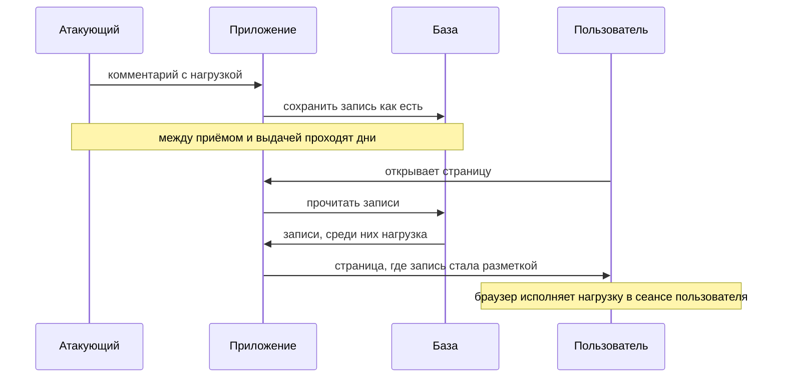

# Хранимый XSS

Вечером в понедельник на доске комментариев появляется запись необычного
содержания: вместо текста там разметка, собранная как нагрузка из темы
`xss-reflected`. Сервер принимает запись и кладёт её в базу, автор выходит
из приложения и больше не возвращается. В среду страницу открывает
администратор — почистить спам, обычное его дело. Чужой код исполняется в
его сеансе сам: без ссылки, без перехода, без единого действия с его
стороны. Дальше нагрузка работает от имени администратора, и доступно ей
всё, что доступно ему.

Так выглядит пара обработчиков, которая это допускает:

```python
# УЯЗВИМО — демонстрация, не для продакшена
@app.post("/comments")
def add_comment(text: str, user: User):
    db.comments.insert({"author": user.name, "text": text})

@app.get("/thread")
def thread():
    rows = db.comments.find()
    items = "".join(f"<li><b>{r['author']}</b>: {r['text']}</li>"
                    for r in rows)
    return f"<ul>{items}</ul>"
```

Первый обработчик кладёт присланное в базу как есть, и сам по себе это ещё
не дефект. Второй достаёт записи и склеивает их в разметку без
экранирования, и решает именно он. Между приёмом и выдачей проходят дни,
и положенная однажды нагрузка срабатывает у каждого, кто открыл страницу.

Такая пара и есть хранимый XSS (stored XSS, он же persistent). Присланное
значение сначала сохраняется, а в разметку возвращается позже — в ответе
на другой запрос и другому человеку. Механизм исполнения тот же, что у
отражённого случая: он разобран в `xss-reflected` и здесь не повторяется.
Своё у хранимого случая — второй запрос, другой читатель страницы и другое
место, где искать сток.

**Зачем это в работе AppSec-инженера.** Хранимый случай — самый дорогой из
трёх разновидностей XSS (третья живёт целиком в браузере — это тема
`xss-dom`). Руководство OWASP по тестированию (WSTG) прямо
называет его наиболее опасным видом: один комментарий задевает каждого,
кто открыл страницу. Если её открыл администратор, нагрузка исполняется в
его сеансе без единого действия с его стороны. В ревью это разворачивает
поиск: смотреть надо не на обработчик, принявший значение, а на шаблон,
который его отдаёт. Лежат эти два места обычно в разных файлах.

## Как это работает

**Откуда это взялось.** Пока страницы отдавали только собственное
содержимое, хранить чужое было незачем. Затем приложения стали площадками
пользовательского содержимого: доска сообщений, комментарий, профиль,
переписка. Присланное перестало быть одноразовым: оно легло в базу и стало
возвращаться многим. Экранирование при этом осталось там же, где было, —
то есть чаще всего нигде. Автор шаблона считал запись из собственной базы
своими данными, а вопросы база задавать не умеет.

### Два запроса вместо одного

WSTG описывает сценарий четырьмя шагами. Атакующий сохраняет нагрузку на
уязвимой странице. Пользователь входит в приложение. Пользователь открывает
эту страницу. Браузер пользователя исполняет нагрузку. Первый шаг и
последний разнесены во времени, поэтому дефект переживает и выход
атакующего из приложения, и его блокировку. Время само по себе не лечит.



**Описание схемы.** Схема читается сверху вниз. Сначала атакующий оставляет
нагрузку: приложение кладёт запись в базу и отвечает как обычно. Затем
время идёт, а нагрузка лежит в базе. Пользователь открывает страницу,
приложение читает записи и собирает из них разметку. Запись с нагрузкой
уезжает в ответе, и браузер пользователя исполняет её: для него это свой
скрипт своей страницы.

У сценария есть и второе имя — second-order, «второго порядка». Оно про то,
какой код опасен: не тот, что принял значение, а тот, что позже вставил
его в разметку. В ревью проверяются оба конца цепочки, но решает второй.

### Где хранится присланное

Хранилище — не обязательно база приложения. Присланное лежит и в других
местах, и ревью пропускает ровно то место, о котором не вспомнили. Поэтому
список стоит держать в голове целиком. WSTG перечисляет типовые.

- Профиль пользователя: имя, псевдоним, подпись, адрес.
- Комментарий, сообщение доски, описание товара.
- Журналы и панели наблюдения — служебные страницы, которые показывают, кто
  и когда обращался к приложению, вместе с адресом запроса и заголовком
  `User-Agent`, которым клиент представляется серверу.
- Менеджер файлов: имя загруженного файла и его содержимое.

Присланное приезжает и вовсе без формы приложения. PortSwigger Web Security
Academy, учебный полигон авторов Burp Suite, называет и такие источники.
Почтовый клиент показывает письмо, пришедшее по SMTP. Площадка показывает
пост из социальной сети. Система наблюдения показывает разобранный сетевой
трафик. Общее у всех одно: присланное хранится и потом попадает в разметку.

Загрузка файла стоит особняком. Если приложение принимает файл и отдаёт
его с типом содержимого `text/html`, файл сам становится страницей в origin
приложения. Нагрузка лежит тогда в теле файла, и экранирование шаблона до
неё не доходит вовсе.

### Радиус поражения

У отражённого случая жертва одна — та, что перешла по ссылке. У хранимого
жертвой становится каждый, кто открыл страницу, и выбор жертвы атакующему
не принадлежит. Ссылка ему не нужна вовсе: отражённый XSS обязан довести
человека до адреса с нагрузкой, а хранимому достаточно, что человек
пользуется приложением как обычно.

WSTG отмечает случай, который делает дефект тяжёлым. Страницу с нагрузкой
открывает пользователь с высокими правами, и нагрузка исполняется в его
сеансе сама. Панель журнала из списка мест хранения — как раз такая
страница: читает её обычно администратор.

## Как это атакуют

Хранимый случай атакуют вслепую: нагрузка исполнится в чужом браузере,
и момента срабатывания атакующий не увидит. Поэтому начинают с метки, а не
с нагрузки. В каждое поле, которое хранится и показывается другим, кладут
безобидную разметку с уникальной строкой. Затем смотрят, где метка
всплывёт: на странице обсуждения, в профиле, в панели журнала. Метка, которая
всплыла как разметка, а не как текст, говорит о стоке без экранирования,
и на её место кладут нагрузку.

Кандидатов больше, чем кажется. Хранится и показывается не только текст
комментария: имя и подпись в профиле, заголовок объявления, имя загруженного
файла. Отдельная надежда — журналы. Туда пишется `User-Agent` из любого
запроса, и одного обращения к обычной странице хватит, чтобы оставить в
журнале произвольную строку. Панель журнала читают администраторы, поэтому
срабатывание там ценнее всего для атакующего.

Особый ход — загрузка файла: он разобран в разделе про места хранения. Файл
с типом `text/html` — готовая страница в origin приложения. Нагрузка едет
в его теле, и ни один шаблон в ней не участвует.

## Как это выглядит в коде

Ревьюер ищет не приём значения, а его выдачу. Тот фрагмент, с которого
началась тема, читается тремя планами. Понять, что делает приём. Найти
сток, где запись базы становится разметкой. Проверить, какие поля уходят
в шаблон как есть. Перечитайте пару обработчиков и укажите сток сами,
прежде чем идти за выносками.

```python
# УЯЗВИМО — демонстрация, не для продакшена
@app.post("/comments")
def add_comment(text: str, user: User):
    db.comments.insert({"author": user.name, "text": text})   # (1)

@app.get("/thread")
def thread():
    rows = db.comments.find()
    items = "".join(f"<li><b>{r['author']}</b>: {r['text']}</li>"
                    for r in rows)                            # (2)
    return f"<ul>{items}</ul>"
```

1. Приём: значение кладётся в базу как есть. Само по себе это не дефект:
   записи из базы читают разные места, и решает тот, кто выводит.
2. Сток: запись базы попадает в разметку склейкой. Экранирования нет ни у
   текста, ни у имени автора, а имя пришло от пользователя так же, как текст.

Признак дефекта в коде — подстановка поля записи в шаблон без
экранирования. Внимательнее всего смотрите на поля, которые кажутся
служебными: имя автора, заголовок, метка. Второй признак — экранирование,
стоящее в обработчике приёма. Оно означает, что автор считал место приёма
местом защиты, а защита нужна у места вывода.

## Как защититься

Правило то же, что в `xss-reflected`: экранирование на выводе, у самого
места вставки. Запись базы — такое же недоверенное значение, как параметр
запроса, потому что попала она в базу от пользователя. Исправленный вариант
той же выдачи:

```python
# Исправлено.
from html import escape

@app.get("/thread")
def thread():
    rows = db.comments.find()
    items = "".join(
        f"<li><b>{escape(r['author'])}</b>: {escape(r['text'])}</li>"
        for r in rows)                                        # (1)
    return f"<ul>{items}</ul>"
```

1. Экранируются оба поля, а не одно. Пропуск любого оставляет дефект
   целиком: атакующему безразлично, через какое поле он попадёт в разметку.

`escape` — функция `html.escape` из стандартной библиотеки Python. Она
заменяет знаки, значимые для разметки, на безобидные записи. Угловая скобка становится `&lt;`, и браузер печатает её как текст,
а не заводит тег. Какие знаки заменяются, решает место вставки, и этот
аппарат разобран в темах `xss-reflected` и `xss-contexts`.

**Границы применимости.** Экранирование годится, пока хранится текст. Если
по требованию хранится именно разметка — комментарий с оформлением, статья
из редактора, — экранирование выводит читателю его собственные теги вместо
оформления. Тогда на входе в хранилище ставится санитайзер: библиотека,
которая разбирает присланную разметку и возвращает её без опасных тегов,
атрибутов и адресов.

Санитайзер работает как пропускной пункт: разметка — поток людей, список
разрешённых тегов — список допущенных, всё вне списка не проходит. Ломается
аналогия на самом списке. На пропускном пункте допущенные известны заранее
и не меняются. А набор конструкций, которые браузер разберёт как опасные,
не знает заранее никто. Поэтому ASVS, стандарт требований к проверке
приложений, предписывает прямо: требование v5.0-1.3.1 велит очищать
разметку из редактора известной библиотекой, а не своими руками. Почему
своими руками не выходит — тема `xss-filter-bypass`.

**Что не заменяет починку.** Проверка при приёме полезна как ограничение
длины и формы, но защитой не считается. Значение приезжает в хранилище
и мимо этой формы: импортом, вызовом соседнего сервиса, административной
панелью. Место, которое обязано быть верным, одно — вывод.

**Файлы и вторые слои.** Особый случай с загрузкой закрывается отдельно.
Файл отдают с типом содержимого, при котором браузер не станет разбирать
его как документ, — например `application/octet-stream`. Заголовок
`Content-Disposition: attachment` велит браузеру сохранить файл, а не
открывать его. А `X-Content-Type-Options: nosniff` из темы
`security-headers` запрещает браузеру угадывать тип самому. Вторым слоем
на самой странице стоит политика CSP (Content Security Policy) из темы
`csp`. Без `unsafe-inline`
браузер не исполнит инлайн-обработчик вроде `onerror`, и нагрузка не
сработает, даже если экранирование где-то пропустили. Эти слои сужают
ущерб и ловят пропуски, но починку не заменяют.

**Как убедиться, что экранирование на месте.** Отправьте через форму
комментарий с угловыми скобками, например `<b>проверка</b>`, и откройте
исходник страницы. Верная защита оставляет в разметке
`&lt;b&gt;проверка&lt;/b&gt;`: браузер напечатает текст как есть,
и никакого жирного не будет. Ту же проверку повторите для имени автора
и для записи, положенной в базу мимо формы, — импортом или служебным
сценарием. Расхождение между путями — готовая находка: на одном пути
значение экранируется, на другом нет.

## Частая ошибка

Звучит надёжно: значение проверено при приёме и лежит в своей базе —
значит, оно стало своим, и в шаблон его можно подставлять как есть. Прежде
чем читать дальше, найдите изъян сами.

Изъян в слове «своим». Запись базы недоверенная не потому, что база плохая,
а потому, что её содержимое прислал пользователь. Хранилище меняет адрес
значения, но не его происхождение. А проверка при приёме закрывает один
путь из нескольких: то же поле заполняется импортом, служебным сценарием,
панелью поддержки, вызовом соседнего сервиса.

Контрпример. Приложение чистит комментарии при приёме и отдаёт их шаблоном
без экранирования. Имя автора при этом берётся из профиля, а профиль
заполняется другой формой и чистку не проходит. Нагрузка кладётся в поле
«псевдоним», выходит на страницу вместе с каждым комментарием этого автора
и срабатывает у всех читателей.

## Чеклист для ревью

1. Проверьте, что значение из хранилища экранируется у места вставки так же,
   как значение из запроса (ASVS v5.0-1.1.2).
2. Проверьте, что экранированы все поля записи, а не только текст сообщения:
   имя автора, заголовок, метка.
3. Проверьте, что разметка, которую пользователь присылает намеренно,
   очищается известной библиотекой-санитайзером (ASVS v5.0-1.3.1).
4. Проверьте, что найдены все места вывода одного и того же хранимого поля,
   включая административные панели и журналы (WSTG-v42-INPV-02).
5. Проверьте, что загруженный файл не отдаётся с типом содержимого, при
   котором браузер разберёт его как документ.
6. Проверьте, что защита не сведена к проверке при приёме: то же поле
   заполняется импортом и служебными путями.

## Попробуй сам

Возьмите приложение своего стека, где пользователь оставляет текст, видимый
другим. Найдите поле, которое хранится и выводится, и пройдите его путь до
шаблона: где значение принимается, где хранится, где вставляется в разметку.
Выпишите для каждого места вывода, какое экранирование там стоит.

**Критерий выполнения** наблюдаемый: список мест вывода одного поля
с пометкой у каждого, есть экранирование или его нет. И одно предложение
о том, какое из этих мест сломается, если поле заполнить импортом, а не
через форму.

## Проверь себя

1. Панель наблюдения показывает журнал обращений:

   ```python
   @app.get("/admin/visits")
   def visits():
       rows = db.visits.find()
       items = "".join(f"<tr><td>{r['ip']}</td><td>{r['ua']}</td></tr>"
                       for r in rows)
       return f"<table>{items}</table>"
   ```

   Где здесь сток, и каким действием атакующий положит нагрузку в базу, если
   формы у панели нет?
2. Два обработчика доски комментариев из раздела «Как это выглядит в коде»:
   приём кладёт текст в базу, выдача склеивает записи в разметку. Какая
   правка устраняет дефект?

   A. Экранировать текст один раз при приёме, до записи в базу: дальше значение
      уже своё, проверенное.

   B. Оставить приём как есть и экранировать поля записи у места вставки в
      разметку.

   C. Отклонять при приёме значения с угловыми скобками и кавычками: опасной
      нагрузке не из чего собраться.

3. Почему обработчик приёма в этой паре не считается дефектом, а обработчик
   выдачи — считается?
4. Комментарий хранит строку `<b>жирный</b> & "x"`. Предскажите, что
   напечатает этот код.

   ```python
   from html import escape
   print(escape('<b>жирный</b> & "x"'))
   ```

5. Возврат к теме `xss-reflected`: чем нагрузка для значения атрибута
   отличается от нагрузки для тела документа?
6. Возврат к теме `cookies`: у сессионной куки стоит атрибут `HttpOnly`.
   Что он отнимает у хранимой нагрузки, а что ей оставляет?

<details markdown="1">
<summary>Ответ 1</summary>

1. Сток — склейка полей записи в разметку ответа: экранирования нет ни у `ip`,
   ни у `ua`. Форма не нужна: поле `ua` — это заголовок `User-Agent` запроса,
   и атакующий присылает своё значение в нём одним обращением к любой странице,
   которая журналируется. Нагрузка сработает у того, кто откроет панель.

</details>

<details markdown="1">
<summary>Ответ 2: разбор вариантов</summary>

2. Верный ответ — B.

   A. Неверно. Запись в базе не делает значение своим: прислал его
      пользователь. А само поле заполняется и мимо этой формы — импортом,
      панелью поддержки, вызовом соседнего сервиса, — и тогда экранирование в
      одном обработчике приёма эти пути не закрывает.

   B. Верно. Путей в хранилище несколько, а в разметку ведёт одно место
      вывода — верным обязано быть оно. Экранирование у места вставки закрывает
      значение независимо от того, каким путём оно попало в базу.

   C. Неверно. Отказ от угловых скобок и кавычек в комментарии ломает законный
      текст («счёт & <тариф>»). А нагрузка для другого места вставки
      соберётся и без них: для значения атрибута хватает кавычки.

</details>

<details markdown="1">
<summary>Ответ 3</summary>

3. Потому что хранение само по себе безобидно: дефект рождается там, где
   запись становится разметкой без экранирования. Приём — один из нескольких
   путей значения в базу, и чинить путь бессмысленно, пока открыт сток.

</details>

<details markdown="1">
<summary>Ответ 4</summary>

4. `&lt;b&gt;жирный&lt;/b&gt; &amp; &quot;x&quot;` — экранированы угловые
   скобки, амперсанд и обе кавычки. Прогон:
   `python3 -c "from html import escape; print(escape('<b>жирный</b> & \"x\"'))"`.

</details>

<details markdown="1">
<summary>Ответ 5</summary>

5. В атрибуте нагрузка начинается с кавычки, закрывающей атрибут, и дописывает
   свои атрибуты к тому же элементу; угловых скобок в ней нет. В теле документа
   нагрузка — разметка с угловыми скобками, и заводит её браузер на открывающей
   скобке.

</details>

<details markdown="1">
<summary>Ответ 6</summary>

6. Атрибут `HttpOnly` отнимает у нагрузки чтение значения куки: в
   `document.cookie` её нет. Но к каждому запросу куку прикладывает сам
   браузер, поэтому запросы, которые отправляет нагрузка, несут сессию
   с собой. Прочитать значение нагрузка не может, а пользоваться сессией
   может. Атрибут сужает ущерб, а сам дефект не чинит.

</details>

## Источники

1. PortSwigger Web Security Academy, «Cross-site scripting»; реестр `ps-xss`.
   Разделы: Stored cross-site scripting, What can XSS be used for, Impact of
   XSS vulnerabilities.
   <https://portswigger.net/web-security/cross-site-scripting>
2. OWASP WSTG-INPV-02 «Testing for Stored Cross Site Scripting», WSTG v4.2;
   реестр `wstg-v42-inpv-02-stored-xss`. Разделы: Summary, Test Objectives,
   Input Forms, File Upload, Gray-Box Testing.
   <https://owasp.org/www-project-web-security-testing-guide/v42/4-Web_Application_Security_Testing/07-Input_Validation_Testing/02-Testing_for_Stored_Cross_Site_Scripting>
3. OWASP Cross Site Scripting Prevention Cheat Sheet; реестр
   `owasp-cs-xss-prevention`. Разделы: Output Encoding, HTML Sanitization,
   Safe Sinks.
   <https://cheatsheetseries.owasp.org/cheatsheets/Cross_Site_Scripting_Prevention_Cheat_Sheet.html>

Каркас этапа: `owasp-asvs-5-document` (ASVS v5.0.0), `owasp-wstg-42`,
`owasp-top10-2025`. Наследуются всеми темами и отдельной строкой не
повторяются.

**Скоропортящийся слой.** Список мест хранения растёт вместе с приложением.
Поведение браузеров при разборе загруженного файла привязано к полям
`Content-Type` и `X-Content-Type-Options` и к версии браузера. Страницы
академии и cheat sheet — живые площадки без даты публикации.

**Маркеры уверенности.** Сценарий из четырёх шагов, перечень мест хранения,
случай с администратором и загрузка файла с чужим типом содержимого — **по
документации** (WSTG-INPV-02, открыт лично 2026-08-24). Определение хранимого
случая и источники не из формы приложения — **по документации** (Web Security
Academy, открыта лично 2026-08-24). Требование очищать разметку редактора
известной библиотекой — **по документации** (ASVS v5.0.0, открыт лично
2026-08-24). Листинг из вопроса 4 самопроверки прогнан локально 2026-10-03,
Python 3.14.7: вывод совпал дословно. Лично **не воспроизводилось**: стенда
с хранилищем и вторым пользователем не собиралось, механизм исполнения
нагрузки в браузере проверен прогонами темы `xss-reflected` и там же описан.
