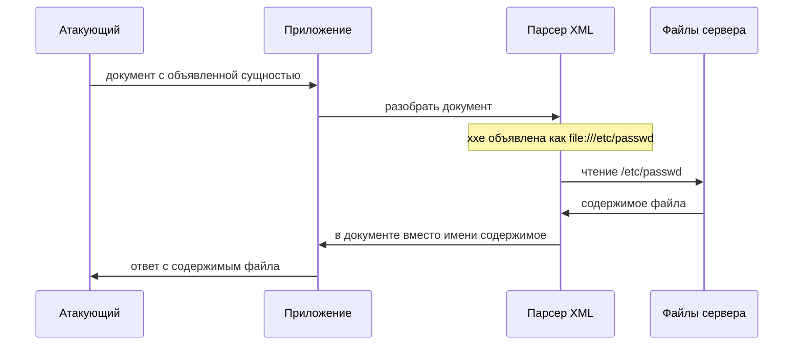

# XXE: чтение файлов и SSRF через парсер XML

Приложение проверяет остаток товара на складе: витрина отправляет на сервер
номер товара и получает количество. Протокол у этого обмена — документ XML
в теле запроса вместо привычной формы с полями. Пользователь присылает такой
документ:

```xml
<?xml version="1.0"?>
<!DOCTYPE foo [ <!ENTITY xxe SYSTEM "file:///etc/passwd"> ]>
<stockCheck><productId>&xxe;</productId></stockCheck>
```

С документом всё в порядке по правилам XML, и проверка содержимого его
пропускает. Но вторая строка данным не принадлежит: это инструкция программе,
которая будет документ читать: «везде, где встретится имя `xxe`, подставь
содержимое файла `/etc/passwd`». Если программа такие инструкции выполняет,
файл уезжает в ответ тому, кто прислал документ. Никакого взлома здесь нет:
чтение сделал штатный механизм XML, исполнивший то, что написано в
документе. Дефект с таким устройством называют XXE (XML external entity),
и решается он одной строкой настройки.

## Что такое XML и откуда в нём сущности

### XML и парсер

XML — текстовый формат, в котором данные записаны вложенными тегами вроде
`<productId>4</productId>`. Человек читает такой документ глазами, без
программ, и в этом его назначение: переносить документы между системами,
написанными на разных языках. XML встречается на вебе чаще, чем можно
подумать. Протокол SOAP ходит XML-сообщениями, картинка SVG внутри —
XML-документ, офисный DOCX — архив из XML-файлов, а настройки программ
часто лежат в XML-конфигах. Точек, где приложение принимает XML снаружи,
поэтому больше, чем форм с надписью «загрузите XML».

Присланный документ читает парсер XML — библиотека, которая превращает
текст в дерево элементов и отдаёт его коду приложения. Парсер же решает,
что в документе данные, а что служебная инструкция, и как эту инструкцию
исполнять. Поэтому в центре темы стоят настройки парсера: они решают судьбу
присланного документа.

### DTD и сущности

У документа может быть служебная шапка — DTD (document type definition,
«определение типа документа»). Это блок объявлений в начале файла, между
словом `<!DOCTYPE` и закрывающей скобкой: там документ сообщает парсеру,
из чего состоит. Среди прочего в DTD объявляют сущности.

Сущность (entity) — именованная подстановка. Документ объявляет «имя `x`
означает такой-то текст», а дальше пишет `&x;`, и парсер при разборе ставит
на его место объявленный текст. Работает это как автозамена в редакторе:
вы завели сокращение «адр», печатаете письмо с «адр», а адресат получает
полный адрес. Соответствие точное: сокращение — имя сущности, полный
текст — её значение, редактор — парсер. Ломается аналогия в одном месте.
Автозамена подставляет строку, которую вы сами написали заранее, а сущность
умеет брать значение извне — и тогда подстановкой управляет тот, кто прислал
документ.

### Внешняя сущность

Сущность, которая берёт значение из внешнего ресурса, называется внешней
(external). Её объявляют с ключевым словом `SYSTEM` и адресом ресурса.
Запись `file:///etc/passwd` — адрес файла на диске самого сервера: схема
`file://` ведёт в локальную файловую систему. Запись
`http://…` — обычный сетевой адрес, устройство таких адресов разбирает тема
`url-and-encoding`. В обоих случаях внешняя сущность велит парсеру сходить
за значением наружу: на диск или в сеть.

Теперь документ из начала темы читается целиком. В его шапке объявлена
внешняя сущность `xxe` со значением-адресом `file:///etc/passwd`, а в теле
стоит обращение `&xxe;`. Парсер с включённой обработкой сущностей прочитает
файл и вставит его содержимое в `<productId>`. Это и есть XXE: присланный
документ объявляет внешнюю сущность, а парсер разворачивает её, читая файл
или ходя по адресу.

## Как это работает

Проследим путь документа через приложение. Шагов четыре. Приложение
принимает тело запроса и отдаёт его парсеру. Парсер читает шапку и
запоминает объявленную сущность. В теле документа он встречает `&xxe;` и
идёт за значением по адресу из объявления. Содержимое файла встаёт в
документ, и приложение отдаёт его в ответе. Решение — читать файл или
нет — принято ровно в одной точке: внутри парсера, по его настройке.



**Описание схемы.** Схема читается сверху вниз и показывает путь присланного
документа. Приложение отдаёт его парсеру, парсер по объявлению из шапки
читает файл сервера и подставляет содержимое в документ, а приложение
возвращает документ в ответе. Файл покидает сервер через парсер; приложение
этой границы не видит.

Обратите внимание, чего в этой цепочке нет: некорректного ввода. Документ
корректен по правилам XML, и проверка содержимого его пропускает. Файл
читает сам парсер, поэтому закрывают дефект настройкой парсера — фильтрация
ввода здесь бессильна. К этому выводу тема вернётся ещё раз. А прежде вопрос,
который стоит прикинуть самостоятельно: если в объявлении вместо
`file:///etc/passwd` написать адрес `http://169.254.169.254/`, какой шаг
цепочки изменится, а какой останется прежним?

### Три исхода

У XXE три исхода; вопрос выше про второй из них, а первый вы уже видели
во вступлении.

**Чтение файла.** Сущность указывает путь `file://`, и содержимое файла
попадает в документ, а из него в ответ. Так читают конфигурации, ключи и
любые файлы, к которым у парсера есть доступ.

**SSRF.** Сущность указывает адрес `http://`, и парсер ходит по нему сам.
Получается `ssrf-basics` в чистом виде, только запрос здесь инициирует
парсер XML. В цепочке меняется один шаг: вместо чтения файла выполняется
сетевой запрос, а всё остальное, включая подстановку в документ, остаётся
прежним. Цели те же, что в обычном SSRF: внутренние службы и служебный
интерфейс облачной платформы.

**Слепой XXE.** Бывает, что значение сущности в ответ не попадает:
приложение разбирает документ молча. Тогда подстановка в тело бесполезна,
и данные уносят внеполосным каналом из темы `blind-ssrf`: парсер заставляют
самому обратиться к серверу атакующего, вставив прочитанное в адрес
обращения. Такой адрес собирают внутри шапки DTD, а внутри шапки действуют
только параметрические сущности — их зовут записью через `%` вместо `&`.
Ими документ и строит обращение. Второй вариант слепого исхода — текст
ошибки: если приложение возвращает сообщение парсера наружу, в него может
попасть кусок прочитанного.

**Откуда это взялось.** XML задумывали расширяемым: документ сам объявляет,
из каких частей состоит, а сущности придумали как сокращения для
повторяющегося текста. Внешние сущности добавили для честной цели — собирать
документ из фрагментов, которые лежат в других файлах. Для документа,
который пишет сам владелец системы, это экономит труд: правка фрагмента в
одном файле попадает во все документы, где он включён. Для присланного
извне — опасно, потому что объявлять, что читать, начинает отправитель.

Раньше парсеры разворачивали сущности по умолчанию, потому что сценарий
«свой документ» считался основным. Ущерб от чтения чужих файлов оказался
велик, и обработку внешних сущностей закрыли по умолчанию. С тех пор
закрытость — норма: проверено на стандартной библиотеке Python, где
документ из начала темы падает с «undefined entity». Поэтому дефект чаще
не в том, что защиту забыли включить, а в том, что обработку сущностей
включили обратно.

**Зачем это в работе AppSec-инженера.** Вопрос из этой темы задаётся каждому
месту, где приложение принимает XML: загрузке документов, SOAP-сервисам,
форматам вроде SVG и DOCX, разбору конфигураций. Исход у дефекта тяжёлый —
чтение файлов сервера и SSRF во внутреннюю сеть. Поэтому ревьюер проверяет
настройку парсера: разворачивает ли тот внешние сущности и DTD. Наличие
фильтра на опасные строки здесь ничего не доказывает. Дефект живёт в
конфигурации, и находится он чтением конфигурации.

## Как это выглядит в коде

Ревьюер смотрит не на данные, а на настройку парсера. Разбор фрагмента ниже
идёт тремя планами: найти, где создан парсер; назвать, что ему разрешено;
проверить, чей документ он разбирает. Фрагмент написан на lxml — сторонней
библиотеке XML для Python, где обработка сущностей настраивается явно. Не
заглядывая в выноски, найдите строку, которая открывает XXE, и объясните,
что именно она разрешает парсеру.

```python
# УЯЗВИМО — демонстрация, не для продакшена
parser = etree.XMLParser(resolve_entities=True)   # (1)
tree = etree.fromstring(user_xml, parser)         # (2)
```

1. Парсер создан с `resolve_entities=True`: обработка сущностей включена
   явно. Без этой настройки парсер оставил бы `&xxe;` неразвёрнутым, а с ней
   внешняя сущность из присланного документа развернётся.
2. Этим парсером разбирается присланный документ `user_xml`. Источник здесь —
   тело запроса XML, сток — разбор с включёнными сущностями: значение
   сущности встаёт в дерево, которое дальше уйдёт в ответ.

Умолчания зависят от библиотеки, и это видно на сравнении. Проверено на
стандартной библиотеке Python 3.14.7. Парсер `xml.etree.ElementTree` внешнюю
сущность не разворачивает: на документе из начала темы он падает с «undefined
entity». Второй парсер той же библиотеки, `minidom`, не подставляет её
значение. Признак дефекта поэтому — включённая обработка сущностей или
старый парсер, который делает это по умолчанию; отсутствие проверки ввода
таким признаком не служит. Признак виден прямо в конфигурации, и искать его
надо там, где парсер создаётся.

## Как защититься

Главную меру первоисточник называет прямо: отключить обработку внешних
сущностей и DTD в парсере. Она закрывает саму возможность целиком и потому
надёжнее любой фильтрации записей. Исправленный вариант того же фрагмента
читается теми же тремя планами: где создан парсер, что ему разрешено, чей
документ он разбирает.

```python
# Исправлено (lxml).
parser = etree.XMLParser(
    resolve_entities=False,   # (1)
    no_network=True,          # (2)
    load_dtd=False)           # (3)
tree = etree.fromstring(user_xml, parser)
```

1. Внешние сущности не разворачиваются: `&xxe;` останется в документе именем,
   и файл никто не прочитает.
2. Парсеру запрещён выход в сеть: SSRF-исход закрыт отдельным флагом, который
   сработает, даже если в настройке сущностей кто-нибудь ошибётся.
3. Парсер не подгружает внешний DTD — файл объявлений, на который документ
   ссылается через `<!DOCTYPE` по адресу. Блок объявлений внутри самого
   документа этот флаг не трогает: там работает только `resolve_entities=False`.

Решающий здесь первый флаг, `resolve_entities=False`: именно он останавливает
атаку из вступления, что подтверждается прогоном на libxml2. Остальные два —
эшелоны на случай ошибки в нём: сеть запрещена отдельно, и объявления нельзя
вынести во внешний DTD-файл.

**Границы применимости.** Набор флагов зависит от библиотеки и языка: у
каждого парсера свои имена настроек, и cheat sheet ведёт их список по стекам.
Общее правило одно: отключить внешние сущности, DTD и XInclude. XInclude —
отдельный механизм, который вставляет в документ внешние фрагменты по тегу,
ту же идею другим синтаксисом. Где обработка DTD нужна по делу, оставляют
локальные сущности и запрещают внешние. Проверять настройку надо там, где
парсер создаётся: значение по умолчанию зависит от версии библиотеки и могло
быть переопределено.

**Как убедиться, что настройка работает.** Парсеру подают пробный документ с
внешней сущностью — подойдёт документ из начала темы — и смотрят на
результат. Ошибка разбора, пустое значение или оставшееся неразвёрнутым имя
на месте `&xxe;` означают, что сущности закрыты. Содержимое файла в дереве —
что открыты. Проверка занимает минуту и стенда не требует, а повторять её
стоит после каждого обновления библиотеки: умолчание могло переехать.

## Частая ошибка

Встречается уверенность: приложение проверяет присланный XML на корректность
и опасные строки, значит, XXE закрыт. До чтения разбора ответьте для себя:
держится ли это рассуждение?

Оно не держится, потому что ставит защиту не на тот слой. Документ с
сущностью корректен по правилам XML, и чтение файла делает сам парсер при
разборе, исполняя объявление из шапки. Фильтру строк не за что зацепиться:
опасна включённая возможность парсера, живущая глубже символов документа.
Закрывают её настройкой парсера — проверка содержимого до этого слоя не
достаёт.

Контрпример. Приложение отклоняет XML, где встречаются строки `file://` и
`/etc/`, но парсер создан с обработкой сущностей. Документ с сущностью
`SYSTEM "http://169.254.169.254/"` ни одной такой строки не содержит: адрес
служебного интерфейса облачной платформы — это цифры. Документ проходит
проверку, и парсер ходит на этот интерфейс. Проверка данных не сработала,
потому что дефект в настройке, а не в данных.

## Чеклист для ревью

1. Проверьте, что парсер XML создан с отключёнными внешними сущностями, DTD и
   XInclude (WSTG-v42-INPV-07).
2. Проверьте, что значение по умолчанию не принято на веру: настройка задана
   явно там, где парсер создаётся.
3. Проверьте, что парсеру запрещён выход в сеть, чтобы закрыть SSRF-исход при
   ошибке в настройке сущностей.
4. Проверьте, что защита не сведена к проверке содержимого XML: против XXE она
   не действует.
5. Проверьте, что учтены неявные точки разбора XML: SOAP, SVG, форматы офисных
   документов, импорт конфигураций.

## Попробуй сам

Возьмите разбор XML своего стека и, не атакуя чужую систему, ответьте
письменно на три вопроса. Разворачивает ли ваш парсер внешние сущности по
умолчанию, и какими флагами это меняется? Что произойдёт с документом из
начала темы — ошибка разбора, пустое значение, неразвёрнутое имя сущности
или прочитанный файл? Каким флагом закрывается SSRF-исход отдельно от
сущностей?

**Критерий выполнения** наблюдаемый: три письменных ответа со ссылкой на
конкретные имена настроек вашего парсера и с результатом разбора документа —
ошибка, пусто, неразвёрнутое имя или чтение.

## Проверь себя

1. Приложение принимает документ:

   ```xml
   <?xml version="1.0"?>
   <!DOCTYPE r [ <!ENTITY x SYSTEM "http://169.254.169.254/"> ]>
   <check><id>&x;</id></check>
   ```

   Что сделает с ним парсер с включённой обработкой сущностей и к какому из
   трёх исходов это отнести?
2. Разбор входящего XML создан так: `etree.XMLParser(resolve_entities=True)`.
   Какая правка устраняет дефект?

   A. Отклонять документы, где встречаются слова `ENTITY`, `DOCTYPE` или
      `SYSTEM`.

   B. Создать парсер с `resolve_entities=False`, `no_network=True` и
      `load_dtd=False`.

   C. Оставить парсер как есть и убрать значение сущности из ответа, чтобы
      атакующий его не увидел.
3. Почему XXE закрывается настройкой парсера, а не проверкой содержимого XML?
4. Предскажите, что сделает с документом из вопроса 1 стандартная
   библиотека Python — прочитает адрес, подставит пустое или упадёт?

   ```python
   import xml.etree.ElementTree as ET
   doc = ('<?xml version="1.0"?>'
          '<!DOCTYPE r [ <!ENTITY x SYSTEM "file:///etc/hostname"> ]>'
          '<x>&x;</x>')
   print(ET.fromstring(doc).text)
   ```

5. Возврат к теме `ssrf-basics`: чем SSRF через XXE отличается от обычного
   SSRF по инициатору запроса?

<details markdown="1">
<summary>Ответ 1</summary>

1. Парсер сходит по адресу `169.254.169.254` — служебному интерфейсу облачной
   платформы — и подставит ответ на место `&x;`. Это исход SSRF: тот же ход
   по адресу из данных, но инициатором здесь выступает парсер XML.

</details>

<details markdown="1">
<summary>Ответ 2: разбор вариантов</summary>

2. Верный ответ — B.

   A. Неверно. Документ с сущностью корректен по правилам XML, а чтение делает
      сам парсер при разборе. Фильтр слов ломает законные документы с DTD и
      пропускает запись без этих слов: дефект живёт в настройке парсера.

   B. Верно. Внешние сущности не разворачиваются, а выход в сеть запрещён
      отдельным флагом: он закрывает SSRF-исход даже при ошибке в настройке
      сущностей. Внешний DTD, куда документ мог бы вынести объявления, не
      подгружается.

   C. Неверно. Когда значение сущности в ответ не попадает, данные уносят
      внеполосно: параметрическими сущностями через сервер атакующего или
      через текст ошибки парсера. Скрытие ответа сужает канал, но не закрывает
      его.

</details>

<details markdown="1">
<summary>Ответ 3</summary>

3. Сущность объявлена по правилам XML, документ корректен, а чтение файла или
   адреса делает сам парсер. Опасна включённая возможность парсера — её и
   отключают.

</details>

<details markdown="1">
<summary>Ответ 4</summary>

4. Упадёт: `xml.etree.ElementTree.ParseError: undefined entity &x;` — внешние
   сущности в стандартной библиотеке выключены по умолчанию, и парсер их не
   разворачивает. Прогон: фрагмент из вопроса, сохранённый как `probe.py`, —
   `python3 probe.py` падает с этой ошибкой (Python 3.14.7).

</details>

<details markdown="1">
<summary>Ответ 5</summary>

5. Инициатором запроса выступает парсер XML; в обычном SSRF запрос делает код
   приложения напрямую. Механизм и цели те же, но точка входа — разбор
   присланного документа.

</details>

## Источники

1. PortSwigger Web Security Academy, «XML external entity (XXE) injection»;
   реестр `ps-xxe`. Разделы: How do XXE vulnerabilities arise, Exploiting XXE to
   retrieve files, Exploiting XXE to perform SSRF attacks, Blind XXE.
   <https://portswigger.net/web-security/xxe>
2. OWASP XML External Entity Prevention Cheat Sheet; реестр
   `owasp-cs-xxe-prevention`. Разделы: General Guidance, отключение DTD и
   внешних сущностей по стекам.
   <https://cheatsheetseries.owasp.org/cheatsheets/XML_External_Entity_Prevention_Cheat_Sheet.html>
3. OWASP Top 10:2025, «A02:2025 Security Misconfiguration»; реестр
   `owasp-top10-2025-a02`. Разделы: Description, List of Mapped CWEs (CWE-611).
   <https://owasp.org/Top10/2025/A02_2025-Security_Misconfiguration/>

Каркас этапа: `owasp-asvs-5-document` (ASVS v5.0.0), `owasp-wstg-42`,
`owasp-top10-2025`. Наследуются всеми темами и отдельной строкой не
повторяются. Третья сноска — потому что XXE в издании 2025 отнесён не к
Injection, а к Security Misconfiguration.

**Скоропортящийся слой.** Имена флагов парсера привязаны к библиотеке и версии:
`resolve_entities`, `no_network`, `load_dtd` в lxml, свои — в других. Значение
по умолчанию тоже меняется между версиями. Страницы Web Security Academy и cheat
sheet — живые площадки без даты публикации.

**Маркеры уверенности.** Поведение парсера по умолчанию — **проверено лично**
2026-08-24 на Python 3.14.7: `xml.etree.ElementTree` на документе с внешней
сущностью падает с «undefined entity», `minidom` её значение не подставляет —
внешние сущности отключены по умолчанию. Механизм сущностей, три исхода и меры
защиты — **по документации** (Web Security Academy и XML External Entity
Prevention Cheat Sheet, открыты лично 2026-08-24). Чтение файла, SSRF и слепой
XXE лично **не воспроизводились**: для этого нужен парсер с включёнными
сущностями и целевое приложение, стенда не собиралось. Отнесение CWE-611 к
A02:2025 сверено со списком сопоставленных CWE страницы категории (открыта лично
2026-08-24). Роль флагов `resolve_entities` и `load_dtd` — **проверено лично**
2026-10-03 на xmllint (libxml2 2.15.4, движок под lxml). С разворачиванием
сущностей и без подгрузки внешнего DTD сущность из внутреннего блока
разворачивается и подставляет файл; без разворачивания ссылка на сущность
остаётся неразвёрнутой. Документ со ссылкой на внешний DTD без подгрузки падает
с «Entity 'x' not defined». Листинги на lxml **не запускались**: библиотека в
окружение не ставилась.
