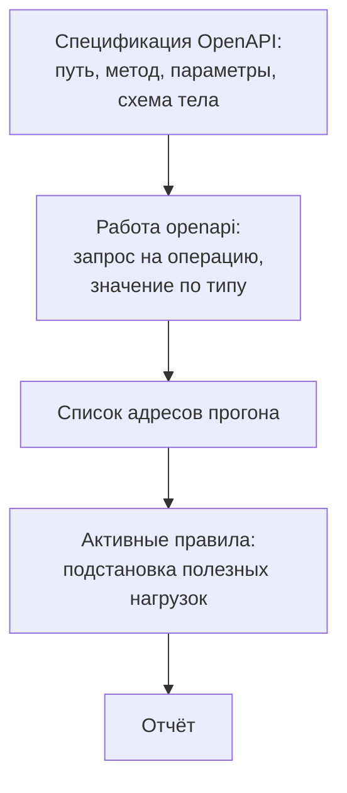

# Сканирование API по спецификации OpenAPI

Замер на учебном стенде: полный обход под входом сделал 2516 запросов, и
ни один не ушёл к путям на `/api`. Прогон формально состоялся, а API в
нём не участвовало. Паук сканера находит адреса, переходя по ссылкам,
а в ответах API ссылок нет: перечень адресов знает клиент, а не
документ, который возвращает сервер.

Тот же стенд прогнали второй раз, отдав сканеру вместо обхода файл
описания API — спецификацию OpenAPI из темы `rest-and-graphql`. Итог
другой: шесть адресов в списке прогона, 1323 запроса и три находки
высокого риска. Файл встал на место паука, потому что каждая операция
в нём даёт ровно то, из чего сканер собирает запрос. Но охват такого
прогона равен полноте описания: чего в файле нет, того в прогоне нет.
Откуда взять уверенность, что описание вашего API полное?

## Как это работает

**Зачем это в работе AppSec-инженера.** Первый практический вопрос по
безопасности API звучит так: «мы просканировали API?». Ответ «да, ZAP
прошёл по сайту» на него не отвечает, потому что сканер по сайту не
отправил в API ни одного запроса. Тема даёт прогон, про который такой
вопрос задать можно.

**Откуда это взялось.** Пока весь ввод жил в формах, обход по ссылкам
работал: всё, что можно отправить, лежало на странице. С переездом
клиента в браузерный код и мобильное приложение перечень адресов ушёл из
разметки, и паук перестал его находить. Первым обходом стала запись
трафика настоящего клиента: её скармливают сканеру как готовый список
запросов. Это работает, но повторить нельзя, потому что запись зависит
от того, куда в тот раз нажали. Тогда взяли то, что и так пишут для
клиента, — машиночитаемое описание API.

Тема — рецепт настройки, поэтому из механики оставлен минимум, нужный
для понимания результата. Устройство самого прогона, то есть обход и два
набора правил, разобрано в `zap-scanning`. Как устроен REST и чем он
отличается от GraphQL, разобрано в `rest-and-graphql`. Здесь остаётся
то, что объясняет вывод: что сканер берёт из описания, а что достраивает
сам.

Что сканер берёт из спецификации: путь и метод операции, перечень
параметров с местом каждого и схему тела запроса [^2]. Место параметра
задаёт поле `in` — путь, строка запроса, заголовок или cookie; все места
разобраны в `rest-and-graphql`. Из этих частей сканер собирает по одному
запросу на операцию и кладёт их в список, откуда их берут активные
правила. То есть делает ровно то, что делал паук, только по описанию, а
не по ссылкам.

Чего в спецификации нет и что сканер достраивает сам: значений. Если у
параметра записан `default` — значение по умолчанию, которое автор
описания подсказал прямо в нём, — берётся оно. Иначе сканер подставляет
что-нибудь по типу: на объявленное целое — произвольное число, на
строку — произвольную строку.

Это как бланк, заполненный посторонним: клетки — параметры операции,
значения в них выдуманные. Аналогия ломается на приёмнике: бумажный
бланк с такими значениями всё равно прочтут, а запрос к API — нет.
Операция ответит 400, запрос не дойдёт до кода, который вы хотели
проверить, и активное правило будет работать по странице ошибки.



**Описание схемы.** Схема читается сверху вниз и показывает путь от
файла описания до отчёта. Работа `openapi` разворачивает спецификацию в
список запросов — тот самый список, который при обходе собирал паук.
Дальше работают те же активные правила: им безразлично, откуда взялся
адрес.

## Что умеет и чего не умеет

**Что умеет.** Прочитать описание из файла или по адресу, в JSON или в
YAML, версий 1.2, 2.0 и 3.x. Развернуть его в перечень запросов и
передать активным правилам. Подставить свой базовый адрес вместо
записанного в описании: там стоит поле `servers`, место в спецификации,
где записан адрес, по которому API принимает запросы. В рабочем описании
там адрес рабочей системы, поэтому подмена нужна всегда — как именно,
показано в разделе «Как запустить».

**Чего не умеет.** Проверить операцию, которой в описании нет. Ручка
`/api/v1/reports` на стенде не связана ни с одной страницей, и ни один
прогон по разметке её не видел. Нашлась она только потому, что её
вписали в спецификацию. Обратный случай встречается чаще: ручка в
приложении есть, а в описании её нет — и тогда её не найдёт уже этот
прогон.

**Чего не умеет ни один режим на API.** Отличить свой объект от чужого.
Ручка `/api/v1/orders/{id}` отдаёт заказ без проверки владельца, и в
отчёте её нет. Тема `zap-scanning` показывала это на странице заказа:
сканер перебрал 215 производных значений параметра `id` и ни разу не
попробовал номер чужого заказа. Почему это не лечится настройкой,
разбирает тема `dast-limits`.

## Как запустить

ZAP 2.17.0, стенд «Лавка», описание отдаётся на `/api/openapi.json`.
Прогон описывается файлом плана, как в `zap-scanning`, и меняется в нём
одна работа: `openapi` встаёт на место `spider`. Работ в плане четыре, и
у каждой своя роль: `openapi` собирает адреса из описания,
`passiveScan-wait` ждёт очередь, `activeScan` идёт по собранному,
`report` выгружает итог:

```yaml
env:
  contexts:
    - name: lavka-api
      urls: ["http://127.0.0.1:8081/"]
      includePaths: ["http://127.0.0.1:8081/api.*"]
jobs:
  - type: openapi
    parameters:
      apiUrl: "http://127.0.0.1:8081/api/openapi.json"
      targetUrl: "http://127.0.0.1:8081/"
      context: lavka-api
  - type: passiveScan-wait
  - type: activeScan
    parameters: {context: lavka-api, maxScanDurationInMins: 10}
  - type: report
    parameters:
      template: traditional-json
      reportDir: "./out"
      reportFile: "api"
```

Вместо `apiUrl` можно дать `apiFile` — путь к файлу описания на диске.
Разница только в том, откуда работа забирает описание: по адресу его
отдаёт само приложение, а файлом оно лежит в репозитории рядом с кодом.
Дальше план не меняется: оба варианта дают работе одно и то же описание.

Две вещи ломают прогон, если о них не знать.

**`targetUrl` обязателен, даже когда кажется лишним.** В описании стоит
поле `servers`, и в рабочем описании там адрес рабочей системы. Параметр
`targetUrl` подменяет его адресом стенда. Без подмены прогон уйдёт на
рабочую систему, а не на ваш стенд, — и это тот случай, когда ошибка
настройки означает сканирование чужого узла.

**Область контекста надо сузить.** В плане из этого раздела
`includePaths` ограничивает прогон путями `/api`. Без этого активные
правила уйдут гулять по всему хосту, и отчёт перестанет быть отчётом по
API.

## Как читать вывод

Сначала сравнение: один стенд, два источника адресов.

```text
                             обход по ссылкам   импорт описания
запросов к путям /api                       0              1323
адресов добавлено в список                  0                 6
сработало правил                            —                 5
находок высокого риска                      —                 3
```

Три находки высокого риска:

```text
40018  SQL Injection   GET /api/v1/products?filter='            conf=Low
6      Path Traversal  GET /api/v1/reports?path=/etc/passwd     conf=Medium
40026  XSS (DOM)       GET /api/v1/reports?path=<script>…       conf=High
```

Колонка `conf` — уверенность правила в том, что находка настоящая: та
самая, что в `zap-scanning` стояла в скобках `riskdesc`. Первая находка
— `CWE-89`, склейка значения со строкой запроса; чинится в
`sqli-basics`. Вторая — `CWE-22`, путь к файлу из параметра; чинится в
`path-traversal`. Третья — отражение полезной нагрузки на странице
ошибки: та же ручка, но найденная по другому признаку.

**Чего в отчёте по API нет и почему.** Правило про отсутствующий
`Content-Security-Policy` и правило про заголовок от вставки в рамку не
сработали ни разу, хотя этих заголовков на стенде нет нигде. Оба правила смотрят
только на ответы с разметкой: у ответа `application/json` ни того ни
другого быть не должно. Пассивных правил на API вообще срабатывает
меньше. В этом отчёте их два: про версию сервера и про отсутствующий
`X-Content-Type-Options`, который для JSON как раз имеет смысл.

**Что означает список адресов.** Работа `openapi` напечатала «added 6
URLs», а операций в описании пять. Шестой адрес — сама спецификация:
работа скачала её по HTTP с адреса из `apiUrl`, и этот адрес попал в
список вместе с пятью операциями. Этот список и есть весь охват прогона,
и его надо сверять с настоящим перечнем путей приложения.

Расхождение между описанием и кодом — типовая находка, и находят её не
сканером, а сравнением двух списков: операций в описании и маршрутов в
коде. В отчёте по вашему API шесть адресов, а маршрутов в коде девять —
что именно проверил прогон и что он пропустил?

## Границы метода

**Граница первая: описание — это обещание, а не приложение.** Оно
пишется руками или собирается из кода и отстаёт от него. Операция,
снятая с публикации и оставшаяся в коде, в описании не появится.
Операция, добавленная вчера, тоже. Прогон по описанию проверяет
описанное.

**Граница вторая: значения.** Сканер подставляет `default` или
что-нибудь по типу. Операция, которая проверяет входные данные и
отвечает 400 на выдуманное значение, будет проверена по своей же
странице ошибки. Признак — отчёт, где все находки указывают на одну и
ту же реакцию приложения.

**Граница третья: вход.** У API он обычно не в cookie, а в заголовке с
токеном, и настраивается отдельно от импорта описания; порядок разбирает
`authenticated-scanning`. Без входа прогон по защищённым операциям
вернёт кучу ответов 401 и ни одной находки.

**Цена.** 1323 запроса на шесть адресов — около двухсот на адрес. В
пересчёте на адрес это дороже прогона по разметке: там 1331 запрос на
одиннадцать адресов. У операции API параметров обычно больше, а страниц,
на которые нечего подставлять, нет вовсе.

## Частая ошибка

Решите до чтения дальше: у приложения есть описание OpenAPI — значит ли
это, что его API можно просканировать полностью?

У метода есть репутация исчерпывающего: раз описание есть, полный
прогон возможен. Это неверно, потому что полнота прогона равна полноте
описания, а полноту описания никто не мерил. На стенде описание было
написано вместе с приложением и совпадало с ним, а в жизни оно живёт
отдельно. Ручка, которую забыли описать, для прогона не существует —
ровно так же, как ручка без ссылки не существует для паука. Метод не
расширил охват: он перенёс его границу из разметки в файл описания.

Контрпример к обратному выводу «значит, и описание не поможет»: на
стенде оно дало два настоящих дефекта, которых не нашёл ни один прогон
по разметке. Правильный вывод не «бесполезно», а другой: список операций
— отдельный артефакт, и его надо проверять отдельно, сравнением с
маршрутами в коде.

## Чеклист для ревью

1. Проверьте, что в прогоне подменён базовый адрес и запросы ушли на
   проверяемый стенд, а не на адрес из поля `servers`.
2. Проверьте, что область прогона ограничена путями API, а не всем
   хостом.
3. Проверьте, что число операций в описании названо и сверено с
   перечнем маршрутов в коде.
4. Проверьте, что операции, требующие входа, прогнаны с токеном, а не
   отвечают 401.
5. Проверьте, что подставленные значения параметров доходят до
   проверяемого кода, а не отбиваются проверкой входных данных.
6. Проверьте, что про операции, которых в описании нет, сказано в
   отчёте прямо.

## Попробуй сам

Взять описание своего API, прогнать по нему сканер и отдельно собрать
перечень маршрутов из кода. Свести два списка в одну таблицу: есть в
обоих, есть только в описании, есть только в коде.

Одна подсказка: третья колонка — самая интересная, и собрать её обычно
можно одной командой поиска по объявлениям маршрутов в исходниках.

**Критерий выполнения** наблюдаемый: у вас есть число операций в
описании, число маршрутов в коде и поимённый список расхождений в обе
стороны.

## Проверь себя

1. Прочитайте операцию из чужого описания:

   ```yaml
   paths:
     /api/v1/orders/{id}:
       get:
         parameters:
           - name: id
             in: path
             schema: {type: integer}
           - name: expand
             in: query
             schema: {type: string, default: ""}
   ```

   Соберите запрос, который сканер положит в список, и назовите, откуда
   возьмётся значение `id`.
2. Почему в отчёте по API не сработало правило про отсутствующий
   `Content-Security-Policy`, хотя его нет ни на одном адресе стенда?
3. У приложения есть описание OpenAPI. Значит ли это, что API можно
   просканировать полностью?

   А. Да: описание даёт полный перечень операций.

   Б. Охват прогона равен полноте описания, и полноту описания проверяют
      отдельно — сравнением с маршрутами в коде.

   В. Нет: сканирование API по описанию бесполезно.

4. Не запуская, предскажите, что напечатает эта сверка двух списков.

   ```python
   spec = ["/api/v1/products", "/api/v1/reports", "/api/v1/orders/{id}"]
   routes = ["/api/v1/products", "/api/v1/reports", "/api/v1/orders/{id}",
             "/api/v1/internal/health"]

   print("прогон не увидит:", [r for r in routes if r not in spec])
   print("описания без кода:", [s for s in spec if s not in routes])
   ```

5. Возврат к теме `rest-and-graphql`: почему для GraphQL перечень
   операций из OpenAPI не собрать?
6. Возврат к теме `zap-scanning`: чем импорт описания заменяет паука и
   что при этом не меняется?

<details markdown="1">
<summary>Ответ 1</summary>

1. `GET /api/v1/orders/<целое>?expand=`: метод и путь из операции, место
   параметров — из поля `in`. Значение `id` сканер достроит сам по типу,
   потому что `default` у него нет; `expand` возьмёт умолчание. Запрос с
   выдуманным значением может не дойти до кода: операция вернёт 400, и
   правило будет работать по странице ошибки.

</details>

<details markdown="1">
<summary>Ответ 2</summary>

2. Правило смотрит только на ответы с разметкой. У ответа
   `application/json` политики содержимого нет и быть не должно: она про
   документ, а не про данные. Молчание здесь — не пропуск, а
   неприменимость.

</details>

<details markdown="1">
<summary>Ответ 3: разбор вариантов</summary>

3. Верный ответ — Б.

   А. Описание пишется руками или собирается из кода и отстаёт от него.
      Ручка, снятая с публикации или добавленная вчера, в нём не
      появится, а для прогона её нет.

   Б. Список операций — отдельный артефакт со своей проверкой: сверка
      описания с маршрутами в коде. Только после неё «просканировано»
      что-то значит.

   В. На стенде описание дало два дефекта, которых не нашёл ни один
      прогон по разметке. Метод не расширил охват — он перенёс его
      границу из разметки в файл, и границу эту надо знать.

</details>

<details markdown="1">
<summary>Ответ 4</summary>

4. Напечатает `прогон не увидит: ['/api/v1/internal/health']` и пустой
   список описаний без кода. Прогон по описанию проверил три операции из
   четырёх маршрутов, и четвёртый маршрут — находка, которую даёт
   сверка, а не сканер. Ответ получен прогоном: `python3 specdiff.py`.

</details>

<details markdown="1">
<summary>Ответ 5</summary>

5. У GraphQL одна точка входа, и запрос описывается схемой самого
   языка, а не перечнем путей и параметров. Перечня операций в форме
   OpenAPI там нет, и импортировать нечего.

</details>

<details markdown="1">
<summary>Ответ 6</summary>

6. Импорт поставляет список адресов без ссылок: ровно то, что паук
   собирал по разметке. Не меняется всё остальное: активные правила,
   подстановка нагрузок и чтение отчёта идут как раньше — поменялся
   только источник адресов.

</details>

## Источники

1. ZAP, «OpenAPI Support»; реестр `zap-openapi`. Разделы: импорт
   описания из файла и по адресу, подмена базового адреса, работа
   `openapi` в плане автоматизации и её параметры `apiFile`, `apiUrl`,
   `targetUrl`.
   <https://www.zaproxy.org/docs/desktop/addons/openapi-support/>
2. OpenAPI Initiative, «OpenAPI Specification»; реестр `openapi-spec`.
   Разделы: объект операции, объект параметра и его поле `in` (path,
   query, header, cookie), тело запроса и его схема, объект `servers`.
   <https://spec.openapis.org/oas/latest.html>

Каркас этапа: `cwe-taxonomy`. Наследуется всеми темами и отдельной
строкой не повторяется.

**Скоропортящийся слой.** Имена параметров работы импорта,
поддерживаемые версии описания, состав мест параметра в спецификации.
Соотношение «охват прогона равен полноте описания» от версий не зависит.

**Маркеры уверенности.** Числа сняты **лично** 2026-08-25 на ZAP 2.17.0
по стенду на `127.0.0.1`: ноль запросов к путям `/api` за полный обход
под входом в 2516 запросов, пять операций в описании и шесть адресов в
списке прогона, 1323 запроса прогона по описанию, пять сработавших
правил и три находки высокого риска, отсутствие правил про политику
содержимого и про вставку в рамку на ответах JSON. Состав того, что
сканер берёт из описания, — **по документации** ZAP и по тексту
спецификации OpenAPI, открытым лично 2026-08-25. Поведение на описаниях
версии 2.0 и на GraphQL **не воспроизводилось**. Листинг из вопроса 4
прогнан повторно 2026-10-03, Python 3.14.7; вывод совпал дословно.

[^2]: OpenAPI Initiative, «OpenAPI Specification», реестр `openapi-spec`.
