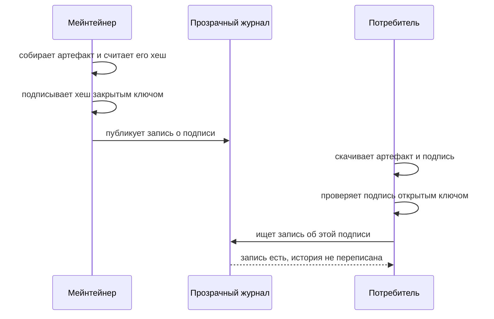

# Подпись артефактов: cosign, sigstore, provenance

Автоматическая сборка вашего проекта выпустила новый релиз, и вы
выкладываете архив на страницу загрузок. Рядом с архивом вы кладёте ещё один файл, маленький:
подпись. Пользователь скачивает оба и запускает проверку — она печатает
`Verified OK`. Ради эксперимента он меняет в архиве один байт и проверяет
снова. Теперь проверка падает с ошибкой неверной подписи. Ради этой разницы
подпись и существует: она ловит подмену файла по дороге от сборки до
пользователя.

Прогон настоящий, cosign 3.1.3: файл подписан ключевой парой и проверен ею
же.

```text
verify-blob (подпись верна):        Verified OK
verify-blob (подменён один байт):   Error: invalid signature
```

Теперь случай, которого в этом выводе не видно. Учётную запись мейнтейнера
захватили — такая атака разобрана в теме `supply-chain-threats` — и
вредоносный выпуск подписан настоящим ключом. Проверка печатает тот же
`Verified OK`, потому что подпись верна. Противоречие снимается, когда назван
предмет. Подпись артефакта отвечает на два вопроса: тот ли это файл, что
выпустили, и чей ключ его подписал. Вопроса «безопасен ли код внутри» среди
них нет, и вердикт читается как «подлинно», а не как «безопасно».

Предмет темы — подпись артефакта. Артефактом называют файл, который
выпускает сборка: архив с программой, пакет, образ контейнера. Бытовое
соответствие здесь — подпись под бумажным договором. Она удостоверяет, кто
подписал, и что текст после подписания не менялся. Но она молчит о том,
выгоден ли вам сам договор. Соответствие точное, а граница у аналогии одна:
бумажную подпись можно срисовать, а цифровую без закрытого ключа не
подделать.

Инструмент темы — cosign из проекта sigstore, открытой инфраструктуры
подписи артефактов: он подписывает файлы и образы и проверяет подписи. Кроме
подписи содержимого cosign умеет аттестацию — подпись утверждения об
артефакте. Частный случай аттестации называют provenance, происхождение:
кто, из какого источника и каким конвейером собрал файл. Конвейер — это
автоматика, которая собирает релиз из исходников без участия человека.
Подпись содержимого доказывает «файл не менялся», а provenance доказывает
«файл собран так-то и тем-то». На проверке они выглядят одинаково: по одному
вердикту `Verified OK` не отличить, что именно проверено — сам файл или
утверждение о нём.

**Зачем это в работе AppSec-инженера.** Подпись встречается там, где команда
уже занялась цепочкой поставок, и её нередко принимают за решение всех бед.
При этом два её вопроса не закрывает никто другой. Сканеры состава смотрят,
из чего артефакт собран, а не тот ли это файл и чей ключ его подписал.
Инженеру важно уметь сказать, что подпись доказывает, а что нет. Иначе «у
нас всё подписано» превращается в ложное чувство защищённости.

## Как это работает

**Откуда это взялось.** Целостность артефакта раньше подтверждали хешем
рядом со ссылкой на скачивание: скачал файл, сверил контрольную сумму.
Ломалось это на доверии к самой сумме. Её публиковал тот же, кто и файл, и
подменивший файл подменял и хеш. Подпись закрывает зазор: сумму заверяют
ключом, и подделать её без ключа нельзя. А sigstore добавляет прозрачный
журнал, чтобы и сам факт подписи нельзя было подделать задним числом.

Сама подпись строится на паре ключей: закрытым подписывают, открытым
проверяют. Свойства этой пары разобраны в теме `hmac-vs-signature` и здесь
не повторяются. Cosign добавляет к ним две вещи. Первая — привязка к
артефакту: подписывается не абы что, а хеш конкретного файла, поэтому
изменение хоть одного байта ломает проверку. Вторая — прозрачный журнал.

### Прозрачный журнал

Прозрачный журнал — общедоступный реестр записей о подписях, куда записи
только добавляются. В sigstore он называется Rekor. Его устройство не даёт
переписать историю: записи связаны хешами в дерево, и подмена старой записи
ломает дерево на глазах у любого, кто сверит. Бытовое соответствие —
нотариальная книга с прошитыми страницами: страницу не вырвать незаметно, и
факт сделки нельзя потом отрицать. Граница аналогии: книге верят, потому что
её ведёт нотариус, а журнал не просит веры к хозяину — целостность
проверяется хешами.

Зачем журнал нужен при подписи. Запись о подписи публикуется в неизменяемый
общедоступный лог, и факт подписи нельзя потом отрицать или подделать задним
числом. Это свойство называют неотрицаемостью: подписавший не сможет потом
сказать, что не подписывал. Если закрытый ключ утёк, журнал показывает,
какие подписи появились и когда. Без журнала свидетельство о моменте подписи
хранит только подписывающий, и верить приходится его слову.

### Аттестация и provenance

Аттестация устроена так же, как подпись, но подписывается не хеш файла, а
документ-утверждение о нём. Документ пишется в стандартной форме in-toto:
там записано, о каком артефакте утверждение, кто его сделал и что именно
утверждается. Стандартная форма нужна, чтобы проверяющий читал утверждение
программно, а не глазами по свободному тексту.

Provenance — частный случай аттестации, утверждение о том, как артефакт
собран. В нём записано, кто собрал файл, из какого исходного кода и каким
конвейером. Форму этого утверждения задаёт модель SLSA — открытый стандарт
доверия к сборке. Проверка аттестации — это проверка подписи под утверждением
плюс разбор самого утверждения: «кто собрал» читается из него, а не из
подписи.

Сложим всё в один обмен: кто кому что отправляет, когда релиз подписывают и
проверяют.



**Описание схемы.** Схема читается сверху вниз по времени. Сначала
мейнтейнер собирает артефакт, считает его хеш и подписывает хеш закрытым
ключом, затем публикует запись о подписи в прозрачный журнал. Потом
потребитель скачивает артефакт и подпись, проверяет подпись открытым ключом
и сверяется с журналом: запись должна существовать, а история — быть
непереписанной.

Заметьте: журнал — отдельный участник обмена, а не часть cosign. Именно он
превращает «я подписал» в факт, который виден всем и не переписывается.
Проверка без сверки с журналом — осознанно урезанный режим, и границы метода
покажут, чего в нём не хватает.

## Что умеет и чего не умеет

**Что умеет.** Доказать целостность: файл не менялся с момента подписи.
Доказать происхождение подписи: её сделал этот ключ. С аттестацией —
привязать к артефакту проверяемое утверждение: provenance, результат скана
или SBOM, список состава артефакта (ему посвящена тема `sbom`). А вместе с
инфраструктурой sigstore cosign подписывает без долгоживущего ключа. Вместо
него выдаётся кратковременный сертификат, привязанный к личности
подписывающего, скажем к учётной записи у провайдера, и запись о подписи
попадает в прозрачный журнал. Хранить и беречь закрытый ключ годами при этом
не нужно.

**Чего не умеет.** Судить о содержимом. Верная подпись на вредоносном
артефакте остаётся верной: она говорит «это выпустил владелец ключа», а не
«внутри нет закладки». Против захвата мейнтейнера подпись бессильна ровно
поэтому. Второе: подпись без проверки прозрачного журнала теряет
неотрицаемость, и это не мелочь настройки. Третье: доверие к подписи не
крепче защиты закрытого ключа, потому что утёкший ключ подписывает что
угодно.

## Как запустить

Cosign 3.1.3 подписывает файл ключом и проверяет его. Здесь — офлайн,
ключевой парой:

```bash
# ключевая пара; в проде — кратковременный ключ sigstore
cosign generate-key-pair
# подпись файла офлайн, без журнала (bundle — контейнер подписи)
cosign sign-blob --key cosign.key artifact.json --bundle artifact.bundle \
  --tlog-upload=false
# проверка без сверки с журналом
cosign verify-blob --key cosign.pub --bundle artifact.bundle \
  --insecure-ignore-tlog artifact.json
```

Первая команда создаёт пару ключей: `cosign.key` — закрытый, его никому не
показывают, `cosign.pub` — открытый, его раздают проверяющим. Вторая считает
хеш файла, подписывает его закрытым ключом и складывает подпись в bundle,
файл-контейнер со всем нужным для проверки. Третья считает хеш заново и
сверяет подпись открытым ключом.

Важная деталь версии 3.x: по умолчанию cosign требует прозрачный журнал и
сетевую конфигурацию подписи. Поэтому офлайн-прогон в листинге отключает
журнал явно: `--tlog-upload=false` при подписи и `--insecure-ignore-tlog` при
проверке. На пропуск журнала cosign отвечает предупреждением, что это
небезопасно. Это и есть сигнал: инструмент спроектирован вокруг публичной
инфраструктуры sigstore, и подпись без журнала — осознанно урезанный режим.

## Как читать вывод

Проверка печатает короткий вердикт, и читать надо именно его, а не наличие
файла подписи:

```text
verify-blob (подпись верна):            Verified OK
verify-blob (подменён один байт):       Error: invalid signature ...
verify-blob (проверка чужим ключом):    Error: invalid signature ...
verify-blob-attestation (provenance):   Verified OK
```

Все четыре строки — прогон на стенде. `Verified OK` в первой значит «файл
тот и ключ тот». Две ошибки в середине — то, ради чего подпись и нужна:
подмена содержимого и подмена ключа ломают проверку одинаково, с одним
сообщением о неверной подписи. Чужой ключ в третьей строке — это выдача
чужого артефакта за ваш. Подпись настоящая, но сделана другим ключом, и
сверка с вашим открытым ключом её не принимает. Четвёртая строка — проверка
аттестации: тот же механизм подтверждает уже не файл, а утверждение о его
происхождении.

Чего в этом выводе нет и быть не может — суждения о коде. `Verified OK` не
значит «безопасно», оно значит «подлинно». Это разные вещи, и путать их —
главная ошибка чтения такого отчёта. Перенесите на свой контур: подпись
вендора верна, но записи о ней в прозрачном журнале нет. Какое из двух
свойств, целостность или неотрицаемость, у вас осталось? Ответ дают границы
метода.

## Границы метода

**Граница первая: подлинность — не безопасность.** Подпись доказывает
происхождение, а не отсутствие закладки. Против захвата мейнтейнера она не
работает: там имя, источник, версия и подпись правильные, а вредоносен сам
выпуск. Закрывает это не подпись, а ревью изменений и provenance с разбором,
кем и как собран артефакт.

**Граница вторая: без журнала слабее.** Подпись без записи в прозрачный
журнал проверяется, но теряет неотрицаемость и защиту от подделки задним
числом. Вопрос из разбора вывода — «подпись верна, записи в журнале нет» —
распадается ровно так: целостность осталась, неотрицаемость ушла. Cosign
помечает такой режим предупреждением, и принимать урезанный режим за полный —
ошибка.

**Цена.** Подписать и проверить — секунды. Настоящая цена — управление
ключами: утёкший закрытый ключ обнуляет всю схему, потому sigstore и уходит
от долгоживущих ключей к кратковременным. Provenance добавляет цену на
стороне сборки: конвейер должен уметь выпускать утверждение о том, как он
работал.

## Частая ошибка

Расхожее мнение: артефакт подписан — значит, ему можно доверять. Решите,
согласны вы с ним или нет, прежде чем читать дальше.

**Подпись доказывает подлинность, а не доброкачественность.** Рассуждение
идёт по цепочке: подпись верна, значит, выпустил владелец ключа, а
владельцу доверяем. Неверно последнее звено. Подпись подтверждает ключ и
молчит про то, не захвачен ли он и что именно подписано. При захвате учётной
записи вредоносный выпуск снабжён верной подписью верного мейнтейнера, и
проверка его примет, потому что ключ настоящий. «Подписано» значит «мы
знаем, чей это выпуск», а не «в выпуске нет закладки».

Из опровержения напрашивается обратный вывод: «тогда подпись бесполезна».
Он тоже неверен. Подпись закрывает большой класс атак — подмену файла в пути
и выдачу чужого артефакта за ваш. И она даёт то, без чего не работает
реагирование: возможность сказать, чей это выпуск. Полезна она как одно
звено цепочки доверия, а не как ответ на вопрос о безопасности кода.

## Чеклист для ревью

Проверяя чужую схему подписи артефактов, пройдите по шести пунктам:

1. Проверьте, что проверка подписи включена на входе, а не только подпись
   на выходе: подписывать свои релизы и не проверять чужие — половина схемы.
2. Проверьте, что проверка идёт против ожидаемого ключа или личности, а не
   любого: верная подпись неизвестно чьим ключом ничего не говорит.
3. Проверьте, что запись в прозрачный журнал не отключена без явной причины.
4. Проверьте, что provenance проверяется по содержанию, а не по одному факту
   наличия: подписанное утверждение «собрал неизвестно кто» проверку подписи
   тоже проходит.
5. Проверьте, что закрытые ключи кратковременны или защищены, а не лежат в
   репозитории.
6. Проверьте, что «подписано» в отчётах не прочитано как «безопасно».

## Попробуй сам

Подпишите cosign свой артефакт и проверьте его. Затем измените один байт
файла и убедитесь, что проверка падает. После этого проверьте оригинал чужим
ключом и убедитесь, что падает и она.

Одна подсказка: подпись привязана к хешу файла и к ключу. Проверка ломается
и от подмены содержимого, и от подмены ключа, и сообщение об ошибке в обоих
случаях говорит о неверной подписи.

**Критерий выполнения** наблюдаемый: проверка верной пары печатает `Verified
OK`, а оба испорченных случая — ошибку неверной подписи. И вы можете
объяснить, почему `Verified OK` не означает «код безопасен».

## Проверь себя

1. Прочитайте документ, который подписал конвейер:

   ```json
   { "_type": "https://in-toto.io/Statement/v1",
     "predicateType": "https://slsa.dev/provenance/v1",
     "subject": [{"name": "app.tar.gz",
                  "digest": {"sha256": "9f86d081"}}],
     "predicate": { "buildType": "https://example/ci",
                    "builder": {"id": "github-actions"} } }
   ```

   Что это за документ и что он доказывает, будучи подписанным?
2. Почему верная подпись не защищает от захвата мейнтейнера?
3. Артефакт подписан. Можно ли ему доверять?

   A. Да: подпись гарантирует, что выпустил владелец ключа, а владельцу
      доверяем.

   B. Подпись доказывает подлинность файла и чей ключ подписал, но не
      доброкачественность кода внутри.

   C. Нет: подпись бесполезна, раз она не доказывает безопасность.

4. Файл подписали офлайн ключевой парой, а затем дописали в него один байт.
   Предскажите, что напечатает проверка на исходном файле и что — на
   изменённом.

   ```bash
   cosign verify-blob --key cosign.pub --bundle artifact.bundle \
     --insecure-ignore-tlog artifact.json
   ```

5. Возврат к теме `supply-chain-threats`: против какой из трёх атак темы
   подпись артефакта работает, а против какой — нет?
6. Возврат к теме `hmac-vs-signature`: почему для проверки подписи
   достаточно открытого ключа, а для HMAC нужен общий секрет?

<details markdown="1">
<summary>Ответ 1</summary>

1. Это аттестация происхождения (provenance) в форме in-toto: утверждение,
   что файл с таким хешем собран таким сборщиком по такому типу сборки.
   Подпись под ним говорит «утверждение сделал владелец ключа» — и проверка
   обязана разбирать само утверждение, а не только подпись: «кто собрал»
   читается из `predicate`.

</details>

<details markdown="1">
<summary>Ответ 2</summary>

2. Потому что при захвате учётной записи вредоносный выпуск подписан
   настоящим ключом мейнтейнера: подпись верна, и проверка её принимает.
   Подпись подтверждает ключ и молчит про то, захвачен ли он и что именно
   подписано.

</details>

<details markdown="1">
<summary>Ответ 3: разбор вариантов</summary>

3. Верный ответ — B.

   A. Рассуждение «верна, значит, выпустил владелец, значит, доверяем»
      ломается на последнем звене: владельцу доверяем, а владелец ли это
      ещё — подпись не говорит.

   B. Подпись закрывает подмену файла в пути и выдачу чужого артефакта за
      ваш, и на этом её предмет кончается. «Подписано» читается как «мы
      знаем, чей это выпуск», а не «в выпуске нет закладки».

   C. Бесполезной её делает только чтение не по назначению. Без неё не
      работает и реагирование: сказать, чей это выпуск, будет нечем.

</details>

<details markdown="1">
<summary>Ответ 4</summary>

4. На исходном файле — `Verified OK`, на файле с дописанным байтом — ошибка
   `invalid signature`: подпись привязана к хешу содержимого, и один байт его
   меняет. Ответ получен прогоном: команда из вопроса на cosign 3.x после
   `cosign sign-blob --key cosign.key --tlog-upload=false`.

</details>

<details markdown="1">
<summary>Ответ 5</summary>

5. Против подмены источника и опечатки она работает, если проверка подписи
   обязательна на входе: чужой пакет не подписан вашим ключом и не пройдёт.
   Против захвата мейнтейнера — нет: там имя, источник, версия и подпись
   правильные, а вредоносен сам выпуск.

</details>

<details markdown="1">
<summary>Ответ 6</summary>

6. Подпись асимметрична: создаётся закрытым ключом, проверяется открытым из
   той же пары. HMAC — симметричный код на общем секрете, и проверяющий
   держит тот же секрет, что и создающий: умеющий проверить умеет и
   подделать.

</details>

## Источники

1. Sigstore documentation; реестр `sigstore-docs`. Разделы: cosign, подпись и
   проверка, прозрачный журнал Rekor, подпись без долгоживущего ключа.
   <https://docs.sigstore.dev/>
2. Sigstore, «Quickstart: cosign»; реестр `sigstore-quickstart-cosign`. Разделы:
   подпись и проверка blob и образа, bundle, работа с ключами.
   <https://docs.sigstore.dev/quickstart/quickstart-cosign/>
3. SLSA v1.2, «Build provenance»; реестр `slsa-v12-build-provenance`. Разделы:
   что такое provenance, форма утверждения, что оно доказывает о сборке.
   <https://slsa.dev/spec/v1.2/build-provenance>
4. SLSA v1.2, «Build track basics»; реестр `slsa-v12-build-track-basics`.
   Разделы: уровни доверия к сборке, роль подписанного provenance.
   <https://slsa.dev/spec/v1.2/build-track-basics>

Каркас этапа: `cwe-taxonomy`. Наследуется всеми темами и отдельной строкой не
повторяется.

**Скоропортящийся слой.** Версия cosign, ключи командной строки, формат bundle и
требования к конфигурации подписи (в 3.x — вокруг sigstore и журнала). Устройство
— подпись хеша, аттестация утверждения, роль прозрачного журнала — держится
дольше.

**Маркеры уверенности.** Подпись и проверка прогнаны **лично** 2026-08-25 на
cosign 3.1.3 офлайн, ключевой парой: верная пара — `Verified OK`; подмена одного
байта и проверка чужим ключом — ошибка неверной подписи; аттестация provenance
(`attest-blob`/`verify-blob-attestation`) — `Verified OK`. Требование прозрачного
журнала по умолчанию и предупреждение при его пропуске — **наблюдалось лично** в
выводе того же cosign. Устройство provenance и уровни доверия — **по**
спецификации SLSA v1.2, открытой лично 2026-08-25.
