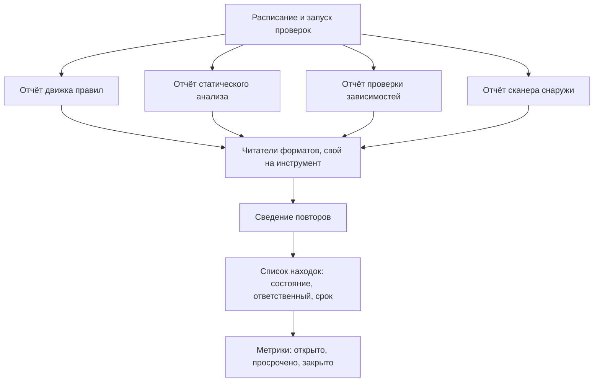

# ASOC: оркестрация проверок и агрегация находок

К этому месту маршрута в конвейере проекта уже четыре проверки: движок
правил по коду, статический анализ Python, проверка зависимостей и сканер
снаружи. Каждая пишет отчёт в своём формате и по своему расписанию. В
какой-то момент руководитель спрашивает: «Сколько у нас открытых
уязвимостей и сколько из них просрочено?» — и ответить нечем. Файл
последнего прогона отвечает на другой вопрос: «что нашёл вот этот прогон
вот тогда». Про то, что открыто в момент вопроса, кто этим занимается и
когда закроют, не знает ни один файл.

Класс систем, который берёт эти вопросы на себя, называется ASOC, от
application security orchestration and correlation — «оркестрация проверок
и корреляция находок». Сама такая система при этом не находит ничего.
Она принимает чужие отчёты, сводит повторы и ведёт получившийся список во
времени.

## Две половины названия

Расшифровка аббревиатуры — два разных обещания, а не одно. Оркестрация
отвечает за то, чтобы проверки шли: расписание, запуск инструментов, сбор
их отчётов. Корреляция отвечает за то, что происходит с отчётами дальше:
из четырёх форматов должен получиться один список находок.

Это разные задачи, и продукты класса обычно сильны в одной половине и
слабы в другой. Система с хорошей оркестрацией умеет гонять инструменты
по расписанию, но складывать их отчёты может в отдельные кучи. Система
с хорошей корреляцией сведёт повторы и посчитает метрики, но запуск
прогонов оставит вашему конвейеру. Поэтому вопрос «какую половину я
покупаю» стоит задать до установки, а не после.

**Две половины рядом**

| | Оркестрация | Корреляция |
|---|---|---|
| Вопрос при выборе | умеет ли запускать мои инструменты | сведёт ли находки разных инструментов в одну |
| Если половины нет | прогоны запускает конвейер, а системе отдают готовые отчёты | повторы между прогонами одного инструмента сводят глазами |

## Откуда берётся один список

Первая задача корреляции — принять отчёт, написанный на чужом языке. У
каждого инструмента свой формат и своё понятие находки. Тема
`finding-deduplication` показывает это на живых отчётах. У Bandit класс
дефекта лежит в поле `issue_cwe` с номером, у ZAP — строкой `cweid`, а у
собственного правила Semgrep его нет вовсе. Разбирает такие форматы
читатель — часть системы, которая знает устройство одного отчёта: где в
нём класс дефекта, где файл и строка, где номер правила. Записи отчёта
читатель превращает в записи находок, а поле, которого не знает,
пропускает молча.

Читатель нужен свой на каждый инструмент, и у опорного представителя
класса, DefectDojo, их по документации больше пятисот. Список
поддерживаемых форматов — первое, на что смотрят при выборе: если вашего
инструмента в нём нет, читатель под него вам придётся писать самим.

Разобранные записи раскладываются по четырём полкам, и эти полки —
модель DefectDojo. Актив (asset) — приложение или сервис, про который
ведут учёт, например `lavka-api`. Работа (engagement) — один раунд
проверок этого актива: проверка релиза или ретест после починки. Прогон
(test) — один запуск одного инструмента внутри работы. Находка (finding) —
одна запись о дефекте, и это единица учёта: у неё есть состояние,
ответственный и срок.

Дальше повторы сводятся по ключу: по идентификатору, который даёт сам
инструмент, или по свёртке набора полей. Как собирается ключ и где он
ломается, разбирает тема `finding-deduplication`; здесь важно другое.
У DefectDojo две редакции, открытая и платная. Сведение в открытой
работает внутри одного актива, а при желании область сужают до одной
работы. Лишней работы команде повтор не создаёт. Новая запись
помечается копией самой ранней находки в цепочке и становится неактивной,
а разбор и переписка ведутся на странице исходной.



**Описание схемы.** Схема читается сверху вниз и показывает путь от
расписания до метрик. Расписание запускает проверки, и каждая отдаёт
отчёт в своём формате. Читатели форматов превращают все четыре в записи
находок одного вида, а сведение убирает повторы. Только после этого
список можно вести во времени и считать по нему метрики.

## Что умеет и чего не умеет

**Откуда это взялось.** Пока инструмент был один, его отчёт и был списком
находок. Инструментов стало несколько, отчёты стали приходить в разных
форматах и по расписанию, и выяснилось, что на вопрос «что у нас открыто»
не отвечает никто. Система учёта придумана в ответ на этот пробел, а не
вместо сканеров.

**Что умеет.** Принять отчёты многих инструментов и привести их к одной
записи находки. Свести повторы и помнить историю: находка, исчезнувшая из
свежего отчёта, не пропадает, а меняет состояние, и видно, когда это
случилось. Считать метрики: сколько открыто, сколько просрочено, сколько
закрыто за месяц. Запускать проверки по расписанию — та самая половина из
названия.

Список, ради которого всё это ставится, выглядит примерно так. Таблица
собрана для темы вручную: ни одна система класса при её подготовке не
разворачивалась, и это честно сказано в маркерах уверенности ниже.

```text
Находка                     Актив      Состояние  Ответственный Срок
Склейка запроса в каталоге  lavka-api  в работе   А. Сидорова   2026-10-05
Секрет в истории коммитов   lavka-web  открыта    не назначен   2026-10-03
Уязвимый пакет requests     lavka-api  просрочена И. Петров     2026-09-28
```

Три правые колонки и есть то, чего нет ни в одном отчёте: состояние во
времени, человек и срок. Откуда в колонке берётся срок — тема
`sla-and-backlog`: он приходит из соглашения о сроках устранения, а не из
сканера.

**Чего не умеет.** Главное — найти хоть что-нибудь. Представьте
бухгалтерию магазина. Поставщики присылают накладные,
каждый по своей форме, а бухгалтерия разбирает их в один журнал: что
куплено, что оплачено, что просрочено. Накладные здесь — отчёты
инструментов, журнал — список находок.

Ломается аналогия на перепроверке. Бухгалтер при сомнении может съездить
на склад и пересчитать коробки сам, а у системы учёта глаз на код нет
вовсе. Отсюда главное следствие: качество списка целиком равно качеству
отчётов на входе. Набор правил, охват прогона и доля шума остаются там,
где были. Система учёта, поставленная поверх сломанного прогона,
аккуратно ведёт учёт того, чего прогон не нашёл.

Не умеет она и разбирать находки. Вердикт «ложная» ставит человек, и
тема `triage-false-positives` как раз про такие вердикты. Запись в
системе — след решения человека, а не замена ему.

И последняя граница, про которую спрашивают поздно. Сопоставление находок
разных инструментов в открытой версии DefectDojo выключено: оно есть
только в платной. А при выборе главной выглядит ровно эта задача. «Bandit
и ZAP нашли одно и то же» в одну строку она не склеит. От корреляции
остаются сведение повторов одного инструмента между прогонами, история и
метрики. Для конвейера, где каждый инструмент гоняется по расписанию,
это основной поток и основная польза. Но две находки разных инструментов
в одну открытая версия не сведёт.

## Число «открыто» — не про уязвимости

Звучит соблазнительно: поставим систему учёта — и наконец узнаем, сколько
у нас уязвимостей. Нет. Система ответит числом, но число это про отчёты,
а не про уязвимости.

Механизм уже разобран выше: глаз на код у системы нет, вход — только
отчёты. Прогон, который смотрел не в ту часть проекта или молча упал,
превращается в список, где «открыто мало» значит «мало нашли».

Проверить себя можно на скачках числа. Подключили новый инструмент, и
открытых стало больше: хуже не стало, видимость стала честнее. Прогон
сломался и перестал присылать отчёты, и число уползло вниз: лучше не
стало, а метрика об этом молчит, если за входом никто не смотрит.

## Как выбирают систему этого класса

Если систему этого класса выбираете вы, вопросы к ней известны заранее:

1. Есть ли в списке форматов читатели под ваши инструменты? Чего в списке
   нет, то придётся дописывать самим.
2. Какие алгоритмы сведения повторов включены в той версии, которую вы
   ставите? У открытой DefectDojo их четыре: по идентификатору от
   инструмента, по свёртке набора полей, по одному или другому и
   исторический.
3. Входит ли сопоставление находок разных инструментов, или это платная
   половина?
4. Что система делает с прогоном, который упал и не прислал отчёт:
   увидит ли кто-то дыру во входе?
5. Кто ставит вердикты по находкам и где фиксируется решение человека?

**Зачем это в работе AppSec-инженера.** На вопрос «сколько у нас открытых
уязвимостей и сколько из них просрочено» не отвечает ни один сканер: у
него нет ни памяти, ни понятия срока. Отвечает система учёта. Знать, что
такой класс существует и чем его половины различаются, нужно раньше, чем
понадобится его выбирать.

Скажите, не возвращаясь к тексту: на какой вопрос отвечает файл
последнего прогона, на какой — система учёта, и какая половина названия
за что отвечает?

## Источники

1. DefectDojo, «DefectDojo Documentation», версия 3.2.201; реестр
   `defectdojo-docs`. Разделы указателя: импорт данных из более чем
   пятисот инструментов, разбор находок, модель активов, метрики и
   отчёты.
   <https://docs.defectdojo.com/>
2. DefectDojo, «About Deduplication»; реестр `defectdojo-dedup`. Разделы:
   единицы модели (актив, работа, прогон, находка) и область сведения по
   ним, алгоритмы сведения повторов в открытой версии, сопоставление
   находок разных инструментов как возможность платной версии.
   <https://docs.defectdojo.com/triage_findings/finding_deduplication/about_deduplication/>

Каркас этапа: `cwe-taxonomy`. Наследуется всеми темами и отдельной строкой
не повторяется.

**Скоропортящийся слой.** Названия продуктов, состав возможностей
открытой версии и граница между открытой и платной. Место класса в
процессе держится.

**Маркеры уверенности.** Всё в теме — **по документации** DefectDojo,
открытой лично 2026-08-25; разделы о сведении повторов и о поддерживаемых
форматах перечитаны 2026-10-03. Система **не разворачивалась**: ни импорт
отчётов, ни поведение алгоритмов сведения, ни метрики на живых данных не
воспроизводились. Таблица списка находок собрана вручную как иллюстрация,
а не снята с работающей системы. Другие продукты этого класса не
открывались вовсе, и утверждений о них в теме нет.
