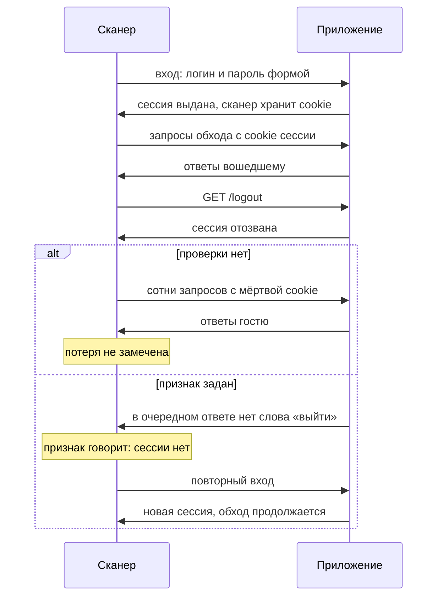

# Аутентифицированное сканирование

Витрину магазина видит любой прохожий, а торговый зал — только тот, кто
зашёл внутрь. Приложение устроено так же: главную, каталог и форму входа
видит любой, а кабинет, заказы и настройки — только вошедший пользователь.
Сканер без входа проверяет витрину, и его отчёт молчит обо всём, что за
формой. Прогон, где сканер сначала входит и дальше обходит страницы как
пользователь, называют аутентифицированным сканированием. Настроить вход —
дело десяти строк плана, и проблема не в этом. Сессия умирает молча, и
сканер без подсказки этого не замечает.

Вот два прогона одного сканера по одному стенду. В первом настроен только
вход, во втором к нему добавлены две строки страховки, которые разбирает
эта тема:

```text
                                    наивный   со страховкой
запросов к стенду                      1380            2516
из них под живой сессией                  8            2484
сработало правил                         15              15
```

В первом прогоне сканер вошёл успешно: форма принята, сессия получена.
Одиннадцатым запросом он сходил на `/logout`, адрес выхода, и сессия
умерла. Дальше 1372 запроса ушли от гостя, и сканер этого не заметил.
Восемь запросов из 1380 — весь охват кабинета. При этом список сработавших
правил у двух прогонов одинаковый: по отчёту сломанный прогон от целого
не отличается. Чем тогда мерить охват прогона, если не отчётом?

**Зачем это в работе AppSec-инженера.** Вход приходится настраивать заново
на каждом приложении, и это самое частое место, где прогон DAST превращается
в дорогую имитацию: время потрачено, а проверена витрина. DAST — это
проверка работающего приложения запросами снаружи, без чтения его кода.
Инженера спрашивают, покрыт ли кабинет, и ответить на это можно числом
запросов под живой сессией, а не отчётом. Ниже — как настроить вход так,
чтобы сессия дожила до конца прогона, и как это число померить.

## Как это работает

Внутри такого прогона работают три независимые настройки, и их полезно
различать по именам. **Метод аутентификации** — как сканер получает
сессию: отправляет форму входа, посылает JSON на адрес API или проигрывает
вход в настоящем браузере. **Управление сессией** — где сканер хранит
сессию и как подставляет её в запросы, например в cookie или в заголовок.
**Проверка залогиненности** — как сканер узнаёт, что сессия ещё жива:
по признаку в каждом ответе, по признаку в запросе или отдельным опросом
известной страницы [^3].

Бытовое соответствие здесь — пропускной режим в бизнес-центре. Метод
аутентификации — стойка охраны, где вы предъявляете документ и получаете
пропуск. Управление сессией — карман, в котором пропуск лежит между
этажами. Проверка залогиненности — турникет, который при каждом проходе
смотрит, не погашен ли пропуск, и отправляет на стойку заново. Аналогия
ломается в двух местах. Пропуск гаснет по времени, а сессию может убить
и сам сканер, одним запросом к адресу выхода. И турникет видит пропуск
сам, а сканеру признак живой сессии задаёт человек.

**Откуда это взялось.** Первые сканеры вход не умели вовсе: им скармливали
адрес, и они шли по ссылкам. Когда приложения переехали за форму входа,
появилась настройка «отправь вот такой запрос перед обходом». Она не
работала, потому что сессия рвалась в середине прогона, а сканер этого не
замечал. Тогда к настройке входа добавили вторую, отдельную — проверку
залогиненности. Настройка входа без неё — половина механизма, и настраивают
чаще всего именно эту половину.

Из устройства сканера здесь нужно только это деление на три части. Чем
cookie сессии отличается от токена и почему у них разные способы хранения
и отзыва, разбирает тема `sessions-vs-tokens`. Как устроены обход, работы
плана и отчёт сканера — тема `zap-scanning`. А вот что происходит с
сессией внутри прогона с проверкой и без неё:



**Описание схемы.** Схема читается сверху вниз и показывает два варианта
одного прогона. Сканер входит, обходит страницы с cookie сессии и
натыкается на адрес выхода: приложение отзывает сессию. Дальше пути
расходятся. Без проверки сканер продолжает обход с мёртвой cookie и
получает ответы гостя, ничего не замечая. С заданным признаком сканер
сверяет ответ, видит, что слова «выйти» в нём нет, входит заново и
продолжает обход уже под новой сессией.

Схема объясняет и странную пару чисел из начала темы: почему в сломанном
прогоне «вход был», а охвата нет. Вход — одно событие в самом начале, а
сессия нужна на каждом из двух тысяч следующих запросов. Поэтому дальше
тема идёт по этому кругу: что сканер умеет в каждой из трёх настроек и как
они записываются в план. А в конце — по каким числам видно, что сессия
дожила до конца.

## Что умеет и чего не умеет

**Что умеет.** Войти шестью способами. Метод `form` отправляет форму
входа: страницу с формой, адрес обработчика и тело запроса с подстановками
логина и пароля. Метод `json` посылает те же данные телом JSON — так
устроен вход в API. Метод `browser` проигрывает вход в настоящем браузере:
его выбирают, когда форму рисуют скрипты и одним запросом не обойтись.
Метод `http` подставляет в запросы готовый заголовок с токеном, `script`
выполняет записанный сценарий входа, `autodetect` пытается угадать вход
сам. Отдельно: сканер держит в плане несколько пользователей и умеет
гонять прогон от имени каждого, а по заданному признаку — замечать потерю
сессии и входить заново.

**Чего не умеет.** Понять без подсказки, что ответ пришёл гостю. Признак
залогиненности задаёт человек: слово в разметке, заголовок, код ответа.
Если признак выбран неудачно, механизм проверки честно работает, а
отвечает неверно, и прогон снова превращается в имитацию — теперь уже с
включённой проверкой.

**Чего не умеет никакая настройка входа.** Заметить, что вход изменился.
Форму переименовали, поле переехало, добавился второй шаг — прогон
продолжает идти, потому что запрос входа по-прежнему получает ответ.
Пустеет при этом не отчёт, а охват. Поэтому настройку входа перепроверяют
при изменениях приложения, как любой другой тест.

## Как запустить

Прогон ниже — на ZAP 2.17.0 по стенду «Лавка», учебному магазину из темы
`zap-scanning`, с пользователем `alice`. Настройки живут в плане прогона,
файле Automation Framework, с которым вы уже запускали обход и
сканирование. Приложение внутри плана описывается контекстом: блоком
`contexts` с адресами, способом входа и пользователями. Контексты лежат в
разделе `env`, окружении плана.

Наивная настройка — только вход, без проверки и без исключений. У неё три
части: как войти (`authentication` с методом, адресами и телом запроса),
где хранится сессия (`sessionManagement`), от чьего имени идёт прогон
(`users`):

```yaml
env:
  contexts:
    - name: lavka
      urls: ["http://127.0.0.1:8081/"]
      authentication:
        method: form
        parameters:
          loginPageUrl: "http://127.0.0.1:8081/login"
          loginRequestUrl: "http://127.0.0.1:8081/login"
          loginRequestBody: "login=&password="
      sessionManagement: {method: cookie}
      users:
        - name: alice
          credentials: {username: alice, password: alice-pass}
```

Листинг решает три задачи. Первая — получить сессию: метод `form` говорит,
что вход устроен формой, и задаёт три её параметра. `loginPageUrl` —
страница с формой, `loginRequestUrl` — адрес, который принимает логин и
пароль, `loginRequestBody` — тело запроса, где `` и
`` — места подстановки данных пользователя. Вторая задача —
хранить сессию: метод `cookie` означает, что приложение выдаёт сессию в
cookie, и дальше сканер хранит её и подставляет сам. Третья — назначить,
кто входит: в `users` лежит `alice` с её паролем.

Такая настройка входит и теряет сессию молча. Страховка — две добавки к
тому же контексту:

```yaml
      excludePaths: ["http://127.0.0.1:8081/logout.*"]
      authentication:
        method: form
        parameters: {...}
        verification:
          method: response
          loggedInRegex: "выйти"
          loggedOutRegex: "войти"
          pollFrequency: 60
          pollUnits: requests
```

**Что делают эти две добавки.** `excludePaths` убирает выход из области
обхода: сканер на `/logout` больше не пойдёт и сам сессию не убьёт. Запись
`logout.*` — это регулярное выражение, образец адреса: точка со
звёздочкой означают «любое продолжение», поэтому исключаются и `/logout`,
и `/logout?next=/`.

Вторая добавка, `verification`, задаёт признак, по которому сканер сам
замечает, что его выкинуло, и входит заново. При методе `response` сканер
сверяет каждый ответ с двумя образцами: слово «выйти» в разметке означает,
что ответ показан вошедшему, слово «войти» — что гостю. Пара
`pollFrequency` и `pollUnits` работает при другом методе, `poll`: тогда
сканер не сверяет каждый ответ, а раз в шестьдесят запросов отдельно
опрашивает известную страницу.

Одно место остаётся вне контекста. В работах обхода и сканирования
пользователь называется явно: `user: alice`. Без этой строки прогон идёт
от гостя при полностью настроенном входе: вход описан, но выполнять его
некому.

**Как измерить, что вход сработал.** Не по отчёту. Стенд пишет журнал
запросов с колонкой «кто»: логин, если запрос пришёл с живой сессией, и
прочерк, если нет. Охват прогона — число запросов с логином. На чужом
приложении то же самое даёт журнал доступа сервера или отдельный счётчик
на стороне приложения.

**Пароль в плане — секрет в репозитории.** В листингах этой темы он лежит
открытым текстом, потому что это стенд. На живой системе под прогон
заводят отдельную учётную запись, а пароль в файл не вписывают: план
читается на ревью и хранится в общем репозитории.

## Как читать вывод

Два прогона одного плана, разница только в двух добавках:

```text
                                    наивный   со страховкой
запросов к стенду                      1380            2516
из них под живой сессией                  8            2484
сработало правил                         15              15
инстансов                                36              40
```

**Восемь запросов из 1380.** Обход прошёл главную, каталог, поиск, прайс
и кабинет — и одиннадцатым запросом сходил на `/logout`. Дальше 1372
запроса ушли от гостя, и сканер этого не заметил. Он послал за прогон 445
запросов к форме входа, но это активное правило проверяло саму форму, а не
восстанавливало сессию. Восстанавливать её без заданного признака сканер
не умеет.

**Список сработавших правил у двух прогонов одинаковый.** Пятнадцать и там
и там. Разница видна только в инстансах, конкретных местах, где правило
сработало: 36 против 40. Прибавились три срабатывания правила 40026 и
одно — правила 10202. Среди них хранимая разметка в личной заметке,
`CWE-79`, которую без входа не достать вовсе, и форма без токена,
`CWE-352`, на странице заметки. Чинятся обе находки в своих темах:
разметка — в `xss-stored`, форма — в `samesite-cookies`. То есть по отчёту
сломанный прогон от целого не отличается, а разница между ними — настоящий
дефект, который иначе не нашли бы никогда.

**Три признака, по которым видно потерю сессии.** Первый — доля запросов
под сессией в журнале приложения: на сломанном прогоне она падает почти до
нуля. Второй — обращения к адресам за входом, отвечающие кодом 401 или
перенаправлением на форму. Третий — отчёт, в котором нет ни одной находки
на страницах кабинета при том, что паук их обошёл. По какому из этих трёх
признаков вы поймали бы потерю сессии, если бы журнала приложения не было
вовсе?

## Границы метода

**Граница первая: выход — не единственная мина.** Кроме `/logout` сессию
убивают смена пароля, отзыв всех сессий, кнопка «выйти со всех устройств»,
иногда — изменение профиля. Правило одно: исключать надо не один адрес, а
всё, что меняет состояние сессии. Найти этот список можно только по коду
или по документации приложения.

**Граница вторая: признак залогиненности — тоже догадка.** Слово «выйти» в
разметке годится, пока страница ошибки не начала показывать общую шапку с
тем же словом. Тогда сканер решит, что сессия жива, когда её уже нет.
Заголовок надёжнее разметки, отдельный опрос известной страницы надёжнее
заголовка — и стоит дороже: каждые шестьдесят запросов уходит ещё один.

**Граница третья: один пользователь — один взгляд.** Прогон от имени
обычного пользователя не проверяет, что видит администратор, и наоборот.
Разница между ролями — не находка сканера: он не знает, кому что положено.
Это разбирает `dast-limits`.

**Цена.** На стенде правильная настройка стоила вдвое больше запросов,
2516 против 1380, и вдвое больше времени: сканер дошёл туда, куда раньше
не доходил. Рост охвата и есть рост цены.

## Частая ошибка

Расхожее мнение: если сканер вошёл, приложение просканировано изнутри.
Проверьте его на своём прогоне, прежде чем читать дальше. Вход в отчёте
был — а охват вы измеряли?

**Вход — событие, а покрытие — процесс.** Сканер входит один раз, а терять
сессию может на любом из тысяч следующих запросов, и по умолчанию не
проверяет этого никогда. На стенде вход прошёл успешно, отчёт получился
полный на вид, а покрыто было пять страниц из семнадцати.

У этой ошибки есть и обратная версия: «значит, довольно исключить
`/logout`». На стенде этого хватило, потому что стенд маленький. На
приложении, где сессия живёт двадцать минут, а прогон идёт три часа,
исключение выхода не спасёт: сессия умрёт по сроку в середине прогона.
Там нужен именно признак и повторный вход по нему. Исключение адресов и
проверка залогиненности закрывают разные причины одной и той же беды.

## Чеклист для ревью

1. Проверьте, что в плане прогона задан не только вход, но и признак
   залогиненности.
2. Проверьте, что выход и другие адреса, гасящие сессию, исключены из
   области обхода.
3. Проверьте, что работы обхода и сканирования называют пользователя явно.
4. Проверьте, что охват назван числом запросов под живой сессией, а не
   числом находок.
5. Проверьте, что прогон сделан от каждой роли, которая нужна по задаче,
   а не от одной.
6. Проверьте, что учётные записи для прогона заведены отдельно и их
   пароли не лежат в плане открытым текстом в общем репозитории.

## Попробуй сам

Настройте вход на своём приложении и померьте охват двумя прогонами: без
исключения выхода и признака залогиненности — и с ними. Считайте не
находки, а запросы под живой сессией: по журналу приложения или по
отдельному счётчику.

Одна подсказка: если журнала под рукой нет, годится любая страница,
доступная только вошедшему. Посчитайте в отчёте обращения к ней,
ответившие кодом 200 и кодом 401.

**Критерий выполнения** наблюдаемый. У вас есть два числа охвата и
объяснение разницы: какой запрос убил сессию и на каком по счёту обращении
это случилось.

## Проверь себя

1. Прочитайте чужой план прогона:

   ```yaml
   env:
     contexts:
       - name: shop
         urls: ["http://127.0.0.1:8081/"]
         authentication:
           method: form
           parameters:
             loginPageUrl: "http://127.0.0.1:8081/login"
             loginRequestUrl: "http://127.0.0.1:8081/login"
             loginRequestBody: "u=&p="
         sessionManagement: {method: cookie}
         users:
           - name: alice
             credentials: {username: alice, password: alice-pass}
   ```

   Найдите два места, из-за которых этот прогон превратится в имитацию.

2. Почему список сработавших правил не годится признаком того, что прогон
   прошёл под входом?

3. Вход в отчёте был. Значит ли это, что приложение просканировано
   изнутри?

   A. Да: успешный вход виден в журнале сканера.

   B. Нет: вход — событие, а покрытие — процесс, и меряется оно числом
      запросов под живой сессией.

   C. Да, если адрес выхода исключён из области обхода.

4. Не запуская, предскажите, что напечатает эта мини-модель прогона.

   ```python
   # вход третьим запросом, /logout одиннадцатым
   total = 1380
   alive = 0
   session = False
   for n in range(1, total + 1):
       if n == 3:
           session = True      # форма принята, сессия получена
       if n == 11:
           session = False     # запрос к /logout убил сессию
       if session:
           alive += 1
   print(f"под живой сессией: {alive} из {total}")
   ```

5. Возврат к теме `sessions-vs-tokens`: почему для прогона с токеном в
   заголовке нужен другой способ управления сессией, чем для cookie?

6. Возврат к теме `zap-scanning`: каким приёмом там отличают «проверено»
   от «просканировано» — и какая ось добавляется к нему здесь?

<details markdown="1">
<summary>Ответ 1</summary>

1. Первое — нет `verification`: сессия умрёт молча, и сканер не заметит,
   что его выкинуло. Второе — нет `excludePaths` с выходом: сканер сам
   сходит на `/logout` и убьёт сессию. Бонусное третье — пароль лежит в
   плане открытым текстом: план читается на ревью и хранится в общем
   репозитории.

</details>

<details markdown="1">
<summary>Ответ 2</summary>

2. Потому что список правил про то, что сработало, а не про то, куда
   дошли. На стенде оба прогона дали один список из пятнадцати правил.
   Разница была в инстансах и в охвате — и в настоящем дефекте, найденном
   только вторым прогоном.

</details>

<details markdown="1">
<summary>Ответ 3: разбор вариантов</summary>

3. Верный вариант — B.

   A. Сканер входит один раз, а терять сессию может на любом из тысяч
      следующих запросов и по умолчанию не проверяет этого никогда. На
      стенде вход прошёл, а покрыто было пять страниц из семнадцати.

   B. Охват меряется по журналу приложения: доля запросов под живой
      сессией, обращения за вход, отвечающие кодом 401. Это числа, а не
      отчёт.

   C. На маленьком стенде исключения хватило. На приложении, где сессия
      живёт двадцать минут, а прогон идёт три часа, — нет. Исключение
      адресов и признак залогиненности закрывают разные причины одной
      беды.

</details>

<details markdown="1">
<summary>Ответ 4</summary>

4. Напечатает `под живой сессией: 8 из 1380` — ровно числа сломанного
   прогона из темы, то есть весь охват кабинета. Ответ получен прогоном:
   `python3 sess.py`. Модель воспроизводит механизм: сканер потерю сессии
   не заметил, потому что проверять её без заданного признака он не умеет.

</details>

<details markdown="1">
<summary>Ответ 5</summary>

5. Cookie сканер хранит и подставляет сам, как состояние. Токен в
   заголовке надо подставлять в каждый запрос и обновлять по его сроку —
   это другой механизм управления, а не другая настройка того же.

</details>

<details markdown="1">
<summary>Ответ 6</summary>

6. Там охват считается числом: сколько адресов обошёл паук и сколько
   запросов ушло к приложению. Здесь к этому добавляется ось «под чьей
   сессией»: запрос от гостя к адресу кабинета охвата не даёт, хотя число
   запросов его считает.

</details>

## Источники

1. ZAP, «Authentication»; реестр `zap-authentication`. Разделы: дерево
   решений по выбору способа входа, роль индикаторов залогиненности и
   разлогиненности.
   <https://www.zaproxy.org/docs/authentication/>
2. ZAP Desktop User Guide, «Authentication»; реестр
   `zap-desktop-authentication`. Разделы: контекст, метод управления
   сессией, методы аутентификации (`form`, `json`, `script`, `http`,
   `browser`, `client`),
   индикаторы, стратегия верификации, пользователи, Forced User Mode.
   <https://www.zaproxy.org/docs/desktop/start/features/authentication/>
3. ZAP Automation Framework, «Environment»; реестр `zap-automation-env`.
   Разделы: `contexts`, `includePaths` и `excludePaths`, `authentication`
   с параметрами `loginPageUrl`, `loginRequestUrl`, `loginRequestBody`,
   `verification` с методами response, request, both, poll и полями
   `loggedInRegex`, `loggedOutRegex`, `pollFrequency`, `pollUnits`;
   `sessionManagement` и `users`.
   <https://www.zaproxy.org/docs/desktop/addons/automation-framework/environment/>

Каркас этапа: `cwe-taxonomy`. Наследуется всеми темами и отдельной строкой
не повторяется.

**Скоропортящийся слой.** Имена методов аутентификации, ключей плана и
полей проверки; состав способов управления сессией. Разделение «получить
сессию» и «проверить, что она жива» и следствие о том, что отчёт не
показывает потерю охвата, от версии не зависят.

**Маркеры уверенности.** Числа обоих прогонов — 1380 и 2516 запросов, 8 и
2484 под живой сессией, 15 сработавших правил в обоих, 36 и 40 инстансов,
445 обращений к форме входа — сняты **лично** 2026-08-25 на ZAP 2.17.0 по
стенду, поднятому на `127.0.0.1`. Список методов аутентификации, методов
проверки и имена ключей — **по документации** ZAP, открытой лично
2026-08-25. Поведение на приложениях с токеном в заголовке и с двухшаговым
входом **не воспроизводилось**: на стенде их нет. Мини-модель из вопроса
самопроверки прогнана повторно 2026-10-03 (`python3`), вывод совпал:
«под живой сессией: 8 из 1380».

[^3]: ZAP Automation Framework, «Environment», реестр `zap-automation-env`.
