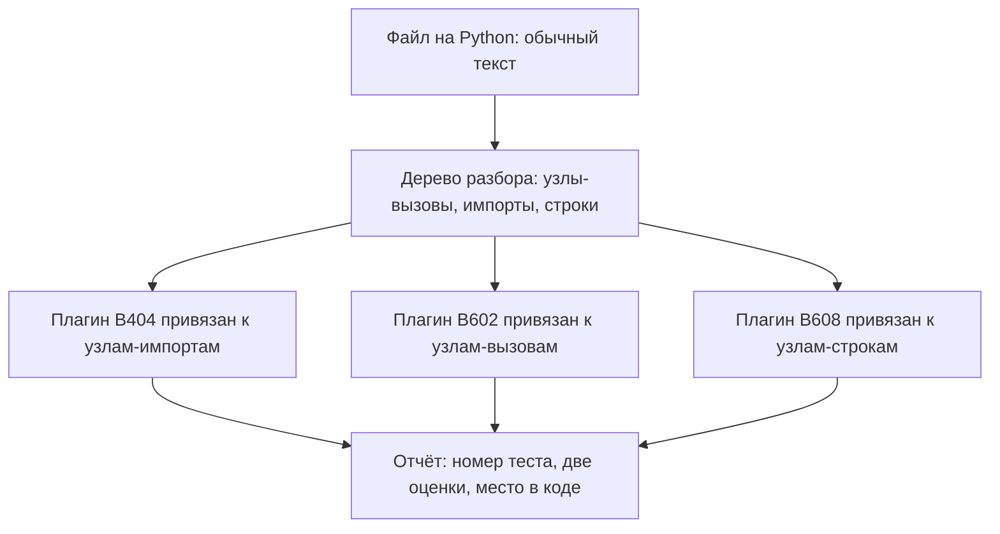

# Bandit: статический анализ Python

Учебный проект, интернет-магазин на Python, проверен прогоном bandit 1.9.4,
и в отчёте есть такая находка:

```text
>> Issue: [B608:hardcoded_sql_expressions] Possible SQL injection
   Severity: Medium   Confidence: Low
   CWE: CWE-89 (https://cwe.mitre.org/data/definitions/89.html)
   Location: shop/db.py:13:12
13   sql = f"SELECT id, item, price FROM orders WHERE id = {order_id}"

(строка More Info опущена)
```

За этой находкой стоит настоящий дефект: значение `order_id` приходит из
запроса и склеивается в текст команды SQL. Как из такой склейки получается
инъекция, разбирает тема `sqli-basics`. При этом в поле уверенности стоит
`Low`, то есть низкая, и находка выглядит шумной. В том же отчёте семь
находок, читать все некогда, и напрашивается фильтр: оставить только важное
и достоверное. Фильтр поднят, и из семи находок остались две. Из трёх
подставленных в стенд дефектов в этих двух попал один: порог снёс настоящую
инъекцию и оставил шум. Чем в таком отчёте отличить настоящую находку от
шумной?

## Что такое bandit

Bandit — инструмент статического анализа: он читает исходный код на Python
и ищет в нём известные опасные записи, не запуская программу. Класс таких
инструментов называется SAST, и его устройство со всеми следствиями разбирает
тема `sast-principles`; здесь предмет уже — один конкретный представитель.
Задачи у bandit две: перечислить подозрительные места и дать каждому номер,
по которому его можно найти в каталоге проверок и подавить точечно.

Бытовой аналог — проверка орфографии в текстовом редакторе. Редактор не
понимает смысл текста, но знает список типовых ошибок и подчёркивает места,
которые на них похожи. Bandit делает то же с кодом: не понимает, что
программа делает, но знает, как выглядит опасная запись. На этом аналогия и
ломается: орфографическая ошибка видна в самом слове. Опасность записи
зависит от того, какие данные попадут в неё при работе программы. Про
такие данные bandit ничего не знает, и из этого вырастет половина дальнейшего
разговора.

**Зачем это в работе AppSec-инженера.** Bandit стоит в питоновых конвейерах
чаще прочих: конвейером здесь называют автоматический прогон проверок при
каждом изменении кода. Ставится он обычно без разбора: кто-то добавил, отчёт
растёт, никто не читает. Первое, о чём спрашивают инженера, — что делать
с этими двумястами находками. Отвечать приходится числами: сколько из них
про этот код, сколько про импорт и сколько про строку, которая здесь ни при
чём.

**Откуда это взялось.** Списки опасных вызовов Python жили в чеклистах ревью
и в головах ревьюеров. Ломалось это на объёме: чеклист из сорока пунктов не
применишь к каждому файлу вручную. Bandit переводит такой список в программу:
каждый пункт становится проверкой с номером, и обход всего дерева файлов
занимает секунды вместо вечера.

## Как это работает

Из устройства bandit возьмём только то, что объясняет вид его отчёта: тема —
рецепт, а не разбор анализатора. Файл разбирается в дерево разбора — это
представление кода устроено в `sast-principles` — и по узлам дерева проходит
список плагинов. Плагин здесь — отдельная проверка, функция, которая знает
одну опасную конструкцию.

Она объявляет, к каким узлам привязана: к вызову функции, к импорту, к
строковому литералу. Встретив знакомую форму, она возвращает находку с двумя
оценками [^1]. Потока данных в инструменте нет: значение от входа данных в
программу до места их использования он не ведёт. На вопрос «доходят ли до
этой строки чужие данные» он не отвечает в принципе.



**Описание схемы.** Схема читается сверху вниз и показывает путь одного
файла через прогон. Текст программы превращается в дерево разбора, и каждый
плагин смотрит только узлы своего типа: B404 — импорты, B602 — вызовы,
B608 — строки. Находки всех плагинов собираются в один отчёт. В комплекте
bandit 1.9.4 семь десятков проверок; на схеме три, которые ещё встретятся
в этой теме.

Номер теста читается по разрядам [^1]. `B1xx` — разное, `B2xx` — настройки
каркасов, `B3xx` — чёрный список вызовов, `B4xx` — чёрный список импортов,
`B5xx` — криптография, `B6xx` — инъекции, `B7xx` — межсайтовый скриптинг.
Разряд говорит и о месте срабатывания: проверка из `B4xx` встанет на строку
`import`, а не туда, где импортированное применили.

Сами дефекты, которые находят эти проверки, в этой теме не разбираются: за
ними — `sqli-basics`, `os-command-injection` и `weak-algorithms`. Здесь про
инструмент: как его прогнать, как прочитать то, что он напечатал, и где он
молчит по устройству.

## Что умеет и чего не умеет

**Что умеет.** Bandit находит известные опасные записи. Например,
`shell=True` при запуске процесса: команда отдаётся оболочке одной строкой,
и её разбор — отдельный вход для инъекции. Дальше `eval` на произвольной
строке, слабый криптографический примитив вроде MD5, разбор XML небезопасным
разборщиком, пароль, записанный строкой прямо в коде. Каждой находке
инструмент ставит класс дефекта из каталога CWE и обе оценки, важность и
уверенность. Отчёт он умеет отдавать в машинных форматах, например JSON,
и хранить базовый отчёт — снимок уже разобранных находок, чтобы следующие
прогоны показывали только новое.

**Чего не умеет.** Первое и главное — вести значение по программе. Проверим
на маленьком файле: обработчик складывает имя файла с корнем каталога и
открывает результат.

```python
# shop/paths.py
import os

ROOT = "/var/data/shop"

def read_export(name):
    with open(os.path.join(ROOT, name)) as f:
        return f.read()
```

Если `name` приходит из запроса, здесь подъём по каталогу — класс дефекта,
который разбирает тема `path-traversal`. Прогон `bandit shop/paths.py` на этом
файле печатает «No issues identified.» и ни одной находки. Вызов `open` сам
по себе в списках проверок не стоит, а связь между параметром и этим вызовом
инструмент не строит.

Второе — отличать одинаковую запись с разным смыслом. Вызов `hashlib.md5`
одинаков и в подписи, и в свёртке (хеше) ключа кэша, где стойкость хеша ни на что
не влияет: находка встанет на обоих местах. Третье — знать про проверки,
написанные в вашем проекте. Имя таблицы, сверенное с замкнутым списком
разрешённых, остаётся находкой, потому что про список знает только ваш код.
Прогон, который это показывает буквально, ждёт в разделе про чтение вывода.

## Как запустить

Ставится bandit из pip одной командой, `pip install bandit`. Прогон — тоже
одна команда; флаг `-r` означает «обойти каталог рекурсивно и проверить
каждый файл на Python».

```bash
# Bandit 1.9.4, Python 3.14.7. Рекурсивный прогон по каталогу.
bandit -r shop/
```

Версии записаны рядом с командой не для порядка. Набор проверок и их номера
меняются от версии к версии, и отчёт без версии через год не воспроизвести.

Следующие две команды снимают базовый отчёт и применяют его. Базовый отчёт —
это снимок находок, которые уже разобраны. Бытовой аналог — отметка
«прочитано» в почте: после неё внимание уходит только новым письмам. Граница
аналогии в том, что письмо после прочтения не меняется, а код меняется.
Снимок устаревает вместе с кодом, поэтому рядом с ним держат дату снятия.

```bash
# Базовый отчёт: снимок известных находок.
bandit -r shop/ -f json -o base.json

# Следующие прогоны показывают только то, чего в снимке не было.
bandit -r shop/ -b base.json
```

Базовый отчёт принимается только в формате JSON [^2]. Снимать его надо тем
же набором ключей, каким идёт основной прогон: иначе снимок и прогон говорят
о разных множествах файлов, и сравнение теряет смысл.

Остались ключи фильтров. `-l`, `-ll`, `-lll` поднимают порог важности, `-i`,
`-ii`, `-iii` — порог уверенности [^2]. Одна буква — минимальный уровень
`Low`, две — `Medium` и выше, три — только `High`. Пользоваться ими стоит
с открытыми глазами, потому что порог отсекает и настоящие находки, а не
только шум. Почему так — покажет замер, но сначала нужно научиться читать
одну находку.

## Как читать вывод

Находка занимает пять строк, и в них пять смыслов. Разберём ту самую, из
начала темы.

```text
>> Issue: [B608:hardcoded_sql_expressions] Possible SQL injection
   Severity: Medium   Confidence: Low
   CWE: CWE-89 (https://cwe.mitre.org/data/definitions/89.html)
   Location: shop/db.py:13:12
13   sql = f"SELECT id, item, price FROM orders WHERE id = {order_id}"

(строка More Info опущена)
```

1. `B608` — номер теста: по нему находка ищется в каталоге плагинов и
   подавляется по имени. В тех же квадратных скобках через двоеточие — имя
   плагина, `hardcoded_sql_expressions`, а за скобками — текст находки его же
   словами.
2. `Severity` — важность: оценка последствий класса дефекта, заданная автором
   плагина заранее.
3. `Confidence` — уверенность: насколько плагин уверен в срабатывании на
   записи такой формы.
4. `CWE` — номер класса дефекта в общем каталоге слабостей; здесь это класс
   SQL-инъекций.
5. `Location` — файл, строка и позиция в строке; ниже печатается сама строка
   кода.

Оба поля оценки — свойства правила, а не вероятность того, что находка
настоящая. У плагина B608 это видно прямо в его коде: уверенность повышается
до `Medium`, когда собранная строка попала в вызов `execute`. Оценка смотрит
на форму записи, а не на данные. Прогон это подтверждает. Файл
собирает запрос из имени таблицы, и имя сверено с замкнутым списком
разрешённых, — чистый код, дефекта здесь нет.

```python
# reports.py
ALLOWED = ("orders", "items")

def count_rows(conn, table):
    if table not in ALLOWED:
        raise ValueError(table)
    return conn.execute("SELECT count(*) FROM %s" % table).fetchone()
```

```text
>> Issue: [B608:hardcoded_sql_expressions] Possible SQL injection
   vector through string-based query construction.
   Severity: Medium   Confidence: Medium
   CWE: CWE-89 (https://cwe.mitre.org/data/definitions/89.html)
   Location: ./reports.py:6:24
6       return conn.execute("SELECT count(*) FROM %s" % table).fetchone()

(строка More Info опущена)
```

Чистый код получил уверенность `Medium` — выше, чем `Low` у настоящей
инъекции из начала темы. Причина в том, что строка села прямо в вызов
`execute`. Для плагина это признак «похоже на запрос», а про замкнутый
список разрешённых имён он не знает.

Полный замер на учебном стенде показывает цену фильтра. Стенд — шесть
файлов, 59 строк кода, три подставленных дефекта и четыре чистых места
похожей формы, в их числе та самая строка с именем таблицы.

**Прогоны стенда: что отсекает порог.**

| Прогон | Находок | Настоящих | Шума |
|---|---|---|---|
| без фильтров | 7 | 3 | 4 |
| `-ll`, важность от `Medium` | 5 | 3 | 2 |
| `-lll -iii`, только `High` | 2 | 1 | 1 |

Последняя строка таблицы — цена фильтра. Порог по важности и уверенности снёс
обе находки про собранный склейкой запрос и оставил находку про свёртку ключа
кэша, которая шумом и была. Причина читается в самом отчёте: настоящий дефект
получил уверенность `Low`, а чистый код — `Medium`.

Этот замер закрывает вопрос о природе обеих оценок. Измеряй они достоверность
находки, порог отсёк бы шум; отсёкся настоящий дефект, значит, оценки говорят
о правиле, а не о коде. Встретив в чужом отчёте находку с `High` в обоих
полях, что вы заключите о её достоверности, не открывая кода? Ответ: ничего —
обе оценки заданы правилом до встречи с этим кодом.

Природа шума во всех пяти его видах — тема `sast-false-positives`; здесь
важно, что делать с конкретной находкой. Разбор идёт по классу дефекта:
собранный склейкой запрос чинится по теме `sqli-basics`, оболочка с
подстановкой — по `os-command-injection`, слабый примитив — по
`weak-algorithms`.

А ложное срабатывание, разобранное и признанное безопасным, закрывается
точечно — комментарием `# nosec` с номером теста:

```python
# ФРАГМЕНТ — срез, самостоятельно не компилируется
    return hashlib.md5(raw).hexdigest()  # nosec B324
```

Такой комментарий говорит прогону: «этот тест на этой строке я разобрал».
Комментарий без номера гасит на строке все проверки сразу, и документация
советует так не делать [^3]. Через год на той же строке появится другой код,
и находка о нём пропадёт молча. С номером гасится один тест. Прогон честно
печатает строку `Total potential issues skipped due to specifically being
disabled (e.g., #nosec BXXX): 1`. Это единственное место отчёта, по которому
видно, что подавление сработало: без неё подавление неотличимо от тишины.

## Границы метода

**Граница первая: нет потока данных.** Целый класс дефектов виден только по
пути значения от источника к стоку, и bandit его не покрывает. Пример с путём
к файлу выше показал это буквально. Закрывается такой класс правилом на метке
в другом инструменте — тема `semgrep-custom-rules`.

**Граница вторая: только Python.** Файл на другом языке в том же репозитории
в прогон не попадёт. В отчёте это видно лишь по числу просмотренных строк:
подозрительно маленькое число означает, что до части дерева инструмент не
дошёл.

**Цена прогона.** Шесть файлов стенда проверяются за доли секунды, и на
большом дереве прогон остаётся быстрым: разбор в дерево и список проверок
стоят дёшево. Дорогим становится чтение: четыре шумные находки из семи на
59 строках означают, что на большом дереве разбирать придётся больше, чем
чинить. Отсюда и пара инструментов выживания отчёта — базовый снимок и
точечные подавления.

## Частая ошибка

От шумного отчёта предлагают готовое лекарство: поднимите порог важности,
оставьте только `High`, и отчёт станет полезным. Посмотрим, что в таком
отчёте останется.

**Порог важности отсекает не шум, а класс дефекта.** Важность назначена
автору плагина заранее и говорит о последствиях класса, а не об этом коде;
уверенность устроена так же. Поэтому фильтр работает ровно наоборот: на
стенде темы `-lll -iii` оставил две находки из семи, и из трёх настоящих
дефектов в них попал один.

Контрпример к обратному выводу: сам по себе полный отчёт — тоже не решение.
Семь находок на 59 строках превращаются на монолите в сотни, и такой отчёт
никто не откроет. Между «поднять порог» и «читать всё» стоит базовый отчёт.
Он прячет уже разобранное и показывает только то, что появилось после
снимка, не выключая ни одной проверки.

## Чеклист для ревью

1. Проверьте, что в конвейере записан базовый отчёт и дата его снятия: без
   даты снимок не отличить от забытого.
2. Проверьте, что порог важности не поднят выше `Low` без записанной причины:
   порог отсекает классы дефектов, а не шум.
3. Проверьте, что каждое подавление названо номером теста и снабжено
   причиной: `# nosec` без номера гасит строку целиком.
4. Проверьте, что число просмотренных строк сопоставлено с объёмом дерева:
   маленькое число говорит, что часть кода в прогон не попала.
5. Проверьте, что классы, невидимые без потока данных, закрыты другим
   инструментом, а не объявлены отсутствующими.
6. Проверьте, что версия bandit записана рядом с отчётом: состав плагинов
   меняется от версии к версии.

## Попробуй сам

Прогоните bandit на своём питоновом репозитории, снимите базовый отчёт,
затем внесите в код один заведомый дефект — например, вызов
`subprocess.call` со склейкой строки и `shell=True`. Вносите его в файл, где
`subprocess` уже импортирован: свежий импорт сам по себе даст находку B404,
и вместо одной находки вы увидите две. Второй прогон должен показать ровно
внесённый дефект.

Одна подсказка: базовый отчёт принимается только в формате JSON, и снимать
его надо тем же набором ключей, каким идёт основной прогон.

**Критерий выполнения** наблюдаемый: второй прогон печатает одну находку —
ту, что внесена, — а строка «Total issues» первого и второго прогонов
отличается на единицу.

## Проверь себя

1. Прочитайте находку из чужого отчёта:

   ```text
   >> Issue: [B310:blacklist] Audit url open for permitted schemes
      Severity: Medium   Confidence: High
      Location: svc/fetch.py:8:11
   ```

   Назовите природу проверки по первому разряду номера, смысл обоих полей
   оценки и место кода, к которому такой тест привязан.

2. Отчёт на большом дереве шумит, и читать его целиком некому. Что сделать,
   чтобы он стал полезным?

   А. Поднять порог важности до `High`: в отчёте останутся серьёзные находки.

   Б. Снять базовый отчёт с записанной датой и показывать только новое.

   В. Выключить шумные тесты в настройках набора.

3. Почему `# nosec` без номера теста опаснее, чем `# nosec B324`?

4. Предскажите, сколько находок напечатает `bandit frag.py` по этому файлу и
   на какой строке стоит первая из них.

   ```python
   import subprocess
   import urllib.request

   def ping(host):
       return subprocess.call("ping -c1 " + host, shell=True)

   def fetch(url):
       return urllib.request.urlopen(url)
   ```

5. Возврат к теме `os-command-injection`: находка B602 поставлена на
   `subprocess.call("ping -c1 " + host, shell=True)`. Какой записью она
   чинится и почему такая запись закрывает класс?
6. Возврат к теме `sast-principles`: почему bandit не нашёл путь к файлу,
   собранный из параметра запроса?

<details markdown="1">
<summary>Ответ 1</summary>

1. `B3xx` — чёрный список вызовов: тест привязан к узлу вызова и срабатывает
   на месте применения, а `B4xx`, для сравнения, стоит на строке импорта.
   `Severity` — оценка последствий класса, заданная автором плагина заранее.
   `Confidence` — уверенность плагина в срабатывании на такой записи. Оба поля
   назначены до встречи с этим кодом и про него ничего не знают.

</details>

<details markdown="1">
<summary>Ответ 2: разбор вариантов</summary>

2. Верный ответ — Б.

   А. Порог отсекает класс дефекта, а не шум: важность назначена классу
      заранее. На стенде темы `-lll -iii` оставил одну настоящую находку из
      трёх и сохранил шумную про свёртку ключа кэша.

   Б. Базовый отчёт прячет только то, что уже разобрано, и показывает то, что
      появилось после снимка. Проверки при этом остаются живыми и для нового
      кода.

   В. Выключенный тест перестаёт работать и на новом коде: класс дефектов
      уходит из прогона вовсе и молча. Разобранная находка гасится точечно, а
      не выключением теста.

</details>

<details markdown="1">
<summary>Ответ 3</summary>

3. Потому что без номера гасятся все проверки на строке, включая те, что
   сработают на ней позже. Через год на той же строке появится другой код, и
   находка о нём не напечатается. С номером гасится один тест, а прогон ещё и
   печатает строку о подавленных находках — по ней видно, что подавление
   сработало.

</details>

<details markdown="1">
<summary>Ответ 4</summary>

4. Три находки. Первая стоит на строке 1: `B404`, чёрный список импортов, —
   место срабатывания сам импорт. Дальше `B602` на строке 5, оболочка с
   подстановкой, и `B310` на строке 8, открытие адреса. Ответ проверен
   прогоном: `bandit frag.py`, Bandit 1.9.4, на выходе ровно три находки.

</details>

<details markdown="1">
<summary>Ответ 5</summary>

5. Списком аргументов без оболочки: `subprocess.call(["ping", "-c1", host])`.
   Оболочки нет — некому разбирать метасимволы в значении `host`, и склейка
   команды исчезает как форма. Тема `os-command-injection` разбирает это как
   границу: команда собирается программой из исполняемого файла и списка, а не
   оболочкой из строки.

</details>

<details markdown="1">
<summary>Ответ 6</summary>

6. Потому что в bandit нет потока данных. Вызов открытия файла сам по себе в
   чёрных списках не стоит, а связь между параметром запроса и этим вызовом
   инструмент не строит. Такой класс закрывается правилом на метке в другом
   инструменте.

</details>

## Источники

1. Bandit, «Test Plugins»; реестр `bandit-test-plugins`. Разделы: нумерация
   тестов `B1xx`–`B7xx` и перечень тестов, устройство плагина и привязка к
   типу узла, поля важности и уверенности в возвращаемой находке.
   <https://bandit.readthedocs.io/en/latest/plugins/index.html>
2. Bandit, «Getting Started»; реестр `bandit-getting-started`. Разделы:
   рекурсивный прогон, фильтры по важности и уверенности, базовый отчёт и его
   формат, интеграция с хуками репозитория.
   <https://bandit.readthedocs.io/en/latest/start.html>
3. Bandit, «Configuration»; реестр `bandit-configuration`. Разделы:
   подавление отдельных строк, разница между `# nosec` и `# nosec B602, B607`,
   исключение путей, выбор и пропуск тестов.
   <https://bandit.readthedocs.io/en/latest/config.html>
4. Bandit, документация проекта; реестр `bandit-docs`. Разделы: назначение
   инструмента и разбор Python в дерево как основа проверок.
   <https://bandit.readthedocs.io/en/latest/>

Каркас этапа: `cwe-taxonomy`. Наследуется всеми темами и отдельной строкой не
повторяется.

**Скоропортящийся слой.** Версия инструмента, состав плагинов и их номера,
ключи командной строки и вид отчёта. Устройство — разбор в дерево плюс список
плагинов без потока данных — держится дольше.

**Маркеры уверенности.** Семь находок на 59 строках стенда, из них три
настоящих; пять находок при `-ll` и две при `-lll -iii` — **проверено лично**
2026-08-25 на bandit 1.9.4 и Python 3.14.7. Перепроверено 2026-10-03 на той
же версии: запрос, собранный f-строкой из чужого значения, получил важность
`Medium` и уверенность `Low`; чистая строка из сверенного с замкнутым списком
имени таблицы в вызове `execute` — уверенность `Medium`; путь к файлу,
собранный из параметра, не дал ни одной находки; прогон с `-ll` сохранил
настоящую находку, `-lll -iii` её отсёк; базовый отчёт в JSON скрыл известную
находку и показал внесённую; файл из вопроса 4 дал ровно три находки на
строках 1, 5 и 8; строка о подавлении с номером теста напечатана в точности
как в тексте темы. Нумерация тестов, устройство плагина, формат базового
отчёта и совет сужать подавление — **по документации** проекта, открытой
лично 2026-08-25. Поведение на больших деревьях **не воспроизводилось**:
стенд — шесть файлов.
