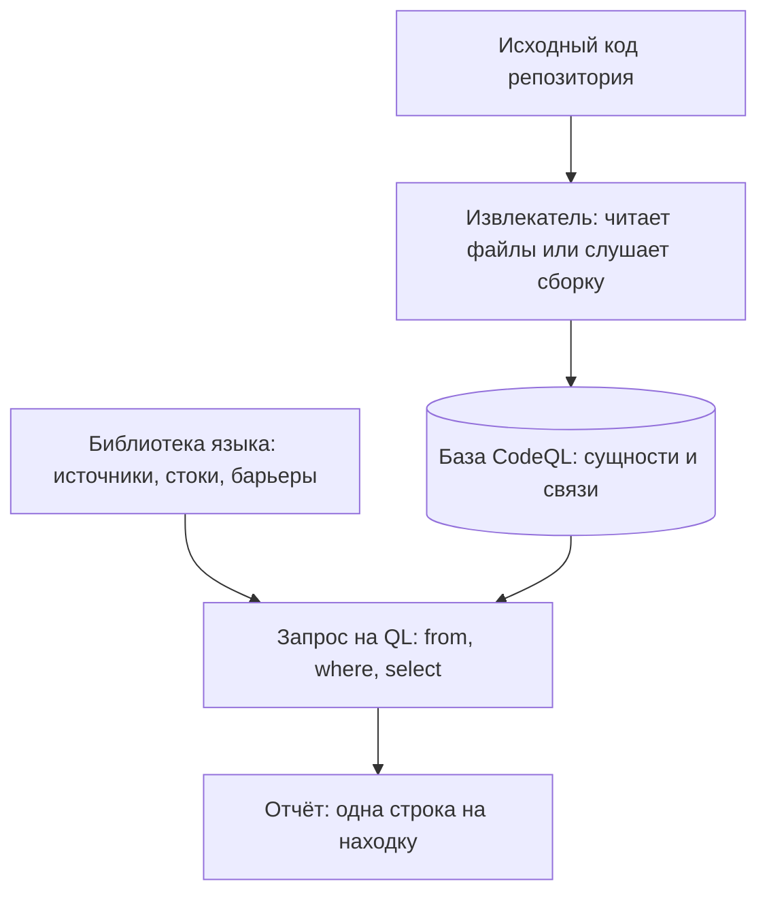
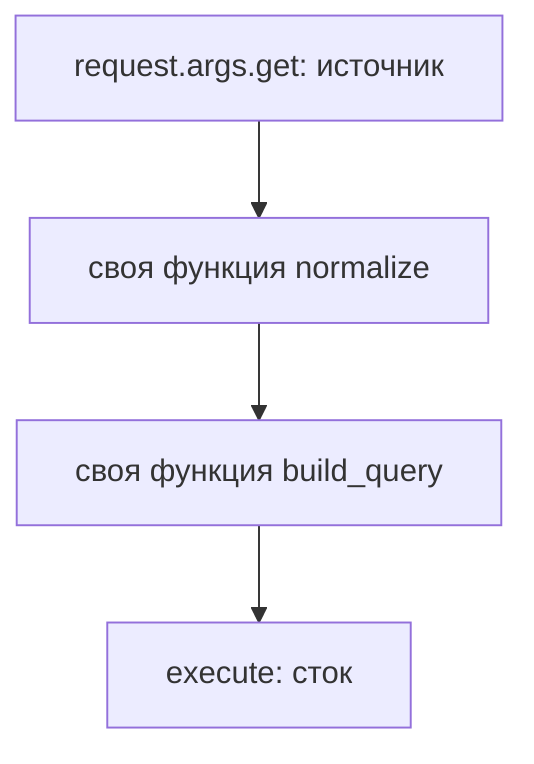

# CodeQL: модель данных и базовые запросы

В темах `semgrep-rules` и `bandit` вы уже гоняли учебные стенды двумя
инструментами: один искал по образцу, второй — по чёрным спискам вызовов.
Теперь тот же код прогнали третьим инструментом, CodeQL, и весь отчёт
уместился в четыре строки:

```text
SQL query built from user-controlled sources | /app.py | 21 | 29
Uncontrolled command line                    | /app.py | 39 | 27
Uncontrolled data used in path expression    | /app.py | 46 | 15
SQL query built from user-controlled sources | /app.py | 31 | 29
```

Присмотритесь к именам находок. «Запрос собран из данных, которыми
управляет пользователь» — не описание формы кода, а утверждение о пути.
Значение дошло от ввода до опасного вызова, и по дороге могло пройти
любое число функций. Ни сопоставление по образцу, ни чёрные списки так не
пишут: они называют место и правило. А у этих четырёх строк есть
зеркальный случай: те же дефекты, переписанные без веб-каркаса, дали в
CodeQL ноль находок. Ниже разберём, из какого устройства следуют и четыре
строки, и ноль.

## Как это работает

Чтобы утверждать что-то про путь значения, о коде надо знать больше, чем
видно из текста программы. CodeQL решает это радикально: **он превращает
исходный код в базу данных**, а проверку записывает запросом к этой базе.
Сама форма вопроса знакома вам по SQL из темы `sqli-basics`: данные лежат
в таблицах, а запрос «выбери строки, для которых верно вот это» возвращает
ответ. Только строки здесь — сущности языка: выражения, вызовы, функции,
типы.

Бытовой пример — поиск книги в библиотеке. Обойти полки и прочитать все
корешки можно, и поиск по тексту работает именно так. Но вопрос «все ли
читатели, взявшие книгу этого автора, вернули её вовремя» обходом полок
не решается: он про связи, а не про корешки. Для таких вопросов нужна
картотека — карточки «книга», «автор», «читатель» и записи о связях между
ними. База CodeQL — такая картотека для кода, а запрос — вопрос к ней.
Записывается вопрос на QL, собственном языке запросов CodeQL.

Соответствие такое.

| В библиотеке | В CodeQL |
|---|---|
| полки с книгами | файлы с исходным кодом |
| карточки «книга» и «читатель» | сущности: выражения, вызовы, функции |
| записи «кто что взял» | связи: какой вызов в какой функции живёт и куда течёт значение |
| вопрос к картотеке | запрос на языке QL |

Где аналогия ломается. Картотеку заполняет библиотекарь вручную, а базу
CodeQL строит программа без участия человека. И в картотеке нет ничего
похожего на главную связь базы — предвычисленный поток значений, готовый
ответ, откуда и куда может дойти каждое значение.

### Как код попадает в базу

За наполнение базы отвечает извлекатель — программа, которая читает
исходники и записывает в таблицы всё, что о них известно. Для языков без
сборки — Python, JavaScript, Ruby — извлекателю достаточно файлов проекта.
Для компилируемых языков он работает иначе: слушает сборку и подмечает,
какие файлы и с какими флагами обрабатывает компилятор. У четырёх языков
(C/C++, C#, Java, Rust) есть и режим без сборки, но связей в такой базе
меньше. Без наблюдения за сборкой извлекатель не видит, какие файлы
реально входят в проект, и не видит сгенерированный код.

Готовая база — набор таблиц с сущностями языка и связями между ними.
Часть связей вычислена заранее: какие классы наследуют интерфейс, какие
вызовы достижимы из обработчика, куда течёт значение. Поток значений здесь
тот самый, что вы разбирали в теме `sast-principles`, только посчитан он
один раз, при построении базы, а не при каждой проверке.



**Описание схемы.** Схема читается сверху вниз и показывает два шага
прогона. Извлекатель превращает исходный код в базу, таблицы сущностей и
связей. Запрос выполняется над базой и опирается на библиотеку языка.
В библиотеке описано, какие вызовы считаются источниками внешних данных,
какие — опасными стоками и какие проверки — барьеры — останавливают поток.
Результат — отчёт, одна строка на находку.

### Из чего состоит запрос

Запросы пишут на языке QL, и устроен такой запрос как вопрос к базе. Вот
запрос, который находит вызовы `eval`:

```ql
import python

from Call c
where c.getFunc().(Name).getId() = "eval"
select c, "вызов eval"
```

Первая строка подключает библиотеку языка: оттуда приходят типы вроде
`Call`, то есть вызов. Дальше идут три части. `from` объявляет переменные:
здесь одна, `c` типа «вызов». `where` задаёт условие: вызов идёт по имени
без атрибута, и это имя `eval`. `select` называет вывод: место вызова и
строку сообщения. У полноценного файла запроса сверху стоит ещё блок
метаданных в комментарии: имя, описание, важность. Между импортом и
`from` могут стоять свои классы и предикаты — вспомогательные определения,
которые автор запроса вводит для себя.

Готовые запросы про безопасность устроены иначе: они почти целиком состоят
из вызова библиотеки потока данных. Библиотека описывает источники, стоки
и барьеры — проверки, после которых значение считается безопасным; в режиме
метки из темы `semgrep-rules` они назывались санитайзерами.

Сам запрос при этом спрашивает одно: есть ли путь от какого-нибудь
источника к какому-нибудь стоку. Знание, что `request.args.get` приносит
внешние данные, живёт в библиотеке, а не в тексте запроса. Отсюда и сила
на знакомом каркасе, и молчание на незнакомом — к этому вернёмся в
разделе «Как читать вывод».

**Откуда это взялось.** Правила анализаторов писались под конкретный
вопрос: одно правило — один класс дефекта. Ломалось это на вопросах,
которых автор правила не предвидел: новый каркас, новая обёртка над вводом
— и нужно ещё одно правило. Ответом стала другая раскладка: извлечь из
кода всё, что о нём известно, в базу, а вопросы задавать потом, запросами,
которые пишет тот, кому вопрос понадобился.

## Что умеет и чего не умеет

**Что умеет.** Спрашивать о связях, а не только о форме. Какие классы
наследуют этот интерфейс? Какие вызовы достижимы из этого обработчика?
Доходит ли значение отсюда туда через любое число функций? Последний
вопрос — межпроцедурный: путь строится через границы функций и файлов, и
для CodeQL это обычная работа, а не отдельная надстройка.



**Описание схемы.** Значение из параметра запроса проходит две свои
функции, прежде чем попадает в опасный вызов. Сопоставлению по образцу
этот путь недоступен: образец видит один кусок кода и не знает, что
`normalize` и `build_query` передают дальше то же значение. Запрос к базе
видит путь целиком, потому что связи между функциями уже лежат в таблицах.

Ещё одно следствие той же раскладки: модель источников и стоков приходит
из библиотеки. Поэтому один и тот же запрос работает на любом знакомом
библиотеке каркасе и не переписывается под каждый новый.

**Чего не умеет.** Первое — работать без модели каркаса. Если библиотека
не знает, что этот вызов приносит внешние данные, путь не начнётся, и
запрос промолчит на настоящем дефекте. Второе — обходиться без сборки на
любом компилируемом языке: режим без сборки есть лишь у части языков.
Третье — быть дешёвым: база строится минуты и занимает место на диске, а
прогон полного набора запросов дороже сопоставления по образцу на том же
коде.

## Как запустить

CodeQL — это бесплатный CLI от GitHub, программа командной строки.
Готовую сборку скачивают со страницы релизов репозитория
`codeql-cli-binaries` на GitHub, а ставится она распаковкой архива. В ту
же сборку входят и стандартные наборы запросов. Прогон устроен в два
шага: сначала код извлекается в базу, потом над базой выполняется набор
запросов.

```bash
# CodeQL 2.26.3. Шаг 1: извлечь код в базу.
codeql database create db-shopweb --language=python \
       --source-root=exp/shopweb
```

Здесь `db-shopweb` — каталог, куда ляжет база, `--language` выбирает
извлекатель, а `--source-root` — корень исходников. Шаг длится минуты:
извлекатель разбирает каждый файл и считает связи.

```bash
# Шаг 2: прогнать набор запросов и получить отчёт.
codeql database analyze db-shopweb \
       codeql/python-queries:codeql-suites/python-security-extended.qls \
       --format=csv --output=out/codeql.csv
```

Второй шаг принимает набор запросов — готовый именованный список проверок
из поставки, что-то вроде плейлиста. Его адрес читается вокруг двоеточия:
до него стоит пакет `codeql/python-queries` из поставки, после — путь
к набору внутри пакета. Набор `python-security-extended` — расширенный
набор про безопасность для Python. Формат `csv` даёт табличный отчёт:
его можно читать глазами и скармливать скриптам.

Для компилируемого языка между этими шагами стоит сборка: команда `create`
принимает опцию `--command` с командой сборки и слушает компилятор.

## Как читать вывод

Отчёт в табличном формате — одна строка на находку. Вернитесь к четырём
строкам во вступлении: в каждой записаны имя запроса, файл, строка и
позиция в строке. Имя запроса читается как утверждение о пути, а не о
форме кода: «запрос собран из данных, которыми управляет пользователь».
Дублей нет: одно место даёт одну строку.

Стенд, на котором получен этот отчёт, — обработчики веб-каркаса с тремя
подставленными дефектами и одним чистым местом похожей формы. Строки 21,
39 и 46 — настоящие дефекты: склейка запроса, команды и пути из внешних
данных. Строка 31 — чистый код: имя таблицы сверено с замкнутым множеством
перед подстановкой.

Почему чистое место всё же попало в отчёт? Проверка сравнением барьером
для модели не стала: библиотека признаёт не всякую проверку, и это
сравнение она за барьер не считает. Тем самым CodeQL повторил то же ложное
срабатывание, которое на этом месте дали и два других инструмента.

### Что нашли три инструмента

Тот же файл гоняли ещё двумя инструментами:

```text
инструмент         записей   мест   настоящих   пропущено
Semgrep p/default       14      7           3           0
bandit                   4      4           2           1
CodeQL                   4      4           3           0
```

Читать эту таблицу надо по колонке «мест», а не «записей». Четырнадцать
записей Semgrep — не четырнадцать мест: одно и то же место печатается
несколькими правилами набора. Пропуск bandit — путь к файлу из параметра
запроса: без потока данных этот дефект не виден.

### Тот же код без каркаса

Отдельно стоит второй прогон того же кода. Во второй стенд вошли два
дефекта из тех же трёх — запрос и команда, без пути к файлу. Их переписали
на стандартную библиотеку без веб-каркаса и разложили по шести файлам.
CodeQL дал **ноль находок**: библиотека не знает, что разбор строки
запроса приносит внешние данные, и путь не начинается. Semgrep на том же
коде нашёл оба дефекта: запрос в обоих его местах и команду.

Прогоны с каркасом и без него делят заслугу и вину поровну: и находки, и
молчание объясняются одним местом — библиотекой языка. Теперь представьте:
ваш проект разбирает ввод своим кодом, а не известным каркасом, и отчёт
CodeQL чист. Что вы проверите первым, прежде чем ему поверить?

**Зачем это в работе AppSec-инженера.** Отчёт CodeQL читать приходится
независимо от того, пишете ли вы запросы сами: инструмент ставят в
конвейеры репозиториев, и его находки разбирают вместе с разработкой.
Второй повод практический: когда в конвейере уже стоит сопоставление по
образцу, вопрос «зачем второй инструмент» задают на первом же обсуждении
бюджета. Отвечать на него надо числами со своего кода, а не описаниями с
сайта инструмента.

Что делать с настоящими находками, разбирают темы `sqli-basics`,
`os-command-injection` и `path-traversal`.

## Границы метода

**Граница первая: модель источников — чужое знание.** Своя обёртка над
вводом или редкий каркас означают молчание до тех пор, пока модель не
описана. Ноль находок на стенде без каркаса — измеренный случай, а не
предположение: прогон пересказан в разделе «Как читать вывод».

**Граница вторая: цена.** База строится минуты и занимает место на диске,
а полный набор запросов идёт заметно дольше прогона по образцу. На
конвейере это выражается в отдельном шаге со своим кэшем, а не в добавлении
одной команды в существующий.

**Граница третья: свои запросы — отдельная профессия.** Прочитать запрос
проще, чем написать: чтение опирается на имя и метаданные, письмо — на
библиотеку языка целиком. Эта тема учит первому и честно не обещает
второго.

## Частая ошибка

После сравнения моделей вывод напрашивается сам: раз CodeQL сильнее по
модели, он заменяет сопоставление по образцу, и держать два инструмента
незачем. Вопрос до ответа: на каком коде более сильная модель проиграет
сопоставлению по образцу?

**Сильнее по модели не значит шире по покрытию.** Прогон на стенде без
знакомого каркаса дал ноль находок там, где сопоставление по образцу нашло
два дефекта из трёх. Модель потока покрывает то, что описано в библиотеке,
а образец — то, что автор правила описал час назад под свою обёртку.

Есть и контрпример к обратному выводу. На коде с веб-каркасом CodeQL нашёл
дефект, который bandit пропустил полностью, и сделал это без единого
дубля. Инструменты закрывают разные пропуски, и вопрос «какой из двух»
подменяет вопрос «что каждый из них не видит».

## Чеклист для ревью

1. Проверьте, что база построена на том же дереве, которое собирается в
   конвейере, а не на срезе без сгенерированного кода.
2. Проверьте, что для компилируемого языка извлечение шло вместе со сборкой.
3. Проверьте, что набор запросов назван в отчёте: наборов несколько, и они
   различаются по составу.
4. Проверьте, что число просмотренных файлов прочитано: молчание на
   незнакомом каркасе выглядит как чистый отчёт.
5. Проверьте, что каркас приложения входит в модель библиотеки, а не заявлен
   поддерживаемым по имени языка.
6. Проверьте, что CodeQL сопоставлен со вторым инструментом на своём коде,
   а не выбран вместо него по описанию.

## Попробуй сам

Соберите базу по своему репозиторию и прогоните набор запросов про
безопасность — две команды из раздела «Как запустить». Затем сравните
список мест с прогоном инструмента, который уже стоит в конвейере.

Одна подсказка: сравнивать надо места, а не записи. Иначе разница в числе
находок объяснится дублями, а не покрытием.

**Критерий выполнения** наблюдаемый: получены два списка мест и таблица
расхождений, где каждое место, найденное одним инструментом и пропущенное
другим, снабжено причиной.

## Проверь себя

1. Прочитайте запрос:

   ```ql
   import python

   from Call c
   where c.getFunc().(Attribute).getName() = "execute"
   select c, "вызов execute"
   ```

   Укажите, где в нём объявлены переменные, где условие и что именно попадёт
   в вывод.

2. Почему на коде без знакомого веб-каркаса прогон дал ноль находок при двух
   настоящих дефектах?

3. В конвейере уже стоит сопоставление по образцу, а CodeQL сильнее по
   модели. Что делать?

   A. Заменить сопоставление на CodeQL: сильная модель покрывает больше.

   B. Оставить оба и сравнивать места, а не записи: пропуски у них разные.

   C. Оставить только сопоставление: второй инструмент дублирует первый.

4. Не запуская, предскажите, что напечатает эта мини-модель источников и
   стоков, и объясните, прогоном из какого раздела темы она повторяет ноль
   CodeQL.

   ```python
   # Мини-модель: один известный источник и один сток, как в библиотеке.
   SOURCES = ("request.args.get",)
   SINKS = ("execute(",)

   def scan(code):
       tainted = any(s in code for s in SOURCES)
       dangerous = any(s in code for s in SINKS)
       return tainted and dangerous

   a = 'q = "DELETE FROM t WHERE n = " + request.args.get("n"); execute(q)'
   b = 'n = input(); q = "DELETE FROM t WHERE n = " + n; execute(q)'

   print("обработчик на каркасе:", scan(a))
   print("обработчик со своим вводом:", scan(b))
   ```

5. Возврат к теме `path-traversal`: строка отчёта «Uncontrolled data used in
   path expression» — о каком дефекте она и чем такой чинится?
6. Возврат к теме `semgrep-rules`: в чём разница между «источник описан в
   библиотеке» и «источник описан в правиле»?

<details markdown="1">
<summary>Ответ 1</summary>

1. Переменные объявлены в `from`: здесь одна, `c` типа `Call`. Условие стоит
   в `where`: у вызова имя атрибута-функции равно `execute`. Вывод называет
   `select`: в отчёт попадут сам вызов и строка сообщения. Импорт библиотеки
   языка стоит выше и даёт типы вроде `Call`.

</details>

<details markdown="1">
<summary>Ответ 2</summary>

2. Потому что источник не размечен в модели: библиотека не знает, что разбор
   строки запроса стандартной библиотекой приносит внешние данные. Путь не
   начинается, и запрос молчит на настоящем дефекте. Чистый отчёт здесь —
   молчание модели, а не чистый код.

</details>

<details markdown="1">
<summary>Ответ 3: разбор вариантов</summary>

3. Верный ответ — B.

   A. На стенде без знакомого каркаса CodeQL дал ноль находок там, где
      сопоставление по образцу нашло два дефекта из трёх. Модель покрывает
      описанное в библиотеке, а образец — то, что автор описал под свою
      обёртку.

   B. На стенде с каркасом CodeQL нашёл дефект, который bandit пропустил
      полностью, и без единого дубля. Инструменты закрывают разные пропуски,
      и сравнивать их надо местами, а не записями.

   C. Второй инструмент дублирует только форму находок, но не пропуски: у
      каждого свой класс молчания, и замена одного другим этот класс
      наследует.

</details>

<details markdown="1">
<summary>Ответ 4</summary>

4. Напечатает `обработчик на каркасе: True`, затем `обработчик со своим
   вводом: False`. Дефект в обоих один и тот же, но источник `input()` модели
   неизвестен, и путь не начинается. Это тот же механизм, что дал ноль
   находок CodeQL на стенде без каркаса из раздела «Как читать вывод».
   Ответ получен прогоном: `python3 mini_model.py`.

</details>

<details markdown="1">
<summary>Ответ 5</summary>

5. О пути к файлу, собранном из внешних данных: значение дошло до выражения
   пути без проверки. Чинится канонизацией пути и проверкой префикса уже
   канонического результата: склейка с корнем каталога сама по себе `../` не
   убирает.

</details>

<details markdown="1">
<summary>Ответ 6</summary>

6. Библиотечная модель приходит с инструментом и покрывает известные каркасы
   без работы автора запроса, но молчит на незнакомых. Модель в правиле
   пишется под свой код и покрывает ровно то, что автор описал, включая
   внутренние обёртки, — ценой этой работы.

</details>

## Источники

1. GitHub, «Preparing your code for CodeQL analysis»; реестр
   `codeql-database-create`. Разделы: команда `codeql database create` и её
   опции, различие между языками без сборки и компилируемыми, явная
   `--command` и косвенная трассировка сборки.
   <https://docs.github.com/en/code-security/tutorials/customize-code-scanning/prepare-code-for-analysis>
2. GitHub, «About CodeQL queries»; реестр `codeql-about-queries`. Разделы:
   устройство файла запроса — метаданные, импорты, свои классы и предикаты,
   `from`, `where`, `select`.
   <https://codeql.github.com/docs/writing-codeql-queries/about-codeql-queries/>
3. GitHub, «About data flow analysis»; реестр `codeql-dataflow`. Разделы:
   локальный и глобальный поток, источники и стоки, цена межпроцедурного
   анализа и места, где путь обрывается.
   <https://codeql.github.com/docs/writing-codeql-queries/about-data-flow-analysis/>
4. GitHub, документация CodeQL; реестр `codeql-docs`. Разделы: модель «код как
   база данных» и состав библиотек под каждый язык.
   <https://codeql.github.com/docs/>

Каркас этапа: `cwe-taxonomy`. Наследуется всеми темами и отдельной строкой не
повторяется.

**Скоропортящийся слой.** Версия CLI, имена наборов запросов, состав
библиотечных моделей каркасов и вид отчёта. Модель «код как база данных» и
устройство запроса держатся дольше.

**Маркеры уверенности.** Четыре находки на четырёх местах на стенде с
каркасом, из них три настоящих; ноль находок на том же коде без каркаса;
четырнадцать записей на семи местах у набора правил по образцу и четыре записи
с одним пропуском у bandit — **проверено лично** 2026-08-25 на CodeQL 2.26.3,
Semgrep 1.174.0, bandit 1.9.4, Python 3.14.7. Устройство базы, порядок её
создания, состав запроса и работа библиотеки потока — **по документации**
CodeQL и GitHub, открытой лично 2026-08-25. Прогон на компилируемом языке и
работа в облачной сборке **не воспроизводились**: проверялся только Python и
только локальным CLI. Запрос про `eval` из раздела «Как это работает» —
**по документации**, на стенде не выполнялся. Листинг мини-модели из вопроса 4
прогнан локально 2026-10-03 на Python 3.14.7; вывод совпал дословно.
