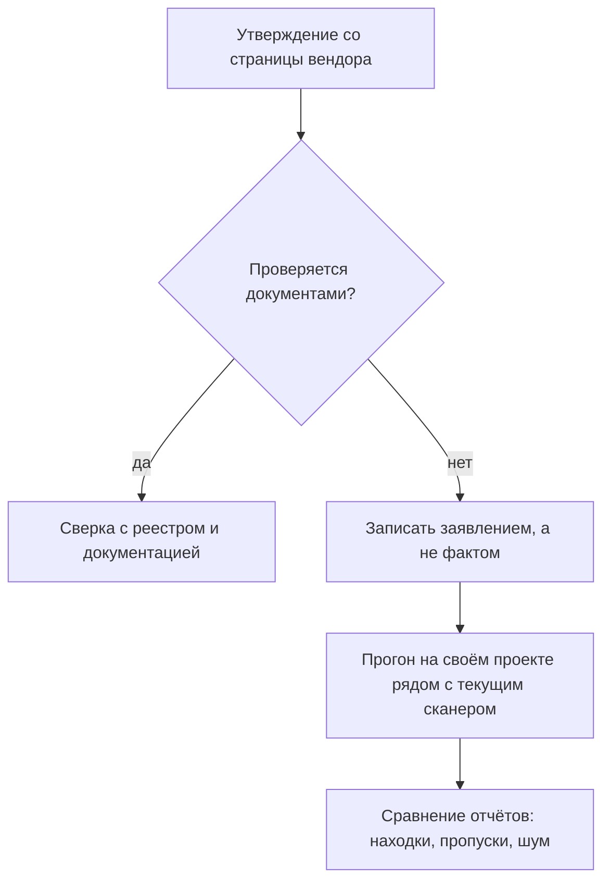

# CodeScoring: российский SCA

Представьте совещание с заказчиком в конце проекта. Сборка настроена, сканер
зависимостей в конвейере стоит, и тут звучит требование: инструменты проверки
обязаны быть российскими, из государственного реестра. На стол кладут название
— CodeScoring. Первый вопрос, который вам зададут, предсказуем: «Чем он
отличается от того, что у нас уже стоит?» Честный ответ начинается с границы.
Инструмент коммерческий, лицензии под рукой нет, прогона на своём коде не
было, и сравнение без прогона — догадка. Эта тема про то, что сказать всё же
можно: какие утверждения проверяются документами, а какие останутся заявлением
вендора до первого запуска.

## Что такое CodeScoring

CodeScoring — коммерческая платформа композиционного анализа от компании
Profiscope. Сам класс вам знаком: композиционный анализ, он же SCA, сверяет
состав проекта с базой известных уязвимостей. Такую сверку вы уже видели у
`trivy` и `dependency-track`. Класс дефекта у всех сканеров состава общий —
опора на компонент с известной уязвимостью, `CWE-1395`, категория OWASP
`A03:2025`. Чинится такая находка обновлением и закреплением версий, и это
разобрано в `transitive-dependencies`.

Отдельная строка в описании продукта — запись в Едином реестре российского
программного обеспечения. Это государственный перечень программ, которые
формально признаны российскими: для включения вендор подтверждает страну
разработки и права на код. Зачем нужен такой перечень, видно из закупок.
Банк или госучреждение покупает ПО по правилам, где зарубежный сканер не
принимают независимо от его качества, и реестровая запись работает как
пропуск на объект. Такой закупочный режим называют импортозамещением. Поэтому
инструменты этого класса попадают в конвейер не по техническому сравнению, а
по требованию — та же картина разобрана у анализаторов кода в `ru-sast-tools`.

Место в конвейере у CodeScoring то же, что у любого сканера состава. Он стоит
между сборкой и выкатом, там, где проверяют, из чего собран продукт, а не его
собственный код. Граф зависимостей для сверки растёт из манифестов и
lock-файлов, как разобрано в `transitive-dependencies`, а балл тяжести
каждой находки читается по правилам из `cve-cvss`. Это проверка не своего
кода, а того, из чего он собран.

**Зачем это в работе AppSec-инженера.** Вопрос «чем это отличается от нашего
сканера» задают на первом же совещании, где инструмент называют. Отвечать
приходится без прогона, потому что лицензии нет ни у кого из присутствующих.
Рабочий навык этой темы — развести проверяемые факты и заявления вендора и
сказать прямо: сравнение требует прогона на своём коде, а не чтения страницы
продукта.

## Что умеет и чего не умеет

**Откуда это взялось.** Сканеры состава выбирали по свойствам, и список
кандидатов был общим для всех заказчиков. Ломалось это на требованиях к
происхождению ПО: часть заказчиков перестала принимать зарубежный сканер
независимо от его качества. В ответ на рынке появился отдельный вопрос — не
«какой SCA лучше», а «какой из них можно поставить у этого заказчика».

Проверяемые утверждения берутся со страниц вендора и на них же проверяются. По
документации CodeScoring заявляет пять возможностей: композиционный анализ
зависимостей, генерацию SBOM, собственную базу уязвимостей, контроль лицензий
и поиск фрагментов заимствованного кода. Первые две вам знакомы: сверку
состава делает и `trivy`, а формат ведомости состава разобран в `sbom`.

Третья возможность, собственная база уязвимостей, требует пояснения. Сканер
состава уязвимости не придумывает: он сопоставляет найденные пакеты с записями
базы, и `trivy` берёт такие записи из открытых источников. Вендорская база —
это заявление о том, что вендор ведёт собственный список и пополняет его сам.
Цена такого заявления — покрытие и свежесть списка, а проверить и то и другое
можно только сравнительным прогоном.

Две оставшиеся возможности новые для этого маршрута, и их стоит разобрать
отдельно, потому что именно они отличают CodeScoring по назначению.

Контроль лицензий следит не за уязвимостями, а за обязательствами. Каждый
открытый пакет отдаётся на условиях своей лицензии, и условия бывают
несовместимы с вашей моделью распространения. Бытовой пример: команда продаёт
закрытый продукт, а в его составе оказался компонент под GPL, которая требует
при распространении открыть код всей программы. Контроль лицензий находит
такие конфликты до того, как их найдёт юрист заказчика.

Поиск фрагментов заимствованного кода закрывает дыру, которую манифесты не
видят. Разработчик копирует функцию с GitHub или со Stack Overflow прямо в
свой код. В манифесте запись о ней не появляется, потому что пакет никто не
ставил. Сканер по манифесту такой фрагмент не заметит, а уязвимость в нём
останется. Поиск заимствований сравнивает фрагменты вашего кода с
проиндексированным открытым кодом. Для каждого совпадения он показывает, откуда
фрагмент взят, с какой лицензией и с какими известными уязвимостями.

Такой задачи у чисто уязвимостных сканеров обычно нет. Поэтому по назначению
CodeScoring — тот же класс, что `trivy` и `dependency-track`, плюс уклон в
лицензии и заимствованные фрагменты.

Чего сказать нельзя: ничего о качестве анализа, полноте базы, доле ложных
срабатываний и о сравнении с инструментами предыдущих тем. Страница вендора —
не замер, а описание намерения. Прогона не было: инструмент коммерческий,
лицензии нет, и запустить его, как `trivy`, здесь нечем. Поэтому формулировка
«не хуже зарубежных» остаётся маркетингом ровно до того момента, когда рядом
появится прогон на одном и том же коде. Это единственный способ проверить
любое такое утверждение.

## Что ответить про «не хуже зарубежных»

Вернёмся к совещанию из начала темы. Заказчик читает со страницы вендора фразу
«не хуже зарубежных» и ждёт вашего мнения. Ответ раскладывается на два списка:
что доступно без лицензии и что появится только после прогона. Без лицензии
проверяются реестровая запись, состав заявленных возможностей и документация —
всё это открыто. Качество анализа, полнота базы и доля ложных срабатываний без
прогона не проверяются никак.

Прогон, который закрывает вопрос, устроен как сравнение на равных. Оба
сканера, стоящий в конвейере и кандидат, запускаются на одном и том же
проекте. Их отчёты сравниваются по трём осям: что нашёл каждый, что пропустил
и сколько шума принёс. Полезно добавить стенд с известным дефектом — например,
проект с транзитивным пакетом, по которому есть запись CVE и находка текущего
сканера. Если кандидат этот пакет не нашёл, заявление о полноте базы
опровергнуто одним примером. Если нашёл, заявление не доказано, а не
опровергнуто: один пример ничего не говорит о тысяче других.

**Описание схемы.** Схема читается сверху вниз. Каждое утверждение вендора
проходит один и тот же фильтр. Если оно проверяется документами, его сверяют с
реестром и документацией. Если нет, оно записывается заявлением и ждёт
прогона на своём проекте рядом с текущим сканером, после которого отчёты
сравнивают по находкам, пропускам и шуму.

Финальная формулировка для заказчика выглядит так. Проверяемое подтверждено
документами: реестровая запись есть, состав возможностей заявлен и описан. Всё
про качество — заявления, и они проверяются прогоном на вашем коде рядом с
текущим сканером. Такой ответ честен в обе стороны: он не повторяет маркетинг
и не отмахивается от инструмента, которого вы не запускали.

## Источники

1. CodeScoring — платформа безопасной разработки; реестр `codescoring`. Разделы:
   заявленные возможности — композиционный анализ, SBOM, база уязвимостей, поиск
   фрагментов кода.
   <https://codescoring.ru/>
2. CodeScoring Documentation; реестр `codescoring-docs`. Разделы: назначение
   продукта, композиционный анализ, генерация SBOM, политики и база уязвимостей.
   <https://docs.codescoring.ru/>

Каркас этапа: `cwe-taxonomy`. Наследуется всеми темами и отдельной строкой не
повторяется.

**Скоропортящийся слой.** Состав заявленных возможностей и версии продукта.
Устройство — SCA как сверка состава с базой — общее для класса и разобрано в
`trivy`.

**Маркеры уверенности.** Заявленные возможности — по странице продукта,
открытой лично 2026-08-20, и документации CodeScoring, открытой лично
2026-08-25. Качество, полнота базы и сравнение с другими инструментами не
проверялись: инструмент коммерческий, прогона не было, и любое сравнение без
него было бы догадкой.
