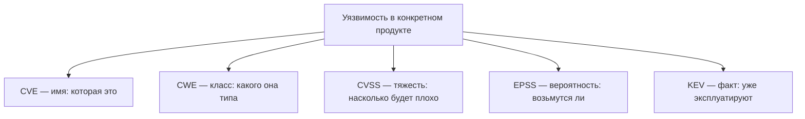
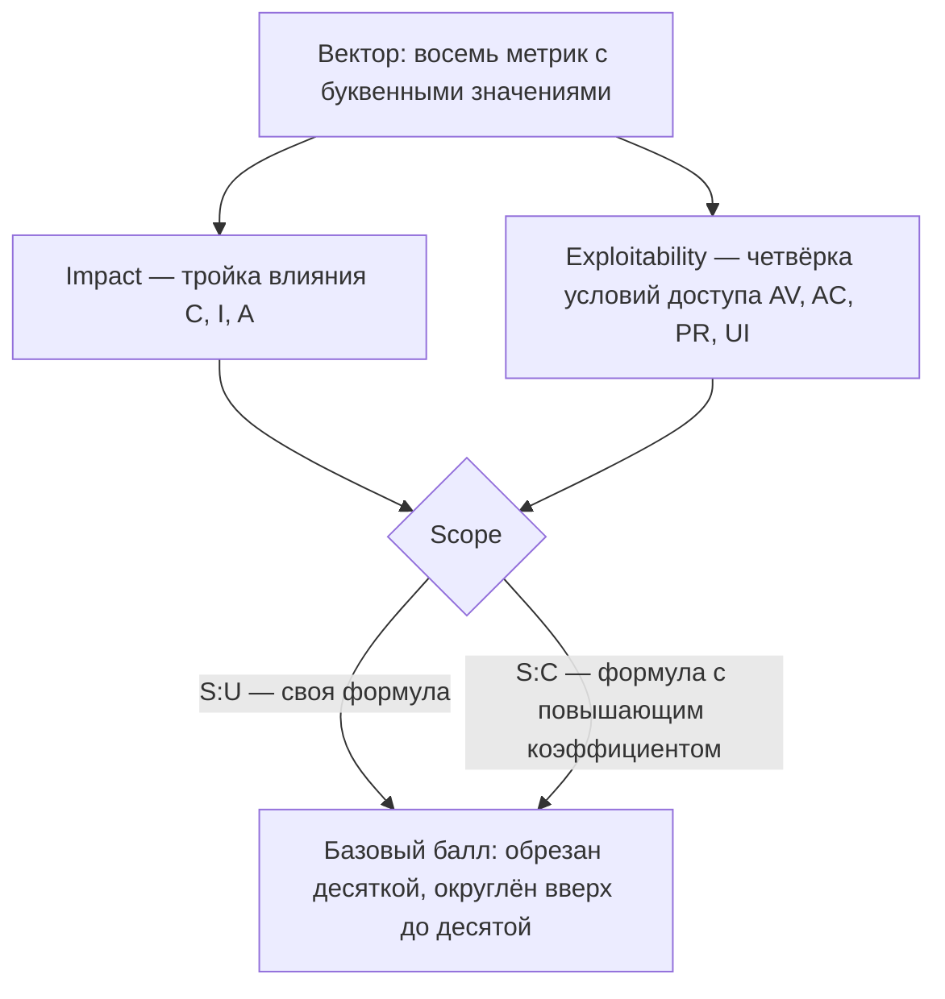
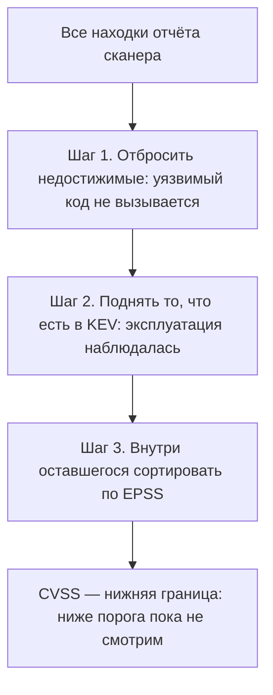

# CVE, CWE, CVSS, EPSS, KEV: как читать оценку

Отчёт сканера состава пришёл на сотни находок, и сверху стоит стена
красного: критические уязвимости идут подряд, у всех балл 9.8 или 10.0.
Кого чинить первой, из такой таблицы не видно. Вот пять настоящих строк
из такого отчёта; числа в них — снимок, то есть сохранённая копия трёх
открытых баз на 2026-08-24:

```text
CVE            CVSS   EPSS      KEV
2021-44228     10.0   0.99999   да
2024-3094      10.0   0.860     нет
2023-38545      9.8   0.785     нет
2020-1747       9.8   0.054     нет
2026-57517      9.8   0.0096    нет
```

В первой строке стоит Log4Shell, уязвимость 2021 года в библиотеке
логирования Log4j, о которой тогда писали все новости. По второй
колонке все пять строк почти неразличимы, по третьей разброс в сто
раз, и только первая отмечена в четвёртой. Колонки здесь — четыре
разные системы оценки, а есть и пятая: CWE отвечает на другой вопрос,
какого типа дефект, и её в таблице нет. Читать эти системы как одну
шкалу — значит получить случайную очередь работ. Приложите это к
строке, которой в таблице нет: уязвимость с баллом 7.2 вчера попала в
четвёртую колонку — где её место в очереди относительно этих пяти?

## Пять систем про одну уязвимость

У одной и той же уязвимости есть пять описаний, и каждое ведёт своя
система. Разберём все пять по порядку: что это, зачем оно нужно и на
что похоже в обычной жизни.

**CVE (Common Vulnerabilities and Exposures)** — реестр, который даёт
уязвимости имя. Запись `CVE-2021-44228` называет одну конкретную дыру
в одном конкретном продукте и версии; первое число — год, второе —
порядковый номер. Записи выпускают уполномоченные организации из сети
CNA (CVE Numbering Authority), чтобы вендор, исследователь и сканер
говорили об одном и том же [^1]. Бытовой образ — номерной знак машины:
он ничего не говорит о состоянии машины, но по нему любая база найдёт
именно её.

**CWE (Common Weakness Enumeration)** — каталог типов дефектов, который
ведёт организация MITRE [^2]. Если CVE — история болезни конкретного
пациента, то CWE — название диагноза из классификатора: `CWE-89` — это
«внедрение SQL» вообще, а не чей-то случай. Класс нужен, чтобы видеть
общее у разных дыр и чинить сразу семейство. Аналогия ломается на числе
диагнозов: одной записи CVE иногда сопоставляют несколько CWE. Дефект
бывает многослойным: внедрение опирается на недостаточную проверку
ввода, и запись получает оба класса.

Связь здесь односторонняя: по типу нельзя восстановить конкретную
уязвимость, а по уязвимости тип — можно. Поэтому фраза отчёта «нашли
CWE-89» не значит «нашли уязвимость»: она значит «нашли место, похожее
на класс». Сам класс `CWE-89` как дефект, с путём от чужих данных до
сборки запроса, разбирает тема `sqli-basics`.

**CVSS (Common Vulnerability Scoring System)** — стандарт оценки
тяжести: насколько будет плохо, если уязвимостью воспользуются [^3].
Оценка нужна, чтобы сравнивать тяжесть числом, а не словами «плохо» и
«очень плохо». Считается она из анкеты фиксированных вопросов, и разбор
этой анкеты — ниже, в разделе «Как это работает». Бытовой образ — графа
тяжести в медицинской карте: она описывает состояние, но не говорит,
кого врач примет первым.

**EPSS (Exploit Prediction Scoring System)** — прогноз: вероятность
того, что уязвимость начнут эксплуатировать в ближайшие тридцать дней
[^5]. Это число от 0 до 1, и пересчитывается оно ежедневно. Бытовой
образ — прогноз дождя на месяц, который уточняют каждое утро. Граница
аналогии: погода не читает прогнозов, а атакующие реагируют на
публикации, поэтому модель учится на уже замеченной эксплуатации.

**KEV (Known Exploited Vulnerabilities)** — каталог фактов. Уязвимость
попадает туда, когда её эксплуатацию наблюдали в дикой природе: в
реальных атаках, а не в лаборатории [^6]. Ведёт каталог CISA,
агентство кибербезопасности США, и список открыт для всех. Бытовой
образ — сводка подтверждённых происшествий: отсутствие в сводке не
значит, что происшествия не было, — значит лишь, что оно не
подтверждено.



**Описание схемы.** Схема читается сверху вниз. Одна уязвимость в
центре, и от неё пять стрелок к пяти системам описания. Каждая система
отвечает на свой вопрос, и подпись называет этот вопрос: имя, класс,
тяжесть, вероятность, факт.

Ключ ко всей теме — что это разные оси, а не одна шкала. CVSS отвечает
«насколько тяжело», EPSS — «насколько вероятно», KEV — «случалось ли
уже». Инженер, который читает только CVSS и сортирует работу по нему,
тратит первый день не на то. Две уязвимости с одинаковым баллом 9.8
могут отличаться по вероятности эксплуатации в сто раз, и пять строк
из введения показывают ровно это.

**Зачем это в работе AppSec-инженера.** Сканер состава, с которым вы
познакомились в теме `supply-chain-threats`, выдаёт сотни находок с
баллами CVSS, и главный вопрос — с чего начать. Разбор такой очереди
называют триажем; слово пришло из приёмного покоя, где раненых
сортируют не по громкости крика, а по срочности. Ответ «с самых
тяжёлых» неверен: он путает тяжесть с приоритетом. Правильный триаж
читает все пять систем, и именно это отличает полезную работу с отчётом
от бессмысленной.

## Подумай, прежде чем читать

1. Две уязвимости имеют одинаковый балл CVSS 9.8. Значит ли это, что
   заниматься ими надо в одном порядке?
2. Балл CVSS называют «оценкой риска». Риск чего — что случится или
   насколько вероятно, что случится?
3. Уязвимость попала в список активно эксплуатируемых, но балл у неё
   средний. Что важнее для решения — балл или список?

Ответы приходят по ходу чтения, а в конце темы те же вопросы встретятся
снова — уже как проверка.

## Как это работает

**Откуда это взялось.** Пока уязвимостей было мало, их обсуждали
словами, и одна и та же дыра в разных источниках называлась по-разному.
Сначала появились имена (CVE) — чтобы говорить об одной уязвимости, а
не о трёх её названиях. Потом классы (CWE) — чтобы видеть общее у
разных дыр. Потом оценка (CVSS) — чтобы сравнивать тяжесть числом. А
когда выяснилось, что тяжесть плохо предсказывает, за что возьмётся
атакующий, добавились вероятность (EPSS) и факт (KEV). Каждый слой
родился из недостатка предыдущего, поэтому подменять один другим —
значит возвращаться к уже решённой проблеме.

### CVSS: вектор и балл

CVSS не выдумывает балл, а считает его из вектора — строки ответов на
восемь вопросов анкеты, по одной букве на ответ. В редакции v3.1
вопросы делятся на две группы. Первая — как достаётся уязвимость:
вектор доступа AV, сложность AC, нужные права PR, участие пользователя
UI. Вторая — что она даёт: влияние на конфиденциальность C,
целостность I, доступность A. Отдельный переключатель Scope отвечает
за границу: осталось воздействие внутри уязвимого компонента или вышло
за него [^3].

Scope понятен на бытовом примере: протекла стиральная машина. Если вода
осталась в ванной, это `S:U` (unchanged, «в пределах компонента»).
Если затоплены соседи этажом ниже — `S:C` (changed): пострадал другой
компонент, и оценка выше. Уязвимость в библиотеке, которая даёт
исполнение кода во всём приложении, — это почти всегда выход за
пределы компонента.



**Описание схемы.** Схема читается сверху вниз. Вектор рассыпается на
две группы метрик. Тройка влияния даёт Impact, четвёрка условий доступа —
Exploitability. Переключатель Scope выбирает формулу, по которой обе
части сводятся в базовый балл.

Теперь сами числа, потому что без них балл читается как магия. Каждой
букве сопоставлен коэффициент: у влияния `H` даёт 0.56, `L` — 0.22,
`N` — 0. Подсчёт влияния начинается с ISS, «сколько из трёх сторон
задето»: `1 − (1−C)(1−I)(1−A)`. При `C:H/I:H/A:H` это
`1 − 0.44³ ≈ 0.915`: задеты все три стороны. Дальше при `S:U` Impact
равен `6.42 × ISS`, а при `S:C` формула другая, с бóльшим весом.

Вторая половина — Exploitability: `8.22 × AV × AC × PR × UI`, где у
`AV:N` коэффициент 0.85, у `AC:L` — 0.77, и так далее. Базовый балл при
`S:U` — сумма Impact и Exploitability, обрезанная десяткой и
округлённая вверх до десятой. Заучивать коэффициенты не нужно; важно
увидеть механику. Балл — детерминированная функция вектора, поэтому
вектор всегда важнее балла: балл без вектора нельзя ни проверить, ни
пересчитать под своё окружение.

### Три редакции метрик

CVSS описывает три группы оценок, а не одну. Base — неизменные свойства
самой уязвимости. Threat (в v3.1 — Temporal) — то, что меняется со
временем, например появление готового эксплойта. Environmental —
поправка на конкретное окружение, где важность конфиденциальности или
доступности своя [^4]. Публикуемый в базах балл — обычно Base, и это
важно: он намеренно не учитывает ни вашего окружения, ни текущей
активности атакующих. Стандарт сам оговаривает, что базовый балл —
лишь оценка присущей тяжести, а не оценка риска [^4].

### EPSS и KEV: прогноз и факт

EPSS — модель, которую ведёт FIRST, международный форум команд
реагирования на инциденты; он же ведёт и стандарт CVSS. Модель даёт
каждой записи CVE вероятность эксплуатации в ближайшие 30 дней и
перцентиль относительно всех прочих записей [^5]. Перцентиль знаком по
детской поликлинике: рост ребёнка в перцентиле 90 значит, что выше
него лишь десять процентов сверстников. Перцентиль 0.99 у EPSS значит,
что вероятнее этой уязвимости эксплуатируют лишь один процент всех
известных.

Число не постоянное: баллы пересчитываются ежедневно. Наблюдаемая
эксплуатация влияет на обучение модели, а не напрямую на дневной балл.
Поэтому ссылаться на конкретное значение без даты снимка бессмысленно —
завтра оно может быть другим.

KEV — каталог, куда уязвимость попадает, когда её эксплуатация
**наблюдалась** в реальности [^6]. Это не прогноз и не оценка, а
зафиксированный факт. У записи есть дата добавления, срок устранения
для госорганов США и отметка, замечена ли она в кампаниях вымогателей —
программ, шифрующих данные ради выкупа. Разница с EPSS принципиальная:
EPSS говорит «вероятно», KEV — «уже случилось». Ни то ни другое не про
тяжесть: обе системы про то, возьмётся ли атакующий, — а именно это
определяет, что чинить первым. И обе неполны сверху: EPSS — модель со
своей ошибкой, KEV — список подтверждённого, а не всего происходящего.

## Что умеет и чего не умеет

**Что умеет.** Вместе пять систем дают полную карточку уязвимости: имя
(CVE), тип (CWE), тяжесть с разбором по вектору (CVSS), вероятность
эксплуатации (EPSS) и факт эксплуатации (KEV). CVSS-вектор при этом
самодостаточен: по нему балл пересчитывается кем угодно и проверяется —
это не мнение, а функция от метрик.

Это ценное свойство. Два инженера, спорящие о балле, на самом деле
спорят о значении конкретной метрики: доступна ли уязвимость по сети,
нужны ли права. Такой спор разрешим фактом, тогда как спор о числе «на
глаз» — нет. EPSS и KEV добавляют то, чего в векторе нет по определению:
взгляд наружу, на поведение атакующих. Вектор описывает уязвимость саму
по себе и в вакууме одинаков хоть через год; EPSS и KEV описывают мир
вокруг неё и потому меняются. Полезная карточка держит обе стороны:
неизменную природу дефекта и изменчивую активность вокруг него.

**Чего не умеет.** CVSS не оценивает риск для вашей системы: базовый
балл не знает, доступен ли уязвимый сервис извне и есть ли за ним
ценные данные. Для этого существует Environmental-группа, которую почти
никто не заполняет. Её метрики `CR/IR/AR` — требования к важности
конфиденциальности, целостности и доступности в вашем окружении: `L` —
низкая, `H` — высокая.

Разница осязаема. Тот же `CVE-2026-57517` в
изолированном сервисе без ценных данных (Environmental `CR:L/IR:L/AR:L`)
в v4.0 падает с 9.3 до 8.9. А при критичных данных (`CR:H`) он остаётся
на 9.3. Один и тот же дефект, разный балл — потому что разное
окружение. Именно эту поправку базовый балл не делает за вас.

EPSS не объясняет, почему вероятность такая, и меняется день ото дня.
KEV не полон: отсутствие в нём не значит «не эксплуатируется», а лишь
«эксплуатация не подтверждена CISA».

Показательный случай из снимка — закладка в `xz-utils`
(`CVE-2024-3094`): балл 10.0, EPSS 0.86, но в KEV её нет. Закладку
перехватили до широкого распространения, и подтверждённой эксплуатации
в дикой природе не было. И ни одна из систем не говорит, есть ли
уязвимый код на пути исполнения именно вашего приложения. Пакет может
быть в зависимостях, а уязвимая функция — никогда не вызываться. Это
вопрос достижимости, и он остаётся за человеком и за инструментами
анализа, а не за баллом.

## Как запустить

Посчитать вектор можно руками по формуле стандарта или калькулятором
FIRST; результат обязан совпасть, потому что это одна и та же функция
[^3]. Разберём настоящую свежую уязвимость `CVE-2026-57517` (класс
`CWE-89`, внедрение SQL) с вектором v3.1:

```text
CVSS:3.1/AV:N/AC:L/PR:N/UI:N/S:U/C:H/I:H/A:H
```

Читается он так: доступна по сети (`AV:N`), сложность низкая (`AC:L`),
прав не нужно (`PR:N`), участия пользователя не нужно (`UI:N`). Область
не выходит за компонент (`S:U`); влияние на конфиденциальность,
целостность и доступность полное (`C:H/I:H/A:H`).

По формуле для `S:U` это даёт базовый балл **9.8** (Critical). Тот же
вектор с `S:C` — область выходит за компонент — упирается в потолок
**10.0**. Именно так оценён `CVE-2021-44228` (Log4Shell), где инъекция
в логгер даёт исполнение за пределами уязвимой библиотеки. Разница
между 9.8 и 10.0 здесь — ровно один переключатель Scope. Она показывает,
почему вектор читают целиком: два почти одинаковых на глаз дефекта
разводит одна метрика о том, вырывается ли воздействие наружу
компонента.

EPSS и KEV не считаются, а запрашиваются из своих источников по
идентификатору CVE — из API FIRST и из каталога CISA. Снимок на
2026-08-24 для этих двух:

```text
CVE           CVSS v3.1   EPSS       KEV
2026-57517    9.8         0.0096     нет
2021-44228   10.0         0.99999    да (ransomware)
```

Пометка «ransomware» — та самая отметка о кампаниях вымогателей из
устройства каталога. Снимок датирован, потому что колонки EPSS и KEV
меняются. Через месяц числа в них могут быть другими, а вектор и балл
CVSS останутся теми же.

## Как читать вывод

Сведём три оси вместе и прочитаем, что они говорят о порядке работ:

```text
CVE           CVSS   EPSS      KEV   вывод
2021-44228    10.0   0.99999   да    первым: тяжело, вероятно, уже бьют
2026-57517     9.8   0.0096    нет   критично, но подождёт: бьют вряд ли
```

Обе записи — «критические» по CVSS. Но `CVE-2021-44228` эксплуатируют
на дату снимка (KEV), и вероятность эксплуатации у неё около единицы
(EPSS 0.99999). А `CVE-2026-57517` при том же уровне тяжести имеет
вероятность меньше процента на ту же дату. Балл CVSS у них почти
одинаковый; порядок работ — противоположный. Это и есть чтение оценки:
CVSS задаёт потолок тяжести, EPSS и KEV — очередь.

Чтобы это не выглядело подгонкой под два подобранных примера,
посмотрим на все пять записей из введения разом. По CVSS они почти
неразличимы, а очередь по правилу «сначала KEV, внутри по EPSS»
выглядит так:

```text
CVE            CVSS   EPSS      KEV   очередь в работе
2021-44228     10.0   0.99999   да    первой: бьют уже сейчас
2024-3094      10.0   0.860     нет   рано: прогноз высокий
2023-38545      9.8   0.785     нет   следом: прогноз средний
2020-1747       9.8   0.054     нет   в план: прогноз низкий
2026-57517      9.8   0.0096    нет   подождёт: бьют вряд ли
```

По вероятности эксплуатации пять записей растянуты от 0.0096 до
0.99999 — в сто раз, — а одна из них ещё и в KEV. Сортировка по CVSS
поставила бы их в случайном порядке относительно реальной опасности, а
сортировка по KEV и EPSS даёт осмысленную очередь. Строка с баллом 7.2
из введения, попавшая в KEV, встаёт в первую группу — впереди всех
строк без KEV. А внутри группы её порядок с Log4Shell решает EPSS:
среди подтверждённых фактов сравнивают вероятности. Читать оценку —
значит видеть всю таблицу целиком и понимать, какая колонка за что
отвечает.

Отдельно читается расхождение редакций CVSS. Тот же `CVE-2026-57517` в
v4.0 без метрик угрозы даёт **9.3** против **9.8** в v3.1 — на одних и
тех же фактах. Это не ошибка, а перекалибровка верхнего конца шкалы:
v4.0 иначе взвешивает влияние и вводит новую метрику Attack
Requirements (AT). Влияние она делит на уязвимый и на последующие
компоненты (VC/VI/VA и SC/SI/SA) вместо переключателя Scope [^4].
Практический вывод: балл нельзя сравнивать между редакциями, не глядя,
какая это редакция.

Насколько это расхождение массовое — вопрос не мнения, а замера. Замер
сделан по выгрузке NVD (National Vulnerability Database, база NIST,
которая обогащает записи CVE оценками). За одну неделю июля 2026 в ней
нашёлся 361 CVE, у которого опубликованы обе редакции с ненулевым
баллом. Сравнение
база-к-базе (v4.0 пересчитана без метрик угрозы, чтобы сравнивать одно
с одним) дало вот что. У 203 из них v4.0 оказался **ниже** v3.1, у
151 — выше, и лишь у 7 совпал точно.

Медиана разницы — около −0.4 балла, крайние случаи уходят на пять с
лишним баллов в обе стороны. Важнее балла — класс тяжести
(Low/Medium/High/Critical): он сменился у **115 из 361**, то есть почти
у трети. Это и значит, что «Critical» в одной редакции и «Critical» в
другой — не одно и то же. Таблица приоритетов, смешавшая редакции,
врёт про треть строк.

Ещё одна тонкость выгрузки: у 140 из 361 векторов v4.0 NVD печатает
метрики угрозы, например `E:P` — proof-of-concept, «есть
демонстрационный эксплойт». Эти метрики опускают опубликованный балл
ниже чистой базы. То есть «балл v4.0» из базы может быть уже не базовым
— и это третья причина не сравнивать баллы вслепую.

## Границы метода

**Граница первая: базовый балл — не риск.** Он не знает ни вашего
окружения, ни активности атакующих. Закрывается это не другим баллом, а
связкой: Environmental для контекста, EPSS и KEV для активности. Оценка
тяжести с поправкой на конкретное приложение — отдельная тема
`severity-assessment`.

**Граница вторая: расхождение редакций.** v3.1 и v4.0 дают на одном
дефекте разные баллы, и базы печатают то одну, то другую, то обе.
Сравнивать их вслепую — значит сравнивать сантиметры с дюймами.
Аналогия с единицами длины ломается в одном месте: сантиметры в дюймы
переводятся формулой, а балл одной редакции в другую не пересчитывается.
Шкалы взвешивают разные метрики, поэтому пометка редакции рядом с
баллом обязательна.

**Граница третья: балл — не приговор коду.** CVSS оценивает уязвимость
как свойство продукта, а не как факт про вашу сборку. Пакет может
числиться уязвимым, а уязвимая ветка — быть отключена флагом,
недостижима из вашего кода или относиться к платформе, которой у вас
нет. Балл этого не знает и знать не может; поэтому высокий CVSS —
повод разобраться, а не автоматический наряд на работу. Разбор
достижимости — отдельный навык, и здесь важно лишь не принимать балл
за него.

**Цена.** Посчитать один вектор — минута; прочитать три оси для одной
CVE — несколько минут. Дорогим это становится на объёме: отчёт сканера
на сотни находок руками не разберёшь. Здесь EPSS с KEV работают как
фильтр, отсекающий то, что подождёт, — иначе тяжесть утопит приоритет
в шуме.

Практический порядок такой. Сначала отбросить недостижимое, затем
поднять то, что в KEV, затем внутри оставшегося сортировать по EPSS.
CVSS держать как границу «ниже этого пока не смотрим». Обратный порядок
— сортировка по CVSS сверху вниз — и есть та ошибка, на которую уходит
первый день триажа.



**Описание схемы.** Схема читается сверху вниз как воронка. Полный
отчёт проходит три шага фильтрации: достижимость, факт эксплуатации,
прогноз. Балл CVSS стоит не ступенью воронки, а рамкой снизу — он
отсекает заведомо мелкое, а не задаёт порядок.

## Частая ошибка

Совет для первого дня триажа: сортируйте находки по баллу CVSS и чините
сверху вниз. Стоит остановиться и решить: что в этом порядке не так —
и почему он выглядит естественным?

**CVSS измеряет тяжесть, а не вероятность.** Соблазн понятен: балл —
единственное готовое число в выгрузке, и сортировка по убыванию
выглядит готовым планом работ. Но сортировка по нему поднимает наверх
самое тяжёлое, а не самое опасное на текущий момент триажа. Проверено
на снимке: пять записей с баллами 9.8–10.0 различаются по EPSS от
0.0096 до 0.99999 — в сто раз. По CVSS они почти неразличимы; по
вероятности эксплуатации — на разных полюсах.

Контрпример к обратному выводу — «тогда сортируйте по EPSS». EPSS высок
далеко не всегда, а уязвимость из KEV, даже со средним EPSS, — это уже
наблюдаемый факт, а не прогноз, и она идёт вперёд прогноза. Порядок
такой: сначала то, что в KEV, внутри — по EPSS, а CVSS остаётся
потолком тяжести, отсекающим заведомо мелкое.

И ещё одна ловушка того же рода — доверять баллу, не глядя на редакцию
и на источник. Один и тот же дефект в v3.1 и v4.0 получает разные
баллы. И разные базы (NVD, вендор, RedHat) публикуют для одной CVE
разные векторы: у Log4Shell, например, NVD даёт 10.0, а RedHat 9.8 —
по-своему выставили Scope. Число без пометки «чей вектор и какая
редакция» сравнивать не с чем. В отчёте рядом с баллом всегда должен
стоять вектор и его происхождение, иначе спор о приоритете превращается
в спор о том, чей балл правильнее.

## Чеклист для ревью

1. Проверьте, что при триаже названы все пять систем, а не один балл
   CVSS.
2. Проверьте, что названа редакция CVSS (v3.1 или v4.0), из которой
   взят балл.
3. Проверьте, что приоритет опирается на KEV и EPSS, а не только на
   тяжесть.
4. Проверьте, что для критичных активов заполнена
   Environmental-группа CVSS.
5. Проверьте, что вектор CVSS сохранён рядом с баллом, чтобы балл
   можно было пересчитать.
6. Проверьте, что отсутствие CVE в KEV не прочитано как «не
   эксплуатируется».

## Попробуй сам

`lab-cve-cvss`, каталог `pilot/lab/cve-cvss`. Пять настоящих CVE со
снимком данных NVD, EPSS и KEV на 2026-08-24. Все пять по CVSS
критические или почти, но по EPSS и KEV расходятся на порядки.

**Цель одной фразой:** посчитать два вектора v3.1 руками, не подглядывая
в готовый балл, и расставить приоритет по KEV и EPSS так, чтобы
проверялка напечатала «зачтено».

Всё локально, без сети: снимок лежит в `snapshot.yaml`, ответы пишутся
в `answers.csv`, запуск — из каталога лабы:

```text
../../../.venv-tools/bin/python check.py
```

Проверялка сверяет баллы с эталоном с допуском 0.05, а порядок — с
ключом. Строка в KEV обязана стоять первой, а строка с EPSS 0.0096 —
последней, хотя по CVSS она «критическая». Одна подсказка лежит в
`hint.md`. Разбор — в `solution.md` лабы, и открывается он после того,
как своя попытка сделана.

## Проверь себя

1. Прочитайте вектор:

   ```text
   CVSS:3.1/AV:L/AC:H/PR:H/UI:R/S:U/C:L/I:N/A:N
   ```

   Опишите словами, как достаётся уязвимость и что она даёт, и назовите,
   в какую часть балла пойдёт каждая из двух групп метрик.
2. Две уязвимости имеют одинаковый балл CVSS 9.8 — и отчёт на триста
   находок, первый день триажа. Заниматься ими в одном порядке, и как
   вообще построить очередь?

   A. Отсортировать по баллу CVSS сверху вниз и чинить подряд.

   B. Поднять то, что есть в KEV, внутри сортировать по EPSS, а CVSS
      держать нижней границей.

   C. Отсортировать по EPSS сверху вниз и чинить подряд.

3. Не запуская, предскажите, какие два числа напечатает этот расчёт
   базового балла v3.1.

   ```python
   import math

   W = {"AV": {"N": .85, "A": .62, "L": .55, "P": .2},
        "AC": {"L": .77, "H": .44},
        "UI": {"N": .85, "R": .62},
        "V": {"N": 0, "L": .22, "H": .56}}
   PR = {"U": {"N": .85, "L": .62, "H": .27},
         "C": {"N": .85, "L": .68, "H": .5}}

   def base(v):
       m = dict(p.split(":") for p in v.split("/")[1:])
       iss = 1 - (1-W["V"][m["C"]]) * (1-W["V"][m["I"]]) * (1-W["V"][m["A"]])
       if m["S"] == "U":
           imp = 6.42 * iss
       else:
           imp = 7.52 * (iss - .029) - 3.25 * (iss - .02) ** 15
       exp = 8.22 * W["AV"][m["AV"]] * W["AC"][m["AC"]] \
             * PR[m["S"]][m["PR"]] * W["UI"][m["UI"]]
       if imp <= 0:
           return 0.0
       raw = min(imp+exp, 10) if m["S"] == "U" else min(1.08*(imp+exp), 10)
       return math.ceil(raw * 10) / 10

   print(base("CVSS:3.1/AV:N/AC:L/PR:N/UI:N/S:U/C:H/I:H/A:H"))
   print(base("CVSS:3.1/AV:N/AC:L/PR:N/UI:N/S:C/C:H/I:H/A:H"))
   ```

4. Почему базовый балл CVSS — оценка тяжести, а не риска, и что важнее
   балла для уязвимости из KEV со средним EPSS?
5. Возврат к теме `supply-chain-threats`: почему у свежей вредоносной
   зависимости может не быть ни CVE, ни балла CVSS?
6. Возврат к теме `sqli-basics`: чем «нашли CWE-89» отличается от
   «нашли уязвимость»?

<details markdown="1">
<summary>Ответ 1</summary>

1. Достаётся локально (`AV:L`), в сложных условиях (`AC:H`), с правами
   (`PR:H`) и при участии пользователя (`UI:R`). Область не выходит за
   компонент (`S:U`), даёт слабое чтение данных и ничего больше
   (`C:L/I:N/A:N`). Четвёрка `AV/AC/PR/UI` идёт в Exploitability, тройка
   `C/I/A` — в Impact, а `S` выбирает формулу, по которой они сводятся.

</details>

<details markdown="1">
<summary>Ответ 2: разбор вариантов</summary>

2. Верный ответ — B.

   A. CVSS измеряет тяжесть, а не вероятность: сортировка по нему
      поднимает самое тяжёлое, а не самое опасное на момент триажа.
      Пять «критических» записей из темы различаются по EPSS в сто раз.

   B. KEV — зафиксированный факт эксплуатации, он сильнее прогноза;
      внутри оставшегося порядок даёт EPSS, а CVSS отсекает заведомо
      мелкое снизу.

   C. Сортировка по EPSS ставит прогноз выше факта: запись из KEV со
      средним EPSS — уже наблюдаемое событие, и она идёт вперёд модели.

</details>

<details markdown="1">
<summary>Ответ 3</summary>

3. `9.8` и `10.0`: второй вектор отличается только переключателем `S:C`
   — область выходит за компонент, и формула берёт повышающий
   коэффициент. Проверено прогоном этого кода 2026-10-03, Python 3.14.7:
   напечатаны `9.8` и `10.0`. Это ровно разница между `CVE-2026-57517`
   и Log4Shell из темы.

</details>

<details markdown="1">
<summary>Ответ 4</summary>

4. Базовый балл намеренно не учитывает ни вашего окружения, ни
   активности атакующих: это присущая тяжесть, а риск добавляют
   Environmental, EPSS и KEV. Для записи в KEV важнее факт:
   эксплуатация уже наблюдалась, и средний балл её не отменяет.

</details>

<details markdown="1">
<summary>Ответ 5</summary>

5. CVE и балл появляются, когда уязвимость обнаружена и описана; у
   свежей закладки записи в базах ещё нет, и сканер по CVE её не увидит.

</details>

<details markdown="1">
<summary>Ответ 6</summary>

6. «Нашли CWE-89» значит «нашли место, похожее на класс»: CWE — тип, а
   не экземпляр. Уязвимостью место становится, когда подтверждён путь
   от чужих данных до сборки запроса — разбор этого пути и есть тема
   `sqli-basics`.

</details>

## Источники

1. CVE Program; реестр `cve-program`. Разделы: что такое запись CVE, кто
   её выпускает, привязка к продукту и версии.
   <https://www.cve.org/>
2. CWE, MITRE; реестр `cwe-taxonomy`. Разделы: иерархия классов дефектов,
   сопоставление CVE и CWE, назначение каталога.
   <https://cwe.mitre.org/>
3. CVSS v3.1 Specification; реестр `first-cvss-v31`. Разделы: базовые
   метрики, формулы Impact и Exploitability, роль Scope, округление балла.
   <https://www.first.org/cvss/v3.1/specification-document>
4. CVSS v4.0 Specification; реестр `first-cvss-v40`. Разделы: новые
   метрики (AT, раздельное влияние VC/VI/VA и SC/SI/SA), группы
   Base/Threat/Environmental, оговорка «базовый балл — не риск».
   <https://www.first.org/cvss/v4.0/specification-document>
5. EPSS, FIRST; реестр `first-epss`. Разделы: что предсказывает модель,
   вероятность и перцентиль, горизонт 30 дней.
   <https://www.first.org/epss/>
6. Known Exploited Vulnerabilities Catalog, CISA; реестр `cisa-kev`.
   Разделы: критерий включения (наблюдаемая эксплуатация), поля записи,
   отметка о вымогательском ПО.
   <https://www.cisa.gov/known-exploited-vulnerabilities-catalog>
7. CVSS v4.0 Calculator, FIRST; реестр `cvss-calculator-v40`. Свод метрик
   вектора v4.0 и эталон, с которым сверялся ручной расчёт.
   <https://www.first.org/cvss/calculator/4.0>

Каркас этапа: `cwe-taxonomy`. Наследуется всеми темами и отдельной строкой
не повторяется; здесь он назван сноской, потому что тема разбирает сам
каталог.

**Скоропортящийся слой.** Числовые значения EPSS и состав KEV меняются
ежедневно; редакции CVSS сменяются годами. Разделение ролей пяти систем —
тяжесть, вероятность, факт — устойчиво.

**Маркеры уверенности.** Баллы `CVE-2026-57517` (9.8 в v3.1, 9.3 в v4.0
base) и `CVE-2021-44228` (10.0) — **посчитаны лично** 2026-08-25
библиотекой `cvss` 3.6 и сверены с калькулятором FIRST. Значения EPSS и
членство в KEV — **запрошены лично** из API FIRST и каталога CISA
(снимок 2026-08-24). Расхождение редакций на корпусе (медиана разницы
−0.4, смена класса тяжести у 115 из 361 CVE с обеими редакциями) —
**посчитано лично** по выгрузке NVD за неделю июля 2026. Устройство
формул — **по** спецификациям CVSS v3.1 и v4.0, открытым лично
2026-08-25. Расчёт из вопроса 3 — **прогнан лично** 2026-10-03, Python
3.14.7: вывод `9.8` и `10.0`.
