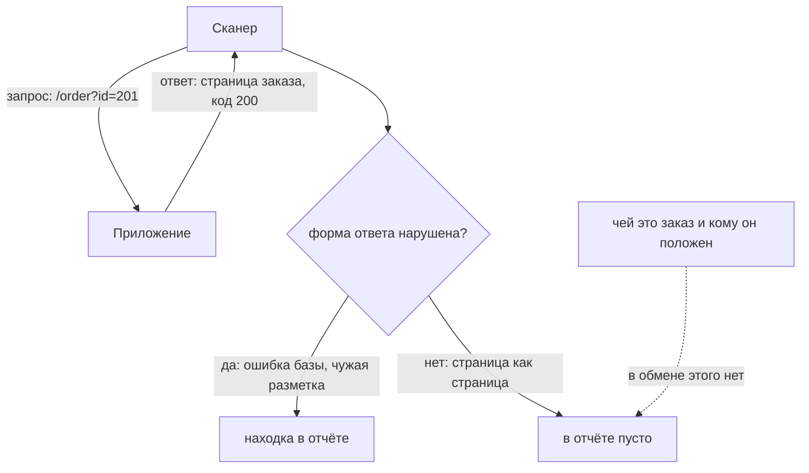

# Границы DAST: где метод бесполезен

В теме `zap-scanning` стенд «Лавка» прошёл полный прогон под входом: 2516
запросов, сорок инстансов в отчёте, и все четыре подставленные инъекции на
месте. После такого отчёта хочется написать «проверено». А приложение при
этом ломается руками за минуту: любой пользователь читает чужой заказ,
поменяв одну цифру в адресе. В стенд подставлено тринадцать дефектов. Трёх
из них в отчёте нет вовсе: чтения чужого заказа, доступа обычного
пользователя к списку пользователей и отрицательного количества в заказе.

Сканер при этом до всех трёх мест дошёл: к списку пользователей он обратился
24 раза, к оформлению заказа — 449 раз. То есть он не «не дошёл», а дошёл и
не увидел. Ниже разобрано, почему метод устроен именно так и какие классы
дефектов остаются за его границей. А ещё — как по журналу запросов отличить
«не нашёл» от «не дошёл» и как поставить замер, где тот же стенд прогоняют
два метода сразу.

## Как это работает

**Откуда это взялось.** Граница метода обнаружилась не в теории, а в
отчётах. Приложения, прошедшие сканирование начисто, ломались через доступ к
чужим данным и через обход шагов сценария. Разбирая такие случаи, к одному
выводу пришли с двух сторон. Инструмент видит пару «запрос — ответ» и
ничего кроме. Чтобы назвать ответ неверным, нужно знать, каким он должен был
быть. Это знание живёт в требованиях к приложению, а не в его трафике.
Руководство OWASP по тестированию говорит это прямо во введении [^1].
Полностью автоматическое тестирование не находит дефектов логики и контроля
доступа. Полагаться на прогон как на доказательство защищённости нельзя.

**Сначала сама идея.** Динамический сканер судит о приложении по одному
материалу: послал запрос, получил ответ. Про ответ он умеет сказать многое:
какой код, что в разметке, какие заголовки. Одного он сказать не умеет:
правильный ли это ответ по смыслу. Смысл — это то, чего в байтах нет.
Например, заказ с номером 201 принадлежит другому человеку, и показывать его
вам не положено. В ответе эта разница не записана.

Бытовой пример — гардероб. Вы сдаёте пальто и получаете номерок 101.
Гардеробщик, выдавая пальто, проверяет одно: номерок настоящий и пальто с
таким номером на месте. Сканер — такой гардеробщик. Пришёл номерок 201,
пальто висит — выдать. Что пальто чужое, а в гардеробе принято отдавать
своё, в номерке не написано. Соответствие прямое: номерок — это значение
параметра `id`, выданное пальто — ответ приложения, «чужое» — требование,
которое живёт вне обмена. Ломается аналогия на переборе. Живой гардеробщик
заподозрит человека, который перебирает номерки подряд. Сканер для
приложения — обычный посетитель, и двести номерков от него вопросов не
вызовут.



**Описание схемы.** Схема читается сверху вниз. Сканер шлёт запрос к чужому
заказу, приложение отвечает страницей с кодом 200. Дальше сканер проверяет
единственное, что умеет: нарушена ли форма ответа. Форма в порядке, и отчёт
остаётся пустым. Вопрос «чей это заказ» нарисован отдельно и соединён с
молчанием пунктиром: в паре «запрос — ответ» для него места нет.

**Четыре класса, которых у метода нет.** Дальше каждый класс — с местом, где
он сидел на стенде, и с причиной, по которой сканер его не видит. Номера в
скобках — из каталога CWE, общего словаря классов дефектов; вы встречали его
в `zap-scanning` и `sast-false-positives`.

**Первый класс: доступ к чужому объекту (`CWE-639`).** Сканер перебирает
значения параметра как форму: берёт увиденные номера и строит из них
производные. На стенде он послал на страницу заказа 215 значений параметра
`id`, и все они были производными от номеров 101 и 102, стоявших в ссылках
кабинета. Номер 201, заказ другого пользователя, не пробовался ни разу.
Чтобы его попробовать, надо знать, что чужие заказы существуют и видеть их
не положено. Этого знания в трафике нет.

**Второй класс: разница между ролями (`CWE-862`).** Ответ на запрос обычного
пользователя к списку пользователей — таблица с кодом 200. Ответ
администратора — та же таблица с тем же кодом. Разница между ними не в
форме, а в том, кому что положено. Инструмент, работающий от имени одного
пользователя, этой разницы не видит вовсе. От имени двух пользователей он
увидел бы её только в одном случае: если бы ему заранее объяснили, какая из
ролей права.

**Третий класс: логика предметной области (`CWE-841`).** Заказ на минус три
чайника вернул код 200 и строку «−7200 ₽». Всё правильной формы: числа на
месте, разметка цела, ошибок нет. Что отрицательный итог означает возврат
денег покупателю, знает предметная область, а не протокол. Такие дефекты
целиком разбирает тема `business-logic-flaws`.

**Четвёртый класс: то, что не проявляется снаружи.** Слабый алгоритм в
хранилище паролей, секрет в исходниках, ветка кода, до которой запрос не
доходит. Ответ приложения от всего этого не меняется ни в одном байте,
поэтому снаружи дефекта как будто и нет.

Общий признак у всех четырёх классов один: дефект не в ответе, а в отношении
между ответом и тем, кто его получил. Метод, который читает только ответ,
этого отношения не видит — как гардеробщик не видит, чьё пальто он выдал.
Дальше тема показывает этот вывод в замере: тот же стенд прогоняется
статическим анализом, и два списка находок встают рядом.

**Зачем это в работе AppSec-инженера.** Разговор о покрытии повторяется на
каждом обсуждении: «сканер прошёл, значит, проверено». Отвечать на это надо
списком, а не общими словами. Иначе четыре класса дефектов, которых у метода
нет в принципе, тихо переезжают в графу «проверено».

## Что умеет и чего не умеет

**Что метод умеет по устройству.** Всё, что проявляется в форме ответа.
Разметку, вернувшуюся неэкранированной. Ошибку базы на подставленной
кавычке. Содержимое файла, которого в ответе быть не должно. Отсутствующий
заголовок, флаги cookie, версию сервера. На стенде это десять дефектов из
тринадцати плюс один, которого никто не подставлял: отражение на странице
ошибки, где текст исключения печатается как есть.

**Чего метод не умеет по устройству.** Четыре класса из раздела выше. Ни
один из них не закрывается настройкой, набором правил или временем прогона.
Прогон на стенде шёл до конца и молчал. Это стоит услышать дословно, потому
что именно здесь метод путают с его настройкой.

**Чего метод не умеет по охвату, а не по устройству.** Это отдельная и более
частая беда, и путать её с первой не надо. Ручка без ссылки, страница за
входом, шаг сценария за тремя формами — всё это метод нашёл бы, если бы
дошёл. «Дошёл бы» закрывается настройкой: входом под пользователем, как в
`authenticated-scanning`, или описанием API, как в `api-scanning-openapi`. А
список из четырёх классов настройкой не закрывается.

## Как запустить

Сравнение двух методов делается на **одном и том же коде**. Иначе оно ничего
не значит: разные приложения дадут разные списки, и останется непонятным,
что сравнивалось — методы или приложения. Стенд «Лавка» — 412 строк на
Python, и оба прогона идут по нему одному.

Статическую сторону делает Semgrep версии 1.174.0. Вы встречали его в
`sast-false-positives`: это анализатор, который читает исходный код, не
запуская программу. Здесь он работает с локальным набором из трёх правил в
режиме распространения метки. Такое правило помечает значение, пришедшее из
запроса, и следит, не дойдёт ли метка до опасного вызова. Сети такой прогон
не требует. Динамическую сторону делает ZAP 2.17.0, сканер из `zap-scanning`.
Два плана: прогон под входом и прогон по описанию API.

```bash
# статический: три правила, источник — значение из запроса, сток — запрос,
# вывод в разметку и открытие файла
semgrep --config=rules.yaml --metrics=off --json -o semgrep.json app.py

# динамический: те же дефекты, вид снаружи
zap.sh -cmd -dir ./zaphome -autorun "$PWD/plan-auth-good.yaml"
zap.sh -cmd -dir ./zaphome -autorun "$PWD/plan-api.yaml"
```

У Semgrep ключ `--metrics=off` выключает отправку статистики, а `--json -o
semgrep.json` выгружает находки в файл. Пара `-cmd -autorun` и устройство
файлов плана разобраны в `zap-scanning`; оба плана повторяют запуск оттуда
один к одному.

Осталось свести находки. Правило одно: таблица по дефектам, а не сумма
чисел. Строка таблицы — дефект, колонка — инструмент. Складывать находки
бессмысленно, потому что инструменты называют их по-разному и на разных
уровнях. У одного находка — строка файла, у другого — адрес с параметром, и
«семь плюс сорок» не означает ничего.

## Как читать вывод

Вот результат замера целиком, строка на дефект:

```text
дефект                          ZAP снаружи   Semgrep по коду
отражённая разметка в поиске          да            да
инъекция в каталоге                   да            да
чтение файла по обойдённому пути      да            да
инъекция в API                        по описанию   да
чтение файла в API                    по описанию   да
хранимая разметка в заметке           да            НЕТ
нет заголовков безопасности           да            нет
cookie без флагов                     да            нет
версия сервера, текст исключения      да            нет
форма без токена                      да            нет
чтение чужого заказа                  НЕТ           НЕТ
доступ обычного пользователя к списку НЕТ           НЕТ
отрицательное количество              НЕТ           НЕТ
```

Читается таблица так. «Да» — метод нашёл дефект. «По описанию» — ZAP нашёл
ручку не обходом по ссылкам, а прогоном по описанию API, потому что ссылок
на неё на страницах нет. «Нет» строчными буквами — метод мимо такого класса
и не целился: заголовков и cookie у статического анализа нет по устройству.
«НЕТ» прописными — метод до дефекта дошёл и не увидел.

**Списки не пересекаются в обе стороны, и это главное в таблице.** У Semgrep
есть две находки в API, до которых обход по ссылкам не дошёл ни разу. У ZAP
— шесть классов, которых нет ни в одном правиле и быть не может. Это
заголовки, флаги cookie, версия сервера, отсутствие токена в форме, хранимая
разметка и отражение на странице ошибки. Ни один список не содержит другой.
Поэтому сумма чисел здесь не метрика: каждый метод видит свой кусок.

**Хранимая разметка — самый поучительный случай.** ZAP её нашёл. Semgrep не
нашёл ни с узким набором источников, ни с расширенным. Причина видна в коде:
помеченное значение записывается в словарь на сервере одним обработчиком, а
читается другим. Цепочка распространения метки рвётся на состоянии между
двумя запросами. ZAP нашёл её именно потому, что работает снаружи и во
времени: он выполнил оба запроса подряд, как живой пользователь.

**Шум у каждого свой.** У Semgrep из семи находок две ложные: обе на
выводе, который экранируется, но до которого метка дотянулась по цепочке. У
ZAP из сорока инстансов четыре ложных, два дубля по неверному адресу и
четыре информационных. Ложное срабатывание и пропуск — два конца одной
шкалы, а не свойства конкретного инструмента. В спецификации NIST они
определены для статического анализа ровно так же, как читаются здесь для
динамического [^2]. Как размечать такой шум у статического анализа,
показывает `sast-false-positives`.

У этой шкалы есть край, и в таблице он виден: три строки «НЕТ» лежат за ним.
Пропуск там не от настройки чувствительности — дефект не меняет формы
ответа, и срабатывать не на чем. **Три строки «НЕТ» в обеих колонках** — то,
ради чего таблица рисуется. Их не находит ни один из двух методов, и их надо
предъявлять как результат сравнения, а не как недоработку прогона.

Замер доводит главное утверждение темы до наблюдаемой формы: дефект, не
меняющий формы ответа, не находится даже там, куда инструмент дошёл.
Посмотрите на своё приложение. В каких строках такой таблицы оказалось бы
двойное «НЕТ»?

## Границы метода

**Граница первая: сравнение зависит от набора правил.** Три правила Semgrep
написаны под этот стенд. Промышленный набор нашёл бы больше, но не хранимую
разметку через состояние сервера: это свойство анализа, а не набора.

**Граница вторая: стенд маленький и известный.** Тринадцать подставленных
дефектов — не выборка из живого кода. Соотношение «десять из тринадцати
снаружи» на другом приложении будет другим. Переносится не число, а список
классов и причина каждого.

**Граница третья: «не нашёл» не всегда значит «не мог».** Отличить пропуск
по устройству от пропуска по охвату можно одним способом: проверить, дошёл
ли инструмент до места. Для этого служит журнал запросов — файл, куда
приложение записывает каждое обращение: откуда, куда и с каким ответом. 24
обращения к списку пользователей и 449 отправок формы заказа превращают
«сканер не нашёл» в «сканер дошёл и не увидел».

**Цена сравнения.** Полдня на стенд, где дефекты известны заранее. На живом
коде это дороже, и делается такая работа один раз. Результат — список
классов, которые на этом приложении закрываются не прогоном, а ревью и
тестами.

## Частая ошибка

Два метода рядом выглядят полным комплектом: статический анализ читает код,
динамическое сканирование смотрит снаружи, и вместе они вроде бы покрывают
приложение целиком. Сколько из тринадцати дефектов стенда покроет такое
объединение? Назовите число, прежде чем читать дальше.

**Они закрывают разные дыры и оставляют общую.** На стенде объединение двух
отчётов покрыло десять дефектов из тринадцати. Три оставшихся не нашёл
никто, и это ровно те три, что требуют знания, кому что положено. Третий
инструмент того же рода ничего здесь не изменит: у него та же слепая зона.

Контрпример к обратному выводу «значит, инструменты не нужны»: десять из
тринадцати дефектов найдены прогоном за минуты, и семь из них
воспроизводятся одной командой. Правильный вывод другой: **прогон закрывает
форму, а отношение закрывают люди**. Ревью прав доступа, тесты на чужой
объект, разбор сценария. Кому какие тесты писать, разбирают темы `idor`,
`privilege-escalation-vertical` и `business-logic-flaws`.

## Чеклист для ревью

1. Проверьте, что в отчёте о прогоне названы классы, которых метод не
   находит, а не только найденное.
2. Проверьте, что для каждого «не найдено» по журналу запросов проверено,
   дошёл ли инструмент до этого места.
3. Проверьте, что сравнение двух методов сделано на одном и том же коде и на
   одной и той же версии.
4. Проверьте, что находки не складываются в одно число, а сводятся по
   дефектам.
5. Проверьте, что доступ к чужому объекту и разница между ролями проверены
   отдельно, а не прогоном.
6. Проверьте, что вывод «проверено сканером» нигде не подменяет вывода
   «дефектов этого класса нет».

## Попробуй сам

Возьмите своё приложение и подставьте в него три дефекта: доступ к чужому
объекту, действие не по роли, нарушение правила предметной области. Прогоните
по нему динамический сканер и статический анализатор. Сведите находки в
таблицу по дефектам, как в разделе «Как читать вывод».

Одна подсказка. Чтобы «не нашёл» отличалось от «не дошёл», включите на
приложении журнал запросов и посчитайте обращения к каждому из трёх мест.

**Критерий выполнения** наблюдаемый. У вас есть таблица, где по каждому из
трёх подставленных дефектов стоит «нет» в обеих колонках. Рядом с каждым
«нет» — число обращений, доказывающее, что инструмент до места дошёл.

## Проверь себя

1. Сводная таблица сравнения двух методов, три строки не заполнены:

   ```text
   дефект                                ZAP снаружи   Semgrep по коду
   слабый примитив в хранилище паролей        ?              ?
   хранимая разметка в профиле                ?              ?
   чужой отчёт по прямому адресу              ?              ?
   ```

   Достройте их: что напечатает каждый метод?
2. Почему сканер, перебравший 215 значений номера заказа, не нашёл чтения
   чужого заказа?
3. Статический анализ и динамическое сканирование стоят вместе. Покрывают ли
   они приложение полностью?

   А. Да: один видит код, другой поведение — вместе полнота.

   Б. Нет: на стенде объединение покрыло десять дефектов из тринадцати, а три
      требуют знания, кому что положено.

   В. Да, если взять промышленный набор правил вместо учебного.

4. Не запуская, предскажите, что напечатает этот обработчик на трёх запросах —
   и какая из строк ответа дефектна.

   ```python
   def order_page(order_id, user):
       orders = {101: "anna", 102: "anna", 201: "boris"}
       if order_id not in orders:
           return 404, "нет такого"
       return 200, f"заказ {order_id}"   # владелец не проверяется

   for q in (101, 102, 201):
       print(q, "->", order_page(q, "anna"))
   ```

5. Возврат к теме `business-logic-flaws`: почему заказ на отрицательное
   количество не отличить от правильного по форме ответа?
6. Возврат к теме `sast-false-positives`: чем пропуск DAST по охвату похож на
   причину молчания «объект не попал в прогон»?

<details markdown="1">
<summary>Ответ 1</summary>

1. Слабый примитив: ZAP — НЕТ (ответ не меняется), Semgrep — да (форма вызова
   видна в коде). Хранимая разметка: ZAP — да (два запроса подряд во времени),
   Semgrep — НЕТ (цепочка метки рвётся на состоянии между запросами). Чужой
   отчёт: НЕТ у обоих — это отношение между ответом и тем, кто его получил, а
   не форма ни того ни другого.

</details>

<details markdown="1">
<summary>Ответ 2</summary>

2. Он перебирает значения как форму — производные от увиденных `101` и `102`.
   Чтобы попробовать `201`, надо знать, что бывают чужие заказы и что видеть
   их не положено; такого знания в трафике нет. Причина не в настройке: это
   граница метода.

</details>

<details markdown="1">
<summary>Ответ 3: разбор вариантов</summary>

3. Верный ответ — Б.

   А. У обоих методов общая слепая зона: дефект, не меняющий формы ответа и не
      записанный формой кода. Доступ к чужому объекту и логика лежат в ней у
      обоих.

   Б. Прогон закрывает форму, а отношение закрывают люди: ревью прав доступа,
      тесты на чужой объект, разбор сценария. Список классов предъявляется как
      результат сравнения, а не как недоработка.

   В. Набор шире нашёл бы больше, но не хранимую разметку через состояние.
      Она не нашлась и на расширенном наборе источников, потому что это
      свойство анализа, а не набора.

</details>

<details markdown="1">
<summary>Ответ 4</summary>

4. Все три строки — код 200: `101 -> (200, 'заказ 101')`, дальше так же. По
   форме ответа заказ 201 неотличим от своих, а отдан он чужому — это и есть
   дефект. Ответ получен прогоном: `python3 idor_demo.py`.

</details>

<details markdown="1">
<summary>Ответ 5</summary>

5. Числа на месте, разметка цела, код 200. Что отрицательный итог означает
   возврат денег, знает предметная область, а не протокол: пара
   «запрос — ответ» этого не несёт.

</details>

<details markdown="1">
<summary>Ответ 6</summary>

6. Объект не попал в прогон — значит, молчание ничего не доказывает. Ручка без
   ссылки или без описания для DAST — то же самое: инструмент не дошёл, а
   отчёт зелёный. Различает «не дошёл» от «дошёл и не увидел» журнал
   запросов.

</details>

## Источники

1. OWASP, «Web Security Testing Guide v4.2, Introduction: The Web Security
   Testing Framework»; реестр `wstg-v42-introduction`. Разделы: границы
   автоматического тестирования, перечень того, чего автоматика не находит
   (логика, контроль доступа, проектные решения), предупреждение о ложном
   чувстве защищённости от прогона инструмента.
   <https://owasp.org/www-project-web-security-testing-guide/v42/2-Introduction/README>
2. NIST, «Source Code Security Analysis Tool Functional Specification»,
   SP 500-268 версии 1.1; реестр `nist-sp-500-268`. Разделы: определения
   ложного срабатывания и пропуска.
   <https://www.nist.gov/publications/source-code-security-analysis-tool-functional-specification-version-11>

Каркас этапа: `cwe-taxonomy`. Наследуется всеми темами и отдельной строкой не
повторяется.

**Скоропортящийся слой.** Версии инструментов и конкретные числа замера.
Перечень классов, которых метод не находит, и причина каждого держатся, пока
метод читает только пару «запрос — ответ».

**Маркеры уверенности.** Все числа сравнения сняты **лично** 2026-08-25 на
стенде из тринадцати подставленных дефектов: ZAP 2.17.0 — 2516 запросов, 40
инстансов, 215 значений номера заказа, 24 обращения к списку пользователей, 449
отправок формы заказа; Semgrep версии 1.174.0, локальный набор из трёх
правил — 7 находок, из них 2 ложные, и пропуск хранимой разметки, проверенный
отдельно на расширенном наборе источников. Утверждение о границах
автоматического тестирования — **по документации** OWASP WSTG v4.2, открытой
лично 2026-08-25; определения ложного срабатывания и пропуска — **по
документации** NIST SP 500-268 v1.1. Поведение промышленных наборов правил
статического анализа **не воспроизводилось**: набор писался под этот стенд.
Листинг из вопроса 4 прогнан повторно 2026-10-03, Python 3.14.7; вывод совпал
дословно.

[^1]: OWASP WSTG v4.2, «Introduction», реестр `wstg-v42-introduction`.
[^2]: NIST SP 500-268 v1.1, реестр `nist-sp-500-268`.
